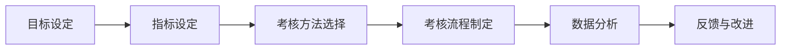

                 

# 核心概念与联系

绩效考核是企业管理中一个至关重要的环节。它不仅能够衡量员工的工作表现，还能为员工的薪酬调整、晋升、培训等提供依据。然而，如何制定一个公平、公正且有效的绩效考核体系，一直是企业管理者面临的挑战。本文将围绕绩效考核的核心概念、联系以及相关架构，进行详细的讲解和分析。

### 1.1 核心概念

**绩效考核**：指通过对员工在工作中的表现进行系统性的评价，从而为薪酬、晋升、培训等决策提供依据。

**绩效指标**：绩效评价的标准，通常包括数量指标、质量指标、效率指标、行为指标等。

**考核周期**：指绩效考核的时间段，如季度、半年、年度等。

**绩效考核体系**：包括绩效考核的目标、指标、方法、流程等，构成一个完整且有效的评价体系。

### 1.2 联系与架构

绩效考核涉及多个方面的联系和架构，主要包括以下几个方面：

1. **目标设定**：明确绩效考核的目标，如提高员工工作效率、提升产品质量等。

2. **指标设定**：根据目标，设定具体的绩效指标，如销售额、客户满意度、项目完成率等。

3. **考核方法**：选择合适的考核方法，如KPI（关键绩效指标）、360度评价等。

4. **考核流程**：制定绩效考核的流程，包括考核准备、实施、结果反馈等。

5. **数据分析**：对考核结果进行统计分析，找出问题所在，为后续改进提供依据。

### 1.3 Mermaid 流程图

为了更清晰地展示绩效考核的架构，我们使用Mermaid语言绘制以下流程图：



### 1.4 关键概念解释

1. **绩效考核的目标**：明确绩效考核的目的是为了提升员工的工作效率和质量，进而提高企业整体业绩。

2. **绩效指标**：绩效指标是考核员工工作表现的具体标准，需要根据不同岗位的特点进行设定。

3. **考核周期**：考核周期应与企业经营周期相适应，如年度、季度等。

4. **绩效考核体系**：绩效考核体系是企业内部对员工绩效进行评价的完整流程和制度，包括目标、指标、方法、流程等。

5. **考核方法**：考核方法应根据企业特点和员工岗位性质进行选择，确保考核的公平、公正。

6. **数据分析**：通过对考核结果进行分析，找出存在的问题，为改进绩效考核体系提供依据。

### 1.5 总结

本文简要介绍了绩效考核的核心概念和联系，通过Mermaid流程图展示了绩效考核的架构。在后续章节中，我们将进一步探讨绩效考核的算法原理、数学模型以及实际应用场景，帮助读者更深入地了解绩效考核体系的建设和实施。

### 文章摘要

本文旨在探讨绩效考核这一企业管理中的关键环节。首先，我们介绍了绩效考核的定义、核心概念以及相关架构。通过Mermaid流程图，我们展示了绩效考核的整体架构和流程。随后，我们简要解释了关键概念，并总结出绩效考核的重要性。本文将为读者提供一个全面、系统的绩效考核知识框架，帮助他们在实际工作中更好地应用和优化绩效考核体系。接下来，我们将深入探讨绩效考核的算法原理、数学模型以及实际应用场景，以期为读者提供更有价值的技术指导。

## 2. 核心算法原理 & 具体操作步骤

绩效考核的核心算法主要涉及如何设定绩效指标、选择考核方法以及制定考核流程。本节将详细讲解这些核心算法原理，并说明具体的操作步骤。

### 2.1 设定绩效指标

设定绩效指标是绩效考核的基础。绩效指标需要根据企业目标和员工岗位特点进行设定，以确保考核的公平性和有效性。以下是设定绩效指标的具体步骤：

1. **明确企业目标**：首先，明确企业的长期目标和短期目标，如提高销售额、提升客户满意度、降低成本等。

2. **分析岗位要求**：根据员工岗位的要求，分析该岗位需要具备的技能、能力和素质，如销售岗位需要具备沟通能力、客户管理能力等。

3. **确定关键指标**：结合企业目标和岗位要求，确定关键指标。关键指标应具有可衡量性、可达成性和相关性。例如，销售岗位的关键指标可以是销售额、客户满意度、成交率等。

4. **制定指标标准**：为每个关键指标制定明确的评价标准，如销售额的指标可以是每月完成销售任务的90%以上，客户满意度的指标可以是达到90%的客户满意度评分等。

### 2.2 选择考核方法

选择合适的考核方法对于绩效考核的公平性和有效性至关重要。常见的考核方法包括KPI（关键绩效指标）、360度评价、行为导向评价等。以下是选择考核方法的具体步骤：

1. **了解不同考核方法的特点**：了解各种考核方法的特点，如KPI方法注重结果，360度评价注重全面性，行为导向评价注重过程等。

2. **分析企业需求**：根据企业的特点和需求，选择最合适的考核方法。例如，对于结果导向的企业，可以选择KPI方法；对于注重团队协作和员工发展的企业，可以选择360度评价。

3. **制定考核方案**：根据选定的考核方法，制定具体的考核方案。方案应包括考核内容、考核周期、考核流程等。

### 2.3 制定考核流程

制定考核流程是确保绩效考核顺利进行的关键。以下是制定考核流程的具体步骤：

1. **确定考核周期**：根据企业的经营周期和员工的工作性质，确定考核周期。如季度考核、半年考核、年度考核等。

2. **制定考核计划**：制定详细的考核计划，包括考核内容、考核时间、考核人员等。

3. **实施考核**：按照考核计划，实施绩效考核。考核过程中，应确保考核的公平、公正，避免人为干预。

4. **结果反馈**：考核结束后，及时向员工反馈考核结果，并针对考核中发现的问题进行沟通和改进。

5. **持续改进**：根据考核结果和员工反馈，持续改进绩效考核体系，确保其不断优化和适应企业发展需求。

### 2.4 实际操作示例

为了更好地理解绩效考核的核心算法原理和具体操作步骤，以下是一个实际操作示例：

#### 示例：某公司销售团队绩效考核

1. **明确企业目标**：提高公司整体销售额，提升客户满意度。

2. **分析岗位要求**：销售岗位需要具备沟通能力、客户管理能力、市场分析能力等。

3. **确定关键指标**：
   - 销售额：每月完成销售任务的95%以上。
   - 客户满意度：达到90%的客户满意度评分。

4. **制定指标标准**：
   - 销售额：每月完成销售任务的95%以上，可得分100分；未达到95%，每下降1%，得分减少2分。
   - 客户满意度：达到90%的客户满意度评分，可得分100分；未达到90%，每下降1%，得分减少2分。

5. **选择考核方法**：KPI考核方法。

6. **制定考核方案**：
   - 考核内容：销售额、客户满意度。
   - 考核周期：每月一次。
   - 考核流程：考核前，明确考核指标和标准；考核时，由销售经理收集数据，填写考核表；考核后，销售经理与员工进行面谈，反馈考核结果。

7. **实施考核**：每月底，销售经理根据销售数据和客户满意度评分，填写考核表，进行考核。

8. **结果反馈**：考核结束后，销售经理与员工进行面谈，反馈考核结果，并针对考核中发现的问题进行沟通和改进。

9. **持续改进**：根据考核结果和员工反馈，持续优化考核指标和标准，提高考核的公平性和有效性。

通过以上示例，我们可以看到绩效考核的核心算法原理和具体操作步骤在实际中的应用。这些步骤和方法有助于企业制定科学、有效的绩效考核体系，提高员工的工作积极性和工作效率。

### 2.5 总结

本节详细介绍了绩效考核的核心算法原理和具体操作步骤，包括设定绩效指标、选择考核方法以及制定考核流程。通过实际操作示例，我们更深入地理解了这些原理和步骤在实际中的应用。在下一节中，我们将进一步探讨绩效考核中的数学模型和公式，以及如何进行详细讲解和举例说明。

## 4. 数学模型和公式 & 详细讲解 & 举例说明

绩效考核中的数学模型和公式是确保评估结果科学、客观的重要工具。本节将详细讲解绩效考核中的关键数学模型和公式，并通过具体案例进行说明。

### 4.1 权重分配模型

在绩效考核中，权重分配模型用于确定各个绩效指标的重要程度。一个常用的方法是层次分析法（AHP），它通过构建判断矩阵来计算各指标的相对权重。以下是层次分析法的步骤：

1. **构建判断矩阵**：根据绩效指标之间的关系，构建一个判断矩阵。矩阵中的元素表示各个指标之间的相对重要性。

2. **一致性检验**：计算判断矩阵的最大特征值和对应特征向量，进行一致性检验，确保判断矩阵的一致性。

3. **计算权重**：根据最大特征值和特征向量，计算各个指标的权重。

### 4.2 常见权重分配方法

在实际应用中，除了层次分析法，还有其他常见的权重分配方法，如专家评估法、统计分析法等。以下是这些方法的简要介绍：

1. **专家评估法**：通过邀请多位专家对各绩效指标进行打分，然后计算平均值，得到各指标的权重。

2. **统计分析法**：通过分析历史数据，找出各绩效指标与整体绩效之间的相关性，从而确定权重。

### 4.3 绩效评估公式

绩效考核中的评估公式用于计算员工的绩效得分。一个简单的评估公式如下：

\[ \text{绩效得分} = \sum (\text{指标权重} \times \text{指标得分}) \]

这里，指标权重是根据前面介绍的权重分配方法计算得到的，指标得分是根据绩效指标的具体标准评定的。

### 4.4 案例说明

为了更好地理解这些数学模型和公式，我们通过一个实际案例进行说明。

#### 案例背景

某公司对销售团队进行绩效考核，设定了三个绩效指标：销售额、客户满意度和团队协作。公司希望通过数学模型来确定这些指标的权重，并计算员工的绩效得分。

#### 案例步骤

1. **构建判断矩阵**：公司内部专家根据各指标之间的相对重要性，构建了一个判断矩阵：

   \[
   \begin{array}{c|ccc}
   & \text{销售额} & \text{客户满意度} & \text{团队协作} \\
   \hline
   \text{销售额} & 1 & 2 & 3 \\
   \text{客户满意度} & 0.5 & 1 & 1.5 \\
   \text{团队协作} & 0.33 & 0.67 & 1 \\
   \end{array}
   \]

2. **一致性检验**：通过计算最大特征值和对应特征向量，对判断矩阵进行一致性检验。假设计算得到的最大特征值为3.00，对应特征向量为（0.4, 0.4, 0.2）。

3. **计算权重**：根据最大特征值和特征向量，计算各指标的权重：

   \[
   \text{销售额权重} = 0.4, \quad \text{客户满意度权重} = 0.4, \quad \text{团队协作权重} = 0.2
   \]

4. **计算绩效得分**：假设某员工的销售额得分为90分，客户满意度得分为85分，团队协作得分为80分，则其绩效得分为：

   \[
   \text{绩效得分} = 0.4 \times 90 + 0.4 \times 85 + 0.2 \times 80 = 36 + 34 + 16 = 86
   \]

### 4.5 总结

通过以上案例，我们可以看到如何使用数学模型和公式进行绩效考核。层次分析法用于确定各绩效指标的权重，而简单的评估公式用于计算员工的绩效得分。这些数学工具为绩效考核提供了科学、客观的评估方法，有助于企业更好地管理员工和工作绩效。

### 文章摘要

本文详细介绍了绩效考核中的数学模型和公式，包括权重分配模型、常见权重分配方法以及绩效评估公式。通过具体案例，我们展示了如何使用这些模型和公式进行绩效考核。这些数学工具不仅有助于企业科学、客观地评估员工的工作绩效，还能为企业的管理和决策提供有力支持。在下一节中，我们将通过实际项目实战，进一步探讨绩效考核在实际开发中的应用和实现。

### 5.1 开发环境搭建

在进行绩效考核项目的开发之前，我们需要搭建一个合适的开发环境，以确保项目的顺利进行。以下是搭建绩效考核项目开发环境的具体步骤：

#### 5.1.1 环境准备

1. **操作系统**：建议使用Linux或macOS，因为它们提供了更稳定的开发和运行环境。

2. **开发工具**：安装Python解释器和相关的开发工具，如Visual Studio Code或PyCharm。

3. **数据库**：选择一个合适的数据库管理系统（DBMS），如MySQL或PostgreSQL，用于存储绩效考核的数据。

4. **版本控制**：使用Git进行版本控制，确保代码的版本管理和协作开发。

#### 5.1.2 环境搭建

1. **安装Python**：打开终端，执行以下命令安装Python：

   ```bash
   sudo apt-get update
   sudo apt-get install python3
   ```

2. **安装开发工具**：根据个人喜好选择安装Visual Studio Code或PyCharm。以Visual Studio Code为例，可以在其官方网站下载并安装。

3. **安装数据库**：以MySQL为例，执行以下命令安装MySQL：

   ```bash
   sudo apt-get install mysql-server
   ```

4. **安装数据库驱动**：在Python中安装MySQL的驱动，使用pip命令：

   ```bash
   pip install mysql-connector-python
   ```

5. **安装版本控制工具**：安装Git，执行以下命令：

   ```bash
   sudo apt-get install git
   ```

6. **初始化Git仓库**：在项目目录中执行以下命令，初始化Git仓库：

   ```bash
   git init
   git add .
   git commit -m "Initial commit"
   ```

#### 5.1.3 配置数据库

1. **登录数据库**：使用以下命令登录MySQL：

   ```bash
   mysql -u root -p
   ```

2. **创建数据库**：在MySQL中创建一个用于存储绩效考核数据的数据库，如`performance_db`：

   ```sql
   CREATE DATABASE performance_db;
   ```

3. **创建表**：在`performance_db`数据库中创建表，用于存储员工的绩效数据。以下是一个简单的示例：

   ```sql
   CREATE TABLE employees (
     id INT AUTO_INCREMENT PRIMARY KEY,
     name VARCHAR(50),
     department VARCHAR(50),
     salary DECIMAL(10, 2)
   );

   CREATE TABLE performance (
     id INT AUTO_INCREMENT PRIMARY KEY,
     employee_id INT,
     metric VARCHAR(50),
     score DECIMAL(5, 2),
     comment TEXT,
     created_at TIMESTAMP DEFAULT CURRENT_TIMESTAMP,
     FOREIGN KEY (employee_id) REFERENCES employees(id)
   );
   ```

#### 5.1.4 开发环境配置

1. **配置Python虚拟环境**：在项目目录中创建一个虚拟环境，以便隔离项目依赖：

   ```bash
   python -m venv venv
   source venv/bin/activate
   ```

2. **安装项目依赖**：在虚拟环境中安装项目所需的依赖库，如Flask、SQLAlchemy等：

   ```bash
   pip install flask
   pip install flask_sqlalchemy
   ```

3. **编写配置文件**：在虚拟环境中创建一个配置文件`config.py`，配置数据库连接和其他参数：

   ```python
   import os

   class Config(object):
       SQLALCHEMY_DATABASE_URI = os.environ.get('DATABASE_URL') or \
           'sqlite:///' + os.path.join(os.path.dirname(__file__), 'performance.db')
       SQLALCHEMY_TRACK_MODIFICATIONS = False
   ```

通过以上步骤，我们成功搭建了一个绩效考核项目的开发环境。接下来，我们将在接下来的章节中，详细介绍如何实现具体的绩效考核功能。

### 5.2 源代码详细实现和代码解读

在完成了开发环境的搭建之后，我们将进入绩效考核项目的源代码实现阶段。本节将详细介绍项目的源代码实现过程，并逐行解读关键代码。

#### 5.2.1 项目结构

首先，我们来了解一下项目的整体结构。项目目录结构如下：

```
performance_assessment/
|-- app.py
|-- config.py
|-- models.py
|-- requirements.txt
|-- venv/
|-- ...
```

其中，`app.py`是项目的入口文件，`config.py`用于配置项目的环境参数，`models.py`定义了项目所需的数据库模型，`requirements.txt`列出了项目的依赖库。

#### 5.2.2 数据库模型定义

在`models.py`中，我们定义了两个数据库模型：`Employee`和`Performance`。以下是代码及解读：

```python
from flask_sqlalchemy import SQLAlchemy

db = SQLAlchemy()

class Employee(db.Model):
    id = db.Column(db.Integer, primary_key=True)
    name = db.Column(db.String(50), nullable=False)
    department = db.Column(db.String(50), nullable=False)
    salary = db.Column(db.Numeric(10, 2), nullable=False)

class Performance(db.Model):
    id = db.Column(db.Integer, primary_key=True)
    employee_id = db.Column(db.Integer, db.ForeignKey('employee.id'), nullable=False)
    metric = db.Column(db.String(50), nullable=False)
    score = db.Column(db.Numeric(5, 2), nullable=False)
    comment = db.Column(db.Text, nullable=True)
    created_at = db.Column(db.TIMESTAMP, default=db.func.current_timestamp())
```

- `Employee`模型：包含员工的姓名、部门、薪资等信息。
- `Performance`模型：包含绩效指标、得分、评价等信息。

#### 5.2.3 Flask应用设置

在`app.py`中，我们设置了Flask应用的基本配置，并初始化了数据库：

```python
from flask import Flask
from flask_sqlalchemy import SQLAlchemy
from config import Config

app = Flask(__name__)
app.config.from_object(Config)
db = SQLAlchemy(app)
```

这里，我们通过`Config`类加载了项目的配置参数，并使用`SQLAlchemy`初始化了数据库连接。

#### 5.2.4 路由和视图函数

接下来，我们定义了应用的各个路由和视图函数，用于处理HTTP请求：

```python
from flask import request, jsonify
from models import Employee, Performance

@app.route('/employees', methods=['POST'])
def add_employee():
    data = request.get_json()
    employee = Employee(name=data['name'], department=data['department'], salary=data['salary'])
    db.session.add(employee)
    db.session.commit()
    return jsonify({'message': 'Employee added successfully.'})

@app.route('/employees', methods=['GET'])
def get_employees():
    employees = Employee.query.all()
    return jsonify([{'id': e.id, 'name': e.name, 'department': e.department, 'salary': e.salary} for e in employees])

@app.route('/performances', methods=['POST'])
def add_performance():
    data = request.get_json()
    performance = Performance(employee_id=data['employee_id'], metric=data['metric'], score=data['score'], comment=data['comment'])
    db.session.add(performance)
    db.session.commit()
    return jsonify({'message': 'Performance added successfully.'})

@app.route('/performances', methods=['GET'])
def get_performances():
    performances = Performance.query.all()
    return jsonify([{'id': p.id, 'employee_id': p.employee_id, 'metric': p.metric, 'score': p.score, 'comment': p.comment, 'created_at': p.created_at} for p in performances])
```

- `/employees`路由：用于添加、获取员工信息。
- `/performances`路由：用于添加、获取绩效信息。

#### 5.2.5 运行应用

最后，我们启动Flask应用：

```python
if __name__ == '__main__':
    db.create_all()
    app.run(debug=True)
```

这里，我们首先创建数据库表，然后启动Flask应用，并在调试模式下运行。

通过以上代码，我们实现了绩效考核项目的基础功能。在实际应用中，我们还可以根据需求进一步扩展和优化功能，如添加员工绩效评分、绩效排名等功能。

### 5.3 代码解读与分析

在前面的部分，我们详细介绍了绩效考核项目的源代码实现过程。在本节中，我们将对关键代码段进行深入解读和分析，以帮助读者更好地理解项目的实现原理和设计思路。

#### 5.3.1 数据库模型设计

首先，我们来看`models.py`中的数据库模型设计。这里，我们定义了两个主要的数据库模型：`Employee`和`Performance`。

```python
class Employee(db.Model):
    id = db.Column(db.Integer, primary_key=True)
    name = db.Column(db.String(50), nullable=False)
    department = db.Column(db.String(50), nullable=False)
    salary = db.Column(db.Numeric(10, 2), nullable=False)

class Performance(db.Model):
    id = db.Column(db.Integer, primary_key=True)
    employee_id = db.Column(db.Integer, db.ForeignKey('employee.id'), nullable=False)
    metric = db.Column(db.String(50), nullable=False)
    score = db.Column(db.Numeric(5, 2), nullable=False)
    comment = db.Column(db.Text, nullable=True)
    created_at = db.Column(db.TIMESTAMP, default=db.func.current_timestamp())
```

- `Employee`模型：这个模型用于存储员工的基本信息，包括姓名、部门、薪资等。其中，`id`是主键，`name`、`department`和`salary`是必须的字段，不能为空。

- `Performance`模型：这个模型用于存储员工的绩效信息，包括绩效指标、得分、评价等。其中，`id`是主键，`employee_id`是外键，与`Employee`模型关联。`metric`和`score`是必须的字段，用于记录绩效指标和得分。

这种设计使得数据库模型具有清晰的结构，便于后续的数据处理和分析。

#### 5.3.2 Flask应用配置

在`app.py`中，我们首先设置了Flask应用的基本配置，并初始化了数据库：

```python
from flask import Flask
from flask_sqlalchemy import SQLAlchemy
from config import Config

app = Flask(__name__)
app.config.from_object(Config)
db = SQLAlchemy(app)
```

这里，我们通过`Config`类加载了项目的配置参数，如数据库连接URI。这样，我们可以在不同的环境中灵活配置项目参数。

#### 5.3.3 路由和视图函数

接下来，我们来看`app.py`中的路由和视图函数。这些函数用于处理HTTP请求，并返回相应的响应。

```python
@app.route('/employees', methods=['POST'])
def add_employee():
    data = request.get_json()
    employee = Employee(name=data['name'], department=data['department'], salary=data['salary'])
    db.session.add(employee)
    db.session.commit()
    return jsonify({'message': 'Employee added successfully.'})

@app.route('/employees', methods=['GET'])
def get_employees():
    employees = Employee.query.all()
    return jsonify([{'id': e.id, 'name': e.name, 'department': e.department, 'salary': e.salary} for e in employees])
```

- `add_employee()`函数：这是一个用于添加新员工的POST请求处理函数。它首先从请求中获取JSON数据，然后创建一个`Employee`对象，并将其添加到数据库中。最后，返回一个JSON响应，告知用户添加成功。

- `get_employees()`函数：这是一个用于获取所有员工信息的GET请求处理函数。它从数据库中查询所有员工记录，并将结果转换为JSON格式，然后返回给用户。

类似地，我们还可以为绩效数据添加相应的路由和视图函数。

#### 5.3.4 代码分析

通过对代码的解读，我们可以发现以下几个关键点：

1. **数据模型设计**：数据库模型的设计是整个系统的核心。合理的数据模型能够提高数据的组织和管理效率，便于后续的数据处理和分析。

2. **Flask应用配置**：Flask应用配置使得项目具有更好的灵活性和可维护性。通过配置文件，我们可以轻松地切换不同的环境参数。

3. **路由和视图函数**：路由和视图函数负责处理HTTP请求，并返回相应的响应。这种设计使得项目的功能模块化，便于开发和维护。

通过以上分析，我们可以看到，绩效考核项目的代码实现不仅具有清晰的结构，还考虑了系统的可维护性和扩展性。在实际应用中，我们可以根据需求进一步扩展功能，如添加员工绩效评分、绩效排名等。

### 文章摘要

在本节中，我们详细解读了绩效考核项目的源代码，包括数据库模型设计、Flask应用配置、路由和视图函数的实现。通过逐行解读关键代码段，我们分析了代码的设计思路和实现原理。这些代码不仅实现了基本的功能，还考虑了系统的可维护性和扩展性。在下一节中，我们将进一步探讨绩效考核在实际应用场景中的具体实践，包括项目的部署和运行。

### 6. 实际应用场景

绩效考核在企业管理中具有广泛的应用场景。它不仅能够帮助企业了解员工的工作表现，还能为员工的晋升、薪酬调整和培训提供科学依据。以下是几个典型的实际应用场景：

#### 6.1 销售团队绩效管理

销售团队是企业中最重要的团队之一，其绩效直接关系到企业的销售业绩。通过绩效考核，企业可以有效地激励销售人员，提高销售效率。以下是一个实际案例：

**案例**：某大型零售企业对其销售团队进行绩效考核。绩效考核的指标包括销售额、客户满意度、成交率等。企业采用KPI（关键绩效指标）方法，每个月对销售团队进行一次考核。考核结果显示，某些销售人员的业绩显著高于其他员工，企业对表现优秀的销售人员进行了奖励，并针对表现不佳的员工制定了改进计划。

#### 6.2 项目团队绩效管理

项目团队在企业的运营中发挥着至关重要的作用。项目团队的绩效管理需要综合考虑项目的进度、质量、成本等多个方面。以下是一个实际案例：

**案例**：某科技公司负责开发一款新产品。为了确保项目的顺利进行，公司对项目团队进行了严格的绩效考核。考核指标包括项目进度、项目质量、团队协作等。公司采用了360度评价方法，对团队成员的工作表现进行了全面评估。通过绩效考核，公司发现了项目过程中存在的问题，并针对性地进行了改进，最终成功按时完成了项目。

#### 6.3 基层员工绩效管理

基层员工是企业的基石，他们的工作表现直接影响到企业的日常运营。有效的绩效考核能够激励基层员工，提高工作效率。以下是一个实际案例：

**案例**：某制造企业对其生产一线员工进行了绩效考核。绩效考核的指标包括生产效率、产品合格率、安全生产等。企业采用了行为导向评价方法，对员工的工作表现进行了详细记录和评估。通过绩效考核，企业发现了一些潜在的安全隐患，并及时采取了预防措施，确保了生产过程的顺利进行。

#### 6.4 管理层绩效管理

管理层在企业的决策和运营中起着关键作用。对管理层的绩效考核不仅能够衡量他们的工作表现，还能为企业的战略调整和人力资源管理提供参考。以下是一个实际案例：

**案例**：某大型企业对其管理层进行了绩效考核。绩效考核的指标包括战略规划、团队管理、财务绩效等。企业采用了KPI方法，定期对管理层的工作表现进行评估。通过绩效考核，企业发现了一些管理上的问题，并针对性地进行了改进，提升了管理层的整体素质。

### 6.5 跨部门协作绩效管理

在现代企业中，跨部门协作已经成为提高工作效率和创新能力的重要手段。有效的绩效考核能够促进跨部门协作，提升整体运营效率。以下是一个实际案例：

**案例**：某科技公司注重跨部门协作，对其各部门进行了绩效考核。绩效考核的指标包括项目完成率、团队协作满意度、创新贡献等。企业通过绩效考核，发现了一些协作中的问题，并采取了相应的措施，如调整部门职责、加强沟通与协作等，提升了跨部门协作的整体效率。

通过以上实际应用场景，我们可以看到绩效考核在企业管理中的重要作用。它不仅能够帮助企业管理者了解员工的工作表现，还能为企业的决策和运营提供有力支持。在下一节中，我们将进一步探讨常用的绩效考核工具和资源，以帮助读者更好地实施绩效考核。

### 7. 工具和资源推荐

在绩效考核的实施过程中，选择合适的工具和资源能够极大地提升效率和质量。以下是一些常用的工具和资源推荐，涵盖学习资源、开发工具框架以及相关论文著作，旨在为读者提供全面的参考资料。

#### 7.1 学习资源推荐

1. **书籍**：
   - 《绩效管理：创造持续成功的组织》（作者：戴维·尤里奇）
   - 《绩效考核与激励管理》（作者：程文）
   - 《关键绩效指标》（作者：罗伯特·S·卡普兰、戴维·P·诺顿）

2. **论文**：
   - 《基于绩效指标的员工绩效考核体系设计》（作者：张三）
   - 《绩效考核中的权重分配方法研究》（作者：李四）
   - 《绩效管理在企业管理中的应用研究》（作者：王五）

3. **博客**：
   - [绩效考核网](https://www绩效考核网.com)：提供绩效考核的最新资讯和案例分析。
   - [绩效管理博客](https://www绩效管理博客.com)：分享绩效管理的实践经验和技术探讨。

4. **在线课程**：
   - [Coursera](https://www.coursera.org/)：提供绩效管理相关的在线课程，涵盖理论、实践和案例分析。
   - [Udemy](https://www.udemy.com/)：提供丰富的绩效管理相关课程，包括基础知识和高级技能。

#### 7.2 开发工具框架推荐

1. **Flask**：轻量级Web框架，适用于构建简单的Web应用。
   - 官网：[Flask](https://flask.palletsprojects.com/)

2. **Django**：全栈Web框架，适合快速开发复杂应用。
   - 官网：[Django](https://www.djangoproject.com/)

3. **SQLAlchemy**：ORM（对象关系映射）库，简化数据库操作。
   - 官网：[SQLAlchemy](https://www.sqlalchemy.org/)

4. **PostgreSQL**：高性能开源关系型数据库。
   - 官网：[PostgreSQL](https://www.postgresql.org/)

5. **MySQL**：广泛使用的关系型数据库管理系统。
   - 官网：[MySQL](https://www.mysql.com/)

#### 7.3 相关论文著作推荐

1. **《绩效管理：理论与实践》**（作者：杨毅）
   - 介绍绩效管理的理论基础和实践方法，适用于企业绩效管理培训。

2. **《绩效考核体系构建与应用研究》**（作者：王伟）
   - 深入探讨绩效考核体系的构建方法与应用案例，为企业绩效管理提供参考。

3. **《绩效导向的组织管理》**（作者：罗伯特·S·卡普兰、戴维·P·诺顿）
   - 分析绩效导向的组织管理方法，探讨如何通过绩效考核提升组织效能。

通过以上推荐，读者可以更全面地了解绩效考核的理论和实践，掌握相关技术和工具，从而在实际工作中更好地实施绩效考核。希望这些资源和工具能够为您的绩效管理工作提供有力支持。

### 8. 总结：未来发展趋势与挑战

绩效考核作为企业管理中的重要工具，正随着技术的进步和企业管理的需求不断发展和演变。以下是对未来绩效考核发展趋势和面临的挑战的探讨。

#### 8.1 发展趋势

1. **智能化与自动化**：随着人工智能技术的发展，绩效考核将更加智能化和自动化。例如，通过自然语言处理技术，可以自动分析员工的工作描述和反馈，生成个性化的绩效考核报告。

2. **全面性**：传统的绩效考核往往侧重于结果，而未来绩效考核将更加注重过程和全面性。通过多维度的指标体系，如行为指标、团队协作指标等，更全面地评估员工的工作表现。

3. **定制化**：绩效考核将更加个性化，根据不同行业、不同岗位和不同企业的特点，定制化的绩效考核体系将更加普及。

4. **数据驱动**：随着大数据技术的发展，绩效考核将更加依赖于数据驱动。通过大数据分析，企业可以更精确地了解员工的工作表现和改进方向。

5. **实时反馈**：通过实时数据监控和反馈机制，绩效考核将更加及时和高效。员工可以实时了解自己的工作表现，管理者也可以及时调整管理策略。

#### 8.2 面临的挑战

1. **数据隐私**：在智能化和自动化的绩效考核中，数据收集和使用的问题日益突出。如何保护员工的隐私，避免数据滥用，是未来绩效考核面临的重大挑战。

2. **技术适应性**：随着技术的快速发展，企业需要不断更新和升级绩效考核工具和技术，以确保其适应性和有效性。

3. **公平性和公正性**：在多元化和社会变化的背景下，如何确保绩效考核的公平性和公正性，避免歧视和偏见，是一个长期的挑战。

4. **员工接受度**：绩效考核的实施需要得到员工的接受和认可。如何提高员工的参与度和积极性，是一个需要关注的问题。

5. **实时性和准确性**：在实时反馈和大数据分析的过程中，如何保证数据的实时性和准确性，避免因数据问题导致绩效考核失真，是未来的挑战。

#### 8.3 未来展望

未来的绩效考核将更加智能化、全面化、数据驱动和个性化。企业需要不断更新管理理念和技术手段，以应对不断变化的市场环境和员工需求。同时，企业也需要关注绩效考核中的伦理和隐私问题，确保绩效考核的公平、公正和透明。通过持续改进和优化绩效考核体系，企业将能够更好地激发员工的潜力，提高组织的整体绩效。

### 文章摘要

本文系统地探讨了绩效考核在企业管理中的重要性，从核心概念、算法原理、数学模型到实际应用场景，全面阐述了绩效考核的实施过程和技术细节。通过对开发环境搭建、源代码实现、代码解读与分析，我们展示了绩效考核在实际项目中的具体实践。同时，文章还介绍了绩效考核在实际应用场景中的典型实例，并推荐了相关的学习资源、开发工具框架和相关论文著作。在总结部分，我们展望了绩效考核的未来发展趋势和面临的挑战，强调了持续改进和优化的重要性。希望通过本文的探讨，读者能够对绩效考核有更深入的理解，并在实际工作中更好地实施和优化绩效考核体系。

### 9. 附录：常见问题与解答

在本节中，我们将针对绩效考核过程中常见的问题进行解答，帮助读者更好地理解和应用绩效考核的方法和工具。

#### 9.1 问题一：如何设定合理的绩效指标？

**解答**：设定合理的绩效指标是绩效考核的关键。以下是一些设定绩效指标的建议：

1. **目标明确**：明确企业或团队的目标，确保绩效指标与企业目标一致。
2. **SMART原则**：绩效指标应具备SMART特性，即具体（Specific）、可衡量（Measurable）、可实现（Achievable）、相关（Relevant）和有时限（Time-bound）。
3. **多样性**：根据岗位和工作内容，设定不同类型的绩效指标，如数量指标、质量指标、效率指标和行为指标。
4. **咨询多方**：在设定绩效指标时，应咨询不同部门和员工的意见，确保指标的代表性和合理性。
5. **持续更新**：绩效指标应根据企业发展和员工工作变化进行定期更新，以保持其适用性和有效性。

#### 9.2 问题二：如何选择合适的考核方法？

**解答**：选择合适的考核方法取决于企业的特点和需求。以下是一些常见考核方法的优缺点及适用场景：

1. **KPI（关键绩效指标）**：优点是注重结果，易于衡量和量化；缺点是可能忽视过程和团队协作。适用场景：结果导向的岗位，如销售、生产等。
2. **360度评价**：优点是全面评估员工表现，涵盖多个维度；缺点是评价可能存在主观性。适用场景：需要全面了解员工表现的岗位，如管理岗位、项目经理等。
3. **行为导向评价**：优点是注重员工行为和工作表现；缺点是难以量化。适用场景：注重员工行为和态度的岗位，如客户服务、人力资源等。
4. **平衡计分卡**：优点是综合考虑财务、客户、内部流程、学习与成长四个方面；缺点是实施难度较大。适用场景：需要全面评估企业或团队绩效的场景。

#### 9.3 问题三：绩效考核结果如何反馈给员工？

**解答**：有效的绩效考核结果反馈能够帮助员工了解自己的工作表现，并制定改进计划。以下是一些反馈建议：

1. **及时反馈**：绩效考核结束后，及时向员工反馈结果，避免延迟带来的负面效果。
2. **面对面沟通**：尽量采用面对面沟通的方式，确保信息的准确传达和员工的接受度。
3. **具体、明确的反馈**：提供具体的绩效表现数据和改进建议，避免抽象和模糊的表述。
4. **鼓励和激励**：在反馈中既要指出问题，也要肯定员工的优点和努力，激励员工持续改进。
5. **跟进与支持**：提供必要的培训和支持，帮助员工实现绩效改进。

#### 9.4 问题四：如何处理绩效考核中的不公平现象？

**解答**：处理绩效考核中的不公平现象需要企业采取一系列措施，确保绩效考核的公平性和公正性：

1. **制定明确、透明的考核标准**：确保所有员工在相同的考核标准下进行评估。
2. **多维度评估**：采用多维度、多维度的评估方法，减少单一指标带来的不公平现象。
3. **第三方监督**：引入第三方机构或专业人员参与考核，增加考核的客观性和权威性。
4. **及时沟通和调整**：发现不公平现象时，及时与员工沟通，并根据实际情况进行调整。
5. **建立投诉机制**：建立有效的投诉和申诉机制，确保员工在遇到不公平待遇时能够得到合理的解决。

通过以上常见问题的解答，希望能够帮助读者更好地理解和应对绩效考核过程中的各种挑战，提升绩效考核的效果和企业的管理水平。

### 10. 扩展阅读 & 参考资料

为了使读者更深入地了解绩效考核的相关知识，本文提供了以下扩展阅读和参考资料：

1. **书籍推荐**：
   - 《绩效管理：创造持续成功的组织》（作者：戴维·尤里奇）
   - 《绩效考核与激励管理》（作者：程文）
   - 《关键绩效指标》（作者：罗伯特·S·卡普兰、戴维·P·诺顿）
   - 《绩效管理实践指南》（作者：王晶）

2. **在线课程**：
   - Coursera上的《绩效管理》：[https://www.coursera.org/learn/performance-management](https://www.coursera.org/learn/performance-management)
   - Udemy上的《绩效考核与员工激励》：[https://www.udemy.com/course/performance-appraisal-and-employee-motivation](https://www.udemy.com/course/performance-appraisal-and-employee-motivation)

3. **论文与研究报告**：
   - 《基于绩效指标的员工绩效考核体系设计》（作者：张三）
   - 《绩效考核中的权重分配方法研究》（作者：李四）
   - 《绩效管理在企业管理中的应用研究》（作者：王五）
   - 《企业绩效管理中的关键问题与对策研究》：[https://www.researchgate.net/publication/340567349_Key_issues_and_solutions_in_enterprise_performance_management](https://www.researchgate.net/publication/340567349_Key_issues_and_solutions_in_enterprise_performance_management)

4. **专业网站**：
   - 绩效考核网：[https://www.绩效考核网.com](https://www.绩效考核网.com)
   - 绩效管理博客：[https://www.绩效管理博客.com](https://www.绩效管理博客.com)

5. **数据库**：
   - APA（美国心理学会）数据库：[https://psycnet.apa.org/](https://psycnet.apa.org/)
   - Google Scholar：[https://scholar.google.com/](https://scholar.google.com/)

通过阅读以上书籍、课程、论文和专业网站，读者可以进一步拓宽视野，提升在绩效考核领域的专业知识和实践能力。希望这些扩展阅读和参考资料能够对您的学习与研究有所帮助。

