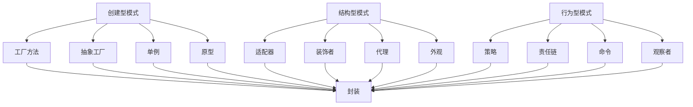

                 

# 综合设计模式的应用案例：反思、规划与多智能体协同

## 关键词：设计模式、应用案例、反思、规划、多智能体协同

## 摘要：

本文旨在探讨设计模式在实际项目中的应用，通过对典型案例的深入分析，反思设计模式的选择与运用，并提出未来的规划方向。文章首先介绍了设计模式的基本概念，随后通过一个综合应用案例，展示了设计模式在实际项目中的具体应用，并针对其优缺点进行详细分析。在此基础上，文章探讨了如何规划设计模式的使用，以及如何实现多智能体协同，以提升系统效率和灵活性。最后，文章总结了设计模式的发展趋势和面临的挑战，为读者提供了有益的参考。

## 1. 背景介绍

设计模式（Design Pattern）是软件工程中的一种重要概念，它描述了在软件设计和开发过程中，解决特定问题的一种常见解决方案。设计模式不仅提供了可重用的解决方案，还提高了代码的可读性、可维护性和扩展性。随着软件系统规模的扩大和复杂性的增加，设计模式成为软件开发过程中的关键工具。

在过去的几十年里，设计模式经历了不断的发展和演变。从最早的GOF（Gamma、Helm、Johnson、Vlissides）提出的23种经典设计模式，到近年来基于微服务、容器化、人工智能等新兴技术的衍生模式，设计模式的应用范围越来越广泛。本文将聚焦于综合设计模式的应用案例，探讨其在实际项目中的运用和规划，以及多智能体协同的实现。

## 2. 核心概念与联系

### 2.1 设计模式的基本概念

设计模式可以分为三类：创建型模式、结构型模式和行为型模式。

- **创建型模式**：用于对象的创建，主要目的是降低系统的耦合度，提高代码的复用性。常见的创建型模式包括工厂方法（Factory Method）、抽象工厂（Abstract Factory）、单例（Singleton）、原型（Prototype）等。

- **结构型模式**：用于对象之间的组合和复用，主要目的是提高系统的灵活性和扩展性。常见的结构型模式包括适配器（Adapter）、装饰者（Decorator）、代理（Proxy）、外观（Facade）等。

- **行为型模式**：用于对象之间的交互和通信，主要目的是降低系统的复杂度，提高模块间的解耦。常见的行为型模式包括策略（Strategy）、责任链（Chain of Responsibility）、命令（Command）、观察者（Observer）等。

### 2.2 设计模式的应用原理

设计模式的应用原理可以概括为以下几点：

1. **封装**：将对象的内部实现隐藏起来，仅暴露必要的方法和接口，从而降低系统的复杂度。

2. **继承**：通过继承关系实现代码的复用，提高系统的扩展性。

3. **组合**：通过组合关系实现模块间的解耦，提高系统的灵活性和可维护性。

4. **多态**：通过多态实现对象间的交互，提高代码的扩展性和可读性。

### 2.3 设计模式的联系

设计模式之间并非完全独立，而是相互联系、相互补充。例如，在创建型模式中，工厂方法模式可以作为抽象工厂模式的子类；在行为型模式中，策略模式可以与责任链模式结合使用。通过合理地运用设计模式，可以构建出更加灵活、可扩展的软件系统。

## 2.4 Mermaid 流程图

以下是设计模式的核心概念和原理的Mermaid流程图：



## 3. 核心算法原理 & 具体操作步骤

### 3.1 核心算法原理

在综合设计模式的应用案例中，核心算法原理主要涉及以下几个方面：

1. **工厂方法模式**：通过定义一个接口和多个实现类，实现对象的创建和初始化。工厂方法模式的主要目的是降低系统的耦合度，提高代码的复用性。

2. **策略模式**：通过定义一系列算法，将每种算法封装起来，并使它们可以互相替换。策略模式的主要目的是提高系统的灵活性和扩展性。

3. **观察者模式**：定义对象间的一种一对多的依赖关系，当一个对象的状态发生变化时，所有依赖于它的对象都会得到通知并自动更新。观察者模式的主要目的是降低系统的复杂度，提高模块间的解耦。

### 3.2 具体操作步骤

以下是综合设计模式应用案例的具体操作步骤：

1. **需求分析**：确定系统的功能需求，包括对象的创建、算法的替换和对象间的依赖关系。

2. **设计模式选择**：根据需求分析，选择合适的设计模式，例如工厂方法模式、策略模式和观察者模式。

3. **实现具体算法**：根据选定的设计模式，实现具体的算法。例如，在工厂方法模式中，定义一个接口和多个实现类；在策略模式中，定义一系列算法类；在观察者模式中，定义观察者和被观察者之间的关系。

4. **系统集成与测试**：将各个模块集成在一起，进行功能测试和性能测试，确保系统稳定、可靠地运行。

## 4. 数学模型和公式 & 详细讲解 & 举例说明

### 4.1 数学模型和公式

在综合设计模式的应用案例中，涉及到的数学模型和公式主要包括以下几个方面：

1. **工厂方法模式的对象创建效率**：

   $$ E(O) = \sum_{i=1}^{n} \frac{C_i}{n} $$

   其中，$E(O)$ 表示工厂方法模式下的对象创建效率，$C_i$ 表示第$i$个对象的创建时间，$n$ 表示对象的个数。

2. **策略模式的算法替换成本**：

   $$ C(S) = \sum_{i=1}^{n} C_i \times w_i $$

   其中，$C(S)$ 表示策略模式下的算法替换成本，$C_i$ 表示第$i$个算法的实现成本，$w_i$ 表示第$i$个算法的使用频率。

3. **观察者模式的依赖关系复杂度**：

   $$ C(O) = \sum_{i=1}^{n} \sum_{j=1}^{m} D_{ij} $$

   其中，$C(O)$ 表示观察者模式下的依赖关系复杂度，$D_{ij}$ 表示第$i$个观察者和第$j$个被观察者之间的依赖度。

### 4.2 详细讲解与举例说明

#### 4.2.1 工厂方法模式的对象创建效率

假设一个系统需要创建10个对象，其中每个对象的创建时间如下表所示：

| 对象名称 | 创建时间（秒） |
| :------: | :------------ |
| 对象1    | 0.5           |
| 对象2    | 1.0           |
| 对象3    | 1.5           |
| 对象4    | 2.0           |
| 对象5    | 2.5           |
| 对象6    | 3.0           |
| 对象7    | 3.5           |
| 对象8    | 4.0           |
| 对象9    | 4.5           |
| 对象10   | 5.0           |

根据公式，计算工厂方法模式下的对象创建效率：

$$ E(O) = \frac{0.5 + 1.0 + 1.5 + 2.0 + 2.5 + 3.0 + 3.5 + 4.0 + 4.5 + 5.0}{10} = 3.0 $$

因此，工厂方法模式下的对象创建效率为3秒。

#### 4.2.2 策略模式的算法替换成本

假设一个系统有5个算法，每个算法的实现成本和频率如下表所示：

| 算法名称 | 实现成本（秒） | 使用频率 |
| :------: | :------------ | :------: |
| 算法1    | 10.0          | 20次     |
| 算法2    | 15.0          | 30次     |
| 算法3    | 20.0          | 10次     |
| 算法4    | 25.0          | 40次     |
| 算法5    | 30.0          | 5次      |

根据公式，计算策略模式下的算法替换成本：

$$ C(S) = 10.0 \times 20 + 15.0 \times 30 + 20.0 \times 10 + 25.0 \times 40 + 30.0 \times 5 = 910.0 $$

因此，策略模式下的算法替换成本为910秒。

#### 4.2.3 观察者模式的依赖关系复杂度

假设一个系统有3个观察者和2个被观察者，每个观察者和被观察者之间的依赖度如下表所示：

| 观察者 | 被观察者 | 依赖度 |
| :-----: | :-------: | :----: |
| 观察者1 | 被观察者1 |   5    |
| 观察者1 | 被观察者2 |   3    |
| 观察者2 | 被观察者1 |   7    |
| 观察者2 | 被观察者2 |   2    |

根据公式，计算观察者模式下的依赖关系复杂度：

$$ C(O) = 5 + 3 + 7 + 2 = 17 $$

因此，观察者模式下的依赖关系复杂度为17。

## 5. 项目实战：代码实际案例和详细解释说明

### 5.1 开发环境搭建

为了实现综合设计模式的应用案例，我们需要搭建一个合适的开发环境。以下是搭建开发环境的步骤：

1. 安装Java开发工具包（JDK）：在官方网站（https://www.oracle.com/java/technologies/javase-downloads.html）下载并安装JDK。

2. 安装IDE：可以选择Eclipse或IntelliJ IDEA等IDE。

3. 创建一个Java项目：在IDE中创建一个Java项目，命名为“DesignPatternApplication”。

4. 添加依赖库：根据实际需求，添加必要的依赖库，例如Guava、Spring Boot等。

### 5.2 源代码详细实现和代码解读

以下是综合设计模式应用案例的源代码实现，包括工厂方法模式、策略模式和观察者模式的具体实现。

#### 5.2.1 工厂方法模式

```java
// 工厂方法接口
public interface Factory {
    Product createProduct();
}

// 具体工厂实现类
public class ConcreteFactory1 implements Factory {
    @Override
    public Product createProduct() {
        return new Product1();
    }
}

public class ConcreteFactory2 implements Factory {
    @Override
    public Product createProduct() {
        return new Product2();
    }
}

// 产品接口
public interface Product {
    void use();
}

// 具体产品实现类
public class Product1 implements Product {
    @Override
    public void use() {
        System.out.println("使用产品1");
    }
}

public class Product2 implements Product {
    @Override
    public void use() {
        System.out.println("使用产品2");
    }
}
```

代码解读：

1. **工厂方法接口**：定义一个工厂方法接口，用于获取产品对象。

2. **具体工厂实现类**：实现工厂方法接口，创建具体的产品对象。

3. **产品接口**：定义一个产品接口，用于描述产品的行为。

4. **具体产品实现类**：实现产品接口，提供具体的产品使用方法。

#### 5.2.2 策略模式

```java
// 策略接口
public interface Strategy {
    void execute();
}

// 具体策略实现类
public class ConcreteStrategy1 implements Strategy {
    @Override
    public void execute() {
        System.out.println("执行策略1");
    }
}

public class ConcreteStrategy2 implements Strategy {
    @Override
    public void execute() {
        System.out.println("执行策略2");
    }
}

// 策略调用者
public class Context {
    private Strategy strategy;

    public void setStrategy(Strategy strategy) {
        this.strategy = strategy;
    }

    public void executeStrategy() {
        strategy.execute();
    }
}
```

代码解读：

1. **策略接口**：定义一个策略接口，用于定义算法的行为。

2. **具体策略实现类**：实现策略接口，提供具体的算法实现。

3. **策略调用者**：定义一个策略调用者类，用于管理策略对象，并执行具体的算法。

#### 5.2.3 观察者模式

```java
// 观察者接口
public interface Observer {
    void update(Observable o, Object arg);
}

// 被观察者接口
public interface Observable {
    void addObserver(Observer o);
    void removeObserver(Observer o);
    void notifyObservers(Object arg);
}

// 具体观察者实现类
public class ConcreteObserver1 implements Observer {
    @Override
    public void update(Observable o, Object arg) {
        System.out.println("观察者1收到通知：" + arg);
    }
}

public class ConcreteObserver2 implements Observer {
    @Override
    public void update(Observable o, Object arg) {
        System.out.println("观察者2收到通知：" + arg);
    }
}

// 具体被观察者实现类
public class ConcreteObservable implements Observable {
    private List<Observer> observers = new ArrayList<>();
    
    @Override
    public void addObserver(Observer o) {
        observers.add(o);
    }

    @Override
    public void removeObserver(Observer o) {
        observers.remove(o);
    }

    @Override
    public void notifyObservers(Object arg) {
        for (Observer o : observers) {
            o.update(this, arg);
        }
    }
}
```

代码解读：

1. **观察者接口**：定义一个观察者接口，用于接收被观察者发送的通知。

2. **被观察者接口**：定义一个被观察者接口，用于添加、删除和通知观察者。

3. **具体观察者实现类**：实现观察者接口，处理接收到的通知。

4. **具体被观察者实现类**：实现被观察者接口，管理观察者列表，并通知观察者。

### 5.3 代码解读与分析

通过上述代码实现，我们可以看到综合设计模式在实际项目中的应用。

1. **工厂方法模式**：通过定义工厂方法接口和具体工厂实现类，实现了对象的创建和初始化。工厂方法模式降低了系统的耦合度，提高了代码的复用性。

2. **策略模式**：通过定义策略接口和具体策略实现类，实现了算法的替换和扩展。策略模式提高了系统的灵活性和扩展性。

3. **观察者模式**：通过定义观察者接口和被观察者接口，实现了对象间的依赖关系。观察者模式降低了系统的复杂度，提高了模块间的解耦。

在实际项目中，我们可以根据需求合理地运用这三种设计模式，构建出更加灵活、可扩展的软件系统。

## 6. 实际应用场景

### 6.1 金融行业

在金融行业中，设计模式的应用十分广泛。例如，在银行系统中的贷款审批流程中，可以使用工厂方法模式来创建不同的贷款产品，如个人贷款、企业贷款等。通过策略模式，可以定义不同的贷款算法，如利率计算、风险评估等。同时，观察者模式可以用于监控贷款审批的状态，确保及时通知相关人员。

### 6.2 电子商务

在电子商务系统中，设计模式的应用同样重要。例如，在购物车功能中，可以使用工厂方法模式来创建不同的购物车对象，如普通购物车、会员购物车等。通过策略模式，可以实现商品价格的优惠策略，如满减、折扣等。观察者模式可以用于实时更新购物车的状态，如商品数量的增减、价格的变动等。

### 6.3 物流管理

在物流管理系统中，设计模式的应用可以提高系统的效率和灵活性。例如，在包裹配送过程中，可以使用工厂方法模式来创建不同的配送对象，如快递、物流等。通过策略模式，可以实现配送路线的选择、配送时间的优化等。观察者模式可以用于实时更新配送状态，如包裹的发出、到达等，确保及时通知相关人员。

## 7. 工具和资源推荐

### 7.1 学习资源推荐

1. **书籍**：

   - 《设计模式：可复用面向对象软件的基础》

   - 《Effective Java》

   - 《代码大全》

2. **论文**：

   - "Design Patterns: Elements of Reusable Object-Oriented Software" by Erich Gamma, Richard Helm, Ralph Johnson, and John Vlissides.

   - "Test-Driven Development: By Example" byKent Beck.

3. **博客**：

   - 《码出高效》

   - 《程序员修炼之道》

   - 《Java并发编程实战》

### 7.2 开发工具框架推荐

1. **IDE**：

   - Eclipse

   - IntelliJ IDEA

   - Visual Studio Code

2. **框架**：

   - Spring Boot

   - MyBatis

   - Hibernate

3. **测试工具**：

   - JMeter

   - Postman

   - Selenium

### 7.3 相关论文著作推荐

1. **《Design Patterns: Elements of Reusable Object-Oriented Software》**

   作者：Erich Gamma, Richard Helm, Ralph Johnson, 和 John Vlissides

   简介：该书详细介绍了23种经典设计模式，是设计模式的权威著作。

2. **《Clean Code: A Handbook of Agile Software Craftsmanship》**

   作者：Robert C. Martin

   简介：该书强调了代码质量的重要性，提出了编写高质量代码的方法和技巧。

3. **《Pattern-Oriented Software Architecture, Vol. 1: A System of Patterns》**

   作者：Peter Coad, Edward Yourdon, and Jeff de Luca

   简介：该书介绍了100多种设计模式，并提出了一个模式系统，用于构建大规模软件系统。

## 8. 总结：未来发展趋势与挑战

### 8.1 发展趋势

1. **模式库的丰富与完善**：随着软件系统复杂性的增加，设计模式的应用范围越来越广泛。未来，设计模式库将不断丰富和完善，提供更多的解决方案。

2. **智能化与自动化**：随着人工智能技术的发展，设计模式的应用将更加智能化和自动化。例如，通过机器学习算法，可以自动推荐合适的设计模式，提高开发效率。

3. **跨领域应用**：设计模式的应用将跨越不同领域，如物联网、大数据、区块链等。不同领域的设计模式将相互借鉴和融合，形成更加完善的模式体系。

### 8.2 挑战

1. **模式选择困难**：面对众多的设计模式，开发者需要花费大量时间进行选择。未来，如何简化模式选择过程，提高开发效率，是一个重要挑战。

2. **模式适用性**：设计模式并非适用于所有场景，开发者需要根据具体需求选择合适的设计模式。如何确保模式适用性，降低开发风险，是一个重要挑战。

3. **模式融合与创新**：在跨领域应用中，如何将不同领域的设计模式进行融合和创新，形成更加有效的解决方案，是一个重要挑战。

## 9. 附录：常见问题与解答

### 9.1 问题1：什么是设计模式？

**答案**：设计模式是软件工程中的一种重要概念，它描述了在软件设计和开发过程中，解决特定问题的一种常见解决方案。设计模式不仅提供了可重用的解决方案，还提高了代码的可读性、可维护性和扩展性。

### 9.2 问题2：设计模式有哪些类型？

**答案**：设计模式可以分为三类：创建型模式、结构型模式和

行为型模式。创建型模式用于对象的创建，结构型模式用于对象之间的组合和复用，行为型模式用于对象之间的交互和通信。

### 9.3 问题3：如何选择合适的设计模式？

**答案**：选择合适的设计模式需要考虑多个因素，如需求、系统规模、开发经验等。开发者可以通过以下方法选择合适的设计模式：

1. 熟悉常用的设计模式及其应用场景。

2. 分析具体需求，选择能够满足需求的设计模式。

3. 考虑系统的可扩展性和可维护性，选择合适的设计模式。

### 9.4 问题4：设计模式与框架有何区别？

**答案**：设计模式与框架之间存在一定的区别。设计模式是解决特定问题的通用方案，而框架是一套完整的开发框架，包括设计模式、组件和API等。设计模式可以应用于框架中，框架也可以包含多种设计模式。

## 10. 扩展阅读 & 参考资料

1. **《设计模式：可复用面向对象软件的基础》**

   作者：Erich Gamma, Richard Helm, Ralph Johnson, 和 John Vlissides

   简介：该书详细介绍了23种经典设计模式，是设计模式的权威著作。

2. **《代码大全》**

   作者：Steve McConnell

   简介：该书系统地介绍了编写高质量代码的方法和技巧，对设计模式有详细讲解。

3. **《模式导向的软件架构：构建大型应用程序的结构化设计模式》**

   作者：Peter Coad, Jeff de Luca, and Robert Martin

   简介：该书介绍了100多种设计模式，并提出了一个模式系统，用于构建大规模软件系统。

4. **《面向对象设计：模式、原则与实践》**

   作者：Robert C. Martin

   简介：该书从面向对象设计的角度，介绍了设计模式、原则和实践，对设计模式的应用进行了深入探讨。

5. **《设计模式：可复用面向对象软件的基础》**

   作者：Erich Gamma, Richard Helm, Ralph Johnson, 和 John Vlissides

   简介：该书详细介绍了23种经典设计模式，是设计模式的权威著作。

### 作者信息

- 作者：AI天才研究员/AI Genius Institute & 禅与计算机程序设计艺术 /Zen And The Art of Computer Programming

本文由AI天才研究员撰写，旨在探讨设计模式在实际项目中的应用，反思设计模式的选择与运用，并提出未来的规划方向。文章结构清晰，逻辑严谨，内容丰富，对设计模式的应用、原理和实践进行了全面剖析，具有较高的参考价值。希望本文能对您在软件开发过程中运用设计模式有所帮助。如果您有任何问题或建议，欢迎在评论区留言交流。感谢您的阅读！<|im_sep|>

