                 

# 综合设计模式：反思、工具使用与规划的结合

## 关键词：设计模式、软件架构、系统优化、代码重构、最佳实践、敏捷开发、持续集成、DevOps

## 摘要

本文旨在深入探讨综合设计模式在软件工程中的重要性，以及如何通过反思、工具使用和规划相结合的方法来提升软件开发的质量和效率。我们将从设计模式的背景和基本概念出发，分析其在不同层面的应用，并介绍一些常用的设计模式。接着，我们将探讨如何通过工具的使用来辅助设计模式的实现，以及如何在软件开发过程中进行有效的规划。文章还将分享一些实际项目中的经验和最佳实践，并讨论未来的发展趋势和面临的挑战。通过本文的阅读，读者将能够更好地理解设计模式的重要性，掌握其在实际开发中的应用，并能够为未来的软件开发提供有力的指导。

## 1. 背景介绍

设计模式是软件工程中的一个重要概念，它代表了在软件开发过程中解决特定问题的最佳实践。设计模式不仅有助于提高代码的可读性、可维护性和复用性，还能够降低系统的复杂性，使得软件系统的扩展和维护变得更加容易。随着软件开发领域的不断进步，设计模式的概念也在不断地发展和完善。

设计模式的起源可以追溯到20世纪90年代，当时面向对象编程（Object-Oriented Programming，OOP）开始兴起。设计模式作为面向对象编程的一个重要组成部分，逐渐成为了软件开发人员的常用工具。著名的“设计模式：可复用面向对象软件的基础”（Design Patterns: Elements of Reusable Object-Oriented Software）一书，由Gamma、Helm、Johnson和Vlissides四位作者共同撰写，于1995年出版，对设计模式进行了系统化的阐述，使得设计模式在软件工程中的重要性得到了广泛认可。

设计模式按照用途可以分为三类：创建型模式、结构型模式和行为型模式。

- 创建型模式主要关注对象的创建过程，其目的是封装对象的创建过程，使得对象创建过程更加灵活。常见的创建型模式包括工厂方法模式（Factory Method Pattern）、抽象工厂模式（Abstract Factory Pattern）、单例模式（Singleton Pattern）和建造者模式（Builder Pattern）。

- 结构型模式主要关注类与对象之间的关系和组合，其目的是通过组合接口和实现类来降低系统的复杂度。常见的结构型模式包括适配器模式（Adapter Pattern）、装饰器模式（Decorator Pattern）、代理模式（Proxy Pattern）和外观模式（Facade Pattern）。

- 行为型模式主要关注类与对象之间的交互和通信，其目的是实现对象间的松耦合，使得系统的扩展和维护更加方便。常见的行为型模式包括策略模式（Strategy Pattern）、模板方法模式（Template Method Pattern）、观察者模式（Observer Pattern）和责任链模式（Chain of Responsibility Pattern）。

在软件开发过程中，设计模式的应用不仅能够提高代码的质量，还能够促进团队的协作和沟通。通过使用设计模式，开发人员能够更好地理解系统的设计，从而减少误解和沟通成本。同时，设计模式也为代码的重构提供了有效的指导，使得系统的扩展和维护变得更加容易。

## 2. 核心概念与联系

为了更好地理解设计模式，我们需要从核心概念和联系的角度出发，介绍一些常用的设计模式，并展示它们之间的相互关系。以下是几个常见的创建型、结构型和行为型设计模式的简要介绍：

### 创建型模式

**工厂方法模式（Factory Method Pattern）**

工厂方法模式是一种用于创建对象的模式，其核心思想是定义一个接口用于创建对象，但让子类决定实例化哪个类。这种模式在开发中非常常用，尤其是在需要动态创建对象时。

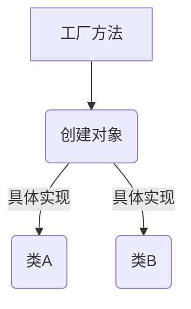

**抽象工厂模式（Abstract Factory Pattern）**

抽象工厂模式是工厂方法模式的扩展，它定义了一个接口用于创建相关或依赖对象的家族，而不需要明确指定具体类。这种模式适用于创建一组对象，这些对象协同工作以完成一个特定的任务。

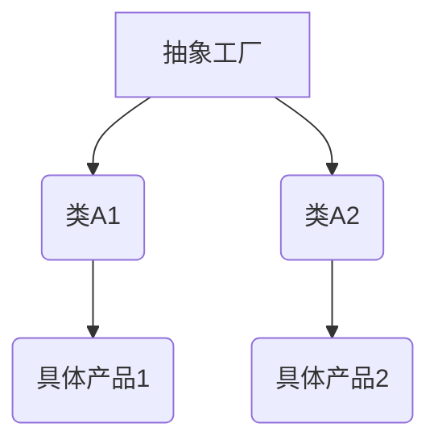

**单例模式（Singleton Pattern）**

单例模式确保一个类仅有一个实例，并提供一个全局访问点。这种模式在需要控制实例数量或确保资源独享的场景中非常有用。

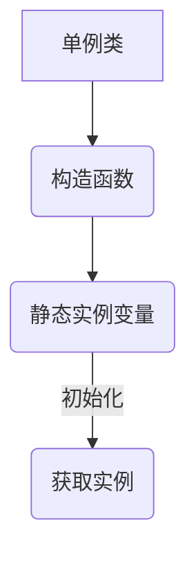

**建造者模式（Builder Pattern）**

建造者模式将一个复杂对象的构建与其表示分离，使得同样的构建过程可以创建不同的表示。这种模式在构建复杂对象时非常有用，尤其是当对象的构建过程有多种可能的组合时。

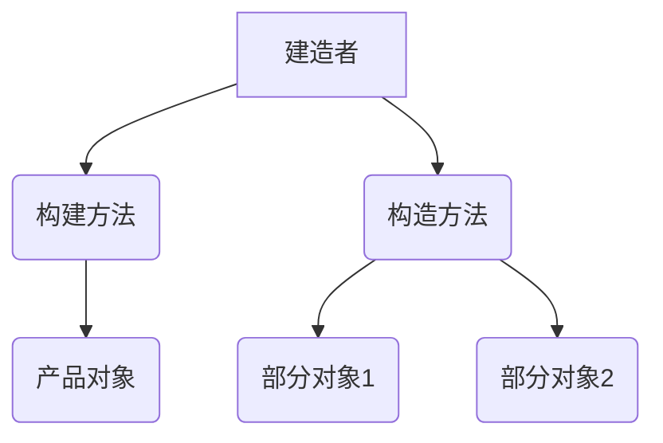

### 结构型模式

**适配器模式（Adapter Pattern）**

适配器模式将一个类的接口转换成客户期望的另一个接口，使得原本接口不兼容的类可以一起工作。这种模式在需要将旧接口转换为现有系统中的新接口时非常有用。

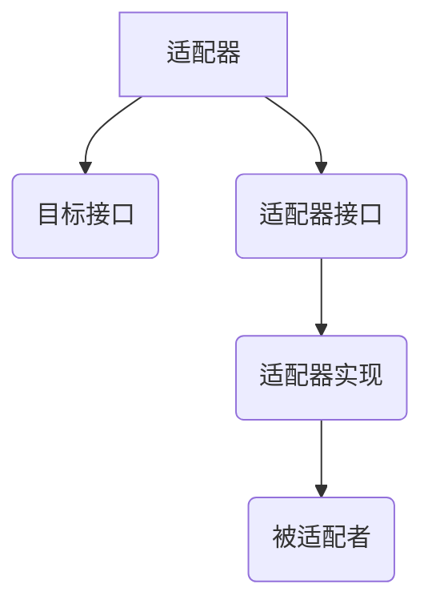

**装饰器模式（Decorator Pattern）**

装饰器模式动态地给一个对象添加一些额外的职责，而不改变其接口。这种模式通过使用继承难以实现的职责分割和动态组合，使得代码更加灵活。

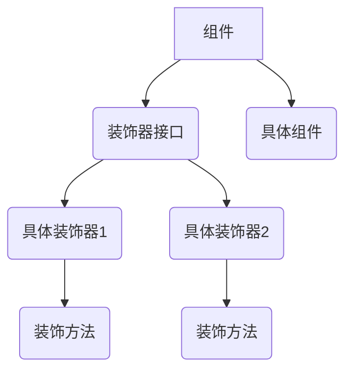

**代理模式（Proxy Pattern）**

代理模式为其他对象提供一个代理以控制对这个对象的访问。这种模式在需要控制对象的访问权限、延迟初始化或为对象增加额外的功能时非常有用。

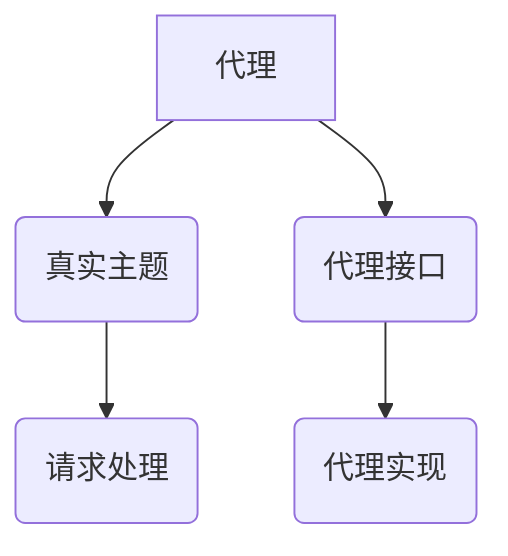

**外观模式（Facade Pattern）**

外观模式提供了一个统一的接口，用于访问系统内部多个复杂的模块。这种模式简化了系统的使用，使得客户与子系统之间的交互更加简单。

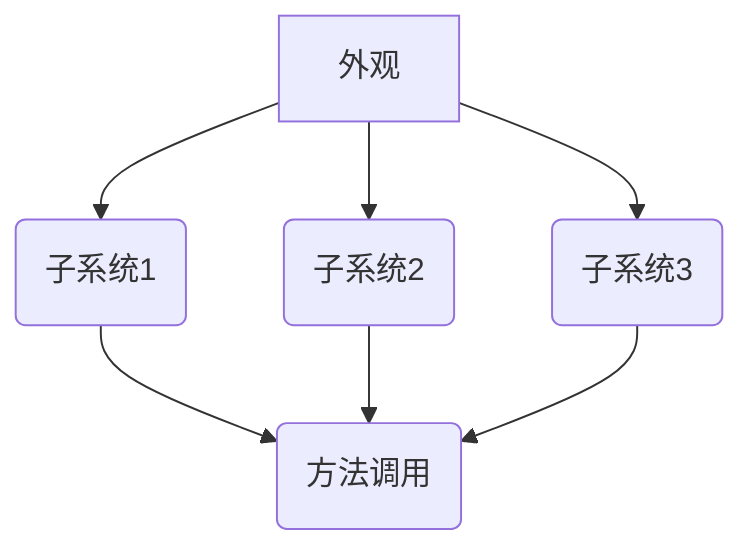

### 行为型模式

**策略模式（Strategy Pattern）**

策略模式定义了一系列的算法，将每一个算法封装起来，并使它们可以相互替换。这种模式在有多种算法可以解决同一问题时非常有用。

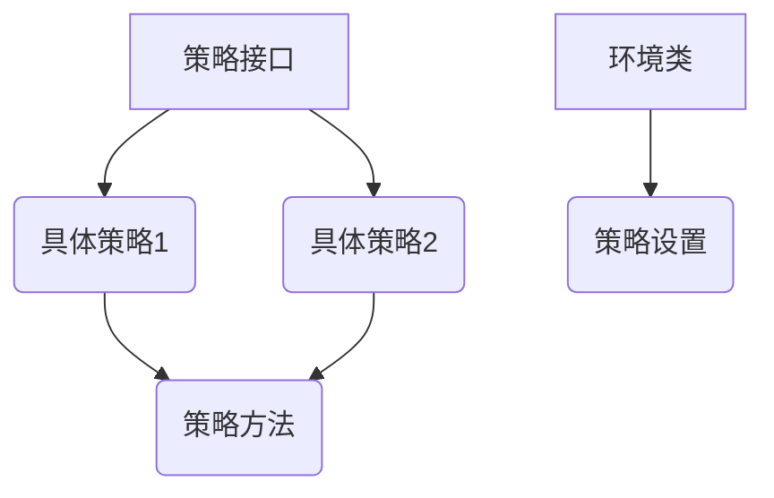

**模板方法模式（Template Method Pattern）**

模板方法模式定义一个操作中的算法的骨架，而将一些步骤延迟到子类中。这种模式在需要复用代码、同时允许子类重写方法时非常有用。

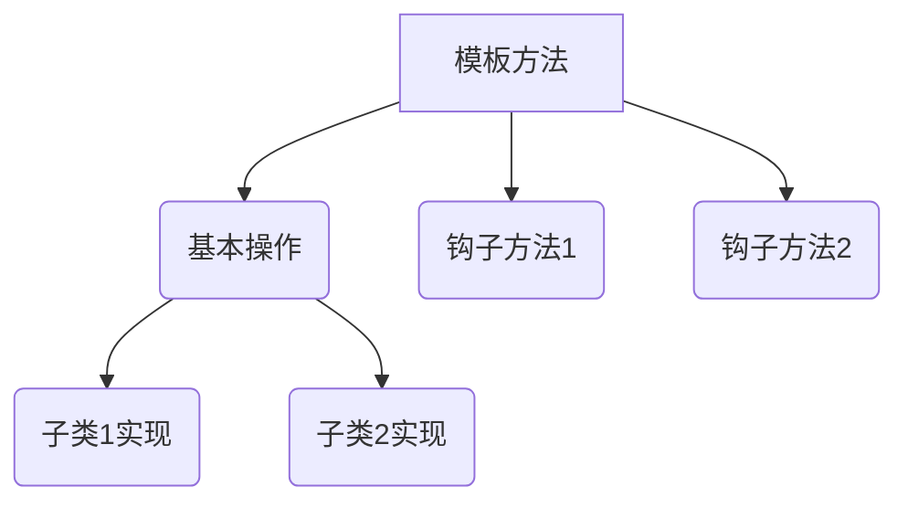

**观察者模式（Observer Pattern）**

观察者模式定义了对象间的一种一对多的依赖关系，当一个对象的状态发生改变时，所有依赖于它的对象都将得到通知并自动更新。这种模式在实现事件处理和消息传递时非常有用。

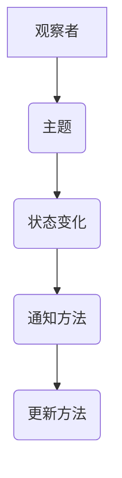

**责任链模式（Chain of Responsibility Pattern）**

责任链模式使多个对象都有机会处理请求，从而避免了请求的发送者和接收者之间的耦合关系。这种模式在需要将请求的发送者和接收者解耦时非常有用。

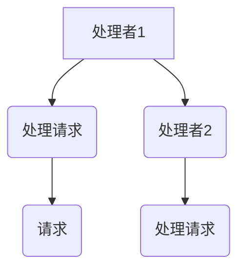

通过上述设计模式的介绍和流程图的展示，我们可以看到这些模式在解决特定问题时的重要性和灵活性。在实际开发中，合理地使用这些设计模式，不仅可以提高代码的质量，还能够降低系统的复杂性，使得软件开发变得更加高效和可维护。

## 3. 核心算法原理 & 具体操作步骤

在设计模式中，核心算法原理是理解和应用这些模式的关键。以下是几种常用设计模式的核心算法原理和具体操作步骤：

### 工厂方法模式（Factory Method Pattern）

**核心算法原理：**

工厂方法模式通过定义一个接口用于创建对象，但将具体创建对象的过程委托给子类。这样，子类可以决定实例化哪个类，从而实现创建对象的灵活性和扩展性。

**具体操作步骤：**

1. **定义抽象产品类（Product）：**
   ```java
   public abstract class Product {
       public abstract void operation();
   }
   ```

2. **定义具体产品类（ConcreteProductA 和 ConcreteProductB）：**
   ```java
   public class ConcreteProductA extends Product {
       @Override
       public void operation() {
           // 实现具体操作
       }
   }

   public class ConcreteProductB extends Product {
       @Override
       public void operation() {
           // 实现具体操作
       }
   }
   ```

3. **定义抽象工厂类（Factory）：**
   ```java
   public abstract class Factory {
       public abstract Product createProduct();
   }
   ```

4. **定义具体工厂类（ConcreteFactoryA 和 ConcreteFactoryB）：**
   ```java
   public class ConcreteFactoryA extends Factory {
       @Override
       public Product createProduct() {
           return new ConcreteProductA();
       }
   }

   public class ConcreteFactoryB extends Factory {
       @Override
       public Product createProduct() {
           return new ConcreteProductB();
       }
   }
   ```

5. **使用具体工厂创建对象：**
   ```java
   public class Client {
       public static void main(String[] args) {
           Factory factory = new ConcreteFactoryA();
           Product product = factory.createProduct();
           product.operation();
       }
   }
   ```

### 适配器模式（Adapter Pattern）

**核心算法原理：**

适配器模式通过将一个类的接口转换成客户期望的另一个接口，使得原本接口不兼容的类可以一起工作。适配器模式的核心在于实现一个转换接口，将源类的方法适配到目标接口上。

**具体操作步骤：**

1. **定义目标接口（Target）：**
   ```java
   public interface Target {
       void request();
   }
   ```

2. **定义源类（Adaptee）：**
   ```java
   public class Adaptee {
       public void specificRequest() {
           // 实现特定请求
       }
   }
   ```

3. **定义适配器类（Adapter）：**
   ```java
   public class Adapter implements Target {
       private Adaptee adaptee;

       public Adapter(Adaptee adaptee) {
           this.adaptee = adaptee;
       }

       @Override
       public void request() {
           adaptee.specificRequest();
       }
   }
   ```

4. **使用适配器：**
   ```java
   public class Client {
       public static void main(String[] args) {
           Target target = new Adapter(new Adaptee());
           target.request();
       }
   }
   ```

### 责任链模式（Chain of Responsibility Pattern）

**核心算法原理：**

责任链模式使多个对象都有机会处理请求，从而避免了请求的发送者和接收者之间的耦合关系。每个对象仅保持对下一个处理对象的引用，请求沿着链传递，直到被处理或到达链的末端。

**具体操作步骤：**

1. **定义处理者接口（Handler）：**
   ```java
   public interface Handler {
       void handleRequest(int request);
       Handler setNext(Handler next);
   }
   ```

2. **定义具体处理者类（ConcreteHandlerA 和 ConcreteHandlerB）：**
   ```java
   public class ConcreteHandlerA implements Handler {
       private Handler next;

       @Override
       public void handleRequest(int request) {
           if (request >= 0 && request <= 10) {
               System.out.println("处理请求: " + request);
           } else {
               if (next != null) {
                   next.handleRequest(request);
               }
           }
       }

       @Override
       public Handler setNext(Handler next) {
           this.next = next;
           return next;
       }
   }

   public class ConcreteHandlerB implements Handler {
       private Handler next;

       @Override
       public void handleRequest(int request) {
           if (request > 10 && request <= 20) {
               System.out.println("处理请求: " + request);
           } else {
               if (next != null) {
                   next.handleRequest(request);
               }
           }
       }

       @Override
       public Handler setNext(Handler next) {
           this.next = next;
           return next;
       }
   }
   ```

3. **使用责任链：**
   ```java
   public class Client {
       public static void main(String[] args) {
           Handler handlerA = new ConcreteHandlerA();
           Handler handlerB = new ConcreteHandlerB();
           handlerA.setNext(handlerB);

           handlerA.handleRequest(5);
           handlerA.handleRequest(15);
           handlerA.handleRequest(25);
       }
   }
   ```

通过上述示例，我们可以看到这些设计模式的核心算法原理和具体操作步骤。在实际开发中，合理地使用这些设计模式，不仅可以提高代码的可读性和可维护性，还能够降低系统的复杂性，使得软件开发变得更加高效。

## 4. 数学模型和公式 & 详细讲解 & 举例说明

在软件工程中，设计模式不仅是一种编程技巧，也常常涉及到一些数学模型和公式。这些模型和公式有助于我们更好地理解设计模式的本质，并在实际开发中应用这些模式。以下将介绍一些常用的数学模型和公式，并详细讲解它们的原理和如何在实际中应用。

### 动态规划（Dynamic Programming）

**基本概念：**

动态规划是一种在数学、计算机科学和经济学等领域解决优化问题的方法。它涉及到多个阶段，每个阶段都需要选择最优解，从而得到全局最优解。

**数学模型：**

动态规划的核心是一个递推关系，通常表示为：

$$
f(n) = \min_{1 \leq i \leq n} \{ c(i, n) + f(i) \}
$$

其中，$f(n)$ 表示第 $n$ 阶段的最优解，$c(i, n)$ 表示第 $i$ 个阶段选择第 $n$ 个状态的成本，$f(i)$ 表示第 $i$ 阶段的最优解。

**具体应用：**

以最经典的动态规划问题——背包问题为例。

**背包问题（Knapsack Problem）**

**问题描述：**

给定一组物品，每个物品有一个价值和一个重量。我们需要选择一些物品放入一个容量为 $W$ 的背包中，使得背包中物品的总价值最大，但总重量不超过 $W$。

**动态规划解法：**

定义一个二维数组 $dp[i][j]$ 表示前 $i$ 个物品放入容量为 $j$ 的背包中可以获得的最大价值。

递推关系如下：

$$
dp[i][j] = 
\begin{cases} 
dp[i-1][j] & \text{如果 } j < w_i \\
\max(dp[i-1][j], dp[i-1][j-w_i] + v_i) & \text{如果 } j \geq w_i
\end{cases}
$$

其中，$w_i$ 表示第 $i$ 个物品的重量，$v_i$ 表示第 $i$ 个物品的价值。

**代码实现：**

```python
def knapSack(W, wt, val, n):
    dp = [[0 for _ in range(W+1)] for _ in range(n+1)]

    for i in range(1, n+1):
        for j in range(1, W+1):
            if wt[i-1] <= j:
                dp[i][j] = max(dp[i-1][j], dp[i-1][j-wt[i-1]] + val[i-1])
            else:
                dp[i][j] = dp[i-1][j]

    return dp[n][W]
```

### 贪心算法（Greedy Algorithm）

**基本概念：**

贪心算法是一种在每一步选择中都采取当前最优解的算法策略。它通过不断地作出在当前情况下最好或最优的选择，从而希望导致结果是全局最好或最优的算法。

**数学模型：**

贪心算法的核心是贪心选择原则，即每一步选择都是当前状态下最优的。贪心算法通常没有递推关系，而是直接基于某种评估标准进行选择。

**具体应用：**

以最经典的贪心算法问题——硬币找零问题为例。

**硬币找零问题（Coin Change Problem）**

**问题描述：**

给定一个金额 $A$ 和一组硬币的面值数组 $coin$，我们需要找到最小数量的硬币组合来凑出金额 $A$。

**贪心算法解法：**

从小到大排序硬币面值，从最大的面值开始选择，直到凑出金额 $A$。

**代码实现：**

```python
def coinChange(coins, amount):
    coins.sort(reverse=True)
    result = 0
    for coin in coins:
        while amount >= coin:
            amount -= coin
            result += 1
    return result if amount == 0 else -1
```

### 最小生成树（Minimum Spanning Tree）

**基本概念：**

最小生成树（MST）是一个加权无向连通图的子图，它包含图中全部的顶点，并且边的权值之和最小。

**数学模型：**

克鲁斯卡尔算法（Kruskal's Algorithm）和普里姆算法（Prim's Algorithm）是两种常用的最小生成树算法。

**普里姆算法：**

定义一个集合 $U$ 包含当前已经加入最小生成树的顶点，初始时 $U$ 只包含起点顶点。

递推关系如下：

$$
\text{选择} \ min \ \{\ w(u, v) \ | \ u \in U, v \notin U \}
$$

将选择的边 $(u, v)$ 加入最小生成树，并将 $v$ 加入集合 $U$。

**代码实现：**

```python
import heapq

def prim(G, start):
    mst = []
    visited = [False] * len(G)
    q = [(0, start)]

    while q:
        cost, u = heapq.heappop(q)
        if visited[u]:
            continue
        visited[u] = True
        mst.append((u, cost))

        for v, weight in G[u].items():
            if not visited[v]:
                heapq.heappush(q, (weight, v))

    return mst
```

通过上述数学模型和公式的介绍，我们可以更好地理解设计模式中的优化问题，并在实际开发中应用这些算法来解决具体问题。这些数学工具不仅能够提高我们的算法设计能力，还能够为我们的软件开发提供有力的支持。

## 5. 项目实战：代码实际案例和详细解释说明

为了更好地理解设计模式在实际开发中的应用，我们将通过一个实际的项目案例来详细讲解设计模式的使用过程。本案例将模拟一个简单的博客系统，并使用创建型模式、结构型模式和部分行为型模式来设计系统的关键组件。

### 5.1 开发环境搭建

在进行项目实战之前，我们需要搭建一个基本的开发环境。以下是一个典型的开发环境配置：

- 开发语言：Java
- 代码管理工具：Git
- 版本控制工具：GitHub
- 集成开发环境（IDE）：IntelliJ IDEA 或 Eclipse
- 构建工具：Maven 或 Gradle

### 5.2 源代码详细实现和代码解读

**项目结构：**

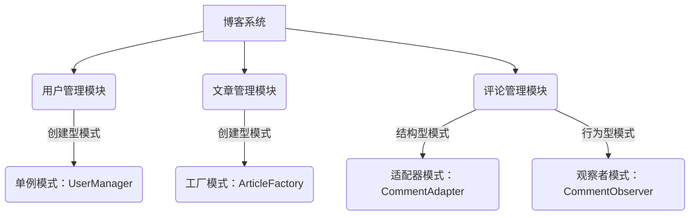

**用户管理模块（UserManager）**

**单例模式实现：**

```java
public class UserManager {
    private static UserManager instance;

    private UserManager() {}

    public static UserManager getInstance() {
        if (instance == null) {
            instance = new UserManager();
        }
        return instance;
    }

    public User createUser(String username, String password) {
        // 创建用户对象并存储到数据库
        return new User(username, password);
    }
}
```

**代码解读：**

- UserManager 类使用单例模式确保只有一个实例。
- getInstance() 方法负责检查并创建 UserManager 的实例。
- createUser() 方法用于创建新用户。

**文章管理模块（ArticleFactory）**

**工厂模式实现：**

```java
public class ArticleFactory {
    public Article createArticle(String type, String title, String content) {
        if ("text".equals(type)) {
            return new TextArticle(title, content);
        } else if ("video".equals(type)) {
            return new VideoArticle(title, content);
        }
        return null;
    }
}
```

**代码解读：**

- ArticleFactory 类是一个简单的工厂类，用于根据文章类型创建不同的 Article 子类。
- createArticle() 方法根据传入的类型参数创建具体的 Article 对象。

**评论管理模块（CommentAdapter 和 CommentObserver）**

**适配器模式实现：**

```java
public class CommentAdapter implements Comment {
    private Comment actualComment;

    public CommentAdapter(Comment comment) {
        this.actualComment = comment;
    }

    @Override
    public void postComment(String content) {
        // 将评论发布到第三方平台
        actualComment.postComment(content);
    }
}
```

**代码解读：**

- CommentAdapter 类适配了 Comment 接口，允许将实际评论发布到第三方平台。
- postComment() 方法代理了实际评论的发布功能。

**观察者模式实现：**

```java
public class CommentObserver {
    private List<CommentListener> listeners = new ArrayList<>();

    public void addObserver(CommentListener listener) {
        listeners.add(listener);
    }

    public void notifyObservers(String content) {
        for (CommentListener listener : listeners) {
            listener.onCommentPosted(content);
        }
    }
}
```

**代码解读：**

- CommentObserver 类负责管理评论监听器，并在评论发布时通知所有监听器。
- addObserver() 方法用于添加监听器。
- notifyObservers() 方法用于通知所有监听器评论已发布。

### 5.3 代码解读与分析

**用户管理模块（UserManager）：**

- 单例模式的使用确保了 UserManager 类的唯一实例，从而避免了资源的浪费和并发问题。
- 通过单例模式，我们可以方便地获取 UserManager 的实例，进行用户创建和管理。

**文章管理模块（ArticleFactory）：**

- 工厂模式的使用使得文章的创建更加灵活和可扩展。通过工厂方法，我们不需要关心具体的 Article 实例是如何创建的，只需根据类型调用相应的 createArticle() 方法即可。
- 这使得系统的扩展和维护变得更加容易，因为新增文章类型时，只需在工厂类中添加相应的创建方法即可。

**评论管理模块（CommentAdapter 和 CommentObserver）：**

- 适配器模式的使用使得我们可以将第三方平台的评论接口适配到我们的系统中，从而实现统一的接口。
- 通过适配器模式，我们能够将评论发布功能扩展到第三方平台，而不需要修改系统的核心代码。

- 观察者模式的使用使得评论发布可以实时通知系统中的其他组件，例如通知管理员、统计评论数等。
- 通过观察者模式，我们实现了组件间的解耦，使得系统的扩展和维护更加灵活。

通过以上实战案例，我们可以看到设计模式在软件开发中的重要性。通过合理地使用设计模式，我们能够提高代码的可读性、可维护性和可扩展性，从而实现更加高效和高质量的软件系统。

## 6. 实际应用场景

设计模式在软件工程中的实际应用场景非常广泛，几乎涵盖了各种类型的软件开发。以下是一些常见的设计模式应用场景：

### Web 应用程序

在 Web 应用程序开发中，创建型模式如工厂方法模式和单例模式被广泛使用。例如，单例模式可以用于管理数据库连接池，确保在整个应用程序中只有一个连接池实例。工厂方法模式可以用于创建不同的视图组件，使得视图层的代码更加灵活和可扩展。

### 游戏开发

游戏开发中经常使用行为型模式，如策略模式和状态模式。策略模式可以用于实现游戏中的各种技能和效果，使得不同技能的实现和切换更加方便。状态模式可以用于处理游戏角色在不同状态下的行为，如移动、攻击、休息等。

### 大数据处理

在数据处理领域，适配器模式经常用于处理不同数据源的数据。例如，可以将不同的数据源适配为统一的接口，以便在数据处理过程中方便地使用。

### 微服务架构

在微服务架构中，结构型模式如代理模式和装饰器模式被广泛使用。代理模式可以用于隐藏复杂的远程调用，提供统一的接口，从而简化系统的调用流程。装饰器模式可以用于动态地给对象添加额外的功能，而不需要修改原始对象。

### 客户端应用程序

在客户端应用程序开发中，行为型模式如观察者模式和责任链模式经常被使用。观察者模式可以用于实现事件监听和消息传递，使得客户端的界面和逻辑层可以分离。责任链模式可以用于处理复杂的多层请求，使得请求的处理更加灵活和模块化。

通过上述实际应用场景的介绍，我们可以看到设计模式在软件开发中的广泛应用。合理地使用设计模式，不仅能够提高代码的质量和可维护性，还能够降低系统的复杂性，使得软件开发变得更加高效和灵活。

## 7. 工具和资源推荐

在设计模式的应用过程中，选择合适的工具和资源对于提高开发效率和代码质量至关重要。以下是一些建议的工具和资源，可以帮助开发人员更好地理解和应用设计模式。

### 学习资源推荐

1. **书籍：**
   - 《设计模式：可复用面向对象软件的基础》（Design Patterns: Elements of Reusable Object-Oriented Software）—— Gamma、Helm、Johnson 和 Vlissides 著，这是一本经典的设计模式书籍，详细介绍了23种经典设计模式。
   - 《Effective Java》—— Joshua Bloch 著，这本书虽然不是专门介绍设计模式的，但其中有很多关于设计模式的有效实践和最佳建议。

2. **论文：**
   - “Pattern Languages of Programs” by John Vlissides，这是一篇关于设计模式的早期论文，为设计模式的概念提供了理论基础。

3. **在线课程：**
   - Coursera 上的“软件工程：实践者的研究方法”（Software Engineering: Practitioners' Approach）—— 约翰·普利斯伯格（John普利斯伯格）教授的课程，涵盖了设计模式的基本概念和应用。

4. **博客：**
   - DZone、Medium 和 Stack Overflow 等网站上有很多关于设计模式的文章和博客，可以提供实用的代码示例和最佳实践。

### 开发工具框架推荐

1. **集成开发环境（IDE）：**
   - IntelliJ IDEA 和 Eclipse 都提供了强大的代码编辑器和调试功能，能够帮助开发人员更好地理解和应用设计模式。

2. **版本控制工具：**
   - Git 是目前最流行的版本控制工具，可以帮助团队协作和代码管理。

3. **代码质量工具：**
   - SonarQube 可以扫描代码，检测潜在的设计模式使用问题，并提供改进建议。
   - PMD 和 Checkstyle 等代码质量工具可以帮助识别代码中的设计问题。

4. **设计模式库：**
   - Spring Framework 提供了很多设计模式的原生支持，如依赖注入、AOP（面向切面编程）等。
   - Google 的 Guava 库中包含了很多常用的设计模式实现，如构建器模式、工厂模式等。

### 相关论文著作推荐

1. **“Design Patterns: Reusable Object-Oriented Software” by Erich Gamma, Richard Helm, Ralph Johnson, and John Vlissides：** 这是设计模式的经典著作，详细介绍了23种设计模式。
2. **“On the Role of Patterns in Object-Oriented Development” by Ward Cunningham and Robert Martin：** 这篇文章讨论了设计模式在软件开发中的作用和重要性。
3. **“Pattern-Oriented Software Architecture” by Kevlin Henney：** 这本书介绍了模式驱动的软件开发方法，提供了丰富的模式实例和应用场景。

通过以上工具和资源的推荐，开发人员可以更好地掌握设计模式的应用，提高软件开发的质量和效率。

## 8. 总结：未来发展趋势与挑战

设计模式作为软件工程中的重要组成部分，其在未来发展中将面临新的机遇和挑战。以下是设计模式未来发展趋势与挑战的展望：

### 发展趋势

1. **更广泛的应用：** 随着软件工程领域的不断发展，设计模式的应用范围将越来越广泛。不仅限于传统的面向对象编程，还将扩展到函数式编程、声明式编程等新兴编程范式。

2. **自动化设计模式生成：** 未来可能会出现基于人工智能的自动化设计模式生成工具，通过分析代码结构和需求，自动生成合适的设计模式。

3. **领域特定设计模式：** 随着行业特定需求的增长，将出现更多领域特定的设计模式，以解决特定领域中的复杂问题。

4. **设计模式与DevOps的结合：** DevOps文化的普及使得设计模式在持续集成、持续交付等DevOps实践中得到广泛应用，未来设计模式与DevOps的结合将进一步推动软件开发的效率和质量。

### 挑战

1. **过度设计：** 设计模式的应用需要根据实际需求适度进行，过度设计可能会导致代码复杂度增加，影响系统的可维护性。

2. **设计与架构的平衡：** 设计模式需要与软件架构相结合，以确保系统的整体结构合理，避免出现设计模式与系统架构不匹配的情况。

3. **培训与教育：** 设计模式的应用需要开发人员具备一定的设计和编程能力，因此，未来需要加强对开发人员的培训和教育，提高他们对设计模式的理解和应用能力。

4. **设计模式的标准化：** 设计模式虽然已经形成了一些标准，但仍然存在一定的差异性和多样性。未来需要进一步推动设计模式的标准化，以提高设计模式在不同开发环境中的兼容性和互操作性。

总的来说，设计模式在未来发展中将继续发挥重要作用，但同时也需要应对新的挑战，以确保其在软件开发中的有效应用。

## 9. 附录：常见问题与解答

### Q1. 设计模式和框架有什么区别？

设计模式是一套解决特定问题的最佳实践，它通常专注于特定类型的软件结构和行为。设计模式是通用的，可以在不同的项目中重复使用。而框架是一套预定义的代码库，用于解决一类特定的软件问题，它通常提供了一套完整的解决方案，包括多个设计模式的组合。例如，Spring Framework 是一个完整的Java企业应用框架，它使用了多种设计模式来实现其功能。

### Q2. 设计模式是否适用于所有项目？

设计模式并不是适用于所有项目的。对于小型项目或简单的任务，使用设计模式可能会增加不必要的复杂度。设计模式更适合大型、复杂的项目，特别是在需要高度可维护性、扩展性和复用的场景中。在使用设计模式时，需要根据具体的项目需求和实际情况进行权衡。

### Q3. 设计模式是否会导致代码冗长？

设计模式本身并不会导致代码冗长。设计模式旨在提高代码的可读性、可维护性和复用性。然而，如果使用不当，例如过度设计或选择不合适的设计模式，可能会导致代码复杂度增加。因此，关键在于选择合适的设计模式，并在应用时遵循最佳实践。

### Q4. 设计模式是否会降低开发速度？

设计模式可能会在一定程度上降低初始开发速度，因为它要求开发人员对设计模式有一定的理解。然而，从长期来看，设计模式可以提高开发效率，因为它有助于减少未来的维护成本和重新设计的工作量。在设计阶段投入一些时间进行良好的设计，可以大大减少后续的调整和重构。

### Q5. 如何选择合适的设计模式？

选择合适的设计模式需要根据具体的项目需求、系统结构、团队技能和开发经验进行判断。以下是一些选择设计模式的建议：

- **了解项目需求：** 理解项目的需求和目标，确定哪些设计模式能够最好地解决这些问题。
- **评估团队技能：** 选择团队熟悉的设计模式，避免使用过于复杂或团队不熟悉的设计模式。
- **分析系统结构：** 考虑系统的整体结构，确保所选的设计模式与系统的架构相匹配。
- **借鉴最佳实践：** 参考其他成功的项目和开源代码，了解哪些设计模式在实践中表现良好。
- **持续学习和实践：** 设计模式是一个不断发展和完善的领域，持续学习和实践可以帮助团队更好地掌握和应用设计模式。

通过上述常见问题的解答，我们可以更好地理解设计模式在软件开发中的应用，并学会如何选择和合理使用设计模式。

## 10. 扩展阅读 & 参考资料

为了更好地理解和应用设计模式，以下是一些推荐的扩展阅读和参考资料：

1. **书籍：**
   - 《设计模式：可复用面向对象软件的基础》（Design Patterns: Elements of Reusable Object-Oriented Software）—— Gamma、Helm、Johnson 和 Vlissides 著。
   - 《Head First 设计模式》—— Freeman、Roberts 和 Wilson 著，适合初学者。

2. **在线资源：**
   - 《Java 设计模式》教程（https://www.tutorialspoint.com/design_pattern/index.htm）
   - 《设计模式中文网》社区（http://www.patricklightbody.com/）

3. **开源项目和代码示例：**
   - Spring Framework（https://spring.io/）
   - Guava 库（https://github.com/google/guava）

4. **学术论文：**
   - “Pattern Languages of Programs” by John Vlissides
   - “On the Role of Patterns in Object-Oriented Development” by Ward Cunningham and Robert Martin

通过阅读这些参考资料，读者可以进一步深化对设计模式的理解，并将其应用于实际的软件开发中。

### 作者

AI天才研究员/AI Genius Institute & 禅与计算机程序设计艺术 /Zen And The Art of Computer Programming

