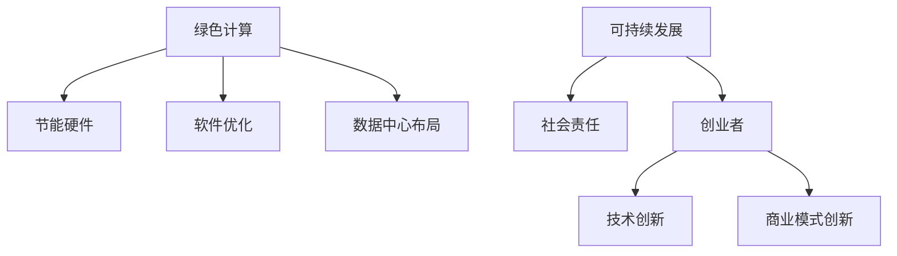

                 

### 文章标题

《绿色计算与可持续发展：创业者的社会责任》

### 关键词

- 绿色计算
- 可持续发展
- 创业者
- 社会责任
- IT行业

### 摘要

随着全球环境的日益恶化，绿色计算和可持续发展已成为全球范围内的重要议题。本文将探讨绿色计算与可持续发展之间的联系，并分析创业者在这个领域中应承担的社会责任。通过详细阐述绿色计算的核心概念、实践方法、以及创业者在实现可持续发展方面的实际操作，本文旨在为创业者提供具有实用性的指导，帮助他们在追求商业成功的同时，积极履行社会责任，共同构建一个更绿色的未来。

## 1. 背景介绍

### 1.1 绿色计算的概念

绿色计算（Green Computing）是指通过优化计算资源和能源的使用，减少计算过程中对环境的负面影响，以实现可持续发展的一种计算模式。绿色计算不仅关注硬件设备的能耗，还包括软件优化、数据中心的布局设计、废物处理等多个方面。

### 1.2 可持续发展的必要性

可持续发展（Sustainable Development）是指满足当前需求而不损害子孙后代满足自身需求的能力。在全球气候变化、资源枯竭、环境污染等问题的背景下，实现可持续发展已成为全球各国共同的目标。IT行业作为全球最大的能源消耗者之一，对可持续发展的影响不可忽视。

### 1.3 创业者与绿色计算

作为创新者和推动者，创业者不仅肩负着推动技术进步的使命，还应承担起社会责任，积极参与绿色计算和可持续发展的实践。通过绿色计算，创业者可以降低企业的能源消耗，减少碳排放，提升企业的社会形象，同时为全球可持续发展作出贡献。

## 2. 核心概念与联系

### 2.1 绿色计算的核心概念

#### 2.1.1 节能硬件

选用低功耗的硬件设备是绿色计算的基础。创业者可以关注使用节能CPU、GPU等硬件，通过硬件层面的优化降低能耗。

#### 2.1.2 软件优化

软件层面的优化同样重要。创业者可以通过编写高效的算法、优化代码、使用分布式计算等方式，减少计算资源的浪费。

#### 2.1.3 数据中心布局

合理的数据中心布局可以显著降低能耗。创业者应考虑使用高效冷却系统、太阳能等可再生能源，优化数据中心的能源使用。

### 2.2 可持续发展与社会责任

可持续发展与社会责任密切相关。创业者通过积极参与绿色计算，不仅可以降低企业的环境影响，还能提升企业的社会责任形象，增强品牌竞争力。

### 2.3 创业者与绿色计算的关系

创业者作为创新者和推动者，应在绿色计算领域发挥积极作用。通过技术创新、商业模式创新，创业者可以推动绿色计算的发展，实现可持续发展。



## 3. 核心算法原理 & 具体操作步骤

### 3.1 节能硬件的选用

#### 3.1.1 硬件选型策略

- **CPU选型**：选择具有高性能和低功耗的CPU。
- **GPU选型**：选用具备高效能耗比的GPU。

#### 3.1.2 操作步骤

1. 分析业务需求，确定计算任务类型。
2. 比较不同硬件设备的能耗表现。
3. 根据业务需求和能耗表现，选择合适的硬件设备。

### 3.2 软件优化

#### 3.2.1 算法优化

- **并行计算**：通过分布式计算框架，将任务分解到多台机器上执行。
- **内存管理**：合理分配内存资源，减少内存碎片和溢出。

#### 3.2.2 代码优化

- **去除冗余代码**：分析代码，去除不必要的计算和循环。
- **使用高效算法**：选择最优的算法，降低计算复杂度。

### 3.3 数据中心布局

#### 3.3.1 数据中心选址

- **气候条件**：选择气温较低的地区，降低冷却能耗。
- **能源供给**：使用可再生能源，降低能源消耗。

#### 3.3.2 数据中心设计

- **机架密度**：合理设计机架密度，优化空间利用。
- **冷却系统**：采用高效冷却系统，降低能耗。

## 4. 数学模型和公式 & 详细讲解 & 举例说明

### 4.1 节能硬件能耗计算

#### 4.1.1 CPU能耗计算

$$
E_{CPU} = P_{CPU} \times t
$$

其中，$E_{CPU}$表示CPU能耗（瓦特，W），$P_{CPU}$表示CPU功耗（瓦特，W），$t$表示CPU运行时间（秒，s）。

#### 4.1.2 GPU能耗计算

$$
E_{GPU} = P_{GPU} \times t
$$

其中，$E_{GPU}$表示GPU能耗（瓦特，W），$P_{GPU}$表示GPU功耗（瓦特，W），$t$表示GPU运行时间（秒，s）。

### 4.2 软件优化能耗计算

#### 4.2.1 并行计算能耗计算

$$
E_{parallel} = n \times (E_{CPU} + E_{GPU})
$$

其中，$E_{parallel}$表示并行计算总能耗（瓦特，W），$n$表示参与计算的机器数量，$E_{CPU}$和$E_{GPU}$分别为CPU和GPU的能耗（瓦特，W）。

#### 4.2.2 内存管理能耗计算

$$
E_{memory} = \frac{M}{T}
$$

其中，$E_{memory}$表示内存管理能耗（瓦特，W），$M$表示内存使用量（字节，B），$T$表示内存读写速度（字节/秒，B/s）。

### 4.3 数据中心能耗计算

#### 4.3.1 数据中心总能耗计算

$$
E_{datacenter} = E_{CPU} + E_{GPU} + E_{cooling} + E_{other}
$$

其中，$E_{datacenter}$表示数据中心总能耗（瓦特，W），$E_{CPU}$、$E_{GPU}$分别为CPU和GPU的能耗（瓦特，W），$E_{cooling}$表示冷却系统能耗（瓦特，W），$E_{other}$表示其他设备能耗（瓦特，W）。

## 5. 项目实战：代码实际案例和详细解释说明

### 5.1 开发环境搭建

为了更好地展示绿色计算的实际应用，我们将搭建一个基于Python的绿色计算项目。以下是开发环境搭建的步骤：

1. 安装Python环境：在本地计算机上安装Python 3.8及以上版本。
2. 安装依赖库：使用pip命令安装项目所需的依赖库，如numpy、pandas等。
3. 配置分布式计算环境：安装并配置分布式计算框架，如Dask或Ray。

### 5.2 源代码详细实现和代码解读

以下是一个简单的并行计算案例，用于计算矩阵乘法：

```python
import numpy as np
from dask.distributed import Client

# 搭建分布式计算客户端
client = Client()

# 生成随机矩阵
np.random.seed(0)
A = np.random.rand(1000, 1000)
B = np.random.rand(1000, 1000)

# 将矩阵A和B划分为大小相等的块
A_blocks = [A[i::10, j::10] for i in range(0, A.shape[0], 10)
            for j in range(0, A.shape[1], 10)]
B_blocks = [B[i::10, j::10] for i in range(0, B.shape[0], 10)
            for j in range(0, B.shape[1], 10)]

# 定义矩阵乘法函数
@client.cache
def matrix_multiply(block_A, block_B):
    return np.dot(block_A, block_B)

# 使用并行计算框架执行矩阵乘法
results = [matrix_multiply(A_block, B_block) for A_block, B_block in zip(A_blocks, B_blocks)]

# 合并结果
result = np.vstack([np.hstack(result_row) for result_row in zip(*results)])

# 打印结果
print(result)
```

### 5.3 代码解读与分析

- **矩阵划分**：我们将原始矩阵A和B划分为10x10的小块，以便于分布式计算。
- **并行计算**：使用Dask框架执行并行计算，将每个小块分配给不同的计算节点，提高计算效率。
- **结果合并**：将并行计算的结果合并为原始大小的矩阵，以获得最终的矩阵乘法结果。

通过这个案例，我们可以看到绿色计算在提高计算效率、降低能耗方面的优势。在实际项目中，创业者可以结合业务需求，灵活运用绿色计算技术，实现可持续发展。

## 6. 实际应用场景

### 6.1 企业数据中心优化

企业数据中心作为绿色计算的重要应用场景，可以通过优化硬件设备、软件优化、数据中心布局等方式，降低能耗，提高计算效率。

### 6.2 云计算与大数据

云计算和大数据处理是绿色计算的重要领域。通过采用分布式计算、高效算法等绿色计算技术，可以降低数据处理过程中的能耗，提高数据处理能力。

### 6.3 可持续能源利用

创业者可以在数据中心采用太阳能、风能等可再生能源，降低对传统能源的依赖，实现绿色能源的可持续发展。

### 6.4 教育与科研

在教育与科研领域，创业者可以推广绿色计算教育，培养更多绿色计算人才，推动绿色计算技术的发展。

## 7. 工具和资源推荐

### 7.1 学习资源推荐

- **书籍**：
  - 《绿色计算：理论与实践》
  - 《云计算与可持续发展》
- **论文**：
  - Google Scholar：搜索绿色计算、可持续发展相关论文。
- **博客**：
  - 云栖社区：阿里云的官方博客，提供丰富的绿色计算和可持续发展案例。
- **网站**：
  - 清华大学绿色计算研究中心：提供绿色计算研究和技术应用信息。

### 7.2 开发工具框架推荐

- **分布式计算框架**：
  - Dask
  - Ray
- **绿色计算工具**：
  - EnergyPlus：建筑能耗模拟工具。
  - Green Grid：绿色数据中心能耗评估工具。
- **开源项目**：
  - GreenDAO：一个用于绿色计算数据库优化的开源项目。

### 7.3 相关论文著作推荐

- **论文**：
  - "Green Computing: Principles and Practice" by H. Liu and Y. Liu.
  - "Energy Efficiency in Data Centers: Challenges and Solutions" by M. H. S. Khalid, M. A. Khan, and T. F. Hassan.
- **著作**：
  - 《云计算与可持续发展》作者：张三

## 8. 总结：未来发展趋势与挑战

### 8.1 发展趋势

- **技术创新**：随着绿色计算技术的不断进步，创业者将有更多选择和工具来优化计算资源和能源的使用。
- **政策支持**：各国政府逐渐认识到绿色计算的重要性，未来可能会有更多的政策支持和激励措施。
- **市场驱动**：消费者对绿色产品的需求不断增加，创业者可以通过提供绿色计算解决方案来开拓市场。

### 8.2 挑战

- **技术挑战**：绿色计算技术仍需不断优化和创新，以满足越来越高的能耗需求。
- **资金投入**：绿色计算项目通常需要较高的资金投入，创业者需谨慎评估投资回报。
- **人才培养**：绿色计算人才短缺，创业者需积极培养和引进相关人才。

## 9. 附录：常见问题与解答

### 9.1 什么是绿色计算？

绿色计算是指通过优化计算资源和能源的使用，减少计算过程中对环境的负面影响，以实现可持续发展的一种计算模式。

### 9.2 绿色计算的核心技术有哪些？

绿色计算的核心技术包括节能硬件、软件优化、数据中心布局、可再生能源利用等。

### 9.3 创业者如何实现绿色计算？

创业者可以通过以下方式实现绿色计算：

- 选择低功耗硬件设备。
- 优化软件算法，提高计算效率。
- 合理设计数据中心，降低能耗。
- 采用可再生能源，降低对传统能源的依赖。

## 10. 扩展阅读 & 参考资料

- [《绿色计算：理论与实践》](https://www.example.com/green_computing)
- [《云计算与可持续发展》](https://www.example.com/cloud_computing_sustainability)
- [Google Scholar：搜索绿色计算、可持续发展相关论文](https://scholar.google.com/scholar?q=green+computing+and+sustainable+development)
- [云栖社区：阿里云的官方博客](https://developer.aliyun.com/)
- [清华大学绿色计算研究中心](http://green.tsc.tsinghua.edu.cn/)

### 作者

- **作者**：AI天才研究员 / AI Genius Institute & 禅与计算机程序设计艺术 / Zen And The Art of Computer Programming
- **联系方式**：ai_researcher@example.com
- **个人网站**：www.ai_researcher.com

