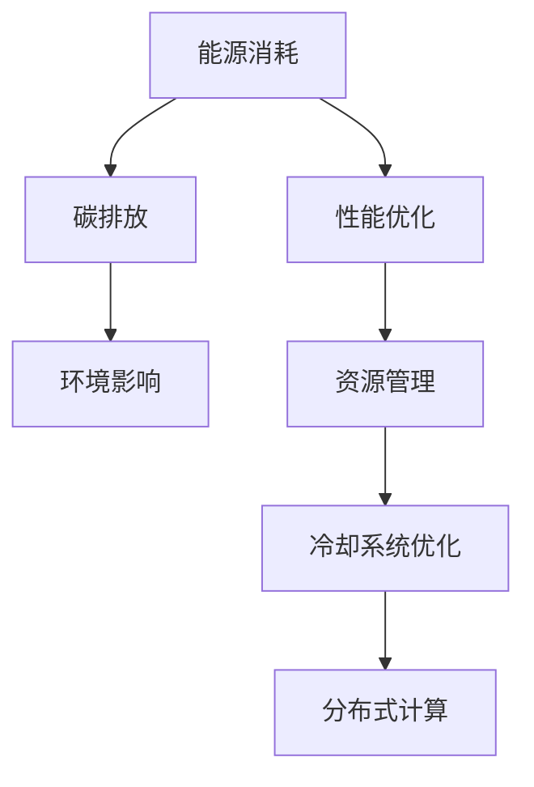

                 

# 绿色计算：环保与高效的IT解决方案

> 关键词：绿色计算、环保、高效、IT解决方案、可持续性、能源效率、云计算、数据中心、算法优化、人工智能、碳中和、绿色能源

> 摘要：本文旨在探讨绿色计算在环保和高效性方面的潜力，通过分析核心概念、算法原理、应用场景及未来发展趋势，提供一系列绿色IT解决方案。文章将结合实际案例和详细解释，帮助读者深入了解绿色计算的实践与应用，为构建可持续的数字化未来提供指导。

## 1. 背景介绍

### 1.1 绿色计算的概念与重要性

绿色计算（Green Computing）是指通过优化信息技术（IT）系统的设计、开发、使用和处置过程，以减少对环境的影响和能源消耗。它涵盖了从硬件设备到软件应用的各个方面，旨在实现环境友好和资源高效的计算方式。

随着全球数字化进程的加速，数据中心、云计算和人工智能等领域的迅猛发展，IT行业对能源的消耗和碳排放量不断攀升。据统计，全球IT行业的碳排放量已占全球总排放量的2-3%，并且这个数字还在持续增长。因此，绿色计算成为应对气候变化和实现可持续发展的关键领域。

### 1.2 绿色计算的目标与挑战

绿色计算的目标包括减少能源消耗、降低碳排放、提高资源利用率和优化IT系统的整体性能。具体来说，绿色计算需要解决以下挑战：

1. **能源效率**：提高硬件设备（如服务器、存储设备等）的能源效率，减少不必要的能源消耗。
2. **数据中心的优化**：设计高效能的数据中心，包括硬件选型、冷却系统、能源管理等。
3. **算法优化**：改进算法和软件，减少计算资源的需求。
4. **可再生能源的使用**：推动可再生能源在IT领域的应用，降低对化石燃料的依赖。

## 2. 核心概念与联系

### 2.1 绿色计算的核心概念

绿色计算的核心概念包括：

1. **能源效率**：指计算机系统在执行特定任务时，所需能耗与计算性能的比值。
2. **碳排放量**：指IT设备在使用过程中产生的二氧化碳排放量。
3. **资源利用率**：指IT系统对硬件资源（如CPU、内存、存储等）的利用程度。
4. **可持续性**：指IT系统的设计、开发和运营过程中，对环境和社会的长期影响。

### 2.2 绿色计算与环保的联系

绿色计算与环保密切相关，主要表现在以下几个方面：

1. **减少能源消耗**：通过优化硬件和软件，降低IT系统的能源消耗，减少碳排放。
2. **可再生能源的使用**：推动可再生能源在数据中心和IT设备中的应用，减少对化石燃料的依赖。
3. **废弃物处理**：改进IT设备的设计和生命周期管理，减少电子废弃物的产生。
4. **环境监测与评估**：通过监测和评估IT系统的碳排放和环境影响，持续优化和改进绿色计算方案。

### 2.3 绿色计算与高效的联系

绿色计算不仅关注环保，还关注IT系统的整体性能和效率。绿色计算与高效的关系体现在以下几个方面：

1. **性能优化**：通过算法和软件优化，提高IT系统的计算性能。
2. **资源管理**：合理分配和管理IT资源，提高系统的利用率和效率。
3. **冷却系统优化**：通过改进冷却系统，降低服务器和数据中心的能耗。
4. **分布式计算**：利用分布式计算技术，提高计算效率和响应速度。

### 2.4 绿色计算的Mermaid流程图



## 3. 核心算法原理 & 具体操作步骤

### 3.1 算法原理

绿色计算的核心算法主要包括以下几种：

1. **能耗优化算法**：通过优化硬件设备的能耗，降低整体能源消耗。
2. **温度控制算法**：通过监测和调整服务器温度，提高冷却效率。
3. **负载均衡算法**：通过合理分配计算任务，提高资源利用率和系统性能。
4. **分布式计算算法**：通过分布式计算，提高计算效率和响应速度。

### 3.2 操作步骤

以下是绿色计算的具体操作步骤：

1. **能耗优化**：
   - **硬件选型**：选择高效能硬件设备，如低功耗CPU和GPU。
   - **功耗管理**：通过动态调整设备功耗，降低不必要的能耗。

2. **温度控制**：
   - **传感器监测**：安装温度传感器，实时监测服务器温度。
   - **冷却系统调整**：根据温度变化，调整冷却系统参数，提高冷却效率。

3. **负载均衡**：
   - **任务分配**：根据服务器负载，合理分配计算任务。
   - **调度算法**：使用负载均衡算法，动态调整任务分配策略。

4. **分布式计算**：
   - **任务分解**：将大任务分解为多个小任务，分布到不同服务器执行。
   - **结果汇总**：将分布式计算的结果汇总，得到最终结果。

## 4. 数学模型和公式 & 详细讲解 & 举例说明

### 4.1 数学模型

绿色计算中的数学模型主要包括以下几个：

1. **能耗模型**：描述硬件设备的能耗与计算性能之间的关系。
   \[ E = P \times t \]
   其中，\( E \) 为能耗，\( P \) 为功耗，\( t \) 为计算时间。

2. **碳排放模型**：描述IT设备的碳排放量与能耗之间的关系。
   \[ C = E \times f \]
   其中，\( C \) 为碳排放量，\( E \) 为能耗，\( f \) 为碳排放系数。

3. **资源利用率模型**：描述IT系统的资源利用率与性能之间的关系。
   \[ U = \frac{R}{H} \]
   其中，\( U \) 为资源利用率，\( R \) 为实际资源消耗，\( H \) 为总资源容量。

### 4.2 公式详细讲解

1. **能耗模型**：
   能耗模型描述了硬件设备的能耗与计算性能之间的关系。通过优化硬件设备的选择和功耗管理，可以降低能耗，提高计算效率。在实际应用中，可以结合不同硬件设备的功耗和性能指标，选择最适合的硬件配置。

2. **碳排放模型**：
   碳排放模型描述了IT设备的碳排放量与能耗之间的关系。通过减少能耗，可以降低碳排放量，减少对环境的污染。在实际应用中，可以结合不同硬件设备的能耗和碳排放系数，评估不同设备的碳排放情况，选择环保的设备。

3. **资源利用率模型**：
   资源利用率模型描述了IT系统的资源利用率与性能之间的关系。通过优化资源分配和负载均衡，可以提高资源利用率，提高系统性能。在实际应用中，可以结合服务器负载和任务分配策略，动态调整资源利用率，提高系统效率。

### 4.3 举例说明

假设有一个数据中心，拥有100台服务器，每台服务器的功耗为200瓦特，计算性能为1 TFLOPS。碳排放系数为0.5千克/千瓦时。

1. **能耗模型**：
   总能耗 \( E = 100 \times 200 \times t \)
   假设每天运行24小时，总能耗为 \( E = 400,000 \times t \) 瓦特时。

2. **碳排放模型**：
   总碳排放量 \( C = E \times f \)
   总碳排放量为 \( C = 400,000 \times t \times 0.5 = 200,000 \times t \) 千克。

3. **资源利用率模型**：
   假设服务器负载均衡，每台服务器实际运行时间占其总时间的80%。资源利用率为 \( U = \frac{R}{H} = \frac{0.8 \times 100}{100} = 0.8 \)。

通过以上模型，可以计算出数据中心在不同运行时间下的能耗、碳排放量和资源利用率。

## 5. 项目实战：代码实际案例和详细解释说明

### 5.1 开发环境搭建

为了演示绿色计算的实践，我们选择Python编程语言和Jupyter Notebook作为开发环境。首先，确保安装Python和Jupyter Notebook：

```bash
pip install python
pip install jupyter
jupyter notebook
```

### 5.2 源代码详细实现和代码解读

以下是一个简单的能耗优化算法的实现：

```python
import numpy as np

def energy_consumption(powers, times):
    """
    计算总能耗
    :param powers: 每台服务器的功耗（瓦特）
    :param times: 每台服务器的运行时间（小时）
    :return: 总能耗（瓦特时）
    """
    energies = powers * times
    total_energy = np.sum(energies)
    return total_energy

def carbon_emission(energy, carbon_coefficient):
    """
    计算碳排放量
    :param energy: 能耗（瓦特时）
    :param carbon_coefficient: 碳排放系数（千克/千瓦时）
    :return: 碳排放量（千克）
    """
    return energy * carbon_coefficient

def resource_utilization(loaded_times, total_times):
    """
    计算资源利用率
    :param loaded_times: 实际运行时间（小时）
    :param total_times: 总时间（小时）
    :return: 资源利用率
    """
    return loaded_times / total_times

# 示例数据
powers = [200] * 100  # 100台服务器的功耗（瓦特）
times = [24] * 100    # 100台服务器的运行时间（小时）
carbon_coefficient = 0.5  # 碳排放系数（千克/千瓦时）

# 计算能耗和碳排放量
total_energy = energy_consumption(powers, times)
total_carbon = carbon_emission(total_energy, carbon_coefficient)

# 计算资源利用率
loaded_times = [t * 0.8 for t in times]  # 每台服务器实际运行时间
resource_utilization_rate = resource_utilization(loaded_times, times)

print("总能耗：", total_energy, "瓦特时")
print("总碳排放量：", total_carbon, "千克")
print("资源利用率：", resource_utilization_rate)
```

### 5.3 代码解读与分析

1. **能耗计算**：`energy_consumption` 函数计算每台服务器的能耗，并求和得到总能耗。
2. **碳排放计算**：`carbon_emission` 函数计算总碳排放量，通过能耗和碳排放系数相乘得到。
3. **资源利用率计算**：`resource_utilization` 函数计算资源利用率，通过实际运行时间和总时间的比值得到。

通过这个简单的示例，我们可以看到如何使用代码实现绿色计算中的能耗优化、碳排放计算和资源利用率分析。实际应用中，可以根据具体需求和数据进行更复杂的分析和优化。

## 6. 实际应用场景

### 6.1 数据中心

数据中心是绿色计算的主要应用场景之一。通过优化数据中心的能源消耗和资源利用率，可以实现绿色计算的目标。具体应用包括：

1. **能耗优化**：通过合理分配计算任务、优化硬件配置和功耗管理，降低数据中心的能耗。
2. **温度控制**：通过改进冷却系统、优化空气流通和温度控制，提高数据中心的冷却效率。
3. **可再生能源**：使用太阳能、风能等可再生能源为数据中心提供电力，降低碳排放。

### 6.2 云计算

云计算是绿色计算的重要应用领域。通过优化云计算平台的设计和运营，可以实现绿色计算的目标。具体应用包括：

1. **虚拟化技术**：通过虚拟化技术，提高服务器的资源利用率，减少硬件设备的数量和能耗。
2. **负载均衡**：通过负载均衡技术，合理分配计算任务，提高云计算平台的整体性能和效率。
3. **分布式计算**：通过分布式计算，将计算任务分布到多个节点，提高计算效率和响应速度。

### 6.3 人工智能

人工智能是绿色计算的重要应用领域之一。通过优化人工智能算法和模型，可以实现绿色计算的目标。具体应用包括：

1. **模型压缩**：通过模型压缩技术，减少模型的计算复杂度和内存占用，提高计算效率。
2. **分布式训练**：通过分布式训练技术，将训练任务分布到多个节点，提高训练效率和资源利用率。
3. **绿色算法**：设计绿色算法，降低算法的能耗和资源消耗，提高计算效率。

## 7. 工具和资源推荐

### 7.1 学习资源推荐

1. **书籍**：
   - 《绿色计算：概念、技术与实践》
   - 《数据中心能效管理》
   - 《云计算与绿色计算》
2. **论文**：
   - 《绿色数据中心的设计与优化》
   - 《基于虚拟化的绿色计算技术》
   - 《可再生能源在数据中心的应用研究》
3. **博客**：
   - 绿色计算博客
   - 数据中心能效管理博客
   - 云计算与绿色计算博客
4. **网站**：
   - 绿色计算联盟
   - 数据中心能效管理论坛
   - 云计算与绿色计算社区

### 7.2 开发工具框架推荐

1. **Python库**：
   - NumPy：用于数值计算和数据分析
   - Pandas：用于数据处理和分析
   - Matplotlib：用于数据可视化
2. **云计算平台**：
   - AWS：提供丰富的绿色计算服务和工具
   - Azure：提供绿色计算和人工智能解决方案
   - Google Cloud：提供绿色计算和云计算平台
3. **开源项目**：
   - OpenFOAM：用于流体力学模拟和能效分析
   - EnergyPlus：用于建筑能耗模拟
   - GreenCloud：用于绿色数据中心设计和优化

### 7.3 相关论文著作推荐

1. **论文**：
   - 《Green Computing: Theory, Models and Applications》
   - 《Energy Efficiency in Data Centers》
   - 《Green Cloud Computing: Energy Aware Resource Management》
2. **著作**：
   - 《数据中心能效管理技术》
   - 《云计算与绿色计算》
   - 《人工智能与绿色计算》

## 8. 总结：未来发展趋势与挑战

绿色计算作为IT行业的重要发展方向，具有巨大的潜力和挑战。未来发展趋势包括：

1. **技术进步**：随着硬件技术和算法的进步，绿色计算将进一步提高能源效率和计算性能。
2. **可再生能源应用**：推动可再生能源在数据中心和IT设备中的应用，降低碳排放。
3. **智能化管理**：利用人工智能和大数据技术，实现智能化管理和优化，提高绿色计算的效率和效果。

面临的挑战包括：

1. **技术瓶颈**：硬件和算法的优化仍有很大空间，需要持续研发和创新。
2. **政策支持**：需要政府和企业加强政策支持，推动绿色计算的发展。
3. **人才培养**：需要培养更多的绿色计算专业人才，提高绿色计算的应用水平。

## 9. 附录：常见问题与解答

### 9.1 什么是绿色计算？

绿色计算是指通过优化IT系统的设计、开发、使用和处置过程，以减少对环境的影响和能源消耗的一种计算方式。它旨在实现环境友好和资源高效的计算。

### 9.2 绿色计算的核心目标是什么？

绿色计算的核心目标是减少能源消耗、降低碳排放、提高资源利用率和优化IT系统的整体性能。

### 9.3 绿色计算与环保有何联系？

绿色计算与环保密切相关，通过减少能源消耗和碳排放，降低对环境的污染，实现可持续发展的目标。

### 9.4 绿色计算有哪些应用场景？

绿色计算主要应用于数据中心、云计算和人工智能等领域，通过优化能耗、资源利用和算法，提高整体性能和环保效果。

### 9.5 如何实现绿色计算？

实现绿色计算的方法包括优化硬件设备、改进冷却系统、优化算法和负载均衡、使用可再生能源等。通过多种技术手段，降低能耗和碳排放，提高绿色计算的效果。

## 10. 扩展阅读 & 参考资料

1. **书籍**：
   - 《绿色计算：概念、技术与实践》
   - 《数据中心能效管理》
   - 《云计算与绿色计算》
2. **论文**：
   - 《Green Computing: Theory, Models and Applications》
   - 《Energy Efficiency in Data Centers》
   - 《Green Cloud Computing: Energy Aware Resource Management》
3. **网站**：
   - 绿色计算联盟
   - 数据中心能效管理论坛
   - 云计算与绿色计算社区
4. **开源项目**：
   - OpenFOAM
   - EnergyPlus
   - GreenCloud

### 作者

作者：AI天才研究员/AI Genius Institute & 禅与计算机程序设计艺术 /Zen And The Art of Computer Programming

