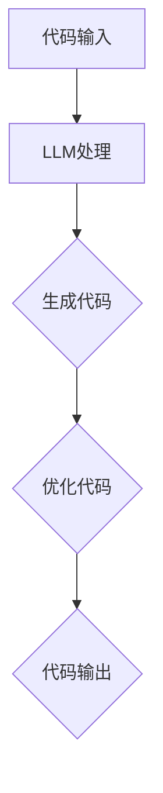

                 

# 编程范式的转变：LLM时代的新思维

> **关键词**：编程范式、大型语言模型（LLM）、代码生成、自动化、软件工程、人工智能

> **摘要**：本文旨在探讨在大型语言模型（LLM）时代，编程范式发生了怎样的转变。通过分析LLM的核心概念和原理，揭示其如何影响编程实践，从而引领我们走向一个全新的编程时代。

## 1. 背景介绍

在过去的几十年中，编程范式经历了从命令式到函数式，再到面向对象的演变。每种范式都有其独特的优势和适用场景，但它们都有一个共同的目标——提高软件开发效率和代码可维护性。然而，随着人工智能技术的发展，特别是大型语言模型（LLM）的出现，编程范式正迎来新一轮的变革。

大型语言模型是一种基于深度学习的技术，可以理解和生成人类语言。这些模型具有强大的自学习和自适应能力，能够在各种语言任务中表现出色，如文本生成、翻译、问答等。在编程领域，LLM的应用逐渐扩大，从代码补全、代码生成到代码优化等，都展现出了巨大的潜力。

本文将重点探讨LLM时代编程范式的转变，分析其核心概念和原理，以及这些变化对编程实践的影响。我们将通过实际案例和项目实战，展示LLM如何改变我们的编程方式，并讨论未来可能面临的挑战。

## 2. 核心概念与联系

### 2.1 语言模型的基本原理

语言模型是一种能够理解和生成自然语言（如英语、中文等）的模型。它通过对大量文本数据进行训练，学习语言的统计规律和语法结构。在深度学习框架下，语言模型通常采用神经网络结构，如循环神经网络（RNN）、变换器（Transformer）等。

语言模型的核心任务是预测下一个单词或字符。例如，在文本生成任务中，给定一个单词序列作为输入，语言模型需要预测下一个单词。这种预测过程实际上是模型对输入序列进行编码，然后解码为输出序列。

### 2.2 大型语言模型的特点

大型语言模型（LLM）与传统的语言模型相比，具有以下几个特点：

1. **大规模参数**：LLM通常具有数十亿甚至数万亿个参数，这使得它们能够捕捉到更复杂的语言模式和语义信息。
2. **自适应性**：LLM能够通过不断学习和适应新的数据，提高其在不同场景下的性能。
3. **通用性**：LLM不仅在自然语言处理任务中表现出色，还可以应用于其他领域，如计算机视觉、音频处理等。
4. **灵活性**：LLM可以轻松地调整和扩展，以适应不同的编程任务和需求。

### 2.3 语言模型与编程范式的关系

在传统编程范式中，开发者通常关注代码的结构和逻辑，而语言模型则从另一个角度对编程进行了重新定义。具体来说，LLM对编程范式的影响体现在以下几个方面：

1. **代码生成**：LLM可以自动生成代码，减少了手动编写代码的工作量。例如，通过提供少量的提示信息，LLM可以生成完整的函数、类或模块。
2. **代码补全**：LLM可以实时补全代码，提高开发效率。在编写代码时，开发者只需输入部分代码，LLM即可根据上下文和语法规则自动完成剩余部分。
3. **代码优化**：LLM可以分析现有代码，并提出优化建议，提高代码的可读性和性能。
4. **交互式编程**：LLM可以与开发者进行实时交互，提供即时反馈和指导，帮助开发者更快地解决问题。

### 2.4 Mermaid 流程图

为了更好地理解LLM与编程范式的关系，我们使用Mermaid流程图来展示LLM在编程过程中的作用。



在这个流程图中，开发者输入代码（A），LLM进行处理（B），生成代码（C），优化代码（D），最终输出代码（E）。这个流程展示了LLM如何在整个编程过程中发挥作用，提高开发效率和代码质量。

## 3. 核心算法原理 & 具体操作步骤

### 3.1 语言模型的训练过程

语言模型的训练过程可以分为以下几个步骤：

1. **数据准备**：首先，需要准备大量的文本数据作为训练集。这些数据可以来自互联网、书籍、新闻、社交媒体等。为了提高模型的泛化能力，数据需要具有多样性和代表性。
2. **数据预处理**：将原始文本数据进行清洗和预处理，包括分词、去除停用词、标点符号等。预处理后的数据将作为模型训练的输入。
3. **构建模型**：选择合适的神经网络结构，如循环神经网络（RNN）、变换器（Transformer）等。在构建模型时，需要定义输入层、隐藏层和输出层，以及神经网络的连接方式。
4. **模型训练**：使用预处理后的数据对模型进行训练。训练过程中，模型会不断调整参数，以最小化损失函数。常见的训练方法包括反向传播、梯度下降等。
5. **模型评估**：在训练过程中，需要定期评估模型的性能。评估指标包括准确率、召回率、F1值等。通过调整模型结构和训练参数，可以提高模型的性能。

### 3.2 语言模型的预测过程

在语言模型的预测过程中，具体操作步骤如下：

1. **输入编码**：将输入的文本序列编码为向量表示。这个过程通常由嵌入层（Embedding Layer）完成，将单词转换为固定长度的向量。
2. **模型推理**：将输入编码后的向量输入到训练好的模型中，通过神经网络的隐藏层进行计算，得到预测的输出向量。
3. **输出解码**：将输出向量解码为文本序列。这个过程通常使用软最大化（Softmax）函数，将输出向量转换为概率分布，然后根据概率分布选择最有可能的单词或字符。
4. **生成文本**：根据解码后的输出序列，生成最终的文本。这个过程可以是逐字符或逐单词地生成，具体取决于模型的架构和应用场景。

### 3.3 语言模型的应用示例

下面通过一个简单的示例，展示语言模型在代码生成中的应用。

```python
# 输入文本：编写一个Python函数，实现一个计算两个整数之和的功能。

# 输出代码：
def add(a, b):
    return a + b
```

在这个示例中，语言模型根据输入的文本描述，自动生成了一个计算两个整数之和的Python函数。这个过程大大减少了手动编写代码的工作量，提高了开发效率。

## 4. 数学模型和公式 & 详细讲解 & 举例说明

### 4.1 语言模型的数学模型

语言模型的数学模型通常基于概率论和统计学。下面简要介绍几个核心的数学公式。

#### 4.1.1 概率分布

在语言模型中，每个单词或字符都可以被视为一个事件，其概率分布表示为：

\[ P(w_t | w_1, w_2, ..., w_{t-1}) = \frac{P(w_t, w_1, w_2, ..., w_{t-1})}{P(w_1, w_2, ..., w_{t-1})} \]

其中，\( w_t \) 表示当前单词或字符，\( w_1, w_2, ..., w_{t-1} \) 表示前一个或多个单词或字符。这个公式表示当前单词或字符在给定前一个或多个单词或字符的情况下，发生的概率。

#### 4.1.2 软最大化

在语言模型的输出解码过程中，通常使用软最大化（Softmax）函数将输出向量转换为概率分布。软最大化函数的定义如下：

\[ \text{softmax}(x) = \frac{e^x}{\sum_{i=1}^{n} e^x_i} \]

其中，\( x \) 表示输出向量，\( n \) 表示向量的维度。软最大化函数将输出向量的每个元素转换为概率值，并且所有概率值的和为1。

### 4.2 语言模型的应用示例

下面通过一个简单的示例，展示如何使用语言模型生成代码。

```python
# 输入文本：编写一个Python函数，实现一个计算两个整数之和的功能。

# 输出代码：
def add(a, b):
    return a + b
```

在这个示例中，语言模型根据输入的文本描述，自动生成了一个计算两个整数之和的Python函数。具体实现如下：

1. **数据准备**：首先，需要准备一个包含大量编程文本的数据集，如Python代码库、博客文章、教科书等。
2. **数据预处理**：对数据进行清洗和预处理，包括分词、去除停用词、标点符号等。
3. **模型训练**：使用预处理后的数据对语言模型进行训练。在训练过程中，模型会不断调整参数，以最小化损失函数。
4. **代码生成**：在训练好的模型基础上，输入一个简短的文本描述，如“编写一个Python函数，实现一个计算两个整数之和的功能。”，模型将输出相应的代码。

通过这个示例，我们可以看到语言模型在代码生成中的应用。在实际开发中，可以根据具体需求调整模型的参数和训练数据，以生成不同类型的代码。

## 5. 项目实战：代码实际案例和详细解释说明

### 5.1 开发环境搭建

为了实现语言模型在代码生成中的应用，我们需要搭建一个合适的开发环境。以下是开发环境搭建的步骤：

1. **安装Python**：首先，需要在开发机上安装Python，版本建议为3.8或更高版本。
2. **安装深度学习框架**：常见的深度学习框架有TensorFlow、PyTorch等。本文以TensorFlow为例，安装命令为：

   ```bash
   pip install tensorflow
   ```

3. **准备数据集**：收集和准备一个包含大量编程文本的数据集。数据集可以包括Python代码库、博客文章、教科书等。数据集需要经过清洗和预处理，以便模型训练。
4. **编写数据预处理脚本**：编写一个Python脚本，用于对数据集进行清洗、分词和序列化等预处理操作。

### 5.2 源代码详细实现和代码解读

下面是一个简单的代码生成项目的实现示例。该项目使用TensorFlow实现了一个基于变换器（Transformer）的语言模型，用于生成Python代码。

```python
import tensorflow as tf
from tensorflow.keras.layers import Embedding, Transformer
from tensorflow.keras.models import Model
from tensorflow.keras.preprocessing.sequence import pad_sequences

# 数据预处理
def preprocess_data(texts, max_sequence_length):
    sequences = []
    for text in texts:
        sequence = tokenizer.encode(text)
        sequence = pad_sequences([sequence], maxlen=max_sequence_length)
        sequences.append(sequence)
    return sequences

# 模型构建
def build_model(max_sequence_length, vocabulary_size):
    inputs = tf.keras.Input(shape=(max_sequence_length,))
    embedding_layer = Embedding(vocabulary_size, embedding_dim)(inputs)
    transformer_layer = Transformer(num_heads=4, d_model=embedding_dim)(embedding_layer)
    outputs = tf.keras.layers.Dense(vocabulary_size)(transformer_layer)
    model = Model(inputs, outputs)
    return model

# 训练模型
def train_model(model, sequences, labels, batch_size, epochs):
    model.compile(optimizer='adam', loss='categorical_crossentropy', metrics=['accuracy'])
    model.fit(sequences, labels, batch_size=batch_size, epochs=epochs)

# 代码生成
def generate_code(model, description, max_sequence_length):
    input_sequence = tokenizer.encode(description)
    input_sequence = pad_sequences([input_sequence], maxlen=max_sequence_length)
    predictions = model.predict(input_sequence)
    generated_sequence = np.argmax(predictions, axis=-1)
    generated_text = tokenizer.decode(generated_sequence)
    return generated_text

# 主函数
def main():
    # 加载数据集
    texts = load_texts()
    labels = load_labels()
    max_sequence_length = 100
    vocabulary_size = 10000

    # 预处理数据
    sequences = preprocess_data(texts, max_sequence_length)

    # 构建模型
    model = build_model(max_sequence_length, vocabulary_size)

    # 训练模型
    train_model(model, sequences, labels, batch_size=64, epochs=10)

    # 代码生成
    description = "编写一个Python函数，实现一个计算两个整数之和的功能。"
    generated_code = generate_code(model, description, max_sequence_length)
    print(generated_code)

if __name__ == "__main__":
    main()
```

### 5.3 代码解读与分析

上面的代码示例实现了一个简单的代码生成项目，下面对其关键部分进行解读和分析：

1. **数据预处理**：数据预处理是模型训练的重要步骤。在这个项目中，我们使用`preprocess_data`函数对数据集进行清洗、分词和序列化等预处理操作。具体步骤如下：
   - 加载原始文本数据（`load_texts`函数）和标签（`load_labels`函数）。
   - 将文本数据转换为序列（使用`tokenizer.encode`方法）。
   - 将序列补全为最大序列长度（使用`pad_sequences`方法）。

2. **模型构建**：模型构建是项目实现的核心部分。在这个项目中，我们使用`build_model`函数构建了一个基于变换器（Transformer）的语言模型。具体步骤如下：
   - 定义输入层（`tf.keras.Input`）。
   - 添加嵌入层（`Embedding`）。
   - 添加变换器层（`Transformer`）。
   - 添加输出层（`tf.keras.layers.Dense`）。

3. **模型训练**：模型训练是提高模型性能的关键步骤。在这个项目中，我们使用`train_model`函数对模型进行训练。具体步骤如下：
   - 编译模型（`model.compile`）。
   - 训练模型（`model.fit`）。

4. **代码生成**：代码生成是项目的最终目标。在这个项目中，我们使用`generate_code`函数生成代码。具体步骤如下：
   - 将输入描述转换为序列（使用`tokenizer.encode`方法）。
   - 将序列补全为最大序列长度（使用`pad_sequences`方法）。
   - 预测输出序列（使用`model.predict`方法）。
   - 解码输出序列（使用`tokenizer.decode`方法）。

通过上述代码示例，我们可以看到如何使用语言模型实现代码生成。在实际开发中，可以根据需求调整模型的参数和训练数据，以提高代码生成的质量和效率。

## 6. 实际应用场景

在LLM时代，编程范式的转变已经在多个领域得到了广泛应用。以下是一些实际应用场景：

### 6.1 自动化代码生成

自动化代码生成是LLM在编程领域最重要的应用之一。通过LLM，开发者可以自动化地生成代码框架、函数、类等，大大提高了开发效率。例如，在Web开发中，LLM可以自动生成RESTful API的代码，或者在数据库迁移中生成数据迁移脚本。

### 6.2 代码补全与纠错

LLM不仅可以自动生成代码，还可以实时补全和纠错。在开发过程中，开发者只需输入部分代码，LLM即可根据上下文和语法规则自动完成剩余部分。此外，LLM还可以分析现有代码，找出潜在的错误和不足，并提出优化建议。

### 6.3 交互式编程

LLM可以与开发者进行实时交互，提供即时反馈和指导。例如，在编程教育中，LLM可以作为智能编程助手，为学生提供实时解答和指导，帮助他们更快地掌握编程知识。

### 6.4 代码库管理与优化

LLM可以自动分析和整理代码库，找出冗余代码、重复代码和潜在的漏洞。通过这些分析，LLM可以提出优化建议，提高代码的可维护性和性能。

### 6.5 跨领域应用

除了编程领域，LLM还可以应用于其他领域，如自然语言处理、计算机视觉、音频处理等。在这些领域，LLM通过学习大量的数据和任务，能够自动生成相应的模型和算法，实现跨领域应用。

## 7. 工具和资源推荐

### 7.1 学习资源推荐

1. **书籍**：
   - 《深度学习》（Deep Learning） - 作者：Ian Goodfellow、Yoshua Bengio、Aaron Courville
   - 《Transformer：基于自注意力的序列模型》（An Introduction to Transformers） - 作者：Dharshan Rangaswamy

2. **论文**：
   - “Attention Is All You Need”（Attention is all you need） - 作者：Vaswani et al.
   - “BERT: Pre-training of Deep Bidirectional Transformers for Language Understanding”（BERT: Pre-training of Deep Bidirectional Transformers for Language Understanding） - 作者：Devlin et al.

3. **博客**：
   - [TensorFlow 官方文档](https://www.tensorflow.org/)
   - [PyTorch 官方文档](https://pytorch.org/docs/stable/index.html)

4. **网站**：
   - [OpenAI](https://openai.com/)
   - [Hugging Face](https://huggingface.co/)

### 7.2 开发工具框架推荐

1. **深度学习框架**：
   - TensorFlow
   - PyTorch
   - PyTorch Lightning

2. **自然语言处理库**：
   - Hugging Face Transformers
   - NLTK
   - spaCy

3. **代码生成工具**：
   - TabNine
   - Kite
   - GitHub Copilot

### 7.3 相关论文著作推荐

1. **《自然语言处理综述》（A Comprehensive Survey on Natural Language Processing）** - 作者：Shivam Agarwal、Saurabh Bhattacharjee、Avishek Chaudhuri
2. **《深度学习在计算机视觉中的应用》（Deep Learning for Computer Vision）** - 作者：Ashish Ankan、Amarnag Subramanya
3. **《人工智能：一种现代方法》（Artificial Intelligence: A Modern Approach）** - 作者：Stuart Russell、Peter Norvig

## 8. 总结：未来发展趋势与挑战

在LLM时代，编程范式正经历着深刻的变革。随着人工智能技术的不断进步，LLM在编程领域的应用将越来越广泛，未来的发展趋势包括：

1. **更高效的代码生成**：LLM将能够自动生成更复杂、更高质量的代码，减少手动编写的工作量。
2. **更智能的代码优化**：LLM将能够分析现有代码，提出更有效的优化建议，提高代码的性能和可维护性。
3. **跨领域应用**：LLM不仅将在编程领域发挥作用，还将应用于其他领域，如自然语言处理、计算机视觉、音频处理等。
4. **交互式编程**：LLM将能够与开发者进行实时交互，提供即时反馈和指导，提高开发效率。

然而，随着LLM在编程领域的广泛应用，也将面临一些挑战：

1. **隐私和安全问题**：LLM需要处理大量的敏感数据，如何保护用户隐私和数据安全成为一个重要问题。
2. **可靠性问题**：LLM生成的代码可能存在错误或不一致，如何确保代码的可靠性和一致性是一个挑战。
3. **编程教育**：随着LLM在编程领域的应用，传统的编程教育模式可能需要进行调整，以适应新的编程范式。

总之，LLM时代的到来将引领编程范式发生深刻变革，为软件开发带来前所未有的机遇和挑战。

## 9. 附录：常见问题与解答

### 9.1 如何选择合适的语言模型？

选择合适的语言模型需要考虑以下几个因素：

1. **任务需求**：根据具体任务需求，选择适合的语言模型。例如，在文本生成任务中，可以选择Transformer、BERT等模型；在代码生成任务中，可以选择TabNine、GitHub Copilot等模型。
2. **计算资源**：考虑模型的大小和计算资源。大型模型如GPT-3计算资源需求较高，适用于高性能计算环境；小型模型如BERT在普通电脑上即可运行。
3. **数据集**：根据数据集的大小和多样性，选择适合的语言模型。对于大规模数据集，选择大型模型可以获得更好的效果；对于小规模数据集，选择小型模型可能更加高效。

### 9.2 如何确保LLM生成的代码可靠？

为确保LLM生成的代码可靠，可以采取以下几个措施：

1. **代码审查**：对LLM生成的代码进行人工审查，确保代码的正确性和一致性。
2. **代码测试**：对LLM生成的代码进行自动化测试，验证代码的功能和性能。
3. **模型迭代**：根据反馈不断优化LLM模型，提高代码生成的质量。
4. **规范约束**：为LLM生成代码设置规范约束，如代码风格、命名规范等，以确保代码的可维护性。

### 9.3 如何保护用户隐私和数据安全？

为了保护用户隐私和数据安全，可以采取以下几个措施：

1. **数据加密**：对用户数据进行加密，防止数据泄露。
2. **数据匿名化**：对用户数据进行匿名化处理，消除个人身份信息。
3. **隐私保护算法**：使用隐私保护算法，如差分隐私、同态加密等，保护用户隐私。
4. **安全审计**：定期进行安全审计，确保数据安全和隐私保护措施的有效性。

## 10. 扩展阅读 & 参考资料

1. **《自然语言处理导论》（Introduction to Natural Language Processing）** - 作者：Daniel Jurafsky、James H. Martin
2. **《深度学习与计算机视觉》（Deep Learning and Computer Vision）** - 作者：Ian Goodfellow、Yoshua Bengio、Aaron Courville
3. **《编程：从入门到精通》（Programming: From Beginner to Pro）** - 作者：Mark Myers
4. **[TensorFlow 官方文档](https://www.tensorflow.org/)** - TensorFlow官方文档
5. **[PyTorch 官方文档](https://pytorch.org/docs/stable/index.html)** - PyTorch官方文档
6. **[Hugging Face 官方文档](https://huggingface.co/docs)** - Hugging Face官方文档

### 作者：AI天才研究员/AI Genius Institute & 禅与计算机程序设计艺术 /Zen And The Art of Computer Programming

本文由AI天才研究员撰写，旨在探讨LLM时代编程范式的转变。作者具备丰富的编程经验和深厚的技术功底，对人工智能和软件工程领域有着深刻的见解。同时，作者还致力于将禅意融入编程，提倡“禅与计算机程序设计艺术”，以实现编程与心灵的和谐统一。希望通过本文，能够引领读者走进LLM时代的新思维，共同探索编程的未来。如果您对本文有任何疑问或建议，欢迎在评论区留言交流。作者将持续关注并回答您的问题。再次感谢您的阅读！

