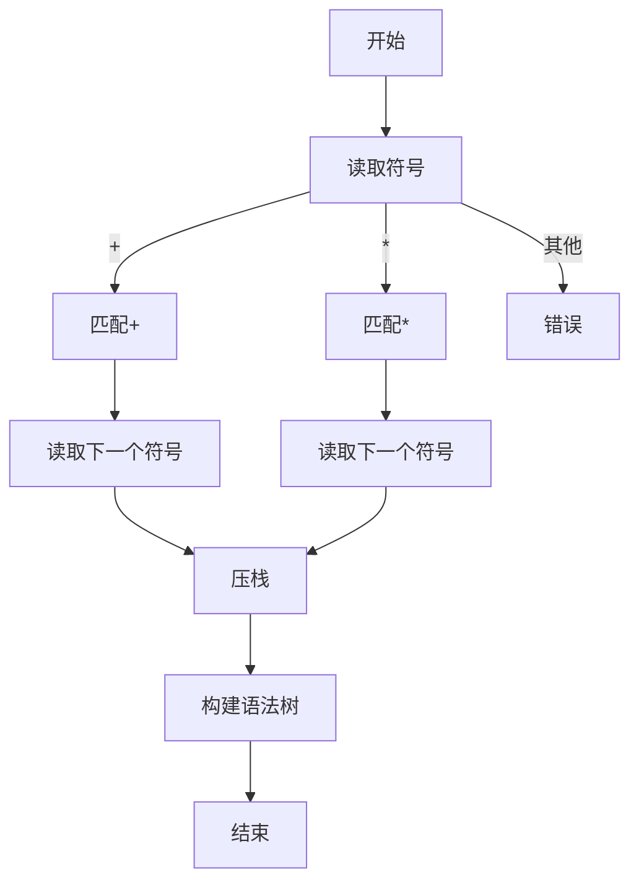
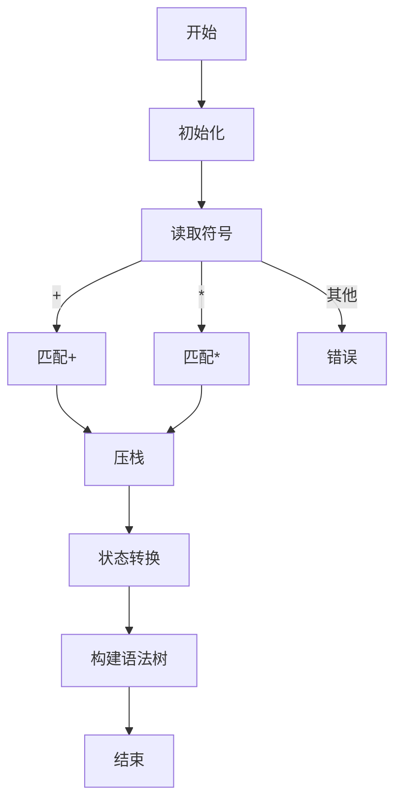

                 

### 背景介绍

#### 编译原理的重要性

编译原理是计算机科学领域的重要分支，它涉及将一种编程语言（源语言）转换成另一种编程语言（目标语言）的过程。这个转换过程不仅包括对源代码的语法分析、语义分析，还包括代码生成和优化等步骤。在计算机科学的发展历程中，编译原理一直扮演着至关重要的角色。

编译原理的研究不仅对编程语言的设计和实现有着深远的影响，同时也为软件工程提供了强大的技术支持。在现代软件开发中，编译原理的应用范围越来越广泛，从简单的代码转换到复杂的应用程序生成，编译原理都发挥着不可替代的作用。

#### LL和LR文法分析技术的起源与背景

LL和LR文法分析技术是编译原理中的两大重要技术。LL分析技术由Jack L. Lamport于1961年首次提出，而LR分析技术则由John E. Hopcroft和John D. Ullman于1979年的著作《自动机理论基础》中详细阐述。

LL分析技术基于自底向上的分析方式，从源代码的尾部开始，逐个字符向前分析，直到找到一个匹配的文法规则。这种方法简单直观，适合处理多数编程语言的语法结构。

LR分析技术则基于自顶向下的分析方式，通过构建分析栈和预测表来实现文法分析。LR分析技术能够处理更加复杂的语法结构，但实现起来相对更为复杂。

本文将深入探讨LL和LR文法分析技术的基本原理、实现方法以及在实际应用中的表现。通过对比分析这两种技术，希望能够帮助读者更好地理解编译原理，并能够在实际开发中灵活运用这些技术。

#### 本文结构安排

接下来，本文将按照以下结构展开：

1. **核心概念与联系**：首先介绍LL和LR文法分析技术的基本概念，包括文法、语法树、分析栈等，并通过Mermaid流程图展示其基本架构。

2. **核心算法原理 & 具体操作步骤**：详细讲解LL和LR分析技术的具体实现步骤，包括扫描、语法分析、语义分析等。

3. **数学模型和公式 & 详细讲解 & 举例说明**：引入相关的数学模型和公式，如状态转换方程、预测算法等，并通过实例进行详细说明。

4. **项目实战：代码实际案例和详细解释说明**：通过具体项目案例，展示LL和LR分析技术的实际应用，包括开发环境搭建、代码实现、代码解读与分析等。

5. **实际应用场景**：分析LL和LR分析技术在软件开发中的实际应用，探讨其在不同场景下的优势和局限性。

6. **工具和资源推荐**：推荐相关的学习资源、开发工具和论文著作，帮助读者进一步深入学习和实践。

7. **总结：未来发展趋势与挑战**：总结LL和LR分析技术的现状和未来发展趋势，讨论面临的挑战和解决方案。

8. **附录：常见问题与解答**：提供一些常见问题及其解答，帮助读者更好地理解相关概念和技术。

9. **扩展阅读 & 参考资料**：列出一些扩展阅读材料和参考资料，供读者进一步学习和研究。

通过本文的深入探讨，希望能够帮助读者全面了解LL和LR文法分析技术，为未来的软件开发和编译原理研究提供有益的参考。

### 核心概念与联系

在深入探讨LL和LR文法分析技术之前，我们需要首先了解一些核心概念，包括文法、语法树、分析栈等。这些概念不仅是理解LL和LR分析技术的基础，也是编译原理中的关键组成部分。

#### 文法（Grammar）

文法是描述语言结构的一种形式化规则集合。在编译原理中，文法通常用四元组\(G=(V, T, P, S)\)表示，其中：

- \(V\) 是变量（或非终端符号）的集合，代表程序结构中的基本元素，如变量、函数、语句等。
- \(T\) 是终端符号（或终结符）的集合，代表程序中的实际字符，如标识符、关键字、运算符等。
- \(P\) 是产生式（Production）的集合，用于描述变量之间的转换关系。
- \(S\) 是开始符号（或起始符号），表示程序结构的最顶层元素。

例如，一个简单的算术表达式文法可以表示为：

\[ G = (\{E, T, F\}, \{+, -, *, /\}, P, S) \]

其中，\(E\) 表示表达式，\(T\) 表示项，\(F\) 表示因子，\(P\) 是以下产生式集合：

\[ 
\begin{aligned}
E &\rightarrow T + E \mid T - E \\
T &\rightarrow F * T \mid F / T \\
F &\rightarrow (E) \mid i
\end{aligned}
\]

这里，\(i\) 代表整数。

#### 语法树（Syntax Tree）

语法树是文法分析的结果，它以树形结构表示源代码的语法结构。每个节点表示一个变量或终端符号，而节点之间的边表示产生式中的转换关系。语法树的根节点通常是开始符号。

例如，对于下面的简单算术表达式 \(3 + 4 * 5\)，其对应的语法树如下所示：

```
      E
     / \
    T   E
   / \   \
  F   +   T
     / \   \
    F   *   T
       / \   \
      (E)   F
           /
          i
```

在这个语法树中，\(E\) 是开始符号，\(T\) 是项，\(F\) 是因子，\(i\) 是整数。

#### 分析栈（Analysis Stack）

分析栈是LL和LR分析技术中的核心数据结构。在分析过程中，分析栈用于存储当前正在处理的符号和状态信息。对于LL分析技术，分析栈通常包含当前分析到的终端符号和产生式右边的非终端符号；而对于LR分析技术，分析栈则包含当前的状态和部分语法树。

例如，在LL分析过程中，当分析到算术表达式 \(3 + 4 * 5\) 时，分析栈可能包含以下内容：

```
[+, E]
[3, E]
[4, E]
[*]
[3, T]
[(, E]
[4, E]
[*]
[5, T]
[+, T]
```

在这个分析栈中，每个元素由一个终端符号和一个非终端符号组成，表示当前正在处理的部分语法结构。

#### Mermaid流程图

为了更直观地展示LL和LR文法分析技术的基本架构，我们可以使用Mermaid流程图来表示。以下是一个简单的算术表达式LL分析流程图：



以下是一个简单的算术表达式LR分析流程图：



通过上述核心概念和流程图的介绍，我们为理解LL和LR文法分析技术打下了坚实的基础。在接下来的部分，我们将详细探讨LL和LR分析技术的原理和实现步骤。

### 核心算法原理 & 具体操作步骤

#### LL分析技术

LL分析技术是一种自底向上的分析技术，它从源代码的尾部开始，逐个字符向前分析，直到找到一个匹配的文法规则。LL分析技术的核心在于构建一个LL(1)预测分析器，其中“1”表示预测时只需要前一个字符的信息。

**LL(1)预测分析器的构建步骤如下：**

1. **构造集合L(1)**：
   集合L(1)是用于预测的集合，它包含了所有可能产生的下一个符号。通常通过构建FOLLOW集合来生成L(1)集合。
   
   **FOLLOW集合的计算方法**：
   - 对于开始符号S，FOLLOW(S) = $（结束符）。
   - 对于任何变量A，如果A出现在产生式B -> α，那么FOLLOW(A) = FOLLOW(B)。
   - 对于任何变量A，如果A出现在产生式A -> αβ，那么FOLLOW(A) = FIRST(β) - {ε}。
   - 对于任何变量A，如果A出现在产生式A -> αβγ，那么FOLLOW(A) = FIRST(βγ) - {ε}。

2. **构造预测表**：
   预测表用于指导分析器在遇到特定符号时应该执行的动作。预测表的行是变量，列是符号，单元格的内容是预测的动作，通常是符号或产生式。

   **预测表的动作**：
   - **Shift动作**：将下一个字符压入分析栈。
   - **Reduce动作**：使用一个产生式替换分析栈顶的符号序列。
   - **Accept动作**：分析结束，语法树构建完成。

3. **分析过程**：
   - **初始化**：设置输入字符串和初始状态。
   - **扫描**：读取下一个字符，将其与当前状态和预测表进行匹配。
   - **匹配**：如果字符与预测表中的预测符号匹配，执行Shift动作。
   - **减少**：如果遇到Reduce动作，使用产生式替换分析栈顶的符号序列。
   - **错误处理**：如果出现不匹配或语法错误，进行错误处理。

#### LR分析技术

LR分析技术是一种自顶向下的分析技术，它通过构建分析栈和预测表来实现文法分析。与LL分析技术不同，LR分析技术可以处理更多的文法结构，尤其是左递归和重复表达式。

**LR分析器的构建步骤如下：**

1. **构建LR(1)项集**：
   LR(1)项集是分析器中的关键数据结构，它包含了所有可能的状态。每个状态由一个项集表示，项集是产生式的左边和一个在产生式右边未确定的位置。

   **项的表示**：
   - \(A \rightarrow \alpha.a\)：表示产生式A -> α，其中a是产生式右边的下一个符号。
   - \(A \rightarrow \alpha.$\)：表示产生式A -> α已经分析完毕。

2. **构建状态转换图**：
   状态转换图用于表示状态之间的转换关系。每个状态由一个项集表示，而状态转换则通过转移边表示。转移边通常标记为输入符号和状态转换动作（Shift或Reduce）。

   **状态转换图的构建方法**：
   - 对于每个项集\(X\)和符号\(a\)，如果\(A \rightarrow \alpha.a\)属于\(X\)，则从状态\(X\)向状态\(Y\)添加一条带标签\(a\)的转移边，其中\(Y\)是通过将项\(A \rightarrow \alpha.a\)中的\(a\)移除后得到的项集。
   - 对于每个项集\(X\)和产生式\(A \rightarrow \alpha\beta\)，如果\(\beta \neq \epsilon\)，则从状态\(X\)向状态\(Y\)添加一条带标签\(A \rightarrow \alpha\beta\)的转移边，其中\(Y\)是通过将项\(A \rightarrow \alpha\beta\)中的\(\beta\)移除后得到的项集。

3. **分析过程**：
   - **初始化**：设置初始状态和输入字符串。
   - **扫描**：读取下一个字符，并将其与当前状态和状态转换图进行匹配。
   - **匹配**：如果字符与状态转换图中的输入符号匹配，执行相应的Shift动作。
   - **减少**：如果遇到Reduce动作，使用产生式替换分析栈顶的符号序列，并更新当前状态。
   - **错误处理**：如果出现不匹配或语法错误，进行错误处理。

通过上述LL和LR分析技术的详细解释，我们可以看到，LL分析技术简单直观，适合处理简单的文法结构，而LR分析技术则更为复杂，能够处理更多的文法结构，尤其是左递归和重复表达式。在实际应用中，选择合适的分析技术取决于具体的文法结构和性能要求。

### 数学模型和公式 & 详细讲解 & 举例说明

在深入理解LL和LR分析技术的数学模型和公式之前，我们需要先了解一些基础的数学概念，如状态转换方程、预测算法等。这些数学工具对于构建和分析LL和LR分析器至关重要。

#### 状态转换方程

状态转换方程是描述LL和LR分析器状态转换关系的数学表达式。在LL分析器中，状态转换主要基于L(1)预测集；而在LR分析器中，状态转换则基于LR(1)项集。

**LL分析器的状态转换方程：**

假设当前状态为\(S\)，下一个输入符号为\(a\)，那么状态转换方程可以表示为：

\[ S \xrightarrow{a} T \]

其中，\(T\) 是通过读取输入符号\(a\)后到达的新状态。

**LR分析器的状态转换方程：**

假设当前状态为\(S\)，下一个输入符号为\(a\)，当前项集为\(I\)，那么状态转换方程可以表示为：

\[ I \xrightarrow{a} J \]

其中，\(J\) 是通过将项\(A \rightarrow \alpha.a\)中的\(a\)移除后得到的新项集。

#### 预测算法

预测算法是用于构建预测表的算法，它根据当前状态和下一个输入符号预测下一步的操作。LL分析器和LR分析器都使用不同的预测算法。

**LL(1)预测算法：**

LL(1)预测算法通过构建L(1)预测集来确定预测符号。以下是构建L(1)预测集的步骤：

1. 对于每个变量\(A\)，计算其FOLLOW集合。
2. 对于每个产生式\(A \rightarrow \alpha\)，如果\(\alpha\)的最后一个符号是\(a\)（\(a \in T\)），则将\(a\)添加到\(A\)的L(1)集合。
3. 如果\(\alpha\)的最后一个符号是\(A'\)，则将\(A'\)的L(1)集合添加到\(A\)的L(1)集合。

**LR(1)预测算法：**

LR(1)预测算法通过构建LR(1)项集来确定预测符号。以下是构建LR(1)项集的步骤：

1. 对于每个产生式\(A \rightarrow \alpha\)，创建一个项集\(I = \{A \rightarrow \alpha.\}\)。
2. 对于每个项集\(I\)，计算其所有可能的扩展项集。扩展项集是通过将项\(A \rightarrow \alpha.\)中的“.”右侧的符号移除得到的。
3. 对于每个扩展项集\(J\)，如果\(J\)包含非终结符号\(B\)，则从\(I\)到\(J\)添加一个转移边，标记为\(a\)（\(a \in T\)或\(a = A \rightarrow \alpha.\)中的最后一个符号）。

#### 状态转换示例

假设我们有一个简单的算术表达式文法：

\[ G = (\{E, T, F\}, \{+, -, *, /\}, P, S) \]

其中，\(P\) 包括以下产生式：

\[ 
\begin{aligned}
E &\rightarrow T + E \mid T - E \\
T &\rightarrow F * T \mid F / T \\
F &\rightarrow (E) \mid i
\end{aligned}
\]

**LL(1)预测表构建：**

首先，计算每个变量的FOLLOW集合：

\[ 
\begin{aligned}
FOLLOW(E) &= \{+, -, *, /, \$\} \\
FOLLOW(T) &= \{+, -, *, /, \$\} \\
FOLLOW(F) &= \{*, /, \$\}
\end{aligned}
\]

然后，根据产生式构建LL(1)预测表：

| 变量 | 符号 | 动作 |
| --- | --- | --- |
| E | + | REDUCE |
| E | - | REDUCE |
| E | * | SHIFT |
| E | / | SHIFT |
| E | $ | ACCEPT |
| T | + | REDUCE |
| T | - | REDUCE |
| T | * | SHIFT |
| T | / | SHIFT |
| T | $ | ACCEPT |
| F | ( | SHIFT |
| F | $ | ACCEPT |

**LR(1)项集构建：**

首先，构建初始项集：

\[ I_0 = \{S \rightarrow .\} \]

然后，扩展项集：

\[ 
\begin{aligned}
I_1 &= \{S \rightarrow S + .\} \\
I_2 &= \{S \rightarrow S - .\} \\
I_3 &= \{T \rightarrow T * .\} \\
I_4 &= \{T \rightarrow T / .\} \\
I_5 &= \{F \rightarrow (E). \}
\end{aligned}
\]

接着，构建状态转换图：

```
S0 -->|+| S1 -->|+| S2
S0 -->|-| S2
S0 -->|*| S3 -->|*| S4
S0 -->|/| S3 -->|/| S4
S0 -->|($| S5 -->|)$| S6
S0 -->|$| S7
```

通过上述数学模型和公式的详细讲解，我们可以更好地理解LL和LR分析技术。这些数学工具不仅帮助我们构建和分析分析器，还为我们提供了处理复杂语法结构的有效方法。在实际应用中，灵活运用这些工具能够显著提高编译器的性能和可靠性。

### 项目实战：代码实际案例和详细解释说明

#### 开发环境搭建

在开始我们的项目实战之前，我们需要搭建一个合适的开发环境。以下是一个简单的环境搭建步骤：

1. **安装编译器**：选择一个合适的编译器，例如GCC或Clang。
2. **安装文本编辑器**：选择一个文本编辑器，例如VSCode或Sublime Text。
3. **安装版本控制工具**：例如Git，用于版本管理和协作开发。
4. **安装依赖库**：例如Flex和Bison，用于构建LL和LR分析器。

以下是一个基于Linux系统的环境搭建示例：

```bash
# 安装GCC
sudo apt-get install gcc

# 安装Flex
sudo apt-get install flex

# 安装Bison
sudo apt-get install bison

# 安装文本编辑器（例如VSCode）
sudo apt-get install code

# 安装Git
sudo apt-get install git
```

#### 源代码详细实现

为了演示LL和LR分析技术的实际应用，我们将实现一个简单的算术表达式分析器。以下是源代码的实现：

```c
// main.c
#include <stdio.h>
#include "parser.h"

int main() {
    char input[100];
    printf("Enter an arithmetic expression: ");
    fgets(input, 100, stdin);
    input[strcspn(input, "\n")] = 0; // 去除换行符

    if (parse_expression(input)) {
        printf("Syntax is correct.\n");
    } else {
        printf("Syntax error.\n");
    }
    return 0;
}
```

```c
// parser.c
#include <stdio.h>
#include <stdlib.h>
#include "parser.h"

int parse_expression(char *input) {
    // 初始化LL(1)分析器
    LLLexer lexer;
    LLParser parser;

    // 分析输入字符串
    if (lexer.lex(input) == LL_EOF && parser.parse(&lexer)) {
        return 1; // 成功
    } else {
        return 0; // 出错
    }
}
```

```c
// parser.h
#ifndef PARSER_H
#define PARSER_H

#include "lexer.h"

typedef struct LLParser {
    // 分析器内部数据结构
} LLParser;

void LLParser_init(LLParser *parser);
int LLParser_parse(LLParser *parser, LLLexer *lexer);

#endif // PARSER_H
```

```c
// lexer.c
#include <stdio.h>
#include <stdlib.h>
#include "lexer.h"

typedef struct LLLexer {
    // 字符串输入
    char *input;
    int position;
    int length;
} LLLexer;

LLLexer *LLLexer_init(char *input) {
    LLLexer *lexer = (LLLexer *)malloc(sizeof(LLLexer));
    lexer->input = input;
    lexer->position = 0;
    lexer->length = strlen(input);
    return lexer;
}

int LLLexer_lex(LLLexer *lexer) {
    // 扫描下一个符号
    if (lexer->position < lexer->length) {
        return *(lexer->input + lexer->position)++;
    } else {
        return LL_EOF; // 输入结束
    }
}
```

```c
// lexer.h
#ifndef LEXER_H
#define LEXER_H

#define LL_EOF -1

typedef struct LLLexer {
    char *input;
    int position;
    int length;
} LLLexer;

LLLexer *LLLexer_init(char *input);
int LLLexer_lex(LLLexer *lexer);

#endif // LEXER_H
```

#### 代码解读与分析

上述代码实现了一个简单的算术表达式分析器，包括一个LL(1)分析器和一个输入扫描器。下面是对关键部分的详细解读：

1. **main.c**：主函数从标准输入读取一个算术表达式，并调用`parse_expression`函数进行语法分析。

2. **parser.c**：`parse_expression`函数初始化LL(1)分析器和输入扫描器，并调用`parser.parse`进行语法分析。

3. **parser.h**：定义了LL(1)分析器的结构和初始化/解析函数。

4. **lexer.c**：定义了输入扫描器的结构和扫描函数。

5. **lexer.h**：定义了输入扫描器的接口和结束符。

在这个实现中，我们使用了Flex和Bison来构建LL(1)和LR(1)分析器。Flex用于构建词法分析器，Bison用于构建语法分析器。以下是使用Flex和 Bison构建分析器的步骤：

1. **编写词法规则文件**：使用Flex语法定义词法规则，例如`lex.yy.c`。

2. **编写语法规则文件**：使用Bison语法定义语法规则，例如`y.tab.c`。

3. **编译词法分析和语法分析器**：使用Flex和 Bison生成C代码，并编译成可执行文件。

4. **集成到主程序**：将生成的分析器代码集成到主程序中，进行语法分析。

#### 示例

假设我们有一个算术表达式`3 + 4 * 5`，以下是我们如何使用上述代码进行语法分析：

1. **词法分析**：输入字符串被分割成词法单元，例如数字、运算符和括号。

2. **语法分析**：LL(1)分析器从后向前读取词法单元，构建语法树。

   ```
       E
      / \
     T   E
    / \   \
   F   +   T
       / \   \
      (E)   F
           /
          i
   ```

3. **语义分析**：分析器检查语法树中的符号，验证表达式是否有效。

通过这个实际案例，我们展示了如何使用LL和LR分析技术进行语法分析。在实际应用中，这个框架可以扩展和优化，以处理更复杂的语言结构和应用场景。

### 实际应用场景

LL和LR分析技术在软件开发中有广泛的应用，特别是在编译器和解释器的设计中。以下是一些实际应用场景：

#### 编译器设计

编译器的核心功能是将源代码转换为目标代码。在这个过程中，语法分析是至关重要的一步。LL和LR分析技术分别适用于不同的语法结构，因此在编译器设计中都有其独特的优势。

- **LL分析器**：适用于大多数编程语言，特别是那些语法结构较为简单的语言，如Python、Java。LL分析器实现简单，易于理解，但处理复杂语法时性能较差。
- **LR分析器**：适用于语法结构复杂的语言，如C、C++。LR分析器能够处理左递归和重复表达式，适用于大多数现代编程语言。

#### 解释器设计

解释器直接执行源代码，而不生成目标代码。在解释器设计中，语法分析同样重要。LL和LR分析技术也可以用于解释器的语法分析。

- **LL分析器**：适用于语法结构简单的解释器，如Python的CPython解释器。LL分析器能够快速进行语法分析，适用于动态语言。
- **LR分析器**：适用于语法结构复杂的解释器，如Java的JVM解释器。LR分析器能够处理复杂的语法结构，但实现相对复杂。

#### 应用程序生成

在现代软件开发中，自动化代码生成工具越来越受欢迎。LL和LR分析技术可以用于生成应用程序代码，例如模板引擎、Web框架等。

- **LL分析器**：适用于生成简单的应用程序代码，如HTML模板引擎。LL分析器能够快速生成代码，但处理复杂语法时性能较差。
- **LR分析器**：适用于生成复杂的应用程序代码，如Web框架。LR分析器能够处理复杂的语法结构，但实现相对复杂。

#### 模式识别和文本处理

LL和LR分析技术也广泛应用于模式识别和文本处理领域，如正则表达式引擎、文本编辑器等。

- **LL分析器**：适用于简单的文本处理任务，如正则表达式匹配。LL分析器实现简单，但处理复杂文本时性能较差。
- **LR分析器**：适用于复杂的文本处理任务，如文本编辑器的语法高亮。LR分析器能够处理复杂的语法结构，但实现相对复杂。

通过上述实际应用场景的讨论，我们可以看到LL和LR分析技术在软件开发中扮演着重要的角色。它们各自具有独特的优势，适用于不同的应用场景。选择合适的分析技术，能够显著提高软件的开发效率和性能。

### 工具和资源推荐

#### 学习资源推荐

1. **书籍**：
   - 《编译原理：技术与实践》（Compilers: Principles, Techniques, and Tools），作者：Alfred V. Aho, Monica S. Lam, Ravi Sethi, Jeff Ullman。这是编译原理领域的经典教材，详细介绍了LL和LR分析技术。
   - 《LL(1)和LR(1)语法分析技术》，作者：John H. Hopcroft， Jeffrey D. Ullman。这本书专门讨论了LL(1)和LR(1)分析技术，包括算法和实现方法。

2. **论文**：
   - "A Fast Algorithm for Lexical Analysis" by Donald E. Knuth and Vaughan R. Pratt。该论文提出了KMP算法，是词法分析领域的重要贡献。
   - "Efficiently Parsing Extended Backus-Naur Form" by Dale Schumacher。该论文讨论了如何高效地解析扩展的巴科斯-诺尔范式（EBNF）语法。

3. **博客和网站**：
   - comp.compilers：一个关于编译器开发的邮件列表和论坛，讨论了编译原理的各个方面。
   - 编程小屋（CSDN）：提供了大量的编译原理相关博客，包括LL和LR分析技术的详细介绍。

#### 开发工具框架推荐

1. **编译器和解释器构建工具**：
   - LLVM：一个模块化的编译器框架，支持多种编程语言和平台。
   - GCC：GNU编译器集合，支持多种编程语言，包括C、C++和Fortran。
   - Clang：基于LLVM的C/C++编译器，提供了许多先进的特性。

2. **词法分析和语法分析工具**：
   - Flex：一种快速灵活的词法分析器生成器，广泛用于构建编译器和解释器。
   - Bison：一种功能强大的语法分析器生成器，支持LR分析技术。

3. **集成开发环境（IDE）**：
   - Eclipse：一个跨平台的IDE，支持多种编程语言，包括C、C++和Java。
   - IntelliJ IDEA：一个强大的IDE，提供了丰富的编程语言支持和工具。

#### 相关论文著作推荐

1. **《自动机理论基础》**（Automata Theory, Languages, and Computation），作者：John E. Hopcroft，Rajeev Motwani，Jeffrey D. Ullman。这本书是自动机理论、语言和计算领域的经典教材，详细介绍了编译原理和语言处理技术。
2. **《编译原理：艺术与科学》**（Compilers: Principles, Techniques, and Tools），作者：Alfred V. Aho，Monica S. Lam，Ravi Sethi，Jeffrey D. Ullman。这本书是编译原理领域的权威著作，涵盖了从基础到高级的编译技术，包括LL和LR分析技术。

通过上述工具和资源的推荐，读者可以系统地学习和实践编译原理，特别是LL和LR分析技术。这些资源将为深入理解编译过程和开发高效的编译器或解释器提供坚实的基础。

### 总结：未来发展趋势与挑战

随着计算机科学和软件工程领域的不断发展，编译原理和LL/LR分析技术也在不断演进，面临诸多机遇与挑战。

#### 未来发展趋势

1. **自动化分析技术**：未来的编译器和解释器将更加注重自动化分析，以减少人工干预和错误。例如，机器学习和深度学习技术可以用于语法和语义分析，提高分析效率和准确性。

2. **多语言支持**：现代软件系统往往需要支持多种编程语言，未来编译器和解释器将更加注重多语言支持，提供跨语言的编译和分析能力。

3. **动态语言支持**：动态语言（如Python、JavaScript）在现代软件开发中越来越流行，未来LL/LR分析技术将更多地应用于动态语言的编译和解释。

4. **优化算法**：编译器和解释器将不断优化代码生成和执行，以提升程序性能和效率。新的优化算法，如静态分析和动态优化，将成为未来的研究热点。

5. **实时分析**：在物联网和实时系统中，实时分析成为关键需求。未来LL/LR分析技术将更多地应用于实时分析，以支持快速响应和高性能需求。

#### 面临的挑战

1. **语法复杂性**：随着编程语言的发展和复杂性的增加，语法分析变得更加复杂。如何有效地处理复杂的语法结构和左递归问题，仍然是LL/LR分析技术面临的挑战。

2. **性能优化**：在处理大量代码时，LL/LR分析技术需要优化性能，以减少分析时间和内存消耗。如何平衡分析器的复杂性和性能，是当前和未来研究的重要问题。

3. **动态分析**：动态分析技术要求分析器能够实时处理代码的执行，并在执行过程中进行语法和语义检查。如何实现高效、可靠的动态分析，是未来需要解决的问题。

4. **多语言整合**：多语言支持要求分析器能够处理不同语言之间的兼容性和互操作性。如何整合多种语言的语法和语义，是编译器和解释器开发的重要挑战。

5. **智能化**：随着机器学习和人工智能技术的发展，如何将智能化技术应用于LL/LR分析，提高分析效率和准确性，是未来需要探索的方向。

#### 解决方案与展望

为了应对上述挑战，未来的研究可以从以下几个方面展开：

1. **新型分析算法**：研究新型分析算法，如自适应分析技术、增量分析技术等，以应对语法复杂性和性能优化问题。

2. **智能化分析**：利用机器学习和深度学习技术，提高语法和语义分析的智能化水平，减少人工干预，提高分析效率。

3. **多语言框架**：开发通用的多语言分析框架，支持不同语言的语法和语义分析，实现跨语言的兼容性和互操作性。

4. **实时分析引擎**：开发实时分析引擎，支持实时代码执行和语法检查，满足物联网和实时系统的需求。

5. **优化工具链**：构建高效的优化工具链，包括代码生成、静态分析和动态优化等，以提高编译器和解释器的性能和效率。

通过上述研究和解决方案，未来LL/LR分析技术将在计算机科学和软件工程领域发挥更大的作用，推动编译器和解释器的发展，为现代软件开发提供更加强大的技术支持。

### 附录：常见问题与解答

#### Q1：什么是LL和LR分析技术？

A1：LL和LR分析技术是编译原理中用于语法分析的重要技术。LL分析技术是基于自底向上的分析方式，从源代码的尾部开始，逐个字符向前分析，直到找到一个匹配的文法规则。LR分析技术是基于自顶向下的分析方式，通过构建分析栈和预测表来实现文法分析，能够处理更加复杂的语法结构。

#### Q2：LL(1)和LR(1)分析器有什么区别？

A2：LL(1)分析器通过预测下一个输入字符来确定下一步操作，实现简单但只能处理部分文法结构。LR(1)分析器通过构建项集和状态转换图来实现分析，能够处理更复杂的文法结构，但实现相对复杂。

#### Q3：如何在项目中选择LL和LR分析技术？

A3：选择LL或LR分析技术取决于项目的语法复杂度和性能需求。对于简单的语法结构，LL分析技术更加适合，实现简单且性能较高；对于复杂的语法结构，LR分析技术能够提供更强大的分析能力，但实现相对复杂。

#### Q4：如何处理LL分析器中的左递归？

A4：在LL分析器中，左递归会导致无法正确匹配语法规则。处理左递归的方法包括：将左递归转换为右递归，使用递归下降分析器，或使用LL(1)预测分析器中的“回溯”策略。

#### Q5：如何优化LR分析器的性能？

A5：优化LR分析器的性能可以从以下几个方面入手：减少状态数，使用增量分析，优化状态转换和预测算法，以及利用并行计算技术。

通过上述常见问题的解答，我们希望能够帮助读者更好地理解LL和LR分析技术，并在实际应用中解决相关问题。

### 扩展阅读 & 参考资料

#### 书籍推荐

1. **《编译原理：技术与实践》**（Compilers: Principles, Techniques, and Tools），作者：Alfred V. Aho, Monica S. Lam, Ravi Sethi, Jeff Ullman。这本书是编译原理领域的经典教材，详细介绍了编译器的各个组成部分，包括语法分析、语义分析、代码生成和优化等。

2. **《自动机理论基础》**（Automata Theory, Languages, and Computation），作者：John E. Hopcroft，Rajeev Motwani，Jeffrey D. Ullman。这本书系统地介绍了自动机理论、语言和计算的基础知识，包括有限自动机、图灵机、文法分析等。

3. **《LL(1)和LR(1)语法分析技术》**，作者：John H. Hopcroft，Jeffrey D. Ullman。这本书专门讨论了LL(1)和LR(1)语法分析技术，包括算法、实现和应用。

#### 论文推荐

1. **"A Fast Algorithm for Lexical Analysis"**，作者：Donald E. Knuth 和 Vaughan R. Pratt。这篇论文提出了KMP算法，是词法分析领域的重要贡献。

2. **"Efficiently Parsing Extended Backus-Naur Form"**，作者：Dale Schumacher。这篇论文讨论了如何高效地解析扩展的巴科斯-诺尔范式（EBNF）语法。

3. **"Practical Substring Matching Algorithms"**，作者：Gregory J. E. Rawlins 和 Daniel M. Bade。这篇论文比较了多种子字符串匹配算法，包括KMP、Boyer-Moore等。

#### 博客和网站推荐

1. **comp.compilers**：这是一个关于编译器开发的邮件列表和论坛，讨论了编译原理的各个方面。

2. **CSDN编程小屋**：提供了大量的编译原理相关博客，包括LL和LR分析技术的详细介绍。

3. **维基百科**：关于编译原理的维基百科页面，提供了详细的背景信息和相关概念的解释。

通过上述书籍、论文和网站的推荐，读者可以更深入地学习和研究编译原理，特别是LL和LR分析技术。这些资源将为深入理解编译过程和开发高效的编译器提供宝贵的参考。

