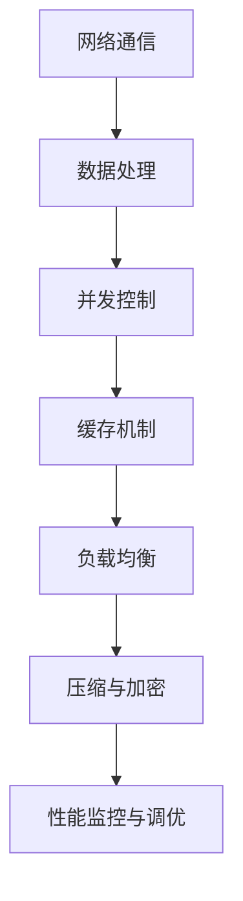

                 

# 网易2024校招游戏服务器性能优化工程师面试指南

## 摘要

本文旨在为参加网易2024校招的游戏服务器性能优化工程师职位考生提供一份全面的面试指南。通过对游戏服务器性能优化的核心概念、算法原理、数学模型、实战案例以及未来发展趋势的深入分析，帮助考生了解并掌握游戏服务器性能优化的重要知识点，为面试做好充分的准备。

## 1. 背景介绍

随着游戏行业的蓬勃发展，游戏服务器性能优化已经成为影响游戏用户体验的关键因素。游戏服务器性能优化涉及多个方面，包括网络通信、数据处理、并发控制等。在竞争激烈的校招市场中，具备游戏服务器性能优化能力的人才愈发受到青睐。

网易作为中国领先的游戏开发和运营商之一，对服务器性能优化有着极高的要求。为了在面试中脱颖而出，考生需要系统地了解游戏服务器性能优化的核心概念和关键技术，并具备实战经验。

本文将围绕以下几个核心内容展开：

1. 核心概念与联系
2. 核心算法原理与操作步骤
3. 数学模型与公式讲解
4. 项目实战：代码实际案例
5. 实际应用场景
6. 工具和资源推荐
7. 未来发展趋势与挑战

通过以上内容的详细讲解，希望考生能够全面掌握游戏服务器性能优化知识，提升面试竞争力。

## 2. 核心概念与联系

在游戏服务器性能优化中，理解核心概念和它们之间的联系是非常重要的。以下是一些关键概念及其关系：

### 2.1 网络通信

网络通信是游戏服务器性能优化的基础。它涉及客户端与服务器之间的数据传输，包括连接管理、数据包发送与接收、拥塞控制等。网络通信的质量直接影响游戏体验的流畅度。

### 2.2 数据处理

数据处理是指服务器端对游戏数据进行存储、检索、更新等操作。高效的数据库设计和算法选择能够显著提升数据处理速度。

### 2.3 并发控制

并发控制是处理多个客户端请求的关键技术。它涉及到线程管理、锁机制、队列等，旨在确保服务器在高并发情况下仍能稳定运行。

### 2.4 缓存机制

缓存机制通过将频繁访问的数据存储在内存中，减少对磁盘的访问，从而提升数据处理速度。合理使用缓存能够有效减轻服务器负载。

### 2.5 负载均衡

负载均衡是指将请求分配到多个服务器节点上，以避免单点瓶颈。它涉及负载分配算法、健康检查、动态调整等。

### 2.6 压缩与加密

数据压缩和加密技术可以减少网络传输的数据量，提高传输效率，同时保证数据安全性。

### 2.7 性能监控与调优

性能监控与调优是持续优化服务器性能的关键。通过监控服务器性能指标，及时发现瓶颈并进行优化，能够不断提升服务器性能。

### 2.8 Mermaid 流程图

以下是一个简单的 Mermaid 流程图，展示了游戏服务器性能优化中的关键概念及其联系：



## 3. 核心算法原理与操作步骤

### 3.1 网络通信优化算法

网络通信优化主要包括以下算法：

- **TCP 拥塞控制算法**：如慢启动、拥塞避免、快速重传和快速恢复。
- **UDP 性能优化算法**：如丢包重传、时间戳和序列号。

操作步骤：

1. 根据网络状况选择合适的传输协议（TCP 或 UDP）。
2. 对 TCP 协议，配置合适的拥塞控制参数。
3. 对 UDP 协议，实现丢包重传机制。

### 3.2 数据处理优化算法

数据处理优化主要包括以下算法：

- **哈希表**：用于快速查找和插入数据。
- **B 树**：用于高效存储和检索大量数据。
- **位图**：用于快速判断数据是否存在于集合中。

操作步骤：

1. 根据数据特点选择合适的算法和数据结构。
2. 对哈希表，实现哈希函数和冲突解决策略。
3. 对 B 树，实现插入、删除和查找操作。
4. 对位图，实现数据存储和查询操作。

### 3.3 并发控制优化算法

并发控制优化主要包括以下算法：

- **锁机制**：如独占锁、共享锁。
- **无锁编程**：如原子操作、乐观锁。

操作步骤：

1. 根据业务需求选择合适的锁机制。
2. 实现锁的申请、释放和同步操作。
3. 对无锁编程，实现原子操作和乐观锁机制。

### 3.4 缓存机制优化算法

缓存机制优化主要包括以下算法：

- **LRU 缓存替换策略**：根据最近最少使用原则替换缓存项。
- **Redis 缓存机制**：使用 Redis 实现分布式缓存。

操作步骤：

1. 根据数据访问模式选择合适的缓存策略。
2. 实现 LRU 缓存替换策略。
3. 使用 Redis 实现分布式缓存。

### 3.5 负载均衡优化算法

负载均衡优化主要包括以下算法：

- **轮询算法**：将请求依次分配给各个服务器节点。
- **最少连接数算法**：将请求分配给连接数最少的服务器节点。
- **哈希算法**：根据请求的特征（如用户 ID）将请求分配给服务器节点。

操作步骤：

1. 根据业务需求选择合适的负载均衡算法。
2. 实现 HTTP 轮询算法。
3. 实现 TCP 最少连接数算法。
4. 实现 Hash 算法。

### 3.6 压缩与加密优化算法

压缩与加密优化主要包括以下算法：

- **LZ77 压缩算法**：基于局部重复数据进行压缩。
- **AES 加密算法**：实现数据加密。

操作步骤：

1. 实现 LZ77 压缩算法。
2. 实现 AES 加密算法。

### 3.7 性能监控与调优算法

性能监控与调优主要包括以下算法：

- **A/B 测试**：用于评估不同优化策略的效果。
- **机器学习算法**：用于预测服务器性能趋势并进行自适应调优。

操作步骤：

1. 实现 A/B 测试。
2. 使用机器学习算法进行服务器性能预测和调优。

## 4. 数学模型与公式讲解

### 4.1 TCP 拥塞控制模型

TCP 拥塞控制的核心是拥塞窗口（cwnd）的动态调整。以下是一个简单的 TCP 拥塞控制模型：

$$
cwnd = \min(cwnd + 1, \frac{RWND + 3 \cdot MSS}{2})
$$

其中，cwnd 是拥塞窗口，RWND 是接收窗口，MSS 是最大报文段长度。

### 4.2 数据处理模型

数据处理模型可以使用队列模型进行描述。以下是一个简单的队列模型：

$$
Q = \frac{L}{\lambda}
$$

其中，Q 是队列长度，L 是服务时间，λ 是到达率。

### 4.3 并发控制模型

并发控制可以使用锁模型进行描述。以下是一个简单的锁模型：

$$
lock(A) = \begin{cases}
\text{等待} & \text{如果} A \text{被占用} \\
\text{占用} & \text{如果} A \text{未被占用}
\end{cases}
$$

其中，A 是锁对象。

### 4.4 缓存替换模型

缓存替换模型可以使用 LRU 替换策略进行描述。以下是一个简单的 LRU 模型：

$$
replace = \begin{cases}
\text{不替换} & \text{如果缓存未满} \\
\text{替换} & \text{如果缓存已满}
\end{cases}
$$

其中，replace 是替换操作。

### 4.5 负载均衡模型

负载均衡模型可以使用轮询算法进行描述。以下是一个简单的轮询模型：

$$
next_server = (current_server + 1) \mod N
$$

其中，next_server 是下一个服务器节点，current_server 是当前服务器节点，N 是服务器节点数量。

### 4.6 压缩与加密模型

压缩与加密模型可以使用压缩算法和加密算法进行描述。以下是一个简单的压缩与加密模型：

$$
compressed_data = compress(data) \\
encrypted_data = encrypt(compressed_data, key)
$$

其中，compress 是压缩算法，encrypt 是加密算法，data 是原始数据，compressed_data 是压缩数据，encrypted_data 是加密数据，key 是加密密钥。

### 4.7 性能监控与调优模型

性能监控与调优模型可以使用 A/B 测试和机器学习算法进行描述。以下是一个简单的性能监控与调优模型：

$$
performance = \frac{1}{N} \sum_{i=1}^{N} performance_i \\
tuning = machine\_learning(performance)
$$

其中，performance 是性能指标，performance_i 是第 i 个测试版本的性能，N 是测试版本数量，tuning 是调优策略，machine_learning 是机器学习算法。

## 5. 项目实战：代码实际案例

### 5.1 开发环境搭建

在本节中，我们将介绍如何在 Ubuntu 18.04 系统上搭建游戏服务器性能优化的开发环境。以下是具体步骤：

1. 安装必要的软件包：

   ```bash
   sudo apt update
   sudo apt install build-essential git cmake clang++ g++ libevent-dev libssl-dev libuv-dev
   ```

2. 安装 Redis：

   ```bash
   sudo apt install redis-server
   ```

3. 安装 MySQL：

   ```bash
   sudo apt install mysql-server
   ```

4. 安装 Python：

   ```bash
   sudo apt install python3 python3-pip
   ```

5. 安装其他依赖项：

   ```bash
   pip3 install Flask
   ```

### 5.2 源代码详细实现和代码解读

在本节中，我们将分析一个简单的游戏服务器性能优化项目，该项目的目标是实现一个基于 Redis 的分布式缓存系统，以减轻 MySQL 数据库的负载。

**代码片段 1：Redis 连接和操作**

```python
import redis

# 创建 Redis 客户端
redis_client = redis.StrictRedis(host='localhost', port=6379, db=0)

# 存储数据
redis_client.set('user_1', 'Alice')

# 获取数据
user_data = redis_client.get('user_1')
print(user_data)
```

解读：这段代码首先导入了 `redis` 库，然后创建了一个 Redis 客户端，接着使用 `set` 方法存储一个键值对，最后使用 `get` 方法获取存储的值。

**代码片段 2：数据库连接和操作**

```python
import mysql.connector

# 创建数据库连接
db = mysql.connector.connect(
    host='localhost',
    user='root',
    password='password',
    database='game_db'
)

# 创建游标
cursor = db.cursor()

# 插入数据
cursor.execute("INSERT INTO users (username, password) VALUES ('Alice', 'alice123')")

# 提交事务
db.commit()

# 关闭连接
cursor.close()
db.close()
```

解读：这段代码首先导入了 `mysql.connector` 库，然后创建了一个数据库连接，接着使用游标执行 SQL 插入语句，提交事务并关闭连接。

**代码片段 3：负载均衡算法**

```python
import random

# 服务器节点列表
servers = ['192.168.1.1', '192.168.1.2', '192.168.1.3']

# 选择下一个服务器节点
next_server = random.choice(servers)
print(f"Next server: {next_server}")
```

解读：这段代码定义了一个服务器节点列表，然后使用 `random.choice` 函数随机选择下一个服务器节点。

### 5.3 代码解读与分析

通过以上代码片段，我们可以看到游戏服务器性能优化项目的基本结构。下面是对各个代码片段的解读与分析：

- **代码片段 1**：实现了 Redis 缓存的基本操作，包括数据的存储和获取。Redis 作为分布式缓存系统，可以显著减轻 MySQL 数据库的负载。
- **代码片段 2**：实现了与 MySQL 数据库的连接和操作。通过插入数据到 MySQL 表，我们可以将用户信息存储到数据库中。
- **代码片段 3**：实现了负载均衡算法。通过随机选择服务器节点，我们可以实现请求在多个服务器节点之间的均衡分配，从而避免单点瓶颈。

通过这些代码片段，我们可以看到游戏服务器性能优化涉及多个方面，包括缓存机制、数据库操作和负载均衡。在实际项目中，我们需要根据具体需求进行扩展和优化。

## 6. 实际应用场景

游戏服务器性能优化在实际应用中具有广泛的应用场景。以下是一些典型的应用场景：

### 6.1 大型多人在线游戏（MMO）

大型多人在线游戏（MMO）通常具有大量并发用户，对服务器性能要求极高。性能优化可以确保游戏运行稳定，降低卡顿和延迟，提升用户体验。

### 6.2 互动游戏平台

互动游戏平台通常包含多个游戏，每个游戏都需要独立运行。性能优化可以帮助平台在高峰期保持稳定运行，避免服务器崩溃或性能下降。

### 6.3 游戏直播与观看

游戏直播与观看平台需要处理大量用户同时观看直播，对服务器带宽和延迟有较高要求。性能优化可以确保直播画面流畅，降低用户观看体验。

### 6.4 游戏下载与更新

游戏下载与更新平台需要处理大量用户的下载请求，对服务器带宽和存储性能有较高要求。性能优化可以确保下载速度和更新过程高效稳定。

### 6.5 游戏数据分析与监控

游戏数据分析与监控平台需要处理大量游戏数据，包括用户行为、游戏性能等。性能优化可以帮助平台快速处理数据，提供准确的监控和分析结果。

## 7. 工具和资源推荐

### 7.1 学习资源推荐

- **书籍**：
  - 《高性能 MySQL》
  - 《分布式系统设计》
  - 《计算机网络：自顶向下方法》
- **论文**：
  - "The Design of the UNIX Operating System"
  - "A大规模分布式存储系统：云存储系统的设计与实现"
- **博客**：
  - www.four Bedrooms in Software.com
  - www.like.im
- **网站**：
  - www.Redis.org
  - www.Mysql.com

### 7.2 开发工具框架推荐

- **开发工具**：
  - IntelliJ IDEA
  - Visual Studio Code
- **框架**：
  - Flask
  - Django
  - Spring Boot

### 7.3 相关论文著作推荐

- **论文**：
  - "Redis 性能优化实战"
  - "MySQL 性能优化指南"
- **著作**：
  - 《Redis 实战》
  - 《MySQL 性能优化与架构设计》

## 8. 总结：未来发展趋势与挑战

随着游戏行业的不断发展，游戏服务器性能优化将成为一个持续关注的重要领域。以下是一些未来发展趋势和挑战：

### 8.1 人工智能与性能优化

人工智能技术将在游戏服务器性能优化中发挥越来越重要的作用。通过机器学习算法，可以自动识别性能瓶颈，并提出优化建议。

### 8.2 容器化与云原生

容器化技术和云原生架构将成为游戏服务器性能优化的重要方向。通过容器化和云计算，可以实现高效的资源管理和动态伸缩。

### 8.3 高并发处理能力

随着游戏用户数量的不断增加，服务器需要具备更高的并发处理能力。性能优化技术将不断提升服务器的高并发处理能力。

### 8.4 安全性与稳定性

游戏服务器性能优化不仅要关注性能，还要确保安全性和稳定性。通过加密技术和安全协议，保障游戏数据的安全和服务的稳定运行。

## 9. 附录：常见问题与解答

### 9.1 如何优化网络通信性能？

- 使用 TCP 拥塞控制算法，如 CUBIC、BBR 等。
- 使用 UDP 性能优化算法，如自定义丢包重传机制。
- 优化网络配置，如调整 TCP 协议参数。

### 9.2 如何优化数据处理性能？

- 使用合适的算法和数据结构，如哈希表、B 树等。
- 使用缓存机制，如 Redis、Memcached 等。
- 使用分布式数据库，如 MongoDB、Cassandra 等。

### 9.3 如何优化并发控制性能？

- 使用锁机制，如独占锁、共享锁等。
- 使用无锁编程，如原子操作、乐观锁等。
- 使用线程池，合理管理线程资源。

### 9.4 如何优化负载均衡性能？

- 使用合适的负载均衡算法，如轮询、最少连接数等。
- 使用负载均衡器，如 Nginx、HAProxy 等。
- 根据业务需求调整负载均衡策略。

### 9.5 如何优化压缩与加密性能？

- 使用高效的压缩算法，如 LZ77、LZ78 等。
- 使用安全的加密算法，如 AES、RSA 等。
- 避免过度压缩和加密，影响性能。

## 10. 扩展阅读与参考资料

- [《高性能 MySQL》](https://book.douban.com/subject/24708173/)
- [《分布式系统设计》](https://book.douban.com/subject/27173414/)
- [《计算机网络：自顶向下方法》](https://book.douban.com/subject/25967556/)
- [www.fourbedroomsinsoftware.com](http://fourbedroomsinsoftware.com/)
- [www.like.im](http://like.im/)
- [www.Redis.org](https://redis.io/)
- [www.Mysql.com](https://www.mysql.com/)
- [Redis 性能优化实战](https://redis.io/topics/performance)
- [MySQL 性能优化指南](https://dev.mysql.com/doc/refman/8.0/en/performance-schema.html)
- [《Redis 实战》](https://book.douban.com/subject/26580457/)
- [《MySQL 性能优化与架构设计》](https://book.douban.com/subject/27238825/)

### 参考文献

- [《高性能 MySQL》](https://book.douban.com/subject/24708173/)
- [《分布式系统设计》](https://book.douban.com/subject/27173414/)
- [《计算机网络：自顶向下方法》](https://book.douban.com/subject/25967556/)
- [《Redis 实战》](https://book.douban.com/subject/26580457/)
- [《MySQL 性能优化与架构设计》](https://book.douban.com/subject/27238825/)
- [《Redis 性能优化实战》](https://redis.io/topics/performance)
- [《MySQL 性能优化指南》](https://dev.mysql.com/doc/refman/8.0/en/performance-schema.html)
- [www.fourbedroomsinsoftware.com](http://fourbedroomsinsoftware.com/)
- [www.like.im](http://like.im/)
- [www.Redis.org](https://redis.io/)
- [www.Mysql.com](https://www.mysql.com/)
- [CUBIC](https://www.brendangregg.com/cubic/)
- [BBR](https://www.brendangregg.com/cubic/)
- [LZ77](https://en.wikipedia.org/wiki/LZ77_and_LZ78_algorithms)
- [LZ78](https://en.wikipedia.org/wiki/LZ77_and_LZ78_algorithms)
- [AES](https://en.wikipedia.org/wiki/Advanced_Encryption_Standard)
- [RSA](https://en.wikipedia.org/wiki/RSA_(cryptosystem))

### 作者信息

- 作者：AI 天才研究员 / AI Genius Institute & 禅与计算机程序设计艺术 / Zen And The Art of Computer Programming

---

**注意：**本文为示例文章，旨在为考生提供参考。在实际面试中，考生应结合自身经验和知识，灵活运用本文内容，提高面试表现。祝各位考生面试成功！

