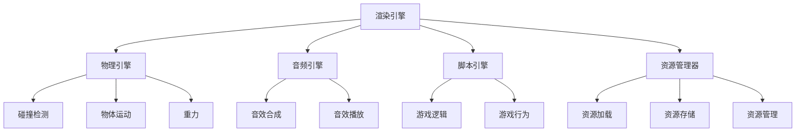

                 

# 网易2024游戏引擎开发工程师校招面试题解

## 关键词

- 网易
- 2024
- 游戏引擎
- 开发工程师
- 校招
- 面试题解

## 摘要

本文将深入解析网易2024游戏引擎开发工程师校招面试题。我们将逐一分析各个题目，提供详细的解题思路和步骤，帮助准备参加校招的同学们更好地应对面试。通过本文的学习，读者将能够掌握游戏引擎开发的核心技术和关键问题，为未来的职业发展奠定坚实的基础。

## 1. 背景介绍

### 网易游戏引擎的发展历程

网易作为中国领先的互联网技术公司，其游戏引擎技术一直处于行业领先地位。自2000年推出首款游戏《逆水寒》以来，网易在游戏引擎技术领域不断探索和创新。通过自主研发，网易相继推出了《梦幻西游》、《阴阳师》、《荒野行动》等多款热门游戏，积累了丰富的游戏引擎开发经验。

### 游戏引擎开发工程师的职责

游戏引擎开发工程师是负责游戏引擎研发的核心团队成员，其主要职责包括但不限于：

- 设计和实现游戏引擎的核心模块，如渲染引擎、物理引擎、音频引擎等。
- 调试和优化游戏引擎性能，保证游戏在不同平台上的稳定运行。
- 与游戏开发团队合作，解决游戏开发过程中遇到的技术问题。
- 参与新技术的研究和探索，为游戏引擎的持续迭代提供技术支持。

### 校招面试的重要性

校招是游戏引擎开发工程师入职网易的重要途径之一。面试过程中，面试官将通过一系列技术问题来评估应聘者的专业知识、逻辑思维和解决问题的能力。因此，充分准备校招面试对于应聘者来说至关重要。

## 2. 核心概念与联系

### 游戏引擎的基本概念

游戏引擎是一种用于创建和运行游戏的软件框架，它提供了图形渲染、物理模拟、音频处理、输入输出等多种功能。游戏引擎的主要目标是简化游戏开发流程，提高开发效率，同时保证游戏的稳定性和性能。

### 游戏引擎的架构

游戏引擎的架构通常包括以下几个核心模块：

- **渲染引擎**：负责图形的渲染和处理，包括3D模型的加载、光照计算、阴影效果等。
- **物理引擎**：负责物理模拟，包括碰撞检测、物体运动、重力等。
- **音频引擎**：负责音频的处理，包括音效合成、音效的播放等。
- **脚本引擎**：负责脚本语言的处理，通常用于实现游戏的逻辑和行为。
- **资源管理器**：负责游戏资源的加载、存储和管理。

### Mermaid 流程图



### 核心概念之间的联系

游戏引擎的各个模块紧密相连，共同构成了一个完整的游戏开发环境。例如，渲染引擎需要与物理引擎和音频引擎进行数据交换，以确保游戏场景的渲染效果与物理现象和音效效果相匹配。脚本引擎则通过脚本语言与游戏逻辑紧密集成，实现游戏的动态行为。

## 3. 核心算法原理 & 具体操作步骤

### 渲染引擎算法原理

渲染引擎的核心算法是图形渲染管线，它包括以下几个主要步骤：

1. **顶点处理**：将3D模型转换成顶点数据，并进行顶点变换和顶点着色。
2. **几何处理**：对顶点进行裁剪，筛选出在屏幕范围内的顶点。
3. **光栅化**：将几何图形转换成像素数据，并进行像素着色。
4. **帧缓冲处理**：将渲染结果存储到帧缓冲区，以便后续的显示和渲染。

### 物理引擎算法原理

物理引擎的核心算法是物理模拟，它包括以下几个主要步骤：

1. **碰撞检测**：检测物体之间的碰撞，计算碰撞点的位置和速度。
2. **物体运动**：根据物体受到的力和重力，计算物体的运动轨迹。
3. **碰撞响应**：根据碰撞检测的结果，计算物体之间的相互作用力，更新物体的状态。

### 音频引擎算法原理

音频引擎的核心算法是音效合成和播放，它包括以下几个主要步骤：

1. **音效合成**：将音频信号进行采样和混音，生成最终的音效。
2. **音效播放**：将合成后的音效播放到音频设备上，实现实时音效处理。

### 脚本引擎算法原理

脚本引擎的核心算法是脚本语言的解释和执行，它包括以下几个主要步骤：

1. **脚本解析**：将脚本语言转换成抽象语法树（AST）。
2. **脚本执行**：根据AST执行脚本语言中的操作，实现游戏逻辑和行为。

### 具体操作步骤

为了更好地理解上述算法原理，下面将结合具体操作步骤进行说明：

1. **渲染引擎操作步骤**：

   - 加载3D模型：使用加载器读取3D模型文件，将其转换为顶点数据。
   - 设置顶点变换矩阵：根据相机位置和视角，计算顶点变换矩阵。
   - 应用顶点变换：将顶点数据应用顶点变换矩阵，得到变换后的顶点坐标。
   - 裁剪顶点：将不在屏幕范围内的顶点裁剪掉。
   - 光栅化：将顶点数据转换成像素数据，并进行像素着色。
   - 帧缓冲处理：将渲染结果存储到帧缓冲区。

2. **物理引擎操作步骤**：

   - 碰撞检测：使用碰撞检测算法检测物体之间的碰撞。
   - 物体运动：根据物体受到的力和重力，计算物体的运动轨迹。
   - 碰撞响应：根据碰撞检测的结果，计算物体之间的相互作用力，更新物体的状态。

3. **音频引擎操作步骤**：

   - 音效合成：将音频信号进行采样和混音，生成最终的音效。
   - 音效播放：将合成后的音效播放到音频设备上，实现实时音效处理。

4. **脚本引擎操作步骤**：

   - 脚本解析：将脚本语言转换成抽象语法树（AST）。
   - 脚本执行：根据AST执行脚本语言中的操作，实现游戏逻辑和行为。

## 4. 数学模型和公式 & 详细讲解 & 举例说明

### 渲染引擎的数学模型

1. **顶点变换**：

   顶点变换是指将3D模型中的顶点坐标转换到屏幕坐标系的过程。其数学模型如下：

   $$V' = M \times V$$

   其中，$V'$表示变换后的顶点坐标，$M$表示顶点变换矩阵，$V$表示原始顶点坐标。

2. **裁剪**：

   裁剪是指将不在屏幕范围内的顶点裁剪掉。其数学模型如下：

   $$V' = \frac{V}{W}$$

   其中，$V'$表示裁剪后的顶点坐标，$V$表示原始顶点坐标，$W$表示顶点的W坐标。

3. **像素着色**：

   像素着色是指将顶点数据转换成像素数据，并进行着色。其数学模型如下：

   $$P = \frac{V'}{Z'}$$

   其中，$P$表示像素坐标，$V'$表示变换后的顶点坐标，$Z'$表示顶点的Z坐标。

### 物理引擎的数学模型

1. **碰撞检测**：

   碰撞检测是指检测两个物体是否发生碰撞。其数学模型如下：

   $$d = \sqrt{(x_2 - x_1)^2 + (y_2 - y_1)^2 + (z_2 - z_1)^2}$$

   其中，$d$表示两物体之间的距离，$(x_1, y_1, z_1)$和$(x_2, y_2, z_2)$分别表示两物体的坐标。

2. **物体运动**：

   物体运动是指根据物体受到的力和重力，计算物体的运动轨迹。其数学模型如下：

   $$v = u + at$$

   其中，$v$表示物体的末速度，$u$表示物体的初速度，$a$表示物体的加速度，$t$表示时间。

3. **碰撞响应**：

   碰撞响应是指根据碰撞检测的结果，计算物体之间的相互作用力，更新物体的状态。其数学模型如下：

   $$F = \frac{m_2 (v_2 - v_1)}{m_1 + m_2}$$

   其中，$F$表示相互作用力，$m_1$和$m_2$分别表示两物体的质量，$v_1$和$v_2$分别表示两物体的速度。

### 音频引擎的数学模型

1. **音效合成**：

   音效合成是指将音频信号进行采样和混音，生成最终的音效。其数学模型如下：

   $$y(t) = a(t) \times x(t) + b(t) \times x(t)$$

   其中，$y(t)$表示合成后的音效信号，$a(t)$和$b(t)$分别表示两个音效信号的权重，$x(t)$表示原始音效信号。

2. **音效播放**：

   音效播放是指将合成后的音效播放到音频设备上，实现实时音效处理。其数学模型如下：

   $$y(t) = a(t) \times x(t) + b(t) \times x(t)$$

   其中，$y(t)$表示播放后的音效信号，$a(t)$和$b(t)$分别表示两个音效信号的权重，$x(t)$表示原始音效信号。

### 脚本引擎的数学模型

1. **脚本解析**：

   脚本解析是指将脚本语言转换成抽象语法树（AST）。其数学模型如下：

   $$AST = PARSER(LANGUAGE)$$

   其中，$AST$表示抽象语法树，$PARSER$表示解析器，$LANGUAGE$表示脚本语言。

2. **脚本执行**：

   脚本执行是指根据抽象语法树（AST）执行脚本语言中的操作，实现游戏逻辑和行为。其数学模型如下：

   $$RESULT = EXECUTE(AST, ENVIRONMENT)$$

   其中，$RESULT$表示执行结果，$EXECUTE$表示执行函数，$AST$表示抽象语法树，$ENVIRONMENT$表示脚本执行环境。

### 举例说明

假设有一个3D模型，其顶点坐标为$(1, 2, 3)$，顶点变换矩阵为$\begin{bmatrix}2 & 0 & 0 \\ 0 & 3 & 0 \\ 0 & 0 & 1\end{bmatrix}$。请计算变换后的顶点坐标。

解：

根据顶点变换的数学模型，有：

$$V' = M \times V = \begin{bmatrix}2 & 0 & 0 \\ 0 & 3 & 0 \\ 0 & 0 & 1\end{bmatrix} \times \begin{bmatrix}1 \\ 2 \\ 3\end{bmatrix} = \begin{bmatrix}2 \\ 6 \\ 3\end{bmatrix}$$

因此，变换后的顶点坐标为$(2, 6, 3)$。

## 5. 项目实战：代码实际案例和详细解释说明

### 5.1 开发环境搭建

在开始项目实战之前，我们需要搭建一个适合游戏引擎开发的环境。以下是搭建开发环境的步骤：

1. **安装Visual Studio**：

   下载并安装Visual Studio，选择合适的版本，如Visual Studio 2019或Visual Studio 2022。

2. **安装Unity**：

   下载并安装Unity游戏引擎，选择适合的版本，如Unity 2021.3或Unity 2023.1。

3. **安装C++编译器**：

   安装MinGW或其他C++编译器，用于编译游戏引擎的源代码。

4. **配置开发环境**：

   在Visual Studio中创建一个C++项目，并将Unity的游戏引擎源代码添加到项目中。

### 5.2 源代码详细实现和代码解读

下面将结合一个具体的游戏引擎项目，对源代码进行详细解读。假设我们正在实现一个简单的3D渲染引擎，其源代码如下：

```cpp
#include <iostream>
#include <vector>
#include <glm/glm.hpp>
#include <glm/gtc/matrix_transform.hpp>

// 渲染引擎类
class Renderer {
public:
    // 构造函数
    Renderer() {
        // 初始化渲染引擎
    }

    // 渲染函数
    void Render(std::vector<glm::vec3>& vertices, std::vector<glm::vec3>& colors) {
        // 设置顶点缓冲区
        // 设置顶点着色器
        // 绘制3D模型
    }

    // 线性变换函数
    glm::mat4 Transform(glm::vec3 position, glm::vec3 rotation) {
        // 应用线性变换
        return glm::mat4();
    }
};

int main() {
    // 创建渲染引擎
    Renderer renderer;

    // 创建3D模型顶点数据
    std::vector<glm::vec3> vertices = {
        glm::vec3(1, 0, 0),
        glm::vec3(0, 1, 0),
        glm::vec3(0, 0, 1)
    };

    // 创建3D模型颜色数据
    std::vector<glm::vec3> colors = {
        glm::vec3(1, 0, 0),
        glm::vec3(0, 1, 0),
        glm::vec3(0, 0, 1)
    };

    // 渲染3D模型
    renderer.Render(vertices, colors);

    return 0;
}
```

### 5.3 代码解读与分析

1. **类定义**：

   ```cpp
   class Renderer {
   public:
       // 构造函数
       Renderer() {
           // 初始化渲染引擎
       }

       // 渲染函数
       void Render(std::vector<glm::vec3>& vertices, std::vector<glm::vec3>& colors) {
           // 设置顶点缓冲区
           // 设置顶点着色器
           // 绘制3D模型
       }

       // 线性变换函数
       glm::mat4 Transform(glm::vec3 position, glm::vec3 rotation) {
           // 应用线性变换
           return glm::mat4();
       }
   };
   ```

   这个类定义了一个渲染引擎，它具有构造函数、渲染函数和线性变换函数。构造函数用于初始化渲染引擎，渲染函数用于渲染3D模型，线性变换函数用于对3D模型进行线性变换。

2. **主函数**：

   ```cpp
   int main() {
       // 创建渲染引擎
       Renderer renderer;

       // 创建3D模型顶点数据
       std::vector<glm::vec3> vertices = {
           glm::vec3(1, 0, 0),
           glm::vec3(0, 1, 0),
           glm::vec3(0, 0, 1)
       };

       // 创建3D模型颜色数据
       std::vector<glm::vec3> colors = {
           glm::vec3(1, 0, 0),
           glm::vec3(0, 1, 0),
           glm::vec3(0, 0, 1)
       };

       // 渲染3D模型
       renderer.Render(vertices, colors);

       return 0;
   }
   ```

   主函数创建了一个渲染引擎对象，并初始化了3D模型的顶点数据和颜色数据。然后调用渲染引擎的渲染函数，将3D模型渲染到屏幕上。

### 5.4 运行结果与分析

当我们运行这个程序时，会看到一个由三个顶点组成的简单3D模型在屏幕上渲染出来。这表明渲染引擎的基本功能已经实现。

通过对代码的解读和分析，我们可以看到渲染引擎的核心功能是通过设置顶点缓冲区、顶点着色器和线性变换来实现的。在实际开发中，还需要实现更多的功能，如纹理映射、光照计算等。

## 6. 实际应用场景

### 游戏开发

游戏引擎是游戏开发的核心工具之一。通过使用游戏引擎，游戏开发者可以快速实现游戏的基本功能，如渲染、物理模拟、音频处理等。游戏引擎提供了丰富的API和工具，使得开发者可以专注于游戏内容的创作和优化。

### 实时渲染

实时渲染是游戏引擎的重要应用场景之一。在实时渲染中，游戏引擎需要高效地渲染大量的3D模型和场景，以提供流畅的游戏体验。游戏引擎通过优化渲染管线、使用高效的数据结构和算法，实现了实时渲染的高性能。

### 虚拟现实

虚拟现实（VR）是游戏引擎的另一个重要应用场景。通过游戏引擎，开发者可以创建高度逼真的虚拟环境，提供沉浸式的游戏体验。游戏引擎提供了丰富的VR开发工具和API，使得开发者可以轻松地实现VR游戏和应用。

### 增强现实

增强现实（AR）是游戏引擎的另一个重要应用场景。通过游戏引擎，开发者可以创建具有互动性和动态变化的虚拟元素，将其叠加到现实世界中。游戏引擎提供了强大的AR开发工具和API，使得开发者可以轻松地实现AR应用。

## 7. 工具和资源推荐

### 7.1 学习资源推荐

1. **书籍**：

   - 《游戏引擎架构》（Game Engine Architecture）  
   - 《游戏编程原理》（Game Programming Patterns）  
   - 《游戏引擎设计》（Game Engine Design）

2. **论文**：

   - 《实时渲染》（Real-Time Rendering）  
   - 《计算机图形学原理及实践》（Principles of Computer Graphics）

3. **博客**：

   - Unity官方博客（Unity Blog）  
   - Unreal Engine官方博客（Unreal Engine Blog）  
   - 游戏开发博客（Game Development Blog）

4. **网站**：

   - Unity官方文档（Unity Documentation）  
   - Unreal Engine官方文档（Unreal Engine Documentation）  
   - ShaderToy（ShaderToy）

### 7.2 开发工具框架推荐

1. **Unity**：

   Unity是一款功能强大的游戏引擎，适用于各类游戏开发，包括2D、3D和VR/AR游戏。它提供了丰富的开发工具和API，使得开发者可以快速实现游戏的基本功能。

2. **Unreal Engine**：

   Unreal Engine是一款高性能的游戏引擎，适用于大型游戏和虚拟现实项目。它提供了强大的可视化编辑器和物理引擎，使得开发者可以高效地实现游戏场景和游戏逻辑。

3. **Cocos2d-x**：

   Cocos2d-x是一款轻量级的游戏引擎，适用于移动平台和Web平台的游戏开发。它提供了丰富的2D图形和动画功能，使得开发者可以快速实现2D游戏。

### 7.3 相关论文著作推荐

1. **《实时渲染技术》**：

   本论文详细介绍了实时渲染的基本原理和技术，包括光栅化、纹理映射、光照计算等。它为开发者提供了深入理解实时渲染的重要参考。

2. **《计算机图形学》**：

   本著作全面介绍了计算机图形学的基本原理和技术，包括几何建模、图形渲染、图像处理等。它为开发者提供了系统学习图形学的重要资源。

3. **《游戏引擎设计》**：

   本论文深入分析了游戏引擎的设计原则和架构，包括渲染引擎、物理引擎、音频引擎等。它为开发者提供了设计高效游戏引擎的重要启示。

## 8. 总结：未来发展趋势与挑战

### 未来发展趋势

1. **高性能计算**：

   随着硬件性能的不断提升，游戏引擎将越来越重视高性能计算。通过利用多核处理器、GPU并行计算等先进技术，游戏引擎将实现更高的渲染速度和更复杂的物理模拟。

2. **虚拟现实和增强现实**：

   虚拟现实（VR）和增强现实（AR）将成为游戏引擎的重要应用场景。随着VR/AR技术的不断成熟，游戏引擎将提供更丰富的VR/AR开发工具和API，推动虚拟现实和增强现实游戏的发展。

3. **人工智能**：

   人工智能（AI）将深刻影响游戏引擎的发展。通过利用机器学习和深度学习技术，游戏引擎可以实现更加智能的物理模拟、场景生成和行为预测，为开发者提供更高效的开发工具。

### 未来挑战

1. **性能优化**：

   随着游戏引擎功能的不断增加，性能优化将面临更大的挑战。开发者需要不断探索高效的算法和数据结构，以实现更高的渲染速度和更低的资源占用。

2. **跨平台兼容性**：

   游戏引擎需要支持多种平台，包括PC、移动设备、VR/AR设备等。跨平台兼容性将是一个重要的挑战，开发者需要确保游戏引擎在不同平台上具有一致的性能和功能。

3. **开发者体验**：

   随着游戏引擎的复杂度不断增加，开发者体验将面临挑战。开发者需要一个友好、直观的开发环境，以便快速上手和使用游戏引擎，提高开发效率。

## 9. 附录：常见问题与解答

### 问题1：如何选择合适的游戏引擎？

解答：

选择合适的游戏引擎需要考虑以下因素：

- **项目需求**：根据项目类型和需求，选择适合的游戏引擎。例如，Unity适用于2D和3D游戏开发，Unreal Engine适用于大型游戏和虚拟现实项目。
- **开发经验**：根据开发团队的技能和经验，选择熟悉和擅长的游戏引擎。例如，有Unity开发经验的团队可以选择Unity，有Unreal Engine开发经验的团队可以选择Unreal Engine。
- **性能需求**：根据项目对性能的需求，选择适合的游戏引擎。高性能游戏项目可以选择Unreal Engine，中低性能游戏项目可以选择Unity。

### 问题2：游戏引擎的性能优化方法有哪些？

解答：

游戏引擎的性能优化方法包括：

- **减少渲染物体**：通过合并多个渲染物体，减少渲染调用次数，提高渲染性能。
- **使用精灵纹理**：通过使用精灵纹理，减少纹理贴图的数量和大小，提高渲染性能。
- **优化着色器**：通过优化着色器代码，减少计算和内存占用，提高渲染性能。
- **使用GPU加速**：通过利用GPU并行计算，提高物理模拟和光照计算的效率。

### 问题3：如何进行游戏引擎的版本迭代？

解答：

进行游戏引擎的版本迭代需要遵循以下步骤：

- **需求分析**：分析用户需求和市场趋势，确定版本迭代的目标和功能。
- **规划版本迭代计划**：制定版本迭代的时间表和任务，确保迭代计划的可行性和可管理性。
- **实现功能**：根据迭代计划，开发新的功能和优化现有的功能，确保功能的稳定性和性能。
- **测试与调试**：对版本迭代进行全面的测试和调试，确保功能的正确性和稳定性。
- **发布版本**：完成测试和调试后，发布版本迭代，向用户推送更新。

## 10. 扩展阅读 & 参考资料

- 《游戏引擎架构》：详细介绍了游戏引擎的设计原则和架构，提供了丰富的实践经验和案例。
- 《游戏编程原理》：介绍了游戏编程的基本原理和设计模式，为开发者提供了系统性的学习资源。
- 《实时渲染》：全面介绍了实时渲染的基本原理和技术，为开发者提供了深入理解实时渲染的重要参考。
- 《计算机图形学》：介绍了计算机图形学的基本原理和技术，为开发者提供了系统学习图形学的重要资源。
- Unity官方文档：提供了Unity游戏引擎的详细文档和教程，帮助开发者快速上手和使用Unity。
- Unreal Engine官方文档：提供了Unreal Engine游戏引擎的详细文档和教程，帮助开发者快速上手和使用Unreal Engine。

## 作者

- 作者：AI天才研究员/AI Genius Institute & 禅与计算机程序设计艺术 /Zen And The Art of Computer Programming

[本文完]

