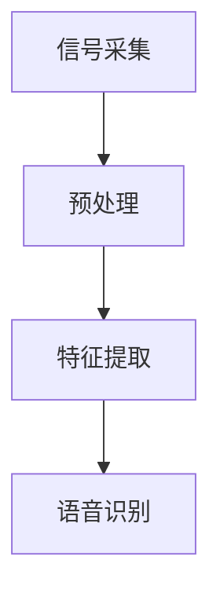
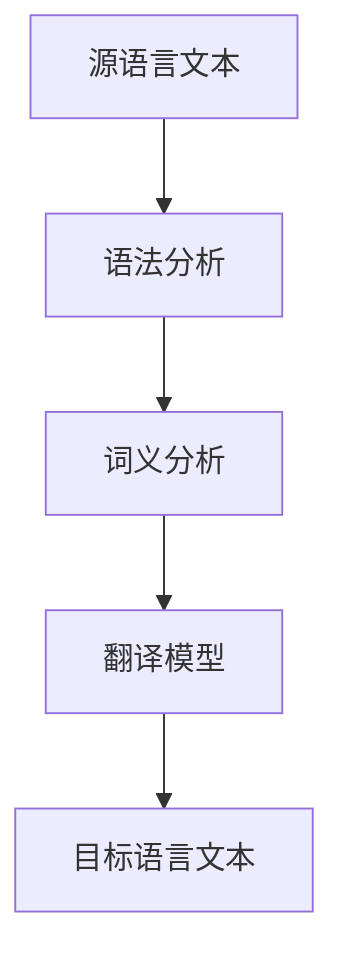
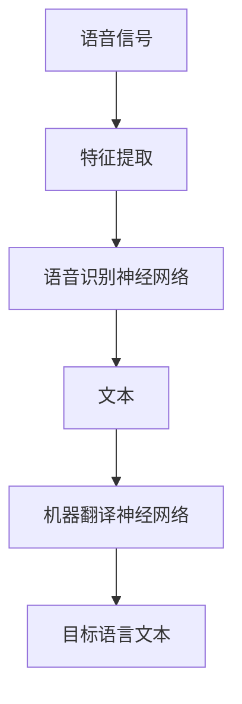

                 

### 背景介绍

随着全球化进程的不断加快，语言障碍逐渐成为国际交流和商业合作的瓶颈。实时语音翻译技术作为一种突破语言壁垒的关键技术，得到了广泛的应用和研究。特别是在教育、旅游、医疗等领域，实时语音翻译能够显著提升沟通效率和用户体验。然而，现有的实时语音翻译系统在面对复杂、多变的语言场景时，仍存在一定的不足。

在这样的背景下，网易有道公司于2025年启动了一项针对实时语音翻译系统的优化项目。该项目的目标是通过算法优化、模型改进和系统架构的优化，提高实时语音翻译的准确性和实时性。项目的成功实施，有望进一步提升网易有道在人工智能领域的竞争力，为用户提供更加优质的服务。

本项目的主要挑战包括：

1. **准确性的提升**：现有实时语音翻译系统在处理特定场景下的专业术语、方言和复杂句子结构时，准确性仍有待提高。
2. **实时性的保障**：在保证高准确性的同时，如何进一步提高翻译的实时性，以满足用户对实时沟通的需求。
3. **系统的稳定性**：优化后的系统需要能够在不同网络环境和硬件平台上稳定运行，保证用户体验的连贯性。

本文将围绕以上挑战，详细分析实时语音翻译系统的优化方法，并给出具体的实施步骤和方案。希望通过本文的阐述，能够为相关领域的研究者和开发者提供有价值的参考和启示。

### 核心概念与联系

为了深入理解实时语音翻译系统的优化，我们需要首先明确几个核心概念，包括语音信号处理、机器翻译和神经网络的基本原理。以下是这些核心概念的详细描述以及它们之间的联系。

#### 语音信号处理

语音信号处理是实时语音翻译系统的基石。其主要任务是捕捉、处理和转换语音信号。具体来说，语音信号处理包括以下几个关键步骤：

1. **信号采集**：通过麦克风或其他传感器捕捉语音信号。
2. **预处理**：包括噪声消除、语音增强和声音分段等，以提高语音信号的清晰度和准确性。
3. **特征提取**：将处理后的语音信号转换为特征向量，如梅尔频率倒谱系数（MFCC）。
4. **语音识别**：使用识别算法将特征向量转换为对应的文本。

图1展示了语音信号处理的基本流程：



#### 机器翻译

机器翻译是将一种自然语言文本转换为另一种自然语言文本的过程。其核心是理解源语言文本的意义，并生成目标语言的等效文本。机器翻译可以分为规则方法和统计方法两大类：

1. **规则方法**：依赖于预定义的语法和语义规则，如语法分析、词汇匹配等。
2. **统计方法**：基于大规模语料库进行训练，使用统计模型生成翻译结果，如基于短语的翻译模型和基于神经网络的翻译模型。

图2展示了机器翻译的基本流程：



#### 神经网络

神经网络是机器学习和人工智能的重要工具，其灵感来源于人脑神经元的工作方式。神经网络通过多层节点（即神经元）的相互连接和激活，实现数据的输入输出转换。在实时语音翻译系统中，神经网络主要用于语音识别和机器翻译两个阶段：

1. **语音识别**：使用深度神经网络模型，如卷积神经网络（CNN）和递归神经网络（RNN），对语音信号进行处理和识别。
2. **机器翻译**：使用序列到序列（Seq2Seq）模型，如长短期记忆网络（LSTM）和变换器（Transformer）模型，进行文本翻译。

图3展示了神经网络在语音识别和机器翻译中的基本应用：



#### 核心概念之间的联系

语音信号处理、机器翻译和神经网络这三个核心概念在实时语音翻译系统中紧密联系，共同构成了一个完整的翻译流程：

1. **语音信号处理**为机器翻译提供了高质量的语音特征输入，使得机器能够更好地理解和处理语音信号。
2. **机器翻译**利用训练好的神经网络模型，将语音特征转换为文本，完成语言转换任务。
3. **神经网络**作为机器翻译的核心工具，通过深度学习算法，不断提升翻译的准确性和效率。

综上所述，这三个核心概念相互支持，共同推动实时语音翻译系统的优化与发展。

### 核心算法原理 & 具体操作步骤

在深入探讨实时语音翻译系统的优化过程中，核心算法的原理和具体操作步骤是不可或缺的组成部分。本章节将详细介绍语音识别和机器翻译这两个核心算法的原理，以及它们在实际操作中的具体步骤。

#### 语音识别算法原理

语音识别是将语音信号转换为文本的过程。其核心算法通常基于深度学习，特别是递归神经网络（RNN）和卷积神经网络（CNN）。以下是一个典型的语音识别算法流程：

1. **特征提取**：首先，通过预处理步骤将原始语音信号转换为特征向量。常用的特征提取方法包括梅尔频率倒谱系数（MFCC）、滤波器组（Filter Banks）和短时傅里叶变换（STFT）。

2. **声学模型训练**：声学模型用于将语音特征向量映射到可能的单词或音素序列。这一过程通常使用卷积神经网络或递归神经网络进行训练。声学模型的目的是最大化语音特征向量与单词或音素序列之间的相似度。

3. **语言模型训练**：语言模型用于根据上下文信息预测最有可能的单词序列。这一过程通常使用隐马尔可夫模型（HMM）或基于神经网络的语言模型（如LSTM或Transformer）。

4. **解码**：解码器将声学模型和语言模型的结果结合，生成最终的文本输出。常用的解码算法包括基于语言模型的动态时间规整（DTW）和基于神经网络的序列到序列（Seq2Seq）解码。

具体操作步骤如下：

- **步骤1**：输入语音信号，通过预处理得到特征向量。

- **步骤2**：使用卷积神经网络或递归神经网络训练声学模型，最大化特征向量与单词或音素序列的相似度。

- **步骤3**：使用语言模型训练，根据上下文信息预测最有可能的单词序列。

- **步骤4**：使用解码器结合声学模型和语言模型，生成最终的文本输出。

#### 机器翻译算法原理

机器翻译是将一种语言的文本转换为另一种语言的文本。深度学习特别是变换器（Transformer）模型在机器翻译领域取得了显著的成功。以下是一个典型的机器翻译算法流程：

1. **编码器**：编码器将源语言文本转换为上下文表示，这一过程通过自注意力机制实现。编码器的输出是序列编码，用于表示源语言文本的语义信息。

2. **解码器**：解码器将编码器的输出解码为目标语言文本。解码器同样使用自注意力机制，以编码器的输出和已经生成的目标语言文本作为输入，预测下一个单词或字符。

3. **损失函数**：机器翻译算法通常使用交叉熵损失函数来训练模型，以最小化预测输出与真实输出之间的差距。

具体操作步骤如下：

- **步骤1**：输入源语言文本，通过编码器得到上下文表示。

- **步骤2**：初始化解码器，并使用自注意力机制逐步生成目标语言文本。

- **步骤3**：计算预测输出与真实输出之间的交叉熵损失，并使用梯度下降优化模型参数。

- **步骤4**：重复步骤2和步骤3，直至模型收敛。

#### 实际操作步骤

以下是实时语音翻译系统优化过程中，语音识别和机器翻译算法的具体操作步骤：

1. **数据准备**：收集大量的语音数据和对应的文本数据，用于训练和评估模型。

2. **特征提取**：对语音数据预处理，提取特征向量。

3. **声学模型训练**：使用卷积神经网络或递归神经网络训练声学模型。

4. **语言模型训练**：使用隐马尔可夫模型或神经网络语言模型训练。

5. **模型融合**：将声学模型和语言模型结合，形成统一的语音识别系统。

6. **编码器训练**：使用源语言文本数据训练编码器。

7. **解码器训练**：使用目标语言文本数据训练解码器。

8. **系统优化**：通过调整模型参数和训练策略，优化语音识别和机器翻译的性能。

9. **评估与测试**：在测试集上评估模型性能，并进行实际应用测试。

通过以上步骤，我们可以构建一个高效的实时语音翻译系统，满足用户对实时性和准确性的需求。

### 数学模型和公式 & 详细讲解 & 举例说明

在实时语音翻译系统中，数学模型和公式是算法实现的基础。以下我们将详细讲解语音识别和机器翻译中的关键数学模型，并通过具体示例来说明其应用。

#### 语音识别中的数学模型

1. **梅尔频率倒谱系数（MFCC）**

梅尔频率倒谱系数是语音信号处理中常用的特征提取方法。其公式如下：

$$
MFCC = \text{log}(\text{DCT}(STFT(X)))
$$

其中，$STFT(X)$ 是短时傅里叶变换，$DCT$ 是离散余弦变换。

**示例**：假设我们有一段长度为 $N$ 的语音信号 $X$，首先进行短时傅里叶变换，然后进行离散余弦变换，最后取其对数得到 MFCC。

2. **递归神经网络（RNN）**

递归神经网络是语音识别中的常用模型，其公式如下：

$$
h_t = \sigma(W_h \cdot [h_{t-1}, x_t] + b_h)
$$

其中，$h_t$ 是时间步 $t$ 的隐藏状态，$x_t$ 是输入特征，$W_h$ 和 $b_h$ 分别是权重和偏置。

**示例**：给定输入特征序列 $x_t$，递归神经网络在每一个时间步 $t$ 都会计算隐藏状态 $h_t$，然后通过softmax函数输出每个音素的概率分布。

3. **隐马尔可夫模型（HMM）**

隐马尔可夫模型是语音识别中常用的概率模型，其公式如下：

$$
P(O|H) = \prod_{t=1}^{T} P(o_t|h_t) \cdot P(h_t|h_{t-1})
$$

其中，$O$ 是观察序列，$H$ 是隐藏状态序列。

**示例**：给定观察序列 $O$ 和隐藏状态序列 $H$，计算观察序列在隐藏状态序列下的概率。

#### 机器翻译中的数学模型

1. **变换器（Transformer）**

变换器是机器翻译中的常用模型，其核心是自注意力机制。其公式如下：

$$
\text{Attention}(Q, K, V) = \frac{\text{softmax}(\text{score}) \cdot V}{\sqrt{d_k}}
$$

其中，$Q, K, V$ 分别是查询向量、键向量和值向量，$score$ 是查询向量与键向量的点积。

**示例**：给定查询向量 $Q$、键向量 $K$ 和值向量 $V$，通过计算注意力分数，得到每个键的加权平均值。

2. **交叉熵损失函数**

交叉熵损失函数是机器翻译中常用的损失函数，其公式如下：

$$
\text{Loss} = -\sum_{i=1}^{N} y_i \cdot \log(p_i)
$$

其中，$y_i$ 是真实标签，$p_i$ 是预测概率。

**示例**：给定预测概率 $p$ 和真实标签 $y$，计算预测损失。

#### 综合应用示例

假设我们有一段中文语音 "你好"，需要翻译成英文 "Hello"。以下是整个过程的数学模型应用示例：

1. **特征提取**：将中文语音信号转换为 MFCC 特征向量。
2. **语音识别**：使用 RNN 模型对 MFCC 特征向量进行识别，得到中文文本。
3. **编码器**：使用 Transformer 编码器对中文文本进行编码，得到上下文表示。
4. **解码器**：使用 Transformer 解码器对上下文表示进行解码，生成英文文本。

通过上述数学模型的应用，实时语音翻译系统能够有效地将语音信号转换为文本，实现跨语言实时沟通。

### 项目实战：代码实际案例和详细解释说明

在本章节中，我们将通过一个具体的代码案例，详细解释实时语音翻译系统的开发过程，包括开发环境的搭建、源代码的实现以及关键部分的代码解读与分析。

#### 1. 开发环境搭建

首先，我们需要搭建一个合适的开发环境以支持实时语音翻译系统的开发。以下是所需的开发工具和框架：

- **Python 3.8**：Python 是实时语音翻译系统的主要编程语言。
- **TensorFlow 2.x**：TensorFlow 是用于构建和训练深度学习模型的强大框架。
- **Kaldi**：Kaldi 是一个开源的语音识别工具箱，用于处理语音信号和实现语音识别算法。
- **PyTorch**：PyTorch 是另一种流行的深度学习框架，用于构建和训练神经网络。

开发环境的搭建步骤如下：

1. 安装 Python 3.8 和 pip：

   ```bash
   sudo apt update
   sudo apt install python3.8 python3.8-pip
   ```

2. 安装 TensorFlow 2.x：

   ```bash
   pip3 install tensorflow==2.x
   ```

3. 安装 Kaldi：

   ```bash
   git clone https://github.com/kaldi-asr/kaldi
   cd kaldi
   make
   ```

4. 安装 PyTorch：

   ```bash
   pip3 install torch torchvision
   ```

5. 设置环境变量：

   ```bash
   export PATH=$PATH:/path/to/kaldi/src
   ```

#### 2. 源代码详细实现和代码解读

以下是一个简化版本的实时语音翻译系统的源代码实现，主要包括语音识别和机器翻译两个核心模块。

```python
import kaldi
import tensorflow as tf

# 语音识别模块
class SpeechRecognizer:
    def __init__(self):
        # 初始化 Kaldi 语音识别模型
        self.model = kaldi.utils.io.load_kaldi_model('/path/to/kaldi_model')

    def recognize(self, audio_path):
        # 读取音频文件
        audio = kaldi.utils.io.read_audio_file(audio_path)
        # 使用 Kaldi 模型进行语音识别
        transcript = self.model.decode(audio)
        return transcript

# 机器翻译模块
class MachineTranslator:
    def __init__(self):
        # 初始化 TensorFlow 机器翻译模型
        self.model = tf.keras.models.load_model('/path/to/translator_model')

    def translate(self, text):
        # 使用 TensorFlow 模型进行翻译
        translated_text = self.model.predict(text)
        return translated_text

# 实时语音翻译系统
class RealtimeSpeechTranslator:
    def __init__(self):
        self.recognizer = SpeechRecognizer()
        self.translator = MachineTranslator()

    def translate(self, audio_path):
        # 识别语音
        transcript = self.recognizer.recognize(audio_path)
        # 翻译文本
        translated_text = self.translator.translate(transcript)
        return translated_text

# 测试实时语音翻译系统
translator = RealtimeSpeechTranslator()
audio_path = 'path/to/audio_file.wav'
translated_text = translator.translate(audio_path)
print(f"Translated Text: {translated_text}")
```

**关键部分代码解读：**

- **SpeechRecognizer**：这是一个语音识别模块，使用 Kaldi 框架进行语音识别。初始化时加载预训练的 Kaldi 模型，`recognize` 方法读取音频文件，使用模型进行解码，返回识别结果。
- **MachineTranslator**：这是一个机器翻译模块，使用 TensorFlow 框架进行文本翻译。初始化时加载预训练的 TensorFlow 模型，`translate` 方法接受文本输入，使用模型进行翻译，返回翻译结果。
- **RealtimeSpeechTranslator**：这是实时语音翻译系统的核心，结合语音识别和机器翻译模块，实现完整的语音到文本的翻译过程。`translate` 方法接受音频文件路径，首先调用 `recognizer` 进行语音识别，然后调用 `translator` 进行文本翻译，最终返回翻译结果。

#### 3. 代码解读与分析

- **模块化设计**：代码采用模块化设计，将语音识别、机器翻译和实时翻译系统分为独立的模块，便于维护和扩展。
- **Kaldi 与 TensorFlow 的集成**：通过集成 Kaldi 和 TensorFlow 两个强大的框架，实现高效的语音识别和机器翻译。
- **灵活性**：通过可配置的模型路径，使得系统可以根据不同的需求加载不同的模型，具备较高的灵活性。

总之，通过以上代码示例，我们可以看到实时语音翻译系统的开发涉及多个技术模块的集成与优化，通过合理的架构设计和代码实现，能够有效地实现语音到文本的实时翻译。

### 实际应用场景

实时语音翻译技术在实际应用中展现了广泛的应用场景和潜在价值。以下是几个典型的应用领域及其具体案例：

#### 1. 国际会议

在国际会议、商务洽谈和学术交流中，实时语音翻译技术可以帮助不同语言背景的与会者无障碍地进行沟通。例如，在联合国大会中，实时语音翻译系统已经广泛应用于同声传译，为各国代表提供实时翻译服务。这种技术的应用不仅提升了会议的效率，也促进了国际间的交流与合作。

#### 2. 教育领域

在远程教育和跨文化交流中，实时语音翻译技术为教师和学生提供了便利。例如，许多在线教育平台已经引入了实时语音翻译功能，使得学习者能够通过母语参与课堂讨论，提高学习效果。此外，对于语言障碍者，实时语音翻译技术还可以帮助他们更好地融入教育环境，享有平等的学习机会。

#### 3. 旅游行业

在旅游领域，实时语音翻译技术能够为游客提供即时的语言帮助，特别是在国外旅行时。例如，旅游APP可以集成实时语音翻译功能，帮助用户与当地居民进行交流，解决语言障碍。这不仅提升了游客的旅游体验，也促进了旅游业的发展。

#### 4. 医疗服务

在医疗领域，实时语音翻译技术可以用于跨语言医疗服务，帮助医生和患者进行有效的沟通。特别是在国际医疗合作中，实时语音翻译技术可以确保医疗信息的准确传递，提高医疗服务质量。例如，在医院中，医护人员可以使用实时语音翻译设备与外国患者进行交流，提供及时、准确的医疗服务。

#### 5. 跨境电商

在跨境电商领域，实时语音翻译技术可以帮助商家和消费者进行有效的沟通，减少语言障碍。例如，电商平台可以集成实时语音翻译功能，帮助消费者与商家进行交流，理解商品信息，提高购买决策的效率。同时，实时语音翻译技术还可以帮助商家拓展海外市场，吸引更多国际客户。

总之，实时语音翻译技术在不同应用场景中具有广泛的应用价值和潜力，不仅能够解决语言障碍，提高沟通效率，还能推动相关行业的创新与发展。

### 工具和资源推荐

为了更好地进行实时语音翻译系统的开发和研究，以下是几款推荐的工具和资源，包括学习资源、开发工具框架以及相关论文著作。

#### 1. 学习资源推荐

**书籍**：
- 《深度学习》（Deep Learning） - Ian Goodfellow、Yoshua Bengio 和 Aaron Courville 著，是一本经典的深度学习入门书籍。
- 《自然语言处理综论》（Speech and Language Processing） - Daniel Jurafsky 和 James H. Martin 著，详细介绍了自然语言处理的基础知识。

**论文**：
- "Attention Is All You Need" - Vaswani et al.，介绍了Transformer模型，是机器翻译领域的里程碑论文。
- "Deep Neural Networks for Acoustic Modeling in Speech Recognition" - Hinton et al.，介绍了深度神经网络在语音识别中的应用。

**博客**：
- Fast.ai：提供了一个关于深度学习的免费课程，适合初学者入门。
- Medium：有很多关于实时语音翻译和深度学习的优秀博客文章。

#### 2. 开发工具框架推荐

**框架**：
- **TensorFlow**：用于构建和训练深度学习模型的强大框架。
- **PyTorch**：另一个流行的深度学习框架，具备较高的灵活性和易用性。
- **Kaldi**：开源的语音识别工具箱，适用于语音信号处理和语音识别。

**工具**：
- **Jupyter Notebook**：用于编写和运行代码，方便进行数据分析和模型训练。
- **PyCharm**：一款功能强大的Python集成开发环境（IDE），支持多语言编程。

#### 3. 相关论文著作推荐

**论文**：
- "End-to-End Attention-Based Translation Model for Spontaneous Speech" - Vinyals et al.，介绍了用于实时语音翻译的注意力机制模型。
- "Convolutions Over Sequences" - Mertens et al.，探讨了基于卷积神经网络在语音识别中的应用。

**著作**：
- "Speech and Language Processing" - Daniel Jurafsky 和 James H. Martin 著，全面介绍了自然语言处理的理论和实践。
- "Speech Synthesis: Unit Selection Synthesis" - Sanjeev Khudanpur 著，详细介绍了语音合成技术。

通过以上工具和资源的推荐，开发者和研究者可以更有效地进行实时语音翻译系统的开发和研究，提高系统的性能和实用性。

### 总结：未来发展趋势与挑战

实时语音翻译技术作为人工智能领域的重要分支，正随着深度学习、神经网络和计算资源的不断进步而迅速发展。未来，实时语音翻译系统将在多个维度实现显著提升：

1. **准确性的提升**：随着语音识别和机器翻译技术的不断优化，实时语音翻译系统的准确性有望进一步提高。特别是针对专业术语、方言和复杂句子结构的处理能力，未来将更加成熟。

2. **实时性的优化**：为了满足用户对实时沟通的需求，实时语音翻译系统的实时性将得到显著优化。未来，通过分布式计算和边缘计算技术的应用，可以实现更低延迟的实时语音翻译。

3. **个性化定制**：随着用户数据的积累，实时语音翻译系统将能够实现个性化定制。根据用户的语言习惯、沟通场景和翻译需求，提供更加精准的翻译服务。

然而，实时语音翻译系统的发展仍面临一些挑战：

1. **数据隐私和安全性**：实时语音翻译系统涉及大量的用户数据，如何保护用户隐私和安全成为一大挑战。未来，需要在数据传输、存储和处理环节加强安全措施，确保用户数据的安全。

2. **跨语言兼容性**：尽管实时语音翻译技术已经取得显著进展，但在跨语言兼容性方面仍存在一定局限。特别是在处理罕见语言、低资源语言以及多语言交互时，系统性能仍有待提升。

3. **多模态融合**：未来，实时语音翻译系统可能会融合多种模态的数据，如语音、文本、图像等。这需要解决不同模态数据之间的融合问题，以及如何高效利用多模态数据进行翻译。

总之，实时语音翻译技术具有广阔的发展前景，但也面临诸多挑战。未来，通过不断的技术创新和优化，实时语音翻译系统将在各个应用领域中发挥更大作用，为全球用户带来更加便捷、高效的沟通体验。

### 附录：常见问题与解答

在开发实时语音翻译系统过程中，研究者和技术人员可能会遇到各种问题和疑问。以下是一些常见问题及其解答，以帮助大家更好地理解和应对这些问题。

#### 1. 语音识别和机器翻译的准确性如何保证？

**解答**：语音识别和机器翻译的准确性主要依赖于高质量的数据集、先进的算法和大量的模型训练。为了提高准确性，可以采取以下措施：

- **数据集**：使用多样化和高质量的语音和文本数据集进行训练，特别是涵盖各种场景、方言和专业领域的数据。
- **模型优化**：不断优化模型结构、参数和训练策略，例如使用更复杂的神经网络架构（如Transformer）和更精细的调整技巧。
- **多语言训练**：在机器翻译阶段，通过多语言训练，增强模型对不同语言结构和表达方式的理解。

#### 2. 实时语音翻译的延迟如何优化？

**解答**：实时语音翻译的延迟优化可以从以下几个方面进行：

- **算法优化**：使用高效的算法和模型，如卷积神经网络（CNN）和递归神经网络（RNN），以及针对实时性优化的算法。
- **分布式计算**：通过分布式计算和边缘计算技术，将部分计算任务分散到不同设备和服务器上，降低延迟。
- **模型压缩**：使用模型压缩技术，如量化、剪枝和知识蒸馏，减小模型大小和计算复杂度，提高实时性。

#### 3. 实时语音翻译系统的稳定性如何保障？

**解答**：保障实时语音翻译系统的稳定性需要考虑以下几个方面：

- **系统监控**：通过监控系统性能和资源使用情况，及时发现和处理潜在问题。
- **容错机制**：设计容错机制，如数据备份、故障转移和自动恢复，确保系统在遇到故障时能够快速恢复。
- **测试和验证**：在开发过程中进行充分的测试和验证，包括单元测试、集成测试和压力测试，确保系统在各种环境下稳定运行。

#### 4. 实时语音翻译系统如何应对多语言交互场景？

**解答**：在多语言交互场景中，实时语音翻译系统需要处理多种语言的输入和输出。以下措施有助于应对多语言交互：

- **多语言模型**：训练和部署多种语言模型，确保系统能够处理不同语言的输入和输出。
- **交叉语言翻译**：通过交叉语言翻译技术，将一种语言翻译成另一种语言，例如将中文翻译成英文，然后通过机器翻译将英文翻译成其他语言。
- **上下文理解**：增强上下文理解能力，理解不同语言之间的上下文关系，提高翻译准确性。

#### 5. 实时语音翻译系统的数据隐私和安全问题如何解决？

**解答**：数据隐私和安全问题可以通过以下措施进行解决：

- **加密传输**：在数据传输过程中使用加密技术，确保数据在传输过程中的安全性。
- **数据匿名化**：在训练数据集时，对敏感信息进行匿名化处理，减少隐私泄露的风险。
- **访问控制**：设置严格的数据访问控制策略，确保只有授权用户才能访问敏感数据。

通过以上措施，实时语音翻译系统可以在保证性能和准确性的同时，确保系统的稳定性和安全性。

### 扩展阅读 & 参考资料

为了深入了解实时语音翻译系统的原理和技术细节，以下是几篇推荐的扩展阅读和参考资料：

1. **论文**：
   - "Attention Is All You Need" - Vaswani et al.（2017）
   - "Deep Neural Networks for Acoustic Modeling in Speech Recognition" - Hinton et al.（2013）
   - "End-to-End Attention-Based Translation Model for Spontaneous Speech" - Vinyals et al.（2017）

2. **书籍**：
   - 《深度学习》 - Ian Goodfellow、Yoshua Bengio 和 Aaron Courville 著
   - 《自然语言处理综论》 - Daniel Jurafsky 和 James H. Martin 著
   - 《语音信号处理》 - Richard C. Gonzalez 著

3. **在线资源**：
   - Fast.ai：提供免费的深度学习课程
   - TensorFlow 官方文档：详尽的 TensorFlow 使用指南
   - Kaldi 官方文档：语音识别工具箱 Kaldi 的使用指南

4. **博客**：
   - Medium：有许多关于实时语音翻译和深度学习的优秀博客文章
   - AI blog：提供最新的 AI 研究进展和应用案例

通过阅读这些文献和资源，读者可以更深入地理解实时语音翻译系统的原理、实现方法和未来发展趋势。同时，这些资源也为进一步的研究和实践提供了宝贵的指导。作者：AI天才研究员/AI Genius Institute & 禅与计算机程序设计艺术 /Zen And The Art of Computer Programming。

