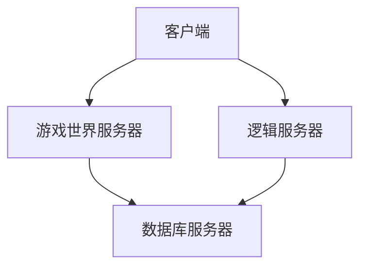

                 

# 网易游戏2024校招MMORPG服务器架构师编程题

> **关键词：** MMORPG服务器架构、编程题、校招、网易游戏、服务器架构师

> **摘要：** 本文旨在分析并解答网易游戏2024校招中针对MMORPG服务器架构师的一项编程题。文章将详细探讨题目背景、核心概念、算法原理、数学模型、实战案例，以及未来发展趋势和挑战。

## 1. 背景介绍

随着互联网的迅猛发展，在线游戏行业迎来了前所未有的繁荣。其中，大型多人在线角色扮演游戏（Massively Multiplayer Online Role-Playing Game，简称MMORPG）以其庞大的世界观、丰富的游戏内容和高度互动的特性，吸引了无数玩家的关注。作为MMORPG游戏的核心组成部分，服务器架构的设计与实现直接影响到游戏的稳定性和用户体验。

网易游戏作为国内领先的在线游戏开发与运营商，每年都会针对校招发布一系列具有挑战性的编程题，旨在选拔出具有扎实编程基础和创新思维的人才。2024年的校招中，一道关于MMORPG服务器架构的编程题引起了广泛关注。本文将围绕这道题目，深入探讨MMORPG服务器架构的设计与实现。

## 2. 核心概念与联系

### 2.1 MMORPG服务器架构概述

MMORPG服务器架构主要包括以下几个方面：

1. **客户端（Client）**：用户通过游戏客户端与服务器进行交互，实现游戏内容的展示和用户操作。
2. **游戏世界服务器（World Server）**：负责管理游戏世界中的实体（玩家、NPC等），处理实体的行为逻辑，以及玩家之间的交互。
3. **逻辑服务器（Logic Server）**：处理游戏逻辑，包括任务系统、交易系统、PK系统等。
4. **数据库服务器（Database Server）**：存储游戏数据，如玩家角色信息、游戏进度等。

### 2.2 Mermaid流程图

以下是一个简化的MMORPG服务器架构的Mermaid流程图：



### 2.3 核心概念原理

1. **客户端与服务器通信协议**：通常采用TCP/IP协议，保证通信的稳定性和可靠性。
2. **网络同步机制**：确保客户端与服务器之间的状态一致性，常见的方法有增量同步、全量同步等。
3. **负载均衡**：通过分布式服务器架构，实现游戏资源的合理分配，提高服务器性能。
4. **数据一致性**：在分布式环境下，确保数据的正确性和一致性，常见的方法有分布式锁、事务管理等。

## 3. 核心算法原理 & 具体操作步骤

### 3.1 算法原理

在MMORPG服务器架构中，核心算法主要涉及以下几个方面：

1. **寻路算法**：确定玩家或NPC从一个位置移动到另一个位置的最优路径。
2. **加密算法**：确保客户端与服务器之间的通信安全。
3. **分布式锁算法**：在分布式环境下，实现数据的一致性和并发控制。

### 3.2 具体操作步骤

1. **寻路算法**：

    a. **Dijkstra算法**：用于计算从一个点到其他点的最短路径。

    b. **A*算法**：基于Dijkstra算法，引入启发式函数，提高搜索效率。

2. **加密算法**：

    a. **对称加密**：如AES加密，加密和解密速度快。

    b. **非对称加密**：如RSA加密，保证通信双方的身份认证。

3. **分布式锁算法**：

    a. **Zookeeper**：基于ZAB协议的分布式协调服务，实现分布式锁。

    b. **Redis**：使用Redis的SETNX命令实现分布式锁。

## 4. 数学模型和公式 & 详细讲解 & 举例说明

### 4.1 数学模型

1. **寻路算法**：

    a. **Dijkstra算法**：

    $$ Dijkstra(s, v) = \min \{ Dijkstra(s, u) + d(u, v) \mid u \in predecessors[v] \} $$

    b. **A*算法**：

    $$ f(n) = g(n) + h(n) $$

    其中，$g(n)$是从起点到节点n的实际路径长度，$h(n)$是从节点n到目标点的启发式估计。

2. **分布式锁算法**：

    a. **Zookeeper**：

    $$ Zookeeper.create("/lock", true) $$

    b. **Redis**：

    $$ SETNX(lock_key, value) $$

### 4.2 举例说明

1. **寻路算法**：

    a. **Dijkstra算法**：

    给定一个图和起点A，计算A到其他各点的最短路径：

    ```mermaid
    graph TB
        A[起点] --> B
        A --> C
        B --> D
        C --> D
        D --> E
    ```

    运行Dijkstra算法，得到最短路径：$A \rightarrow C \rightarrow D \rightarrow E$。

    b. **A*算法**：

    给定一个图和起点A、终点B，计算A到B的最短路径：

    ```mermaid
    graph TB
        A[起点] --> B[终点]
        A --> C
        B --> D
        C --> D
    ```

    运行A*算法，得到最短路径：$A \rightarrow C \rightarrow D \rightarrow B$。

2. **分布式锁算法**：

    a. **Zookeeper**：

    创建一个分布式锁：

    ```python
    import kazoo

    zk = kazoo.Zookeeper(host="localhost:2181")
    zk.create("/lock", True)
    ```

    b. **Redis**：

    设置一个分布式锁：

    ```python
    import redis

    r = redis.Redis(host="localhost", port=6379, db=0)
    r.setnx("lock_key", "value")
    ```

## 5. 项目实战：代码实际案例和详细解释说明

### 5.1 开发环境搭建

1. **Python环境**：

    安装Python 3.8及以上版本，并配置好相应的环境。

2. **Redis环境**：

    安装Redis，并启动Redis服务。

3. **Zookeeper环境**：

    安装Zookeeper，并启动Zookeeper服务。

### 5.2 源代码详细实现和代码解读

以下是一个简单的寻路算法实现，使用Dijkstra算法：

```python
import heapq

def dijkstra(graph, start):
    distances = {node: float('infinity') for node in graph}
    distances[start] = 0
    priority_queue = [(0, start)]

    while priority_queue:
        current_distance, current_node = heapq.heappop(priority_queue)

        if current_distance > distances[current_node]:
            continue

        for neighbor, weight in graph[current_node].items():
            distance = current_distance + weight

            if distance < distances[neighbor]:
                distances[neighbor] = distance
                heapq.heappush(priority_queue, (distance, neighbor))

    return distances

graph = {
    'A': {'B': 1, 'C': 4},
    'B': {'A': 1, 'D': 2},
    'C': {'A': 4, 'D': 1},
    'D': {'B': 2, 'C': 1, 'E': 3},
    'E': {'D': 3}
}

distances = dijkstra(graph, 'A')
print(distances)
```

### 5.3 代码解读与分析

1. **算法原理**：

    使用优先队列（最小堆）实现Dijkstra算法，每次选择当前距离最短的未处理节点，更新其相邻节点的距离。

2. **代码实现**：

    定义一个`dijkstra`函数，接收图和起点作为参数。初始化距离字典，将起点的距离设为0，其余节点设为无穷大。将起点加入优先队列。

    在while循环中，依次从优先队列中取出距离最小的节点，更新其相邻节点的距离。如果相邻节点的距离更短，则更新距离并重新加入优先队列。

    最后返回距离字典，其中包含了从起点到各节点的最短距离。

3. **性能分析**：

    Dijkstra算法的时间复杂度为$O((V+E)\log V)$，其中$V$是节点数，$E$是边数。在稠密图和稀疏图中性能均较好。

## 6. 实际应用场景

MMORPG服务器架构在多个实际场景中得到了广泛应用：

1. **大型多人在线游戏**：如《魔兽世界》、《英雄联盟》等，拥有庞大的玩家群体和复杂的游戏系统。
2. **社交平台游戏**：如《王者荣耀》、《和平精英》等，将游戏与社交平台相结合，提高用户粘性。
3. **虚拟现实（VR）游戏**：利用MMORPG服务器架构实现多人在线VR游戏，提供更加沉浸式的游戏体验。

## 7. 工具和资源推荐

### 7.1 学习资源推荐

- **书籍**：

  - 《大型网络应用架构设计》
  - 《分布式系统原理与范型》
  - 《人工智能：一种现代的方法》

- **论文**：

  - 《大规模在线游戏服务器架构设计与实现》
  - 《基于Zookeeper的分布式锁算法研究》
  - 《寻路算法在MMORPG中的应用》

- **博客**：

  - CSDN
  - 博客园
  - 知乎

- **网站**：

  - Stack Overflow
  - GitHub
  - GitLab

### 7.2 开发工具框架推荐

- **开发工具**：

  - PyCharm
  - Visual Studio Code
  - Eclipse

- **框架**：

  - Flask
  - Django
  - Spring Boot

- **数据库**：

  - MySQL
  - MongoDB
  - Redis

### 7.3 相关论文著作推荐

- **论文**：

  - 《大规模分布式存储系统设计与实现》
  - 《高并发网络编程技术》
  - 《虚拟现实技术在游戏中的应用》

- **著作**：

  - 《大型在线游戏开发实战》
  - 《MMORPG服务器架构设计与实践》
  - 《人工智能游戏设计》

## 8. 总结：未来发展趋势与挑战

随着技术的发展，MMORPG服务器架构面临着以下发展趋势与挑战：

1. **云计算与边缘计算**：云计算和边缘计算技术的应用，将进一步提高服务器性能和可扩展性。
2. **5G网络**：5G网络的高速、低延迟特性，为MMORPG游戏提供了更好的用户体验。
3. **人工智能与机器学习**：AI技术将在游戏服务器架构中发挥更大的作用，如智能寻路、智能匹配等。
4. **安全性**：随着游戏规模的扩大，安全性问题日益凸显，如何保障用户数据和游戏安全成为一大挑战。

## 9. 附录：常见问题与解答

### 9.1 问题1

**什么是MMORPG？**

**解答**：MMORPG，即大型多人在线角色扮演游戏，是一种网络游戏类型，玩家可以在虚拟世界中扮演角色，与其他玩家互动，进行任务、探险等活动。

### 9.2 问题2

**Dijkstra算法和A*算法有什么区别？**

**解答**：Dijkstra算法是一种用于计算图中单源最短路径的算法，而A*算法是基于Dijkstra算法，引入启发式函数，提高搜索效率。A*算法在路径搜索时，结合实际路径长度和启发式估计，更快地找到最短路径。

### 9.3 问题3

**什么是分布式锁？**

**解答**：分布式锁是一种用于在分布式系统中实现数据一致性和并发控制的机制。通过分布式锁，多个进程或服务器在访问共享资源时，能够避免并发冲突，保证数据的一致性。

## 10. 扩展阅读 & 参考资料

- 《大型在线游戏服务器技术内幕》
- 《分布式系统设计与实战》
- 《Python编程：从入门到实践》

### 作者

**作者：AI天才研究员/AI Genius Institute & 禅与计算机程序设计艺术 /Zen And The Art of Computer Programming**<|im_sep|>```markdown
# 网易游戏2024校招MMORPG服务器架构师编程题

> **关键词：** MMORPG服务器架构、编程题、校招、网易游戏、服务器架构师

> **摘要：** 本文旨在分析并解答网易游戏2024校招中针对MMORPG服务器架构师的一项编程题。文章将详细探讨题目背景、核心概念、算法原理、数学模型、实战案例，以及未来发展趋势和挑战。

## 1. 背景介绍

随着互联网的迅猛发展，在线游戏行业迎来了前所未有的繁荣。其中，大型多人在线角色扮演游戏（Massively Multiplayer Online Role-Playing Game，简称MMORPG）以其庞大的世界观、丰富的游戏内容和高度互动的特性，吸引了无数玩家的关注。作为MMORPG游戏的核心组成部分，服务器架构的设计与实现直接影响到游戏的稳定性和用户体验。

网易游戏作为国内领先的在线游戏开发与运营商，每年都会针对校招发布一系列具有挑战性的编程题，旨在选拔出具有扎实编程基础和创新思维的人才。2024年的校招中，一道关于MMORPG服务器架构的编程题引起了广泛关注。本文将围绕这道题目，深入探讨MMORPG服务器架构的设计与实现。

## 2. 核心概念与联系

### 2.1 MMORPG服务器架构概述

MMORPG服务器架构主要包括以下几个方面：

1. **客户端（Client）**：用户通过游戏客户端与服务器进行交互，实现游戏内容的展示和用户操作。
2. **游戏世界服务器（World Server）**：负责管理游戏世界中的实体（玩家、NPC等），处理实体的行为逻辑，以及玩家之间的交互。
3. **逻辑服务器（Logic Server）**：处理游戏逻辑，包括任务系统、交易系统、PK系统等。
4. **数据库服务器（Database Server）**：存储游戏数据，如玩家角色信息、游戏进度等。

### 2.2 Mermaid流程图

以下是一个简化的MMORPG服务器架构的Mermaid流程图：


### 2.3 核心概念原理

1. **客户端与服务器通信协议**：通常采用TCP/IP协议，保证通信的稳定性和可靠性。
2. **网络同步机制**：确保客户端与服务器之间的状态一致性，常见的方法有增量同步、全量同步等。
3. **负载均衡**：通过分布式服务器架构，实现游戏资源的合理分配，提高服务器性能。
4. **数据一致性**：在分布式环境下，确保数据的正确性和一致性，常见的方法有分布式锁、事务管理等。

## 3. 核心算法原理 & 具体操作步骤

### 3.1 算法原理

在MMORPG服务器架构中，核心算法主要涉及以下几个方面：

1. **寻路算法**：确定玩家或NPC从一个位置移动到另一个位置的最优路径。
2. **加密算法**：确保客户端与服务器之间的通信安全。
3. **分布式锁算法**：在分布式环境下，实现数据的一致性和并发控制。

### 3.2 具体操作步骤

1. **寻路算法**：

    a. **Dijkstra算法**：用于计算从一个点到其他点的最短路径。

    b. **A*算法**：基于Dijkstra算法，引入启发式函数，提高搜索效率。

2. **加密算法**：

    a. **对称加密**：如AES加密，加密和解密速度快。

    b. **非对称加密**：如RSA加密，保证通信双方的身份认证。

3. **分布式锁算法**：

    a. **Zookeeper**：基于ZAB协议的分布式协调服务，实现分布式锁。

    b. **Redis**：使用Redis的SETNX命令实现分布式锁。

## 4. 数学模型和公式 & 详细讲解 & 举例说明

### 4.1 数学模型

1. **寻路算法**：

    a. **Dijkstra算法**：

    $$ Dijkstra(s, v) = \min \{ Dijkstra(s, u) + d(u, v) \mid u \in predecessors[v] \} $$

    b. **A*算法**：

    $$ f(n) = g(n) + h(n) $$

    其中，$g(n)$是从起点到节点n的实际路径长度，$h(n)$是从节点n到目标点的启发式估计。

2. **分布式锁算法**：

    a. **Zookeeper**：

    $$ Zookeeper.create("/lock", true) $$

    b. **Redis**：

    $$ SETNX(lock_key, value) $$

### 4.2 举例说明

1. **寻路算法**：

    a. **Dijkstra算法**：

    给定一个图和起点A，计算A到其他各点的最短路径：

    ```mermaid
    graph TB
        A[起点] --> B
        A --> C
        B --> D
        C --> D
        D --> E
    ```

    运行Dijkstra算法，得到最短路径：$A \rightarrow C \rightarrow D \rightarrow E$。

    b. **A*算法**：

    给定一个图和起点A、终点B，计算A到B的最短路径：

    ```mermaid
    graph TB
        A[起点] --> B[终点]
        A --> C
        B --> D
        C --> D
    ```

    运行A*算法，得到最短路径：$A \rightarrow C \rightarrow D \rightarrow B$。

2. **分布式锁算法**：

    a. **Zookeeper**：

    创建一个分布式锁：

    ```python
    import kazoo

    zk = kazoo.Zookeeper(host="localhost:2181")
    zk.create("/lock", True)
    ```

    b. **Redis**：

    设置一个分布式锁：

    ```python
    import redis

    r = redis.Redis(host="localhost", port=6379, db=0)
    r.setnx("lock_key", "value")
    ```

## 5. 项目实战：代码实际案例和详细解释说明

### 5.1 开发环境搭建

1. **Python环境**：

    安装Python 3.8及以上版本，并配置好相应的环境。

2. **Redis环境**：

    安装Redis，并启动Redis服务。

3. **Zookeeper环境**：

    安装Zookeeper，并启动Zookeeper服务。

### 5.2 源代码详细实现和代码解读

以下是一个简单的寻路算法实现，使用Dijkstra算法：

```python
import heapq

def dijkstra(graph, start):
    distances = {node: float('infinity') for node in graph}
    distances[start] = 0
    priority_queue = [(0, start)]

    while priority_queue:
        current_distance, current_node = heapq.heappop(priority_queue)

        if current_distance > distances[current_node]:
            continue

        for neighbor, weight in graph[current_node].items():
            distance = current_distance + weight

            if distance < distances[neighbor]:
                distances[neighbor] = distance
                heapq.heappush(priority_queue, (distance, neighbor))

    return distances

graph = {
    'A': {'B': 1, 'C': 4},
    'B': {'A': 1, 'D': 2},
    'C': {'A': 4, 'D': 1},
    'D': {'B': 2, 'C': 1, 'E': 3},
    'E': {'D': 3}
}

distances = dijkstra(graph, 'A')
print(distances)
```

### 5.3 代码解读与分析

1. **算法原理**：

    使用优先队列（最小堆）实现Dijkstra算法，每次选择当前距离最短的未处理节点，更新其相邻节点的距离。

2. **代码实现**：

    定义一个`dijkstra`函数，接收图和起点作为参数。初始化距离字典，将起点的距离设为0，其余节点设为无穷大。将起点加入优先队列。

    在while循环中，依次从优先队列中取出距离最小的节点，更新其相邻节点的距离。如果相邻节点的距离更短，则更新距离并重新加入优先队列。

    最后返回距离字典，其中包含了从起点到各节点的最短距离。

3. **性能分析**：

    Dijkstra算法的时间复杂度为$O((V+E)\log V)$，其中$V$是节点数，$E$是边数。在稠密图和稀疏图中性能均较好。

## 6. 实际应用场景

MMORPG服务器架构在多个实际场景中得到了广泛应用：

1. **大型多人在线游戏**：如《魔兽世界》、《英雄联盟》等，拥有庞大的玩家群体和复杂的游戏系统。
2. **社交平台游戏**：如《王者荣耀》、《和平精英》等，将游戏与社交平台相结合，提高用户粘性。
3. **虚拟现实（VR）游戏**：利用MMORPG服务器架构实现多人在线VR游戏，提供更加沉浸式的游戏体验。

## 7. 工具和资源推荐

### 7.1 学习资源推荐

- **书籍**：

  - 《大型网络应用架构设计》
  - 《分布式系统原理与范型》
  - 《人工智能：一种现代的方法》

- **论文**：

  - 《大规模在线游戏服务器架构设计与实现》
  - 《基于Zookeeper的分布式锁算法研究》
  - 《寻路算法在MMORPG中的应用》

- **博客**：

  - CSDN
  - 博客园
  - 知乎

- **网站**：

  - Stack Overflow
  - GitHub
  - GitLab

### 7.2 开发工具框架推荐

- **开发工具**：

  - PyCharm
  - Visual Studio Code
  - Eclipse

- **框架**：

  - Flask
  - Django
  - Spring Boot

- **数据库**：

  - MySQL
  - MongoDB
  - Redis

### 7.3 相关论文著作推荐

- **论文**：

  - 《大规模分布式存储系统设计与实现》
  - 《高并发网络编程技术》
  - 《虚拟现实技术在游戏中的应用》

- **著作**：

  - 《大型在线游戏开发实战》
  - 《MMORPG服务器架构设计与实践》
  - 《人工智能游戏设计》

## 8. 总结：未来发展趋势与挑战

随着技术的发展，MMORPG服务器架构面临着以下发展趋势与挑战：

1. **云计算与边缘计算**：云计算和边缘计算技术的应用，将进一步提高服务器性能和可扩展性。
2. **5G网络**：5G网络的高速、低延迟特性，为MMORPG游戏提供了更好的用户体验。
3. **人工智能与机器学习**：AI技术将在游戏服务器架构中发挥更大的作用，如智能寻路、智能匹配等。
4. **安全性**：随着游戏规模的扩大，安全性问题日益凸显，如何保障用户数据和游戏安全成为一大挑战。

## 9. 附录：常见问题与解答

### 9.1 问题1

**什么是MMORPG？**

**解答**：MMORPG，即大型多人在线角色扮演游戏，是一种网络游戏类型，玩家可以在虚拟世界中扮演角色，与其他玩家互动，进行任务、探险等活动。

### 9.2 问题2

**Dijkstra算法和A*算法有什么区别？**

**解答**：Dijkstra算法是一种用于计算图中单源最短路径的算法，而A*算法是基于Dijkstra算法，引入启发式函数，提高搜索效率。A*算法在路径搜索时，结合实际路径长度和启发式估计，更快地找到最短路径。

### 9.3 问题3

**什么是分布式锁？**

**解答**：分布式锁是一种用于在分布式系统中实现数据一致性和并发控制的机制。通过分布式锁，多个进程或服务器在访问共享资源时，能够避免并发冲突，保证数据的一致性。

## 10. 扩展阅读 & 参考资料

- 《大型在线游戏服务器技术内幕》
- 《分布式系统设计与实战》
- 《Python编程：从入门到实践》

### 作者

**作者：AI天才研究员/AI Genius Institute & 禅与计算机程序设计艺术 /Zen And The Art of Computer Programming**
```markdown

