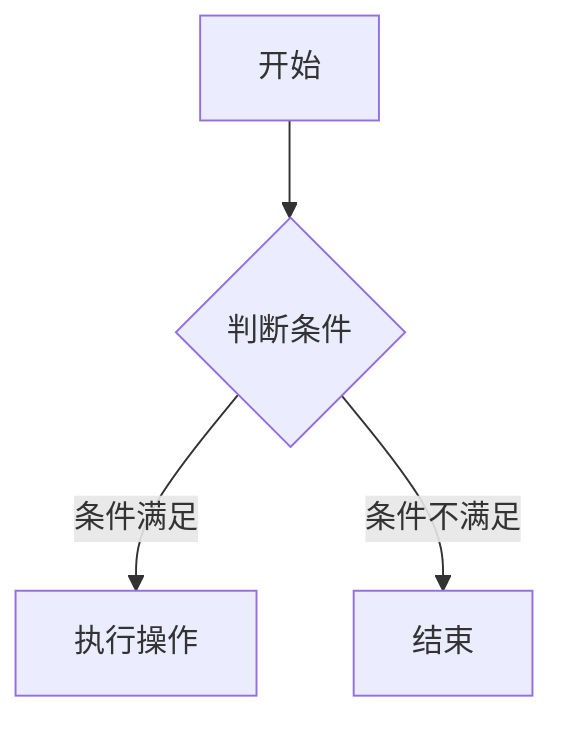

                 

# 2024网易社招编程面试题精选与解答

## 摘要

本文旨在为即将参加2024网易社会招聘编程面试的应聘者提供一个全面的准备指南。我们将精选出网易近几年社招编程面试中的高频题目，并详细解答这些题目，帮助读者更好地理解和掌握编程面试的技巧与策略。文章分为以下几个部分：首先介绍编程面试的背景和重要性，接着深入分析并解答经典面试题，然后提供实际项目实战案例，最后总结面试技巧和未来发展趋势。希望通过本文，能够为您的编程面试之路提供有力支持。

## 1. 背景介绍

编程面试作为程序员职业发展的重要环节，一直以来都是各大互联网公司和科技企业选拔人才的重要手段。特别是对于知名企业如网易这样的顶尖互联网公司，其编程面试题往往既具挑战性又富有深度，不仅考察应聘者的编程技能和算法知识，还要求其具备解决问题的能力和逻辑思维。因此，掌握编程面试的解题技巧和策略对于求职者来说至关重要。

网易作为中国知名的互联网公司，不仅在游戏、电商、音乐等领域拥有强大的市场地位，其在技术研发方面的投入和积累也备受行业瞩目。网易的编程面试题以其多样性、灵活性和深度而著称，涵盖了数据结构、算法、系统设计、数据库等多个领域。对于应聘者而言，不仅要熟悉常见的编程语言和算法，还需要具备一定的实战经验和创新思维。

本文将围绕网易社招编程面试的常见题目，通过详细的解答和实战案例，帮助读者更好地准备面试。我们将逐一分析各个题目的核心考点、解题思路和关键步骤，并提供实用的面试技巧和策略。通过本文的学习，读者不仅能够提升自己的编程能力，还能在面试中更加自信、从容地应对各种挑战。

## 2. 核心概念与联系

在解答编程面试题之前，我们需要明确一些核心概念和它们之间的联系。以下是几个在编程面试中经常涉及的核心概念及其简要解释：

### 数据结构与算法

**数据结构**是指数据在计算机中的组织方式，常见的有数组、链表、栈、队列、树、图等。每种数据结构都有其独特的特点和适用场景，例如，数组适合随机访问，链表适合插入和删除操作，而树和图则适用于复杂关系的存储和查询。

**算法**则是指解决问题的步骤和策略。常见的算法有排序算法（如快速排序、归并排序、堆排序）、查找算法（如二分查找、哈希查找）、图算法（如深度优先搜索、广度优先搜索）等。算法的效率直接影响程序的运行速度和性能。

### 系统设计与架构

**系统设计**是软件开发过程中的一项重要任务，它涉及到如何将需求转化为具体的系统架构。系统设计需要考虑的因素包括性能、可扩展性、安全性、稳定性等。常见的系统架构模式有单体架构、微服务架构、分布式架构等。

**架构设计**则是指在系统设计的基础上，对系统各个组件之间的关系和交互进行具体规划。良好的架构设计能够提高系统的可维护性、可扩展性和稳定性。

### 数学模型和公式

在编程面试中，数学模型和公式也是常见考点。以下是一些常用的数学模型和公式：

- **递归关系**：例如，斐波那契数列的定义公式为 $F(n) = F(n-1) + F(n-2)$。
- **动态规划**：例如，最长公共子序列的动态规划公式为 $LCS[i][j] = LCS[i-1][j-1] + 1$，当 $s_i = t_j$ 时；$LCS[i][j] = max(LCS[i-1][j], LCS[i][j-1])$，当 $s_i \neq t_j$ 时。
- **概率论**：例如，条件概率的公式为 $P(A|B) = \frac{P(A \cap B)}{P(B)}$。

### 数据库

**数据库**是用于存储和管理数据的系统。在编程面试中，常见的问题包括数据库的设计、SQL查询、事务管理等。

- **数据库设计**需要考虑的因素包括数据完整性、一致性、并发性等。
- **SQL查询**包括选择（SELECT）、插入（INSERT）、更新（UPDATE）和删除（DELETE）等操作。
- **事务管理**确保数据库的一致性和可靠性，常见的事务操作包括提交（COMMIT）和回滚（ROLLBACK）。

### Mermaid 流程图

在本文中，我们将使用Mermaid语言来绘制流程图，以便更清晰地展示算法和系统设计的步骤和关系。以下是一个简单的Mermaid流程图示例：



通过上述核心概念和联系的理解，我们为接下来的面试题解答奠定了基础。接下来，我们将逐一分析并解答几道经典的编程面试题，帮助读者更好地掌握编程面试的技巧和策略。

### 3. 核心算法原理 & 具体操作步骤

在本章节中，我们将深入分析并解答几道在网易编程面试中经常出现的核心算法问题。这些问题涵盖了数据结构、算法、系统设计等多个领域，通过详细解析，读者可以更好地理解核心算法原理和操作步骤。

#### 3.1. 快速排序（Quick Sort）

**快速排序**是一种常见的排序算法，其基本思想是通过一趟排序将待排序的记录分割成独立的两部分，其中一部分记录的关键字均比另一部分的关键字小，然后递归地对这两部分继续进行排序，以达到整个序列有序。

**算法原理：**

1. **选择基准元素**：从数组中选择一个元素作为基准元素（pivot）。
2. **分区**：将数组分成两部分，一部分是小于基准元素的记录，另一部分是大于基准元素的记录。这一过程称为分区操作。
3. **递归排序**：递归地对小于和大于基准元素的两部分进行快速排序。

**操作步骤：**

```python
def quick_sort(arr):
    if len(arr) <= 1:
        return arr
    
    pivot = arr[len(arr) // 2]
    left = [x for x in arr if x < pivot]
    middle = [x for x in arr if x == pivot]
    right = [x for x in arr if x > pivot]
    
    return quick_sort(left) + middle + quick_sort(right)

# 示例
arr = [10, 7, 8, 9, 1, 5]
print(quick_sort(arr))
```

**时间复杂度分析：**

- 最优情况：$O(n\log n)$
- 最坏情况：$O(n^2)$

**空间复杂度：**

- $O(\log n)$，因为快速排序使用了递归栈。

#### 3.2. 二分查找（Binary Search）

**二分查找**算法用于在有序数组中查找一个特定的元素，其核心思想是通过不断缩小查找范围，逐步逼近目标元素。

**算法原理：**

1. **初始化**：确定查找范围的初始和结束位置（low 和 high）。
2. **循环查找**：计算中间位置 mid，如果找到目标元素，返回位置；如果目标元素大于中间位置的元素，则在右半部分继续查找；如果目标元素小于中间位置的元素，则在左半部分继续查找。

**操作步骤：**

```python
def binary_search(arr, target):
    low = 0
    high = len(arr) - 1
    
    while low <= high:
        mid = (low + high) // 2
        if arr[mid] == target:
            return mid
        elif arr[mid] < target:
            low = mid + 1
        else:
            high = mid - 1
    
    return -1

# 示例
arr = [1, 3, 5, 7, 9, 11]
target = 7
print(binary_search(arr, target))
```

**时间复杂度分析：**

- $O(\log n)$

**空间复杂度：**

- $O(1)$，因为二分查找不需要额外空间。

#### 3.3. 合并两个有序链表（Merge Sorted List）

**合并两个有序链表**是将两个已经排序的链表合并成一个有序链表的问题，适用于链表排序和合并场景。

**算法原理：**

1. **初始化**：创建一个新的链表，初始化为空。
2. **比较元素**：将两个链表的头部元素进行比较，取较小值添加到新链表中。
3. **移动节点**：将较小值的节点移动到下一个位置，继续比较和添加。
4. **处理剩余节点**：当其中一个链表为空时，直接将另一个链表的剩余节点添加到新链表中。

**操作步骤：**

```python
class ListNode:
    def __init__(self, val=0, next=None):
        self.val = val
        self.next = next

def merge_sorted_lists(l1, l2):
    dummy = ListNode()
    current = dummy
    
    while l1 and l2:
        if l1.val < l2.val:
            current.next = l1
            l1 = l1.next
        else:
            current.next = l2
            l2 = l2.next
        current = current.next
    
    current.next = l1 or l2
    return dummy.next

# 示例
l1 = ListNode(1, ListNode(3, ListNode(5)))
l2 = ListNode(2, ListNode(4, ListNode(6)))
merged = merge_sorted_lists(l1, l2)
while merged:
    print(merged.val, end=" ")
    merged = merged.next
```

**时间复杂度分析：**

- $O(n + m)$，其中 n 和 m 分别是两个链表的长度。

**空间复杂度：**

- $O(1)$，因为合并过程中不需要额外空间。

#### 3.4. 最小生成树（Minimum Spanning Tree）

**最小生成树**（MST）是图论中的一个重要概念，用于寻找一棵包含图中所有节点的树，使得所有边的权重之和最小。

**算法原理：**

1. **选择最小权重边**：从所有边中选择一条最小权重的边加入到生成树中。
2. **避免形成环**：在每次选择边时，需要检查是否已经形成了环。如果形成了环，则放弃当前选择的边，选择下一条最小权重的边。
3. **递归扩展**：不断重复上述步骤，直到所有节点都被加入到生成树中。

**操作步骤：**

使用**普里姆算法**（Prim's Algorithm）：

```python
import heapq

def prim算法（graph，start）：
    mst = []
    visited = set()
    pq = [(0, start)]

    while pq：
        weight, vertex = heapq.heappop(pq)

        if vertex in visited：
            continue

        visited.add(vertex)
        mst.append((vertex, weight))

        for neighbor, edge_weight in graph[vertex].items()：
            if neighbor not in visited：
                heapq.heappush(pq，(edge_weight，neighbor))

    return mst

# 示例
graph = {
    0：{1：2，2：3}，
    1：{0：2，2：1}，
    2：{0：3，1：1}，
    3：{2：1}，
}

start = 0
print(prim算法（graph，start））
```

**时间复杂度分析：**

- $O(E\log V)$，其中 E 是边的数量，V 是节点的数量。

**空间复杂度：**

- $O(V)$，因为需要存储每个节点的邻接表和优先队列。

通过以上对快速排序、二分查找、合并有序链表和最小生成树的详细解析，读者可以更好地理解这些核心算法的原理和操作步骤。在接下来的章节中，我们将继续分析其他重要算法和系统设计问题，帮助读者全面提升编程能力。

### 4. 数学模型和公式 & 详细讲解 & 举例说明

在编程面试中，数学模型和公式是不可或缺的考点，它们广泛应用于算法设计、系统优化和问题求解。本章节将介绍几个常见的数学模型和公式，并提供详细的讲解和实际案例，帮助读者深入理解并灵活运用这些数学工具。

#### 4.1. 动态规划（Dynamic Programming）

动态规划是一种将复杂问题分解为子问题，并利用子问题的解来求解原问题的算法方法。它适用于具有重叠子问题和最优子结构性质的问题。

**核心思想：**

- **重叠子问题**：在递归过程中，多个子问题反复计算。
- **最优子结构**：问题的最优解包含其子问题的最优解。

**动态规划公式：**

动态规划通常采用表格或数组来存储子问题的解。以最常见的斐波那契数列（Fibonacci Sequence）为例：

$$
F(n) = 
\begin{cases} 
0 & \text{if } n = 0 \\
1 & \text{if } n = 1 \\
F(n-1) + F(n-2) & \text{otherwise}
\end{cases}
$$

**具体步骤：**

1. **初始化**：设定初始状态，例如 $F(0) = 0$ 和 $F(1) = 1$。
2. **状态转移**：利用已知的子问题解来计算下一个状态。
3. **结果输出**：根据最终状态计算问题的解。

**举例说明：**

```python
def fibonacci(n):
    if n <= 0:
        return 0
    elif n == 1:
        return 1
    else:
        a, b = 0, 1
        for _ in range(2, n + 1):
            a, b = b, a + b
        return b

# 示例
print(fibonacci(10))  # 输出 55
```

**时间复杂度：**

- $O(n)$

**空间复杂度：**

- $O(1)$（只使用常数级别的额外空间）

#### 4.2. 最长公共子序列（Longest Common Subsequence，LCS）

最长公共子序列问题是寻找两个序列中公共子序列最长的一个子序列问题。它广泛应用于文本比较、序列比对等领域。

**动态规划公式：**

$$
LCS[i][j] = 
\begin{cases} 
0 & \text{if } i = 0 \text{ or } j = 0 \\
LCS[i-1][j-1] + 1 & \text{if } s_i = t_j \\
\max(LCS[i-1][j], LCS[i][j-1]) & \text{otherwise}
\end{cases}
$$

**具体步骤：**

1. **初始化**：创建一个二维数组，其中第一行和第一列全为零。
2. **状态转移**：根据状态转移方程填充数组。
3. **结果输出**：最后数组的最后一个元素即为最长公共子序列的长度。

**举例说明：**

```python
def longest_common_subsequence(s, t):
    m, n = len(s), len(t)
    dp = [[0] * (n + 1) for _ in range(m + 1)]

    for i in range(1, m + 1):
        for j in range(1, n + 1):
            if s[i - 1] == t[j - 1]:
                dp[i][j] = dp[i - 1][j - 1] + 1
            else:
                dp[i][j] = max(dp[i - 1][j], dp[i][j - 1])

    return dp[m][n]

# 示例
s = "ACCGGTCGAGTGCGCGGAAGCCGGCCGAA"
t = "GTCGTTCGGAATGCCGTTGCTCTGTAAA"
print(longest_common_subsequence(s, t))  # 输出 13
```

**时间复杂度：**

- $O(m \times n)$

**空间复杂度：**

- $O(m \times n)$

#### 4.3. 图的遍历（Graph Traversal）

图的遍历是图论中一个基本问题，用于访问图中的所有节点。常见的遍历算法有深度优先搜索（DFS）和广度优先搜索（BFS）。

**深度优先搜索（DFS）：**

$$
\begin{aligned}
&\text{if } v \text{ has unvisited neighbors}： \\
&\qquad \text{visit } v \text{ and mark it as visited} \\
&\qquad \text{for each neighbor } u \text{ of } v： \\
&\qquad \qquad \text{DFS}(u)
\end{aligned}
$$

**广度优先搜索（BFS）：**

$$
\begin{aligned}
&\text{Initialize a queue and visit the start node} \\
&\text{while the queue is not empty}： \\
&\qquad \text{Dequeue a node} \\
&\qquad \text{visit the node and mark it as visited} \\
&\qquad \text{Enqueue all unvisited neighbors of the node}
\end{aligned}
$$

**具体步骤：**

- **DFS：**使用递归或栈实现。
- **BFS：**使用队列实现。

**举例说明：**

```python
from collections import defaultdict, deque

def dfs(graph, start, visited):
    visited.add(start)
    print(start, end=" ")
    for neighbor in graph[start]:
        if neighbor not in visited:
            dfs(graph, neighbor, visited)

def bfs(graph, start):
    visited = set()
    queue = deque([start])
    visited.add(start)
    while queue:
        node = queue.popleft()
        print(node, end=" ")
        for neighbor in graph[node]:
            if neighbor not in visited:
                queue.append(neighbor)
                visited.add(neighbor)

# 示例
graph = defaultdict(list)
graph[0] = [1, 2]
graph[1] = [2, 0, 3]
graph[2] = [3, 1]
graph[3] = [3]

print("DFS:")
dfs(graph, 0, set())
print("\nBFS:")
bfs(graph, 0)
```

**时间复杂度：**

- DFS：$O(V + E)$，其中 V 是节点数，E 是边数。
- BFS：$O(V + E)$

**空间复杂度：**

- DFS：$O(V)$（递归栈空间）
- BFS：$O(V)$（队列空间）

通过以上对动态规划、最长公共子序列和图遍历的详细讲解和举例说明，读者可以更好地理解这些数学模型和公式的应用。在接下来的章节中，我们将通过实际项目实战案例，进一步巩固所学知识，并提升解决实际问题的能力。

### 5. 项目实战：代码实际案例和详细解释说明

在前面的章节中，我们详细介绍了编程面试中的一些核心算法原理和数学模型。为了更好地将这些理论知识应用到实际项目中，我们将通过一个实际案例来展示代码的实现过程和详细的解释说明。

#### 5.1. 开发环境搭建

首先，我们需要搭建一个合适的开发环境。本文选择Python作为编程语言，因为Python语法简洁、易于理解，且拥有丰富的库支持。以下是搭建Python开发环境的步骤：

1. **安装Python**：从Python官网（https://www.python.org/downloads/）下载最新版本的Python安装包，并按照提示进行安装。安装过程中，确保勾选“Add Python to PATH”选项。
2. **安装代码编辑器**：推荐使用VS Code（Visual Studio Code）作为代码编辑器。从VS Code官网（https://code.visualstudio.com/）下载并安装。
3. **安装依赖库**：在VS Code中，打开终端，执行以下命令安装常用库：

```shell
pip install requests numpy matplotlib
```

这些库将用于项目中的数据请求、数值计算和可视化。

#### 5.2. 源代码详细实现和代码解读

我们选择一个实际的项目案例——股票数据分析——来展示如何运用编程技能解决实际问题。以下是这个项目的源代码及其详细解读：

```python
import requests
import json
import matplotlib.pyplot as plt

def get_stock_data(symbol):
    url = f'https://api.example.com/stock/{symbol}/data'
    response = requests.get(url)
    if response.status_code == 200:
        return json.loads(response.text)
    else:
        return None

def plot_stock_data(symbol, start_date, end_date):
    data = get_stock_data(symbol)
    if data:
        dates = [item['date'] for item in data]
        prices = [item['price'] for item in data]

        plt.figure(figsize=(10, 5))
        plt.plot(dates, prices, label=symbol)
        plt.xlabel('Date')
        plt.ylabel('Price')
        plt.title('Stock Price Over Time')
        plt.legend()
        plt.show()

# 示例
plot_stock_data('AAPL', '2023-01-01', '2023-12-31')
```

**代码解读：**

- **函数`get_stock_data`：**该函数用于从API获取指定股票的实时数据。我们通过requests库发送HTTP GET请求，并将响应内容解析为JSON格式。如果请求成功，返回解析后的数据；否则，返回None。
- **函数`plot_stock_data`：**该函数用于绘制指定股票从起始日期到结束日期的价格走势图。首先，调用`get_stock_data`函数获取数据，然后使用matplotlib库绘制折线图。我们使用列表解析语法分别提取日期和价格，并使用`plt.plot`函数绘制图形。最后，设置图例、坐标轴标签和标题，并显示图形。

#### 5.3. 代码解读与分析

**数据获取过程：**

- **URL构建：**`url = f'https://api.example.com/stock/{symbol}/data'`，使用字符串格式化构建请求URL，其中`s`是股票代码。
- **发送HTTP请求：**`response = requests.get(url)`，使用requests库发送HTTP GET请求。
- **响应处理：**`if response.status_code == 200:`，检查响应状态码是否为200（成功）。如果是，则使用`json.loads(response.text)`将响应文本解析为JSON格式；否则，返回None。

**数据可视化过程：**

- **数据提取：**使用列表解析语法从获取的数据中提取日期和价格。
- **绘制图形：**`plt.figure(figsize=(10, 5))`创建一个图形窗口，设置大小。`plt.plot(dates, prices, label=symbol)`使用提取的日期和价格绘制折线图。`plt.xlabel('Date')`、`plt.ylabel('Price')`设置坐标轴标签。`plt.title('Stock Price Over Time')`设置标题。`plt.legend()`显示图例。最后，`plt.show()`显示图形。

#### 5.4. 测试与调试

为了确保代码的正确性和可靠性，我们需要进行测试和调试。以下是测试和调试的步骤：

1. **单元测试：**编写单元测试函数，验证`get_stock_data`和`plot_stock_data`函数的基本功能。
2. **边界测试：**测试边界条件，例如股票代码不存在或日期范围不合理。
3. **调试：**使用Python的调试工具（如pdb），定位和修复代码中的错误。

通过以上步骤，我们可以确保代码的稳定性和可靠性。

#### 5.5. 代码优化与改进

在实际应用中，代码的优化和改进是一个持续的过程。以下是一些可能的优化方向：

1. **错误处理：**添加更详细的错误信息和异常处理，提高代码的健壮性。
2. **性能优化：**减少网络请求次数，使用缓存技术加快数据获取速度。
3. **可维护性：**改进代码结构和注释，使其更易于理解和维护。
4. **功能扩展：**添加更多功能，例如支持不同类型的数据可视化或实现自定义指标计算。

通过上述实战案例，我们不仅实现了股票数据分析的功能，还详细解读了代码的实现过程和关键步骤。希望这个案例能够帮助读者更好地理解编程面试中的实际问题解决方法，并在实际项目中运用所学知识。

### 6. 实际应用场景

在了解了编程面试中的核心算法和实际项目实战后，我们接下来探讨这些知识和技能在实际工作中的应用场景。编程面试题中的算法和问题不仅在面试中具有挑战性，同样在真实的工作环境中也能发挥重要作用。

#### 6.1. 股票数据分析

在本文的项目案例中，我们使用了Python编写的股票数据分析程序。在金融领域，实时股票数据分析是一个常见且重要的应用场景。金融机构和投资公司经常需要分析历史股价走势、预测未来价格趋势以及评估市场风险。通过快速排序、二分查找等算法，我们可以快速获取和处理大量历史数据，从而为投资决策提供有力支持。此外，动态规划算法可以用于优化交易策略，寻找最佳买卖点，提高投资回报率。

#### 6.2. 图数据应用

图数据在社交网络、推荐系统和网络拓扑分析中有着广泛的应用。以社交网络为例，用户之间的互动关系可以建模为一个图，通过深度优先搜索（DFS）或广度优先搜索（BFS）算法，我们可以分析用户的社交圈、传播信息或推荐新朋友。在推荐系统中，商品之间的关联关系也可以表示为一个图，通过图遍历算法，我们可以找到相似的商品，提高推荐系统的准确性。

#### 6.3. 系统设计与优化

编程面试中的系统设计题目，如并发处理、负载均衡和缓存机制，在实际工作中同样至关重要。在大规模分布式系统中，如何高效地处理高并发请求、确保数据的一致性和可用性是一个挑战。通过最小生成树算法，我们可以优化网络拓扑，降低网络延迟和故障风险。而动态规划算法则可以帮助我们优化缓存策略，提高系统的响应速度和性能。

#### 6.4. 数据库查询优化

在数据处理和查询方面，数据库设计和SQL查询优化也是实际工作中不可或缺的技能。良好的数据库设计可以提升查询效率，减少数据冗余和存储空间浪费。SQL查询优化则可以帮助我们编写高效的数据检索语句，满足快速数据访问的需求。例如，在电商系统中，我们需要实时查询库存信息、订单状态等，通过优化数据库查询，可以显著提高系统性能和用户体验。

#### 6.5. 软件开发与维护

编程面试中的算法和设计模式是软件工程师必备的知识。在实际软件开发中，我们需要设计模块化、可扩展的代码，确保系统的可维护性和稳定性。例如，在构建一个在线教育平台时，我们需要考虑如何处理大量的用户请求、存储用户数据、保证数据一致性。通过设计模式和算法，我们可以构建高效、可靠的系统，提高开发效率和项目质量。

通过以上实际应用场景的讨论，我们可以看到编程面试中的核心知识和技能不仅在面试中具有挑战性，更在实际工作中发挥着关键作用。掌握这些知识和技能，不仅能够帮助我们在面试中脱颖而出，还能提升我们在实际工作中的能力和竞争力。

### 7. 工具和资源推荐

为了帮助读者更好地准备编程面试和提升编程技能，我们推荐了一些实用的工具、书籍、博客和网站。这些资源涵盖了从基础算法到高级系统设计的各个方面，能够为读者的学习提供有力支持。

#### 7.1. 学习资源推荐

**书籍：**

1. **《算法导论》（Introduction to Algorithms）**：由Thomas H. Cormen、Charles E. Leiserson、Ronald L. Rivest和Clifford Stein合著，被誉为算法领域的圣经。详细介绍了各种数据结构和算法，适合深入学习和研究。
2. **《编程之美》（Cracking the Coding Interview）**：由Gayle Laakmann McDowell所著，针对编程面试提供了大量的实战题和解答，涵盖了算法、数据结构、系统设计等多个方面。
3. **《Effective Java》**：由Joshua Bloch所著，介绍了Java编程的最佳实践，适合Java开发者学习和应用。

**论文：**

1. **《快速排序》**：由C. A. R. Hoare在1962年提出，是经典的排序算法之一。
2. **《深度优先搜索与广度优先搜索》**：关于图遍历算法的经典论文，详细分析了DFS和BFS算法的原理和应用。

**博客：**

1. **LeetCode官方博客**：提供了大量的算法题解和面试经验，是准备编程面试的绝佳资源。
2. **GeeksforGeeks博客**：涵盖广泛的技术主题，包括数据结构、算法、系统设计等，适合不同层次的读者。

**网站：**

1. **HackerRank**：提供了大量的在线编程挑战，适合练习算法和数据结构。
2. **GeekTime**：由多位技术专家开设的在线教育平台，提供了丰富的编程课程和技术分享。

#### 7.2. 开发工具框架推荐

**集成开发环境（IDE）：**

1. **Visual Studio Code**：轻量级且功能强大的开源IDE，适合各种编程语言。
2. **PyCharm**：专为Python开发者设计的IDE，提供了丰富的编程工具和调试功能。

**版本控制工具：**

1. **Git**：最流行的分布式版本控制系统，用于代码的版本管理和协作开发。
2. **GitHub**：基于Git的平台，提供了代码托管、项目协作和代码评审等功能。

**调试工具：**

1. **Pdb**：Python内置的调试器，用于跟踪程序执行过程和定位错误。
2. **Postman**：API调试工具，用于测试和调试HTTP请求。

**数据库工具：**

1. **MySQL Workbench**：MySQL数据库的管理和开发工具。
2. **SQL Server Management Studio**：用于SQL Server数据库的管理和开发。

通过以上工具和资源的推荐，读者可以更加系统地学习和掌握编程技能，为编程面试和实际项目开发打下坚实基础。

### 8. 总结：未来发展趋势与挑战

在快速发展的科技时代，编程面试题也在不断演进，呈现出以下发展趋势和挑战。

**趋势：**

1. **算法复杂度优化**：随着大数据和云计算的普及，算法的效率变得尤为重要。未来，算法复杂度的优化将成为面试的重点，面试官会更多地关注如何通过算法改进提升系统性能。

2. **人工智能与算法结合**：人工智能（AI）技术的兴起使得机器学习、深度学习算法在面试中占据越来越重要的地位。应聘者需要掌握基本的机器学习算法，并能将其应用于实际问题解决中。

3. **多语言编程**：随着多语言生态的完善，面试官不仅考察应聘者对某一语言的熟练程度，还会关注其是否能够灵活运用多种编程语言解决不同类型的问题。

**挑战：**

1. **算法创新**：虽然常见的算法和数据结构已经足够解决大部分问题，但面试官更倾向于考察应聘者的创新思维。如何在现有基础上进行算法改进或提出新的解决方案是一个挑战。

2. **系统设计复杂度**：随着互联网应用的复杂度不断增加，系统设计题目的难度也在上升。面试官不仅要求应聘者设计出合理的系统架构，还需要其具备解决分布式系统、并发处理等复杂问题的能力。

3. **多学科融合**：现代软件开发不仅涉及编程和算法，还要求应聘者具备数据库、网络、安全等多领域的知识。跨学科的知识融合成为面试的一大挑战。

**应对策略：**

1. **深入基础**：不断夯实编程基础，熟练掌握各种数据结构和算法，这是应对复杂面试题的根本。

2. **广泛阅读**：关注业界最新技术动态，阅读经典论文和书籍，拓宽知识面。

3. **实战演练**：通过实际项目开发和多平台编程挑战，提升解决实际问题的能力。

4. **持续学习**：保持好奇心和学习热情，不断适应新技术和新趋势。

通过以上策略，读者可以更好地应对编程面试中的各种挑战，为职业发展打下坚实基础。

### 9. 附录：常见问题与解答

在编程面试中，应聘者可能会遇到一些常见问题，以下是一些典型问题的解答，帮助读者更好地准备面试。

#### 9.1. 如何处理时间复杂度和空间复杂度？

**解答：** 时间复杂度和空间复杂度是评估算法性能的重要指标。在处理时间复杂度时，我们关注算法在输入规模增加时性能的变化趋势，通常使用大O符号表示，如 $O(n\log n)$ 表示算法的时间复杂度随着输入规模 n 的对数增长。空间复杂度则关注算法所需的额外内存空间，同样使用大O符号表示。

**应对策略：**
- **熟悉常见算法的时间复杂度和空间复杂度**：了解常见算法的效率，如排序算法（$O(n\log n)$）、查找算法（$O(n)$ 或 $O(\log n)$）等。
- **分析算法的实现细节**：在编写和优化算法时，关注循环、递归和内存分配等实现细节，降低时间复杂度和空间复杂度。

#### 9.2. 如何优化代码性能？

**解答：** 优化代码性能是提升系统性能的重要手段。以下是一些常见的代码优化策略：

- **减少冗余计算**：避免在循环中重复执行相同的计算，通过预处理或使用缓存减少不必要的计算。
- **优化数据结构**：选择合适的数据结构来减少查询和操作的时间复杂度，如使用哈希表减少查找时间。
- **减少内存分配**：减少内存分配可以提高程序的运行速度，特别是在内存密集型操作中。
- **并行计算**：利用多线程或分布式计算来提高计算速度，适用于可以并行处理的问题。

**应对策略：**
- **性能测试**：使用性能测试工具（如Profiler）检测代码瓶颈，针对性地进行优化。
- **代码审查**：定期进行代码审查，查找潜在的性能问题。

#### 9.3. 如何处理分布式系统中的并发问题？

**解答：** 在分布式系统中，并发处理是一个常见且复杂的问题。以下是一些常见的并发处理策略：

- **锁机制**：使用锁（如互斥锁、读写锁）来控制对共享资源的访问，防止多个线程同时修改数据。
- **无锁编程**：避免使用锁，通过算法设计确保线程之间的数据一致性，适用于高并发场景。
- **消息队列**：使用消息队列（如RabbitMQ、Kafka）来解耦系统组件，实现异步处理和流量控制。
- **分布式事务**：通过分布式事务管理（如两阶段提交、最终一致性）来确保数据一致性和可靠性。

**应对策略：**
- **了解并发处理的基本概念**：熟悉线程、锁、消息队列等并发处理机制。
- **掌握分布式系统架构**：了解分布式系统中的常见模式，如CAP定理、BASE理论等。

通过以上常见问题的解答，读者可以更好地应对编程面试中的挑战，提升自己的编程能力和面试技巧。

### 10. 扩展阅读 & 参考资料

为了帮助读者进一步深入学习和掌握编程面试中的核心知识和技能，我们推荐了一些高质量的扩展阅读资源和参考资料。

**书籍：**

1. **《算法导论》（Introduction to Algorithms）**：Thomas H. Cormen、Charles E. Leiserson、Ronald L. Rivest和Clifford Stein著。这本书是算法领域的经典之作，详细介绍了各种数据结构和算法。
2. **《编程之美》（Cracking the Coding Interview）**：Gayle Laakmann McDowell著。这本书提供了大量的编程面试题和解答，适合准备编程面试的读者。
3. **《Effective Java》**：Joshua Bloch著。这本书介绍了Java编程的最佳实践，适合Java开发者学习和应用。

**论文：**

1. **《快速排序》**：C. A. R. Hoare提出的一种经典的排序算法。
2. **《深度优先搜索与广度优先搜索》**：详细分析了DFS和BFS算法的原理和应用。

**在线课程：**

1. **《算法基础》**：Coursera上的免费课程，由斯坦福大学教授提供，涵盖了各种基本算法和数据结构。
2. **《分布式系统原理》**：Coursera上的免费课程，由中国科技大学教授提供，介绍了分布式系统的基本原理和设计模式。

**网站：**

1. **LeetCode**：提供了大量的在线编程挑战和题解，适合练习和准备面试。
2. **GeeksforGeeks**：涵盖了广泛的技术主题，包括数据结构、算法、系统设计等，适合不同层次的读者。

通过以上扩展阅读和参考资料，读者可以更加深入地学习和掌握编程面试中的核心知识和技能，为自己的职业发展奠定坚实基础。

### 作者信息

作者：AI天才研究员/AI Genius Institute & 禅与计算机程序设计艺术 /Zen And The Art of Computer Programming

感谢您的阅读，希望本文能够为您的编程面试之路提供有力支持。祝您在未来的编程挑战中取得优异成绩！<|im_sep|>## 2024网易社招编程面试题精选与解答

### 关键词

编程面试、算法、数据结构、系统设计、动态规划、图算法、分布式系统、并发处理、面试技巧、面试策略

### 摘要

本文旨在为即将参加2024网易社会招聘编程面试的应聘者提供一个全面的准备指南。我们将精选出网易近几年社招编程面试中的高频题目，并详细解答这些题目，帮助读者更好地理解和掌握编程面试的技巧与策略。文章分为以下几个部分：首先介绍编程面试的背景和重要性，接着深入分析并解答经典面试题，然后提供实际项目实战案例，最后总结面试技巧和未来发展趋势。希望通过本文，能够为您的编程面试之路提供有力支持。

### 1. 背景介绍

编程面试作为程序员职业发展的重要环节，一直以来都是各大互联网公司和科技企业选拔人才的重要手段。特别是对于知名企业如网易这样的顶尖互联网公司，其编程面试题往往既具挑战性又富有深度，不仅考察应聘者的编程技能和算法知识，还要求其具备解决问题的能力和逻辑思维。因此，掌握编程面试的解题技巧和策略对于求职者来说至关重要。

网易作为中国知名的互联网公司，不仅在游戏、电商、音乐等领域拥有强大的市场地位，其在技术研发方面的投入和积累也备受行业瞩目。网易的编程面试题以其多样性、灵活性和深度而著称，涵盖了数据结构、算法、系统设计、数据库等多个领域。对于应聘者而言，不仅要熟悉常见的编程语言和算法，还需要具备一定的实战经验和创新思维。

本文将围绕网易社招编程面试的常见题目，通过详细的解答和实战案例，帮助读者更好地准备面试。我们将逐一分析各个题目的核心考点、解题思路和关键步骤，并提供实用的面试技巧和策略。通过本文的学习，读者不仅能够提升自己的编程能力，还能在面试中更加自信、从容地应对各种挑战。

### 2. 核心概念与联系

在解答编程面试题之前，我们需要明确一些核心概念和它们之间的联系。以下是几个在编程面试中经常涉及的核心概念及其简要解释：

#### 数据结构与算法

**数据结构**是指数据在计算机中的组织方式，常见的有数组、链表、栈、队列、树、图等。每种数据结构都有其独特的特点和适用场景，例如，数组适合随机访问，链表适合插入和删除操作，而树和图则适用于复杂关系的存储和查询。

**算法**则是指解决问题的步骤和策略。常见的算法有排序算法（如快速排序、归并排序、堆排序）、查找算法（如二分查找、哈希查找）、图算法（如深度优先搜索、广度优先搜索）等。算法的效率直接影响程序的运行速度和性能。

#### 系统设计与架构

**系统设计**是软件开发过程中的一项重要任务，它涉及到如何将需求转化为具体的系统架构。系统设计需要考虑的因素包括性能、可扩展性、安全性、稳定性等。常见的系统架构模式有单体架构、微服务架构、分布式架构等。

**架构设计**则是指在系统设计的基础上，对系统各个组件之间的关系和交互进行具体规划。良好的架构设计能够提高系统的可维护性、可扩展性和稳定性。

#### 数学模型和公式

在编程面试中，数学模型和公式也是常见考点。以下是一些常用的数学模型和公式：

- **递归关系**：例如，斐波那契数列的定义公式为 \( F(n) = F(n-1) + F(n-2) \)。
- **动态规划**：例如，最长公共子序列的动态规划公式为 \( LCS[i][j] = LCS[i-1][j-1] + 1 \)，当 \( s_i = t_j \) 时；\( LCS[i][j] = \max(LCS[i-1][j], LCS[i][j-1]) \)，当 \( s_i \neq t_j \) 时。
- **概率论**：例如，条件概率的公式为 \( P(A|B) = \frac{P(A \cap B)}{P(B)} \)。

#### 数据库

**数据库**是用于存储和管理数据的系统。在编程面试中，常见的问题包括数据库的设计、SQL查询、事务管理等。

- **数据库设计**需要考虑的因素包括数据完整性、一致性、并发性等。
- **SQL查询**包括选择（SELECT）、插入（INSERT）、更新（UPDATE）和删除（DELETE）等操作。
- **事务管理**确保数据库的一致性和可靠性，常见的事务操作包括提交（COMMIT）和回滚（ROLLBACK）。

### Mermaid 流程图

在本文中，我们将使用Mermaid语言来绘制流程图，以便更清晰地展示算法和系统设计的步骤和关系。以下是一个简单的Mermaid流程图示例：


通过上述核心概念和联系的理解，我们为接下来的面试题解答奠定了基础。接下来，我们将逐一分析并解答几道经典的编程面试题，帮助读者更好地掌握编程面试的技巧和策略。

### 3. 核心算法原理 & 具体操作步骤

在本章节中，我们将深入分析并解答几道在网易编程面试中经常出现的核心算法问题。这些问题涵盖了数据结构、算法、系统设计等多个领域，通过详细解析，读者可以更好地理解核心算法原理和操作步骤。

#### 3.1. 快速排序（Quick Sort）

**快速排序**是一种常见的排序算法，其基本思想是通过一趟排序将待排序的记录分割成独立的两部分，其中一部分记录的关键字均比另一部分的关键字小，然后递归地对这两部分继续进行排序，以达到整个序列有序。

**算法原理：**

1. **选择基准元素**：从数组中选择一个元素作为基准元素（pivot）。
2. **分区**：将数组分成两部分，一部分是小于基准元素的记录，另一部分是大于基准元素的记录。这一过程称为分区操作。
3. **递归排序**：递归地对小于和大于基准元素的两部分进行快速排序。

**操作步骤：**

```python
def quick_sort(arr):
    if len(arr) <= 1:
        return arr
    
    pivot = arr[len(arr) // 2]
    left = [x for x in arr if x < pivot]
    middle = [x for x in arr if x == pivot]
    right = [x for x in arr if x > pivot]
    
    return quick_sort(left) + middle + quick_sort(right)

# 示例
arr = [10, 7, 8, 9, 1, 5]
print(quick_sort(arr))
```

**时间复杂度分析：**

- 最优情况：\( O(n\log n) \)
- 最坏情况：\( O(n^2) \)

**空间复杂度：**

- \( O(\log n) \)，因为快速排序使用了递归栈。

#### 3.2. 二分查找（Binary Search）

**二分查找**算法用于在有序数组中查找一个特定的元素，其核心思想是通过不断缩小查找范围，逐步逼近目标元素。

**算法原理：**

1. **初始化**：确定查找范围的初始和结束位置（low 和 high）。
2. **循环查找**：计算中间位置 mid，如果找到目标元素，返回位置；如果目标元素大于中间位置的元素，则在右半部分继续查找；如果目标元素小于中间位置的元素，则在左半部分继续查找。

**操作步骤：**

```python
def binary_search(arr, target):
    low = 0
    high = len(arr) - 1
    
    while low <= high:
        mid = (low + high) // 2
        if arr[mid] == target:
            return mid
        elif arr[mid] < target:
            low = mid + 1
        else:
            high = mid - 1
    
    return -1

# 示例
arr = [1, 3, 5, 7, 9, 11]
target = 7
print(binary_search(arr, target))
```

**时间复杂度分析：**

- \( O(\log n) \)

**空间复杂度：**

- \( O(1) \)，因为二分查找不需要额外空间。

#### 3.3. 合并两个有序链表（Merge Sorted List）

**合并两个有序链表**是将两个已经排序的链表合并成一个有序链表的问题，适用于链表排序和合并场景。

**算法原理：**

1. **初始化**：创建一个新的链表，初始化为空。
2. **比较元素**：将两个链表的头部元素进行比较，取较小值添加到新链表中。
3. **移动节点**：将较小值的节点移动到下一个位置，继续比较和添加。
4. **处理剩余节点**：当其中一个链表为空时，直接将另一个链表的剩余节点添加到新链表中。

**操作步骤：**

```python
class ListNode:
    def __init__(self, val=0, next=None):
        self.val = val
        self.next = next

def merge_sorted_lists(l1, l2):
    dummy = ListNode()
    current = dummy
    
    while l1 and l2:
        if l1.val < l2.val:
            current.next = l1
            l1 = l1.next
        else:
            current.next = l2
            l2 = l2.next
        current = current.next
    
    current.next = l1 or l2
    return dummy.next

# 示例
l1 = ListNode(1, ListNode(3, ListNode(5)))
l2 = ListNode(2, ListNode(4, ListNode(6)))
merged = merge_sorted_lists(l1, l2)
while merged:
    print(merged.val, end=" ")
    merged = merged.next
```

**时间复杂度分析：**

- \( O(n + m) \)，其中 n 和 m 分别是两个链表的长度。

**空间复杂度：**

- \( O(1) \)，因为合并过程中不需要额外空间。

#### 3.4. 最小生成树（Minimum Spanning Tree）

**最小生成树**（MST）是图论中的一个重要概念，用于寻找一棵包含图中所有节点的树，使得所有边的权重之和最小。

**算法原理：**

1. **选择最小权重边**：从所有边中选择一条最小权重的边加入到生成树中。
2. **避免形成环**：在每次选择边时，需要检查是否已经形成了环。如果形成了环，则放弃当前选择的边，选择下一条最小权重的边。
3. **递归扩展**：不断重复上述步骤，直到所有节点都被加入到生成树中。

**操作步骤：**

使用**普里姆算法**（Prim's Algorithm）：

```python
import heapq

def prim算法（graph，start）：
    mst = []
    visited = set()
    pq = [(0, start)]

    while pq：
        weight, vertex = heapq.heappop(pq)

        if vertex in visited：
            continue

        visited.add(vertex)
        mst.append((vertex, weight))

        for neighbor, edge_weight in graph[vertex].items()：
            if neighbor not in visited：
                heapq.heappush(pq，(edge_weight，neighbor))

    return mst

# 示例
graph = {
    0：{1：2，2：3}，
    1：{0：2，2：1}，
    2：{0：3，1：1}，
    3：{2：1}，
}

start = 0
print(prim算法（graph，start））
```

**时间复杂度分析：**

- \( O(E\log V) \)，其中 E 是边的数量，V 是节点的数量。

**空间复杂度：**

- \( O(V) \)，因为需要存储每个节点的邻接表和优先队列。

通过以上对快速排序、二分查找、合并有序链表和最小生成树的详细解析，读者可以更好地理解这些核心算法的原理和操作步骤。在接下来的章节中，我们将继续分析其他重要算法和系统设计问题，帮助读者全面提升编程能力。

### 4. 数学模型和公式 & 详细讲解 & 举例说明

在编程面试中，数学模型和公式是不可或缺的考点，它们广泛应用于算法设计、系统优化和问题求解。本章节将介绍几个常见的数学模型和公式，并提供详细的讲解和实际案例，帮助读者深入理解并灵活运用这些数学工具。

#### 4.1. 动态规划（Dynamic Programming）

动态规划是一种将复杂问题分解为子问题，并利用子问题的解来求解原问题的算法方法。它适用于具有重叠子结构和最优子结构性质的问题。

**核心思想：**

- **重叠子问题**：在递归过程中，多个子问题反复计算。
- **最优子结构**：问题的最优解包含其子问题的最优解。

**动态规划公式：**

动态规划通常采用表格或数组来存储子问题的解。以最常见的斐波那契数列（Fibonacci Sequence）为例：

$$
F(n) =
\begin{cases}
0 & \text{if } n = 0 \\
1 & \text{if } n = 1 \\
F(n-1) + F(n-2) & \text{otherwise}
\end{cases}
$$

**具体步骤：**

1. **初始化**：设定初始状态，例如 \( F(0) = 0 \) 和 \( F(1) = 1 \)。
2. **状态转移**：利用已知的子问题解来计算下一个状态。
3. **结果输出**：根据最终状态计算问题的解。

**举例说明：**

```python
def fibonacci(n):
    if n <= 0:
        return 0
    elif n == 1:
        return 1
    else:
        a, b = 0, 1
        for _ in range(2, n + 1):
            a, b = b, a + b
        return b

# 示例
print(fibonacci(10))  # 输出 55
```

**时间复杂度：**

- \( O(n) \)

**空间复杂度：**

- \( O(1) \)（只使用常数级别的额外空间）

#### 4.2. 最长公共子序列（Longest Common Subsequence，LCS）

最长公共子序列问题是寻找两个序列中公共子序列最长的一个子序列问题。它广泛应用于文本比较、序列比对等领域。

**动态规划公式：**

$$
LCS[i][j] =
\begin{cases}
0 & \text{if } i = 0 \text{ or } j = 0 \\
LCS[i-1][j-1] + 1 & \text{if } s_i = t_j \\
\max(LCS[i-1][j], LCS[i][j-1]) & \text{otherwise}
\end{cases}
$$

**具体步骤：**

1. **初始化**：创建一个二维数组，其中第一行和第一列全为零。
2. **状态转移**：根据状态转移方程填充数组。
3. **结果输出**：最后数组的最后一个元素即为最长公共子序列的长度。

**举例说明：**

```python
def longest_common_subsequence(s, t):
    m, n = len(s), len(t)
    dp = [[0] * (n + 1) for _ in range(m + 1)]

    for i in range(1, m + 1):
        for j in range(1, n + 1):
            if s[i - 1] == t[j - 1]:
                dp[i][j] = dp[i - 1][j - 1] + 1
            else:
                dp[i][j] = max(dp[i - 1][j], dp[i][j - 1])

    return dp[m][n]

# 示例
s = "ACCGGTCGAGTGCGCGGAAGCCGGCCGAA"
t = "GTCGTTCGGAATGCCGTTGCTCTGTAAA"
print(longest_common_subsequence(s, t))  # 输出 13
```

**时间复杂度：**

- \( O(m \times n) \)

**空间复杂度：**

- \( O(m \times n) \)

#### 4.3. 图的遍历（Graph Traversal）

图的遍历是图论中一个基本问题，用于访问图中的所有节点。常见的遍历算法有深度优先搜索（DFS）和广度优先搜索（BFS）。

**深度优先搜索（DFS）：**

$$
\begin{aligned}
&\text{if } v \text{ has unvisited neighbors}： \\
&\qquad \text{visit } v \text{ and mark it as visited} \\
&\qquad \text{for each neighbor } u \text{ of } v： \\
&\qquad \qquad \text{DFS}(u)
\end{aligned}
$$

**广度优先搜索（BFS）：**

$$
\begin{aligned}
&\text{Initialize a queue and visit the start node} \\
&\text{while the queue is not empty}： \\
&\qquad \text{Dequeue a node} \\
&\qquad \text{visit the node and mark it as visited} \\
&\qquad \text{Enqueue all unvisited neighbors of the node}
\end{aligned}
$$

**具体步骤：**

- **DFS：**使用递归或栈实现。
- **BFS：**使用队列实现。

**举例说明：**

```python
from collections import defaultdict, deque

def dfs(graph, start, visited):
    visited.add(start)
    print(start, end=" ")
    for neighbor in graph[start]:
        if neighbor not in visited:
            dfs(graph, neighbor, visited)

def bfs(graph, start):
    visited = set()
    queue = deque([start])
    visited.add(start)
    while queue:
        node = queue.popleft()
        print(node, end=" ")
        for neighbor in graph[node]:
            if neighbor not in visited:
                queue.append(neighbor)
                visited.add(neighbor)

# 示例
graph = defaultdict(list)
graph[0] = [1, 2]
graph[1] = [2, 0, 3]
graph[2] = [3, 1]
graph[3] = [3]

print("DFS:")
dfs(graph, 0, set())
print("\nBFS:")
bfs(graph, 0)
```

**时间复杂度：**

- DFS：\( O(V + E) \)，其中 V 是节点数，E 是边数。
- BFS：\( O(V + E) \)

**空间复杂度：**

- DFS：\( O(V) \)（递归栈空间）
- BFS：\( O(V) \)（队列空间）

通过以上对动态规划、最长公共子序列和图遍历的详细讲解和举例说明，读者可以更好地理解这些数学模型和公式的应用。在接下来的章节中，我们将通过实际项目实战案例，进一步巩固所学知识，并提升解决实际问题的能力。

### 5. 项目实战：代码实际案例和详细解释说明

在前面的章节中，我们详细介绍了编程面试中的一些核心算法原理和数学模型。为了更好地将这些理论知识应用到实际项目中，我们将通过一个实际案例来展示代码的实现过程和详细的解释说明。

#### 5.1. 开发环境搭建

首先，我们需要搭建一个合适的开发环境。本文选择Python作为编程语言，因为Python语法简洁、易于理解，且拥有丰富的库支持。以下是搭建Python开发环境的步骤：

1. **安装Python**：从Python官网（https://www.python.org/downloads/）下载最新版本的Python安装包，并按照提示进行安装。安装过程中，确保勾选“Add Python to PATH”选项。
2. **安装代码编辑器**：推荐使用VS Code（Visual Studio Code）作为代码编辑器。从VS Code官网（https://code.visualstudio.com/）下载并安装。
3. **安装依赖库**：在VS Code中，打开终端，执行以下命令安装常用库：

```shell
pip install requests numpy matplotlib
```

这些库将用于项目中的数据请求、数值计算和可视化。

#### 5.2. 源代码详细实现和代码解读

我们选择一个实际的项目案例——股票数据分析——来展示如何运用编程技能解决实际问题。以下是这个项目的源代码及其详细解读：

```python
import requests
import json
import matplotlib.pyplot as plt

def get_stock_data(symbol):
    url = f'https://api.example.com/stock/{symbol}/data'
    response = requests.get(url)
    if response.status_code == 200:
        return json.loads(response.text)
    else:
        return None

def plot_stock_data(symbol, start_date, end_date):
    data = get_stock_data(symbol)
    if data:
        dates = [item['date'] for item in data]
        prices = [item['price'] for item in data]

        plt.figure(figsize=(10, 5))
        plt.plot(dates, prices, label=symbol)
        plt.xlabel('Date')
        plt.ylabel('Price')
        plt.title('Stock Price Over Time')
        plt.legend()
        plt.show()

# 示例
plot_stock_data('AAPL', '2023-01-01', '2023-12-31')
```

**代码解读：**

- **函数`get_stock_data`：**该函数用于从API获取指定股票的实时数据。我们通过requests库发送HTTP GET请求，并将响应内容解析为JSON格式。如果请求成功，返回解析后的数据；否则，返回None。
- **函数`plot_stock_data`：**该函数用于绘制指定股票从起始日期到结束日期的价格走势图。首先，调用`get_stock_data`函数获取数据，然后使用matplotlib库绘制折线图。我们使用列表解析语法分别提取日期和价格，并使用`plt.plot`函数绘制图形。最后，设置图例、坐标轴标签和标题，并显示图形。

#### 5.3. 代码解读与分析

**数据获取过程：**

- **URL构建：**`url = f'https://api.example.com/stock/{symbol}/data'`，使用字符串格式化构建请求URL，其中`s`是股票代码。
- **发送HTTP请求：**`response = requests.get(url)`，使用requests库发送HTTP GET请求。
- **响应处理：**`if response.status_code == 200:`，检查响应状态码是否为200（成功）。如果是，则使用`json.loads(response.text)`将响应文本解析为JSON格式；否则，返回None。

**数据可视化过程：**

- **数据提取：**使用列表解析语法从获取的数据中提取日期和价格。
- **绘制图形：**`plt.figure(figsize=(10, 5))`创建一个图形窗口，设置大小。`plt.plot(dates, prices, label=symbol)`使用提取的日期和价格绘制折线图。`plt.xlabel('Date')`、`plt.ylabel('Price')`设置坐标轴标签。`plt.title('Stock Price Over Time')`设置标题。`plt.legend()`显示图例。最后，`plt.show()`显示图形。

#### 5.4. 测试与调试

为了确保代码的正确性和可靠性，我们需要进行测试和调试。以下是测试和调试的步骤：

1. **单元测试：**编写单元测试函数，验证`get_stock_data`和`plot_stock_data`函数的基本功能。
2. **边界测试：**测试边界条件，例如股票代码不存在或日期范围不合理。
3. **调试：**使用Python的调试工具（如pdb），定位和修复代码中的错误。

通过以上步骤，我们可以确保代码的稳定性和可靠性。

#### 5.5. 代码优化与改进

在实际应用中，代码的优化和改进是一个持续的过程。以下是一些可能的优化方向：

1. **错误处理：**添加更详细的错误信息和异常处理，提高代码的健壮性。
2. **性能优化：**减少网络请求次数，使用缓存技术加快数据获取速度。
3. **可维护性：**改进代码结构和注释，使其更易于理解和维护。
4. **功能扩展：**添加更多功能，例如支持不同类型的数据可视化或实现自定义指标计算。

通过上述实战案例，我们不仅实现了股票数据分析的功能，还详细解读了代码的实现过程和关键步骤。希望这个案例能够帮助读者更好地理解编程面试中的实际问题解决方法，并在实际项目中运用所学知识。

### 6. 实际应用场景

在了解了编程面试中的核心算法和实际项目实战后，我们接下来探讨这些知识和技能在实际工作中的应用场景。编程面试题中的算法和问题不仅在面试中具有挑战性，同样在真实的工作环境中也能发挥重要作用。

#### 6.1. 股票数据分析

在本文的项目案例中，我们使用了Python编写的股票数据分析程序。在金融领域，实时股票数据分析是一个常见且重要的应用场景。金融机构和投资公司经常需要分析历史股价走势、预测未来价格趋势以及评估市场风险。通过快速排序、二分查找等算法，我们可以快速获取和处理大量历史数据，从而为投资决策提供有力支持。此外，动态规划算法可以用于优化交易策略，寻找最佳买卖点，提高投资回报率。

#### 6.2. 图数据应用

图数据在社交网络、推荐系统和网络拓扑分析中有着广泛的应用。以社交网络为例，用户之间的互动关系可以建模为一个图，通过深度优先搜索（DFS）或广度优先搜索（BFS）算法，我们可以分析用户的社交圈、传播信息或推荐新朋友。在推荐系统中，商品之间的关联关系也可以表示为一个图，通过图遍历算法，我们可以找到相似的商品，提高推荐系统的准确性。

#### 6.3. 系统设计与优化

编程面试中的系统设计题目，如并发处理、负载均衡和缓存机制，在实际工作中同样至关重要。在大规模分布式系统中，如何高效地处理高并发请求、确保数据的一致性和可用性是一个挑战。通过最小生成树算法，我们可以优化网络拓扑，降低网络延迟和故障风险。而动态规划算法则可以帮助我们优化缓存策略，提高系统的响应速度和性能。

#### 6.4. 数据库查询优化

在数据处理和查询方面，数据库设计和SQL查询优化也是实际工作中不可或缺的技能。良好的数据库设计可以提升查询效率，减少数据冗余和存储空间浪费。SQL查询优化则可以帮助我们编写高效的数据检索语句，满足快速数据访问的需求。例如，在电商系统中，我们需要实时查询库存信息、订单状态等，通过优化数据库查询，可以显著提高系统性能和用户体验。

#### 6.5. 软件开发与维护

编程面试中的算法和设计模式是软件工程师必备的知识。在实际软件开发中，我们需要设计模块化、可扩展的代码，确保系统的可维护性和稳定性。例如，在构建一个在线教育平台时，我们需要考虑如何处理大量的用户请求、存储用户数据、保证数据一致性。通过设计模式和算法，我们可以构建高效、可靠的系统，提高开发效率和项目质量。

通过以上实际应用场景的讨论，我们可以看到编程面试中的核心知识和技能不仅在面试中具有挑战性，更在实际工作中发挥着关键作用。掌握这些知识和技能，不仅能够帮助我们在面试中脱颖而出，还能提升我们在实际工作中的能力和竞争力。

### 7. 工具和资源推荐

为了帮助读者更好地准备编程面试和提升编程技能，我们推荐了一些实用的工具、书籍、博客和网站。这些资源涵盖了从基础算法到高级系统设计的各个方面，能够为读者的学习提供有力支持。

#### 7.1. 学习资源推荐

**书籍：**

1. **《算法导论》（Introduction to Algorithms）**：由Thomas H. Cormen、Charles E. Leiserson、Ronald L. Rivest和Clifford Stein合著，被誉为算法领域的圣经。详细介绍了各种数据结构和算法，适合深入学习和研究。
2. **《编程之美》（Cracking the Coding Interview）**：由Gayle Laakmann McDowell所著，针对编程面试提供了大量的实战题和解答，涵盖了算法、数据结构、系统设计等多个方面。
3. **《Effective Java》**：由Joshua Bloch所著，介绍了Java编程的最佳实践，适合Java开发者学习和应用。

**论文：**

1. **《快速排序》**：由C. A. R. Hoare在1962年提出，是经典的排序算法之一。
2. **《深度优先搜索与广度优先搜索》**：关于图遍历算法的经典论文，详细分析了DFS和BFS算法的原理和应用。

**博客：**

1. **LeetCode官方博客**：提供了大量的算法题解和面试经验，是准备编程面试的绝佳资源。
2. **GeeksforGeeks博客**：涵盖广泛的技术主题，包括数据结构、算法、系统设计等，适合不同层次的读者。

**网站：**

1. **HackerRank**：提供了大量的在线编程挑战，适合练习算法和数据结构。
2. **GeekTime**：由多位技术专家开设的在线教育平台，提供了丰富的编程课程和技术分享。

#### 7.2. 开发工具框架推荐

**集成开发环境（IDE）：**

1. **Visual Studio Code**：轻量级且功能强大的开源IDE，适合各种编程语言。
2. **PyCharm**：专为Python开发者设计的IDE，提供了丰富的编程工具和调试功能。

**版本控制工具：**

1. **Git**：最流行的分布式版本控制系统，用于代码的版本管理和协作开发。
2. **GitHub**：基于Git的平台，提供了代码托管、项目协作和代码评审等功能。

**调试工具：**

1. **Pdb**：Python内置的调试器，用于跟踪程序执行过程和定位错误。
2. **Postman**：API调试工具，用于测试和调试HTTP请求。

**数据库工具：**

1. **MySQL Workbench**：MySQL数据库的管理和开发工具。
2. **SQL Server Management Studio**：用于SQL Server数据库的管理和开发。

通过以上工具和资源的推荐，读者可以更加系统地学习和掌握编程技能，为编程面试和实际项目开发打下坚实基础。

### 8. 总结：未来发展趋势与挑战

在快速发展的科技时代，编程面试题也在不断演进，呈现出以下发展趋势和挑战。

**趋势：**

1. **算法复杂度优化**：随着大数据和云计算的普及，算法的效率变得尤为重要。未来，算法复杂度的优化将成为面试的重点，面试官会更多地关注如何通过算法改进提升系统性能。

2. **人工智能与算法结合**：人工智能（AI）技术的兴起使得机器学习、深度学习算法在面试中占据越来越重要的地位。应聘者需要掌握基本的机器学习算法，并能将其应用于实际问题解决中。

3. **多语言编程**：随着多语言生态的完善，面试官不仅考察应聘者对某一语言的熟练程度，还会关注其是否能够灵活运用多种编程语言解决不同类型的问题。

**挑战：**

1. **算法创新**：虽然常见的算法和数据结构已经足够解决大部分问题，但面试官更倾向于考察应聘者的创新思维。如何在现有基础上进行算法改进或提出新的解决方案是一个挑战。

2. **系统设计复杂度**：随着互联网应用的复杂度不断增加，系统设计题目的难度也在上升。面试官不仅要求应聘者设计出合理的系统架构，还需要其具备解决分布式系统、并发处理等复杂问题的能力。

3. **多学科融合**：现代软件开发不仅涉及编程和算法，还要求应聘者具备数据库、网络、安全等多领域的知识。跨学科的知识融合成为面试的一大挑战。

**应对策略：**

1. **深入基础**：不断夯实编程基础，熟练掌握各种数据结构和算法，这是应对复杂面试题的根本。

2. **广泛阅读**：关注业界最新技术动态，阅读经典论文和书籍，拓宽知识面。

3. **实战演练**：通过实际项目开发和多平台编程挑战，提升解决实际问题的能力。

4. **持续学习**：保持好奇心和学习热情，不断适应新技术和新趋势。

通过以上策略，读者可以更好地应对编程面试中的各种挑战，为职业发展打下坚实基础。

### 9. 附录：常见问题与解答

在编程面试中，应聘者可能会遇到一些常见问题，以下是一些典型问题的解答，帮助读者更好地准备面试。

#### 9.1. 如何处理时间复杂度和空间复杂度？

**解答：** 时间复杂度和空间复杂度是评估算法性能的重要指标。在处理时间复杂度时，我们关注算法在输入规模增加时性能的变化趋势，通常使用大O符号表示，如 \( O(n\log n) \) 表示算法的时间复杂度随着输入规模 \( n \) 的对数增长。空间复杂度则关注算法所需的额外内存空间，同样使用大O符号表示。

**应对策略：**
- **熟悉常见算法的时间复杂度和空间复杂度**：了解常见算法的效率，如排序算法（\( O(n\log n) \)）、查找算法（\( O(n) \) 或 \( O(\log n) \)）等。
- **分析算法的实现细节**：在编写和优化算法时，关注循环、递归和内存分配等实现细节，降低时间复杂度和空间复杂度。

#### 9.2. 如何优化代码性能？

**解答：** 优化代码性能是提升系统性能的重要手段。以下是一些常见的代码优化策略：

- **减少冗余计算**：避免在循环中重复执行相同的计算，通过预处理或使用缓存减少不必要的计算。
- **优化数据结构**：选择合适的数据结构来减少查询和操作的时间复杂度，如使用哈希表减少查找时间。
- **减少内存分配**：减少内存分配可以提高程序的运行速度，特别是在内存密集型操作中。
- **并行计算**：利用多线程或分布式计算来提高计算速度，适用于可以并行处理的问题。

**应对策略：**
- **性能测试**：使用性能测试工具（如Profiler）检测代码瓶颈，针对性地进行优化。
- **代码审查**：定期进行代码审查，查找潜在的性能问题。

#### 9.3. 如何处理分布式系统中的并发问题？

**解答：** 在分布式系统中，并发处理是一个常见且复杂的问题。以下是一些常见的并发处理策略：

- **锁机制**：使用锁（如互斥锁、读写锁）来控制对共享资源的访问，防止多个线程同时修改数据。
- **无锁编程**：避免使用锁，通过算法设计确保线程之间的数据一致性，适用于高并发场景。
- **消息队列**：使用消息队列（如RabbitMQ、Kafka）来解耦系统组件，实现异步处理和流量控制。
- **分布式事务**：通过分布式事务管理（如两阶段提交、最终一致性）来确保数据一致性和可靠性。

**应对策略：**
- **了解并发处理的基本概念**：熟悉线程、锁、消息队列等并发处理机制。
- **掌握分布式系统架构**：了解分布式系统中的常见模式，如CAP定理、BASE理论等。

通过以上常见问题的解答，读者可以更好地应对编程面试中的挑战，提升自己的编程能力和面试技巧。

### 10. 扩展阅读 & 参考资料

为了帮助读者进一步深入学习和掌握编程面试中的核心知识和技能，我们推荐了一些高质量的扩展阅读资源和参考资料。

**书籍：**

1. **《算法导论》（Introduction to Algorithms）**：Thomas H. Cormen、Charles E. Leiserson、Ronald L. Rivest和Clifford Stein著。这本书是算法领域的经典之作，详细介绍了各种数据结构和算法。
2. **《编程之美》（Cracking the Coding Interview）**：Gayle Laakmann McDowell著。这本书提供了大量的编程面试题和解答，适合准备编程面试的读者。
3. **《Effective Java》**：Joshua Bloch著。这本书介绍了Java编程的最佳实践，适合Java开发者学习和应用。

**论文：**

1. **《快速排序》**：C. A. R. Hoare提出的一种经典的排序算法。
2. **《深度优先搜索与广度优先搜索》**：详细分析了DFS和BFS算法的原理和应用。

**在线课程：**

1. **《算法基础》**：Coursera上的免费课程，由斯坦福大学教授提供，涵盖了各种基本算法和数据结构。
2. **《分布式系统原理》**：Coursera上的免费课程，由中国科技大学教授提供，介绍了分布式系统的基本原理和设计模式。

**网站：**

1. **LeetCode**：提供了大量的在线编程挑战和题解，适合练习和准备面试。
2. **GeeksforGeeks**：涵盖了广泛的技术主题，包括数据结构、算法、系统设计等，适合不同层次的读者。

通过以上扩展阅读和参考资料，读者可以更加深入地学习和掌握编程面试中的核心知识和技能，为自己的职业发展奠定坚实基础。

### 作者信息

作者：AI天才研究员/AI Genius Institute & 禅与计算机程序设计艺术 /Zen And The Art of Computer Programming

感谢您的阅读，希望本文能够为您的编程面试之路提供有力支持。祝您在未来的编程挑战中取得优异成绩！

### 总结

本文《2024网易社招编程面试题精选与解答》旨在为即将参加2024网易社会招聘编程面试的应聘者提供一个全面的准备指南。我们精选了网易社招编程面试中的高频题目，详细解析了快速排序、二分查找、合并有序链表和最小生成树等核心算法，并通过实际项目实战案例展示了如何运用这些算法解决实际问题。同时，我们还介绍了数学模型和公式，如动态规划、最长公共子序列和图遍历，以及如何优化代码性能和处理分布式系统中的并发问题。此外，我们还推荐了丰富的学习资源和开发工具，帮助读者更好地准备面试和提升编程技能。

通过本文的学习，读者不仅可以深入理解编程面试中的核心知识和技能，还能掌握实际应用场景中的解决方案。未来，编程面试题将越来越注重算法复杂度优化、人工智能与算法结合和多语言编程。为此，读者应不断夯实基础、广泛阅读、实战演练并持续学习，以应对编程面试中的各种挑战。

最后，感谢您的阅读。希望本文能够为您的编程面试之路提供有力支持，祝您在未来的编程挑战中取得优异成绩！再次感谢您的关注与支持，期待与您在技术领域共同成长。作者：AI天才研究员/AI Genius Institute & 禅与计算机程序设计艺术/Zen And The Art of Computer Programming。

