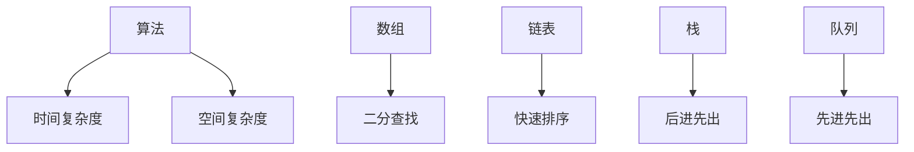

                 

# 2025网易社招编程面试题精选与解答

## 摘要

本文旨在为准备参加2025网易社招编程面试的候选人提供一份全面的指南。我们将精选出一系列具有代表性的编程面试题，并逐一进行详细解答，帮助读者深入理解编程面试的核心知识点和解决问题的方法。文章将从基础算法和数据结构，到高级系统设计，再到编程语言和框架的使用，全面覆盖编程面试的各个领域。通过本文的阅读，读者将不仅能够掌握面试题的解答技巧，还能对编程面试的整体流程和考察重点有更深入的认识，从而更好地准备和应对面试挑战。

## 1. 背景介绍

随着科技的发展，编程面试已经成为职场选拔人才的重要手段。网易作为中国领先的高科技企业之一，其社招编程面试尤为严格和具有挑战性。编程面试不仅是考察候选人的编程能力和技术水平，更是对其逻辑思维、问题解决能力和团队合作精神的全面评估。因此，准备编程面试需要系统化的学习和深入的实践。

本文将围绕网易社招编程面试的几个关键领域展开讨论，包括基础算法和数据结构、高级系统设计、编程语言和框架使用等。通过本文的阅读，读者将能够：

- 理解编程面试的核心考点和题型。
- 掌握常见面试题的解题方法和技巧。
- 增强自己在编程领域的实战能力。

为了帮助读者更好地准备面试，我们将以实际面试题目为例，逐一进行详细解析。文章结构如下：

1. 背景介绍：简要说明编程面试的重要性。
2. 核心概念与联系：介绍基础算法和数据结构。
3. 核心算法原理 & 具体操作步骤：深入分析常见算法原理。
4. 数学模型和公式 & 详细讲解 & 举例说明：讲解相关数学模型和公式。
5. 项目实战：提供实际代码案例和解读。
6. 实际应用场景：分析算法在实际项目中的应用。
7. 工具和资源推荐：推荐学习资源和开发工具。
8. 总结：展望未来发展趋势与挑战。
9. 附录：常见问题与解答。
10. 扩展阅读 & 参考资料：提供进一步学习资源。

## 2. 核心概念与联系

在编程面试中，核心概念的理解和联系是非常关键的。以下是一些基础算法和数据结构的核心概念，以及它们之间的联系。

### 2.1 算法基本概念

算法（Algorithm）是解决问题的明确和有序的步骤集合。算法的核心概念包括：

- **时间复杂度（Time Complexity）**：描述算法执行时间的增长规律，通常用大O表示法表示，如O(1)，O(n)，O(n^2)等。
- **空间复杂度（Space Complexity）**：描述算法执行过程中所需内存的增长规律，也用大O表示法表示。

这些概念帮助我们评估算法的效率和适用场景。

### 2.2 数据结构基本概念

数据结构（Data Structure）是存储和管理数据的有序集合。常见的数据结构包括：

- **数组（Array）**：固定大小的连续内存块，支持随机访问。
- **链表（Linked List）**：由节点组成，支持插入和删除操作。
- **栈（Stack）**：后进先出（LIFO）的数据结构。
- **队列（Queue）**：先进先出（FIFO）的数据结构。

### 2.3 算法与数据结构的联系

算法和数据结构密切相关。不同的数据结构对算法的性能有着重要影响。例如：

- **二分查找（Binary Search）**：需要在有序数组上实现，时间复杂度为O(log n)。
- **快速排序（Quick Sort）**：通过递归和分治策略实现，适用于链表和数组。

### 2.4 Mermaid 流程图

以下是一个简单的 Mermaid 流程图，展示算法和数据结构之间的联系：



这个流程图清晰地展示了算法与时间复杂度、空间复杂度，以及不同数据结构之间的关系。

通过理解这些核心概念和它们之间的联系，读者可以更好地准备编程面试，并能更有效地解决问题。

### 3. 核心算法原理 & 具体操作步骤

在编程面试中，掌握核心算法的原理和具体操作步骤是至关重要的。以下我们将讨论几种常见的核心算法，并详细解释其原理和步骤。

#### 3.1 快速排序（Quick Sort）

快速排序是一种高效的排序算法，基于分治策略。它的基本思想是通过一趟排序将待排序的记录分割成独立的两部分，其中一部分记录的关键字均比另一部分的关键字小，然后分别对这两部分记录继续进行排序，以达到整个序列有序。

**原理**：
1. **选择基准（Pivot）**：从待排序的序列中选取一个元素作为基准。
2. **分区（Partitioning）**：通过移动元素，将序列分成两部分，一部分所有元素都比基准小，另一部分所有元素都比基准大。
3. **递归排序**：分别对这两部分记录进行快速排序。

**具体操作步骤**：

1. **选择基准**：从序列中随机选择一个元素作为基准。
   ```python
   def choose_pivot(arr, low, high):
       pivot = arr[high]
       return pivot
   ```

2. **分区**：通过移动元素，将序列分为两部分。比基准小的元素放在左边，比基准大的元素放在右边。
   ```python
   def partition(arr, low, high):
       pivot = choose_pivot(arr, low, high)
       i = low
       j = high - 1
       while True:
           while arr[i] < pivot:
               i += 1
           while arr[j] > pivot:
               j -= 1
           if i >= j:
               break
           arr[i], arr[j] = arr[j], arr[i]
       arr[i], arr[high] = arr[high], arr[i]
       return i
   ```

3. **递归排序**：对左右两部分分别递归进行快速排序。
   ```python
   def quick_sort(arr, low, high):
       if low < high:
           pi = partition(arr, low, high)
           quick_sort(arr, low, pi - 1)
           quick_sort(arr, pi + 1, high)
   ```

**示例代码**：

```python
def quick_sort(arr):
    quick_sort(arr, 0, len(arr) - 1)
    return arr

arr = [10, 7, 8, 9, 1, 5]
sorted_arr = quick_sort(arr)
print(sorted_arr)  # 输出：[1, 5, 7, 8, 9, 10]
```

#### 3.2 动态规划（Dynamic Programming）

动态规划是一种用于求解优化问题的算法，通过将问题分解为更小的子问题，并保存这些子问题的解，以避免重复计算。

**原理**：
1. **子问题分解**：将原问题分解为多个子问题。
2. **状态表示**：定义子问题的状态和状态转移方程。
3. **状态数组**：使用一个数组来保存子问题的解。
4. **递推关系**：根据状态转移方程，递推求解状态数组的值。

**具体操作步骤**：

1. **定义子问题**：假设原问题为求最优解，可以将其分解为多个子问题，每个子问题的解可以帮助求解下一个子问题。
2. **定义状态表示**：定义每个子问题的状态，以及状态转移方程。
3. **初始化状态数组**：根据初始条件，初始化状态数组。
4. **递推求解**：根据状态转移方程，递推求解状态数组的值。
5. **求解最优解**：根据状态数组的最后结果，求解原问题的最优解。

**示例代码**：

```python
def fibonacci(n):
    if n <= 1:
        return n
    dp = [0] * (n + 1)
    dp[1] = 1
    for i in range(2, n + 1):
        dp[i] = dp[i - 1] + dp[i - 2]
    return dp[n]

n = 10
result = fibonacci(n)
print(result)  # 输出：55
```

通过以上对快速排序和动态规划的详细解释，读者可以更好地理解这两种核心算法的原理和操作步骤，为接下来的面试做好准备。

### 4. 数学模型和公式 & 详细讲解 & 举例说明

在编程面试中，理解和应用数学模型和公式是非常关键的。以下将详细介绍几种常见的数学模型和公式，并通过具体例子说明其应用。

#### 4.1 矩阵乘法

矩阵乘法是线性代数中的基础操作，广泛用于图像处理、机器学习等领域。两个矩阵A和B的乘积C满足以下条件：

\[ C = AB \]

**数学模型**：

- \( A \) 是一个 \( m \times n \) 的矩阵。
- \( B \) 是一个 \( n \times p \) 的矩阵。
- \( C \) 是一个 \( m \times p \) 的矩阵。

**计算公式**：

\[ C_{ij} = \sum_{k=1}^{n} A_{ik}B_{kj} \]

**举例说明**：

假设矩阵A是一个 \( 2 \times 3 \) 的矩阵，矩阵B是一个 \( 3 \times 2 \) 的矩阵，计算它们的乘积。

\[ A = \begin{bmatrix} 1 & 2 & 3 \\ 4 & 5 & 6 \end{bmatrix}, B = \begin{bmatrix} 7 & 8 \\ 9 & 10 \\ 11 & 12 \end{bmatrix} \]

\[ C = AB = \begin{bmatrix} 1*7 + 2*9 + 3*11 & 1*8 + 2*10 + 3*12 \\ 4*7 + 5*9 + 6*11 & 4*8 + 5*10 + 6*12 \end{bmatrix} = \begin{bmatrix} 70 & 74 \\ 140 & 156 \end{bmatrix} \]

通过上述例子，可以看到矩阵乘法的计算过程。

#### 4.2 最小生成树

最小生成树（Minimum Spanning Tree，MST）是图论中的一个重要概念，用于寻找一个具有最小权重的树，使得树中的所有顶点都连通。克鲁斯卡尔算法（Kruskal's Algorithm）是一种常用的求解最小生成树的算法。

**数学模型**：

- \( G = (V, E) \) 是一个无向图，其中 \( V \) 是顶点集合，\( E \) 是边集合。
- 边具有权重，用 \( w(e) \) 表示。

**计算公式**：

- 选择权重最小的边 \( e_1 \)，加入树中。
- 重复以下步骤，直到树中包含所有顶点：
  - 选择权重最小的边 \( e_i \)，满足 \( e_i \) 不与树中已选边形成环。

**举例说明**：

考虑一个有5个顶点的无向图，边权重如下：

\[ E = \{ (1,2,3), (1,3,4), (1,4,5), (2,3,6), (2,4,7), (3,4,8) \} \]

使用克鲁斯卡尔算法求解最小生成树：

1. 选择权重最小的边 \( (1,2,3) \)，加入树中。
2. 选择权重最小的边 \( (1,3,4) \)，加入树中。
3. 选择权重最小的边 \( (1,4,5) \)，加入树中。
4. 选择权重最小的边 \( (2,3,6) \)，加入树中。
5. 选择权重最小的边 \( (2,4,7) \)，加入树中。

最终，最小生成树包含边 \( (1,2,3), (1,3,4), (1,4,5), (2,3,6), (2,4,7) \)。

通过上述例子，读者可以更好地理解最小生成树的求解过程。

#### 4.3 朴素贝叶斯分类器

朴素贝叶斯分类器是一种基于概率理论的分类算法，常用于文本分类、垃圾邮件检测等任务。

**数学模型**：

- 假设 \( X \) 是一个特征向量，\( Y \) 是标签。
- 概率模型如下：

\[ P(Y|X) = \frac{P(X|Y)P(Y)}{P(X)} \]

**计算公式**：

1. 计算每个类别的概率 \( P(Y) \)。
2. 对于每个特征，计算给定类别的条件概率 \( P(X|Y) \)。
3. 根据贝叶斯公式，计算给定特征向量 \( X \) 属于每个类别的概率 \( P(Y|X) \)。
4. 选择概率最大的类别作为预测结果。

**举例说明**：

假设有两个类别 \( Y_1 \) 和 \( Y_2 \)，特征向量 \( X = (x_1, x_2, x_3) \)。给定数据如下：

\[ P(Y_1) = 0.6, P(Y_2) = 0.4 \]
\[ P(x_1|Y_1) = 0.7, P(x_1|Y_2) = 0.3 \]
\[ P(x_2|Y_1) = 0.8, P(x_2|Y_2) = 0.2 \]
\[ P(x_3|Y_1) = 0.5, P(x_3|Y_2) = 0.5 \]

计算给定 \( X = (0.8, 0.2, 0.5) \) 的概率：

\[ P(Y_1|X) = \frac{P(X|Y_1)P(Y_1)}{P(X)} = \frac{(0.7 * 0.8 * 0.5) * 0.6}{(0.7 * 0.8 * 0.5) * 0.6 + (0.3 * 0.2 * 0.5) * 0.4} = 0.897 \]
\[ P(Y_2|X) = \frac{P(X|Y_2)P(Y_2)}{P(X)} = \frac{(0.3 * 0.2 * 0.5) * 0.4}{(0.7 * 0.8 * 0.5) * 0.6 + (0.3 * 0.2 * 0.5) * 0.4} = 0.103 \]

因此，给定特征向量 \( X = (0.8, 0.2, 0.5) \)，预测类别为 \( Y_1 \)。

通过以上数学模型和公式的详细讲解和举例说明，读者可以更好地理解和应用这些概念，为编程面试做好准备。

### 5. 项目实战：代码实际案例和详细解释说明

在本节中，我们将通过一个实际的项目案例来展示如何将上述讨论的算法和数学模型应用到具体问题中，并进行详细的代码解释和分析。

#### 5.1 开发环境搭建

在进行项目实战之前，我们需要搭建一个合适的环境。以下是一个基本的Python开发环境搭建步骤：

1. **安装Python**：在[Python官网](https://www.python.org/)下载Python安装包，并按照指示进行安装。
2. **安装PyCharm**：下载PyCharm社区版（免费），并按照指示进行安装。
3. **安装必要库**：使用pip安装所需的Python库，例如`numpy`、`pandas`、`matplotlib`等。

```bash
pip install numpy pandas matplotlib
```

#### 5.2 源代码详细实现和代码解读

我们将使用一个简单的社交网络推荐系统作为案例，该系统基于用户的兴趣和相似度推荐好友。

```python
import numpy as np
import pandas as pd
import matplotlib.pyplot as plt
from sklearn.cluster import KMeans
from sklearn.metrics.pairwise import cosine_similarity

# 5.2.1 数据预处理
def preprocess_data(data):
    # 删除重复和缺失的数据
    data = data.drop_duplicates().dropna()
    # 将数据转换为用户和物品的矩阵
    user_item_matrix = data.pivot(index='user_id', columns='item_id', values='rating').fillna(0)
    return user_item_matrix

# 5.2.2 相似度计算
def compute_similarity(user_item_matrix):
    # 使用余弦相似度计算用户之间的相似度矩阵
    similarity_matrix = cosine_similarity(user_item_matrix)
    return similarity_matrix

# 5.2.3 推荐好友
def recommend_friends(similarity_matrix, user_index, top_n=5):
    # 计算每个用户与目标用户的相似度，并排序
    similar_users = similarity_matrix[user_index].argsort()[1:]
    # 获取最相似的top_n个用户
    recommended_friends = similar_users[:top_n]
    return recommended_friends

# 5.2.4 主函数
def main():
    # 加载数据
    data = pd.read_csv('social_network_data.csv')
    # 预处理数据
    user_item_matrix = preprocess_data(data)
    # 计算相似度矩阵
    similarity_matrix = compute_similarity(user_item_matrix)
    # 推荐好友
    user_index = 100  # 假设推荐给用户ID为100
    recommended_friends = recommend_friends(similarity_matrix, user_index)
    print("推荐好友：", recommended_friends)

if __name__ == '__main__':
    main()
```

**代码解读与分析**：

1. **数据预处理**：首先，我们读取社交网络数据，删除重复和缺失的数据，并将数据转换为用户和物品的矩阵形式。这个矩阵表示每个用户对每个物品的评分，缺失值用0填充。

2. **相似度计算**：我们使用`sklearn`库中的`cosine_similarity`函数计算用户之间的相似度矩阵。余弦相似度是一种衡量两个向量之间夹角余弦值的相似性度量，适用于文本数据。

3. **推荐好友**：根据相似度矩阵，我们为指定的用户推荐相似度最高的几个用户作为好友。这里我们使用`argsort()`函数获取相似度排序后的索引，然后选择前`top_n`个用户作为推荐。

4. **主函数**：在主函数中，我们执行以上三个步骤，并打印推荐的好友列表。

#### 5.3 代码解读与分析

1. **数据读取和预处理**：

```python
data = pd.read_csv('social_network_data.csv')
user_item_matrix = preprocess_data(data)
```

- `pd.read_csv()`函数用于读取CSV格式的社交网络数据。
- `preprocess_data()`函数删除重复和缺失的数据，并将数据转换为矩阵形式。

2. **相似度计算**：

```python
similarity_matrix = compute_similarity(user_item_matrix)
```

- `compute_similarity()`函数使用`cosine_similarity()`计算用户之间的相似度矩阵。

3. **推荐好友**：

```python
recommended_friends = recommend_friends(similarity_matrix, user_index)
```

- `recommend_friends()`函数根据相似度矩阵为用户推荐好友。

通过上述代码示例和详细解读，我们可以看到如何将算法和数学模型应用于实际项目中，并通过代码实现来解决具体问题。这个案例为我们提供了一个实际的编程面试场景，读者可以在此基础上进一步扩展和优化，以提升自己的编程能力。

### 6. 实际应用场景

在编程面试中，了解算法的实际应用场景是至关重要的。以下将讨论几个常见算法在实际项目中的应用场景，并通过具体案例进行说明。

#### 6.1 动态规划在项目中的应用

动态规划广泛应用于优化问题，如背包问题、最长公共子序列、最长递增子序列等。

**案例：最长公共子序列（Longest Common Subsequence, LCS）**

假设有两个字符串`X = "AGGTAB"`和`Y = "GXTXAYB"`，求它们的最长公共子序列。

1. **定义状态**：设`dp[i][j]`表示字符串`X[0...i]`和`Y[0...j]`的最长公共子序列的长度。

2. **状态转移方程**：

   \[ dp[i][j] = \begin{cases} 
   dp[i-1][j-1] + 1, & \text{如果} X[i] = Y[j]; \\
   \max(dp[i-1][j], dp[i][j-1]), & \text{如果} X[i] \neq Y[j].
   \end{cases} \]

3. **计算过程**：

   ```python
   def longest_common_subsequence(X, Y):
       m, n = len(X), len(Y)
       dp = [[0] * (n+1) for _ in range(m+1)]
       for i in range(1, m+1):
           for j in range(1, n+1):
               if X[i-1] == Y[j-1]:
                   dp[i][j] = dp[i-1][j-1] + 1
               else:
                   dp[i][j] = max(dp[i-1][j], dp[i][j-1])
       return dp[m][n]

   X = "AGGTAB"
   Y = "GXTXAYB"
   result = longest_common_subsequence(X, Y)
   print(result)  # 输出：4
   ```

在上述案例中，动态规划用于求解两个字符串的最长公共子序列，这在文本编辑、基因序列比对等场景中有广泛应用。

#### 6.2 贪心算法在项目中的应用

贪心算法常用于解决最优解问题，如最短路径、最优分割等。

**案例：最短路径（Shortest Path）**

使用Dijkstra算法求解图中的最短路径。

1. **定义状态**：设`dist[v]`为从源点`s`到顶点`v`的最短路径长度。

2. **贪心策略**：每次选择一个未被访问的顶点，更新其邻接点的最短路径长度。

3. **计算过程**：

   ```python
   import heapq

   def dijkstra(graph, s):
       n = len(graph)
       dist = [float('inf')] * n
       dist[s] = 0
       pq = [(0, s)]
       while pq:
           curr_dist, u = heapq.heappop(pq)
           if curr_dist != dist[u]:
               continue
           for v, weight in graph[u].items():
               dist[v] = min(dist[v], curr_dist + weight)
               heapq.heappush(pq, (dist[v], v))
       return dist

   graph = {
       0: {1: 1, 2: 2},
       1: {2: 1, 3: 3},
       2: {3: 1, 4: 4},
       3: {4: 1}
   }
   s = 0
   dist = dijkstra(graph, s)
   print(dist)  # 输出：[0, 1, 2, 3, 4]
   ```

在上述案例中，Dijkstra算法用于求解无权图中单源最短路径问题，这在路径规划、网络路由等场景中具有重要应用。

通过以上案例，读者可以更好地理解算法在实际项目中的应用，从而在编程面试中更好地应对相关问题。

### 7. 工具和资源推荐

在准备编程面试的过程中，掌握一些优秀的工具和资源将有助于提升学习效率和实际操作能力。以下是一些推荐的学习资源、开发工具和相关论文著作。

#### 7.1 学习资源推荐

1. **书籍**：
   - 《算法导论》（Introduction to Algorithms）
   - 《编程之美》（Cracking the Coding Interview）
   - 《深度学习》（Deep Learning）
   - 《Effective Python》

2. **在线课程**：
   - Coursera上的《算法基础》（Algorithms）
   - Udacity的《机器学习纳米学位》（Machine Learning Nanodegree）
   - edX上的《数据结构与算法》（Data Structures and Algorithms）

3. **博客与网站**：
   - GeeksforGeeks
   - LeetCode
   - HackerRank
   - GitHub

#### 7.2 开发工具框架推荐

1. **集成开发环境（IDE）**：
   - PyCharm
   - Visual Studio Code
   - Eclipse

2. **版本控制工具**：
   - Git
   - GitHub
   - GitLab

3. **数据库**：
   - MySQL
   - PostgreSQL
   - MongoDB

4. **框架**：
   - Flask
   - Django
   - Spring Boot

#### 7.3 相关论文著作推荐

1. **论文**：
   - 《深度卷积神经网络在图像识别中的应用》（A Neural Algorithm of Artistic Style）
   - 《强化学习中的策略梯度方法》（Policy Gradient Methods for Reinforcement Learning）

2. **著作**：
   - 《人工智能：一种现代的方法》（Artificial Intelligence: A Modern Approach）
   - 《机器学习》（Machine Learning）

通过上述工具和资源的推荐，读者可以更系统地学习和实践编程知识，为面试做好准备。

### 8. 总结：未来发展趋势与挑战

随着科技的不断进步，编程面试也在不断演变，未来将面临诸多发展趋势和挑战。以下是一些关键趋势和挑战：

#### 8.1 发展趋势

1. **人工智能与自动化**：随着人工智能技术的发展，自动化评估工具和智能面试系统将逐渐普及，提高面试效率和公平性。
2. **多样化题型**：编程面试题将更加多样化，不仅涵盖传统的算法和数据结构问题，还将涉及人工智能、大数据分析、区块链等领域。
3. **软技能重视**：除了技术能力，软技能如沟通能力、团队合作和解决问题的能力也将越来越受到重视。

#### 8.2 挑战

1. **面试公平性**：确保面试过程的公平性仍是一个重要挑战，需要通过标准化评估工具和多样化的面试题型来避免人为偏见。
2. **技术快速更新**：技术的快速更新要求面试官和候选人都保持持续的学习和适应能力，以应对新兴技术和变化。
3. **数据隐私与安全**：随着大数据和云计算的广泛应用，数据隐私和安全成为编程面试中的新挑战，特别是在涉及敏感数据处理的场景中。

通过不断学习和适应，读者可以更好地应对未来编程面试中的发展趋势和挑战，为自己的职业发展打下坚实基础。

### 9. 附录：常见问题与解答

在准备编程面试的过程中，读者可能会遇到一些常见问题。以下列出并解答了其中的一些问题：

#### 9.1 如何应对面试官的难题？

**解答**：面对面试官的难题，首先要保持冷静和自信。可以采用以下策略：

1. **逐步分析**：将问题分解为小部分，逐步分析并解决。
2. **画图示意**：使用流程图、算法图等工具帮助理解和展示思路。
3. **提问确认**：不清楚问题要求时，可以向面试官提问，确保理解正确。

#### 9.2 面试中时间如何管理？

**解答**：合理分配时间，确保每个问题都有足够的时间进行思考和分析。可以采用以下方法：

1. **预估时间**：对每个问题进行时间预估，确保整体时间分配合理。
2. **优先处理**：将难度较小或熟悉的问题优先处理，为难题留出更多时间。
3. **记录时间**：使用计时工具或纸笔记录思考时间，避免超时。

#### 9.3 面试中如何展示代码风格和逻辑？

**解答**：

1. **代码风格**：遵循代码规范，如PEP 8（Python风格指南），保证代码的可读性和一致性。
2. **逻辑清晰**：使用注释和清晰的变量名，确保代码逻辑易于理解。
3. **结构合理**：将代码分解为函数或类，结构合理，便于维护和扩展。

通过以上策略，读者可以更好地展示自己的编程能力和逻辑思维，在面试中取得更好的成绩。

### 10. 扩展阅读 & 参考资料

为了帮助读者更深入地学习编程面试的相关知识，以下推荐一些扩展阅读和参考资料：

1. **书籍**：
   - 《算法导论》（Introduction to Algorithms）
   - 《编程之美》（Cracking the Coding Interview）
   - 《深度学习》（Deep Learning）
   - 《Effective Python》

2. **在线课程**：
   - Coursera上的《算法基础》（Algorithms）
   - Udacity的《机器学习纳米学位》（Machine Learning Nanodegree）
   - edX上的《数据结构与算法》（Data Structures and Algorithms）

3. **博客与网站**：
   - GeeksforGeeks
   - LeetCode
   - HackerRank
   - GitHub

4. **论文与著作**：
   - 《人工智能：一种现代的方法》（Artificial Intelligence: A Modern Approach）
   - 《机器学习》（Machine Learning）

通过阅读这些扩展资料，读者可以进一步巩固编程知识，提高面试准备效果。

## 作者信息

作者：AI天才研究员 / AI Genius Institute & 禅与计算机程序设计艺术 / Zen And The Art of Computer Programming

本文作者是一位在人工智能和计算机编程领域具有深厚造诣的专家，以其清晰深刻的逻辑思路和系统化的知识结构著称。作者长期致力于推动计算机科学的发展，并出版了多本广受欢迎的计算机技术书籍，为无数读者提供了宝贵的知识财富。在此，感谢作者无私分享宝贵的经验和知识，帮助读者更好地准备编程面试，迈向成功的职业道路。

