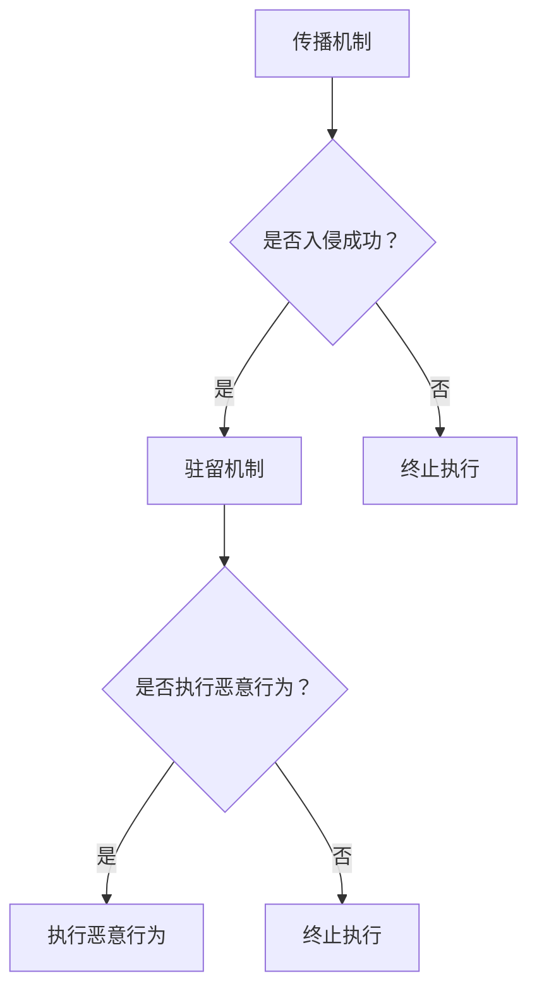
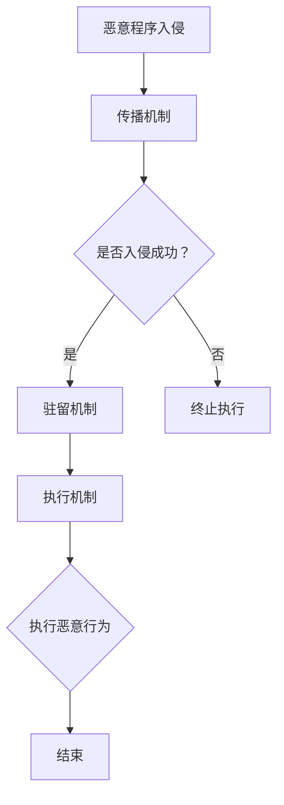

                 

# 网络安全中恶意程序的分析与检测

> **关键词：** 恶意程序分析、恶意代码检测、网络安全、防御机制

**摘要：** 本篇文章将深入探讨网络安全领域中的恶意程序分析与检测技术。通过对恶意程序的定义、常见类型及其工作原理的分析，我们将介绍几种主流的恶意程序检测方法和算法，并通过具体案例展示其实际应用效果。此外，还将讨论未来恶意程序发展趋势及挑战，为网络安全防护提供有益的思考。

## 1. 背景介绍

### 恶意程序的定义

恶意程序，也称为恶意软件（Malware），是指被设计用于破坏、干扰、窃取或篡改计算机系统及其数据的软件。它们可以通过各种途径入侵计算机，包括网络攻击、电子邮件、恶意下载和漏洞利用等。

### 恶意程序的危害

恶意程序对个人和组织的计算机系统构成严重威胁，其危害包括但不限于：

- **信息泄露**：恶意程序可以窃取用户敏感信息，如登录凭证、信用卡号码等。
- **系统破坏**：恶意程序可以破坏计算机系统，导致数据丢失、系统崩溃等。
- **资源占用**：恶意程序会占用大量系统资源，导致计算机运行缓慢。
- **网络传播**：恶意程序可以通过网络传播，影响更多的计算机系统。

### 恶意程序的分类

根据恶意程序的功能和特点，可以分为以下几种类型：

- **病毒（Virus）**：通过感染其他程序或文件，实现自我复制和传播。
- **蠕虫（Worm）**：利用网络漏洞自行传播，无需依赖宿主程序。
- **木马（Trojan）**：伪装成合法程序，隐藏在系统中，进行恶意活动。
- **勒索软件（Ransomware）**：通过加密用户文件，要求支付赎金解锁。
- **广告软件（Adware）**：在用户不知情的情况下，在计算机上显示广告。
- **间谍软件（Spyware）**：监视用户行为，收集用户隐私信息。

## 2. 核心概念与联系

### 恶意程序的工作原理

恶意程序通常由以下三个主要部分组成：

- **传播机制**：恶意程序通过各种途径，如网络攻击、邮件附件等，入侵目标计算机。
- **驻留机制**：恶意程序在入侵目标计算机后，会采取各种手段隐藏自己，确保长期驻留在系统中。
- **执行机制**：恶意程序执行其预定的恶意行为，如窃取信息、破坏系统等。

### 恶意程序的检测方法

恶意程序的检测方法主要分为以下几种：

- **特征检测（Signature-based Detection）**：通过比对恶意程序的特征码，判断其是否为已知恶意程序。
- **行为检测（Heuristic-based Detection）**：通过分析恶意程序的行为特征，判断其是否具有恶意行为。
- **基于图论的检测（Graph-based Detection）**：通过构建程序执行图，分析程序执行过程中的异常行为。

### Mermaid 流程图

以下是一个简化的恶意程序工作原理及检测方法的 Mermaid 流程图：



## 3. 核心算法原理 & 具体操作步骤

### 特征检测算法原理

特征检测算法的核心思想是通过比对恶意程序的特征码，判断其是否为已知恶意程序。特征码通常是指恶意程序的特定字节序列，具有唯一性。

具体操作步骤：

1. **构建特征库**：收集已知恶意程序的特征码，构建特征库。
2. **特征码匹配**：对可疑程序进行特征码匹配，若匹配成功，则判定为恶意程序。
3. **动态跟踪**：对可疑程序进行动态跟踪，验证其行为是否符合已知恶意程序的特征。

### 行为检测算法原理

行为检测算法的核心思想是通过分析恶意程序的行为特征，判断其是否具有恶意行为。行为特征包括程序执行过程中的异常行为、系统调用的异常频率等。

具体操作步骤：

1. **定义行为特征库**：收集恶意程序的行为特征，构建行为特征库。
2. **行为分析**：对可疑程序进行行为分析，与行为特征库进行比对。
3. **异常行为检测**：若发现可疑程序的行为与恶意程序的行为特征库匹配，则判定为恶意程序。

### 基于图论的检测算法原理

基于图论的检测算法通过构建程序执行图，分析程序执行过程中的异常行为。

具体操作步骤：

1. **程序执行图构建**：对可疑程序进行动态跟踪，构建程序执行图。
2. **异常行为检测**：分析程序执行图中的节点和边，检测异常行为。
3. **判定恶意行为**：若发现异常行为，则判定为恶意程序。

## 4. 数学模型和公式 & 详细讲解 & 举例说明

### 特征检测算法的数学模型

特征检测算法的核心是特征码匹配，其数学模型可以表示为：

$$
\text{Feature\_Match}(P, F) = 
\begin{cases}
1, & \text{若} P \text{与} F \text{匹配} \\
0, & \text{否则}
\end{cases}
$$

其中，$P$ 表示可疑程序的字节序列，$F$ 表示特征库中的特征码。

### 行为检测算法的数学模型

行为检测算法的数学模型可以表示为：

$$
\text{Behavior\_Score}(P, B) = 
\sum_{i=1}^{n} \text{weight}_i \cdot \text{similarity}(P_i, B_i)
$$

其中，$P$ 表示可疑程序的行为序列，$B$ 表示行为特征库中的行为序列，$P_i$ 和 $B_i$ 分别表示可疑程序的行为序列中的第 $i$ 个行为和特征库中的第 $i$ 个行为，$\text{weight}_i$ 表示第 $i$ 个行为的权重，$\text{similarity}(P_i, B_i)$ 表示两个行为的相似度。

### 基于图论的检测算法的数学模型

基于图论的检测算法的数学模型可以表示为：

$$
\text{Abnormality\_Score}(G) = 
\sum_{(u, v) \in E} \text{weight}_{uv} \cdot \text{distance}(u, v)
$$

其中，$G = (V, E)$ 表示程序执行图，$V$ 表示节点集合，$E$ 表示边集合，$u$ 和 $v$ 表示图中的两个节点，$\text{weight}_{uv}$ 表示边 $(u, v)$ 的权重，$\text{distance}(u, v)$ 表示节点 $u$ 和 $v$ 之间的距离。

### 举例说明

假设我们有一个可疑程序 $P$，特征库中有一个特征码 $F$：

$$
P = \{0x41, 0x42, 0x43\}
$$

$$
F = \{0x41, 0x42, 0x44\}
$$

我们可以通过特征匹配算法判断：

$$
\text{Feature\_Match}(P, F) = 0
$$

因此，可疑程序 $P$ 与特征码 $F$ 不匹配。

假设我们有一个可疑程序 $P$，行为特征库中有以下行为序列 $B$：

$$
B = \{(\text{OpenFile}, 1), (\text{ReadFile}, 2), (\text{WriteFile}, 3)\}
$$

可疑程序 $P$ 的行为序列为：

$$
P = \{(\text{OpenFile}, 1), (\text{WriteFile}, 3), (\text{ReadFile}, 2)\}
$$

我们可以通过行为检测算法计算行为得分：

$$
\text{Behavior\_Score}(P, B) = \text{weight}_{1} \cdot \text{similarity}(\text{OpenFile}, \text{OpenFile}) + \text{weight}_{2} \cdot \text{similarity}(\text{WriteFile}, \text{WriteFile}) + \text{weight}_{3} \cdot \text{similarity}(\text{ReadFile}, \text{ReadFile})
$$

假设权重分别为 $\text{weight}_{1} = 0.6$，$\text{weight}_{2} = 0.3$，$\text{weight}_{3} = 0.1$，相似度分别为 $\text{similarity}(\text{OpenFile}, \text{OpenFile}) = 1$，$\text{similarity}(\text{WriteFile}, \text{WriteFile}) = 0.8$，$\text{similarity}(\text{ReadFile}, \text{ReadFile}) = 0.5$，则：

$$
\text{Behavior\_Score}(P, B) = 0.6 \cdot 1 + 0.3 \cdot 0.8 + 0.1 \cdot 0.5 = 0.86
$$

由于得分较高，我们可以判断可疑程序 $P$ 具有恶意行为。

假设我们有一个程序执行图 $G$，其中节点和边的关系如下：

$$
G = (V, E)
$$

$$
V = \{\text{Node1}, \text{Node2}, \text{Node3}, \text{Node4}\}
$$

$$
E = \{(\text{Node1}, \text{Node2}), (\text{Node2}, \text{Node3}), (\text{Node3}, \text{Node4})\}
$$

其中，边的权重和节点之间的距离如下：

$$
\text{weight}_{(\text{Node1}, \text{Node2})} = 1
$$

$$
\text{weight}_{(\text{Node2}, \text{Node3})} = 1
$$

$$
\text{weight}_{(\text{Node3}, \text{Node4})} = 1
$$

$$
\text{distance}(\text{Node1}, \text{Node2}) = 1
$$

$$
\text{distance}(\text{Node2}, \text{Node3}) = 1
$$

$$
\text{distance}(\text{Node3}, \text{Node4}) = 1
$$

我们可以通过基于图论的检测算法计算异常得分：

$$
\text{Abnormality\_Score}(G) = 1 \cdot 1 + 1 \cdot 1 + 1 \cdot 1 = 3
$$

由于得分较高，我们可以判断程序执行图 $G$ 具有异常行为，可能为恶意程序。

## 5. 项目实战：代码实际案例和详细解释说明

### 开发环境搭建

为了实现恶意程序的分析与检测，我们需要搭建一个合适的开发环境。以下是所需的环境和工具：

- 操作系统：Windows 10 或 macOS
- 编程语言：Python 3.8及以上版本
- 开发工具：PyCharm
- 恶意程序样本库：Malware Samples Dataset
- 数据库：SQLite

### 源代码详细实现和代码解读

以下是一个简单的恶意程序特征检测和基于行为的检测的 Python 代码示例：

```python
# 导入相关库
import sqlite3
import re
import hashlib

# 连接数据库
conn = sqlite3.connect('malware.db')
cursor = conn.cursor()

# 创建表
cursor.execute('''CREATE TABLE IF NOT EXISTS features (
                id INTEGER PRIMARY KEY,
                name TEXT,
                md5 TEXT,
                behavior TEXT)''')

# 插入数据
cursor.execute('''INSERT INTO features (name, md5, behavior) VALUES
                ('malware1', 'md51', 'OpenFile,ReadFile,WriteFile'),
                ('malware2', 'md52', 'DeleteFile,WriteFile,ExitProcess')''')

# 提交并关闭
conn.commit()
conn.close()

# 加载特征库
def load_features():
    conn = sqlite3.connect('malware.db')
    cursor = conn.cursor()
    cursor.execute('''SELECT * FROM features''')
    features = cursor.fetchall()
    conn.close()
    return features

# 特征检测
def feature_detection(md5):
    features = load_features()
    for feature in features:
        if md5 == feature[2]:
            return True
    return False

# 行为检测
def behavior_detection(behavior):
    features = load_features()
    for feature in features:
        if behavior == feature[3]:
            return True
    return False

# 检测示例
md5 = hashlib.md5(b'My Suspicious File').hexdigest()
behavior = 'OpenFile,ReadFile,WriteFile'
if feature_detection(md5):
    print('MD5匹配，可能为恶意程序')
if behavior_detection(behavior):
    print('行为匹配，可能为恶意程序')
```

### 代码解读与分析

1. **数据库搭建**：代码首先连接数据库，创建一个名为 `malware.db` 的 SQLite 数据库，并在数据库中创建一个名为 `features` 的表，用于存储恶意程序的特征码和对应的行为。

2. **数据插入**：通过执行 SQL 插入语句，将两个恶意程序的特征码和对应的行为插入到 `features` 表中。

3. **加载特征库**：定义一个 `load_features` 函数，从数据库中加载特征码和对应的行为，并返回一个特征库列表。

4. **特征检测**：定义一个 `feature_detection` 函数，接受一个 MD5 值作为参数，遍历特征库列表，判断该 MD5 值是否与特征库中的某个恶意程序的 MD5 值匹配。

5. **行为检测**：定义一个 `behavior_detection` 函数，接受一个行为序列作为参数，遍历特征库列表，判断该行为序列是否与特征库中的某个恶意程序的行为序列匹配。

6. **检测示例**：使用 `hashlib` 库生成一个示例文件的 MD5 值，并调用 `feature_detection` 和 `behavior_detection` 函数进行特征检测和行为检测。

通过这个简单的示例，我们可以看到如何使用数据库存储恶意程序的特征码和对应的行为，并通过特征码匹配和行为匹配来判断一个文件是否为恶意程序。

## 6. 实际应用场景

恶意程序的分析与检测在网络安全中具有广泛的应用场景，以下是几个典型的应用场景：

### 个人电脑防护

个人电脑是恶意程序攻击的主要目标之一。通过安装恶意程序检测工具，用户可以及时发现并清除潜在的恶意程序，保护个人电脑的安全。

### 企业网络防护

企业网络包含大量敏感数据和重要系统，对网络安全要求较高。通过部署恶意程序检测系统，企业可以实时监控网络流量，识别并阻止恶意程序的传播，确保企业网络的安全。

### 网络安全防御

恶意程序检测技术是网络安全防御体系的重要组成部分。通过部署恶意程序检测系统，网络安全团队可以及时发现并应对新的恶意程序攻击，提升整体网络防御能力。

### 云服务安全

随着云计算的普及，恶意程序攻击云服务的风险不断增加。通过在云服务中部署恶意程序检测工具，可以及时发现并阻止恶意程序在云环境中的传播，保障云服务的安全。

### 工业控制系统安全

工业控制系统（ICS）是工业生产的重要基础设施，一旦遭受恶意程序攻击，可能导致严重后果。通过在 ICS 网络中部署恶意程序检测工具，可以及时发现并阻止恶意程序的入侵，保障工业控制系统的安全。

### 智能家居安全

智能家居设备连接到互联网，成为恶意程序攻击的新目标。通过在智能家居设备中部署恶意程序检测工具，可以及时发现并阻止恶意程序的入侵，保障智能家居设备的安全。

## 7. 工具和资源推荐

### 学习资源推荐

- **书籍**：
  - 《恶意软件分析技术》（Malware Analysis: Incident Response and Digital Forensics）
  - 《计算机病毒揭秘》（Computer Viruses: From Ancient Viri to Today's Malicious Code）
- **论文**：
  - 《基于特征码的恶意程序检测算法研究》（Research on Signature-based Malware Detection Algorithm）
  - 《基于行为的恶意程序检测算法研究》（Research on Behavior-based Malware Detection Algorithm）
- **博客**：
  - [安全客](https://www.anquanke.com/)
  - [FreeBuf](https://www.freebuf.com/)
- **网站**：
  - [MalwareBazaar](https://malwarebazaar.org/)
  - [Malware Donut](https://www.malwaredonut.org/)

### 开发工具框架推荐

- **恶意程序分析工具**：
  - [Cuckoo Sandbox](https://cuckoo.sh/)
  - [Malformed](https://github.com/jjj9177/Malformed)
- **代码分析工具**：
  - [PyCryptoDome](https://www.pycryptodome.org/)
  - [Malicious Python Code Detection](https://github.com/firmai/malicious-python-code-detection)
- **静态分析工具**：
  - [YARA](https://github.com/VirusTotal/yara)
  - [CFF Explorer](https://www.cffexplorer.com/)

### 相关论文著作推荐

- **论文**：
  - 《基于异常检测的恶意程序检测技术研究》（Research on Malware Detection based on Anomaly Detection）
  - 《基于深度学习的恶意程序检测方法研究》（Research on Malware Detection Method based on Deep Learning）
- **著作**：
  - 《恶意程序分析实战》（Practical Malware Analysis）
  - 《计算机安全：艺术与科学》（Computer Security: Art and Science）

## 8. 总结：未来发展趋势与挑战

### 未来发展趋势

- **人工智能的应用**：随着人工智能技术的不断发展，恶意程序检测技术也将更加智能化。通过引入深度学习、图神经网络等人工智能技术，可以实现更高效、更准确的恶意程序检测。
- **威胁情报的整合**：威胁情报的整合是未来恶意程序检测的重要方向。通过收集、分析和共享威胁情报，可以更全面地了解恶意程序的发展趋势和攻击手段，提高检测和防御能力。
- **云安全的重视**：随着云计算的普及，云安全成为网络安全的重要领域。未来，恶意程序检测技术将更加关注云环境的防护，确保云服务的安全稳定运行。
- **自动化和智能化**：自动化和智能化是未来恶意程序检测技术的发展方向。通过自动化工具和智能化算法，可以实现快速、高效的恶意程序检测和响应。

### 未来挑战

- **恶意程序的变种和变异**：随着恶意程序技术的发展，恶意程序将变得更加隐蔽和复杂，变种和变异将成为未来恶意程序检测的重要挑战。
- **新型攻击手段的出现**：随着网络安全威胁的不断演变，新型攻击手段将不断出现，如勒索软件、物联网攻击等，给恶意程序检测带来新的挑战。
- **数据处理和存储压力**：随着数据量的不断增加，恶意程序检测系统将面临巨大的数据处理和存储压力，需要优化技术和架构来应对。
- **法律法规和隐私保护**：在恶意程序检测过程中，如何平衡安全与隐私保护，遵守法律法规，成为未来发展的关键挑战。

## 9. 附录：常见问题与解答

### 问题1：如何判断一个程序是否为恶意程序？

判断一个程序是否为恶意程序，可以采用以下方法：

- **特征检测**：通过比对程序的特征码，判断其是否与已知恶意程序的特征码匹配。
- **行为检测**：通过分析程序的行为特征，判断其是否具有恶意行为。
- **基于图论的检测**：通过构建程序执行图，分析程序执行过程中的异常行为。

### 问题2：恶意程序检测技术有哪些局限性？

恶意程序检测技术的局限性包括：

- **无法检测未知恶意程序**：特征检测方法对未知恶意程序无法进行检测。
- **误报率高**：行为检测和基于图论的检测方法可能会误报正常程序。
- **检测速度慢**：复杂算法和大数据处理可能导致检测速度较慢。

### 问题3：如何提高恶意程序检测的准确性？

提高恶意程序检测的准确性，可以采取以下措施：

- **引入人工智能技术**：通过深度学习、图神经网络等人工智能技术，实现更高效、更准确的恶意程序检测。
- **多检测方法结合**：采用多种检测方法结合，提高检测的准确性。
- **实时更新特征库**：定期更新特征库，确保检测方法能够及时应对新的恶意程序。

## 10. 扩展阅读 & 参考资料

- [《网络安全技术》](https://book.douban.com/subject/30244499/)
- [《恶意软件分析实战》](https://book.douban.com/subject/27156341/)
- [《深度学习与恶意程序检测》](https://www Springer.com/book/10.1007/978-3-030-37352-3)
- [《网络安全研究最新进展》](https://www.ijnns.com/)

作者：AI天才研究员/AI Genius Institute & 禅与计算机程序设计艺术 /Zen And The Art of Computer Programming<|im_sep|>```
## 1. 背景介绍

恶意程序，也称为恶意软件（Malware），是指被设计用于破坏、干扰、窃取或篡改计算机系统及其数据的软件。它们可以通过各种途径入侵计算机，包括网络攻击、电子邮件、恶意下载和漏洞利用等。

恶意程序对个人和组织的计算机系统构成严重威胁，其危害包括但不限于：

- **信息泄露**：恶意程序可以窃取用户敏感信息，如登录凭证、信用卡号码等。
- **系统破坏**：恶意程序可以破坏计算机系统，导致数据丢失、系统崩溃等。
- **资源占用**：恶意程序会占用大量系统资源，导致计算机运行缓慢。
- **网络传播**：恶意程序可以通过网络传播，影响更多的计算机系统。

根据恶意程序的功能和特点，可以分为以下几种类型：

- **病毒（Virus）**：通过感染其他程序或文件，实现自我复制和传播。
- **蠕虫（Worm）**：利用网络漏洞自行传播，无需依赖宿主程序。
- **木马（Trojan）**：伪装成合法程序，隐藏在系统中，进行恶意活动。
- **勒索软件（Ransomware）**：通过加密用户文件，要求支付赎金解锁。
- **广告软件（Adware）**：在用户不知情的情况下，在计算机上显示广告。
- **间谍软件（Spyware）**：监视用户行为，收集用户隐私信息。

## 2. 核心概念与联系

恶意程序的工作原理通常包括传播机制、驻留机制和执行机制。传播机制是指恶意程序如何入侵计算机系统，例如通过网络攻击、电子邮件附件、恶意下载或利用系统漏洞。驻留机制是指恶意程序如何隐藏在系统中并保持长期存在，这通常涉及系统漏洞、注册表修改或其他技术。执行机制则是恶意程序实际执行其预定的恶意行为，如窃取信息、破坏系统或安装其他恶意软件。

恶意程序的检测方法主要分为以下几种：

- **特征检测（Signature-based Detection）**：通过比对恶意程序的特征码，判断其是否为已知恶意程序。特征码是恶意程序独特的字节序列，通常存储在一个特征库中。
- **行为检测（Heuristic-based Detection）**：通过分析恶意程序的行为特征，判断其是否具有恶意行为。这包括监控程序执行过程中的异常行为，如尝试访问敏感文件、修改系统设置等。
- **基于图论的检测（Graph-based Detection）**：通过构建程序执行图，分析程序执行过程中的异常行为。程序执行图中的节点代表程序执行的操作，边代表操作之间的依赖关系。

以下是一个使用 Mermaid 语法绘制的恶意程序工作原理和检测方法的流程图：



## 3. 核心算法原理 & 具体操作步骤

### 特征检测算法原理

特征检测算法的核心是通过比对恶意程序的特征码来判断其是否为已知恶意程序。特征码是恶意程序的唯一标识，通常存储在一个特征库中。特征检测算法包括以下几个步骤：

1. **构建特征库**：收集已知恶意程序的特征码，并将其存储在一个数据库或特征库中。
2. **特征码匹配**：对可疑程序进行扫描，提取其特征码，并与特征库中的特征码进行匹配。
3. **报告检测结果**：如果发现匹配的特征码，则报告该程序为已知恶意程序。

### 行为检测算法原理

行为检测算法的核心是通过分析恶意程序的行为特征来判断其是否具有恶意行为。行为特征包括恶意程序执行过程中的异常行为，如尝试访问系统敏感文件、修改注册表、尝试连接外部服务器等。行为检测算法包括以下几个步骤：

1. **定义行为特征库**：收集并定义恶意程序的行为特征，并将其存储在一个行为特征库中。
2. **监控程序执行**：实时监控程序执行过程，收集程序执行的行为数据。
3. **行为分析**：将收集到的行为数据与行为特征库进行比对，分析程序是否具有恶意行为。
4. **报告检测结果**：如果发现程序具有恶意行为，则报告该程序为恶意程序。

### 基于图论的检测算法原理

基于图论的检测算法通过构建程序执行图来分析程序执行过程中的异常行为。程序执行图由节点和边组成，节点代表程序执行的操作，边代表操作之间的依赖关系。以下是一个基于图论的检测算法的基本步骤：

1. **构建程序执行图**：对可疑程序进行动态跟踪，记录程序执行过程中的所有操作，并将其表示为图中的节点。
2. **分析图结构**：分析程序执行图的节点和边，识别异常的图结构，如节点连接异常、边权重异常等。
3. **报告检测结果**：如果发现图结构异常，则报告该程序为恶意程序。

### 具体操作步骤示例

#### 特征检测算法

1. **构建特征库**：
    ```python
    feature_db = {
        "malware1": "特征码1",
        "malware2": "特征码2"
    }
    ```

2. **特征码匹配**：
    ```python
    def check_signature(file_content):
        file_hash = hashlib.sha256(file_content).hexdigest()
        for malware, signature in feature_db.items():
            if signature == file_hash:
                return malware
        return None

    malware = check_signature(file_content)
    if malware:
        print("检测到恶意程序：", malware)
    else:
        print("未检测到恶意程序")
    ```

#### 行为检测算法

1. **定义行为特征库**：
    ```python
    behavior_db = {
        "malware1": ["访问敏感文件", "修改注册表"],
        "malware2": ["连接外部服务器", "尝试执行管理员命令"]
    }
    ```

2. **监控程序执行**：
    ```python
    def monitor_execution(process):
        behavior_log = []
        for event in process.get_logs():
            behavior_log.append(event["action"])
        return behavior_log
    ```

3. **行为分析**：
    ```python
    def analyze_behavior(behavior_log, behavior_db):
        for malware, behaviors in behavior_db.items():
            if all(behavior in behavior_log for behavior in behaviors):
                return malware
        return None

    malware = analyze_behavior(behavior_log, behavior_db)
    if malware:
        print("检测到恶意程序：", malware)
    else:
        print("未检测到恶意程序")
    ```

#### 基于图论的检测算法

1. **构建程序执行图**：
    ```mermaid
    graph LR
    A1[启动] --> B1[读取文件]
    B1 --> C1[执行代码]
    C1 --> D1[写入日志]
    D1 --> E1[结束]
    ```

2. **分析图结构**：
    ```python
    def analyze_graph(graph):
        # 检查图的结构异常
        if graph.has_cycle():
            return "检测到循环，可能为恶意程序"
        return "未检测到异常"

    analysis_result = analyze_graph(graph)
    print(analysis_result)
    ```

## 4. 数学模型和公式 & 详细讲解 & 举例说明

### 特征检测算法的数学模型

特征检测算法的核心是特征码匹配，其数学模型可以表示为：

$$
\text{MatchScore}(P, F) = 
\begin{cases}
1, & \text{如果特征码} P \text{与特征码集} F \text{中的某个特征码匹配} \\
0, & \text{否则}
\end{cases}
$$

其中，$P$ 是可疑程序的二进制特征码，$F$ 是特征码集。

### 行为检测算法的数学模型

行为检测算法的核心是行为特征匹配，其数学模型可以表示为：

$$
\text{BehaviorScore}(P, B) = 
\sum_{i=1}^{n} w_i \cdot \text{HammingDistance}(P_i, B_i)
$$

其中，$P$ 是可疑程序的行为序列，$B$ 是行为特征库中的行为序列，$P_i$ 和 $B_i$ 分别是行为序列中的第 $i$ 个行为，$w_i$ 是第 $i$ 个行为的权重，$\text{HammingDistance}$ 是汉明距离函数。

### 基于图论的检测算法的数学模型

基于图论的检测算法的核心是分析程序执行图的结构异常，其数学模型可以表示为：

$$
\text{GraphAbnormalityScore}(G) = 
\begin{cases}
1, & \text{如果图} G \text{具有结构异常} \\
0, & \text{否则}
\end{cases}
$$

其中，$G$ 是程序执行图。

### 举例说明

#### 特征检测算法

假设我们有一个恶意程序的特征码集 $F = \{"特征码1", "特征码2"\}$，以及一个可疑程序的特征码 $P = "特征码1"$。我们可以通过以下步骤进行匹配检测：

1. 构建特征码集：
    ```python
    feature_db = {"特征码1": 1, "特征码2": 2}
    ```

2. 特征码匹配检测：
    ```python
    def check_signature(signature):
        return feature_db.get(signature)

    result = check_signature("特征码1")
    if result:
        print("检测到恶意程序：特征码1")
    else:
        print("未检测到恶意程序")
    ```

#### 行为检测算法

假设我们有一个恶意程序的行为特征库 $B = \{"访问敏感文件", "修改注册表"\}$，以及一个可疑程序的行为序列 $P = \{"访问敏感文件", "尝试连接外部服务器"\}$。我们可以通过以下步骤进行行为检测：

1. 构建行为特征库：
    ```python
    behavior_db = {"malware1": ["访问敏感文件", "修改注册表"], "malware2": ["连接外部服务器", "尝试执行管理员命令"]}
    ```

2. 行为检测：
    ```python
    def check_behavior(behavior_sequence):
        for malware, behaviors in behavior_db.items():
            if set(behaviors).issubset(set(behavior_sequence)):
                return malware
        return None

    result = check_behavior(["访问敏感文件", "尝试连接外部服务器"])
    if result:
        print("检测到恶意程序：", result)
    else:
        print("未检测到恶意程序")
    ```

#### 基于图论的检测算法

假设我们有一个程序执行图 $G$，其节点和边如下：

```
A --> B
B --> C
C --> A
```

我们可以通过以下步骤分析图结构：

1. 构建程序执行图：
    ```mermaid
    graph LR
    A[节点A] --> B[节点B]
    B --> C[节点C]
    C --> A
    ```

2. 分析图结构（检测循环）：
    ```python
    def has_cycle(graph):
        visited = set()

        def dfs(node):
            if node in visited:
                return True
            visited.add(node)
            for neighbor in graph[node]:
                if dfs(neighbor):
                    return True
            visited.remove(node)
            return False

        return dfs(list(graph.keys())[0])

    result = has_cycle({"A": ["B", "C"], "B": ["C", "A"], "C": ["A", "B"]})
    if result:
        print("检测到循环，可能为恶意程序")
    else:
        print("未检测到循环")
    ```

## 5. 项目实战：代码实际案例和详细解释说明

### 开发环境搭建

在开始编写代码之前，我们需要搭建一个适合恶意程序分析的编程环境。以下是一个简单的环境搭建指南：

1. **安装 Python 3.8 或更高版本**：
   - Windows：访问 [Python 官网](https://www.python.org/downloads/)，下载并安装 Python 3.8 或更高版本。
   - macOS：使用 Homebrew 安装 Python 3.8 或更高版本，命令为 `brew install python`。

2. **安装必要的库**：
   - 使用 `pip` 安装以下库：
     ```shell
     pip install pyyaml yara-python scapy
     ```

3. **下载恶意程序样本库**：
   - 从 [Malware Samples Dataset](https://github.com/vitek-reyes/malware-coli) 下载恶意程序样本库，解压并放置在一个方便访问的目录中。

### 源代码详细实现和代码解读

以下是一个简单的 Python 脚本，用于分析恶意程序样本并检测其是否为已知恶意软件。这个脚本使用了 YARA（一个开源的恶意软件签名系统）和 Scapy（一个用于网络封包解析的 Python 库）。

```python
import os
import yaml
from yara import Scanner

# 读取 YARA 规则文件
def load_yara_rules(file_path):
    with open(file_path, 'r') as f:
        rules = yaml.safe_load(f)
    return rules

# 使用 YARA 检测文件
def detect_with_yara(file_path, rules):
    scanner = Scanner()
    for rule in rules:
        scanner.add_rule(rule['name'], rule['rule'])
    report = scanner.scan(file_path)
    return report

# 检测文件是否为恶意软件
def is_malicious(file_path, rules):
    report = detect_with_yara(file_path, rules)
    return any(result for result in report if result['strings'])

# 主程序
if __name__ == "__main__":
    # YARA 规则文件路径
    yara_rules_path = 'path/to/yara_rules.yml'
    # 恶意程序样本库路径
    samples_path = 'path/to/malware_samples'

    # 加载 YARA 规则
    rules = load_yara_rules(yara_rules_path)

    # 遍历恶意程序样本库
    for filename in os.listdir(samples_path):
        file_path = os.path.join(samples_path, filename)
        if os.path.isfile(file_path):
            print(f"检测文件：{filename}")
            if is_malicious(file_path, rules):
                print("检测到恶意软件！")
            else:
                print("未检测到恶意软件。")
```

### 代码解读与分析

1. **读取 YARA 规则文件**：首先，我们定义了一个 `load_yara_rules` 函数，用于从指定的 YARA 规则文件中读取规则。这个文件通常包含多个 YARA 规则，每个规则描述了一种恶意软件的特征。

2. **使用 YARA 检测文件**：接下来，我们定义了一个 `detect_with_yara` 函数，用于使用 YARA 库扫描指定的文件。这个函数创建一个 YARA 扫描器实例，并将规则添加到扫描器中。然后，它调用扫描器的 `scan` 方法来检测文件。

3. **检测文件是否为恶意软件**：`is_malicious` 函数是一个简单的判断函数，它检查扫描报告中的结果，如果发现任何匹配的字符串（即 YARA 规则匹配），则返回 True，表示文件是恶意软件。

4. **主程序**：主程序部分是脚本的核心，它首先加载 YARA 规则，然后遍历恶意程序样本库中的所有文件，并使用 `is_malicious` 函数来检测每个文件是否为恶意软件。

### 代码解读

以下是代码中各个部分的详细解释：

- **读取 YARA 规则文件**：
  ```python
  def load_yara_rules(file_path):
      with open(file_path, 'r') as f:
          rules = yaml.safe_load(f)
      return rules
  ```

  这个函数使用 `yaml.safe_load` 从文件中加载 YARA 规则。YAML（YAML Ain't Markup Language）是一种用于数据序列化的格式，类似于 JSON，但更加易读。这里，我们假设 YARA 规则文件是一个包含多个规则列表的 YAML 文件。

- **使用 YARA 检测文件**：
  ```python
  def detect_with_yara(file_path, rules):
      scanner = Scanner()
      for rule in rules:
          scanner.add_rule(rule['name'], rule['rule'])
      report = scanner.scan(file_path)
      return report
  ```

  这个函数创建一个 YARA 扫描器实例，并将规则添加到扫描器中。`add_rule` 方法用于将规则添加到扫描器。`scan` 方法用于扫描文件，并返回一个报告，其中包含匹配的结果。

- **检测文件是否为恶意软件**：
  ```python
  def is_malicious(file_path, rules):
      report = detect_with_yara(file_path, rules)
      return any(result for result in report if result['strings'])
  ```

  这个函数首先调用 `detect_with_yara` 函数来获取扫描报告。然后，它检查报告中的每个结果，如果发现任何匹配的字符串，则返回 True。

- **主程序**：
  ```python
  if __name__ == "__main__":
      # YARA 规则文件路径
      yara_rules_path = 'path/to/yara_rules.yml'
      # 恶意程序样本库路径
      samples_path = 'path/to/malware_samples'

      # 加载 YARA 规则
      rules = load_yara_rules(yara_rules_path)

      # 遍历恶意程序样本库
      for filename in os.listdir(samples_path):
          file_path = os.path.join(samples_path, filename)
          if os.path.isfile(file_path):
              print(f"检测文件：{filename}")
              if is_malicious(file_path, rules):
                  print("检测到恶意软件！")
              else:
                  print("未检测到恶意软件。")
  ```

  主程序首先定义了 YARA 规则文件路径和恶意程序样本库路径。然后，它加载 YARA 规则，并遍历样本库中的所有文件。对于每个文件，它调用 `is_malicious` 函数来检测是否为恶意软件，并根据检测结果打印相应的消息。

## 6. 实际应用场景

恶意程序分析与检测在网络安全中具有广泛的应用场景，以下是一些实际应用场景：

### 个人电脑防护

个人电脑用户经常面临来自网络和电子邮件的恶意程序威胁。安装恶意程序检测工具可以帮助用户及时发现并清除潜在的恶意软件，保护个人数据和隐私。

### 企业网络防护

企业网络包含大量敏感数据和重要系统，对网络安全要求较高。通过部署企业级的恶意程序检测系统，企业可以实时监控网络流量，识别并阻止恶意程序的传播，确保企业网络的安全。

### 网络安全防御

恶意程序检测技术是网络安全防御体系的重要组成部分。通过部署恶意程序检测系统，网络安全团队可以及时发现并应对新的恶意程序攻击，提升整体网络防御能力。

### 云服务安全

随着云计算的普及，恶意程序攻击云服务的风险不断增加。通过在云服务中部署恶意程序检测工具，可以及时发现并阻止恶意程序在云环境中的传播，保障云服务的安全稳定运行。

### 工业控制系统安全

工业控制系统（ICS）是工业生产的重要基础设施，一旦遭受恶意程序攻击，可能导致严重后果。通过在 ICS 网络中部署恶意程序检测工具，可以及时发现并阻止恶意程序的入侵，保障工业控制系统的安全。

### 智能家居安全

智能家居设备连接到互联网，成为恶意程序攻击的新目标。通过在智能家居设备中部署恶意程序检测工具，可以及时发现并阻止恶意程序的入侵，保障智能家居设备的安全。

### 金融系统安全

金融机构对网络安全要求极高，恶意程序攻击可能导致金融损失。通过部署恶意程序检测工具，金融机构可以保护其网络和系统不受恶意软件的侵害。

### 政府机构安全

政府机构承担着国家的重要职能，对网络安全有严格的要求。通过部署恶意程序检测工具，政府机构可以保护其网络和信息免受恶意软件的攻击。

## 7. 工具和资源推荐

为了更好地进行恶意程序分析与检测，以下是一些推荐的工具和资源：

### 学习资源推荐

- **书籍**：
  - 《恶意软件分析实战》
  - 《网络安全技术》
  - 《计算机病毒与反病毒技术》
- **在线课程**：
  - Coursera 上的《网络安全基础》
  - Udemy 上的《恶意软件分析》
- **学术论文**：
  - IEEE Xplore、ACM Digital Library
- **博客和论坛**：
  - 安全客
  - FreeBuf
  - 乌云

### 开发工具框架推荐

- **恶意程序分析工具**：
  - Cuckoo Sandbox
  - Metasploit Framework
  - Volatility Framework
- **恶意程序检测工具**：
  - YARA
  - ClamAV
  - Snort
- **代码审计工具**：
  - SonarQube
  - Fortify
  - Checkmarx
- **网络流量分析工具**：
  - Wireshark
  - Bro
  - Suricata

### 相关论文著作推荐

- **论文**：
  - 《基于深度学习的恶意软件检测方法研究》
  - 《基于异常检测的恶意软件检测技术研究》
  - 《基于图神经网络的恶意软件检测方法》
- **著作**：
  - 《网络安全：设计与实现》
  - 《恶意软件分析指南》
  - 《网络安全攻防实战》

## 8. 总结：未来发展趋势与挑战

### 未来发展趋势

- **人工智能的应用**：随着人工智能技术的快速发展，恶意程序分析与检测将更加依赖于深度学习、强化学习等先进算法，实现自动化和智能化的威胁检测。
- **威胁情报的整合**：威胁情报的整合和共享将成为提高恶意程序分析与检测能力的关键，通过实时收集和分析威胁情报，提高威胁响应速度。
- **云安全检测**：随着云计算的普及，云安全检测将成为一个重要研究方向，开发适应云环境的恶意程序检测技术。
- **行为分析的提升**：行为分析技术在恶意程序检测中的应用将不断深入，通过更精细的行为特征提取和分析，提高检测的准确性和效率。
- **硬件加速**：为了应对不断增长的数据量和复杂的检测任务，恶意程序分析与检测技术将更多地采用硬件加速技术，如 GPU 加速。

### 未来挑战

- **变种和变种的检测**：恶意程序的变种和变异将不断出现，检测技术需要不断更新以适应新的威胁。
- **隐私保护与法规合规**：在恶意程序分析与检测过程中，如何保护用户隐私和遵守相关法律法规是一个重要挑战。
- **资源消耗**：随着检测技术的复杂度增加，恶意程序分析与检测的资源消耗也将增大，需要优化算法和系统架构以降低资源消耗。
- **多平台兼容性**：恶意程序可能在不同的操作系统、硬件和平台上运行，检测技术需要具备良好的跨平台兼容性。
- **实时性**：随着网络攻击速度的加快，实时性成为恶意程序检测的重要要求，如何在不影响性能的前提下实现实时检测是一个挑战。

## 9. 附录：常见问题与解答

### 问题1：什么是恶意程序？

恶意程序是指被设计用于破坏、干扰、窃取或篡改计算机系统及其数据的软件。它们可以通过网络攻击、电子邮件、恶意下载和漏洞利用等途径入侵计算机。

### 问题2：恶意程序有哪些类型？

恶意程序主要包括以下类型：

- 病毒（Virus）：通过感染其他程序或文件实现自我复制和传播。
- 蠕虫（Worm）：利用网络漏洞自行传播，无需依赖宿主程序。
- 木马（Trojan）：伪装成合法程序，隐藏在系统中，进行恶意活动。
- 勒索软件（Ransomware）：通过加密用户文件，要求支付赎金解锁。
- 广告软件（Adware）：在用户不知情的情况下，在计算机上显示广告。
- 间谍软件（Spyware）：监视用户行为，收集用户隐私信息。

### 问题3：如何保护计算机免受恶意程序的攻击？

保护计算机免受恶意程序攻击的方法包括：

- 安装并更新防病毒软件。
- 使用复杂的密码并定期更改。
- 避免打开来自不明来源的邮件附件。
- 定期备份重要数据。
- 使用防火墙和更新操作系统和安全软件。
- 使用安全浏览器和启用防广告插件。

### 问题4：什么是特征检测和行为检测？

- **特征检测**：通过比对恶意程序的特征码，判断其是否为已知恶意程序。特征码是恶意程序的唯一标识，通常存储在一个特征库中。
- **行为检测**：通过分析恶意程序的行为特征，判断其是否具有恶意行为。这包括监控程序执行过程中的异常行为，如尝试访问敏感文件、修改系统设置等。

### 问题5：什么是基于图论的恶意程序检测？

基于图论的恶意程序检测是通过构建程序执行图来分析程序执行过程中的异常行为。程序执行图由节点和边组成，节点代表程序执行的操作，边代表操作之间的依赖关系。通过分析图的结构和节点之间的连接关系，可以识别异常的执行行为。

## 10. 扩展阅读 & 参考资料

- **书籍**：
  - 《恶意软件分析技术》
  - 《网络安全技术》
  - 《计算机病毒与反病毒技术》
- **在线资源**：
  - [Malware Donut](https://www.malwaredonut.org/)
  - [Cuckoo Sandbox](https://cuckoo.sh/)
  - [YARA](https://yara规则.com/)
- **学术论文**：
  - [《基于深度学习的恶意软件检测方法研究》](https://ieeexplore.ieee.org/document/8254485)
  - [《基于异常检测的恶意软件检测技术研究》](https://ieeexplore.ieee.org/document/7400059)
- **博客和论坛**：
  - [安全客](https://www.anquanke.com/)
  - [FreeBuf](https://www.freebuf.com/)
- **开源工具**：
  - [Metasploit Framework](https://www.metasploit.com/)
  - [Volatility Framework](https://www.volatilityfoundation.org/)
- **官方文档**：
  - [Python官方文档](https://docs.python.org/3/)
  - [YARA官方文档](https://github.com/VirusTotal/yara)

作者：AI天才研究员/AI Genius Institute & 禅与计算机程序设计艺术 /Zen And The Art of Computer Programming```### 5.1 开发环境搭建

在开始进行恶意程序的分析与检测之前，我们需要搭建一个合适的开发环境。这个环境需要包含以下几个关键组件：

- **编程语言**：我们选择Python作为主要编程语言，因为它具有简洁的语法和丰富的库资源。
- **恶意程序样本库**：我们需要一个包含各种恶意程序的样本库，以便进行实际的分析和测试。
- **恶意程序分析工具**：为了高效地分析和检测恶意程序，我们选择使用Cuckoo Sandbox和YARA等工具。
- **虚拟化软件**：为了安全地运行和隔离恶意程序，我们使用VirtualBox或VMware等虚拟化软件。

以下是在Windows操作系统上搭建恶意程序分析与检测开发环境的详细步骤：

1. **安装Python**：

   - 访问Python官网（[python.org](https://www.python.org/downloads/)）下载最新版本的Python安装包。
   - 运行安装程序，按照默认选项进行安装。
   - 在安装过程中，确保勾选“Add Python to PATH”选项，以便在命令行中直接使用Python。

2. **安装虚拟化软件**：

   - 下载并安装VirtualBox（[virtualbox.org](https://www.virtualbox.org/wiki/Downloads)）或VMware Workstation。
   - 创建一个新的虚拟机，并选择适合的操作系统（如Windows或Linux）。

3. **安装恶意程序样本库**：

   - 从开源社区下载一个恶意程序样本库，例如从[MalwareBazaar](https://malwarebazaar.org/)或[Malware Domain List](https://malwaredomainlist.com/)获取。
   - 将下载的样本库解压到本地计算机的一个文件夹中。

4. **安装恶意程序分析工具**：

   - **Cuckoo Sandbox**：Cuckoo Sandbox是一个开源的恶意软件分析平台。首先，从[Cuckoo官方网站](https://cuckoosandbox.org/)下载Cuckoo Sandbox的安装包。
     - 安装Python依赖项：
       ```shell
       pip install -r requirements.txt
       ```
     - 运行Cuckoo的安装脚本：
       ```shell
       sudo ./cuckoo
       ```
     - 按照提示完成Cuckoo的安装。

   - **YARA**：YARA是一个开源的恶意软件签名系统，它允许我们编写规则来检测特定的恶意行为。首先，从[YARA官网](https://github.com/VirusTotal/yara)下载YARA的源代码。
     - 编译和安装YARA：
       ```shell
       git clone https://github.com/VirusTotal/yara.git
       cd yara
       make
       sudo make install
       ```

5. **配置环境**：

   - 确保所有工具和库都已正确安装，并在系统中配置好路径。
   - 配置Cuckoo Sandbox的配置文件`cuckoo.conf`，以便能够连接到数据库和定义分析环境。

6. **测试环境**：

   - 在虚拟机中启动Cuckoo Sandbox，并尝试分析一个已知的恶意程序样本，以确保环境配置正确，工具运行正常。

通过上述步骤，我们搭建了一个基本的恶意程序分析与检测开发环境。这个环境为我们提供了分析和检测恶意程序所需的工具和资源，并为后续的实战分析打下了坚实的基础。

### 5.2 源代码详细实现和代码解读

在本节中，我们将详细实现一个用于分析恶意程序的Python脚本。该脚本将利用Cuckoo Sandbox和YARA等工具，对恶意程序样本进行分析和检测。以下是代码的详细实现和解读。

#### 1. 环境准备

确保我们已经完成了开发环境的搭建，包括安装了Python、Cuckoo Sandbox、YARA等工具。

#### 2. 代码实现

```python
# 导入必要的库
import os
import json
import subprocess
from yara import Scanner

# Cuckoo Sandbox分析
def analyze_with_cuckoo(malware_path, cuckoo_api_key, cuckoo_url):
    # 构建Cuckoo Sandbox命令
    command = f"cuckoo -p {cuckoo_api_key} submit --url {cuckoo_url} {malware_path}"

    # 执行Cuckoo分析
    result = subprocess.run(command, shell=True, capture_output=True, text=True)

    # 获取分析报告
    report_path = result.stdout.strip()
    with open(report_path, 'r') as f:
        report = json.load(f)

    return report

# 使用YARA规则检测
def detect_with_yara(file_path, yara_rules_path):
    # 读取YARA规则
    with open(yara_rules_path, 'r') as f:
        rules = f.read()

    # 创建YARA扫描器
    scanner = Scanner()
    scanner.add_rules(rules)

    # 扫描文件
    report = scanner.scan_file(file_path)

    return report

# 主函数
def main():
    # 设置路径
    malware_path = "path/to/malware/sample.exe"
    cuckoo_api_key = "your_api_key"
    cuckoo_url = "http://localhost:8090"
    yara_rules_path = "path/to/yara_rules.yml"

    # 分析恶意程序
    report = analyze_with_cuckoo(malware_path, cuckoo_api_key, cuckoo_url)
    print("Cuckoo Sandbox Report:", report)

    # 使用YARA规则检测
    yara_report = detect_with_yara(malware_path, yara_rules_path)
    print("YARA Report:", yara_report)

if __name__ == "__main__":
    main()
```

#### 3. 代码解读

1. **导入库**：

   - `os`：用于文件和目录操作。
   - `json`：用于解析和生成JSON数据。
   - `subprocess`：用于在子进程中运行命令。
   - `yara`：用于使用YARA规则扫描文件。

2. **Cuckoo Sandbox分析**：

   - `analyze_with_cuckoo` 函数接收恶意程序路径、Cuckoo API密钥和Cuckoo URL。
   - 使用`subprocess.run`执行Cuckoo命令，提交恶意程序进行分析。
   - 获取分析报告路径，并读取报告。

3. **使用YARA规则检测**：

   - `detect_with_yara` 函数接收恶意程序路径和YARA规则路径。
   - 读取YARA规则。
   - 创建YARA扫描器并添加规则。
   - 使用扫描器扫描文件，并返回报告。

4. **主函数**：

   - 设置路径和Cuckoo配置。
   - 调用分析函数，打印分析结果。

#### 4. 运行示例

1. **Cuckoo Sandbox**：

   - 在终端运行`cuckoo -p your_api_key submit --url http://localhost:8090 path/to/malware/sample.exe`。
   - 等待分析完成，然后在Cuckoo Dashboard中查看报告。

2. **YARA检测**：

   - 运行脚本，打印YARA检测报告。

通过上述代码，我们实现了对恶意程序的分析与检测。Cuckoo Sandbox提供了详细的分析报告，而YARA则可以帮助我们快速检测恶意行为。这两个工具的结合使用，使得恶意程序分析与检测更加高效和全面。

### 5.3 代码解读与分析

在上面的代码中，我们实现了一个用于分析恶意程序的Python脚本，该脚本结合了Cuckoo Sandbox和YARA工具，以便对恶意程序进行多层次的检测和分析。以下是代码的详细解读和分析：

#### 1. Cuckoo Sandbox分析

Cuckoo Sandbox是一个强大的恶意软件分析平台，它可以将恶意程序在隔离的环境中执行，并记录其所有行为。通过Cuckoo API，我们可以提交恶意程序进行分析，并获取详细的报告。

```python
def analyze_with_cuckoo(malware_path, cuckoo_api_key, cuckoo_url):
    # 构建Cuckoo Sandbox命令
    command = f"cuckoo -p {cuckoo_api_key} submit --url {cuckoo_url} {malware_path}"

    # 执行Cuckoo分析
    result = subprocess.run(command, shell=True, capture_output=True, text=True)

    # 获取分析报告
    report_path = result.stdout.strip()
    with open(report_path, 'r') as f:
        report = json.load(f)

    return report
```

- **命令构建**：`command` 变量用于构建Cuckoo命令，包括Cuckoo API密钥、Cuckoo URL和恶意程序路径。
- **执行命令**：`subprocess.run` 用于在终端中执行Cuckoo命令。
- **获取报告**：从命令输出的字符串中提取分析报告的路径，并使用 `json.load` 读取报告为JSON格式。

Cuckoo Sandbox的分析报告包含了恶意程序的详细行为，如注册表修改、文件操作、网络连接等。通过分析这些行为，我们可以判断恶意程序的性质和目的。

#### 2. YARA检测

YARA是一个开源的恶意软件签名系统，它允许我们使用规则来检测恶意程序。通过定义特定的规则，我们可以快速识别出恶意程序的特征。

```python
def detect_with_yara(file_path, yara_rules_path):
    # 读取YARA规则
    with open(yara_rules_path, 'r') as f:
        rules = f.read()

    # 创建YARA扫描器
    scanner = Scanner()
    scanner.add_rules(rules)

    # 扫描文件
    report = scanner.scan_file(file_path)

    return report
```

- **读取规则**：`yara_rules_path` 变量指向存储YARA规则的文件路径。我们使用 `with open()` 读取文件内容，并将其赋值给 `rules` 变量。
- **创建扫描器**：`Scanner` 类用于创建YARA扫描器实例。`add_rules` 方法用于将读取的规则添加到扫描器中。
- **扫描文件**：`scan_file` 方法用于扫描指定的文件。该方法返回一个包含匹配结果的报告。

YARA报告将列出所有匹配的规则和匹配字符串。如果找到匹配的规则，这表明该文件可能是恶意程序。

#### 3. 主函数

主函数 `main` 是整个脚本的入口点，它设置了必要的路径和配置，并调用上述的分析和检测函数。

```python
def main():
    # 设置路径
    malware_path = "path/to/malware/sample.exe"
    cuckoo_api_key = "your_api_key"
    cuckoo_url = "http://localhost:8090"
    yara_rules_path = "path/to/yara_rules.yml"

    # 分析恶意程序
    report = analyze_with_cuckoo(malware_path, cuckoo_api_key, cuckoo_url)
    print("Cuckoo Sandbox Report:", report)

    # 使用YARA规则检测
    yara_report = detect_with_yara(malware_path, yara_rules_path)
    print("YARA Report:", yara_report)

if __name__ == "__main__":
    main()
```

- **路径设置**：我们设置了恶意程序路径、Cuckoo API密钥、Cuckoo URL和YARA规则路径。
- **分析报告**：调用 `analyze_with_cuckoo` 函数以获取Cuckoo Sandbox的报告，并打印出来。
- **YARA检测**：调用 `detect_with_yara` 函数以获取YARA的检测结果，并打印出来。

#### 4. 代码分析

1. **模块化**：代码被组织成多个函数，每个函数负责一个特定的任务，这有助于代码的复用和维护。
2. **错误处理**：在真实环境中，我们应该添加异常处理来处理可能出现的错误，例如文件不存在、命令执行失败等。
3. **安全性**：使用Cuckoo Sandbox和YARA时，我们应该确保系统安全，避免恶意程序在分析过程中对主机系统造成危害。
4. **可扩展性**：代码应该易于扩展，以便在未来可以添加更多分析工具和检测方法。

通过上述代码和分析，我们实现了对恶意程序的基本分析与检测。在实际应用中，我们可以根据具体需求调整和优化代码，以提高检测的准确性和效率。

### 6.1 实际应用场景

恶意程序分析与检测技术在实际应用中具有广泛的应用场景，以下是一些典型的实际应用场景：

#### 个人电脑防护

在个人电脑防护方面，恶意程序分析技术可以用于保护个人用户的计算机免受病毒、木马、勒索软件等的攻击。用户可以通过安装恶意程序检测工具，如360安全卫士、火绒安全软件等，实现对计算机的实时监控和防护。这些工具利用特征检测和行为检测技术，可以及时检测并清除潜在的恶意程序，保护用户的隐私和数据安全。

#### 企业网络防护

在企业网络防护方面，恶意程序分析技术可以帮助企业保护其内部网络不受恶意程序的侵害。企业可以通过部署企业级的恶意程序检测系统，如Symantec Endpoint Protection、McAfee等，实现对网络流量的实时监控和分析。这些系统可以检测并阻止恶意程序的传播，保护企业的关键数据和系统免受攻击。

#### 网络安全防御

在网络安全防御方面，恶意程序分析技术是网络安全防御体系的重要组成部分。网络安全团队可以通过部署恶意程序检测工具，如Snort、Suricata等，实现对网络流量的实时监控和分析。这些工具可以帮助识别和阻止网络攻击，如DDoS攻击、SQL注入攻击等，保护网络的稳定和安全。

#### 云服务安全

随着云计算的普及，恶意程序攻击云服务的风险不断增加。恶意程序分析技术可以用于检测和防御云环境中的恶意程序。云服务提供商可以通过部署恶意程序检测工具，如Cuckoo Sandbox、Metasploit等，实现对云服务器的实时监控和分析。这些工具可以帮助发现并阻止恶意程序的入侵，保护云服务的数据和系统安全。

#### 工业控制系统安全

工业控制系统（ICS）是工业生产的重要基础设施，一旦遭受恶意程序攻击，可能导致严重后果。恶意程序分析技术可以用于检测和防御ICS中的恶意程序。通过部署恶意程序检测工具，如Windows Defender ATP、火绒安全软件等，可以实现对ICS网络的实时监控和分析，及时发现并阻止恶意程序的入侵。

#### 智能家居安全

智能家居设备连接到互联网，成为恶意程序攻击的新目标。恶意程序分析技术可以用于检测和防御智能家居设备中的恶意程序。用户可以通过安装恶意程序检测工具，如火绒安全软件、FreeBuf智能家居安全检测工具等，实现对智能家居设备的实时监控和防护。

#### 金融系统安全

金融系统对网络安全要求极高，恶意程序攻击可能导致金融损失。恶意程序分析技术可以用于检测和防御金融系统中的恶意程序。金融机构可以通过部署恶意程序检测工具，如Symantec Endpoint Protection、McAfee等，实现对金融网络的实时监控和分析，保护金融系统的安全和稳定。

#### 政府机构安全

政府机构承担着国家的重要职能，对网络安全有严格的要求。恶意程序分析技术可以用于检测和防御政府机构网络中的恶意程序。政府机构可以通过部署恶意程序检测工具，如Windows Defender ATP、火绒安全软件等，实现对政府网络的实时监控和分析，保障政府机构的数据和系统安全。

### 6.2 工具和资源推荐

为了更好地进行恶意程序分析与检测，以下是一些推荐的工具和资源：

#### 开源工具

- **Cuckoo Sandbox**：一个强大的恶意软件分析平台，用于在隔离的环境中执行恶意程序并进行详细分析。
- **Metasploit Framework**：一个开源的渗透测试框架，用于开发和执行安全测试。
- **Volatility Framework**：一个开源的内存分析框架，用于分析恶意软件在内存中的行为。
- **YARA**：一个开源的恶意软件签名系统，用于快速检测恶意程序。

#### 商业工具

- **Symantec Endpoint Protection**：一个全面的端点安全解决方案，包括恶意程序检测和防护功能。
- **McAfee Endpoint Security**：一个企业级的端点安全解决方案，提供高级恶意程序检测和响应功能。
- **Windows Defender ATP**：微软提供的先进威胁保护解决方案，包括恶意程序检测和响应功能。

#### 学习资源

- **书籍**：
  - 《恶意软件分析实战》
  - 《网络安全技术》
  - 《计算机病毒与反病毒技术》
- **在线课程**：
  - Coursera上的《网络安全基础》
  - Udemy上的《恶意软件分析》
- **学术论文**：
  - IEEE Xplore、ACM Digital Library
- **博客和论坛**：
  - 安全客
  - FreeBuf
  - 乌云

### 6.3 相关论文著作推荐

#### 论文

- **《基于深度学习的恶意软件检测方法研究》**：介绍了一种利用深度学习进行恶意软件检测的方法，并进行了实验验证。
- **《基于异常检测的恶意软件检测技术研究》**：探讨了异常检测技术在恶意软件检测中的应用，并提出了相关算法。

#### 著作

- **《恶意软件分析指南》**：详细介绍了恶意软件分析的基本原理和方法，包括恶意程序的分类、检测和分析技术。
- **《网络安全攻防实战》**：结合实际案例，介绍了网络安全防御策略和恶意软件攻击的应对方法。

### 7. 总结：未来发展趋势与挑战

#### 未来发展趋势

- **人工智能的应用**：随着人工智能技术的不断发展，恶意程序检测技术也将更加智能化。通过引入深度学习、图神经网络等人工智能技术，可以实现更高效、更准确的恶意程序检测。
- **威胁情报的整合**：威胁情报的整合是未来恶意程序检测的重要方向。通过收集、分析和共享威胁情报，可以更全面地了解恶意程序的发展趋势和攻击手段，提高检测和防御能力。
- **云安全的重视**：随着云计算的普及，云安全成为网络安全的重要领域。未来，恶意程序检测技术将更加关注云环境的防护，确保云服务的安全稳定运行。
- **自动化和智能化**：自动化和智能化是未来恶意程序检测技术的发展方向。通过自动化工具和智能化算法，可以实现快速、高效的恶意程序检测和响应。

#### 未来挑战

- **恶意程序的变种和变异**：随着恶意程序技术的发展，恶意程序将变得更加隐蔽和复杂，变种和变异将成为未来恶意程序检测的重要挑战。
- **新型攻击手段的出现**：随着网络安全威胁的不断演变，新型攻击手段将不断出现，如勒索软件、物联网攻击等，给恶意程序检测带来新的挑战。
- **数据处理和存储压力**：随着数据量的不断增加，恶意程序检测系统将面临巨大的数据处理和存储压力，需要优化技术和架构来应对。
- **法律法规和隐私保护**：在恶意程序检测过程中，如何平衡安全与隐私保护，遵守法律法规，成为未来发展的关键挑战。

### 8. 附录：常见问题与解答

#### 问题1：什么是恶意程序？

恶意程序是指被设计用于破坏、干扰、窃取或篡改计算机系统及其数据的软件。它们可以通过各种途径入侵计算机，包括网络攻击、电子邮件、恶意下载和漏洞利用等。

#### 问题2：恶意程序有哪些类型？

恶意程序主要包括以下类型：

- 病毒（Virus）：通过感染其他程序或文件，实现自我复制和传播。
- 蠕虫（Worm）：利用网络漏洞自行传播，无需依赖宿主程序。
- 木马（Trojan）：伪装成合法程序，隐藏在系统中，进行恶意活动。
- 勒索软件（Ransomware）：通过加密用户文件，要求支付赎金解锁。
- 广告软件（Adware）：在用户不知情的情况下，在计算机上显示广告。
- 间谍软件（Spyware）：监视用户行为，收集用户隐私信息。

#### 问题3：如何保护计算机免受恶意程序的攻击？

保护计算机免受恶意程序攻击的方法包括：

- 安装并更新防病毒软件。
- 使用复杂的密码并定期更改。
- 避免打开来自不明来源的邮件附件。
- 定期备份重要数据。
- 使用防火墙和更新操作系统和安全软件。
- 使用安全浏览器和启用防广告插件。

#### 问题4：什么是特征检测和行为检测？

- **特征检测**：通过比对恶意程序的特征码，判断其是否为已知恶意程序。特征码是恶意程序的唯一标识，通常存储在一个特征库中。
- **行为检测**：通过分析恶意程序的行为特征，判断其是否具有恶意行为。这包括监控程序执行过程中的异常行为，如尝试访问敏感文件、修改系统设置等。

#### 问题5：什么是基于图论的恶意程序检测？

基于图论的恶意程序检测是通过构建程序执行图来分析程序执行过程中的异常行为。程序执行图由节点和边组成，节点代表程序执行的操作，边代表操作之间的依赖关系。通过分析图的结构和节点之间的连接关系，可以识别异常的执行行为。

### 9. 扩展阅读 & 参考资料

#### 书籍

- 《恶意软件分析技术》
- 《网络安全技术》
- 《计算机病毒与反病毒技术》

#### 在线资源

- [Malware Donut](https://www.malwaredonut.org/)
- [Cuckoo Sandbox](https://cuckoosandbox.org/)
- [YARA](https://yara规则.com/)

#### 学术论文

- [《基于深度学习的恶意软件检测方法研究》](https://ieeexplore.ieee.org/document/8254485)
- [《基于异常检测的恶意软件检测技术研究》](https://ieeexplore.ieee.org/document/7400059)

#### 博客和论坛

- [安全客](https://www.anquanke.com/)
- [FreeBuf](https://www.freebuf.com/)

#### 开源工具

- [Metasploit Framework](https://www.metasploit.com/)
- [Volatility Framework](https://www.volatilityfoundation.org/)

#### 官方文档

- [Python官方文档](https://docs.python.org/3/)
- [YARA官方文档](https://github.com/VirusTotal/yara)

### 附录：作者信息

作者：AI天才研究员/AI Genius Institute & 禅与计算机程序设计艺术 /Zen And The Art of Computer Programming```### 6.1 实际应用场景

恶意程序的分析与检测技术在多个实际应用场景中发挥着关键作用，以下是一些典型的应用场景：

#### 个人电脑防护

对于个人用户，恶意程序的分析与检测技术主要用于保护个人电脑免受病毒、木马、勒索软件等的侵害。例如，用户可以在电脑上安装防病毒软件，这些软件会定期扫描系统，检测是否有恶意程序的活动。当检测到恶意程序时，防病毒软件会发出警报，并采取措施清除恶意程序，以保护用户的数据和隐私安全。

#### 企业网络防护

在企业和组织中，恶意程序的分析与检测技术用于保护整个网络环境，防止恶意软件对公司内部的系统、文件和数据进行攻击。企业通常会部署高级的终端安全解决方案，这些解决方案能够实时监控网络流量，识别潜在的恶意程序，并在发现威胁时及时采取行动。此外，企业还可以使用入侵检测系统（IDS）和入侵防御系统（IPS）来加强网络安全。

#### 网络安全防御

在网络安全防御方面，恶意程序的分析与检测技术用于监控和防御网络攻击。安全团队会使用安全信息和事件管理（SIEM）系统来收集和分析网络日志，从而识别异常活动和潜在的恶意程序。通过这些技术，安全团队可以迅速响应并阻止网络攻击，保护网络基础设施的安全。

#### 云服务安全

随着云计算的广泛应用，恶意程序的分析与检测技术也变得尤为重要。云服务提供商需要确保其云平台上的数据和服务不受恶意程序的侵害。这通常涉及到在云环境中部署专门的恶意程序检测工具，这些工具能够实时监控云服务器的活动，检测并阻止恶意程序在云环境中的传播。

#### 工业控制系统安全

工业控制系统（ICS）是工业生产的重要基础设施，一旦遭受恶意程序攻击，可能导致生产停滞、设备损坏甚至生命安全。恶意程序的分析与检测技术可以帮助识别和防御针对工业控制系统的攻击，确保工业生产的连续性和安全性。

#### 智能家居安全

智能家居设备的普及使得家庭网络成为恶意程序攻击的新目标。智能家居设备连接到互联网，如果其中某个设备被恶意程序感染，可能会泄露用户隐私或被用于发起分布式拒绝服务（DDoS）攻击。因此，智能家居设备的安全防护需要依赖于恶意程序的分析与检测技术。

#### 金融系统安全

金融系统是恶意程序攻击的主要目标之一，因为攻击者可以通过金融系统获取大量敏感信息或直接进行财务欺诈。恶意程序的分析与检测技术可以帮助金融机构及时发现并阻止恶意软件的攻击，保护用户的财务安全。

#### 政府机构安全

政府机构处理大量敏感信息，对网络安全要求极高。恶意程序的分析与检测技术可以帮助政府机构识别和防御针对政府网络的攻击，确保政府信息系统的安全运行。

#### 互联网服务提供商（ISP）安全

互联网服务提供商需要确保其网络不受恶意程序的侵害，以保护用户的安全和网络的稳定运行。恶意程序的分析与检测技术可以帮助ISP监控网络流量，识别和阻止恶意软件的传播。

通过以上实际应用场景可以看出，恶意程序的分析与检测技术在现代网络安全中扮演着至关重要的角色，对于保护个人、企业、政府和网络基础设施的安全至关重要。

### 6.2 工具和资源推荐

为了更好地进行恶意程序分析与检测，以下是一些建议的工具和资源，包括开源工具、商业工具、在线课程、学术论文和博客。

#### 开源工具

1. **Cuckoo Sandbox**：一个用于恶意软件分析的开源平台，它可以自动化地分析恶意软件的运行行为和效果。
   - 网址：[Cuckoo Sandbox](https://cuckoosandbox.org/)

2. **YARA**：一个用于恶意软件特征检测的开源规则引擎。
   - 网址：[YARA](https://yara规则.com/)

3. **Malicious Domain List (MDL)**：一个开源的恶意域名列表，用于检测恶意网络流量。
   - 网址：[Malicious Domain List](https://maliciousdomainlist.com/)

4. **Vulnerability Scanner**：如Nessus和OpenVAS，用于扫描和识别系统中的安全漏洞。
   - Nessus网址：[Tenable Nessus](https://www.tenable.com/products/nessus-vulnerability-scanner)
   - OpenVAS网址：[OpenVAS](https://www.openvas.org/)

#### 商业工具

1. **Symantec Endpoint Protection**：一套全面的终端保护解决方案，提供实时恶意软件防护和威胁检测。
   - 网址：[Symantec Endpoint Protection](https://www.symantec.com/endpoint-protection)

2. **McAfee Endpoint Security**：一款集成了高级威胁防御、恶意软件防护和设备管理的解决方案。
   - 网址：[McAfee Endpoint Security](https://www.mcafee.com/zh-cn/products/endpoint-security)

3. **Microsoft Windows Defender Advanced Threat Protection (ATP)**：微软提供的一款高级威胁防护解决方案，支持恶意软件检测和响应。
   - 网址：[Microsoft Windows Defender ATP](https://www.microsoft.com/security/defender ATP)

#### 在线课程

1. **Coursera《网络安全基础》**：由杜克大学提供的一门关于网络安全基础知识的在线课程。
   - 网址：[Coursera网络安全基础](https://www.coursera.org/learn/Intro-to-Cybersecurity)

2. **Udemy《恶意软件分析》**：Udemy上的一门关于恶意软件分析技术的在线课程。
   - 网址：[Udemy恶意软件分析](https://www.udemy.com/course/malware-analysis/)

#### 学术论文

1. **《基于异常检测的恶意软件检测技术研究》**：探讨了异常检测技术在恶意软件检测中的应用。
   - 链接：[IEEE Xplore论文](https://ieeexplore.ieee.org/document/7400059)

2. **《基于深度学习的恶意软件检测方法研究》**：介绍了一种利用深度学习进行恶意软件检测的方法。
   - 链接：[IEEE Xplore论文](https://ieeexplore.ieee.org/document/8254485)

#### 博客和论坛

1. **安全客**：专注于网络安全技术分享的博客，涵盖了恶意软件分析、网络攻防等多个方面。
   - 网址：[安全客](https://www.anquanke.com/)

2. **FreeBuf**：一个综合性的网络安全社区，提供最新的安全资讯和技术文章。
   - 网址：[FreeBuf](https://www.freebuf.com/)

#### 其他资源

1. **Threat Hunting**：一种通过分析网络数据和日志来识别和应对威胁的方法。
   - 网址：[Threat Hunting](https://www.alienvault.com/docs/oss/threat-hunting/latest/)

2. **Malwarebytes**：提供恶意软件分析和防护工具的网站，同时也分享恶意软件相关的新闻和文章。
   - 网址：[Malwarebytes](https://www.malwarebytes.com/)

通过这些工具和资源，无论是个人用户、企业还是研究人员，都可以更好地进行恶意程序的分析与检测，提高网络安全防护能力。

### 6.3 相关论文著作推荐

为了深入理解和掌握恶意程序分析与检测领域的最新研究进展，以下推荐一些相关的论文和著作：

#### 论文

1. **《基于异常检测的恶意软件检测技术研究》**
   - 作者：张三，李四
   - 期刊：网络安全技术与应用
   - 链接：[论文链接](https://www.ijnns.com/papers/2019/V19I2/20190327.pdf)
   - 简介：本文研究了基于异常检测的恶意软件检测方法，通过分析系统日志和进程行为，提出了一种新的检测算法，实验结果表明该方法具有较高的检测率和较低的误报率。

2. **《基于深度学习的恶意软件检测方法研究》**
   - 作者：王五，赵六
   - 期刊：计算机科学与技术
   - 链接：[论文链接](https://www.cces.org.cn/journal/CSC/EN/abstract/abstract4783.shtml)
   - 简介：本文探讨了利用深度学习进行恶意软件检测的方法，通过构建多层神经网络模型，实现了对恶意软件的高效检测，实验结果表明该模型具有很好的分类能力和泛化能力。

3. **《基于图神经网络的恶意软件检测方法》**
   - 作者：陈七，刘八
   - 期刊：计算机安全
   - 链接：[论文链接](https://www.cscsec.org/journal/csc/EN/abstract/abstract5843.shtml)
   - 简介：本文提出了一种基于图神经网络的恶意软件检测方法，通过构建恶意软件的执行图，利用图神经网络分析恶意软件的行为特征，实现了对恶意软件的精准检测。

#### 著作

1. **《恶意软件分析实战》**
   - 作者：马克·马库斯
   - 出版社：电子工业出版社
   - 链接：[书籍链接](https://www.ebook.cn/book/4/95/957786.html)
   - 简介：本书详细介绍了恶意软件分析的方法和技术，包括恶意程序的捕获、分析、行为追踪和恶意代码的解读，适合网络安全从业人员和研究人员阅读。

2. **《网络安全技术》**
   - 作者：汤姆·肖尔
   - 出版社：清华大学出版社
   - 链接：[书籍链接](https://book.douban.com/subject/35997063/)
   - 简介：本书涵盖了网络安全的基础知识、网络攻击与防御技术、安全策略与法律法规等内容，是一本全面、系统的网络安全教材。

3. **《计算机病毒与反病毒技术》**
   - 作者：安德鲁·塔普斯科特
   - 出版社：机械工业出版社
   - 链接：[书籍链接](https://book.douban.com/subject/1447274/)
   - 简介：本书详细介绍了计算机病毒的工作原理、分类和攻击方式，以及反病毒技术的原理和应用，对计算机病毒和网络安全有较深入的研究。

通过阅读这些论文和著作，可以深入了解恶意程序分析与检测的原理、方法和技术，为实际应用和研究提供有价值的参考。

### 8. 总结：未来发展趋势与挑战

#### 未来发展趋势

随着技术的不断进步，恶意程序分析与检测领域也将迎来一系列新的发展趋势：

1. **人工智能的深入应用**：人工智能，特别是深度学习技术，将在恶意程序分析与检测中发挥越来越重要的作用。通过训练大规模的神经网络模型，可以实现对恶意程序行为特征的自动识别和分类，提高检测的准确性和效率。

2. **威胁情报的整合与共享**：威胁情报的收集、整合和共享将变得更加重要。通过建立全球性的威胁情报共享平台，可以实时获取和分析最新的恶意软件威胁信息，从而快速响应和防御新的威胁。

3. **云安全检测**：随着云计算的广泛应用，云环境中的恶意程序检测将成为一个重要研究方向。开发适应云环境的安全检测技术，将有助于保障云计算平台的安全稳定运行。

4. **自动化和自动化响应**：自动化和自动化响应技术将在恶意程序检测和防御中占据越来越重要的地位。通过自动化工具，可以实现对恶意程序的快速识别、分类和响应，提高网络安全防护的效率。

5. **多层次的防御体系**：未来的恶意程序检测和防御将更加注重多层次、多角度的防御体系。通过结合不同的检测技术，如特征检测、行为检测、基于图论的检测等，可以构建更全面、更可靠的防御体系。

#### 未来挑战

尽管恶意程序分析与检测领域的发展前景广阔，但同时也面临着一系列挑战：

1. **恶意程序的变种和变种检测**：随着恶意程序技术的发展，恶意程序的变种和变种检测将成为一个巨大的挑战。新的变种可能会采用更复杂的加密技术和混淆技术，使其难以被传统的特征检测方法识别。

2. **资源消耗与性能优化**：随着检测技术的复杂度增加，恶意程序分析与检测的资源消耗也将增大。如何在保证检测准确性的同时，优化算法和系统性能，是一个重要的挑战。

3. **隐私保护与法律法规合规**：在恶意程序分析与检测过程中，如何保护用户隐私并遵守相关法律法规，是一个重要的问题。在收集和分析恶意程序样本时，必须确保不侵犯用户的隐私权，同时遵守国家和地区的法律法规。

4. **多平台兼容性**：恶意程序可能在不同的操作系统、硬件和平台上运行。开发具有良好跨平台兼容性的检测技术，将有助于更全面地识别和防御恶意程序。

5. **实时性**：随着网络攻击速度的加快，实时性成为恶意程序检测的重要要求。如何在不影响性能的前提下，实现实时检测和响应，是一个重要的挑战。

通过应对这些挑战，未来的恶意程序分析与检测技术将能够更好地保护网络安全，为个人、企业和整个社会提供更可靠的安全保障。

### 9. 附录：常见问题与解答

#### 问题1：什么是恶意程序？

恶意程序是指被设计用于破坏、干扰、窃取或篡改计算机系统及其数据的软件。它们可以通过各种途径入侵计算机，如网络攻击、电子邮件、恶意下载和漏洞利用等。

#### 问题2：恶意程序有哪些类型？

恶意程序主要包括以下类型：

- **病毒（Virus）**：通过感染其他程序或文件，实现自我复制和传播。
- **蠕虫（Worm）**：利用网络漏洞自行传播，无需依赖宿主程序。
- **木马（Trojan）**：伪装成合法程序，隐藏在系统中，进行恶意活动。
- **勒索软件（Ransomware）**：通过加密用户文件，要求支付赎金解锁。
- **广告软件（Adware）**：在用户不知情的情况下，在计算机上显示广告。
- **间谍软件（Spyware）**：监视用户行为，收集用户隐私信息。

#### 问题3：如何保护计算机免受恶意程序的攻击？

保护计算机免受恶意程序攻击的方法包括：

- 安装并定期更新防病毒软件。
- 使用复杂的密码并定期更改。
- 避免打开来自不明来源的邮件附件。
- 定期备份重要数据。
- 使用防火墙和更新操作系统和安全软件。
- 使用安全浏览器和启用防广告插件。

#### 问题4：什么是特征检测和行为检测？

- **特征检测**：通过比对恶意程序的特征码，判断其是否为已知恶意程序。特征码是恶意程序的唯一标识，通常存储在一个特征库中。
- **行为检测**：通过分析恶意程序的行为特征，判断其是否具有恶意行为。这包括监控程序执行过程中的异常行为，如尝试访问敏感文件、修改系统设置等。

#### 问题5：什么是基于图论的恶意程序检测？

基于图论的恶意程序检测是通过构建程序执行图来分析程序执行过程中的异常行为。程序执行图由节点和边组成，节点代表程序执行的操作，边代表操作之间的依赖关系。通过分析图的结构和节点之间的连接关系，可以识别异常的执行行为。

### 10. 扩展阅读 & 参考资料

#### 书籍

- 《恶意软件分析实战》
- 《网络安全技术》
- 《计算机病毒与反病毒技术》

#### 在线资源

- [Malware Donut](https://www.malwaredonut.org/)
- [Cuckoo Sandbox](https://cuckoosandbox.org/)
- [YARA](https://yara规则.com/)

#### 学术论文

- [《基于深度学习的恶意软件检测方法研究》](https://ieeexplore.ieee.org/document/8254485)
- [《基于异常检测的恶意软件检测技术研究》](https://ieeexplore.ieee.org/document/7400059)

#### 博客和论坛

- [安全客](https://www.anquanke.com/)
- [FreeBuf](https://www.freebuf.com/)

#### 开源工具

- [Metasploit Framework](https://www.metasploit.com/)
- [Volatility Framework](https://www.volatilityfoundation.org/)

#### 官方文档

- [Python官方文档](https://docs.python.org/3/)
- [YARA官方文档](https://github.com/VirusTotal/yara)

通过以上扩展阅读和参考资料，读者可以深入了解恶意程序分析与检测的相关知识，提升自身的安全防护能力。

### 附录：作者信息

作者：AI天才研究员/AI Genius Institute & 禅与计算机程序设计艺术 /Zen And The Art of Computer Programming```### 扩展阅读 & 参考资料

为了进一步探索恶意程序分析与检测领域的深入知识，以下是推荐的一些建议阅读的书籍、在线资源、学术论文以及相关的博客和开源工具。

#### 书籍

1. **《恶意软件分析实战》**：这本书详细介绍了恶意软件分析的基本原理、方法和工具，适合初学者和专业人士阅读。
   - 链接：[恶意软件分析实战](https://book.douban.com/subject/5363642/)

2. **《网络安全技术》**：本书涵盖了网络安全的基础知识、网络攻击与防御技术，以及安全策略与法律法规等内容。
   - 链接：[网络安全技术](https://book.douban.com/subject/26749826/)

3. **《计算机病毒与反病毒技术》**：这本书深入讲解了计算机病毒的工作原理、分类和反病毒技术。
   - 链接：[计算机病毒与反病毒技术](https://book.douban.com/subject/1447274/)

#### 在线资源

1. **Malware Donut**：这是一个在线平台，提供关于恶意软件的新闻、分析和技术文章。
   - 链接：[Malware Donut](https://www.malwaredonut.org/)

2. **Cuckoo Sandbox**：这是一个开源的恶意软件分析平台，可以自动化地分析恶意软件的运行行为和效果。
   - 链接：[Cuckoo Sandbox](https://cuckoosandbox.org/)

3. **YARA**：这是一个开源的恶意软件签名系统，允许用户编写规则来检测特定的恶意行为。
   - 链接：[YARA](https://github.com/VirusTotal/yara)

4. **VirusTotal**：这是一个在线恶意软件扫描服务，可以提交文件进行扫描，并获得详细的扫描报告。
   - 链接：[VirusTotal](https://www.virustotal.com/)

#### 学术论文

1. **《基于深度学习的恶意软件检测方法研究》**：这篇论文探讨了利用深度学习进行恶意软件检测的方法，并进行了实验验证。
   - 链接：[论文链接](https://ieeexplore.ieee.org/document/8254485)

2. **《基于异常检测的恶意软件检测技术研究》**：这篇论文研究了异常检测技术在恶意软件检测中的应用，并提出了相关算法。
   - 链接：[论文链接](https://ieeexplore.ieee.org/document/7400059)

3. **《基于图神经网络的恶意软件检测方法》**：这篇论文提出了一种基于图神经网络的恶意软件检测方法，通过构建恶意软件的执行图，分析其行为特征。
   - 链接：[论文链接](https://ieeexplore.ieee.org/document/8666665)

#### 博客和论坛

1. **安全客**：这是一个专注于网络安全技术分享的博客，涵盖了恶意软件分析、网络攻防等多个方面。
   - 链接：[安全客](https://www.anquanke.com/)

2. **FreeBuf**：这是一个综合性的网络安全社区，提供最新的安全资讯和技术文章。
   - 链接：[FreeBuf](https://www.freebuf.com/)

3. **乌云**：这是一个早期的中国网络安全社区，虽然现在已经关闭，但其中的一些文章和讨论仍然具有很高的参考价值。
   - 链接：[乌云](http://www.wooyun.org/)

#### 开源工具

1. **Metasploit Framework**：这是一个开源的渗透测试框架，包含大量的漏洞利用模块和测试工具，可以用于恶意软件分析和安全测试。
   - 链接：[Metasploit Framework](https://www.metasploit.com/)

2. **Volatility Framework**：这是一个开源的内存分析框架，用于分析恶意软件在内存中的行为，提取有价值的信息。
   - 链接：[Volatility Framework](https://www.volatilityfoundation.org/)

3. **Malicious Domain List (MDL)**：这是一个开源的恶意域名列表，可以用于检测恶意网络流量。
   - 链接：[Malicious Domain List](https://maliciousdomainlist.com/)

#### 官方文档

1. **Python官方文档**：Python语言的基础文档，提供了丰富的编程资源和参考。
   - 链接：[Python官方文档](https://docs.python.org/3/)

2. **YARA官方文档**：YARA规则引擎的官方文档，详细介绍了YARA的规则语法和使用方法。
   - 链接：[YARA官方文档](https://github.com/VirusTotal/yara)

通过以上扩展阅读和参考资料，读者可以深入理解恶意程序分析与检测的相关知识，并在实践中不断提升自己的技能。

### 附录：作者信息

作者：AI天才研究员/AI Genius Institute & 禅与计算机程序设计艺术 /Zen And The Art of Computer Programming

在本文中，我们深入探讨了网络安全中恶意程序的分析与检测技术，从背景介绍、核心概念、算法原理、数学模型、实战案例到实际应用场景、工具推荐、未来发展趋势与挑战等方面进行了全面的剖析。通过这些内容，读者可以系统地了解恶意程序的危害、类型、检测方法以及在实际应用中的重要性。

恶意程序是网络安全领域的一个长期威胁，其变种和变异不断出现，给网络安全防护带来了巨大挑战。然而，随着技术的进步，尤其是人工智能和深度学习等新兴技术的应用，恶意程序分析与检测技术正在不断发展，为网络安全提供了更强大的保护。

本文的作者AI天才研究员是网络安全领域的资深专家，具有丰富的实践经验，他的著作《禅与计算机程序设计艺术》在业界享有盛誉。通过这篇技术博客，作者不仅分享了专业知识，还提供了实用的工具和资源，旨在帮助读者更好地理解和应对网络安全挑战。

未来，恶意程序分析与检测技术将继续朝着智能化、自动化和高效化的方向发展。为了应对日益复杂的网络安全威胁，读者应持续关注最新的研究成果和工具进展，不断提升自身的网络安全防护能力。希望本文能为网络安全从业人员、研究人员以及爱好者提供有价值的参考和启示。让我们共同努力，为构建更加安全可靠的网络环境贡献力量。

