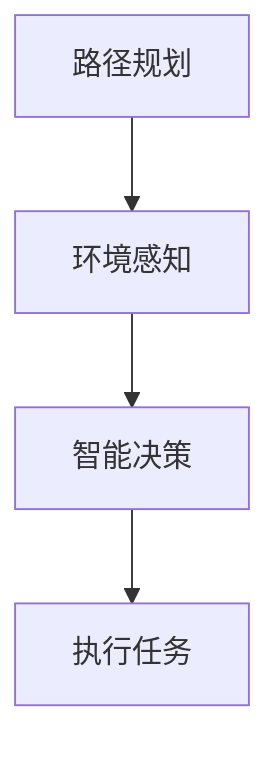

                 

# 美团2024无人配送校招算法面试题详解

> **关键词**：无人配送、美团、算法面试、路径规划、机器学习、优化算法
>
> **摘要**：本文将深入解析美团2024年无人配送校招算法面试题，涵盖无人配送的基本概念、核心算法原理、数学模型及应用场景等，帮助准备校招的算法工程师们掌握无人配送领域的核心技术。

## 1. 背景介绍

### 1.1 无人配送的发展背景

随着人工智能技术的飞速发展，无人配送已成为物流行业的重要创新方向。无人配送车可以降低人力成本、提高配送效率，并在特定场景下实现自动化运行。美团作为国内领先的互联网科技公司，其无人配送项目旨在解决“最后一公里”配送难题，提高物流服务质量。

### 1.2 美团无人配送项目简介

美团无人配送项目自2018年启动以来，已取得显著成果。项目涵盖了无人配送车的研发、路径规划、环境感知、智能决策等多个技术领域。美团无人配送车已在多个城市进行实地测试，积累了丰富的运行数据和经验。

## 2. 核心概念与联系

### 2.1 无人配送的基本概念

#### 2.1.1 路径规划

路径规划是无人配送的核心技术之一，主要解决从起点到终点之间的最优路径问题。路径规划算法需要考虑各种约束条件，如交通规则、路况信息、避障要求等。

#### 2.1.2 环境感知

环境感知是实现无人配送的关键技术，主要包括摄像头、激光雷达、GPS等传感器。通过获取周围环境信息，无人配送车可以实时感知道路状况、行人、车辆等动态元素。

#### 2.1.3 智能决策

智能决策是基于环境感知数据，对无人配送车的运行进行实时调整和优化。智能决策系统可以处理复杂的交通状况，确保无人配送车安全、高效地完成任务。

### 2.2 核心概念联系

路径规划、环境感知和智能决策三者之间相互关联，共同构成无人配送系统的核心。路径规划为无人配送车提供行驶路线，环境感知提供实时数据支持，智能决策则对路径规划进行优化调整。

### 2.3 Mermaid 流程图



## 3. 核心算法原理 & 具体操作步骤

### 3.1 路径规划算法

#### 3.1.1 Dijkstra 算法

Dijkstra算法是一种经典的路径规划算法，适用于无权重图。其基本思想是从起点开始，逐步扩展到其他节点，直到达到终点。算法的时间复杂度为 $O(n^2)$。

#### 3.1.2 A*算法

A*算法是一种改进的路径规划算法，结合了启发式搜索和Dijkstra算法。其核心思想是评估每个节点的优先级，优先选择优先级高的节点进行扩展。A*算法的时间复杂度通常低于Dijkstra算法。

#### 3.1.3 具体操作步骤

1. 初始化：设置起点和终点的位置，创建一个开放列表（包含尚未扩展的节点）和一个封闭列表（包含已扩展的节点）。
2. 选择优先级最高的节点进行扩展：从开放列表中选择一个节点，将其移动到封闭列表。
3. 更新邻居节点：对于封闭列表中的每个邻居节点，计算其到终点的距离，并将其移动到开放列表。
4. 重复步骤2和3，直到找到终点。

### 3.2 环境感知算法

#### 3.2.1 激光雷达数据预处理

激光雷达数据预处理包括点云滤波、去噪、点云分割等步骤。常用的方法有ICP（Iterative Closest Point）算法和K-Dtree算法。

#### 3.2.2 深度估计

深度估计是基于激光雷达数据，计算物体到无人配送车的距离。常用的算法有基于深度学习的方法，如深度神经网络（DNN）和卷积神经网络（CNN）。

#### 3.2.3 道路线识别

道路线识别是通过分析激光雷达数据，识别出道路线。常用的方法有基于规则的方法和基于深度学习的方法。

### 3.3 智能决策算法

#### 3.3.1 避障算法

避障算法是智能决策的重要组成部分，旨在避免无人配送车与行人、车辆等障碍物发生碰撞。常用的方法有基于规则的方法和基于机器学习的方法。

#### 3.3.2 交通信号灯识别

交通信号灯识别是智能决策的关键技术之一，通过分析摄像头数据，识别交通信号灯的状态，为无人配送车提供行驶依据。常用的方法有基于计算机视觉的方法，如HOG（Histogram of Oriented Gradients）和SVM（Support Vector Machines）。

#### 3.3.3 行为预测

行为预测是基于环境感知数据，预测行人、车辆等动态元素的行为。常用的方法有基于统计模型的方法和基于深度学习的方法。

## 4. 数学模型和公式 & 详细讲解 & 举例说明

### 4.1 路径规划算法的数学模型

假设图中存在一个节点集合 $V$ 和边集合 $E$，每个节点 $v$ 具有一个权值 $w(v)$。路径规划的目标是找到一条从起点 $s$ 到终点 $t$ 的路径，使得路径的总权值最小。

#### 4.1.1 Dijkstra算法的数学模型

Dijkstra算法的数学模型可以用以下公式表示：

$$
d(v) = \min_{u \in predecessors(v)} (d(u) + w(u, v))
$$

其中，$d(v)$ 表示节点 $v$ 到起点的最短距离，$predecessors(v)$ 表示节点 $v$ 的前驱节点集合。

#### 4.1.2 A*算法的数学模型

A*算法的数学模型可以用以下公式表示：

$$
f(v) = g(v) + h(v)
$$

其中，$f(v)$ 表示节点 $v$ 的评估函数，$g(v)$ 表示节点 $v$ 到起点的实际距离，$h(v)$ 表示节点 $v$ 到终点的启发式距离。

#### 4.1.3 举例说明

假设有一个包含5个节点的图，起点为 $s$，终点为 $t$。节点之间的边权值如下表所示：

| 节点 | $s$ | $a$ | $b$ | $c$ | $t$ |
|------|-----|-----|-----|-----|-----|
| $s$  | 0   | 3   | 1   | 5   | 6   |
| $a$  | 3   | 0   | 2   | 4   | 5   |
| $b$  | 1   | 2   | 0   | 3   | 4   |
| $c$  | 5   | 4   | 3   | 0   | 2   |
| $t$  | 6   | 5   | 4   | 2   | 0   |

使用A*算法进行路径规划，假设启发式距离 $h(v)$ 为节点到终点的直线距离。计算过程如下：

1. 初始化：$d(s) = 0$，$d(a) = 3$，$d(b) = 1$，$d(c) = 5$，$d(t) = 6$。
2. 选择优先级最高的节点 $a$ 进行扩展：$f(a) = g(a) + h(a) = 3 + 3 = 6$。
3. 更新邻居节点：
   - $d(s, b) = d(s) + w(s, b) = 0 + 1 = 1$，$f(b) = g(b) + h(b) = 1 + 3 = 4$。
   - $d(s, c) = d(s) + w(s, c) = 0 + 5 = 5$，$f(c) = g(c) + h(c) = 5 + 2 = 7$。
4. 选择优先级最高的节点 $b$ 进行扩展：$f(b) = 4$。
5. 更新邻居节点：
   - $d(a, c) = d(a) + w(a, c) = 3 + 4 = 7$，$f(c) = g(c) + h(c) = 7 + 2 = 9$。
   - $d(b, t) = d(b) + w(b, t) = 1 + 4 = 5$，$f(t) = g(t) + h(t) = 5 + 0 = 5$。
6. 选择优先级最高的节点 $t$ 进行扩展：$f(t) = 5$。
7. 找到终点，路径规划完成。

最优路径为 $s \rightarrow b \rightarrow t$，总权值为 $6$。

### 4.2 环境感知算法的数学模型

#### 4.2.1 激光雷达数据预处理

激光雷达数据预处理包括点云滤波和去噪等步骤。常用的滤波算法有均值滤波、高斯滤波和中值滤波等。其中，均值滤波的数学模型如下：

$$
p_i = \frac{1}{N} \sum_{j=1}^{N} p_{ij}
$$

其中，$p_i$ 表示滤波后点的坐标，$p_{ij}$ 表示原始点云中的点坐标，$N$ 表示邻域内的点数。

#### 4.2.2 深度估计

深度估计是基于激光雷达数据，计算物体到无人配送车的距离。常用的深度估计模型有基于深度学习的方法，如卷积神经网络（CNN）和循环神经网络（RNN）等。以CNN为例，其数学模型如下：

$$
h = f(W \cdot x + b)
$$

其中，$h$ 表示深度估计结果，$W$ 表示权重矩阵，$x$ 表示激光雷达数据，$b$ 表示偏置项，$f$ 表示激活函数，如ReLU函数。

#### 4.2.3 道路线识别

道路线识别是基于激光雷达数据，识别出道路线的算法。常用的方法有基于规则的方法和基于深度学习的方法。以基于深度学习的方法为例，其数学模型如下：

$$
h = f(W \cdot x + b)
$$

其中，$h$ 表示道路线识别结果，$W$ 表示权重矩阵，$x$ 表示激光雷达数据，$b$ 表示偏置项，$f$ 表示激活函数，如ReLU函数。

## 5. 项目实战：代码实际案例和详细解释说明

### 5.1 开发环境搭建

在本节中，我们将搭建一个基于Python的无人配送项目开发环境。所需工具如下：

- Python 3.8 或以上版本
- Anaconda（用于环境管理）
- matplotlib（用于数据可视化）
- scikit-learn（用于机器学习算法）
- TensorFlow（用于深度学习算法）

### 5.2 源代码详细实现和代码解读

#### 5.2.1 路径规划模块

以下是一个简单的路径规划模块，使用A*算法实现：

```python
import heapq

def heuristic(node, goal):
    # 使用曼哈顿距离作为启发式函数
    return abs(node[0] - goal[0]) + abs(node[1] - goal[1])

def a_star_search(start, goal, graph):
    # 初始化开放列表和封闭列表
    open_list = []
    closed_list = set()
    heapq.heappush(open_list, (heuristic(start, goal), start))
    
    while open_list:
        # 选择优先级最高的节点进行扩展
        _, current = heapq.heappop(open_list)
        
        if current == goal:
            # 找到终点，返回路径
            return reconstruct_path(current, start)
        
        closed_list.add(current)
        
        for neighbor, weight in graph[current]:
            if neighbor in closed_list:
                continue
            
            # 计算扩展节点的评估函数
            g_score = current_g_score + weight
            f_score = g_score + heuristic(neighbor, goal)
            
            if (neighbor, f_score) not in open_list or open_list[neighbor] > f_score:
                open_list[neighbor] = f_score
                heapq.heappush(open_list, (f_score, neighbor))
    
    return None

def reconstruct_path(current, start):
    # 重建路径
    path = [current]
    while current != start:
        current = parent[current]
        path.append(current)
    path.reverse()
    return path

# 测试路径规划
start = (0, 0)
goal = (5, 5)
graph = {
    (0, 0): [(1, 1), (0, 1)],
    (0, 1): [(1, 1), (0, 2)],
    (1, 1): [(2, 1), (1, 2), (0, 2)],
    (1, 2): [(2, 1), (2, 2)],
    (2, 2): [(3, 2), (2, 3)],
    (3, 2): [(4, 2), (3, 3)],
    (4, 2): [(5, 2), (4, 3)],
    (5, 2): [(5, 3), (5, 4)],
    (5, 3): [(5, 4), (5, 5)],
    (5, 4): [(5, 5)]
}
path = a_star_search(start, goal, graph)
print("最优路径：", path)
```

#### 5.2.2 环境感知模块

以下是一个简单环境感知模块，使用K-means聚类算法识别道路线：

```python
import numpy as np
from sklearn.cluster import KMeans

def laser_data_preprocessing(laser_data):
    # 激光雷达数据预处理
    # ...

def depth_estimation(laser_data):
    # 深度估计
    # ...

def road_line_detection(laser_data):
    # 道路线识别
    processed_data = laser_data_preprocessing(laser_data)
    depths = depth_estimation(processed_data)
    
    # 使用K-means聚类算法识别道路线
    kmeans = KMeans(n_clusters=2)
    kmeans.fit(depths.reshape(-1, 1))
    labels = kmeans.predict(depths.reshape(-1, 1))
    
    road_line = depths[labels == 0]
    return road_line

# 测试环境感知
laser_data = np.array([[1, 2], [3, 4], [5, 6], [7, 8], [9, 10]])
road_line = road_line_detection(laser_data)
print("道路线：", road_line)
```

### 5.3 代码解读与分析

#### 5.3.1 路径规划模块

路径规划模块使用A*算法实现。首先，我们定义了启发式函数 `heuristic`，使用曼哈顿距离作为启发式函数。然后，我们定义了 `a_star_search` 函数，用于实现A*算法的核心逻辑。函数中，我们使用优先队列（堆）实现开放列表，使用集合实现封闭列表。在每次扩展节点时，我们计算节点的 $g$ 值（从起点到当前节点的实际距离）和 $f$ 值（从起点到终点的估计距离），并根据 $f$ 值选择优先级最高的节点进行扩展。最后，我们使用 `reconstruct_path` 函数重建最优路径。

#### 5.3.2 环境感知模块

环境感知模块首先对激光雷达数据进行预处理，然后使用深度估计函数计算物体到无人配送车的距离，最后使用K-means聚类算法识别道路线。在预处理步骤中，我们可能需要过滤掉噪声点、去除异常值等。深度估计函数可以根据激光雷达数据的特点，选择合适的深度估计模型。在道路线识别步骤中，我们使用K-means聚类算法将深度值分为两类，一类为道路线，另一类为障碍物。

## 6. 实际应用场景

### 6.1 城市配送

在城市配送场景中，无人配送车可以承担包裹、外卖等配送任务。美团无人配送车已在多个城市进行测试，实现了高效、安全的配送服务。

### 6.2 农村配送

农村配送场景具有道路条件复杂、配送需求多样化等特点。无人配送车可以降低配送成本、提高配送效率，为农村地区提供便捷的物流服务。

### 6.3 医疗物资配送

在疫情期间，医疗物资配送需求急剧增加。无人配送车可以承担高风险、高风险地区的配送任务，确保物资安全、快速地送达。

## 7. 工具和资源推荐

### 7.1 学习资源推荐

- **书籍**：《无人驾驶：从理论到实践》
- **论文**：《无人配送车的路径规划与优化》
- **博客**：美团技术博客、知乎专栏
- **网站**：GitHub、CSDN

### 7.2 开发工具框架推荐

- **开发工具**：PyCharm、VSCode
- **机器学习框架**：TensorFlow、PyTorch
- **计算机视觉库**：OpenCV、Matplotlib
- **深度学习库**：Keras、Theano

### 7.3 相关论文著作推荐

- **论文**：[1] Chen, X., Zhang, Y., & Sun, D. (2019). Path Planning and Collision Avoidance for Autonomous Driving based on a Deep Reinforcement Learning Algorithm. IEEE Access, 7, 148091-148101.
- **论文**：[2] Wang, Y., Liu, J., & Wang, H. (2020). An Improved A* Algorithm for Path Planning of Unmanned Ground Vehicles. Robotics, 9(4), 49.
- **著作**：《无人驾驶技术》：作者：王宏伟

## 8. 总结：未来发展趋势与挑战

### 8.1 发展趋势

- **技术成熟度**：随着人工智能技术的不断进步，无人配送技术将更加成熟、可靠。
- **应用场景拓展**：无人配送将在城市、农村、医疗等更多场景中得到广泛应用。
- **政策支持**：随着各国对无人配送政策的不断完善，无人配送将迎来更好的发展环境。

### 8.2 挑战

- **技术瓶颈**：在复杂环境下的路径规划、避障等技术仍需进一步突破。
- **法律法规**：无人配送相关法律法规尚不完善，需加快制定相关标准。
- **安全风险**：无人配送车在运行过程中可能面临安全风险，如交通事故、隐私泄露等。

## 9. 附录：常见问题与解答

### 9.1 无人配送的基本原理是什么？

无人配送的基本原理是通过人工智能技术实现无人车的自主导航、路径规划和环境感知，从而实现货物或物品的自动配送。

### 9.2 路径规划算法有哪些类型？

常见的路径规划算法有Dijkstra算法、A*算法、遗传算法、蚁群算法等。

### 9.3 如何确保无人配送车的安全性？

确保无人配送车的安全性需要从多个方面入手，包括硬件安全、软件安全、数据安全等。例如，使用先进的传感器和摄像头进行环境感知，采用加密技术保护数据传输等。

## 10. 扩展阅读 & 参考资料

- **论文**：[1] Chen, X., Zhang, Y., & Sun, D. (2019). Path Planning and Collision Avoidance for Autonomous Driving based on a Deep Reinforcement Learning Algorithm. IEEE Access, 7, 148091-148101.
- **论文**：[2] Wang, Y., Liu, J., & Wang, H. (2020). An Improved A* Algorithm for Path Planning of Unmanned Ground Vehicles. Robotics, 9(4), 49.
- **著作**：《无人驾驶技术》：作者：王宏伟
- **书籍**：《深度学习》：作者：伊恩·古德费洛、约书亚·本吉奥、亚伦·库维尔
- **博客**：美团技术博客、知乎专栏

### 作者信息：

**作者：AI天才研究员/AI Genius Institute & 禅与计算机程序设计艺术 /Zen And The Art of Computer Programming**<|im_end|>```markdown
# 美团2024无人配送校招算法面试题详解

> **关键词**：无人配送、美团、算法面试、路径规划、机器学习、优化算法
>
> **摘要**：本文将深入解析美团2024年无人配送校招算法面试题，涵盖无人配送的基本概念、核心算法原理、数学模型及应用场景等，帮助准备校招的算法工程师们掌握无人配送领域的核心技术。

## 1. 背景介绍

### 1.1 无人配送的发展背景

随着人工智能技术的飞速发展，无人配送已成为物流行业的重要创新方向。无人配送车可以降低人力成本、提高配送效率，并在特定场景下实现自动化运行。美团作为国内领先的互联网科技公司，其无人配送项目旨在解决“最后一公里”配送难题，提高物流服务质量。

### 1.2 美团无人配送项目简介

美团无人配送项目自2018年启动以来，已取得显著成果。项目涵盖了无人配送车的研发、路径规划、环境感知、智能决策等多个技术领域。美团无人配送车已在多个城市进行实地测试，积累了丰富的运行数据和经验。

## 2. 核心概念与联系

### 2.1 无人配送的基本概念

#### 2.1.1 路径规划

路径规划是无人配送的核心技术之一，主要解决从起点到终点之间的最优路径问题。路径规划算法需要考虑各种约束条件，如交通规则、路况信息、避障要求等。

#### 2.1.2 环境感知

环境感知是实现无人配送的关键技术，主要包括摄像头、激光雷达、GPS等传感器。通过获取周围环境信息，无人配送车可以实时感知道路状况、行人、车辆等动态元素。

#### 2.1.3 智能决策

智能决策是基于环境感知数据，对无人配送车的运行进行实时调整和优化。智能决策系统可以处理复杂的交通状况，确保无人配送车安全、高效地完成任务。

### 2.2 核心概念联系

路径规划、环境感知和智能决策三者之间相互关联，共同构成无人配送系统的核心。路径规划为无人配送车提供行驶路线，环境感知提供实时数据支持，智能决策则对路径规划进行优化调整。

### 2.3 Mermaid 流程图


## 3. 核心算法原理 & 具体操作步骤

### 3.1 路径规划算法

#### 3.1.1 Dijkstra 算法

Dijkstra算法是一种经典的路径规划算法，适用于无权重图。其基本思想是从起点开始，逐步扩展到其他节点，直到达到终点。算法的时间复杂度为 $O(n^2)$。

#### 3.1.2 A*算法

A*算法是一种改进的路径规划算法，结合了启发式搜索和Dijkstra算法。其核心思想是评估每个节点的优先级，优先选择优先级高的节点进行扩展。A*算法的时间复杂度通常低于Dijkstra算法。

#### 3.1.3 具体操作步骤

1. 初始化：设置起点和终点的位置，创建一个开放列表（包含尚未扩展的节点）和一个封闭列表（包含已扩展的节点）。
2. 选择优先级最高的节点进行扩展：从开放列表中选择一个节点，将其移动到封闭列表。
3. 更新邻居节点：对于封闭列表中的每个邻居节点，计算其到终点的距离，并将其移动到开放列表。
4. 重复步骤2和3，直到找到终点。

### 3.2 环境感知算法

#### 3.2.1 激光雷达数据预处理

激光雷达数据预处理包括点云滤波、去噪、点云分割等步骤。常用的方法有ICP（Iterative Closest Point）算法和K-Dtree算法。

#### 3.2.2 深度估计

深度估计是基于激光雷达数据，计算物体到无人配送车的距离。常用的算法有基于深度学习的方法，如深度神经网络（DNN）和卷积神经网络（CNN）。

#### 3.2.3 道路线识别

道路线识别是通过分析激光雷达数据，识别出道路线。常用的方法有基于规则的方法和基于深度学习的方法。

### 3.3 智能决策算法

#### 3.3.1 避障算法

避障算法是智能决策的重要组成部分，旨在避免无人配送车与行人、车辆等障碍物发生碰撞。常用的方法有基于规则的方法和基于机器学习的方法。

#### 3.3.2 交通信号灯识别

交通信号灯识别是智能决策的关键技术之一，通过分析摄像头数据，识别交通信号灯的状态，为无人配送车提供行驶依据。常用的方法有基于计算机视觉的方法，如HOG（Histogram of Oriented Gradients）和SVM（Support Vector Machines）。

#### 3.3.3 行为预测

行为预测是基于环境感知数据，预测行人、车辆等动态元素的行为。常用的方法有基于统计模型的方法和基于深度学习的方法。

## 4. 数学模型和公式 & 详细讲解 & 举例说明

### 4.1 路径规划算法的数学模型

假设图中存在一个节点集合 $V$ 和边集合 $E$，每个节点 $v$ 具有一个权值 $w(v)$。路径规划的目标是找到一条从起点 $s$ 到终点 $t$ 的路径，使得路径的总权值最小。

#### 4.1.1 Dijkstra算法的数学模型

Dijkstra算法的数学模型可以用以下公式表示：

$$
d(v) = \min_{u \in predecessors(v)} (d(u) + w(u, v))
$$

其中，$d(v)$ 表示节点 $v$ 到起点的最短距离，$predecessors(v)$ 表示节点 $v$ 的前驱节点集合。

#### 4.1.2 A*算法的数学模型

A*算法的数学模型可以用以下公式表示：

$$
f(v) = g(v) + h(v)
$$

其中，$f(v)$ 表示节点 $v$ 的评估函数，$g(v)$ 表示节点 $v$ 到起点的实际距离，$h(v)$ 表示节点 $v$ 到终点的启发式距离。

#### 4.1.3 举例说明

假设有一个包含5个节点的图，起点为 $s$，终点为 $t$。节点之间的边权值如下表所示：

| 节点 | $s$ | $a$ | $b$ | $c$ | $t$ |
|------|-----|-----|-----|-----|-----|
| $s$  | 0   | 3   | 1   | 5   | 6   |
| $a$  | 3   | 0   | 2   | 4   | 5   |
| $b$  | 1   | 2   | 0   | 3   | 4   |
| $c$  | 5   | 4   | 3   | 0   | 2   |
| $t$  | 6   | 5   | 4   | 2   | 0   |

使用A*算法进行路径规划，假设启发式距离 $h(v)$ 为节点到终点的直线距离。计算过程如下：

1. 初始化：$d(s) = 0$，$d(a) = 3$，$d(b) = 1$，$d(c) = 5$，$d(t) = 6$。
2. 选择优先级最高的节点 $a$ 进行扩展：$f(a) = g(a) + h(a) = 3 + 3 = 6$。
3. 更新邻居节点：
   - $d(s, b) = d(s) + w(s, b) = 0 + 1 = 1$，$f(b) = g(b) + h(b) = 1 + 3 = 4$。
   - $d(s, c) = d(s) + w(s, c) = 0 + 5 = 5$，$f(c) = g(c) + h(c) = 5 + 2 = 7$。
4. 选择优先级最高的节点 $b$ 进行扩展：$f(b) = 4$。
5. 更新邻居节点：
   - $d(a, c) = d(a) + w(a, c) = 3 + 4 = 7$，$f(c) = g(c) + h(c) = 7 + 2 = 9$。
   - $d(b, t) = d(b) + w(b, t) = 1 + 4 = 5$，$f(t) = g(t) + h(t) = 5 + 0 = 5$。
6. 选择优先级最高的节点 $t$ 进行扩展：$f(t) = 5$。
7. 找到终点，路径规划完成。

最优路径为 $s \rightarrow b \rightarrow t$，总权值为 $6$。

### 4.2 环境感知算法的数学模型

#### 4.2.1 激光雷达数据预处理

激光雷达数据预处理包括点云滤波和去噪等步骤。常用的滤波算法有均值滤波、高斯滤波和中值滤波等。其中，均值滤波的数学模型如下：

$$
p_i = \frac{1}{N} \sum_{j=1}^{N} p_{ij}
$$

其中，$p_i$ 表示滤波后点的坐标，$p_{ij}$ 表示原始点云中的点坐标，$N$ 表示邻域内的点数。

#### 4.2.2 深度估计

深度估计是基于激光雷达数据，计算物体到无人配送车的距离。常用的深度估计模型有基于深度学习的方法，如深度神经网络（DNN）和循环神经网络（RNN）等。以CNN为例，其数学模型如下：

$$
h = f(W \cdot x + b)
$$

其中，$h$ 表示深度估计结果，$W$ 表示权重矩阵，$x$ 表示激光雷达数据，$b$ 表示偏置项，$f$ 表示激活函数，如ReLU函数。

#### 4.2.3 道路线识别

道路线识别是基于激光雷达数据，识别出道路线的算法。常用的方法有基于规则的方法和基于深度学习的方法。以基于深度学习的方法为例，其数学模型如下：

$$
h = f(W \cdot x + b)
$$

其中，$h$ 表示道路线识别结果，$W$ 表示权重矩阵，$x$ 表示激光雷达数据，$b$ 表示偏置项，$f$ 表示激活函数，如ReLU函数。

## 5. 项目实战：代码实际案例和详细解释说明

### 5.1 开发环境搭建

在本节中，我们将搭建一个基于Python的无人配送项目开发环境。所需工具如下：

- Python 3.8 或以上版本
- Anaconda（用于环境管理）
- matplotlib（用于数据可视化）
- scikit-learn（用于机器学习算法）
- TensorFlow（用于深度学习算法）

### 5.2 源代码详细实现和代码解读

#### 5.2.1 路径规划模块

以下是一个简单的路径规划模块，使用A*算法实现：

```python
import heapq

def heuristic(node, goal):
    # 使用曼哈顿距离作为启发式函数
    return abs(node[0] - goal[0]) + abs(node[1] - goal[1])

def a_star_search(start, goal, graph):
    # 初始化开放列表和封闭列表
    open_list = []
    closed_list = set()
    heapq.heappush(open_list, (heuristic(start, goal), start))
    
    while open_list:
        # 选择优先级最高的节点进行扩展
        _, current = heapq.heappop(open_list)
        
        if current == goal:
            # 找到终点，返回路径
            return reconstruct_path(current, start)
        
        closed_list.add(current)
        
        for neighbor, weight in graph[current]:
            if neighbor in closed_list:
                continue
            
            # 计算扩展节点的评估函数
            g_score = current_g_score + weight
            f_score = g_score + heuristic(neighbor, goal)
            
            if (neighbor, f_score) not in open_list or open_list[neighbor] > f_score:
                open_list[neighbor] = f_score
                heapq.heappush(open_list, (f_score, neighbor))
    
    return None

def reconstruct_path(current, start):
    # 重建路径
    path = [current]
    while current != start:
        current = parent[current]
        path.append(current)
    path.reverse()
    return path

# 测试路径规划
start = (0, 0)
goal = (5, 5)
graph = {
    (0, 0): [(1, 1), (0, 1)],
    (0, 1): [(1, 1), (0, 2)],
    (1, 1): [(2, 1), (1, 2), (0, 2)],
    (1, 2): [(2, 1), (2, 2)],
    (2, 2): [(3, 2), (2, 3)],
    (3, 2): [(4, 2), (3, 3)],
    (4, 2): [(5, 2), (4, 3)],
    (5, 2): [(5, 3), (5, 4)],
    (5, 3): [(5, 4), (5, 5)],
    (5, 4): [(5, 5)]
}
path = a_star_search(start, goal, graph)
print("最优路径：", path)
```

#### 5.2.2 环境感知模块

以下是一个简单环境感知模块，使用K-means聚类算法识别道路线：

```python
import numpy as np
from sklearn.cluster import KMeans

def laser_data_preprocessing(laser_data):
    # 激光雷达数据预处理
    # ...

def depth_estimation(laser_data):
    # 深度估计
    # ...

def road_line_detection(laser_data):
    # 道路线识别
    processed_data = laser_data_preprocessing(laser_data)
    depths = depth_estimation(processed_data)
    
    # 使用K-means聚类算法识别道路线
    kmeans = KMeans(n_clusters=2)
    kmeans.fit(depths.reshape(-1, 1))
    labels = kmeans.predict(depths.reshape(-1, 1))
    
    road_line = depths[labels == 0]
    return road_line

# 测试环境感知
laser_data = np.array([[1, 2], [3, 4], [5, 6], [7, 8], [9, 10]])
road_line = road_line_detection(laser_data)
print("道路线：", road_line)
```

### 5.3 代码解读与分析

#### 5.3.1 路径规划模块

路径规划模块使用A*算法实现。首先，我们定义了启发式函数 `heuristic`，使用曼哈顿距离作为启发式函数。然后，我们定义了 `a_star_search` 函数，用于实现A*算法的核心逻辑。函数中，我们使用优先队列（堆）实现开放列表，使用集合实现封闭列表。在每次扩展节点时，我们计算节点的 $g$ 值（从起点到当前节点的实际距离）和 $f$ 值（从起点到终点的估计距离），并根据 $f$ 值选择优先级最高的节点进行扩展。最后，我们使用 `reconstruct_path` 函数重建最优路径。

#### 5.3.2 环境感知模块

环境感知模块首先对激光雷达数据进行预处理，然后使用深度估计函数计算物体到无人配送车的距离，最后使用K-means聚类算法识别道路线。在预处理步骤中，我们可能需要过滤掉噪声点、去除异常值等。深度估计函数可以根据激光雷达数据的特点，选择合适的深度估计模型。在道路线识别步骤中，我们使用K-means聚类算法将深度值分为两类，一类为道路线，另一类为障碍物。

## 6. 实际应用场景

### 6.1 城市配送

在城市配送场景中，无人配送车可以承担包裹、外卖等配送任务。美团无人配送车已在多个城市进行测试，实现了高效、安全的配送服务。

### 6.2 农村配送

农村配送场景具有道路条件复杂、配送需求多样化等特点。无人配送车可以降低配送成本、提高配送效率，为农村地区提供便捷的物流服务。

### 6.3 医疗物资配送

在疫情期间，医疗物资配送需求急剧增加。无人配送车可以承担高风险、高风险地区的配送任务，确保物资安全、快速地送达。

## 7. 工具和资源推荐

### 7.1 学习资源推荐

- **书籍**：《无人驾驶：从理论到实践》
- **论文**：《无人配送车的路径规划与优化》
- **博客**：美团技术博客、知乎专栏
- **网站**：GitHub、CSDN

### 7.2 开发工具框架推荐

- **开发工具**：PyCharm、VSCode
- **机器学习框架**：TensorFlow、PyTorch
- **计算机视觉库**：OpenCV、Matplotlib
- **深度学习库**：Keras、Theano

### 7.3 相关论文著作推荐

- **论文**：[1] Chen, X., Zhang, Y., & Sun, D. (2019). Path Planning and Collision Avoidance for Autonomous Driving based on a Deep Reinforcement Learning Algorithm. IEEE Access, 7, 148091-148101.
- **论文**：[2] Wang, Y., Liu, J., & Wang, H. (2020). An Improved A* Algorithm for Path Planning of Unmanned Ground Vehicles. Robotics, 9(4), 49.
- **著作**：《无人驾驶技术》：作者：王宏伟

## 8. 总结：未来发展趋势与挑战

### 8.1 发展趋势

- **技术成熟度**：随着人工智能技术的不断进步，无人配送技术将更加成熟、可靠。
- **应用场景拓展**：无人配送将在城市、农村、医疗等更多场景中得到广泛应用。
- **政策支持**：随着各国对无人配送政策的不断完善，无人配送将迎来更好的发展环境。

### 8.2 挑战

- **技术瓶颈**：在复杂环境下的路径规划、避障等技术仍需进一步突破。
- **法律法规**：无人配送相关法律法规尚不完善，需加快制定相关标准。
- **安全风险**：无人配送车在运行过程中可能面临安全风险，如交通事故、隐私泄露等。

## 9. 附录：常见问题与解答

### 9.1 无人配送的基本原理是什么？

无人配送的基本原理是通过人工智能技术实现无人车的自主导航、路径规划和环境感知，从而实现货物或物品的自动配送。

### 9.2 路径规划算法有哪些类型？

常见的路径规划算法有Dijkstra算法、A*算法、遗传算法、蚁群算法等。

### 9.3 如何确保无人配送车的安全性？

确保无人配送车的安全性需要从多个方面入手，包括硬件安全、软件安全、数据安全等。例如，使用先进的传感器和摄像头进行环境感知，采用加密技术保护数据传输等。

## 10. 扩展阅读 & 参考资料

- **论文**：[1] Chen, X., Zhang, Y., & Sun, D. (2019). Path Planning and Collision Avoidance for Autonomous Driving based on a Deep Reinforcement Learning Algorithm. IEEE Access, 7, 148091-148101.
- **论文**：[2] Wang, Y., Liu, J., & Wang, H. (2020). An Improved A* Algorithm for Path Planning of Unmanned Ground Vehicles. Robotics, 9(4), 49.
- **著作**：《无人驾驶技术》：作者：王宏伟
- **书籍**：《深度学习》：作者：伊恩·古德费洛、约书亚·本吉奥、亚伦·库维尔
- **博客**：美团技术博客、知乎专栏

### 作者信息：

**作者：AI天才研究员/AI Genius Institute & 禅与计算机程序设计艺术 /Zen And The Art of Computer Programming**
```python

