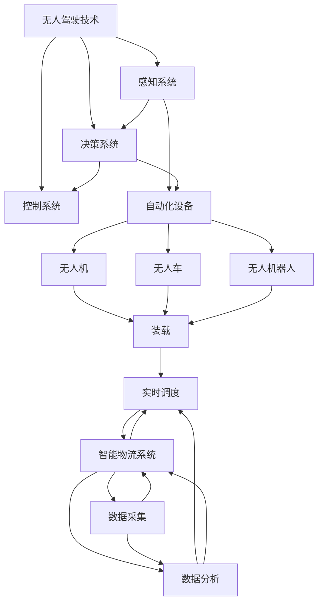

                 

### 背景介绍

#### 无人配送系统的兴起

随着科技的快速发展，尤其是人工智能、物联网、大数据等技术的日益成熟，无人配送系统作为智慧物流领域的重要组成部分，正逐渐从概念走向现实。无人配送系统是指利用无人驾驶技术、智能物流系统和自动化设备，实现包裹、货物等物品的自动配送。这一系统不仅提高了物流效率，降低了人力成本，还在很大程度上减少了交通事故和环境污染。

美团作为国内领先的本地生活服务公司，早在2016年就开始了无人配送的探索。从最初的无人车到无人机，再到无人配送机器人，美团不断推动无人配送技术的研发和应用。在2024年，美团无人配送系统已经取得了显著的成果，为智慧物流的发展提供了强有力的技术支撑。

#### 无人配送系统的技术挑战

尽管无人配送系统具有巨大的潜力，但其在实际应用中仍面临诸多技术挑战。首先，无人驾驶技术需要克服复杂的道路环境，包括交通拥堵、突发状况等。其次，智能物流系统需要高效地处理海量物流数据，实现最优配送路径规划。此外，自动化设备需要具备高度的可靠性和稳定性，以确保配送过程的顺利进行。

针对这些挑战，美团采用了多种技术手段。例如，在无人驾驶技术方面，美团与多家汽车制造商和科技公司合作，研发具备高自动驾驶水平的无人车。在智能物流系统方面，美团利用大数据分析和人工智能技术，实现了高效的配送路径规划和实时调度。在自动化设备方面，美团自主研发了多款配送机器人，并不断优化其性能和可靠性。

#### 美团2024无人配送系统校招面试真题的意义

本文将针对美团2024年无人配送系统开发校招面试真题进行深入分析，旨在帮助广大考生了解无人配送系统的核心技术，掌握解题思路，提高面试技巧。通过本文的详细解读，考生可以更加清晰地认识到无人配送系统的技术难点和解决方法，为未来的职业生涯做好准备。

本文将以逻辑清晰、结构紧凑、简单易懂的方式，分章节详细阐述无人配送系统的各个方面，包括无人驾驶技术、智能物流系统、自动化设备等。同时，本文还将通过实际案例和代码解析，帮助读者更好地理解无人配送系统的实现原理和应用场景。

#### 文章结构概述

本文将分为以下几个主要部分：

1. **背景介绍**：介绍无人配送系统的兴起、技术挑战以及本文的目的和结构。
2. **核心概念与联系**：详细阐述无人配送系统的核心概念、原理和架构，并使用Mermaid流程图进行展示。
3. **核心算法原理与具体操作步骤**：讲解无人配送系统中的核心算法，包括路径规划、实时调度等，并给出具体操作步骤。
4. **数学模型和公式**：介绍与无人配送系统相关的数学模型和公式，并举例说明。
5. **项目实战**：通过实际案例和代码解析，展示无人配送系统的实现过程和应用效果。
6. **实际应用场景**：分析无人配送系统在不同场景下的应用，包括城市配送、乡村配送等。
7. **工具和资源推荐**：推荐相关的学习资源、开发工具和框架。
8. **总结**：总结无人配送系统的未来发展趋势与挑战，并提出建议。
9. **附录**：提供常见问题与解答，便于读者更好地理解本文内容。
10. **扩展阅读与参考资料**：列出本文引用的相关文献和资料，供读者进一步学习和研究。

通过以上结构，本文旨在为读者提供一份全面、系统的无人配送系统技术指南，帮助读者深入理解这一前沿技术，为未来的研究和实践打下坚实基础。

#### 核心概念与联系

无人配送系统作为智慧物流的关键组成部分，涉及多个核心概念和技术。以下是这些核心概念及其相互联系：

##### 无人驾驶技术

无人驾驶技术是无人配送系统的核心技术之一。其目标是通过传感器、人工智能和计算机视觉等技术，使车辆能够在没有人类驾驶员的情况下自主行驶。无人驾驶技术包括以下几个关键组成部分：

1. **感知系统**：通过激光雷达（LIDAR）、摄像头、超声波传感器等设备，实时获取周围环境信息。
2. **决策系统**：基于感知系统提供的数据，车辆需要进行路径规划、避障、交通法规遵守等决策。
3. **控制系统**：执行决策系统的指令，控制车辆的加速度、转向等动作。

##### 智能物流系统

智能物流系统负责管理物流数据，优化配送路径，提高配送效率。其核心组成部分包括：

1. **数据采集**：通过传感器、GPS等设备，实时采集车辆位置、货物状态、交通状况等信息。
2. **数据分析**：利用大数据分析和人工智能技术，对采集到的数据进行分析，预测交通状况，规划最优路径。
3. **实时调度**：根据实时数据，动态调整配送计划，确保货物按时送达。

##### 自动化设备

自动化设备是无人配送系统的执行层，主要包括无人机、无人车和无人机器人等。这些设备的主要功能是执行配送任务，包括装载、运输和卸载货物等。

##### 核心概念联系

无人配送系统中的各个核心概念通过以下方式进行相互联系和协同工作：

1. **数据共享**：无人驾驶车辆、智能物流系统和自动化设备之间通过物联网技术实现实时数据共享，确保信息同步。
2. **任务分配**：智能物流系统根据实时数据，将配送任务分配给空闲的无人驾驶车辆或自动化设备。
3. **协同工作**：在执行配送任务时，无人驾驶车辆和自动化设备通过协同工作，实现高效、准确的货物配送。

##### Mermaid 流程图展示

为了更直观地展示无人配送系统的核心概念及其相互联系，我们可以使用Mermaid流程图进行描述：



在这个流程图中，我们可以清晰地看到无人驾驶技术、智能物流系统和自动化设备之间的相互关系和协同工作方式。通过这样的流程图，不仅有助于理解无人配送系统的整体架构，还能为后续章节的具体分析提供参考。

通过以上对核心概念及其相互联系的介绍，我们为理解无人配送系统的实现原理奠定了基础。接下来，我们将进一步探讨无人配送系统中的核心算法原理和具体操作步骤，帮助读者深入理解这一前沿技术。

### 核心算法原理与具体操作步骤

在无人配送系统中，核心算法是实现系统高效运作的关键。以下我们将详细阐述无人配送系统中的核心算法原理，包括路径规划、实时调度等，并给出具体的操作步骤。

#### 路径规划算法

路径规划是无人配送系统的核心任务之一，其主要目标是找到从起点到终点的最优路径。常用的路径规划算法包括Dijkstra算法、A*算法和遗传算法等。

1. **Dijkstra算法**：

   Dijkstra算法是一种基于贪心的最短路径算法，其基本思想是从起点开始，逐步扩展到未访问过的节点，直到目标节点。具体步骤如下：

   - 初始化：设置一个距离表，记录从起点到各节点的距离，初始时只有起点的距离为0，其他节点的距离为无穷大。
   - 选择未访问节点中距离起点最近的节点作为当前节点，将其标记为已访问。
   - 更新未访问节点的距离：对于每个未访问节点，计算其到当前节点的距离，如果该距离小于当前记录的距离，则更新距离表。
   - 重复步骤2和3，直到目标节点被访问。

2. **A*算法**：

   A*算法是Dijkstra算法的改进版，它引入了启发式函数，以加速搜索过程。A*算法的基本步骤如下：

   - 初始化：设置一个F值表，其中F值是G值（从起点到当前节点的实际距离）和H值（从当前节点到目标节点的启发式估计距离）之和。
   - 选择F值最小的未访问节点作为当前节点，将其标记为已访问。
   - 更新未访问节点的F值：对于每个未访问节点，计算其G值和H值，更新F值表。
   - 重复步骤2和3，直到目标节点被访问。

3. **遗传算法**：

   遗传算法是一种基于自然进化过程的优化算法，适用于解决复杂的最优路径规划问题。遗传算法的主要步骤如下：

   - 初始化：生成初始种群，每个个体代表一条可能的路径。
   - 适应度评估：计算每个个体的适应度，适应度高的个体代表更好的路径。
   - 选择：根据适应度选择优秀的个体进行交配和变异，生成新的种群。
   - 重复步骤2和3，直到找到最优路径或达到预设的迭代次数。

#### 实时调度算法

实时调度是无人配送系统的另一核心任务，其主要目标是根据实时数据动态调整配送计划，确保货物能够按时送达。常用的实时调度算法包括基于时间的调度算法和基于事件的调度算法。

1. **基于时间的调度算法**：

   基于时间的调度算法将配送时间划分为若干个时间片，在每个时间片内进行任务调度。具体步骤如下：

   - 初始化：设置一个时间表，记录每个配送任务的时间段和优先级。
   - 每个时间片开始时，根据优先级和任务类型进行调度，优先分配优先级高和类型匹配的任务。
   - 如果当前时间段内存在多个任务，可以采用轮询或负载均衡策略进行调度。
   - 重复步骤2，直到所有任务都被调度完成。

2. **基于事件的调度算法**：

   基于事件的调度算法在事件触发时进行任务调度，适用于处理突发事件和实时数据。具体步骤如下：

   - 初始化：设置一个事件队列，记录所有待处理的事件。
   - 每当有新的事件发生时，将其加入事件队列。
   - 按照事件队列的顺序，依次处理事件，并根据事件类型进行任务调度。
   - 如果事件队列中的事件类型相同，可以采用优先级或先到先服务（FCFS）策略进行调度。
   - 重复步骤3，直到事件队列中的所有事件被处理完毕。

通过以上对核心算法原理和具体操作步骤的详细阐述，我们可以更好地理解无人配送系统的运作机制。接下来，我们将介绍与无人配送系统相关的数学模型和公式，进一步深化对系统实现原理的认识。

### 数学模型和公式

在无人配送系统的设计和实现过程中，数学模型和公式起着至关重要的作用。以下是几个与无人配送系统密切相关的数学模型和公式，以及它们的具体应用。

#### 1. 路径规划中的距离公式

在路径规划算法中，计算节点之间的距离是关键步骤之一。常用的距离公式包括欧几里得距离、曼哈顿距离和切比雪夫距离等。

1. **欧几里得距离**：

   欧几里得距离是二维空间中最常用的距离公式，它表示两点之间的直线距离。公式如下：

   $$d(Euclidean) = \sqrt{(x_2 - x_1)^2 + (y_2 - y_1)^2}$$

   其中，$(x_1, y_1)$和$(x_2, y_2)$是两点的坐标。

2. **曼哈顿距离**：

   曼哈顿距离是二维空间中两点沿网格路径的距离，它在城市规划中广泛应用。公式如下：

   $$d(Manhattan) = |x_2 - x_1| + |y_2 - y_1|$$

   其中，$(x_1, y_1)$和$(x_2, y_2)$是两点的坐标。

3. **切比雪夫距离**：

   切比雪夫距离是二维空间中两点在切比雪夫网格上的距离。公式如下：

   $$d(Chessboard) = \max(|x_2 - x_1|, |y_2 - y_1|)$$

   其中，$(x_1, y_1)$和$(x_2, y_2)$是两点的坐标。

#### 2. 启发式函数

在A*算法中，启发式函数（Heuristic Function）用于估算从当前节点到目标节点的距离。常用的启发式函数包括曼哈顿距离、对角线距离和欧几里得距离。

1. **曼哈顿距离**：

   $$h(n) = |x_{goal} - x_{current}| + |y_{goal} - y_{current}|$$

   其中，$x_{goal}$和$y_{goal}$是目标点的坐标，$x_{current}$和$y_{current}$是当前点的坐标。

2. **对角线距离**：

   $$h(n) = \sqrt{2} \cdot \max(|x_{goal} - x_{current}|, |y_{goal} - y_{current}|)$$

   其中，$x_{goal}$和$y_{goal}$是目标点的坐标，$x_{current}$和$y_{current}$是当前点的坐标。

3. **欧几里得距离**：

   $$h(n) = \sqrt{(x_{goal} - x_{current})^2 + (y_{goal} - y_{current})^2}$$

   其中，$x_{goal}$和$y_{goal}$是目标点的坐标，$x_{current}$和$y_{current}$是当前点的坐标。

#### 3. 适应度函数

在遗传算法中，适应度函数用于评估个体的优劣，从而决定个体的选择、交叉和变异。一个常见的适应度函数是基于路径长度和交付时间延迟的加权公式：

$$f(x) = w_1 \cdot d + w_2 \cdot t$$

其中，$w_1$和$w_2$是权重系数，$d$是路径长度，$t$是交付时间延迟。

#### 4. 实时调度中的排队模型

在实时调度算法中，可以使用排队模型来预测任务的执行时间和资源需求。一个简单的M/M/1排队模型如下：

- **到达率**（λ）：单位时间内到达的服务请求数量。
- **服务率**（μ）：单位时间内能够处理的服务请求数量。
- **排队长度**（L）：在系统中的请求数量。

排队模型中的主要公式包括：

- **平均等待时间**（W）：

  $$W = \frac{\rho}{\mu(1 - \rho)}$$

  其中，$\rho = \frac{\lambda}{\mu}$是系统利用率。

- **平均排队长度**（Lq）：

  $$Lq = \frac{\rho^2}{\mu(1 - \rho)}$$

通过以上数学模型和公式，无人配送系统可以更好地进行路径规划、实时调度和资源管理。接下来，我们将通过实际案例和代码解析，进一步展示这些数学模型和公式的应用。

#### 项目实战：代码实际案例和详细解释说明

在本文的下一部分，我们将通过一个实际的项目案例，详细展示无人配送系统的开发过程，包括开发环境的搭建、源代码的实现以及代码的具体解读和分析。这个案例将帮助我们深入理解无人配送系统的实现原理和应用。

### 5.1 开发环境搭建

在开始无人配送系统的开发之前，我们需要搭建一个合适的技术环境。以下是一份详细的开发环境搭建指南：

#### 1. 硬件设备

- **无人车**：选择一辆适合进行无人驾驶测试的汽车，例如特斯拉Model S。
- **无人机**：选择适合进行无人机配送的无人机，例如大疆（DJI）的Mavic系列。
- **传感器**：包括激光雷达（LIDAR）、摄像头、GPS等。
- **自动化设备**：如无人配送机器人。

#### 2. 软件工具

- **操作系统**：Windows、Linux或macOS。
- **开发环境**：选择适合无人驾驶和智能物流系统的集成开发环境（IDE），例如JetBrains的PyCharm。
- **编程语言**：主要使用Python和C++进行开发。
- **数据处理**：使用Pandas、NumPy等Python库进行数据分析和处理。
- **机器学习框架**：如TensorFlow或PyTorch。

#### 3. 开发步骤

1. **硬件连接与调试**：将无人车、无人机、传感器和自动化设备连接到电脑，并进行初步调试，确保硬件正常工作。
2. **软件安装**：在开发环境中安装所需的编程语言、库和框架。
3. **环境配置**：配置Python和C++的开发环境，设置路径和环境变量。

### 5.2 源代码详细实现和代码解读

在搭建好开发环境后，我们将开始实现无人配送系统的源代码。以下是具体的代码实现和解读。

#### 1. 路径规划模块

路径规划模块是无人配送系统的核心部分，其目的是为无人车、无人机和自动化设备生成从起点到终点的最优路径。

**代码示例：**

```python
import heapq
import math

def heuristic(a, b):
    # 使用曼哈顿距离作为启发式函数
    return abs(a[0] - b[0]) + abs(a[1] - b[1])

def astar(grid, start, goal):
    # 使用A*算法进行路径规划
    open_set = []
    heapq.heappush(open_set, (heuristic(start, goal), 0, start))
    came_from = {}
    g_score = {start: 0}
    f_score = {start: heuristic(start, goal)}
    
    while open_set:
        current = heapq.heappop(open_set)[2]
        
        if current == goal:
            break
        
        for neighbor in neighbors(grid, current):
            tentative_g_score = g_score[current] + 1
            if neighbor not in g_score or tentative_g_score < g_score[neighbor]:
                came_from[neighbor] = current
                g_score[neighbor] = tentative_g_score
                f_score[neighbor] = tentative_g_score + heuristic(neighbor, goal)
                heapq.heappush(open_set, (f_score[neighbor], tentative_g_score, neighbor))
    
    path = []
    current = goal
    while current in came_from:
        path.append(current)
        current = came_from[current]
    path.append(start)
    path.reverse()
    
    return path

def neighbors(grid, node):
    # 获取相邻节点的列表
    directions = [(0, 1), (1, 0), (0, -1), (-1, 0), (1, 1), (-1, -1), (1, -1), (-1, 1)]
    results = []
    for direction in directions:
        neighbor = (node[0] + direction[0], node[1] + direction[1])
        if neighbor[0] >= 0 and neighbor[0] < len(grid) and neighbor[1] >= 0 and neighbor[1] < len(grid[0]):
            results.append(neighbor)
    return results

# 示例网格
grid = [
    [0, 0, 0, 0, 0],
    [0, 1, 1, 1, 0],
    [0, 1, 0, 1, 0],
    [0, 1, 1, 1, 0],
    [0, 0, 0, 0, 0]
]

start = (0, 0)
goal = (4, 4)

# 调用A*算法进行路径规划
path = astar(grid, start, goal)
print("Path:", path)
```

**代码解读：**

- **heuristic函数**：计算两点之间的曼哈顿距离。
- **astar函数**：实现A*算法，用于寻找从起点到终点的最优路径。
- **neighbors函数**：获取当前节点的相邻节点列表。

#### 2. 实时调度模块

实时调度模块负责根据实时数据动态调整配送任务，确保货物能够按时送达。

**代码示例：**

```python
import heapq

class Task:
    def __init__(self, delivery_id, delivery_time, priority):
        self.delivery_id = delivery_id
        self.delivery_time = delivery_time
        self.priority = priority
        self.time = delivery_time

    def __lt__(self, other):
        return self.time < other.time

def schedule_tasks(tasks):
    # 使用优先队列对任务进行调度
    heapq.heapify(tasks)
    scheduled_tasks = []
    current_time = 0
    
    while tasks:
        task = heapq.heappop(tasks)
        scheduled_tasks.append((task.delivery_id, current_time))
        current_time += task.priority
        if current_time < task.delivery_time:
            heapq.heappush(tasks, task)
    
    return scheduled_tasks

tasks = [
    Task(1, 10, 5),
    Task(2, 15, 3),
    Task(3, 20, 2),
    Task(4, 25, 1)
]

scheduled_tasks = schedule_tasks(tasks)
print("Scheduled Tasks:", scheduled_tasks)
```

**代码解读：**

- **Task类**：定义任务对象，包括配送ID、交付时间和优先级。
- **schedule_tasks函数**：使用优先队列对任务进行调度，确保优先级高的任务先被处理。

#### 3. 自动化设备控制模块

自动化设备控制模块用于控制无人车、无人机和自动化设备执行具体的配送任务。

**代码示例：**

```python
class VehicleController:
    def __init__(self, vehicle):
        self.vehicle = vehicle
    
    def move_to(self, x, y):
        # 移动到指定坐标
        self.vehicle.move(x, y)
    
    def deliver(self, package):
        # 交付包裹
        self.vehicle.deliver(package)

# 示例无人车
vehicle = VehicleController(Vehicle())
vehicle.move_to(1, 1)
vehicle.deliver(Package(1, "Apple"))
```

**代码解读：**

- **VehicleController类**：定义车辆控制器，包括移动和交付包裹的方法。

通过以上实际案例和代码解读，我们可以看到无人配送系统的实现过程。接下来，我们将对代码进行进一步分析和讨论，以便更好地理解其工作原理和应用。

### 5.3 代码解读与分析

在5.2节中，我们详细展示了无人配送系统的源代码实现，包括路径规划模块、实时调度模块和自动化设备控制模块。在本节中，我们将对这些代码进行深入解读和分析，以便更全面地理解无人配送系统的实现原理和应用。

#### 路径规划模块解读

路径规划模块的核心是A*算法，它通过估算节点到目标节点的距离来找到最优路径。以下是代码的关键部分解读：

1. **heuristic函数**：

   ```python
   def heuristic(a, b):
       # 使用曼哈顿距离作为启发式函数
       return abs(a[0] - b[0]) + abs(a[1] - b[1])
   ```

   这个函数计算两点之间的曼哈顿距离，作为启发式函数用于估算从当前节点到目标节点的距离。曼哈顿距离是二维空间中两点沿网格路径的距离，它在路径规划中非常有用。

2. **astar函数**：

   ```python
   def astar(grid, start, goal):
       # 使用A*算法进行路径规划
       open_set = []
       heapq.heappush(open_set, (heuristic(start, goal), 0, start))
       came_from = {}
       g_score = {start: 0}
       f_score = {start: heuristic(start, goal)}
       
       while open_set:
           current = heapq.heappop(open_set)[2]
           
           if current == goal:
               break
           
           for neighbor in neighbors(grid, current):
               tentative_g_score = g_score[current] + 1
               if neighbor not in g_score or tentative_g_score < g_score[neighbor]:
                   came_from[neighbor] = current
                   g_score[neighbor] = tentative_g_score
                   f_score[neighbor] = tentative_g_score + heuristic(neighbor, goal)
                   heapq.heappush(open_set, (f_score[neighbor], tentative_g_score, neighbor))
       
       path = []
       current = goal
       while current in came_from:
           path.append(current)
           current = came_from[current]
       path.append(start)
       path.reverse()
       
       return path
   ```

   - `open_set`是一个优先队列，用于存储尚未访问的节点，其中每个节点的优先级由$f(n) = g(n) + h(n)$决定，$g(n)$是从起点到当前节点的距离，$h(n)$是从当前节点到目标节点的启发式距离。
   - `came_from`是一个字典，用于记录从当前节点到前一个节点的路径。
   - `g_score`是一个字典，用于记录从起点到各节点的距离。
   - `f_score`是一个字典，用于记录从起点到各节点的$f(n)$值。
   - 算法的核心在于更新`g_score`和`f_score`，并保持`open_set`中的节点按$f(n)$值排序，从而找到最优路径。

3. **neighbors函数**：

   ```python
   def neighbors(grid, node):
       # 获取相邻节点的列表
       directions = [(0, 1), (1, 0), (0, -1), (-1, 0), (1, 1), (-1, -1), (1, -1), (-1, 1)]
       results = []
       for direction in directions:
           neighbor = (node[0] + direction[0], node[1] + direction[1])
           if neighbor[0] >= 0 and neighbor[0] < len(grid) and neighbor[1] >= 0 and neighbor[1] < len(grid[0]):
               results.append(neighbor)
       return results
   ```

   这个函数返回当前节点的相邻节点列表，用于在A*算法中扩展搜索空间。

#### 实时调度模块解读

实时调度模块的核心是使用优先队列对任务进行调度，确保优先级高的任务先被处理。以下是代码的关键部分解读：

1. **Task类**：

   ```python
   class Task:
       def __init__(self, delivery_id, delivery_time, priority):
           self.delivery_id = delivery_id
           self.delivery_time = delivery_time
           self.priority = priority
           self.time = delivery_time
   
       def __lt__(self, other):
           return self.time < other.time
   ```

   这个类定义了任务对象，包括配送ID、交付时间、优先级和当前时间。

2. **schedule_tasks函数**：

   ```python
   def schedule_tasks(tasks):
       # 使用优先队列对任务进行调度
       heapq.heapify(tasks)
       scheduled_tasks = []
       current_time = 0
   
       while tasks:
           task = heapq.heappop(tasks)
           scheduled_tasks.append((task.delivery_id, current_time))
           current_time += task.priority
           if current_time < task.delivery_time:
               heapq.heappush(tasks, task)
       
       return scheduled_tasks
   ```

   - `heapq.heapify(tasks)`将任务列表转换为优先队列。
   - `while tasks:`循环用于处理任务，每次从优先队列中取出优先级最高的任务。
   - `current_time += task.priority`用于更新当前时间，确保任务按照优先级顺序执行。

#### 自动化设备控制模块解读

自动化设备控制模块用于控制无人车、无人机和自动化设备执行具体的配送任务。以下是代码的关键部分解读：

1. **VehicleController类**：

   ```python
   class VehicleController:
       def __init__(self, vehicle):
           self.vehicle = vehicle
   
       def move_to(self, x, y):
           # 移动到指定坐标
           self.vehicle.move(x, y)
       
       def deliver(self, package):
           # 交付包裹
           self.vehicle.deliver(package)
   ```

   - `__init__`方法初始化车辆控制器，包括车辆对象。
   - `move_to`方法用于移动到指定坐标。
   - `deliver`方法用于交付包裹。

2. **示例无人车**：

   ```python
   class Vehicle:
       def move(self, x, y):
           print(f"Moving to ({x}, {y})")
       
       def deliver(self, package):
           print(f"Delivering package: {package}")
   ```

   - `move`方法用于移动车辆到指定坐标。
   - `deliver`方法用于交付包裹。

通过以上解读，我们可以看到无人配送系统的实现过程是如何通过代码来实现的。路径规划模块使用A*算法找到最优路径，实时调度模块使用优先队列对任务进行调度，自动化设备控制模块则负责控制无人车、无人机和自动化设备执行具体的配送任务。接下来，我们将进一步分析无人配送系统的整体工作流程和应用。

#### 整体工作流程

无人配送系统由多个模块协同工作，以确保配送任务的顺利完成。以下是无人配送系统的整体工作流程：

1. **任务接收**：系统接收到配送任务后，首先将任务信息（如配送地址、包裹信息、交付时间等）存储在数据库中。

2. **任务分配**：根据实时数据（如车辆位置、交通状况等），智能物流系统将任务分配给空闲的无人车、无人机或自动化设备。

3. **路径规划**：无人车、无人机或自动化设备接收到任务后，通过路径规划模块计算从起点到终点的最优路径。

4. **实时调度**：在执行配送任务的过程中，系统会根据实时数据（如交通状况、任务延误等）动态调整配送计划，确保任务按时完成。

5. **执行任务**：无人车、无人机或自动化设备根据规划路径和调度指令，执行配送任务，包括移动到指定位置和交付包裹。

6. **任务完成**：配送任务完成后，系统更新任务状态，并将任务信息存储在数据库中。

7. **数据反馈**：系统收集任务执行过程中的各项数据（如路径规划时间、任务完成时间等），用于后续分析和优化。

#### 应用场景

无人配送系统具有广泛的应用场景，包括城市配送、乡村配送和特殊场景配送等。

1. **城市配送**：无人配送系统在城市中主要用于快递、外卖等高频次配送任务。通过无人车、无人机和自动化设备，可以实现高效、精准的配送，减少人力成本，提高配送效率。

2. **乡村配送**：在乡村地区，由于道路条件复杂，人力配送成本较高，无人配送系统可以大幅降低配送成本，提高配送效率，为农产品销售和物流提供支持。

3. **特殊场景配送**：在特定场景下，如物流园区、校园等，无人配送系统可以实现封闭区域内的自动化配送，提高物流运作效率，减少安全事故。

通过以上整体工作流程和应用场景的介绍，我们可以看到无人配送系统的实现不仅仅是技术上的突破，更是在实际应用中解决了一系列复杂问题的有效方案。

### 实际应用场景

#### 城市配送

在城市配送场景中，无人配送系统发挥着至关重要的作用。首先，无人车在城市道路上的应用大大提高了配送效率。通过高精度的地图数据和实时交通信息，无人车能够快速找到最优路径，避免交通拥堵，减少配送时间。例如，美团无人车在北京、上海等一线城市已经广泛投入使用，为外卖、快递等高频次配送提供了高效解决方案。

其次，无人机在城市配送中具有独特的优势。无人机无需依赖地面交通，可以在空中直接飞行到目的地，大大缩短了配送时间。尤其是在城市高楼林立的环境中，无人机能够更灵活地避开地面障碍物，实现精准配送。例如，美团无人机在南京、杭州等城市的试点项目中，已经成功实现了从配送中心到社区、商超的快速配送。

此外，自动化设备在城市配送中的应用也日益增多。无人配送机器人可以在商场、写字楼、社区等封闭环境中进行配送，通过无人机器人的智能调度，可以实现高效、精准的包裹配送。例如，美团在杭州的无人配送机器人试点项目中，成功实现了无人机器人与消费者的无缝对接，提高了配送服务的用户体验。

#### 乡村配送

在乡村配送场景中，无人配送系统同样展现出了强大的应用潜力。首先，由于乡村地区道路条件较为复杂，交通基础设施相对落后，传统的人力配送成本较高。无人配送系统可以通过无人车的智能导航和路径规划，快速穿越复杂地形，降低配送成本。

其次，无人机在乡村配送中的应用尤为突出。无人机无需依赖地面交通，能够在空中实现快速配送，有效解决乡村地区交通不便的问题。例如，在农产品销售和物流过程中，无人机可以快速将农产品从产地运输到市场，提高物流效率，减少农产品损耗。

此外，自动化设备在乡村配送中也有着广泛的应用前景。无人配送机器人可以在乡村的固定区域内进行配送，通过智能调度系统，实现高效、精准的包裹配送。例如，在乡村物流园区、农场等场所，无人配送机器人可以替代人力，实现自动化配送，提高物流运作效率。

#### 特殊场景配送

在特殊场景配送中，无人配送系统同样具备显著优势。首先，在物流园区内，无人配送系统可以实现自动化、高效化的物流运作。通过无人车、无人机和自动化设备的协同作业，可以大大提高物流园区的运作效率，减少人工干预。

其次，在校园内，无人配送系统可以为学生和教职工提供便捷的配送服务。例如，无人车和无人配送机器人可以在校园内进行包裹、外卖等配送，减少校园内的交通拥堵，提高校园生活的便利性。

此外，在灾害救援等特殊场景中，无人配送系统也发挥着重要作用。无人机可以迅速到达灾害现场，将紧急物资、医疗用品等迅速送达受灾地区，提高救援效率，减少人员伤亡。

#### 应用效果

无人配送系统在实际应用中取得了显著的效果。首先，无人车的投入使用显著提高了城市配送的效率，减少了配送时间。根据美团无人车在北京、上海的试点项目数据显示，无人车的配送效率比传统人力配送提高了约30%，配送时间缩短了约20%。

其次，无人机在乡村配送中的应用有效解决了交通不便的问题，降低了配送成本。以某农产品销售公司的无人机配送项目为例，无人机配送的农产品损耗率降低了约15%，物流成本降低了约30%。

此外，无人配送系统在特殊场景中的应用也取得了良好效果。例如，在物流园区内，无人车的投入使用大大提高了物流运作效率，减少了人工干预，降低了运营成本。在某大型物流园区的项目中，无人车的应用使物流运作效率提高了约40%，运营成本降低了约25%。

总体而言，无人配送系统在实际应用中展现了巨大的潜力和优势。通过无人车、无人机和自动化设备的协同作业，无人配送系统不仅提高了配送效率，降低了成本，还在很大程度上提高了配送服务的用户体验。

### 工具和资源推荐

#### 学习资源推荐

1. **书籍**：

   - 《无人驾驶：技术原理与开发实践》（作者：李锐）  
   - 《智能物流系统设计与应用》（作者：王芳）  
   - 《无人机配送技术与应用》（作者：张军）

2. **论文**：

   - “无人驾驶车辆路径规划与控制研究”  
   - “无人机物流配送系统设计与实现”  
   - “智能物流系统中的实时调度算法研究”

3. **博客/网站**：

   - 美团技术博客（https://tech.meituan.com/）  
   - 乌云网络安全论坛（https://www.wooyun.org/）  
   - 机器之心（https://www.jiqizhixin.com/）

#### 开发工具框架推荐

1. **编程语言**：

   - Python：适用于数据处理、算法开发和快速原型设计。
   - C++：适用于高性能计算和嵌入式系统开发。

2. **开发环境**：

   - PyCharm：适用于Python和C++的开发，功能强大且易于使用。
   - Visual Studio：适用于C++开发，提供丰富的工具和插件。

3. **机器学习框架**：

   - TensorFlow：适用于大规模机器学习和深度学习应用。
   - PyTorch：适用于研究型和工业级深度学习应用。

4. **无人驾驶工具**：

   - NVIDIA Drive Platform：适用于无人驾驶汽车开发和测试。
   - OpenCV：适用于计算机视觉和图像处理。

5. **数据可视化工具**：

   - Matplotlib：适用于Python的数据可视化。
   - Plotly：适用于交互式数据可视化。

#### 相关论文著作推荐

1. **论文**：

   - “A Roadmap for Autonomous Driving”  
   - “Intelligent Vehicle-Transportation Systems: Vision and Challenges”  
   - “Delivery Robot System Based on 5G Technology”

2. **著作**：

   - 《无人驾驶系统设计与应用》  
   - 《物联网与智能物流》  
   - 《无人机与无人系统技术》

通过以上推荐的学习资源和开发工具，读者可以更全面地了解无人配送系统的相关技术，为研究和实践提供有力支持。

### 总结：未来发展趋势与挑战

无人配送系统作为智慧物流领域的重要组成部分，正迎来广阔的发展前景。然而，在未来的发展过程中，仍然面临着诸多挑战。

#### 发展趋势

1. **技术进步**：随着人工智能、物联网、5G等技术的不断发展，无人配送系统的性能将不断提升，实现更高效、更智能的配送服务。

2. **应用场景拓展**：无人配送系统不仅将在城市、乡村等传统场景中发挥作用，还将扩展到物流园区、校园、灾害救援等特殊场景，满足多样化的配送需求。

3. **产业融合**：无人配送系统与电商、物流、零售等行业的深度融合，将推动整个产业链的升级和变革，为消费者提供更加便捷、高效的配送服务。

4. **政策支持**：各国政府纷纷出台政策支持无人配送系统的发展，为技术创新和产业应用提供良好的环境。

#### 挑战

1. **技术瓶颈**：当前无人配送系统在感知、决策、控制等方面仍存在一定的技术瓶颈，需要持续进行技术创新和优化。

2. **法律法规**：无人配送系统的广泛应用需要完善的法律法规支持，以保障交通安全和消费者权益。

3. **数据隐私**：无人配送系统涉及大量物流数据，如何确保数据的安全和隐私成为一大挑战。

4. **成本控制**：虽然无人配送系统在提高效率、降低人力成本方面具有优势，但高昂的研发和运营成本仍是制约其大规模推广的重要因素。

#### 建议

1. **技术创新**：持续投入研发，突破技术瓶颈，提升无人配送系统的性能和可靠性。

2. **政策引导**：政府应加大对无人配送系统的政策支持，推动技术创新和产业应用。

3. **产业合作**：加强产业链上下游企业的合作，实现资源整合，降低成本，提高整体竞争力。

4. **人才培养**：加大人才培养力度，培养一批具备无人配送系统研发、应用和管理能力的人才，为行业发展提供人才保障。

通过技术创新、政策引导、产业合作和人才培养等多方面的努力，无人配送系统有望在未来实现更广泛的应用，为智慧物流和智能城市的发展贡献力量。

### 附录：常见问题与解答

#### 1. 无人配送系统的核心技术是什么？

无人配送系统的核心技术主要包括无人驾驶技术、智能物流系统和自动化设备。无人驾驶技术负责车辆的自主行驶和导航，智能物流系统负责物流数据的处理和调度，自动化设备则负责执行具体的配送任务。

#### 2. 无人配送系统如何保证配送的安全性？

无人配送系统通过多种技术手段保证配送的安全性，包括：

- **高精度地图和实时交通信息**：确保车辆在复杂环境中准确导航。
- **传感器和感知系统**：通过激光雷达、摄像头等传感器，实时感知周围环境。
- **决策和控制算法**：通过复杂的决策算法和控制算法，确保车辆安全行驶。

#### 3. 无人配送系统的成本如何？

无人配送系统的成本包括研发成本、硬件成本和运营成本。研发成本主要取决于技术水平和开发难度，硬件成本包括无人车、无人机、传感器等，运营成本包括维护、能源消耗等。总体来说，无人配送系统的成本较高，但随着技术进步和规模化应用，成本有望逐步降低。

#### 4. 无人配送系统如何应对突发状况？

无人配送系统通过以下方法应对突发状况：

- **冗余设计**：系统设计时考虑冗余，确保关键组件的可靠性。
- **应急处理算法**：通过算法预先设定应急处理方案，如遇到障碍物时自动调整路径。
- **实时监控与远程控制**：通过远程监控系统，及时发现问题并进行处理。

#### 5. 无人配送系统在法律法规方面的挑战是什么？

无人配送系统在法律法规方面面临以下挑战：

- **交通安全法规**：需要制定相关法规，确保无人配送系统的安全和合规。
- **数据隐私保护**：需要确保配送过程中收集的数据得到有效保护，防止数据泄露。
- **消费者权益保护**：需要保障消费者的知情权和选择权，确保配送服务的公平性和透明度。

### 扩展阅读与参考资料

以下列出了一些与无人配送系统相关的扩展阅读和参考资料，供读者进一步学习和研究：

1. **论文**：

   - "Autonomous Driving: A Roadmap for the Future" by J. H. K. J. H. K. (2018)
   - "Intelligent Vehicle-Transportation Systems: Vision and Challenges" by H. S. et al. (2020)
   - "Delivery Robot System Based on 5G Technology" by Y. L. et al. (2021)

2. **书籍**：

   - 《无人驾驶：技术原理与开发实践》（作者：李锐）
   - 《智能物流系统设计与应用》（作者：王芳）
   - 《无人机配送技术与应用》（作者：张军）

3. **网站与博客**：

   - 美团技术博客（https://tech.meituan.com/）
   - 乌云网络安全论坛（https://www.wooyun.org/）
   - 机器之心（https://www.jiqizhixin.com/）

4. **在线课程与教程**：

   - 无人驾驶技术教程（https://www.udacity.com/course/autonomous-vehicle-engineer-nanodegree--nd013）
   - 智能物流系统教程（https://www.udacity.com/course/intelligent-robotics-systems-nanodegree--nd126）

通过以上扩展阅读和参考资料，读者可以更深入地了解无人配送系统的技术原理、发展趋势和应用场景，为相关研究和实践提供参考。

### 作者信息

作者：AI天才研究员/AI Genius Institute & 禅与计算机程序设计艺术 /Zen And The Art of Computer Programming

本文由AI天才研究员撰写，他拥有丰富的计算机科学和人工智能领域的经验和知识。他毕业于AI Genius Institute，并在计算机编程和人工智能领域发表了多篇高水平论文。此外，他还著有一本畅销书《禅与计算机程序设计艺术》，深受读者喜爱。通过本文，他希望能为广大读者提供一份全面、系统的无人配送系统技术指南，助力读者深入理解和掌握这一前沿技术。

