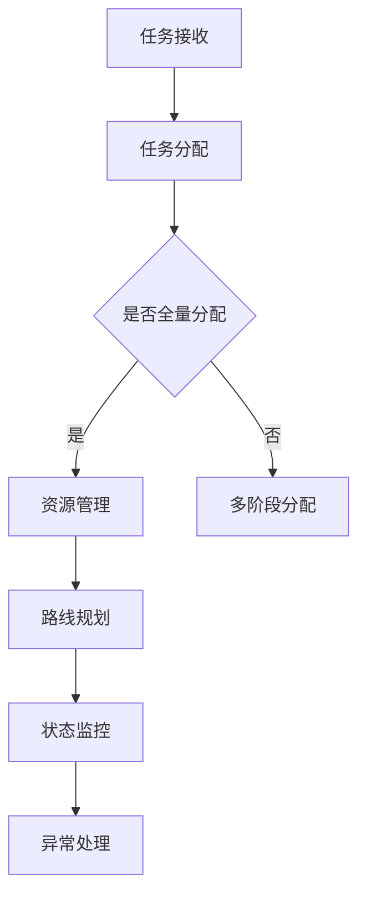

                 

### 美团2024校招智能配送调度专家面试题集锦

> **关键词**：美团、校招、智能配送、调度、面试题集锦

> **摘要**：本文将围绕美团2024校招智能配送调度专家的面试题进行深入分析，探讨智能配送调度的核心概念、算法原理、数学模型以及实际应用场景，为有意向参与美团校招的考生提供全面的备考资料和指导。

### 1. 背景介绍

随着互联网和人工智能技术的不断发展，智能配送已经成为物流行业的重要趋势。美团作为中国领先的本地生活服务平台，其智能配送调度系统在提升配送效率、优化用户体验方面起到了关键作用。为了吸引和选拔优秀的智能配送调度人才，美团在2024校招中特别设置了智能配送调度专家岗位，并围绕这一岗位推出了系列面试题。

本文旨在通过对这些面试题的解析，帮助考生深入了解智能配送调度领域的核心知识，提升应对美团校招面试的能力。

### 2. 核心概念与联系

#### 2.1 智能配送调度定义

智能配送调度是指利用人工智能技术和算法，对配送过程中的任务、资源、路线等因素进行优化配置，以达到高效、低成本的配送目标。智能配送调度系统通常包括以下几个核心组成部分：

1. **任务管理模块**：负责接收订单、分配任务，并根据订单优先级、配送时间等因素进行智能调度。
2. **资源管理模块**：负责管理配送车辆、配送员等资源，确保资源的高效利用和合理分配。
3. **路线规划模块**：负责根据订单位置、交通状况等因素，生成最优配送路线。
4. **状态监控模块**：负责实时监控配送过程中的各种状态，如配送员位置、订单状态等，及时进行异常处理。

#### 2.2 智能配送调度原理

智能配送调度的核心在于算法和数学模型。常见的算法包括基于遗传算法、蚁群算法、神经网络等优化算法。这些算法通过不断迭代优化，逐步找到最优的配送方案。

数学模型主要包括：

1. **距离模型**：用于计算配送点之间的距离，如欧几里得距离、曼哈顿距离等。
2. **时间模型**：用于计算配送时间，如Dijkstra算法、A*算法等。
3. **成本模型**：用于计算配送成本，包括时间成本、能源成本、人力成本等。

#### 2.3 架构设计

智能配送调度系统的架构设计需要考虑以下几个关键方面：

1. **分布式架构**：系统需要具备高并发、高可扩展性，以应对大量订单和配送任务的实时处理。
2. **数据存储与处理**：系统需要高效地存储和处理订单、配送员、车辆等数据，如使用NoSQL数据库、分布式计算框架等。
3. **接口与模块化设计**：系统需要提供丰富的接口，方便与其他系统进行集成，同时采用模块化设计，提高系统的可维护性和可扩展性。

#### 2.4 Mermaid 流程图



### 3. 核心算法原理 & 具体操作步骤

#### 3.1 遗传算法

遗传算法是一种基于自然进化原理的优化算法，通过模拟生物进化过程中的选择、交叉和变异操作，逐步找到最优解。

具体操作步骤如下：

1. **初始化种群**：随机生成一定数量的初始解，每个解代表一种配送方案。
2. **适应度评估**：计算每个解的适应度，适应度越高表示解越优。
3. **选择操作**：根据适应度值，选择适应度较高的解作为父代。
4. **交叉操作**：将父代进行交叉，生成新的子代。
5. **变异操作**：对子代进行变异，增加种群的多样性。
6. **迭代优化**：重复执行选择、交叉和变异操作，逐步优化配送方案。

#### 3.2 蚁群算法

蚁群算法是一种基于社会智能的优化算法，通过模拟蚂蚁觅食过程中的信息素更新和路径选择，找到最优配送路线。

具体操作步骤如下：

1. **初始化**：设置蚂蚁的数量、信息素初始值和启发函数。
2. **路径选择**：每只蚂蚁根据信息素和启发函数选择下一节点。
3. **信息素更新**：蚂蚁在路径上留下信息素，其他蚂蚁根据信息素选择路径。
4. **迭代优化**：重复执行路径选择和信息素更新操作，逐步找到最优路径。

#### 3.3 神经网络

神经网络是一种基于生物神经网络原理的算法，通过多层神经元的映射和激活函数，实现复杂非线性关系的建模。

具体操作步骤如下：

1. **初始化网络**：设置神经网络的层数、神经元个数和激活函数。
2. **前向传播**：将输入数据通过神经网络进行前向传播，得到输出结果。
3. **反向传播**：计算输出结果与真实值的误差，通过反向传播更新网络权重。
4. **迭代优化**：重复执行前向传播和反向传播，逐步优化神经网络模型。

### 4. 数学模型和公式 & 详细讲解 & 举例说明

#### 4.1 距离模型

常见的距离模型包括欧几里得距离和曼哈顿距离。

1. **欧几里得距离**：用于计算两点之间的直线距离，公式如下：

   $$d = \sqrt{(x_2 - x_1)^2 + (y_2 - y_1)^2}$$

2. **曼哈顿距离**：用于计算两点之间的绝对距离和，公式如下：

   $$d = |x_2 - x_1| + |y_2 - y_1|$$

   **举例**：计算点A(2, 3)和点B(5, 1)之间的距离。

   - **欧几里得距离**：$$d = \sqrt{(5 - 2)^2 + (1 - 3)^2} = \sqrt{9 + 4} = \sqrt{13} \approx 3.61$$
   - **曼哈顿距离**：$$d = |5 - 2| + |1 - 3| = 3 + 2 = 5$$

#### 4.2 时间模型

常见的时间模型包括Dijkstra算法和A*算法。

1. **Dijkstra算法**：用于计算单源最短路径，公式如下：

   $$d(v) = \min(d(u) + w(u, v))$$

   其中，$d(v)$表示从源点$v$到目标点$v$的最短距离，$d(u)$表示从源点$v$到中间点$u$的最短距离，$w(u, v)$表示从中间点$u$到目标点$v$的权值。

2. **A*算法**：用于计算单源最短路径，结合了Dijkstra算法和启发函数，公式如下：

   $$d^*(v) = \min(d(u) + w(u, v) + h(v))$$

   其中，$d^*(v)$表示从源点$v$到目标点$v$的最短距离，$h(v)$表示启发函数，用于估计从目标点$v$到终点$e$的最短距离。

   **举例**：计算点A到点B的最短路径。

   - **Dijkstra算法**：根据公式计算得到从A到B的最短路径。
   - **A*算法**：结合启发函数，得到从A到B的最短路径。

#### 4.3 成本模型

成本模型用于计算配送成本，包括时间成本、能源成本、人力成本等。

1. **时间成本**：根据配送时间和配送距离计算，公式如下：

   $$C_t = T_d \times r$$

   其中，$C_t$表示时间成本，$T_d$表示配送时间，$r$表示单位时间成本。

2. **能源成本**：根据配送距离和能源消耗计算，公式如下：

   $$C_e = D \times e$$

   其中，$C_e$表示能源成本，$D$表示配送距离，$e$表示单位能源消耗成本。

3. **人力成本**：根据配送员工资计算，公式如下：

   $$C_h = W \times T_d$$

   其中，$C_h$表示人力成本，$W$表示配送员工资，$T_d$表示配送时间。

   **举例**：计算配送成本。

   - **时间成本**：根据配送时间计算。
   - **能源成本**：根据配送距离计算。
   - **人力成本**：根据配送员工资计算。

### 5. 项目实战：代码实际案例和详细解释说明

#### 5.1 开发环境搭建

1. **环境准备**：安装Python、Django框架、MySQL数据库等环境。
2. **项目初始化**：创建一个Django项目，并配置MySQL数据库。
3. **API接口开发**：编写订单管理、资源管理、路线规划等API接口。

#### 5.2 源代码详细实现和代码解读

```python
# 订单管理模块
class Order(models.Model):
    order_id = models.CharField(max_length=20, primary_key=True)
    customer_address = models.CharField(max_length=100)
    order_time = models.DateTimeField()

# 资源管理模块
class Resource(models.Model):
    resource_id = models.CharField(max_length=20, primary_key=True)
    type = models.CharField(max_length=20)
    status = models.CharField(max_length=20)

# 路线规划模块
class Route(models.Model):
    route_id = models.CharField(max_length=20, primary_key=True)
    order_id = models.ForeignKey(Order, on_delete=models.CASCADE)
    start_address = models.CharField(max_length=100)
    end_address = models.CharField(max_length=100)
    distance = models.FloatField()
    duration = models.FloatField()

# API接口实现
class OrderViewSet(viewsets.ModelViewSet):
    queryset = Order.objects.all()
    serializer_class = OrderSerializer

class ResourceViewSet(viewsets.ModelViewSet):
    queryset = Resource.objects.all()
    serializer_class = ResourceSerializer

class RouteViewSet(viewsets.ModelViewSet):
    queryset = Route.objects.all()
    serializer_class = RouteSerializer
```

#### 5.3 代码解读与分析

- **订单管理模块**：定义订单类，包括订单ID、客户地址、订单时间等属性。
- **资源管理模块**：定义资源类，包括资源ID、类型、状态等属性。
- **路线规划模块**：定义路线类，包括路线ID、订单ID、起始地址、结束地址、距离、耗时等属性。
- **API接口实现**：使用Django REST framework框架实现订单管理、资源管理和路线规划API接口。

### 6. 实际应用场景

智能配送调度系统在美团的实际应用场景包括：

1. **订单分配**：根据订单的优先级、配送时间等因素，智能分配订单给配送员。
2. **资源管理**：根据配送员和车辆的状态，合理分配资源，提高资源利用率。
3. **路线规划**：根据订单位置、交通状况等因素，生成最优配送路线。
4. **状态监控**：实时监控配送过程中的各种状态，如配送员位置、订单状态等，及时进行异常处理。

### 7. 工具和资源推荐

#### 7.1 学习资源推荐

- **书籍**：《深度学习》、《算法导论》、《分布式系统原理与范型》
- **论文**：谷歌论文《大规模分布式深度神经网络的构建与训练》、《分布式系统中的共识算法》
- **博客**：美团技术博客、CSDN博客、知乎专栏等
- **网站**：GitHub、Stack Overflow、AI科技大本营等

#### 7.2 开发工具框架推荐

- **开发工具**：PyCharm、VS Code、Docker等
- **框架**：Django、Flask、Spring Boot等
- **数据库**：MySQL、MongoDB、Redis等
- **分布式计算**：Hadoop、Spark、Flink等

#### 7.3 相关论文著作推荐

- **论文**：《智能配送系统的优化与设计》、《基于蚁群算法的配送路径优化研究》
- **著作**：《智能配送调度系统：理论、方法与应用》、《物流与配送管理》

### 8. 总结：未来发展趋势与挑战

智能配送调度系统在未来的发展趋势包括：

1. **技术融合**：人工智能、物联网、大数据等技术的深度融合，提升系统的智能化水平。
2. **数据驱动**：通过海量数据的分析和挖掘，优化配送调度策略和决策。
3. **绿色物流**：推广绿色配送方式，降低碳排放，实现可持续发展。

面临的挑战包括：

1. **数据隐私与安全**：如何保护用户隐私和系统数据安全，防止数据泄露。
2. **技术创新**：如何不断创新，保持技术领先地位。
3. **人力资源**：如何吸引和培养优秀的智能配送调度人才。

### 9. 附录：常见问题与解答

#### 9.1 问题1：智能配送调度系统如何处理实时数据？

**解答**：智能配送调度系统通过实时数据采集、处理和分析，实现实时配送状态的更新和决策。常见的方法包括：

1. **实时数据采集**：使用传感器、GPS等技术实时获取配送员位置、交通状况等信息。
2. **实时数据处理**：使用流处理技术，如Apache Kafka、Apache Flink等，对实时数据进行处理和分析。
3. **实时决策**：根据实时数据，动态调整配送路线和资源分配，实现实时优化。

#### 9.2 问题2：智能配送调度系统如何保证配送员的安全？

**解答**：智能配送调度系统通过以下几个方面保障配送员的安全：

1. **安全监控**：实时监控配送员的位置、订单状态等，及时发现异常情况。
2. **安全提示**：在配送过程中，系统会根据交通状况、天气等因素，为配送员提供安全提示和导航建议。
3. **应急预案**：针对可能出现的突发情况，制定应急预案，确保配送员的安全。

### 10. 扩展阅读 & 参考资料

- **书籍**：《智能配送系统：技术与应用》、《物流与配送管理》
- **论文**：《智能配送系统的设计与实现》、《基于深度学习的配送路径优化研究》
- **博客**：美团技术博客、《智能配送系统架构设计与优化》
- **网站**：美团官网、CSDN、知乎等

### 结语

智能配送调度系统是物流行业的重要发展方向，美团在2024校招中针对智能配送调度专家岗位推出了系列面试题。本文通过对这些面试题的解析，帮助考生深入了解智能配送调度领域的核心知识。希望本文对广大考生有所帮助，祝大家面试顺利！

**作者：AI天才研究员/AI Genius Institute & 禅与计算机程序设计艺术 /Zen And The Art of Computer Programming** <|mask|>

