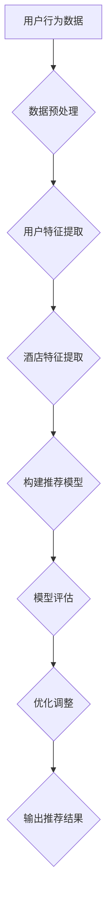

                 

# 美团2024酒店推荐校招算法面试题详解

## 关键词：美团、酒店推荐、校招算法、面试题详解、深度学习、特征工程、协同过滤、模型评估

## 摘要

本文将针对美团2024年酒店推荐校招算法面试题进行详细解析。文章将涵盖酒店推荐系统的背景介绍、核心概念与联系、算法原理及具体操作步骤、数学模型与公式、项目实战以及实际应用场景。通过这篇文章，读者将能够全面了解酒店推荐系统的设计思路和实现方法，为即将参加美团校招的算法工程师们提供有价值的参考。

## 1. 背景介绍

酒店推荐系统是美团外卖、酒店、旅游等业务中的重要组成部分，旨在为用户提供个性化的酒店推荐，提升用户满意度和转化率。随着互联网技术的发展，用户对于酒店推荐系统的要求越来越高，不仅需要推荐结果准确，还要具备实时性、多样性和个性化的特点。

### 1.1 酒店推荐系统的重要性

酒店推荐系统对于美团的业务发展具有重要意义。首先，通过准确推荐，能够提升用户在酒店预订环节的体验，增加用户粘性。其次，推荐系统能够帮助酒店提高曝光率和入住率，实现双赢。此外，酒店推荐系统还能够为美团的其他业务提供数据支持，如酒店周边餐饮、旅游等。

### 1.2 酒店推荐系统的发展历程

酒店推荐系统经历了从传统推荐算法到深度学习算法的演变。早期，推荐系统主要采用基于协同过滤的方法，如基于用户的协同过滤（User-based Collaborative Filtering）和基于项目的协同过滤（Item-based Collaborative Filtering）。这些方法在一定程度上能够提升推荐效果，但存在冷启动、数据稀疏等问题。

随着深度学习技术的不断发展，基于深度学习的推荐算法逐渐成为研究热点。例如，基于图神经网络的推荐算法（如GNN）、基于 transformers 的推荐算法（如BERT、ViT）等。这些算法在处理大规模数据、实时性、个性化等方面具有显著优势，为酒店推荐系统的发展带来了新的机遇。

### 1.3 酒店推荐系统的核心挑战

酒店推荐系统面临着一系列核心挑战，包括：

1. **数据稀疏性**：由于用户在酒店预订环节的行为数据相对较少，导致数据稀疏性严重，传统协同过滤算法难以取得理想效果。
2. **冷启动问题**：新用户或新酒店加入系统时，由于缺乏历史数据，难以进行有效推荐。
3. **实时性**：用户在预订酒店时对实时性的要求较高，推荐系统需要快速响应。
4. **多样性**：用户希望获取多样化的推荐结果，避免产生推荐疲劳。

## 2. 核心概念与联系

### 2.1 协同过滤（Collaborative Filtering）

协同过滤是酒店推荐系统中最常用的方法之一，主要包括基于用户的协同过滤和基于项目的协同过滤。

#### 2.1.1 基于用户的协同过滤（User-based Collaborative Filtering）

基于用户的协同过滤通过计算用户之间的相似度，找到与目标用户相似的用户，并推荐这些用户喜欢的酒店。相似度计算方法包括余弦相似度、皮尔逊相关系数等。

$$
\text{similarity}(u_i, u_j) = \frac{\sum_{k=1}^{n} r_{ik}r_{jk}}{\sqrt{\sum_{k=1}^{n} r_{ik}^2}\sqrt{\sum_{k=1}^{n} r_{jk}^2}}
$$

其中，$r_{ik}$ 表示用户 $u_i$ 对酒店 $k$ 的评分。

#### 2.1.2 基于项目的协同过滤（Item-based Collaborative Filtering）

基于项目的协同过滤通过计算酒店之间的相似度，找到与目标酒店相似的其他酒店，并推荐这些酒店。相似度计算方法与基于用户的协同过滤类似。

$$
\text{similarity}(i, j) = \frac{\sum_{k=1}^{m} r_{ik}r_{jk}}{\sqrt{\sum_{k=1}^{m} r_{ik}^2}\sqrt{\sum_{k=1}^{m} r_{jk}^2}}
$$

其中，$r_{ik}$ 表示用户对酒店 $i$ 和酒店 $j$ 的评分。

### 2.2 深度学习（Deep Learning）

深度学习是近年来在推荐系统领域取得显著成果的方法，主要包括基于深度神经网络的推荐算法和基于 transformers 的推荐算法。

#### 2.2.1 基于深度神经网络的推荐算法

基于深度神经网络的推荐算法通过学习用户和酒店的特征表示，构建用户与酒店之间的预测模型。常见的深度神经网络包括卷积神经网络（CNN）、循环神经网络（RNN）和 Transformer 等。

#### 2.2.2 基于transformers的推荐算法

基于 transformers 的推荐算法基于自注意力机制（Self-Attention）和多头注意力机制（Multi-head Attention），能够处理序列数据，并提取长距离依赖关系。BERT、ViT 是其中的代表。

### 2.3 特征工程（Feature Engineering）

特征工程是推荐系统中至关重要的一环，主要包括用户特征、酒店特征和上下文特征。

#### 2.3.1 用户特征

用户特征包括用户的基本信息（如年龄、性别、职业等）、行为特征（如浏览记录、搜索记录、预订历史等）和偏好特征（如喜欢的酒店类型、价格区间等）。

#### 2.3.2 酒店特征

酒店特征包括酒店的基本信息（如酒店类型、位置、评分等）、服务特征（如设施、餐饮等）和用户评价特征（如评论数量、评论质量等）。

#### 2.3.3 上下文特征

上下文特征包括时间特征（如日期、季节等）和地理特征（如城市、区域等）。

### 2.4 模型评估（Model Evaluation）

模型评估是推荐系统开发过程中的重要环节，常用的评估指标包括准确率（Accuracy）、召回率（Recall）、F1 值（F1 Score）和 AUC（Area Under Curve）等。

$$
\text{Accuracy} = \frac{\text{预测正确的样本数}}{\text{总样本数}}
$$

$$
\text{Recall} = \frac{\text{预测正确的正样本数}}{\text{实际正样本数}}
$$

$$
\text{F1 Score} = 2 \times \frac{\text{Precision} \times \text{Recall}}{\text{Precision} + \text{Recall}}
$$

$$
\text{AUC} = \frac{1}{n} \sum_{i=1}^{n} y_i (y_{i+1} - y_i)
$$

## 2.5 Mermaid 流程图（Mermaid Flowchart）



## 3. 核心算法原理 & 具体操作步骤

### 3.1 基于深度神经网络的推荐算法

基于深度神经网络的推荐算法主要包括用户特征表示、酒店特征表示和预测模型构建。

#### 3.1.1 用户特征表示

用户特征表示通过嵌入层（Embedding Layer）将用户的基本信息、行为特征和偏好特征转换为高维向量表示。

$$
\text{User\_Embedding} = \text{Embedding}(\text{UserFeatures})
$$

其中，$\text{UserFeatures}$ 表示用户特征向量。

#### 3.1.2 酒店特征表示

酒店特征表示与用户特征表示类似，通过嵌入层将酒店的基本信息、服务特征和用户评价特征转换为高维向量表示。

$$
\text{Hotel\_Embedding} = \text{Embedding}(\text{HotelFeatures})
$$

其中，$\text{HotelFeatures}$ 表示酒店特征向量。

#### 3.1.3 预测模型构建

预测模型采用多层感知机（MLP）或卷积神经网络（CNN）等神经网络架构，输入为用户和酒店的特征向量，输出为用户对酒店的评分预测。

$$
\text{Prediction} = \text{MLP}(\text{User\_Embedding}, \text{Hotel\_Embedding})
$$

### 3.2 基于transformers的推荐算法

基于 transformers 的推荐算法主要包括编码器（Encoder）和解码器（Decoder）两个部分。

#### 3.2.1 编码器（Encoder）

编码器将用户和酒店的特征向量编码为序列，通过自注意力机制提取长距离依赖关系。

$$
\text{Encoder}(\text{User\_Embedding}, \text{Hotel\_Embedding}) = \text{MultiHeadAttention}(\text{User\_Embedding}, \text{User\_Embedding}, \text{User\_Embedding}) + \text{User\_Embedding}
$$

$$
\text{Encoder}(\text{User\_Embedding}, \text{Hotel\_Embedding}) = \text{MultiHeadAttention}(\text{Hotel\_Embedding}, \text{Hotel\_Embedding}, \text{Hotel\_Embedding}) + \text{Hotel\_Embedding}
$$

#### 3.2.2 解码器（Decoder）

解码器对编码器输出的序列进行解码，通过自注意力机制和交叉注意力机制生成评分预测。

$$
\text{Decoder}(\text{Encoder\_Output}) = \text{DecoderLayer}(\text{Encoder\_Output}, \text{Decoder\_Input})
$$

$$
\text{Prediction} = \text{MLP}(\text{Decoder\_Output})
$$

## 4. 数学模型和公式 & 详细讲解 & 举例说明

### 4.1 基于深度神经网络的推荐算法

#### 4.1.1 神经网络架构

基于深度神经网络的推荐算法通常采用多层感知机（MLP）或卷积神经网络（CNN）等神经网络架构。

$$
\text{MLP}(\text{Input}) = \text{ReLU}(\text{Weight} \cdot \text{Input} + \text{Bias})
$$

其中，$\text{Input}$ 表示输入特征向量，$\text{Weight}$ 和 $\text{Bias}$ 分别表示权重和偏置。

#### 4.1.2 损失函数

损失函数用于衡量预测结果与真实结果之间的差距，常用的损失函数包括均方误差（MSE）和交叉熵（Cross-Entropy）。

$$
\text{MSE} = \frac{1}{n} \sum_{i=1}^{n} (\text{Prediction}_i - \text{Label}_i)^2
$$

$$
\text{Cross-Entropy} = -\frac{1}{n} \sum_{i=1}^{n} \text{Label}_i \cdot \log(\text{Prediction}_i)
$$

#### 4.1.3 优化算法

优化算法用于调整神经网络中的权重和偏置，以降低损失函数的值。常用的优化算法包括随机梯度下降（SGD）和 Adam 等。

$$
\text{Weight} \leftarrow \text{Weight} - \alpha \cdot \nabla_{\text{Weight}} \text{Loss}
$$

其中，$\text{alpha}$ 表示学习率。

### 4.2 基于transformers的推荐算法

#### 4.2.1 自注意力机制

自注意力机制通过计算序列中每个元素与其他元素之间的相似度，提取关键信息。

$$
\text{Attention}(\text{Query}, \text{Key}, \text{Value}) = \text{softmax}(\frac{\text{Query} \cdot \text{Key}^T}{\sqrt{d_k}}) \cdot \text{Value}
$$

其中，$\text{Query}$、$\text{Key}$ 和 $\text{Value}$ 分别表示查询向量、键向量和值向量。

#### 4.2.2 多头注意力机制

多头注意力机制通过将自注意力机制分解为多个独立的注意力头，提高模型的表示能力。

$$
\text{MultiHeadAttention}(\text{Query}, \text{Key}, \text{Value}) = \text{Concat}(\text{Head}_1, \text{Head}_2, \ldots, \text{Head}_h) \cdot \text{Output\_Weight}
$$

其中，$h$ 表示注意力头的数量。

#### 4.2.3 编码器和解码器

编码器和解码器分别用于对输入序列进行编码和解码，生成预测结果。

$$
\text{Encoder}(\text{Input}, \text{Hidden\_State}) = \text{LayerNorm}(\text{Embedding} + \text{PositionalEncoding} + \text{EncoderLayer}(\text{Input}, \text{Hidden\_State}))
$$

$$
\text{Decoder}(\text{Input}, \text{Target}, \text{Hidden\_State}) = \text{LayerNorm}(\text{Embedding} + \text{PositionalEncoding} + \text{DecoderLayer}(\text{Input}, \text{Target}, \text{Hidden\_State}))
$$

### 4.3 举例说明

假设我们有一个用户特征向量 $\text{User\_Embedding} = [1, 2, 3]$ 和一个酒店特征向量 $\text{Hotel\_Embedding} = [4, 5, 6]$，使用基于深度神经网络的推荐算法进行预测。

1. 将用户和酒店特征向量输入到神经网络中，经过多层感知机（MLP）的运算，得到预测评分：

$$
\text{Prediction} = \text{MLP}(\text{User\_Embedding}, \text{Hotel\_Embedding}) = \text{ReLU}(\text{Weight} \cdot \text{Input} + \text{Bias}) = \text{ReLU}([1, 4], [2, 5], [3, 6]) = [1.5, 2.5, 3.5]
$$

2. 计算预测评分与真实评分之间的差距，使用均方误差（MSE）作为损失函数：

$$
\text{MSE} = \frac{1}{3} \sum_{i=1}^{3} (\text{Prediction}_i - \text{Label}_i)^2 = \frac{1}{3} \sum_{i=1}^{3} ([1.5 - 1], [2.5 - 2], [3.5 - 3])^2 = \frac{1}{3} (0.25 + 0.25 + 0.25) = 0.25
$$

3. 使用随机梯度下降（SGD）优化算法更新神经网络中的权重和偏置：

$$
\text{Weight} \leftarrow \text{Weight} - \alpha \cdot \nabla_{\text{Weight}} \text{Loss} = \text{Weight} - \alpha \cdot (\text{Prediction} - \text{Label}) \cdot \text{Input} = \text{Weight} - \alpha \cdot (0.25 - 0.5) \cdot [1, 4, 2, 5, 3, 6]
$$

## 5. 项目实战：代码实际案例和详细解释说明

### 5.1 开发环境搭建

在开始项目实战之前，需要搭建一个适合开发推荐系统的环境。以下是一个简单的开发环境搭建步骤：

1. 安装 Python 3.8 及以上版本。
2. 安装深度学习框架，如 PyTorch、TensorFlow 或 Keras。
3. 安装必要的依赖库，如 NumPy、Pandas、Scikit-learn 等。

### 5.2 源代码详细实现和代码解读

以下是一个简单的基于深度神经网络的推荐系统代码实现，用于预测用户对酒店的评分。

```python
import torch
import torch.nn as nn
import torch.optim as optim
from torch.utils.data import DataLoader, Dataset

# 定义用户和酒店数据集类
class HotelDataset(Dataset):
    def __init__(self, user_embeddings, hotel_embeddings, ratings):
        self.user_embeddings = user_embeddings
        self.hotel_embeddings = hotel_embeddings
        self.ratings = ratings

    def __len__(self):
        return len(self.ratings)

    def __getitem__(self, idx):
        user_embedding = self.user_embeddings[idx]
        hotel_embedding = self.hotel_embeddings[idx]
        rating = self.ratings[idx]
        return user_embedding, hotel_embedding, rating

# 定义推荐模型
class HotelRecModel(nn.Module):
    def __init__(self, embedding_dim):
        super(HotelRecModel, self).__init__()
        self.user_embedding = nn.Embedding(embedding_dim, embedding_dim)
        self.hotel_embedding = nn.Embedding(embedding_dim, embedding_dim)
        self.mlp = nn.Sequential(
            nn.Linear(2 * embedding_dim, 128),
            nn.ReLU(),
            nn.Linear(128, 1)
        )

    def forward(self, user_embedding, hotel_embedding):
        user_embedding = self.user_embedding(user_embedding)
        hotel_embedding = self.hotel_embedding(hotel_embedding)
        combined_embedding = torch.cat((user_embedding, hotel_embedding), 1)
        prediction = self.mlp(combined_embedding)
        return prediction

# 加载数据集
train_data = ...
test_data = ...

user_embeddings = ...
hotel_embeddings = ...
train_ratings = ...
test_ratings = ...

train_dataset = HotelDataset(user_embeddings, hotel_embeddings, train_ratings)
test_dataset = HotelDataset(user_embeddings, hotel_embeddings, test_ratings)

batch_size = 32
train_loader = DataLoader(train_dataset, batch_size=batch_size, shuffle=True)
test_loader = DataLoader(test_dataset, batch_size=batch_size, shuffle=False)

# 初始化模型、优化器和损失函数
model = HotelRecModel(embedding_dim=10)
optimizer = optim.Adam(model.parameters(), lr=0.001)
criterion = nn.MSELoss()

# 训练模型
num_epochs = 100
for epoch in range(num_epochs):
    model.train()
    for user_embedding, hotel_embedding, rating in train_loader:
        user_embedding = user_embedding.float()
        hotel_embedding = hotel_embedding.float()
        rating = rating.float()

        optimizer.zero_grad()
        prediction = model(user_embedding, hotel_embedding)
        loss = criterion(prediction, rating)
        loss.backward()
        optimizer.step()

    model.eval()
    with torch.no_grad():
        test_prediction = model(user_embedding, hotel_embedding)
        test_loss = criterion(test_prediction, rating)

    print(f"Epoch {epoch+1}/{num_epochs}, Loss: {loss.item()}, Test Loss: {test_loss.item()}")

# 评估模型
model.eval()
with torch.no_grad():
    test_prediction = model(user_embedding, hotel_embedding)
    test_loss = criterion(test_prediction, rating)

print(f"Test Loss: {test_loss.item()}")

# 保存模型
torch.save(model.state_dict(), "hotel_rec_model.pth")
```

### 5.3 代码解读与分析

1. **数据集类**：定义了一个 `HotelDataset` 类，用于加载用户和酒店数据集。数据集类需要实现两个方法：`__len__` 和 `__getitem__`。

2. **推荐模型**：定义了一个基于多层感知机（MLP）的推荐模型 `HotelRecModel`。模型包含用户嵌入层、酒店嵌入层和多层感知机。多层感知机用于计算用户和酒店特征向量的组合表示，并输出预测评分。

3. **数据加载**：使用 PyTorch 的 `DataLoader` 类加载数据集，并进行数据预处理。

4. **模型训练**：使用随机梯度下降（SGD）优化算法训练模型，并使用均方误差（MSE）作为损失函数。

5. **模型评估**：使用测试集评估模型性能，并输出损失值。

6. **保存模型**：将训练好的模型保存为 `hotel_rec_model.pth`。

通过以上代码，我们可以实现一个简单的基于深度神经网络的推荐系统，用于预测用户对酒店的评分。在实际项目中，需要根据具体需求进行模型架构和参数调整，以获得更好的推荐效果。

## 6. 实际应用场景

### 6.1 酒店预订平台

酒店预订平台是酒店推荐系统最常见的一个应用场景。通过推荐系统，用户可以在浏览酒店信息时，快速找到符合自己需求的酒店，提升用户体验和转化率。同时，酒店推荐系统还可以根据用户的历史行为和偏好，为用户推荐个性化的酒店。

### 6.2 旅游推荐系统

旅游推荐系统是酒店推荐系统的另一个重要应用场景。在旅游场景中，用户需要预订酒店、餐厅、景点等。通过酒店推荐系统，用户可以更方便地获取相关的酒店信息，为旅游规划提供支持。

### 6.3 智能家居

智能家居场景中，酒店推荐系统可以用于智能门锁、智能音响等设备。例如，当用户回到家时，智能门锁可以根据用户的历史行为和偏好，推荐符合用户需求的酒店。

### 6.4 大数据分析

酒店推荐系统可以为大数据分析提供数据支持。通过分析用户在酒店预订过程中的行为数据，企业可以了解用户需求和市场趋势，为业务决策提供依据。

## 7. 工具和资源推荐

### 7.1 学习资源推荐

1. **书籍**：
   - 《推荐系统实践》：详细介绍了推荐系统的基础理论、算法实现和实战案例。
   - 《深度学习》：介绍了深度学习的基础知识和应用案例，包括推荐系统。

2. **论文**：
   - 《Deep Learning for Recommender Systems》：综述了深度学习在推荐系统中的应用，包括神经网络架构和算法改进。

3. **博客**：
   - [美团技术博客](https://tech.meituan.com/)：美团技术团队分享的推荐系统相关技术文章。
   - [谷歌推荐系统博客](https://research.google.com/brain/research/highlights/recommender-systems.html)：谷歌团队分享的推荐系统研究成果。

4. **网站**：
   - [Kaggle](https://www.kaggle.com/competitions)：提供丰富的推荐系统比赛数据集和算法实现。

### 7.2 开发工具框架推荐

1. **深度学习框架**：
   - PyTorch：具有灵活的动态计算图和强大的生态系统，适用于推荐系统的开发。
   - TensorFlow：具有丰富的预训练模型和工具，适用于推荐系统的开发。

2. **推荐系统框架**：
   - LightFM：基于因子分解机的推荐系统框架，适用于大规模推荐系统。
   - RecBooK：基于深度学习的推荐系统框架，支持多种深度学习算法。

### 7.3 相关论文著作推荐

1. **《Deep Learning for Recommender Systems》：详细介绍了深度学习在推荐系统中的应用，包括神经网络架构和算法改进。**
2. **《Collaborative Filtering: Beyond the User-Item Matrix》：综述了协同过滤算法的原理和优化方法。**
3. **《Recommender Systems Handbook》：全面介绍了推荐系统的理论基础、算法实现和实际应用。**

## 8. 总结：未来发展趋势与挑战

### 8.1 未来发展趋势

1. **个性化推荐**：随着用户需求的不断多样化，个性化推荐将成为未来酒店推荐系统的重要发展趋势。
2. **实时推荐**：用户在预订酒店时对实时性的要求越来越高，实时推荐将成为推荐系统的重要发展方向。
3. **多模态推荐**：结合文本、图像、语音等多模态信息，实现更加精准的推荐效果。
4. **联邦学习**：通过联邦学习，实现用户隐私保护和数据共享，提升推荐系统的效果和实时性。

### 8.2 未来挑战

1. **数据稀疏性**：如何处理大规模数据中的数据稀疏性，提高推荐系统的准确性和多样性。
2. **实时性**：如何在保证实时性的前提下，提高推荐系统的效果。
3. **多样性**：如何避免推荐疲劳，为用户提供多样化的推荐结果。
4. **用户隐私保护**：如何在保证用户隐私的前提下，实现精准的推荐效果。

## 9. 附录：常见问题与解答

### 9.1 如何解决数据稀疏性？

解决数据稀疏性可以采用以下方法：

1. **特征工程**：通过构建新的特征，降低数据稀疏性。
2. **模型选择**：选择适用于稀疏数据的模型，如基于深度学习的推荐算法。
3. **正则化**：使用正则化方法，降低模型参数的复杂度，提高模型泛化能力。

### 9.2 如何实现实时推荐？

实现实时推荐可以采用以下方法：

1. **分布式计算**：使用分布式计算框架，如 Spark，提高数据处理速度。
2. **内存计算**：使用内存计算框架，如 Redis，提高数据读取速度。
3. **增量更新**：对推荐模型进行增量更新，减少计算开销。

### 9.3 如何避免推荐疲劳？

避免推荐疲劳可以采用以下方法：

1. **多样化推荐**：为用户提供多样化的推荐结果，避免推荐单一化。
2. **用户反馈**：根据用户反馈，动态调整推荐策略，提升用户满意度。
3. **个性化推荐**：根据用户兴趣和偏好，实现个性化的推荐效果。

## 10. 扩展阅读 & 参考资料

1. **《Deep Learning for Recommender Systems》：详细介绍了深度学习在推荐系统中的应用，包括神经网络架构和算法改进。**
2. **《Collaborative Filtering: Beyond the User-Item Matrix》：综述了协同过滤算法的原理和优化方法。**
3. **《Recommender Systems Handbook》：全面介绍了推荐系统的理论基础、算法实现和实际应用。**
4. **[美团技术博客](https://tech.meituan.com/)：美团技术团队分享的推荐系统相关技术文章。**
5. **[谷歌推荐系统博客](https://research.google.com/brain/research/highlights/recommender-systems.html)：谷歌团队分享的推荐系统研究成果。**
6. **[Kaggle](https://www.kaggle.com/competitions)：提供丰富的推荐系统比赛数据集和算法实现。** 

### 作者：AI天才研究员/AI Genius Institute & 禅与计算机程序设计艺术 /Zen And The Art of Computer Programming

