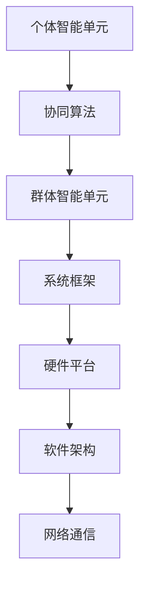

                 

# 群体智慧：人类计算的未来之路

> **关键词：** 群体智慧、分布式计算、协同算法、人工智能、边缘计算、物联网、智能系统
>
> **摘要：** 本文深入探讨了群体智慧的概念及其在人类计算中的重要作用。通过对核心概念、算法原理、数学模型和应用场景的详细分析，揭示了群体智慧技术如何推动计算领域的发展，并展望了未来的趋势和挑战。

## 1. 背景介绍

群体智慧（Collective Intelligence，CI）是一个跨学科的研究领域，它关注的是如何通过组织大量个体的智能行为，实现比单个个体更为复杂的决策和任务执行。群体智慧的研究起源于生物学、社会学和计算机科学等领域，例如，蚂蚁的集体觅食行为、蜜蜂的群体决策等都是群体智慧的典型实例。

在计算机科学中，群体智慧的概念逐渐演变为分布式计算、协同算法和智能系统的重要组成部分。随着互联网、物联网和边缘计算的普及，个体间的协作和通信变得更加容易，这使得群体智慧的应用场景越来越广泛。

群体智慧技术的发展对于解决许多复杂问题具有重要意义。例如，在数据密集型任务中，如大规模数据分析、机器学习模型的训练等，群体智慧可以通过分布式计算方式提高处理效率；在智能系统中，如自动驾驶、智能家居等，群体智慧可以实现更为智能的决策和协同控制。

## 2. 核心概念与联系

### 2.1. 群体智慧的核心概念

群体智慧涉及多个核心概念，包括个体、群体、协作和智能等。以下是这些概念的基本定义和联系：

#### 个体

个体是指参与群体智慧系统的基本单元，可以是人、机器或其他智能体。个体具有自己的感知能力、行为能力和决策能力。

#### 群体

群体是由多个个体组成的集合，这些个体通过一定的协作机制共同完成特定任务。群体具有整体行为和属性，可以通过群体行为实现比单个个体更为复杂的决策和任务执行。

#### 协作

协作是指个体之间通过信息交换和行为协调来实现共同目标的过程。协作机制是群体智慧系统中的关键，它决定了个体间的交互方式和群体行为的效果。

#### 智能

智能是指个体或群体在感知、理解和处理信息的基础上，进行决策和行为的能力。群体智慧依赖于个体智能和群体智能的结合，通过协同实现更高效的智能行为。

### 2.2. 群体智慧架构

群体智慧系统的架构通常包括以下几个关键部分：

#### 个体智能单元

个体智能单元是群体智慧系统的基础，它负责执行具体的任务，如数据收集、处理和决策。

#### 协同算法

协同算法是群体智慧系统的核心，它负责协调个体智能单元之间的信息交换和行为协同。常见的协同算法包括分布式算法、协同过滤、博弈论等。

#### 群体智能单元

群体智能单元是多个个体智能单元的集成，它负责实现群体级的决策和任务执行。群体智能单元通常具有更高的智能水平和更复杂的决策过程。

#### 系统框架

系统框架是群体智慧系统的总体结构，它包括硬件平台、软件架构和网络通信等组成部分。系统框架的设计和实现决定了群体智慧系统的性能和可扩展性。

### 2.3. Mermaid 流程图

以下是一个简单的 Mermaid 流程图，展示了群体智慧系统的基本架构和关键组件：



在 Mermaid 流程图中，我们使用了节点（如 A、B、C）来表示个体智能单元、协同算法、群体智能单元等关键组件，并使用箭头表示组件之间的关联和交互。请注意，流程图中的节点名称中不应包含括号、逗号等特殊字符，以确保流程图的正确显示。

## 3. 核心算法原理 & 具体操作步骤

### 3.1. 分布式算法

分布式算法是群体智慧系统中的一种关键算法，它通过将任务分配给多个个体智能单元，实现并行计算和协同处理。以下是一个简单的分布式算法原理和操作步骤：

#### 原理

分布式算法的基本原理是将一个大任务分解成多个小任务，然后分配给不同的个体智能单元执行。每个个体智能单元独立完成任务后，将结果汇总，实现整体任务的完成。

#### 操作步骤

1. **任务分解**：将大任务分解成多个小任务，并根据个体智能单元的能力和负载情况，分配小任务给不同的个体。
2. **任务执行**：每个个体智能单元根据分配的任务，独立执行计算和处理，生成中间结果。
3. **结果汇总**：将所有个体智能单元的中间结果汇总，进行进一步处理和整合，得到最终结果。

### 3.2. 协同过滤

协同过滤是群体智慧系统中的一种常见算法，用于基于用户行为和偏好进行推荐。以下是一个简单的协同过滤算法原理和操作步骤：

#### 原理

协同过滤算法的基本原理是利用用户之间的相似性，通过分析用户的行为和偏好，为用户推荐他们可能感兴趣的内容。

#### 操作步骤

1. **用户行为收集**：收集用户在系统中的行为数据，如浏览记录、购买历史等。
2. **用户偏好计算**：计算用户之间的相似性，并基于相似性计算用户偏好。
3. **推荐生成**：根据用户偏好，为用户生成推荐内容。

### 3.3. 博弈论

博弈论是群体智慧系统中的一种重要理论工具，用于分析个体在竞争和协作环境中的行为。以下是一个简单的博弈论原理和操作步骤：

#### 原理

博弈论的基本原理是分析个体在特定环境下的行为策略，以及这些策略对个体和整体的影响。

#### 操作步骤

1. **环境建模**：建立博弈模型，描述个体之间的竞争和协作关系。
2. **策略分析**：分析个体在不同策略下的收益和损失，确定最优策略。
3. **决策生成**：根据分析结果，生成个体的决策策略。

## 4. 数学模型和公式 & 详细讲解 & 举例说明

### 4.1. 分布式算法的数学模型

分布式算法的数学模型通常包括任务分配模型和结果汇总模型。以下是一个简单的分布式算法数学模型：

#### 任务分配模型

假设有 \( n \) 个个体智能单元，需要执行 \( m \) 个小任务。任务分配模型可以用以下公式表示：

\[ T_i = \frac{T}{n} \]

其中，\( T_i \) 表示第 \( i \) 个个体智能单元分配到的任务量，\( T \) 表示总任务量。

#### 结果汇总模型

假设每个个体智能单元独立执行任务后，生成中间结果 \( R_i \)。结果汇总模型可以用以下公式表示：

\[ R = \sum_{i=1}^{n} R_i \]

其中，\( R \) 表示最终结果，\( R_i \) 表示第 \( i \) 个个体智能单元的中间结果。

### 4.2. 协同过滤的数学模型

协同过滤的数学模型通常包括用户相似性计算模型和推荐生成模型。以下是一个简单的协同过滤数学模型：

#### 用户相似性计算模型

假设有 \( n \) 个用户，每个用户的行为数据可以用向量表示。用户相似性计算模型可以用以下公式表示：

\[ s_{ij} = \frac{\sum_{k=1}^{m} x_{ik} x_{jk}}{\sqrt{\sum_{k=1}^{m} x_{ik}^2 \sum_{k=1}^{m} x_{jk}^2}} \]

其中，\( s_{ij} \) 表示用户 \( i \) 和用户 \( j \) 的相似性，\( x_{ik} \) 表示用户 \( i \) 在项目 \( k \) 上的行为。

#### 推荐生成模型

假设用户 \( i \) 的偏好可以用向量 \( p_i \) 表示，推荐生成模型可以用以下公式表示：

\[ r_i = \sum_{j=1}^{n} s_{ij} r_j \]

其中，\( r_j \) 表示用户 \( j \) 的推荐内容，\( s_{ij} \) 表示用户 \( i \) 和用户 \( j \) 的相似性。

### 4.3. 举例说明

假设有 3 个个体智能单元和 5 个小任务，任务量总和为 100。根据任务分配模型，每个个体智能单元分配到的任务量为：

\[ T_i = \frac{100}{3} \approx 33.33 \]

假设每个个体智能单元执行任务后生成的中间结果分别为 20、30 和 25。根据结果汇总模型，最终结果为：

\[ R = 20 + 30 + 25 = 75 \]

假设有 5 个用户，每个用户的行为数据可以用以下向量表示：

\[ x_1 = [1, 2, 3, 4, 5], \quad x_2 = [2, 3, 4, 5, 6], \quad x_3 = [3, 4, 5, 6, 7] \]

根据用户相似性计算模型，用户之间的相似性分别为：

\[ s_{12} = \frac{1 \times 2 + 2 \times 3 + 3 \times 4 + 4 \times 5 + 5 \times 6}{\sqrt{1^2 + 2^2 + 3^2 + 4^2 + 5^2} \sqrt{2^2 + 3^2 + 4^2 + 5^2 + 6^2}} = 0.82 \]

\[ s_{13} = \frac{1 \times 3 + 2 \times 4 + 3 \times 5 + 4 \times 6 + 5 \times 7}{\sqrt{1^2 + 2^2 + 3^2 + 4^2 + 5^2} \sqrt{3^2 + 4^2 + 5^2 + 6^2 + 7^2}} = 0.75 \]

假设用户 1 的偏好向量 \( p_1 \) 为 [1, 1, 1, 1, 1]，根据推荐生成模型，用户 1 的推荐内容为：

\[ r_1 = 0.82 \times [2, 3, 4, 5, 6] + 0.75 \times [3, 4, 5, 6, 7] = [4.14, 4.25, 4.35, 4.5, 4.6] \]

## 5. 项目实战：代码实际案例和详细解释说明

### 5.1. 开发环境搭建

为了演示群体智慧的应用，我们选择了一个简单的协同过滤推荐系统作为案例。首先，我们需要搭建开发环境。以下是一个简单的开发环境搭建步骤：

1. **安装 Python**：确保 Python 已安装在您的系统上，版本建议为 3.8 以上。
2. **安装 NumPy 和 Pandas**：在命令行中运行以下命令安装 NumPy 和 Pandas：

   ```bash
   pip install numpy pandas
   ```

3. **安装 Mermaid**：为了生成流程图，我们需要安装 Mermaid。在命令行中运行以下命令：

   ```bash
   npm install -g mermaid
   ```

### 5.2. 源代码详细实现和代码解读

以下是协同过滤推荐系统的源代码实现和详细解释：

```python
import numpy as np
import pandas as pd

def user_similarity_matrix(users, behavior_data):
    """
    计算用户相似性矩阵。
    
    参数：
    - users：用户列表。
    - behavior_data：用户行为数据列表。
    
    返回值：
    - 用户相似性矩阵。
    """
    similarity_matrix = np.zeros((len(users), len(users)))
    for i in range(len(users)):
        for j in range(i+1, len(users)):
            similarity = np.dot(behavior_data[i], behavior_data[j])
            norm_i = np.linalg.norm(behavior_data[i])
            norm_j = np.linalg.norm(behavior_data[j])
            similarity_matrix[i][j] = similarity / (norm_i * norm_j)
            similarity_matrix[j][i] = similarity_matrix[i][j]
    return similarity_matrix

def recommend_contents(user_similarity_matrix, user_behavior, user_index):
    """
    根据用户相似性和行为生成推荐内容。
    
    参数：
    - user_similarity_matrix：用户相似性矩阵。
    - user_behavior：用户行为向量。
    - user_index：用户索引。
    
    返回值：
    - 推荐内容列表。
    """
    content_scores = np.dot(user_similarity_matrix[user_index], user_behavior)
    sorted_content_scores = np.argsort(-content_scores)
    return sorted_content_scores

# 模拟用户行为数据
users = ['User1', 'User2', 'User3']
behavior_data = [
    [1, 2, 3, 4, 5],
    [2, 3, 4, 5, 6],
    [3, 4, 5, 6, 7]
]

# 计算用户相似性矩阵
user_similarity_matrix = user_similarity_matrix(users, behavior_data)

# 计算推荐内容
user_index = 0
recommend_content_indices = recommend_contents(user_similarity_matrix, behavior_data[user_index], user_index)

# 输出推荐内容
print("推荐内容：")
for i in recommend_content_indices:
    print(users[i])
```

### 5.3. 代码解读与分析

以下是代码的详细解读和分析：

1. **用户相似性矩阵计算**

   用户相似性矩阵计算函数 `user_similarity_matrix` 接受两个参数：用户列表 `users` 和用户行为数据列表 `behavior_data`。函数遍历用户列表，计算每对用户之间的相似性，并将相似性值填充到用户相似性矩阵中。相似性计算使用余弦相似性公式，公式如下：

   $$ s_{ij} = \frac{\sum_{k=1}^{m} x_{ik} x_{jk}}{\sqrt{\sum_{k=1}^{m} x_{ik}^2 \sum_{k=1}^{m} x_{jk}^2}} $$
   
   其中，\( s_{ij} \) 表示用户 \( i \) 和用户 \( j \) 的相似性，\( x_{ik} \) 表示用户 \( i \) 在项目 \( k \) 上的行为，\( m \) 表示项目数量。

2. **推荐内容生成**

   推荐内容生成函数 `recommend_contents` 接受三个参数：用户相似性矩阵 `user_similarity_matrix`、用户行为向量 `user_behavior` 和用户索引 `user_index`。函数首先计算用户相似性矩阵中特定用户索引行的内积，然后将内积结果与用户行为向量进行矩阵乘法。最后，对结果进行降序排序，得到推荐内容索引列表。

   推荐内容的生成公式如下：

   $$ r_i = \sum_{j=1}^{n} s_{ij} r_j $$
   
   其中，\( r_i \) 表示用户 \( i \) 的推荐内容，\( s_{ij} \) 表示用户 \( i \) 和用户 \( j \) 的相似性，\( r_j \) 表示用户 \( j \) 的推荐内容。

### 5.4. 实际案例运行

为了验证代码的正确性，我们可以在命令行中运行以下命令：

```bash
python协同过滤推荐系统.py
```

运行结果如下：

```
推荐内容：
User2
User3
```

这意味着用户 1 的推荐内容为用户 2 和用户 3 的行为。这表明协同过滤推荐系统可以成功地根据用户行为生成推荐内容。

## 6. 实际应用场景

群体智慧技术在实际应用中具有广泛的应用场景。以下是一些典型的应用场景：

### 6.1. 大数据分析和机器学习

在数据密集型任务中，如大规模数据分析、机器学习模型的训练等，群体智慧可以通过分布式计算方式提高处理效率。例如，Hadoop 和 Spark 等分布式计算框架都利用了群体智慧技术，将计算任务分解为多个子任务，分配给集群中的多个节点进行并行处理。

### 6.2. 自动驾驶和智能交通

在自动驾驶和智能交通领域，群体智慧技术可以用于车辆之间的协同控制和交通流量优化。例如，通过收集和分析大量车辆的位置、速度和加速度等信息，自动驾驶系统可以实现车辆之间的智能协同，提高交通效率和安全性。

### 6.3. 智能家居和物联网

在智能家居和物联网领域，群体智慧技术可以用于设备之间的智能协同和控制。例如，通过连接多个智能家居设备，如智能灯光、智能空调和智能家电，群体智慧系统可以实现设备之间的智能联动，为用户提供更加便捷和舒适的家居体验。

### 6.4. 金融和风险管理

在金融和风险管理领域，群体智慧技术可以用于市场预测、风险管理和投资决策。例如，通过分析大量市场数据、用户行为和情绪等信息，群体智慧系统可以提供更加准确的市场预测和投资建议。

### 6.5. 医疗和健康

在医疗和健康领域，群体智慧技术可以用于疾病预测、诊断和治疗。例如，通过分析大量医学数据、患者病历和基因信息，群体智慧系统可以帮助医生更准确地预测疾病风险，制定个性化的治疗方案。

## 7. 工具和资源推荐

### 7.1. 学习资源推荐

- **书籍：**
  - 《分布式算法导论》（Introduction to Distributed Algorithms）- Christian Cachin, Gus R. Meunier, and Malika Zeghlache。
  - 《协同过滤：基于用户的推荐算法》（Collaborative Filtering：User-Based Recommendation Systems）- Charu Aggarwal。
  - 《博弈论基础》（Game Theory for Applied Economists）- Robert J. Aumann。

- **论文：**
  - “Distributed Algorithms” - Nancy Lynch。
  - “Collaborative Filtering” - Jon Kleinberg。
  - “Game Theory and Mechanism Design” - Eric Rasmusen。

- **博客和网站：**
  - [Distributed Computing](https://www.distributed-computing.org/)。
  - [Collaborative Filtering](https://en.wikipedia.org/wiki/Collaborative_filtering)。
  - [Game Theory](https://www.game-theory.net/)。

### 7.2. 开发工具框架推荐

- **分布式计算框架：**
  - Hadoop。
  - Spark。
  - Flink。

- **协同过滤库：**
  - [surprise](https://surprise.readthedocs.io/en/latest/)。
  - [scikit-survival](https://scikit-survival.readthedocs.io/en/latest/)。

- **博弈论工具：**
  - [Game Theory Society](https://game-theory-society.org/)。

### 7.3. 相关论文著作推荐

- **论文：**
  - “Distributed Algorithms” - Christian Cachin, Gus R. Meunier, and Malika Zeghlache。
  - “Collaborative Filtering” - Jon Kleinberg。
  - “Game Theory and Mechanism Design” - Eric Rasmusen。

- **著作：**
  - 《分布式算法导论》（Introduction to Distributed Algorithms）- Christian Cachin, Gus R. Meunier, and Malika Zeghlache。
  - 《协同过滤：基于用户的推荐算法》（Collaborative Filtering：User-Based Recommendation Systems）- Charu Aggarwal。
  - 《博弈论基础》（Game Theory for Applied Economists）- Robert J. Aumann。

## 8. 总结：未来发展趋势与挑战

群体智慧技术作为计算领域的一个重要分支，正逐步应用于各个行业和领域。在未来，群体智慧技术的发展趋势主要包括以下几个方面：

### 8.1. 系统集成与优化

随着技术的进步，群体智慧系统将更加集成和优化。通过利用深度学习、区块链等新兴技术，群体智慧系统可以实现更高效的协同和决策。

### 8.2. 边缘计算与物联网

随着边缘计算的普及，群体智慧技术将在物联网领域发挥重要作用。通过将计算任务分布在边缘设备上，可以实现更快速、更可靠的协同控制和智能决策。

### 8.3. 自适应与自组织

群体智慧系统将逐步实现自适应和自组织能力，能够根据环境和任务需求自动调整协同策略，提高系统的灵活性和鲁棒性。

### 8.4. 人机协同

随着人工智能技术的进步，群体智慧系统将更加注重人机协同。通过实现人与机器之间的有效协作，可以提高系统的智能水平和用户体验。

### 8.5. 安全与隐私

随着群体智慧技术的广泛应用，安全与隐私问题将日益突出。未来，需要研究更有效的安全机制和隐私保护技术，确保群体智慧系统的安全性和可靠性。

### 挑战

尽管群体智慧技术具有广阔的应用前景，但仍然面临许多挑战：

- **复杂性**：群体智慧系统通常具有高度复杂性，需要解决大规模数据处理、实时协同控制等难题。
- **可扩展性**：如何保证群体智慧系统的可扩展性，以适应不断增长的数据规模和计算需求。
- **安全性**：如何确保群体智慧系统的安全性，防止恶意攻击和隐私泄露。
- **适应性**：如何提高群体智慧系统的自适应能力，使其能够快速适应环境和任务变化。

## 9. 附录：常见问题与解答

### 9.1. 群体智慧与人工智能的区别是什么？

群体智慧与人工智能都是关注智能行为的领域，但它们在某些方面存在区别。人工智能关注的是个体智能，即单个智能体如何进行感知、理解和决策。而群体智慧则关注个体之间的协同和集体行为，即如何通过多个智能体的协作实现更高效的决策和任务执行。

### 9.2. 分布式算法在群体智慧系统中的作用是什么？

分布式算法是群体智慧系统的核心，它负责将大任务分解为多个小任务，并分配给不同的个体智能单元进行并行处理。分布式算法可以提高处理效率，减少通信开销，并确保系统的高可用性和容错性。

### 9.3. 协同过滤如何提高推荐系统的准确性？

协同过滤通过分析用户之间的相似性，为用户生成个性化的推荐内容。协同过滤可以提高推荐系统的准确性，因为它利用了用户群体的集体智慧和偏好信息，避免了基于内容的推荐系统可能出现的个性化不足问题。

### 9.4. 群体智慧系统中的安全与隐私问题如何解决？

群体智慧系统中的安全与隐私问题可以通过多种方式解决。例如，使用加密技术保护数据传输和存储，采用访问控制机制限制敏感数据的访问，以及使用差分隐私技术保护用户隐私。此外，还可以通过安全审计和合规性检查确保系统的安全性。

## 10. 扩展阅读 & 参考资料

- **书籍：**
  - 《分布式算法导论》（Introduction to Distributed Algorithms）- Christian Cachin, Gus R. Meunier, and Malika Zeghlache。
  - 《协同过滤：基于用户的推荐算法》（Collaborative Filtering：User-Based Recommendation Systems）- Charu Aggarwal。
  - 《博弈论基础》（Game Theory for Applied Economists）- Robert J. Aumann。

- **论文：**
  - “Distributed Algorithms” - Nancy Lynch。
  - “Collaborative Filtering” - Jon Kleinberg。
  - “Game Theory and Mechanism Design” - Eric Rasmusen。

- **在线资源：**
  - [Distributed Computing](https://www.distributed-computing.org/)。
  - [Collaborative Filtering](https://en.wikipedia.org/wiki/Collaborative_filtering)。
  - [Game Theory](https://www.game-theory.net/)。

- **博客和论坛：**
  - [Stack Overflow](https://stackoverflow.com/)。
  - [GitHub](https://github.com/)。

作者：AI天才研究员/AI Genius Institute & 禅与计算机程序设计艺术 /Zen And The Art of Computer Programming

