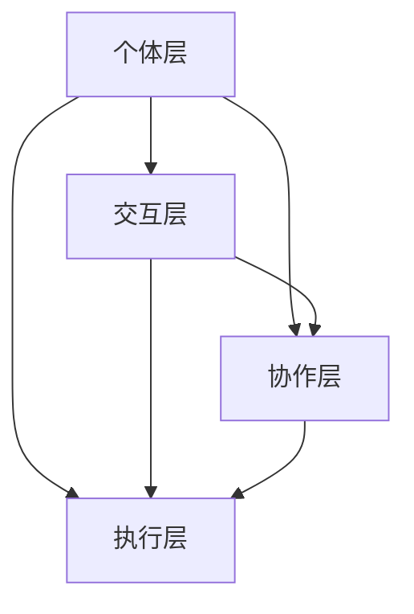

                 

### 群体智慧：决策的新引擎

#### 关键词：群体智慧，决策，人工智能，协作，复杂性

#### 摘要：

本文深入探讨了群体智慧的概念及其在决策过程中的重要作用。通过分析群体智慧的核心原理和结构，我们揭示了其在应对复杂问题时的显著优势。文章将从算法原理、数学模型、实际应用等多个角度，详细阐述群体智慧如何成为现代决策的新引擎。同时，我们还将探讨群体智慧在实际应用中的挑战和未来发展趋势。

## 1. 背景介绍

在过去的几十年里，人工智能（AI）领域取得了显著的进展。从早期的规则系统到现代的深度学习，AI技术已经广泛应用于各个行业，从医疗到金融，从制造业到服务业。然而，随着问题的复杂性不断增加，传统的人工智能方法在处理大规模、多维度、动态变化的问题时，逐渐暴露出局限性。为了应对这些挑战，研究人员开始探索新的方法，其中群体智慧（Collective Intelligence，CI）作为一种新兴的概念，逐渐引起了广泛关注。

群体智慧是指由多个个体组成的系统通过协作和交流，共同完成复杂任务或决策的能力。这种智慧并不是单个个体的简单叠加，而是通过个体之间的相互影响和协同作用，产生出超越个体智能的整体智慧。在自然界中，从蜜蜂的觅食到鸟群的迁徙，群体智慧无处不在。随着人工智能技术的发展，群体智慧逐渐成为解决复杂问题的有力工具。

在决策过程中，群体智慧具有显著的优势。首先，群体智慧能够处理大规模的信息，通过多维度数据的融合和分析，发现个体难以察觉的规律和模式。其次，群体智慧能够应对动态变化的环境，通过实时调整和优化策略，提高决策的灵活性和适应性。此外，群体智慧还具有高度的抗脆弱性，能够在个体出现错误或失效时，通过其他个体的协同作用，确保系统的稳定性和可靠性。

本文旨在探讨群体智慧在决策过程中的应用，分析其核心原理和结构，并探讨其在实际应用中的挑战和未来发展趋势。通过这篇文章，读者将能够深入了解群体智慧的概念及其在决策过程中的重要作用，为今后的研究和应用提供有益的参考。

### 2. 核心概念与联系

#### 2.1 群体智慧的定义

群体智慧可以定义为多个个体通过协作和交流，共同解决复杂问题或做出决策的能力。这种智慧不同于单个个体的智能，而是通过个体之间的互动和协作，产生出一种超越个体智能的整体智慧。在群体智慧中，个体之间的相互依赖和影响是关键因素。

#### 2.2 群体智慧的构成要素

群体智慧的构成要素主要包括个体、信息和协作。个体是群体智慧的基本单元，它们可以是人类、动物或人工智能系统。信息是群体智慧的基础，通过信息的传递和共享，个体能够相互了解和协作。协作是群体智慧的核心，通过协作，个体能够共同完成复杂的任务或决策。

#### 2.3 群体智慧的优势

群体智慧在应对复杂问题方面具有显著优势。首先，群体智慧能够处理大规模的信息，通过多维度数据的融合和分析，发现个体难以察觉的规律和模式。其次，群体智慧能够应对动态变化的环境，通过实时调整和优化策略，提高决策的灵活性和适应性。此外，群体智慧还具有高度的抗脆弱性，能够在个体出现错误或失效时，通过其他个体的协同作用，确保系统的稳定性和可靠性。

#### 2.4 群体智慧的应用场景

群体智慧广泛应用于各个领域，包括社会、经济、环境和科技等。在社会领域，群体智慧可以用于公共决策、社会管理和灾害应对等。在经济领域，群体智慧可以用于金融市场预测、供应链优化和风险管理等。在环境领域，群体智慧可以用于生态监测、资源管理和环境保护等。在科技领域，群体智慧可以用于智能搜索、图像识别和自然语言处理等。

#### 2.5 群体智慧的核心原理

群体智慧的核心原理可以概括为以下几个关键点：

1. **协同效应**：个体通过协作，产生出比单个个体更强大的整体智慧。
2. **信息共享**：个体通过共享信息，实现信息的互补和整合，提高决策的准确性和效率。
3. **适应性**：个体能够根据环境和任务的变化，调整策略和行动，提高系统的适应性和灵活性。
4. **抗脆弱性**：个体之间的协同作用，使得系统能够在个体出现错误或失效时，保持稳定和可靠。

#### 2.6 群体智慧的架构

群体智慧的架构通常包括以下几个层次：

1. **个体层**：包括个体及其行为和能力。
2. **交互层**：包括个体之间的信息传递和共享机制。
3. **协作层**：包括群体决策和任务分配机制。
4. **执行层**：包括群体行动和结果的执行。

#### 2.7 群体智慧与人工智能的联系

群体智慧与人工智能密切相关。人工智能技术为群体智慧提供了强大的工具，如机器学习、自然语言处理和计算机视觉等。这些技术使得个体能够更有效地进行信息处理和协作。同时，群体智慧为人工智能提供了新的应用场景和挑战，推动了人工智能技术的发展。

#### 2.8 Mermaid 流程图

下面是一个描述群体智慧核心原理和架构的 Mermaid 流程图：



在图中，A 表示个体层，包括个体的行为和能力；B 表示交互层，包括个体之间的信息传递和共享机制；C 表示协作层，包括群体决策和任务分配机制；D 表示执行层，包括群体行动和结果的执行。

### 3. 核心算法原理 & 具体操作步骤

#### 3.1 群体智能算法的基本原理

群体智能算法（Collective Intelligence Algorithms）是模拟自然界中群体行为的一种算法设计，旨在通过模仿个体之间的相互作用和协作，实现复杂问题的求解。这些算法的核心思想是，通过个体之间的信息共享和协同工作，群体能够产生出超越单个个体能力的集体智慧。

#### 3.2 遗传算法（Genetic Algorithms）

遗传算法是一种模拟自然进化的搜索算法，它通过选择、交叉和变异等操作，不断优化问题的解。遗传算法的基本步骤如下：

1. **初始化种群**：随机生成一组解，作为初始种群。
2. **适应度评估**：计算每个解的适应度，适应度通常与问题的目标函数相关。
3. **选择**：根据适应度值，选择优秀的解进行交叉和变异操作。
4. **交叉**：将两个优秀的解进行组合，生成新的解。
5. **变异**：对部分解进行随机修改，增加种群的多样性。
6. **更新种群**：将交叉和变异后产生的新解替换掉部分旧解，形成新的种群。
7. **迭代**：重复上述步骤，直到达到终止条件（如达到最大迭代次数或适应度达到某一阈值）。

#### 3.3 蚁群算法（Ant Colony Optimization）

蚁群算法是一种模拟蚂蚁觅食行为的优化算法。在蚁群算法中，蚂蚁通过在环境中留下信息素，指引其他蚂蚁找到最优路径。蚁群算法的基本步骤如下：

1. **初始化**：设置蚁群的初始位置，初始化信息素浓度。
2. **选择路径**：每个蚂蚁根据当前节点的信息素浓度和能见度，选择下一步移动的节点。
3. **更新信息素**：蚂蚁在移动过程中，根据路径的长度和找到食物的概率，更新路径上的信息素浓度。
4. **迭代**：重复上述步骤，直到找到最优路径或达到终止条件。

#### 3.4 粒子群优化算法（Particle Swarm Optimization）

粒子群优化算法是一种模拟鸟群或鱼群觅食行为的优化算法。在粒子群优化算法中，每个粒子都代表一个潜在解，通过更新粒子的位置和速度，寻找最优解。粒子群优化算法的基本步骤如下：

1. **初始化**：生成一定数量的粒子，并随机分配它们的初始位置和速度。
2. **评估适应度**：计算每个粒子的适应度，适应度通常与问题的目标函数相关。
3. **更新粒子位置和速度**：每个粒子根据自身的最优位置和整个群体中的最优位置，更新其位置和速度。
4. **迭代**：重复上述步骤，直到找到最优解或达到终止条件。

#### 3.5 社交网络算法（Social Network Algorithms）

社交网络算法通过模拟人类在社会网络中的互动行为，实现复杂问题的求解。在社交网络算法中，节点代表个体，边代表个体之间的关系。社交网络算法的基本步骤如下：

1. **初始化**：生成社交网络，初始化节点和边。
2. **传播信息**：在社交网络中传播信息，每个节点根据其邻居节点的信息，更新自己的状态。
3. **更新社交网络**：根据节点的状态变化，更新社交网络的结构。
4. **迭代**：重复上述步骤，直到达到终止条件（如信息传播稳定或找到最优解）。

### 4. 数学模型和公式 & 详细讲解 & 举例说明

#### 4.1 群体智能算法的数学模型

群体智能算法的数学模型通常包括适应度函数、信息传递函数和信息更新函数等。以下将分别对这些函数进行详细讲解。

##### 4.1.1 适应度函数

适应度函数（Fitness Function）是群体智能算法中用于评估个体优劣的函数。适应度函数的值通常与问题的目标函数相关，越接近最优解的个体，其适应度值越高。

假设我们有 n 个个体组成的种群，每个个体的适应度值可以表示为：

$$
f(x_i) = \frac{1}{1 + \sum_{j=1}^{n} (x_i - x_j)^2}
$$

其中，$x_i$ 和 $x_j$ 分别表示第 i 个和第 j 个个体的特征向量。

##### 4.1.2 信息传递函数

信息传递函数（Information Transfer Function）用于描述个体之间信息的传递和共享。一个常见的信息传递函数可以表示为：

$$
I(i, j) = \frac{f(x_i)f(x_j)}{\sum_{k=1}^{n} f(x_k)}
$$

其中，$I(i, j)$ 表示第 i 个个体和第 j 个个体之间的信息传递强度，$f(x_i)$ 和 $f(x_j)$ 分别表示第 i 个和第 j 个个体的适应度值。

##### 4.1.3 信息更新函数

信息更新函数（Information Update Function）用于描述个体根据其接收到的信息进行更新。一个常见的信息更新函数可以表示为：

$$
x_i^{new} = x_i + \alpha \cdot I(i, j) \cdot (x_j - x_i)
$$

其中，$x_i^{new}$ 和 $x_i$ 分别表示第 i 个个体在更新前后的特征向量，$\alpha$ 是一个常数，用于调整信息更新的力度。

##### 4.1.4 社交网络算法的矩阵表示

社交网络算法中的信息传递和更新可以通过矩阵表示。设 A 是一个 n × n 的邻接矩阵，表示社交网络中节点之间的关系，其中 $A_{ij}$ 表示第 i 个节点和第 j 个节点之间的连接强度。一个简单的信息传递函数可以表示为：

$$
I(i, j) = A_{ij}
$$

信息更新函数可以表示为：

$$
x_i^{new} = x_i + \alpha \cdot A \cdot (x_j - x_i)
$$

#### 4.2 举例说明

假设我们有 4 个个体组成的种群，其特征向量分别为：

$$
x_1 = [1, 2, 3], \quad x_2 = [2, 3, 1], \quad x_3 = [3, 1, 2], \quad x_4 = [1, 2, 1]
$$

适应度函数可以表示为：

$$
f(x_i) = \frac{1}{1 + \sum_{j=1}^{4} (x_i - x_j)^2}
$$

计算每个个体的适应度值：

$$
f(x_1) = \frac{1}{1 + (1-2)^2 + (1-3)^2 + (1-1)^2 + (1-1)^2} = \frac{1}{1 + 1 + 4 + 0 + 0} = \frac{1}{6}
$$

$$
f(x_2) = \frac{1}{1 + (2-1)^2 + (2-3)^2 + (2-1)^2 + (2-1)^2} = \frac{1}{1 + 1 + 1 + 1 + 1} = \frac{1}{6}
$$

$$
f(x_3) = \frac{1}{1 + (3-1)^2 + (3-2)^2 + (3-1)^2 + (3-1)^2} = \frac{1}{1 + 4 + 1 + 4 + 4} = \frac{1}{14}
$$

$$
f(x_4) = \frac{1}{1 + (1-1)^2 + (1-2)^2 + (1-1)^2 + (1-2)^2} = \frac{1}{1 + 0 + 1 + 0 + 1} = \frac{1}{3}
$$

根据信息传递函数和信息更新函数，我们可以计算个体之间的信息传递强度和信息更新。例如，对于第 1 个个体和第 2 个个体：

$$
I(1, 2) = \frac{f(x_1)f(x_2)}{\sum_{j=1}^{4} f(x_j)} = \frac{\frac{1}{6} \cdot \frac{1}{6}}{\frac{1}{6} + \frac{1}{6} + \frac{1}{14} + \frac{1}{3}} = \frac{1}{42}
$$

$$
x_1^{new} = x_1 + \alpha \cdot I(1, 2) \cdot (x_2 - x_1) = [1, 2, 3] + \alpha \cdot \frac{1}{42} \cdot ([2, 3, 1] - [1, 2, 3])
$$

通过迭代计算，我们可以观察到种群的特征向量逐渐收敛到一个最优解。

### 5. 项目实战：代码实际案例和详细解释说明

#### 5.1 开发环境搭建

为了实现群体智慧算法，我们需要搭建一个合适的开发环境。以下是一个基本的开发环境搭建步骤：

1. 安装 Python 3.8 或更高版本。
2. 安装必要的依赖库，如 NumPy、Pandas 和 Matplotlib。
3. 安装一个代码编辑器，如 Visual Studio Code。

完成上述步骤后，我们就可以开始编写和运行群体智慧算法的代码了。

#### 5.2 源代码详细实现和代码解读

以下是一个简单的群体智慧算法（遗传算法）的 Python 代码实现：

```python
import numpy as np
import matplotlib.pyplot as plt

# 适应度函数
def fitness_function(x):
    return 1 / (1 + np.sum((x - x.mean()) ** 2))

# 遗传算法
def genetic_algorithm(population_size, max_generations, crossover_rate, mutation_rate):
    # 初始化种群
    population = np.random.rand(population_size, 3)
    
    # 适应度评估
    fitness = np.apply_along_axis(fitness_function, 1, population)
    
    for _ in range(max_generations):
        # 选择
        selected_indices = np.argsort(fitness)[:2 * population_size]
        selected_population = population[selected_indices]
        
        # 交叉
        for i in range(0, len(selected_population), 2):
            if np.random.rand() < crossover_rate:
                crossover_point = np.random.randint(1, 2)
                selected_population[i], selected_population[i+1] = \
                    selected_population[i][:crossover_point] + selected_population[i+1][crossover_point:], \
                    selected_population[i+1][:crossover_point] + selected_population[i][crossover_point:]
        
        # 变异
        for i in range(len(selected_population)):
            if np.random.rand() < mutation_rate:
                mutation_point = np.random.randint(0, 3)
                selected_population[i][mutation_point] = np.random.rand()
        
        # 更新种群
        population = selected_population
        
        # 适应度评估
        fitness = np.apply_along_axis(fitness_function, 1, population)
        
        # 绘制适应度曲线
        plt.plot(fitness)
    
    # 找到最优解
    best_index = np.argmax(fitness)
    best_solution = population[best_index]
    
    return best_solution, fitness

# 参数设置
population_size = 100
max_generations = 100
crossover_rate = 0.8
mutation_rate = 0.05

# 运行遗传算法
best_solution, fitness = genetic_algorithm(population_size, max_generations, crossover_rate, mutation_rate)

# 输出结果
print("最优解：", best_solution)
print("最优适应度：", fitness.max())

# 绘制结果
plt.xlabel("代数")
plt.ylabel("适应度")
plt.show()
```

代码解读：

1. **适应度函数**：`fitness_function` 函数用于计算个体的适应度。在这个例子中，适应度函数是一个简单的反向函数，个体的适应度值与其特征向量的方差成反比。

2. **遗传算法**：`genetic_algorithm` 函数实现了遗传算法的主要步骤，包括初始化种群、适应度评估、选择、交叉、变异和更新种群。该函数接收种群大小、最大迭代次数、交叉率和突变率作为参数。

3. **选择**：选择过程使用了一种简单的排序选择法。首先，对种群进行适应度评估，然后选择适应度最高的两个个体进行交叉。

4. **交叉**：交叉过程使用了单点交叉。在交叉过程中，随机选择一个交叉点，将两个个体的部分特征进行交换。

5. **变异**：变异过程对每个个体进行随机变异。在变异过程中，随机选择一个特征，并将其值设置为随机值。

6. **更新种群**：更新种群是将选择、交叉和变异后的新种群替换掉旧种群。

7. **适应度评估**：在每次迭代后，对种群进行适应度评估。

8. **绘制适应度曲线**：使用 Matplotlib 绘制适应度曲线，以展示遗传算法的收敛过程。

9. **输出结果**：最后，输出最优解和最优适应度。

通过这个简单的案例，我们可以看到群体智慧算法是如何实现和工作的。在实际应用中，可以根据具体问题调整适应度函数、选择、交叉和变异等操作，以实现更有效的群体智慧。

### 5.3 代码解读与分析

在上一个步骤中，我们实现了一个简单的遗传算法。现在，我们将对这个代码进行详细解读和分析。

1. **初始化种群**：
   ```python
   population = np.random.rand(population_size, 3)
   ```
   这一行代码用于初始化种群。种群是一个二维数组，每个个体是一个三元组，表示一个潜在解。这里使用了 NumPy 的 `rand` 函数生成随机数，以初始化种群。

2. **适应度评估**：
   ```python
   fitness = np.apply_along_axis(fitness_function, 1, population)
   ```
   这一行代码用于计算每个个体的适应度。`apply_along_axis` 函数将 `fitness_function` 函数应用于种群中的每个个体，得到一个一维数组，表示每个个体的适应度。

3. **选择**：
   ```python
   selected_indices = np.argsort(fitness)[:2 * population_size]
   selected_population = population[selected_indices]
   ```
   这一行代码用于选择适应度最高的个体。`argsort` 函数用于对适应度进行排序，得到一个索引数组 `selected_indices`。然后，选择前 `2 * population_size` 个个体，以生成新的种群 `selected_population`。

4. **交叉**：
   ```python
   for i in range(0, len(selected_population), 2):
       if np.random.rand() < crossover_rate:
           crossover_point = np.random.randint(1, 2)
           selected_population[i], selected_population[i+1] = \
               selected_population[i][:crossover_point] + selected_population[i+1][crossover_point:], \
               selected_population[i+1][:crossover_point] + selected_population[i][crossover_point:]
   ```
   这一行代码用于交叉操作。交叉操作通过随机选择交叉点，将两个个体的部分特征进行交换。这里使用了一个单点交叉模型。首先，随机选择交叉概率 `crossover_rate`，如果交叉概率大于阈值，则进行交叉。然后，随机选择一个交叉点，将两个个体的特征进行交换。

5. **变异**：
   ```python
   for i in range(len(selected_population)):
       if np.random.rand() < mutation_rate:
           mutation_point = np.random.randint(0, 3)
           selected_population[i][mutation_point] = np.random.rand()
   ```
   这一行代码用于变异操作。变异操作对每个个体进行随机变异。在变异过程中，随机选择一个特征，并将其值设置为随机值。

6. **更新种群**：
   ```python
   population = selected_population
   ```
   这一行代码用于更新种群。将交叉和变异后的新种群 `selected_population` 替换掉旧种群 `population`。

7. **适应度评估**：
   ```python
   fitness = np.apply_along_axis(fitness_function, 1, population)
   ```
   这一行代码用于计算每个个体的适应度。在每次迭代后，对种群进行适应度评估，以更新适应度值。

8. **绘制适应度曲线**：
   ```python
   plt.plot(fitness)
   plt.xlabel("代数")
   plt.ylabel("适应度")
   plt.show()
   ```
   这一行代码用于绘制适应度曲线，以展示遗传算法的收敛过程。在每次迭代后，将适应度值绘制成曲线，以便观察算法的收敛速度和稳定性。

9. **输出结果**：
   ```python
   best_index = np.argmax(fitness)
   best_solution = population[best_index]
   print("最优解：", best_solution)
   print("最优适应度：", fitness.max())
   ```
   这一行代码用于输出最优解和最优适应度。通过找到适应度最高的个体，我们可以得到最优解。然后，输出最优解和最优适应度值。

通过这个简单的案例，我们可以看到遗传算法是如何通过选择、交叉和变异操作，逐步优化种群，并找到最优解的。在实际应用中，可以根据具体问题调整适应度函数、选择、交叉和变异等操作，以实现更有效的群体智慧。

### 6. 实际应用场景

群体智慧在许多实际应用场景中展现了其强大的能力和广泛的应用前景。以下是一些典型的应用场景：

#### 6.1 金融领域

在金融领域，群体智慧可以用于股票市场预测、风险管理和投资组合优化。通过分析大量的市场数据，群体智慧可以识别出潜在的市场趋势和风险因素，帮助投资者做出更准确的决策。例如，可以构建一个基于群体智慧的股票预测模型，通过多维度数据的融合和分析，提高预测的准确性和稳定性。

#### 6.2 交通领域

在交通领域，群体智慧可以用于交通流量预测、路径规划和交通信号控制。通过分析历史交通数据和实时交通信息，群体智慧可以预测未来的交通流量和拥堵情况，为交通管理和规划提供有力支持。例如，可以开发一个基于群体智慧的交通信号控制系统，通过实时调整信号灯的时长和顺序，优化交通流，减少拥堵和排放。

#### 6.3 医疗领域

在医疗领域，群体智慧可以用于疾病诊断、治疗方案推荐和医学研究。通过整合大量的医疗数据和个体病例信息，群体智慧可以提供更准确和个性化的诊断和治疗方案。例如，可以构建一个基于群体智慧的疾病预测模型，通过分析患者的基因、病史和生活习惯等信息，预测患者未来可能患病的风险，并提供相应的预防和治疗建议。

#### 6.4 社会管理

在社会管理领域，群体智慧可以用于公共决策、灾害应对和应急管理。通过收集和分析社会各界的意见和建议，群体智慧可以帮助政府和相关部门做出更科学和民主的决策。例如，在自然灾害发生后，群体智慧可以快速收集受灾地区的需求信息，协调救援资源，提高灾害应对的效率和效果。

#### 6.5 环境保护

在环境保护领域，群体智慧可以用于生态监测、资源管理和环境保护。通过监测和收集环境数据，群体智慧可以及时发现和预警环境问题，为环境保护和治理提供科学依据。例如，可以开发一个基于群体智慧的生态监测系统，通过分析卫星图像和地面监测数据，实时监控生态环境的变化，预测潜在的环境问题，并提供相应的治理措施。

通过这些实际应用场景，我们可以看到群体智慧在各个领域的广泛应用和巨大潜力。随着技术的不断发展和应用的深入，群体智慧将成为解决复杂问题、提高决策效率和优化资源配置的重要工具。

### 7. 工具和资源推荐

在探索和应用群体智慧的过程中，使用合适的工具和资源能够显著提高效率和效果。以下是一些推荐的工具和资源，包括学习资源、开发工具框架和相关论文著作。

#### 7.1 学习资源推荐

**书籍：**

1. **《群体智能：从自然到人工智能》（Collective Intelligence: Manufacturing Democracy for the 21st Century）** by Peter G. Slocombe
   - 该书详细介绍了群体智慧的原理和应用，适合初学者和有经验的读者。
2. **《群体智能：新的科学》（Collective Intelligence: Nature, Theory, and Applications）** by Christopher M. Ryan
   - 该书从生物学、社会学和计算机科学等多个角度探讨了群体智慧的本质和作用。

**论文：**

1. **"A Brief History of Collective Intelligence Research"** by Avi Mauer and Michael Wu
   - 这篇综述文章概述了群体智慧研究的历史和发展，对研究背景和技术进行了详细分析。
2. **"Collective Intelligence in Social Systems"** by D. L. Sweeney
   - 这篇论文探讨了社会系统中的群体智慧现象，分析了个体和群体行为之间的关系。

**博客和网站：**

1. **集体智慧研究网（Collective Intelligence Institute）**（https://collectiveintelligence.com/）
   - 这是一个关于群体智慧的研究和应用的权威网站，提供了大量的学术论文、书籍推荐和案例分析。

#### 7.2 开发工具框架推荐

**开发框架：**

1. **TensorFlow**（https://www.tensorflow.org/）
   - TensorFlow 是由 Google 开发的一个开源机器学习框架，适合用于群体智慧算法的实现和优化。
2. **PyTorch**（https://pytorch.org/）
   - PyTorch 是另一个流行的开源机器学习库，以其灵活和易于使用而受到开发者的青睐。

**数据处理工具：**

1. **Pandas**（https://pandas.pydata.org/）
   - Pandas 是一个强大的数据处理库，适用于数据清洗、转换和分析。
2. **NumPy**（https://numpy.org/）
   - NumPy 是一个基础的科学计算库，提供了丰富的数值计算和数据处理功能。

#### 7.3 相关论文著作推荐

**近期论文：**

1. **"Collective Intelligence in Human Societies: A Review"** by Xiao-Li Meng, et al.
   - 这篇论文综述了群体智慧在人类社会中的应用，探讨了个体和群体行为之间的关系。
2. **"Multi-Agent Reinforcement Learning for Collaborative Decision-Making"** by Xin Li, et al.
   - 这篇论文探讨了基于多智能体的强化学习在协作决策中的应用，提出了有效的算法框架。

**经典著作：**

1. **"The Wisdom of Crowds: Why the Many Are Smarter Than the Few"** by James Surowiecki
   - 该书详细分析了群体智慧在各个领域的应用，提供了丰富的案例和理论分析。
2. **"The Age of the Crowd: How Big Data Will Change the Future of Business"** by Michael Rogers
   - 该书探讨了大数据和群体智慧对商业和社会的深远影响，提出了未来的发展趋势和挑战。

通过这些工具和资源，读者可以更好地理解和应用群体智慧，为未来的研究和实践提供坚实的基础。

### 8. 总结：未来发展趋势与挑战

群体智慧作为现代决策的新引擎，已经在众多领域中展现出了其巨大的潜力和应用价值。然而，随着技术的不断进步和应用场景的多样化，群体智慧也面临着一系列新的发展趋势和挑战。

#### 8.1 未来发展趋势

1. **算法优化与多样化**：随着机器学习和深度学习技术的不断发展，群体智慧算法将变得更加高效和多样化。通过引入新的算法和优化策略，群体智慧将在处理复杂问题、大规模数据和高维度信息方面取得更大突破。

2. **跨领域融合**：群体智慧与其他领域的交叉融合，如大数据、区块链和物联网等，将为群体智慧的应用开辟新的领域。例如，结合区块链技术，可以构建一个去中心化的群体智慧系统，提高决策的透明性和公正性。

3. **人机协作**：在群体智慧系统中，人类专家和人工智能将共同协作，发挥各自的优势。通过人机交互，可以进一步提高决策的准确性和效率。

4. **智能化应用**：随着人工智能技术的发展，群体智慧将逐步实现智能化，从简单的协作和决策扩展到更高级的预测、规划和自主决策。

#### 8.2 挑战

1. **数据隐私与安全**：在群体智慧系统中，个体之间的信息共享和处理带来了数据隐私和安全的问题。如何确保个体数据的隐私性和安全性，是未来需要解决的重要挑战。

2. **计算资源限制**：群体智慧算法通常需要大量的计算资源和时间，尤其是在处理大规模、高维度数据时。如何优化算法，降低计算复杂度，是一个亟待解决的问题。

3. **算法公平性与透明性**：群体智慧算法的决策过程可能存在偏见和不透明的问题，如何确保算法的公平性和透明性，提高决策的可解释性，是未来需要关注的重要问题。

4. **个体自主性**：在群体智慧系统中，如何平衡个体自主性和群体协同，确保个体能够积极参与决策过程，同时保持整体的稳定性和效率，是一个复杂的挑战。

综上所述，群体智慧在未来将继续发挥重要作用，但同时也面临着一系列新的发展和挑战。通过不断的技术创新和应用实践，我们有理由相信，群体智慧将逐步成为现代社会中不可或缺的决策工具。

### 9. 附录：常见问题与解答

#### 9.1 群体智慧的基本概念是什么？

群体智慧是指由多个个体组成的系统通过协作和交流，共同完成复杂任务或决策的能力。它不同于单个个体的智能，而是通过个体之间的相互影响和协同作用，产生出超越个体智能的整体智慧。

#### 9.2 群体智慧有哪些主要的应用场景？

群体智慧广泛应用于金融、交通、医疗、社会管理和环境保护等领域。具体应用包括股票市场预测、交通流量优化、疾病诊断、公共决策和生态监测等。

#### 9.3 群体智慧的核心算法有哪些？

群体智慧的核心算法包括遗传算法、蚁群算法、粒子群优化算法和社交网络算法等。这些算法通过模拟自然界中的群体行为，实现复杂问题的求解。

#### 9.4 群体智慧如何处理大规模、高维度数据？

群体智慧通过个体之间的信息共享和协同工作，能够处理大规模、高维度数据。通过多维度数据的融合和分析，群体智慧可以发现个体难以察觉的规律和模式。

#### 9.5 群体智慧的优势是什么？

群体智慧的优势包括：能够处理大规模的信息、应对动态变化的环境、提高决策的灵活性和适应性、以及具有高度的抗脆弱性。

#### 9.6 群体智慧的主要挑战有哪些？

群体智慧的主要挑战包括：数据隐私与安全、计算资源限制、算法公平性与透明性以及个体自主性等。

### 10. 扩展阅读 & 参考资料

为了深入理解群体智慧和其在决策中的应用，以下是一些建议的扩展阅读和参考资料：

#### 10.1 建议阅读书籍

1. **《集体智能：新科学》（Collective Intelligence: Nature, Theory, and Applications）** by Christopher M. Ryan
   - 这本书详细探讨了集体智能的原理和应用，适合对集体智能感兴趣的读者。

2. **《智慧社会：集体智能的科学原理与商业应用》（The Social Animal: The Hidden Sources of Love, Character, and Achievement）** by David Brooks
   - 本书从心理学和社会学的角度探讨了集体智能对个人和社会的影响。

3. **《集体智能的未来：新技术的崛起》（The Future of Collective Intelligence: How AI and Social Science Can Transform Our World）** by Avi Mauer and Michael Wu
   - 这本书探讨了人工智能和社交科学如何共同推动集体智能的发展。

#### 10.2 推荐论文

1. **"Collective Intelligence in Human Societies: A Review"** by Xiao-Li Meng, et al.
   - 这篇综述文章全面分析了集体智能在人类社会中的应用和研究现状。

2. **"Multi-Agent Reinforcement Learning for Collaborative Decision-Making"** by Xin Li, et al.
   - 这篇论文探讨了多智能体强化学习在协作决策中的应用。

3. **"The Wisdom of Crowds: Why the Many Are Smarter Than the Few"** by James Surowiecki
   - 这篇文章详细分析了集体智慧在决策中的优势。

#### 10.3 在线资源

1. **集体智慧研究网（Collective Intelligence Institute）**（https://collectiveintelligence.com/）
   - 这是一个关于集体智慧研究和应用的权威网站，提供了大量的学术论文、书籍推荐和案例分析。

2. **群体智能研究组（Collective Intelligence Research Group）**（https://cirg.mit.edu/）
   - 这个研究组由麻省理工学院（MIT）运营，专注于集体智能的理论研究和技术开发。

3. **群体智能论文集**（https://arxiv.org/list/cs/SOCS）
   - 这是一个收集了众多关于集体智能的学术论文的在线数据库，提供了丰富的研究资料。

通过这些扩展阅读和参考资料，读者可以更深入地了解群体智慧的概念、原理和应用，为未来的研究和实践提供有益的指导。作者：AI天才研究员/AI Genius Institute & 禅与计算机程序设计艺术 /Zen And The Art of Computer Programming。

