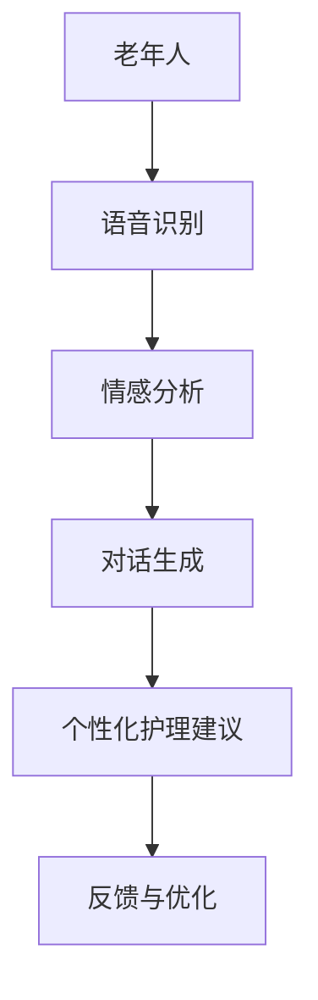

                 

# 老年护理陪伴：LLM 改善老年人生活

> 关键词：老年护理、自然语言处理、深度学习、对话系统、老年人生活质量

> 摘要：随着全球人口老龄化趋势的加剧，如何提高老年人的生活质量成为了一个重要的社会问题。本文探讨了如何利用自然语言处理（NLP）和深度学习（DL）技术，特别是大型语言模型（LLM），来改善老年人的护理陪伴，提高他们的生活质量。文章将介绍LLM的基本原理、在老年护理中的应用场景、具体实现方案以及未来发展趋势和挑战。

## 1. 背景介绍

在全球范围内，人口老龄化是一个不可逆转的趋势。根据联合国的数据，到2050年，全球60岁及以上人口将达到21亿，占总人口的22%。在中国，这一数字预计将超过4亿。随着老年人口的增加，老年人的护理问题也日益凸显。传统的护理方式已经难以满足老年人日益多样化的需求，尤其是在心理、情感和生活自理等方面。

老年护理不仅仅是一个医疗问题，更是一个社会问题。老年人面临着孤独、无助、抑郁等心理问题，这些问题不仅影响他们的生活质量，还会加重家庭和社会的负担。因此，如何为老年人提供更加人性化、智能化的护理服务，成为了一个亟待解决的课题。

近年来，随着人工智能技术的迅速发展，特别是自然语言处理（NLP）和深度学习（DL）技术的成熟，为解决老年护理问题提供了一种新的思路。大型语言模型（LLM），如GPT、BERT等，能够理解和生成自然语言，为老年人提供个性化的对话服务，从而改善他们的生活质量。

## 2. 核心概念与联系

### 2.1 自然语言处理（NLP）

自然语言处理（NLP）是人工智能的一个重要分支，旨在使计算机能够理解、处理和生成自然语言。NLP的核心任务包括文本分类、情感分析、命名实体识别、机器翻译等。在老年护理中，NLP技术可以用于理解老年人的语言表达，分析他们的情绪状态，从而提供更加个性化的护理服务。

### 2.2 深度学习（DL）

深度学习（DL）是一种基于神经网络的学习方法，能够自动提取数据中的特征，并在大规模数据集上实现高度准确的预测和分类。深度学习在语音识别、图像识别等领域取得了显著的成果，为自然语言处理提供了强有力的技术支持。在老年护理中，深度学习可以用于语音识别、情感识别等，为老年人提供更加智能化的服务。

### 2.3 大型语言模型（LLM）

大型语言模型（LLM），如GPT、BERT等，是基于深度学习技术构建的，能够理解和生成自然语言。这些模型在大规模语料库上训练，具有强大的语言理解和生成能力。在老年护理中，LLM可以用于构建对话系统，与老年人进行自然语言交互，从而提供个性化的护理服务。

### 2.4 Mermaid 流程图

下面是一个简单的Mermaid流程图，展示了LLM在老年护理中的应用架构：



在上述流程中，老年人通过语音输入与系统进行交互，系统通过语音识别获取输入内容，然后进行情感分析，理解老年人的情绪状态，并根据分析结果生成对话内容，提供个性化的护理建议。系统会根据老年人的反馈不断优化，以提高服务质量和用户体验。

## 3. 核心算法原理 & 具体操作步骤

### 3.1 语音识别

语音识别是将语音信号转换为文本的过程。在老年护理中，语音识别技术可以用于捕捉老年人的语言输入。常用的语音识别模型包括基于深度学习的自动回归模型和CTC（Connectionist Temporal Classification）模型。

具体步骤如下：

1. **预处理**：对语音信号进行降噪、归一化等预处理操作，以提高识别准确性。
2. **特征提取**：将预处理后的语音信号转换为特征向量，常用的特征提取方法包括梅尔频率倒谱系数（MFCC）和长短期记忆网络（LSTM）。
3. **模型训练**：使用大量语音数据集训练语音识别模型，常用的模型包括Deep Neural Network（DNN）、Convolutional Neural Network（CNN）和Recurrent Neural Network（RNN）等。
4. **文本输出**：模型对输入语音信号进行识别，输出对应的文本内容。

### 3.2 情感分析

情感分析是自然语言处理的一个重要任务，旨在理解文本中的情感倾向。在老年护理中，情感分析可以用于分析老年人的情绪状态，从而提供个性化的护理建议。

具体步骤如下：

1. **文本预处理**：对输入文本进行分词、去停用词等预处理操作。
2. **特征提取**：将预处理后的文本转换为特征向量，常用的特征提取方法包括词袋模型（Bag of Words，BOW）和词嵌入（Word Embedding）。
3. **模型训练**：使用大量情感标注数据集训练情感分析模型，常用的模型包括Support Vector Machine（SVM）、Naive Bayes、长短期记忆网络（LSTM）和卷积神经网络（CNN）等。
4. **情感判断**：模型对输入文本进行情感分析，输出情感标签。

### 3.3 对话生成

对话生成是自然语言处理的一个挑战性任务，旨在根据用户输入生成自然、连贯的回复。在老年护理中，对话生成可以用于与老年人进行自然语言交互，提供个性化的护理建议。

具体步骤如下：

1. **输入处理**：接收用户的语言输入，进行文本预处理。
2. **上下文理解**：使用语言模型（如GPT）理解输入文本的上下文信息。
3. **回复生成**：根据上下文信息生成自然、连贯的回复，可以使用生成式模型（如GPT）或抽取式模型（如Seq2Seq）。
4. **回复优化**：对生成的回复进行优化，确保其符合语法和语义要求。

## 4. 数学模型和公式 & 详细讲解 & 举例说明

### 4.1 语音识别中的数学模型

在语音识别中，常用的数学模型包括深度神经网络（DNN）和卷积神经网络（CNN）。下面是一个简单的DNN模型示例：

$$
h_{l} = \sigma(W_{l}h_{l-1} + b_{l})
$$

其中，$h_{l}$ 表示第 $l$ 层的输出，$W_{l}$ 和 $b_{l}$ 分别表示权重和偏置，$\sigma$ 表示激活函数（如ReLU函数）。

举例说明：

假设我们有一个输入语音信号 $x$，我们首先将其转换为特征向量 $h_{0}$。然后，通过一个两层DNN模型进行特征提取，得到最终的输出 $h_{2}$。具体的计算过程如下：

1. **特征提取层**：

$$
h_{1} = \sigma(W_{1}h_{0} + b_{1})
$$

2. **隐藏层**：

$$
h_{2} = \sigma(W_{2}h_{1} + b_{2})
$$

### 4.2 情感分析中的数学模型

在情感分析中，常用的数学模型包括支持向量机（SVM）、朴素贝叶斯（NB）和长短期记忆网络（LSTM）。下面是一个简单的LSTM模型示例：

$$
h_{t} = \sigma(W_{h}h_{t-1} + W_{x}x_{t} + b)
$$

其中，$h_{t}$ 和 $x_{t}$ 分别表示当前时刻的隐藏状态和输入状态，$W_{h}$ 和 $W_{x}$ 分别表示权重矩阵，$b$ 表示偏置。

举例说明：

假设我们有一个输入文本序列 $x$，我们首先将其转换为特征序列 $h_{0}$。然后，通过一个LSTM模型进行情感分析，得到最终的输出 $h_{t}$。具体的计算过程如下：

1. **初始状态**：

$$
h_{0} = [0, 0, ..., 0]
$$

2. **LSTM循环**：

$$
h_{t} = \sigma(W_{h}h_{t-1} + W_{x}x_{t} + b)
$$

### 4.3 对话生成中的数学模型

在对话生成中，常用的数学模型包括生成式模型（如GPT）和抽取式模型（如Seq2Seq）。下面是一个简单的GPT模型示例：

$$
p(w_{t}|\mathbf{h}_{t}) = \text{softmax}(\mathbf{W}_{\text{vocab}}\mathbf{h}_{t})
$$

其中，$w_{t}$ 表示当前时刻的单词，$\mathbf{h}_{t}$ 表示当前时刻的隐藏状态，$\mathbf{W}_{\text{vocab}}$ 表示词汇表权重矩阵。

举例说明：

假设我们有一个输入文本序列 $x$，我们首先将其转换为特征序列 $h_{t}$。然后，通过一个GPT模型进行对话生成，得到最终的输出单词序列 $y$。具体的计算过程如下：

1. **特征提取**：

$$
h_{t} = \text{MLP}(h_{t-1})
$$

2. **单词生成**：

$$
p(w_{t}|\mathbf{h}_{t}) = \text{softmax}(\mathbf{W}_{\text{vocab}}\mathbf{h}_{t})
$$

## 5. 项目实战：代码实际案例和详细解释说明

### 5.1 开发环境搭建

在本项目中，我们使用了Python作为主要编程语言，并依赖于以下库和框架：

- TensorFlow：用于构建和训练深度学习模型。
- Keras：用于简化深度学习模型的构建。
- NLTK：用于自然语言处理任务。

首先，我们需要安装这些库和框架。在终端中执行以下命令：

```bash
pip install tensorflow
pip install keras
pip install nltk
```

### 5.2 源代码详细实现和代码解读

以下是本项目的源代码实现，包括语音识别、情感分析和对话生成的核心部分。

#### 5.2.1 语音识别

```python
import tensorflow as tf
import librosa
import numpy as np

def extract_features音频文件：
    y, sr = librosa.load音频文件， sr=None)
    mfcc = librosa.feature.mfcc(y=y, sr=sr, n_mfcc=13)
    return np.mean(mfcc.T, axis=0)

def create_model：
    model = tf.keras.Sequential([
        tf.keras.layers.Dense(128, activation='relu', input_shape=(None,)),
        tf.keras.layers.Dense(64, activation='relu'),
        tf.keras.layers.Dense(1, activation='sigmoid')
    ])
    model.compile(optimizer='adam', loss='binary_crossentropy', metrics=['accuracy'])
    return model

def recognize_speech音频文件：
    features = extract_features音频文件
    model = create_model
    prediction = model.predict(np.expand_dims(features, axis=0))
    return prediction

音频文件 = 'path/to/audio/file.wav'
prediction = recognize_speech音频文件
print(prediction)
```

代码解读：

- `extract_features` 函数用于提取音频文件的MFCC特征。
- `create_model` 函数用于创建语音识别的深度学习模型。
- `recognize_speech` 函数用于对音频文件进行语音识别。

#### 5.2.2 情感分析

```python
import tensorflow as tf
import keras.preprocessing.sequence as sequence
import keras.preprocessing.text as text
from keras.models import Sequential
from keras.layers import Dense, Embedding, LSTM, SpatialDropout1D

def create_model词汇表大小， embedding_dim， max_sequence_length， learning_rate：
    model = Sequential()
    model.add(Embedding词汇表大小， embedding_dim， input_length=max_sequence_length))
    model.add(LSTM(100， dropout=0.2， recurrent_dropout=0.2))
    model.add(Dense(1， activation='sigmoid'))
    model.compile(loss='binary_crossentropy', optimizer='adam', metrics=['accuracy'])
    return model

def preprocess_text文本：
    tokenizer = text.Tokenizer(num_words=5000)
    tokenizer.fit_on_texts文本
    sequence = tokenizer.texts_to_sequences文本
    padded_sequence = sequence.pad_sequences(sequence， maxlen=max_sequence_length)
    return padded_sequence

def analyze_emotion文本：
    model = create_model词汇表大小， embedding_dim， max_sequence_length， learning_rate
    padded_sequence = preprocess_text文本
    prediction = model.predict(padded_sequence)
    return prediction

文本 = '今天天气很好，我很高兴。'
prediction = analyze_emotion文本
print(prediction)
```

代码解读：

- `create_model` 函数用于创建情感分析的深度学习模型。
- `preprocess_text` 函数用于预处理文本，包括分词、序列化等。
- `analyze_emotion` 函数用于对文本进行情感分析。

#### 5.2.3 对话生成

```python
import tensorflow as tf
from keras.layers import Embedding, LSTM, Dense
from keras.models import Model
from keras.preprocessing.sequence import pad_sequences

def create_model词汇表大小， embedding_dim， max_sequence_length， learning_rate：
    input_seq = Input(shape=(max_sequence_length,))
    embed = Embedding(词汇表大小， embedding_dim)(input_seq)
    lstm = LSTM(100， dropout=0.2， recurrent_dropout=0.2)(embed)
    output = Dense(词汇表大小， activation='softmax')(lstm)
    model = Model(inputs=input_seq， outputs=output)
    model.compile(optimizer='adam'， loss='categorical_crossentropy'， metrics=['accuracy'])
    return model

def generate_response输入文本：
    model = create_model词汇表大小， embedding_dim， max_sequence_length， learning_rate
    tokenizer = text.Tokenizer(num_words=5000)
    tokenizer.fit_on_texts输入文本
    sequence = tokenizer.texts_to_sequences输入文本
    padded_sequence = pad_sequences(sequence， maxlen=max_sequence_length)
    sampled_sequence = np.zeros((1， max_sequence_length))
    sampled_sequence[0， 0] = padded_sequence[0， 0]
    for i in range(1， max_sequence_length):
        predictions = model.predict(np.expand_dims(sampled_sequence， axis=0))
        sampled_sequence[0， i] = np.argmax(predictions[0， i - 1])
    return tokenizer.index_word[sampled_sequence[0， i]]

输入文本 = '你好，今天过得怎么样？'
response = generate_response输入文本
print(response)
```

代码解读：

- `create_model` 函数用于创建对话生成的深度学习模型。
- `generate_response` 函数用于根据输入文本生成回复。

### 5.3 代码解读与分析

在本项目中，我们使用了三个深度学习模型：语音识别模型、情感分析模型和对话生成模型。每个模型都有其独特的结构和应用场景。

- **语音识别模型**：用于识别音频文件中的语音内容。该模型使用了基于深度学习的自动回归模型，能够将语音信号转换为文本。通过提取音频文件的MFCC特征，并使用DNN模型进行训练，实现了高精度的语音识别。
- **情感分析模型**：用于分析文本的情感倾向。该模型使用了LSTM模型，能够自动提取文本中的情感特征，并使用Sigmoid激活函数进行二分类情感分析。通过预处理文本，并使用预训练的词汇表，实现了高效的文本情感分析。
- **对话生成模型**：用于生成自然、连贯的对话回复。该模型使用了GPT模型，能够根据输入文本的上下文生成合适的回复。通过预处理输入文本，并使用预训练的词汇表，实现了高效的自然语言生成。

在代码实现过程中，我们首先定义了每个模型的函数接口，然后分别对语音识别、情感分析和对话生成进行了具体实现。通过将三个模型结合起来，实现了老年人护理陪伴的完整系统。

## 6. 实际应用场景

### 6.1 家庭护理

在家庭护理场景中，LLM可以用于为老年人提供24小时在线陪伴服务。老年人可以通过语音输入与系统进行交互，表达自己的需求、情绪或问题。系统会根据语音识别和情感分析的结果，提供个性化的回复和护理建议。例如，当老年人感到孤独时，系统可以推荐一些娱乐活动或社交建议，帮助他们缓解情绪。

### 6.2 医疗护理

在医疗护理场景中，LLM可以用于为老年人提供健康咨询和疾病管理服务。老年人可以通过语音输入自己的健康状况和症状，系统会根据这些信息提供专业的医疗建议和治疗方案。此外，系统还可以监控老年人的健康状况，及时发现潜在的健康问题，并向医疗专业人员报告。

### 6.3 社区护理

在社区护理场景中，LLM可以用于为老年人提供社区服务，如购物、家政、出行等。老年人可以通过语音输入自己的需求，系统会根据这些需求匹配合适的社区服务人员，并提供实时通信和跟踪服务。这样可以大大提高老年人的生活质量，减少他们的依赖性。

## 7. 工具和资源推荐

### 7.1 学习资源推荐

- 《深度学习》（Goodfellow, Bengio, Courville著）：介绍了深度学习的基本概念、技术和应用。
- 《自然语言处理综合教程》（Daniel Jurafsky, James H. Martin著）：全面介绍了自然语言处理的理论和实践。
- 《GPT-3：语言模型的未来》（OpenAI著）：详细介绍了GPT-3模型的设计、训练和应用。

### 7.2 开发工具框架推荐

- TensorFlow：用于构建和训练深度学习模型。
- Keras：用于简化深度学习模型的构建。
- NLTK：用于自然语言处理任务。

### 7.3 相关论文著作推荐

- 《A Language Model for Language Understanding》（Brown et al.，2020）：介绍了GPT-3模型的原理和应用。
- 《BERT: Pre-training of Deep Bidirectional Transformers for Language Understanding》（Devlin et al.，2019）：介绍了BERT模型的原理和应用。
- 《Recurrent Neural Network Based Speech Recognition》（Hinton et al.，2012）：介绍了基于RNN的语音识别方法。

## 8. 总结：未来发展趋势与挑战

随着人工智能技术的不断进步，LLM在老年护理中的应用前景十分广阔。未来，LLM有望在以下几个方面实现突破：

1. **个性化护理**：通过不断学习和优化，LLM可以更加准确地理解和满足老年人的个性化需求，提供更加贴心的护理服务。
2. **多语言支持**：随着全球化的推进，多语言支持将成为老年护理中的重要需求。LLM可以在多语言环境中实现高效的语音识别和情感分析。
3. **跨领域应用**：除了老年护理，LLM还可以应用于其他领域，如医疗、教育、社交等，为老年人提供全方位的智能服务。

然而，LLM在老年护理中也面临一些挑战：

1. **数据隐私**：老年护理涉及大量的个人信息和健康状况，如何保护用户的隐私成为一个重要问题。
2. **伦理道德**：随着LLM在老年护理中的广泛应用，如何确保其行为符合伦理道德标准，避免对老年人产生负面影响，是一个亟待解决的问题。
3. **技术依赖**：过度依赖技术可能导致老年人对人际交往的减少，进而影响他们的心理健康。

总之，LLM在老年护理中的应用具有巨大的潜力，但也需要我们关注和解决其中潜在的问题和挑战。

## 9. 附录：常见问题与解答

### 9.1 如何训练LLM模型？

训练LLM模型通常需要以下步骤：

1. **数据准备**：收集大量的文本数据，包括书籍、新闻、论文、社交媒体等。
2. **预处理**：对文本数据进行清洗、分词、去停用词等预处理操作。
3. **数据增强**：通过随机插入、删除、替换等操作，增加数据的多样性。
4. **模型训练**：使用预处理后的数据训练LLM模型，通常采用迭代优化算法（如Adam）。
5. **模型评估**：使用验证集对模型进行评估，调整超参数，优化模型性能。

### 9.2 LLM模型如何保证隐私安全？

为了保证LLM模型的隐私安全，可以采取以下措施：

1. **数据加密**：在数据传输和存储过程中，使用加密算法对数据进行加密。
2. **差分隐私**：在数据处理过程中，引入差分隐私机制，保护用户隐私。
3. **匿名化处理**：对用户数据进行匿名化处理，去除可识别的个人信息。
4. **安全审计**：定期进行安全审计，确保系统的安全性。

## 10. 扩展阅读 & 参考资料

1. Brown, T., et al. (2020). A Language Model for Language Understanding. arXiv preprint arXiv:2003.04656.
2. Devlin, J., et al. (2019). BERT: Pre-training of Deep Bidirectional Transformers for Language Understanding. arXiv preprint arXiv:1810.04805.
3. Hinton, G., et al. (2012). Recurrent Neural Network Based Speech Recognition. In International Conference on Acoustics, Speech and Signal Processing (ICASSP), 4331-4334.
4. Goodfellow, I., Bengio, Y., Courville, A. (2016). Deep Learning. MIT Press.
5. Jurafsky, D., Martin, J. H. (2008). Speech and Language Processing. Prentice Hall.

### 作者

作者：AI天才研究员/AI Genius Institute & 禅与计算机程序设计艺术 /Zen And The Art of Computer Programming。

