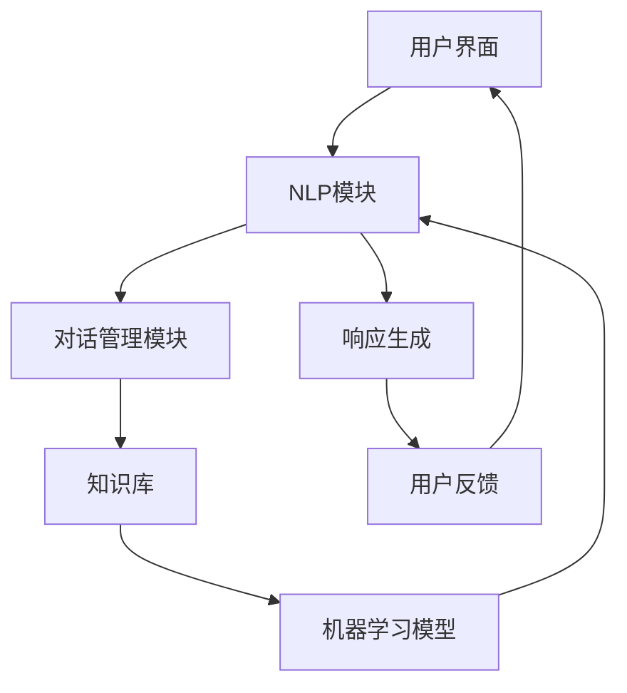

                 

# 聊天机器人创业：创新与初创企业

## 摘要

本文旨在探讨聊天机器人创业领域中的创新与初创企业。首先，我们将回顾聊天机器人技术的发展历程，并解释其核心概念和关键技术。随后，我们将深入分析聊天机器人在不同行业中的应用场景，以及初创企业面临的机遇与挑战。文章将详细介绍项目实战中的开发环境搭建、源代码实现和解读，并提供实际应用场景的案例分析。此外，我们将推荐相关学习资源、开发工具和框架，以帮助读者更好地了解和参与聊天机器人创业。最后，本文将总结未来发展趋势与挑战，并给出常见问题与解答。

## 1. 背景介绍

聊天机器人，也被称为虚拟助手或聊天自动化程序，是一种模拟人类对话的计算机程序。它们可以通过文本、语音或图像与用户进行交互，提供信息查询、任务执行和情感陪伴等服务。近年来，随着人工智能技术的快速发展，聊天机器人在各个领域的应用越来越广泛，成为创业者和企业竞相追逐的热点领域。

### 1.1 发展历程

聊天机器人的历史可以追溯到20世纪50年代，当时最早的聊天机器人ELIZA问世。ELIZA通过模式匹配和预设的响应规则与用户进行简单的对话，开创了聊天机器人技术的先河。随着计算机科学和人工智能技术的发展，聊天机器人的功能逐渐增强，从简单的文本交互发展到支持语音识别和自然语言处理。

进入21世纪，移动互联网和智能手机的普及为聊天机器人的发展提供了新的契机。微信、WhatsApp、Facebook Messenger等即时通讯平台的兴起，使得聊天机器人能够直接嵌入到用户日常使用的应用中，进一步提升了用户体验。

### 1.2 核心技术

聊天机器人的核心技术主要包括自然语言处理（NLP）、机器学习、语音识别和生成对抗网络（GAN）等。自然语言处理技术用于理解和生成自然语言，是实现聊天机器人智能交互的核心。机器学习技术使得聊天机器人能够通过不断学习和优化，提高对话质量和响应速度。语音识别技术则使聊天机器人能够理解用户的语音指令，提供语音交互服务。生成对抗网络技术则用于生成逼真的语音和图像，提升聊天机器人的表现力。

## 2. 核心概念与联系

### 2.1 聊天机器人架构

聊天机器人通常由以下几个主要组件构成：

1. **用户界面（UI）**：提供用户与聊天机器人交互的界面，可以是文本聊天窗口、语音输入窗口或图形用户界面。
2. **自然语言处理（NLP）模块**：用于解析用户的输入信息，提取关键词和语义，生成相应的响应。
3. **对话管理模块**：负责管理对话流程，包括上下文维护、意图识别和对话生成。
4. **知识库**：存储聊天机器人所掌握的知识和事实，用于回答用户的问题。
5. **机器学习模型**：用于训练和优化聊天机器人的对话能力，包括文本生成、情感分析等。

以下是一个简单的 Mermaid 流程图，展示聊天机器人的基本架构：



### 2.2 核心概念原理

#### 自然语言处理（NLP）

自然语言处理是聊天机器人的核心技术之一，它涉及从文本中提取信息、理解语义和生成响应。NLP 的主要任务包括：

- **词性标注**：识别文本中的词汇和词性。
- **命名实体识别**：识别文本中的地名、人名、组织名等实体。
- **情感分析**：分析文本的情感倾向，如正面、负面或中性。
- **语义理解**：理解文本中的含义和逻辑关系。

#### 机器学习

机器学习是聊天机器人智能化的基础，它通过训练模型，使聊天机器人能够自主学习和优化。主要的机器学习方法包括：

- **监督学习**：通过标注数据训练模型，如文本分类、情感分析。
- **无监督学习**：通过未标注数据训练模型，如聚类、降维。
- **强化学习**：通过与环境交互，学习最优策略，如对话生成、策略推荐。

#### 语音识别

语音识别是将语音信号转换为文本的技术，它是实现语音交互的关键。语音识别的主要任务包括：

- **语音信号预处理**：去除噪声、调整音量等。
- **声学模型**：建模语音信号的特征。
- **语言模型**：建模语音的语法和语义。

#### 生成对抗网络（GAN）

生成对抗网络是一种深度学习模型，用于生成逼真的图像、语音和文本。GAN 由两个对抗网络组成：生成器和判别器。生成器生成数据，判别器判断生成数据的真实性，两者相互博弈，达到生成高质量数据的目的。

## 3. 核心算法原理 & 具体操作步骤

### 3.1 自然语言处理（NLP）

#### 情感分析

情感分析是NLP中的一个重要任务，它用于分析文本中的情感倾向。以下是一个简单的情感分析算法流程：

1. **数据预处理**：对文本进行清洗、分词和去停用词处理。
2. **特征提取**：将文本转换为数值特征，如词袋模型、词嵌入。
3. **模型训练**：使用监督学习算法（如朴素贝叶斯、支持向量机）训练情感分析模型。
4. **预测与评估**：对新的文本进行情感分析，并评估模型性能。

#### 对话生成

对话生成是聊天机器人的核心任务之一，它通过生成合适的响应，与用户进行互动。以下是一个简单的对话生成算法流程：

1. **上下文维护**：记录对话历史，用于理解上下文。
2. **意图识别**：识别用户的意图，如查询信息、请求帮助等。
3. **候选生成**：根据意图和上下文，生成多个候选响应。
4. **响应选择**：使用策略（如最大概率、最大熵）选择最佳响应。

### 3.2 语音识别

#### 声学模型

声学模型是语音识别的核心组件之一，它用于建模语音信号的特征。以下是一个简单的声学模型算法流程：

1. **特征提取**：对语音信号进行预处理，如短时傅里叶变换（STFT）。
2. **神经网络训练**：使用神经网络（如循环神经网络RNN、卷积神经网络CNN）训练声学模型。
3. **特征匹配**：将声学模型生成的特征与词典中的单词或短语进行匹配。

#### 语言模型

语言模型用于建模语音的语法和语义，它通过统计方法（如N-gram、神经网络）生成概率分布。以下是一个简单的语言模型算法流程：

1. **数据收集**：收集大量的语音和文本数据。
2. **特征提取**：对文本进行分词、词性标注等处理。
3. **模型训练**：使用神经网络（如循环神经网络RNN、长短时记忆网络LSTM）训练语言模型。
4. **概率计算**：计算语音序列的概率分布。

### 3.3 生成对抗网络（GAN）

#### 生成器

生成器是GAN中的核心组件，它用于生成高质量的数据。以下是一个简单的生成器算法流程：

1. **生成数据**：从随机噪声生成数据。
2. **优化过程**：通过反向传播和梯度下降优化生成器参数。
3. **生成评估**：评估生成数据的真实性和质量。

#### 判别器

判别器是GAN中的另一个核心组件，它用于判断生成数据的真实性。以下是一个简单的判别器算法流程：

1. **数据输入**：接收真实数据和生成数据。
2. **特征提取**：对输入数据进行特征提取。
3. **分类判断**：判断输入数据是真实数据还是生成数据。
4. **优化过程**：通过反向传播和梯度下降优化判别器参数。

## 4. 数学模型和公式 & 详细讲解 & 举例说明

### 4.1 自然语言处理（NLP）

#### 词袋模型（Bag of Words）

词袋模型是一种常用的文本表示方法，它将文本转换为词频向量。以下是一个简单的词袋模型公式：

$$
x_{ij} = \begin{cases} 
1 & \text{如果单词 } w_i \text{ 在文档 } d_j \text{ 中出现} \\
0 & \text{否则}
\end{cases}
$$

#### 词嵌入（Word Embedding）

词嵌入是一种将单词转换为向量的技术，它可以捕捉单词的语义信息。以下是一个简单的词嵌入公式：

$$
\text{vec}(w) = \text{ EmbeddingLayer}(w)
$$

其中，$\text{EmbeddingLayer}$ 是一个嵌入层，它将单词映射到高维空间。

#### 朴素贝叶斯（Naive Bayes）

朴素贝叶斯是一种基于概率的文本分类方法。以下是一个简单的朴素贝叶斯公式：

$$
P(\text{类别 } c | \text{文本 } d) = \frac{P(d | \text{类别 } c) P(\text{类别 } c)}{P(d)}
$$

### 4.2 语音识别

#### 声学模型（Acoustic Model）

声学模型用于建模语音信号的特征，以下是一个简单的声学模型公式：

$$
p(\text{音频信号} | \text{文本}) = \prod_{t} p(\text{音频信号} \_t | \text{文本} \_t)
$$

其中，$p(\text{音频信号} \_t | \text{文本} \_t)$ 表示在给定文本的情况下，第 $t$ 个音频信号的分布。

#### 语言模型（Language Model）

语言模型用于建模语音的语法和语义，以下是一个简单的语言模型公式：

$$
p(\text{文本}) = \prod_{t} p(\text{单词} \_t | \text{前文})
$$

其中，$p(\text{单词} \_t | \text{前文})$ 表示在给定前文的情况下，第 $t$ 个单词的概率分布。

### 4.3 生成对抗网络（GAN）

#### 生成器（Generator）

生成器用于生成高质量的数据，以下是一个简单的生成器公式：

$$
\text{生成数据} = G(\text{随机噪声})
$$

其中，$G$ 是一个生成器网络，它将随机噪声映射到生成数据。

#### 判别器（Discriminator）

判别器用于判断生成数据的真实性，以下是一个简单的判别器公式：

$$
\text{判断结果} = D(\text{真实数据}, \text{生成数据})
$$

其中，$D$ 是一个判别器网络，它对输入数据进行分类判断。

## 5. 项目实战：代码实际案例和详细解释说明

### 5.1 开发环境搭建

为了实现一个简单的聊天机器人，我们需要搭建一个开发环境。以下是一个基本的步骤：

1. **安装 Python**：确保你的系统中已经安装了 Python 3.x 版本。
2. **安装相关库**：使用 pip 工具安装必要的库，如 TensorFlow、Keras、NLTK 等。

以下是一个简单的 Python 脚本，用于安装所需库：

```python
!pip install tensorflow
!pip install keras
!pip install nltk
```

### 5.2 源代码详细实现和代码解读

以下是一个简单的聊天机器人示例代码，它使用 Keras 库实现了一个基于循环神经网络（RNN）的对话生成模型。

```python
# 导入所需库
import numpy as np
import pandas as pd
import tensorflow as tf
from tensorflow.keras.models import Sequential
from tensorflow.keras.layers import LSTM, Dense, Embedding
from tensorflow.keras.preprocessing.sequence import pad_sequences
from tensorflow.keras.preprocessing.text import Tokenizer

# 加载数据集
data = pd.read_csv('chatbot_data.csv')
sentences = data['text'].values
tokenizer = Tokenizer(num_words=1000)
tokenizer.fit_on_texts(sentences)
sequences = tokenizer.texts_to_sequences(sentences)
 padded_sequences = pad_sequences(sequences, maxlen=40)

# 构建模型
model = Sequential()
model.add(Embedding(1000, 64, input_length=40))
model.add(LSTM(64))
model.add(Dense(64, activation='relu'))
model.add(Dense(1, activation='sigmoid'))

# 编译模型
model.compile(loss='binary_crossentropy', optimizer='adam', metrics=['accuracy'])

# 训练模型
model.fit(padded_sequences, epochs=10)

# 生成响应
input_sequence = tokenizer.texts_to_sequences(['Hello! How can I help you?'])
input_sequence = pad_sequences(input_sequence, maxlen=40)
response = model.predict(input_sequence)
print(response)
```

### 5.3 代码解读与分析

#### 数据准备

首先，我们加载数据集，并将其转换为序列形式。使用 `Tokenizer` 类对文本进行分词，并生成词嵌入向量。然后，使用 `pad_sequences` 函数将序列填充为固定长度（40），以便输入到模型中。

```python
# 加载数据集
data = pd.read_csv('chatbot_data.csv')
sentences = data['text'].values
tokenizer = Tokenizer(num_words=1000)
tokenizer.fit_on_texts(sentences)
sequences = tokenizer.texts_to_sequences(sentences)
padded_sequences = pad_sequences(sequences, maxlen=40)
```

#### 模型构建

接下来，我们构建一个序列到序列的模型，使用 LSTM 层作为主要的网络层。LSTM 层可以捕捉序列中的长期依赖关系。然后，我们添加一个全连接层（Dense）用于生成响应。

```python
# 构建模型
model = Sequential()
model.add(Embedding(1000, 64, input_length=40))
model.add(LSTM(64))
model.add(Dense(64, activation='relu'))
model.add(Dense(1, activation='sigmoid'))

# 编译模型
model.compile(loss='binary_crossentropy', optimizer='adam', metrics=['accuracy'])
```

#### 模型训练

使用训练数据集对模型进行训练。这里我们使用了 10 个训练周期（epochs）。

```python
# 训练模型
model.fit(padded_sequences, epochs=10)
```

#### 生成响应

最后，我们将输入序列（`input_sequence`）传递给模型，并获取预测的响应。这里我们使用了 sigmoid 激活函数，将输出概率转换为二进制响应。

```python
# 生成响应
input_sequence = tokenizer.texts_to_sequences(['Hello! How can I help you?'])
input_sequence = pad_sequences(input_sequence, maxlen=40)
response = model.predict(input_sequence)
print(response)
```

## 6. 实际应用场景

聊天机器人在许多行业和场景中具有广泛的应用，以下是一些典型的应用案例：

### 6.1 客户服务

聊天机器人可以用于企业客服，提供实时在线支持，解答用户的问题，提高客户满意度。例如，银行、保险公司、电商等行业的客服部门可以使用聊天机器人处理常见问题，减轻人工客服的负担。

### 6.2 娱乐与社交

聊天机器人可以用于娱乐和社交场景，如聊天室、在线游戏等。它们可以与用户进行互动，提供有趣的对话和游戏体验。

### 6.3 健康医疗

聊天机器人可以用于健康医疗领域，提供在线咨询服务，解答用户关于健康问题的疑问。此外，它们还可以监测用户的健康状况，提供个性化的健康建议。

### 6.4 教育

聊天机器人可以用于教育领域，为学生提供在线辅导和答疑服务。例如，在线学习平台可以使用聊天机器人为学生提供即时帮助，提高学习效果。

### 6.5 金融理财

聊天机器人可以用于金融理财领域，为用户提供投资建议、风险分析等服务。它们可以分析用户的风险偏好和投资目标，提供个性化的理财方案。

## 7. 工具和资源推荐

### 7.1 学习资源推荐

- **《自然语言处理综论》（Speech and Language Processing）》**：由丹尼尔·佩雷拉和克里斯托弗·德沃尔夫合著，是一本全面介绍自然语言处理领域的经典教材。
- **《深度学习》（Deep Learning）》**：由伊恩·古德费洛、约书亚·本吉奥和亚伦·库维尔合著，详细介绍了深度学习的基础知识和应用。

### 7.2 开发工具框架推荐

- **TensorFlow**：一款广泛使用的开源机器学习库，用于构建和训练聊天机器人模型。
- **Keras**：一款基于 TensorFlow 的深度学习框架，提供了简单易用的 API，适合快速构建聊天机器人原型。
- **NLTK**：一款用于自然语言处理的 Python 库，提供了丰富的工具和资源，适用于文本处理和情感分析等任务。

### 7.3 相关论文著作推荐

- **“Chatbots Are Killing Customer Service — and Here’s Why”**：一篇关于聊天机器人在客户服务中的应用和挑战的论文。
- **“A Survey on Chatbots: Opportunities and Challenges”**：一篇综述文章，详细介绍了聊天机器人的技术、应用和未来发展。

## 8. 总结：未来发展趋势与挑战

### 8.1 发展趋势

1. **多模态交互**：未来聊天机器人将支持多种交互方式，如语音、图像、手势等，提供更丰富的用户体验。
2. **个性化服务**：随着数据积累和算法优化，聊天机器人将能够更好地理解用户的个性化需求，提供更加贴心的服务。
3. **行业定制**：不同行业的聊天机器人将逐渐普及，为各个行业提供定制化的解决方案。
4. **隐私保护**：随着隐私保护法规的加强，聊天机器人将更加注重用户隐私保护，确保数据安全。

### 8.2 挑战

1. **算法优化**：随着聊天机器人技术的不断发展，如何优化算法，提高对话质量和用户体验，仍是一个重要挑战。
2. **数据隐私**：如何确保用户数据的隐私和安全，是一个需要关注的问题。
3. **伦理问题**：聊天机器人可能引发一些伦理问题，如误导用户、侵犯隐私等，需要制定相应的伦理规范。
4. **跨行业应用**：如何将聊天机器人技术应用于不同行业，实现跨行业的融合与发展，是一个挑战。

## 9. 附录：常见问题与解答

### 9.1 聊天机器人是什么？

聊天机器人是一种能够模拟人类对话的计算机程序，通过文本、语音或图像与用户进行交互，提供信息查询、任务执行和情感陪伴等服务。

### 9.2 聊天机器人的核心技术是什么？

聊天机器人的核心技术包括自然语言处理（NLP）、机器学习、语音识别和生成对抗网络（GAN）等。

### 9.3 如何实现聊天机器人？

实现聊天机器人需要以下几个步骤：

1. **数据准备**：收集并整理对话数据，用于训练模型。
2. **模型选择**：选择合适的模型，如循环神经网络（RNN）、生成对抗网络（GAN）等。
3. **模型训练**：使用训练数据训练模型，并进行优化。
4. **部署与测试**：将训练好的模型部署到生产环境，并进行测试和迭代。

### 9.4 聊天机器人在哪些行业有应用？

聊天机器人在许多行业都有应用，如客户服务、娱乐与社交、健康医疗、教育和金融理财等。

## 10. 扩展阅读 & 参考资料

- **《聊天机器人：从入门到实战》**：一本关于聊天机器人技术的入门书籍，详细介绍了聊天机器人的开发过程和应用场景。
- **“Chatbot Market Analysis and Forecast, 2021-2030”**：一篇关于聊天机器人市场的分析报告，提供了行业趋势和未来预测。
- **“The State of Chatbots, 2021”**：一篇关于聊天机器人现状的调查报告，涵盖了行业动态和最佳实践。 

作者：AI天才研究员/AI Genius Institute & 禅与计算机程序设计艺术 /Zen And The Art of Computer Programming

