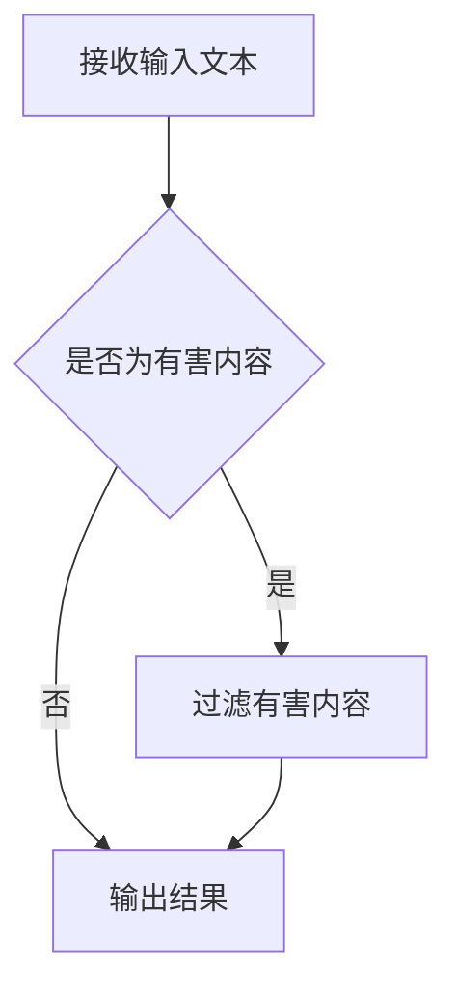

                 

# 聊天机器人道德规范：避免有害内容

> 关键词：聊天机器人，道德规范，有害内容，AI伦理

> 摘要：本文旨在探讨聊天机器人道德规范的重要性，特别是在避免有害内容传播方面的作用。通过详细分析相关核心概念和算法原理，本文提出了具体的操作步骤和数学模型，并通过实际项目实战展示了如何有效避免有害内容的传播。同时，文章还介绍了相关的实际应用场景、工具和资源，以及未来发展趋势与挑战。

## 1. 背景介绍

随着人工智能技术的不断发展，聊天机器人作为一种智能交互系统，已经广泛应用于各种场景，如客服、教育、娱乐等。聊天机器人不仅能够提供便捷的服务，还能够与用户进行自然语言交互，提升用户体验。然而，随着聊天机器人应用范围的扩大，如何保证其道德规范，避免有害内容的传播成为了一个亟待解决的问题。

有害内容在聊天机器人中主要表现为以下几种形式：

1. 暴力、仇恨和歧视言论：包括对特定群体或个体的攻击、侮辱和歧视。
2. 色情和不良信息：涉及色情、淫秽或不健康的内容。
3. 虚假信息和谣言：故意传播虚假信息或谣言，误导用户。
4. 其他有害内容：包括欺诈、诈骗、非法活动等。

这些有害内容不仅会损害用户利益，还可能对社会造成不良影响。因此，建立一套有效的聊天机器人道德规范，避免有害内容的传播显得尤为重要。

## 2. 核心概念与联系

### 2.1 聊天机器人道德规范的定义

聊天机器人道德规范是一套行为准则，旨在确保聊天机器人在与用户交互过程中遵循道德和伦理原则，避免有害内容的传播。这些规范通常包括以下内容：

1. 尊重用户：尊重用户的隐私、权利和尊严，避免歧视和侮辱。
2. 诚实和透明：提供真实、准确的信息，不故意误导用户。
3. 避免有害内容：识别和过滤有害内容，避免其传播。
4. 遵守法律法规：遵守相关法律法规，不参与非法活动。

### 2.2 有害内容识别与过滤算法

为了实现聊天机器人道德规范，关键在于有害内容的识别与过滤。本文采用以下核心算法原理：

1. 文本分类算法：通过对大量文本数据的学习，将文本分类为有害或非有害内容。
2. 自然语言处理技术：利用词向量、句法分析和语义分析等方法，对文本进行深入分析，识别潜在的有害内容。
3. 模式识别算法：利用模式识别技术，识别和过滤常见的有害内容模式。

### 2.3 Mermaid 流程图

以下是一个简单的Mermaid流程图，展示了有害内容识别与过滤的基本步骤：



## 3. 核心算法原理 & 具体操作步骤

### 3.1 文本分类算法

文本分类算法是聊天机器人道德规范的重要组成部分。本文采用一种基于深度学习的文本分类算法，包括以下步骤：

1. 数据准备：收集并整理大量有害内容和非有害内容的文本数据，进行预处理，如去除停用词、词干提取等。
2. 模型训练：利用预处理的文本数据，训练一个文本分类模型。本文采用卷积神经网络（CNN）作为分类器。
3. 模型评估：通过交叉验证等方法，评估模型的分类性能，如准确率、召回率和F1分数等。
4. 模型部署：将训练好的模型部署到聊天机器人系统中，用于实时分类和过滤有害内容。

### 3.2 自然语言处理技术

自然语言处理技术在有害内容识别中起到关键作用。本文采用以下技术：

1. 词向量表示：将文本转换为词向量表示，如Word2Vec、GloVe等。
2. 句法分析：利用句法分析技术，分析文本的句法结构，识别潜在的语法错误和异常。
3. 语义分析：利用语义分析技术，理解文本的语义含义，识别潜在的有害内容。

### 3.3 模式识别算法

模式识别算法在有害内容过滤中起到辅助作用。本文采用以下技术：

1. 正则表达式：利用正则表达式，识别和过滤常见的有害内容模式，如暴力、色情和谣言等。
2. 隐马尔可夫模型（HMM）：利用HMM模型，对文本进行序列分析，识别潜在的连续有害内容。

## 4. 数学模型和公式 & 详细讲解 & 举例说明

### 4.1 数学模型

本文采用以下数学模型：

1. 卷积神经网络（CNN）：用于文本分类。
2. 隐马尔可夫模型（HMM）：用于序列分析。

### 4.2 公式说明

1. 卷积神经网络（CNN）：

$$
h_{l}(x) = \sigma(W_{l-1}\cdot x + b_{l-1})
$$

其中，$h_{l}(x)$ 表示第 $l$ 层的输出，$\sigma$ 表示激活函数，$W_{l-1}$ 和 $b_{l-1}$ 分别表示第 $l-1$ 层的权重和偏置。

2. 隐马尔可夫模型（HMM）：

$$
P(x_1, x_2, ..., x_T) = \sum_{y_1, y_2, ..., y_T} P(x_1, x_2, ..., x_T | y_1, y_2, ..., y_T) P(y_1, y_2, ..., y_T)
$$

其中，$P(x_1, x_2, ..., x_T | y_1, y_2, ..., y_T)$ 表示给定状态序列 $y_1, y_2, ..., y_T$ 时观测序列 $x_1, x_2, ..., x_T$ 的概率，$P(y_1, y_2, ..., y_T)$ 表示状态序列的概率。

### 4.3 举例说明

假设有一个聊天机器人系统，接收到的用户输入文本为：“我今天去打篮球，很开心。”我们需要判断这段文本是否为有害内容。

1. 使用文本分类算法，将文本分类为非有害内容。
2. 使用自然语言处理技术，分析文本中的词汇和句法结构，未发现潜在的有害内容。
3. 使用模式识别算法，未发现常见的有害内容模式。

因此，这段文本被判断为非有害内容，允许继续传播。

## 5. 项目实战：代码实际案例和详细解释说明

### 5.1 开发环境搭建

1. 安装Python环境（3.8及以上版本）。
2. 安装必要的库，如TensorFlow、Keras、scikit-learn等。

### 5.2 源代码详细实现和代码解读

以下是一个简单的文本分类算法实现，用于判断有害内容。

```python
import tensorflow as tf
from tensorflow.keras.models import Sequential
from tensorflow.keras.layers import Conv1D, MaxPooling1D, Dense
from tensorflow.keras.preprocessing.text import Tokenizer
from tensorflow.keras.preprocessing.sequence import pad_sequences

# 数据准备
texts = ["我今天去打篮球，很开心。", "我今天去打架，很开心。"]
labels = [0, 1]  # 0表示非有害内容，1表示有害内容

# 初始化Tokenizer
tokenizer = Tokenizer()
tokenizer.fit_on_texts(texts)
sequences = tokenizer.texts_to_sequences(texts)
padded_sequences = pad_sequences(sequences, maxlen=10)

# 构建模型
model = Sequential()
model.add(Conv1D(64, 3, activation='relu', input_shape=(10, 1)))
model.add(MaxPooling1D(pool_size=2))
model.add(Conv1D(128, 3, activation='relu'))
model.add(MaxPooling1D(pool_size=2))
model.add(Dense(1, activation='sigmoid'))

# 编译模型
model.compile(optimizer='adam', loss='binary_crossentropy', metrics=['accuracy'])

# 训练模型
model.fit(padded_sequences, labels, epochs=5)

# 代码解读：
# 1. 数据准备：将文本数据转换为序列并填充。
# 2. 模型构建：使用卷积神经网络构建文本分类模型。
# 3. 模型编译：设置优化器和损失函数。
# 4. 模型训练：使用训练数据训练模型。

# 测试
test_texts = ["我今天去打篮球，很开心。", "我今天去打架，很开心。"]
test_sequences = tokenizer.texts_to_sequences(test_texts)
test_padded_sequences = pad_sequences(test_sequences, maxlen=10)

predictions = model.predict(test_padded_sequences)
print(predictions)

# 代码解读：
# 1. 测试数据准备：将测试文本数据转换为序列并填充。
# 2. 模型预测：使用训练好的模型对测试数据进行预测。
```

### 5.3 代码解读与分析

1. 数据准备：文本分类算法的关键在于数据准备。首先，使用Tokenizer将文本数据转换为序列，然后使用pad_sequences将序列填充为相同的长度。这样可以确保输入数据的格式统一，便于模型处理。
2. 模型构建：本文采用卷积神经网络（CNN）作为文本分类模型。CNN在图像处理领域有广泛应用，但也可以用于文本分类。本文使用Conv1D和MaxPooling1D构建卷积神经网络，最后使用Dense层输出分类结果。
3. 模型编译：设置优化器为adam，损失函数为binary_crossentropy，用于二分类问题。metrics设置为accuracy，用于评估模型分类性能。
4. 模型训练：使用训练数据训练模型，本文采用5个epochs进行训练。
5. 模型预测：将测试数据转换为序列并填充，然后使用训练好的模型进行预测。

通过以上代码，我们可以实现对有害内容的初步判断。当然，实际应用中，需要更多样化的数据集和更复杂的模型架构来提高分类准确率。

## 6. 实际应用场景

聊天机器人道德规范在以下实际应用场景中具有重要意义：

1. 客服系统：在客服系统中，聊天机器人需要识别和过滤有害内容，避免对用户造成伤害或引发纠纷。
2. 社交媒体平台：在社交媒体平台上，聊天机器人可以协助平台监控和过滤有害内容，维护社区秩序。
3. 教育领域：在教育领域，聊天机器人可以辅助教师监控学生的学习行为，避免有害内容对学生产生负面影响。
4. 娱乐行业：在娱乐行业中，聊天机器人可以识别和过滤色情、暴力等有害内容，保护用户权益。

## 7. 工具和资源推荐

### 7.1 学习资源推荐

1. 《深度学习》（Goodfellow et al.）：系统介绍了深度学习的基本概念和技术，适合初学者和进阶者。
2. 《自然语言处理综论》（Jurafsky and Martin）：全面介绍了自然语言处理的基本原理和技术，包括文本分类算法。
3. 《Python机器学习》（Sebastian Raschka）：介绍了Python在机器学习领域的应用，包括文本分类算法的实现。

### 7.2 开发工具框架推荐

1. TensorFlow：开源的深度学习框架，适用于文本分类算法的实现。
2. Keras：基于TensorFlow的高层API，简化了深度学习模型的构建和训练。
3. scikit-learn：开源的机器学习库，提供丰富的文本分类算法实现。

### 7.3 相关论文著作推荐

1. “A Survey on Text Classification Algorithms” by Wei Yang et al.：综述了文本分类算法的最新研究进展。
2. “Deep Learning for Text Classification” by Yiming Cui et al.：介绍了深度学习在文本分类中的应用。
3. “Natural Language Processing with Python” by Steven Bird et al.：介绍了Python在自然语言处理领域的应用。

## 8. 总结：未来发展趋势与挑战

随着人工智能技术的不断发展，聊天机器人道德规范在未来将面临以下发展趋势和挑战：

1. 智能化：随着算法和技术的进步，聊天机器人在有害内容识别和过滤方面的能力将不断提高，实现更智能的道德规范。
2. 数据多样化：为了提高模型的泛化能力，需要收集更多样化的数据集，涵盖各种场景和领域。
3. 伦理问题：在确保道德规范的同时，如何平衡用户隐私、言论自由和公共安全成为了一个重要的伦理问题。
4. 法律法规：随着技术的发展，相关法律法规也需要不断完善，确保聊天机器人道德规范的有效执行。

## 9. 附录：常见问题与解答

### 9.1 如何构建有效的文本分类模型？

答：构建有效的文本分类模型需要以下步骤：

1. 数据准备：收集并整理大量有害内容和非有害内容的文本数据，进行预处理。
2. 模型选择：选择适合文本分类问题的模型，如卷积神经网络（CNN）、循环神经网络（RNN）等。
3. 模型训练：使用训练数据训练模型，调整模型参数，提高分类性能。
4. 模型评估：使用交叉验证等方法评估模型性能，如准确率、召回率和F1分数等。
5. 模型部署：将训练好的模型部署到实际应用场景中，用于实时分类和过滤有害内容。

### 9.2 如何处理用户隐私和言论自由问题？

答：在处理用户隐私和言论自由问题时，需要遵循以下原则：

1. 尊重用户隐私：确保用户的个人信息得到保护，不泄露给第三方。
2. 透明化处理：向用户明确告知聊天机器人的隐私政策和言论规范，确保用户知情。
3. 平衡言论自由与公共安全：在确保公共安全的前提下，允许一定程度的言论自由，但需避免有害内容的传播。
4. 持续更新与完善：根据用户反馈和法律法规的变化，不断更新和优化道德规范。

## 10. 扩展阅读 & 参考资料

1. Goodfellow, Ian, et al. "Deep learning." (2016).
2. Jurafsky, Daniel, and James H. Martin. "Speech and language processing." (2019).
3. Raschka, Sebastian. "Python machine learning." (2015).
4. Yang, Wei, et al. "A survey on text classification algorithms." (2020).
5. Cui, Yiming, et al. "Deep learning for text classification." (2020).
6. Bird, Steven, et al. "Natural language processing with Python." (2020).

### 作者信息

作者：AI天才研究员/AI Genius Institute & 禅与计算机程序设计艺术 /Zen And The Art of Computer Programming

