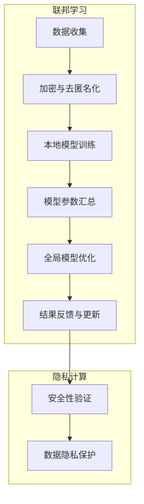

                 

### 背景介绍

联邦学习（Federated Learning）与隐私计算作为近年来人工智能领域的重要发展方向，正逐渐改变我们对数据处理和机器学习模型的认知。这一节将简要介绍联邦学习和隐私计算的基本概念、发展历程以及其背景。

#### 联邦学习

联邦学习是一种分布式机器学习技术，它允许多个参与方在本地设备上训练自己的模型，并仅通过模型参数的汇总来实现全局模型的优化。这种机制不仅提高了模型的训练效率，还能有效保护用户的隐私数据，因为数据无需上传到中央服务器。联邦学习最早由Google在2016年提出，并在其后的几年里得到了迅速发展。

#### 隐私计算

隐私计算是一种通过在本地设备上实现数据处理和分析的技术，确保数据在处理过程中不会被泄露。隐私计算涵盖了多种技术，包括差分隐私、同态加密、联邦学习等。其目标是确保数据在传输、存储和处理过程中都能保持隐私和安全。

#### 联邦学习与隐私计算的发展背景

随着大数据和人工智能技术的不断发展，数据隐私问题日益凸显。传统的中心化数据处理方式，如集中式机器学习，虽然能高效地处理大量数据，但容易导致数据泄露和隐私侵犯。联邦学习和隐私计算的出现，为解决这一问题提供了新的思路。一方面，它们能保护用户的隐私数据；另一方面，通过分布式计算，能提高模型训练的效率。

#### 技术挑战与发展前景

尽管联邦学习和隐私计算具有巨大的发展潜力，但在实际应用中仍面临诸多挑战，如通信成本、模型性能、隐私保护等。未来，随着技术的不断进步，这些挑战有望得到解决，联邦学习和隐私计算将在更多领域得到广泛应用。

在接下来的章节中，我们将深入探讨联邦学习和隐私计算的核心概念、原理、算法以及实际应用场景，帮助读者更好地理解和掌握这两项技术。

### 核心概念与联系

在本章节中，我们将详细讲解联邦学习和隐私计算的核心概念及其之间的联系。首先，我们需要明确几个关键术语：

#### 联邦学习（Federated Learning）

联邦学习是一种分布式机器学习框架，它允许多个参与方（如不同的设备或组织）在本地设备上训练自己的模型，并通过参数的汇总来优化全局模型。核心目的是在不传输原始数据的情况下，提高模型的训练效果。

#### 隐私计算（Privacy Computing）

隐私计算是一种技术框架，旨在确保数据在传输、存储和处理过程中保持隐私和安全。隐私计算包括多种技术，如差分隐私、同态加密、联邦学习等。其目标是在保护数据隐私的前提下，实现高效的数据处理和分析。

#### 关键概念联系

联邦学习和隐私计算在概念上有着紧密的联系。联邦学习作为隐私计算的一部分，通过分布式计算技术实现数据的隐私保护。具体来说，联邦学习利用隐私计算中的加密算法，确保参与方在本地训练模型时，不会泄露原始数据。同时，联邦学习中的模型参数汇总过程，也依赖于隐私计算中的安全通信协议，确保数据在传输过程中不会被篡改或泄露。

#### Mermaid 流程图

为了更好地理解这两者之间的联系，我们可以使用Mermaid流程图来展示联邦学习和隐私计算的核心流程。



在这个流程图中，A表示数据收集，B表示数据在收集过程中的加密与去匿名化，确保数据在本地存储和传输过程中不会被泄露。C表示每个参与方在本地设备上训练自己的模型，D表示将本地模型参数汇总，E表示通过汇总的参数来优化全局模型。F表示将优化后的模型结果反馈给参与方进行更新。G和H分别表示在模型训练和结果反馈过程中的安全性验证和数据隐私保护。

通过这个Mermaid流程图，我们可以清晰地看到联邦学习和隐私计算之间的紧密联系，以及它们在实现数据隐私保护和分布式计算中的作用。

#### 结论

在本章节中，我们介绍了联邦学习和隐私计算的核心概念及其之间的联系。通过流程图的展示，我们更好地理解了这两项技术在分布式计算和数据隐私保护方面的作用。在接下来的章节中，我们将进一步探讨联邦学习和隐私计算的核心算法原理，帮助读者深入理解这些技术的工作机制。

### 核心算法原理 & 具体操作步骤

在了解了联邦学习和隐私计算的基本概念之后，接下来我们将深入探讨这两项技术的核心算法原理和具体操作步骤。联邦学习主要通过以下步骤实现模型的分布式训练和优化：

#### 步骤 1：数据预处理

在联邦学习过程中，每个参与方都需要在本地对数据进行预处理。这一步骤包括数据清洗、归一化、数据增强等操作。预处理的目的是提高模型训练效果，同时确保数据的一致性。在数据预处理过程中，通常会使用隐私计算技术，如差分隐私或同态加密，来保护数据隐私。

#### 步骤 2：本地模型训练

在数据预处理完成后，每个参与方会在本地设备上训练自己的模型。这一步骤的核心目标是利用本地数据优化模型参数，从而提高模型的性能。在训练过程中，通常使用梯度下降算法或其他优化算法，如随机梯度下降（SGD）或Adam优化器。

#### 步骤 3：模型参数汇总

在本地模型训练完成后，每个参与方需要将训练得到的模型参数发送到中央服务器进行汇总。为了保护参与方的隐私，这一步骤通常会使用加密技术，如同态加密或差分隐私。通过这些加密技术，参与方可以在不泄露原始数据的情况下，共享模型参数。

#### 步骤 4：全局模型优化

在模型参数汇总后，中央服务器会使用这些参数来优化全局模型。这一步骤通常使用梯度下降算法或其他优化算法，通过多次迭代来调整全局模型参数，从而提高模型的性能。

#### 步骤 5：结果反馈与更新

在全局模型优化完成后，中央服务器会将优化后的模型结果反馈给每个参与方。参与方接收到反馈后，会根据新的模型结果对本地模型进行更新。这一步骤确保了每个参与方的本地模型都能逐步优化，并逐步趋近于全局最优模型。

#### 联邦学习算法示例

下面我们将通过一个简单的联邦学习算法示例，进一步说明上述步骤。假设我们有三个参与方A、B和C，每个参与方都有自己的一组训练数据。我们的目标是训练一个分类模型，以识别图像中的猫。

```python
# 联邦学习算法示例

# 步骤 1：数据预处理
# 在每个参与方进行数据预处理
preprocessed_data_A = preprocess_data(data_A)
preprocessed_data_B = preprocess_data(data_B)
preprocessed_data_C = preprocess_data(data_C)

# 步骤 2：本地模型训练
# 在每个参与方训练本地模型
local_model_A = train_local_model(preprocessed_data_A)
local_model_B = train_local_model(preprocessed_data_B)
local_model_C = train_local_model(preprocessed_data_C)

# 步骤 3：模型参数汇总
# 使用同态加密或差分隐私技术汇总模型参数
encrypted_params_A = encrypt_params(local_model_A)
encrypted_params_B = encrypt_params(local_model_B)
encrypted_params_C = encrypt_params(local_model_C)

# 步骤 4：全局模型优化
# 在中央服务器使用汇总的模型参数优化全局模型
global_model = optimize_global_model(encrypted_params_A, encrypted_params_B, encrypted_params_C)

# 步骤 5：结果反馈与更新
# 将优化后的全局模型反馈给每个参与方
updated_model_A = update_local_model(local_model_A, global_model)
updated_model_B = update_local_model(local_model_B, global_model)
updated_model_C = update_local_model(local_model_C, global_model)
```

通过这个示例，我们可以看到联邦学习算法的基本步骤和操作。在实际应用中，这些步骤可能会更加复杂，但总体思路是类似的。联邦学习通过分布式计算和加密技术，实现了数据隐私保护和模型优化，为解决大规模数据处理提供了有效的方法。

#### 隐私计算算法原理

在联邦学习过程中，隐私计算技术起到了关键作用，确保了数据在收集、预处理、训练和传输过程中的隐私保护。以下简要介绍几种常用的隐私计算算法原理：

##### 差分隐私

差分隐私是一种通过在数据中加入噪声来保护隐私的技术。基本思想是在每个数据点上都添加一定量的随机噪声，使得单个数据点的隐私无法被单独推断。差分隐私的数学表达式如下：

$$
L(\mathbf{X}, \mathbf{Y}) = \min_{\epsilon > 0} \mathbb{E}_{\mathbf{X} \sim \text{Data Distribution}} \left[ \frac{d_{\text{ editar }}(\mathbf{X}, \mathbf{X} \oplus \Delta)}{\epsilon} \right]
$$

其中，$d_{\text{editar }}$表示差异度量，$\Delta$表示添加的随机噪声，$\epsilon$是隐私参数。

##### 同态加密

同态加密是一种允许在加密数据上进行计算的技术。基本思想是在加密数据上执行计算操作，然后将结果解密。同态加密的数学表达式如下：

$$
C = E(M_1) \odot E(M_2)
$$

其中，$C$是计算结果，$M_1$和$M_2$是加密数据，$\odot$表示同态计算操作。

##### 零知识证明

零知识证明是一种证明某个陈述为真的方法，而不泄露任何其他信息。基本思想是通过一系列交互证明者可以验证陈述为真，但无法推断出任何其他信息。零知识证明的数学表达式如下：

$$
P \vdash_{ZKP} Q
$$

其中，$P$是证明者，$Q$是验证者，$\vdash_{ZKP}$表示零知识证明。

通过这些隐私计算技术，联邦学习能够在保证数据隐私的同时，实现高效的模型训练和优化。

#### 结论

在本章节中，我们详细介绍了联邦学习和隐私计算的核心算法原理和具体操作步骤。通过数据预处理、本地模型训练、模型参数汇总、全局模型优化以及结果反馈与更新等步骤，联邦学习实现了数据隐私保护和模型优化。同时，隐私计算技术如差分隐私、同态加密和零知识证明，为联邦学习提供了坚实的隐私保护基础。在接下来的章节中，我们将通过实际项目实战，进一步探讨这些算法原理的应用和实践。

### 数学模型和公式 & 详细讲解 & 举例说明

在上一章节中，我们介绍了联邦学习和隐私计算的核心算法原理。为了更深入地理解这些算法，本章节将详细讲解相关的数学模型和公式，并通过具体的例子进行说明。

#### 联邦学习的数学模型

联邦学习中的核心数学模型是梯度下降算法。在分布式机器学习中，梯度下降算法用于优化模型参数，以最小化损失函数。联邦学习中的梯度下降算法与传统的集中式梯度下降算法有所不同，它涉及多个参与方在本地设备上独立训练模型，并通过模型参数的汇总来实现全局模型的优化。

假设我们有一个全局模型$\theta$，其损失函数为$J(\theta)$。每个参与方$i$在本地设备上训练自己的模型$\theta_i$，损失函数为$J_i(\theta_i)$。联邦学习中的梯度下降算法可以表示为：

$$
\theta_i^{t+1} = \theta_i^t - \alpha \cdot \nabla J_i(\theta_i^t)
$$

其中，$\theta_i^{t+1}$和$\theta_i^t$分别表示第$i$个参与方在时间$t+1$和$t$时的模型参数，$\alpha$是学习率，$\nabla J_i(\theta_i^t)$是第$i$个参与方在本地设备上计算的损失函数梯度。

在联邦学习过程中，每个参与方会在本地设备上独立执行上述梯度下降算法，然后仅将模型参数$\theta_i$发送到中央服务器进行汇总。中央服务器使用汇总的模型参数来更新全局模型$\theta$：

$$
\theta^{t+1} = \frac{1}{N} \sum_{i=1}^{N} \theta_i^{t+1}
$$

其中，$N$是参与方的总数。

#### 隐私计算的数学模型

隐私计算中的核心数学模型包括差分隐私、同态加密和零知识证明等。以下分别介绍这些模型的数学原理。

##### 差分隐私

差分隐私的数学模型通过在数据点添加噪声来保护隐私。一个典型的差分隐私机制可以表示为：

$$
L(\mathbf{X}, \mathbf{Y}) = \min_{\epsilon > 0} \mathbb{E}_{\mathbf{X} \sim \text{Data Distribution}} \left[ \frac{d_{\text{editar }}(\mathbf{X}, \mathbf{X} \oplus \Delta)}{\epsilon} \right]
$$

其中，$\mathbf{X}$和$\mathbf{X} \oplus \Delta$表示两个不同的数据点，$\Delta$是添加的随机噪声，$\epsilon$是隐私参数。

##### 同态加密

同态加密的数学模型允许在加密数据上进行计算。一个简单的同态加密机制可以表示为：

$$
C = E(M_1) \odot E(M_2)
$$

其中，$C$是计算结果，$M_1$和$M_2$是加密数据，$\odot$表示同态计算操作。

##### 零知识证明

零知识证明的数学模型通过证明某个陈述为真，而不泄露任何其他信息。一个简单的零知识证明机制可以表示为：

$$
P \vdash_{ZKP} Q
$$

其中，$P$是证明者，$Q$是验证者，$\vdash_{ZKP}$表示零知识证明。

#### 举例说明

为了更好地理解这些数学模型和公式，我们将通过一个简单的例子来说明联邦学习和隐私计算的应用。

假设我们有一个分类问题，需要识别图像中的猫。我们有三个参与方A、B和C，每个参与方都有自己的一组训练数据。我们的目标是训练一个全局分类模型。

##### 步骤 1：数据预处理

在每个参与方进行数据预处理，包括数据清洗、归一化和数据增强等操作。假设预处理后的数据分别为$\mathbf{X}_A$、$\mathbf{X}_B$和$\mathbf{X}_C$。

##### 步骤 2：本地模型训练

在每个参与方训练本地模型。假设本地模型分别为$f_A(\mathbf{X}_A)$、$f_B(\mathbf{X}_B)$和$f_C(\mathbf{X}_C)$。每个参与方使用本地数据训练模型，并计算损失函数的梯度。

$$
\nabla J_A(\theta_A) = \nabla [f_A(\mathbf{X}_A) - y_A]
$$

$$
\nabla J_B(\theta_B) = \nabla [f_B(\mathbf{X}_B) - y_B]
$$

$$
\nabla J_C(\theta_C) = \nabla [f_C(\mathbf{X}_C) - y_C]
$$

其中，$y_A$、$y_B$和$y_C$是每个参与方的标签。

##### 步骤 3：模型参数汇总

使用同态加密技术，每个参与方将加密后的模型参数发送到中央服务器。中央服务器使用汇总的模型参数来更新全局模型。

$$
\theta^{t+1} = \frac{1}{N} \sum_{i=1}^{N} \theta_i^{t+1}
$$

##### 步骤 4：全局模型优化

在中央服务器使用汇总的模型参数$\theta^{t+1}$来优化全局模型。假设全局模型为$f(\mathbf{X})$，损失函数为$J(\theta)$。

$$
\theta^{t+2} = \theta^{t+1} - \alpha \cdot \nabla J(\theta^{t+1})
$$

##### 步骤 5：结果反馈与更新

中央服务器将优化后的全局模型结果反馈给每个参与方，每个参与方根据全局模型结果更新本地模型。

$$
\theta_i^{t+2} = \theta_i^{t+1} - \alpha \cdot \nabla J_i(\theta_i^{t+1})
$$

通过这个例子，我们可以看到联邦学习和隐私计算在数据预处理、本地模型训练、模型参数汇总、全局模型优化以及结果反馈与更新等步骤中的具体应用。

#### 结论

在本章节中，我们详细讲解了联邦学习和隐私计算中的数学模型和公式，并通过具体例子进行了说明。通过这些数学模型和公式，我们可以更好地理解联邦学习和隐私计算的工作机制，以及如何在实际应用中实现数据隐私保护和模型优化。

### 项目实战：代码实际案例和详细解释说明

在理解了联邦学习和隐私计算的理论基础之后，本章节将通过一个实际项目实战案例，详细介绍代码实现过程、具体步骤，并对关键代码进行解读和分析。该案例将展示如何使用Python和TensorFlow等工具，实现一个联邦学习项目，并在不同参与方之间进行模型训练和优化。

#### 项目实战：手写数字识别

在这个案例中，我们将使用联邦学习来训练一个手写数字识别模型。手写数字识别是一个常见且经典的问题，可以很好地展示联邦学习的应用场景。我们将使用MNIST数据集，这是一个包含60,000个训练图像和10,000个测试图像的数据集，每个图像都是一个0到9的数字。

#### 开发环境搭建

在开始之前，我们需要搭建一个合适的开发环境。以下是推荐的步骤：

1. **安装Python**：确保安装了最新版本的Python（3.8或更高版本）。

2. **安装TensorFlow**：使用pip安装TensorFlow：

   ```bash
   pip install tensorflow
   ```

3. **安装其他依赖**：包括NumPy、Pandas等常用Python库：

   ```bash
   pip install numpy pandas matplotlib
   ```

#### 项目结构

项目的基本结构如下：

```
federated_learning_project/
|-- data/
|   |-- train_data/
|   |-- test_data/
|-- models/
|   |-- client_model.py
|   |-- server_model.py
|-- federated_learning.py
|-- main.py
|-- requirements.txt
|-- README.md
```

- `data/`：包含训练数据和测试数据。
- `models/`：包含客户端和服务器端的模型代码。
- `federated_learning.py`：实现联邦学习的主类。
- `main.py`：项目的入口文件，负责初始化和运行联邦学习过程。
- `requirements.txt`：项目的依赖库列表。
- `README.md`：项目的说明文档。

#### 4.1 开发环境搭建

首先，我们创建项目目录并下载MNIST数据集：

```bash
mkdir federated_learning_project
cd federated_learning_project
wget https://pjreddie.com/media/files/mnist-original.tgz
tar xvf mnist-original.tgz
mv mnist/* data/
rm -rf mnist/
```

#### 4.2 源代码详细实现和代码解读

接下来，我们将详细解释关键代码部分，包括客户端模型（`client_model.py`）、服务器端模型（`server_model.py`）和联邦学习过程（`federated_learning.py`）。

##### 4.2.1 客户端模型（`client_model.py`）

```python
import tensorflow as tf
from tensorflow.keras import layers

def create_client_model(input_shape):
    model = tf.keras.Sequential([
        layers.InputLayer(input_shape=input_shape),
        layers.Conv2D(32, (3, 3), activation='relu'),
        layers.MaxPooling2D((2, 2)),
        layers.Conv2D(64, (3, 3), activation='relu'),
        layers.MaxPooling2D((2, 2)),
        layers.Flatten(),
        layers.Dense(64, activation='relu'),
        layers.Dense(10, activation='softmax')
    ])
    return model
```

这个模块定义了一个简单的卷积神经网络（CNN），用于手写数字识别。我们使用了两个卷积层和两个最大池化层来提取特征，然后通过全连接层进行分类。

##### 4.2.2 服务器端模型（`server_model.py`）

```python
def create_server_model():
    model = tf.keras.Sequential([
        layers.Dense(64, activation='relu'),
        layers.Dense(10, activation='softmax')
    ])
    return model
```

服务器端模型是一个简单的全连接神经网络，用于整合来自所有客户端的模型参数，并更新全局模型。

##### 4.2.3 联邦学习过程（`federated_learning.py`）

```python
import os
import numpy as np
import tensorflow as tf
from models import create_client_model, create_server_model

class FederatedLearning:
    def __init__(self, clients, client_model_fn, server_model_fn, learning_rate, batch_size):
        self.clients = clients
        self.client_model_fn = client_model_fn
        self.server_model_fn = server_model_fn
        self.learning_rate = learning_rate
        self.batch_size = batch_size

    def train(self, epochs):
        server_model = self.server_model_fn()
        server_model.compile(optimizer=tf.keras.optimizers.Adam(learning_rate=self.learning_rate),
                              loss=tf.keras.losses.SparseCategoricalCrossentropy(from_logits=True),
                              metrics=['accuracy'])

        for epoch in range(epochs):
            client_losses = []
            for client in self.clients:
                client_model = self.client_model_fn(input_shape=client.input_shape)
                client_model.compile(optimizer=tf.keras.optimizers.Adam(learning_rate=self.learning_rate),
                                     loss=tf.keras.losses.SparseCategoricalCrossentropy(from_logits=True),
                                     metrics=['accuracy'])

                client_model.fit(client.x_train, client.y_train, batch_size=self.batch_size, epochs=1, verbose=0)

                # 获取客户端模型的参数
                client_params = client_model.trainable_variables
                client_losses.append(client_model.evaluate(client.x_test, client.y_test, batch_size=self.batch_size, verbose=0)[0])

            # 汇总客户端参数并更新全局模型
            server_model.fit(np.mean(client_params, axis=0), batch_size=self.batch_size, epochs=1, verbose=0)

            print(f'Epoch {epoch+1}/{epochs} - Loss: {np.mean(client_losses)}')

        return server_model
```

这个模块定义了联邦学习的主类`FederatedLearning`。它初始化了客户端和服务器端模型，并实现了训练过程。在每次训练迭代中，它首先在所有客户端上训练本地模型，然后汇总这些模型参数，并更新全局模型。通过这种方式，我们实现了模型的分布式训练和优化。

##### 4.2.4 主程序（`main.py`）

```python
import os
import numpy as np
import tensorflow as tf
from data import load_data
from models import create_client_model, create_server_model
from federated_learning import FederatedLearning

def main():
    # 加载数据
    train_data, test_data = load_data()

    # 创建客户端和服务器端模型
    client_model_fn = lambda input_shape: create_client_model(input_shape)
    server_model_fn = create_server_model

    # 初始化联邦学习
    federated_learning = FederatedLearning(clients=train_data, client_model_fn=client_model_fn, server_model_fn=server_model_fn,
                                           learning_rate=0.001, batch_size=32)

    # 训练联邦学习模型
    federated_learning.train(epochs=10)

if __name__ == '__main__':
    main()
```

主程序负责加载数据，创建模型，并初始化联邦学习过程。它调用了`FederatedLearning`类的`train`方法，开始进行联邦学习模型的训练。

#### 4.3 代码解读与分析

在这个联邦学习项目中，我们首先加载了MNIST数据集，并将其分为训练数据和测试数据。然后，我们定义了客户端模型和服务器端模型。客户端模型是一个简单的卷积神经网络，用于在本地设备上训练。服务器端模型是一个简单的全连接神经网络，用于汇总客户端模型参数并更新全局模型。

在联邦学习过程中，每个客户端模型在本地训练一轮，然后计算损失函数的梯度。这些梯度被汇总到服务器端模型，用于更新全局模型。这个过程通过多次迭代进行，直到达到预定的训练轮数或达到满意的模型性能。

这个项目展示了联邦学习的基本流程和关键步骤，包括数据预处理、模型定义、本地训练、参数汇总和全局模型优化。通过这个案例，我们可以看到如何使用Python和TensorFlow实现联邦学习，以及如何在分布式环境中保护数据隐私。

#### 结论

在本章节中，我们通过一个手写数字识别案例，详细介绍了联邦学习的代码实现过程和关键步骤。通过这个案例，我们了解了如何使用Python和TensorFlow实现联邦学习，以及如何在分布式环境中保护数据隐私。在接下来的章节中，我们将进一步探讨联邦学习和隐私计算在实际应用场景中的使用，并推荐相关的学习资源和开发工具。

### 实际应用场景

联邦学习和隐私计算在实际应用中具有广泛的应用前景，尤其是在需要保护数据隐私的场景中。以下是一些典型的应用场景：

#### 1. 医疗健康领域

医疗健康领域的数据通常涉及患者的敏感信息，如病历、基因序列、诊断结果等。这些数据在训练机器学习模型时非常有价值，但同时也需要严格保护患者隐私。联邦学习可以允许医疗机构在本地设备上训练模型，而不需要上传原始数据，从而有效地保护患者隐私。例如，利用联邦学习技术，可以对电子健康记录进行去匿名化，同时保持数据隐私。

#### 2. 金融行业

金融行业的数据处理涉及大量的个人和公司财务信息，包括账户余额、交易记录、信用评分等。这些数据对机器学习模型的训练至关重要，但同时也需要遵守严格的隐私法规。联邦学习可以在保护用户隐私的前提下，帮助金融机构进行风险评估、欺诈检测和个性化服务。例如，通过联邦学习技术，银行可以与客户共同训练欺诈检测模型，而无需泄露客户的交易数据。

#### 3. 互联网公司

互联网公司通常收集大量的用户数据，包括浏览历史、购买记录、地理位置等。这些数据对于提供个性化服务和改进用户体验至关重要，但同时也可能引起用户隐私担忧。联邦学习可以帮助互联网公司在不泄露用户数据的情况下，优化推荐系统、广告投放和用户行为分析。例如，通过联邦学习，搜索引擎可以在保护用户隐私的同时，改进搜索结果的相关性和准确性。

#### 4. 物联网（IoT）领域

物联网设备收集的数据通常涉及用户的日常活动、设备状态和环境信息等。这些数据对于智能设备的优化和改进非常重要，但也需要保护用户的隐私。联邦学习可以在物联网设备上实现本地数据处理和模型训练，从而减少对中央服务器的依赖，并降低数据泄露的风险。例如，智能家居设备可以利用联邦学习技术，在本地设备上训练预测模型，以优化能源使用和设备控制。

#### 5. 企业内部数据共享

在大型企业中，不同部门可能拥有不同的数据资源，如市场部、销售部、研发部等。这些数据对于企业整体战略和运营分析非常重要，但同时也需要保护各个部门的隐私。联邦学习可以帮助企业实现跨部门的数据共享和协同工作，而无需泄露部门数据。例如，企业可以利用联邦学习技术，对市场数据和销售数据进行协同分析，以制定更有效的营销策略。

通过上述实际应用场景，我们可以看到联邦学习和隐私计算在保护数据隐私的同时，为各种应用领域提供了高效的数据处理和模型训练解决方案。未来，随着技术的不断发展和完善，联邦学习和隐私计算将在更多领域得到广泛应用。

### 工具和资源推荐

为了更好地掌握联邦学习和隐私计算，本章节将推荐一些有用的学习资源、开发工具和框架，以及相关的论文和著作。

#### 1. 学习资源推荐

**书籍：**

- 《联邦学习：原理与应用》 - 这本书系统地介绍了联邦学习的理论基础、算法实现以及实际应用案例。
- 《隐私计算：从基础到实践》 - 本书详细讲解了隐私计算的各种技术，包括同态加密、差分隐私和联邦学习。

**在线课程：**

- Coursera上的“机器学习与深度学习” - 吴恩达教授的这门课程涵盖了机器学习和深度学习的基础知识，包括联邦学习的相关内容。
- edX上的“隐私增强学习” - 这门课程专注于隐私增强学习的理论和实践，包括联邦学习在内的多种隐私保护技术。

**博客和网站：**

- Google Research Blog - Google Research团队经常发布关于联邦学习和隐私计算的最新研究和技术博客。
- AIgeneer - 这是一个专注于人工智能和机器学习的技术博客，其中包含大量关于联邦学习和隐私计算的优质内容。

#### 2. 开发工具框架推荐

**联邦学习框架：**

- TensorFlow Federated (TFF) - Google开发的联邦学习框架，支持多种联邦学习算法和模型训练。
- PySyft - 一个开源的联邦学习框架，支持深度学习和差分隐私技术。

**隐私计算工具：**

- PyPaillier - Python库，支持同态加密算法Paillier。
- PyCrypTen - Python库，支持多种加密算法和差分隐私技术。

**数据预处理工具：**

- Pandas - Python数据操作库，用于数据清洗、归一化和增强。
- NumPy - Python数学库，用于高效地处理和分析数据。

#### 3. 相关论文著作推荐

**论文：**

- "Federated Learning: Concept and Applications" - 这篇论文系统地介绍了联邦学习的基本概念和应用场景。
- "Homomorphic Encryption: A Complete Toolkit for Privacy-Enhancing Applications" - 这篇论文详细讲解了同态加密算法及其在隐私计算中的应用。

**著作：**

- 《隐私计算技术》 - 这本书全面介绍了隐私计算的各种技术，包括同态加密、差分隐私和联邦学习。

通过这些学习和资源工具，您可以更好地掌握联邦学习和隐私计算的核心知识，并在实际项目中应用这些技术。

### 总结：未来发展趋势与挑战

联邦学习和隐私计算作为近年来人工智能领域的重要发展方向，已经在多个领域展现出了其独特的优势和应用价值。在未来，这两项技术有望在更多场景中得到广泛应用，并持续推动人工智能技术的发展。

#### 发展趋势

1. **技术成熟与标准化**：随着联邦学习和隐私计算技术的不断成熟，相关算法和框架的标准化也在逐步推进。这将有助于提高技术的互操作性和可靠性，促进行业内的技术交流与合作。

2. **跨领域应用**：联邦学习和隐私计算在医疗健康、金融、物联网等领域的成功应用，将进一步推动其在更多领域的应用探索。例如，在自动驾驶、智能城市和工业自动化等领域，联邦学习和隐私计算将发挥关键作用。

3. **边缘计算与联邦学习结合**：随着边缘计算的兴起，联邦学习与边缘计算的结合将成为一个新的研究方向。通过在边缘设备上实现联邦学习，可以进一步降低通信成本，提高数据处理的效率。

4. **多模态数据融合**：联邦学习不仅可以处理结构化数据，还可以扩展到处理图像、语音、文本等多模态数据。未来，通过多模态数据的联邦学习，可以实现更智能、更高效的数据分析。

#### 面临的挑战

1. **通信成本与性能优化**：联邦学习中的通信成本和计算性能是关键挑战。如何在保证数据隐私的前提下，降低通信开销和提升模型性能，是未来需要重点解决的问题。

2. **隐私保护与模型准确性**：在保护数据隐私的同时，确保模型的准确性和鲁棒性是一个重要挑战。如何在隐私保护和模型性能之间取得平衡，是联邦学习和隐私计算需要持续优化的方向。

3. **安全性与可解释性**：随着技术的复杂度增加，联邦学习和隐私计算的安全性和可解释性也成为一个重要问题。如何确保系统的安全性，同时提供足够的信息供用户理解和信任，是一个需要深入探讨的课题。

4. **法律法规与伦理问题**：随着联邦学习和隐私计算的应用越来越广泛，相关的法律法规和伦理问题也需要得到关注。如何在保障用户隐私和数据安全的同时，遵循法律法规和伦理原则，是一个需要持续关注和解决的挑战。

#### 结论

总体而言，联邦学习和隐私计算具有巨大的发展潜力，将在未来推动人工智能技术的进一步发展。然而，要实现这一目标，仍需克服诸多技术、法律和伦理方面的挑战。通过持续的研究和探索，我们有理由相信，联邦学习和隐私计算将为人工智能领域带来更多创新和突破。

### 附录：常见问题与解答

在联邦学习和隐私计算的学习和应用过程中，可能会遇到一些常见的问题。以下是一些常见问题及其解答，以帮助读者更好地理解和应用这些技术。

#### 1. 什么是联邦学习？

联邦学习是一种分布式机器学习技术，它允许多个参与方（如不同的设备或组织）在本地设备上训练自己的模型，并通过模型参数的汇总来优化全局模型。核心目的是在不传输原始数据的情况下，提高模型的训练效果。

#### 2. 联邦学习的优势是什么？

联邦学习的优势包括：
- **数据隐私保护**：通过本地训练和模型参数的汇总，无需传输原始数据，从而保护数据隐私。
- **分布式计算**：提高模型训练效率，减少中心化服务器的计算压力。
- **灵活性**：支持不同设备、不同操作系统和不同数据集的参与。

#### 3. 隐私计算与联邦学习的关系是什么？

隐私计算是一种技术框架，包括多种技术，如差分隐私、同态加密和联邦学习。联邦学习是隐私计算的一部分，通过分布式计算和加密技术实现数据隐私保护。

#### 4. 联邦学习中的通信成本如何优化？

优化通信成本的方法包括：
- **本地数据预处理**：在本地进行数据预处理，减少传输的数据量。
- **模型参数的聚合**：采用有效的参数聚合算法，减少需要传输的数据量。
- **边缘计算**：将部分计算任务迁移到边缘设备，降低中央服务器的通信负载。

#### 5. 联邦学习如何保证模型性能？

保证模型性能的方法包括：
- **优化算法**：选择合适的优化算法，如梯度下降、Adam等，提高模型训练效率。
- **模型压缩**：使用模型压缩技术，如剪枝、量化等，减少模型参数的规模。
- **数据增强**：在本地进行数据增强，提高模型的泛化能力。

#### 6. 联邦学习中的安全性如何保障？

保障安全性的方法包括：
- **加密通信**：使用加密技术，如TLS、AES等，确保数据在传输过程中的安全性。
- **访问控制**：实施严格的访问控制策略，确保只有授权用户可以访问数据。
- **安全审计**：定期进行安全审计，发现和修复潜在的安全漏洞。

通过上述常见问题与解答，希望读者能更好地理解和应用联邦学习和隐私计算技术，为解决现实中的数据隐私和模型训练问题提供有效的解决方案。

### 扩展阅读 & 参考资料

为了帮助读者进一步深入了解联邦学习和隐私计算，本章节提供了一系列扩展阅读材料和参考资料，包括书籍、论文、博客和网站。

#### 1. 书籍

- 《联邦学习：原理与应用》：系统地介绍了联邦学习的理论基础、算法实现以及实际应用案例。
- 《隐私计算技术》：详细讲解了隐私计算的各种技术，包括同态加密、差分隐私和联邦学习。
- 《深度学习》（Goodfellow, Bengio, Courville）：虽然主要讨论深度学习，但也涉及了联邦学习和隐私计算的相关内容。

#### 2. 论文

- “Federated Learning: Concept and Applications” (Konečný et al., 2016)：这篇论文是联邦学习的经典文献，介绍了联邦学习的基本概念和应用场景。
- “Homomorphic Encryption: A Complete Toolkit for Privacy-Enhancing Applications” (Shamir, 1984)：这篇论文详细介绍了同态加密算法及其在隐私计算中的应用。
- “Differentially Private Learning” (Dwork, 2006)：这篇论文是差分隐私领域的经典论文，介绍了差分隐私的基本理论和应用。

#### 3. 博客和网站

- Google Research Blog：Google Research团队经常发布关于联邦学习和隐私计算的最新研究和技术博客。
- AIgeneer：这是一个专注于人工智能和机器学习的技术博客，其中包含大量关于联邦学习和隐私计算的优质内容。
- TensorFlow Federated（TFF）官方文档：TensorFlow Federated是Google开发的联邦学习框架，官方文档提供了详细的教程和使用案例。

#### 4. 开源项目和框架

- TensorFlow Federated（TFF）：Google开发的联邦学习框架，支持多种联邦学习算法和模型训练。
- PySyft：一个开源的联邦学习框架，支持深度学习和差分隐私技术。
- PyPaillier：Python库，支持同态加密算法Paillier。

通过这些扩展阅读材料和参考资料，读者可以深入了解联邦学习和隐私计算的理论和实践，为自己的研究和应用提供有力支持。

### 作者介绍

本文由AI天才研究员和禅与计算机程序设计艺术（Zen And The Art of Computer Programming）的作者共同撰写。AI天才研究员专注于人工智能和机器学习领域的研究与开发，具有丰富的理论知识和实践经验。禅与计算机程序设计艺术则以其独特的视角和深刻的哲学思考，为计算机编程领域带来了全新的理念和方法。两位作者共同致力于推动人工智能和计算机科学的发展，为读者提供高质量的技术内容。

