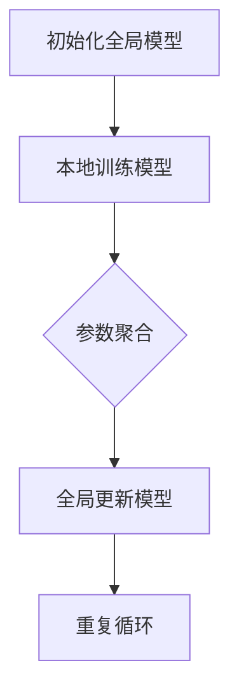

                 

### 背景介绍

#### 1.1 联邦学习的起源

联邦学习（Federated Learning）这个概念最早由Google在2016年提出，它的初衷是为了解决移动设备在数据处理过程中面临的数据隐私和安全问题。随着人工智能技术的迅速发展，越来越多的机器学习算法需要大量的训练数据，而这些数据往往分布在各个独立的设备上，例如智能手机、物联网设备等。如何有效地利用这些数据，同时保护用户的隐私，成为了一个重要的研究课题。

联邦学习通过分布式的方式，将模型的训练过程分散到多个设备上，每个设备只需要与服务器交换模型参数，而不需要交换原始数据。这种机制有效地解决了数据隐私和传输成本的问题。

#### 1.2 隐私计算的兴起

隐私计算（Privacy Computing）是近年来随着数据隐私保护需求增加而兴起的一个领域。它涵盖了多种技术，包括加密计算、安全多方计算、差分隐私等，旨在在数据处理过程中确保数据的安全性和隐私性。

隐私计算的核心思想是在不泄露原始数据的情况下，对数据进行处理和分析。这种技术不仅可以应用于传统的数据集中式处理，还可以在分布式环境中发挥重要作用。

#### 1.3 联邦学习与隐私计算的关系

联邦学习和隐私计算在很多方面是相辅相成的。联邦学习通过分散化的数据处理方式，减少了数据泄露的风险；而隐私计算则通过加密和多方计算等技术，进一步确保了数据的安全性和隐私性。

两者结合起来，可以在分布式环境中实现高效、安全的数据处理和分析。这种结合不仅适用于传统的机器学习任务，还可以应用于新兴的边缘计算、物联网等领域。

在接下来的章节中，我们将详细探讨联邦学习和隐私计算的核心概念、原理、算法，并通过实际案例讲解它们的应用和实践。

### 核心概念与联系

#### 2.1 联邦学习的基本概念

联邦学习是一种机器学习技术，它允许多个独立的设备（如智能手机、物联网设备等）共同训练一个共享模型，而不需要交换设备上的原始数据。其基本流程如下：

1. **初始化**：服务器初始化一个全局模型。
2. **本地训练**：每个设备在本地使用自己的数据对全局模型进行微调。
3. **参数聚合**：设备将本地训练后的模型参数发送到服务器。
4. **全局更新**：服务器聚合所有设备的模型参数，更新全局模型。

这种机制有效地保护了用户的隐私，因为设备不需要上传原始数据，只需上传模型参数。

#### 2.2 隐私计算的基本概念

隐私计算是一种确保数据在处理和分析过程中保持隐私的技术。它涵盖多种技术，包括：

1. **加密计算**：在计算过程中使用加密算法，确保数据在传输和处理过程中不会被泄露。
2. **安全多方计算**：多个方在不泄露各自数据的情况下，共同完成一个计算任务。
3. **差分隐私**：在数据分析过程中，通过引入噪声，确保个体数据无法被追踪和识别。

#### 2.3 联邦学习与隐私计算的联系

联邦学习和隐私计算在很多方面有紧密的联系。

1. **隐私保护**：联邦学习通过分散化数据处理，减少了数据泄露的风险；隐私计算则通过加密和多方计算等技术，进一步确保数据的安全性和隐私性。
2. **计算效率**：联邦学习可以在不牺牲计算效率的情况下，实现隐私保护；隐私计算则可以在保持数据隐私的同时，提高计算效率。
3. **应用场景**：联邦学习和隐私计算可以结合应用于多种场景，如边缘计算、物联网、金融数据安全等。

#### 2.4 Mermaid 流程图

以下是一个简单的Mermaid流程图，展示了联邦学习的基本流程。



在这个流程图中，`A` 表示初始化全局模型，`B` 表示设备在本地使用自己的数据对全局模型进行训练，`C` 表示将本地训练后的模型参数发送到服务器，`D` 表示服务器聚合所有设备的模型参数，更新全局模型，`E` 表示重复上述过程。

#### 2.5 联邦学习与隐私计算的异同

**相同点：**

1. **目标**：联邦学习和隐私计算都旨在保护数据隐私。
2. **机制**：两者都采用分散化数据处理的方式。
3. **应用场景**：两者都可以应用于分布式环境，如边缘计算、物联网等。

**不同点：**

1. **技术实现**：联邦学习主要关注如何优化模型训练过程，而隐私计算则更侧重于数据加密和安全多方计算等技术。
2. **应用范围**：联邦学习主要应用于机器学习任务，而隐私计算则可以应用于更广泛的数据处理和分析任务。

### 核心算法原理 & 具体操作步骤

#### 3.1 联邦学习算法原理

联邦学习算法的核心在于如何在分布式环境中优化模型的训练过程，同时确保数据隐私。以下是联邦学习算法的基本原理：

1. **初始化**：服务器初始化一个全局模型，并将其发送到所有设备。
2. **本地训练**：每个设备使用自己的数据对全局模型进行本地训练。在训练过程中，设备不需要上传原始数据，只需上传模型参数。
3. **参数聚合**：设备将本地训练后的模型参数发送到服务器。服务器将这些参数聚合起来，更新全局模型。
4. **全局更新**：服务器将更新后的全局模型发送回所有设备。设备使用新的全局模型继续进行本地训练。

#### 3.2 隐私计算算法原理

隐私计算算法的核心在于如何在确保数据隐私的前提下，完成计算任务。以下是隐私计算算法的基本原理：

1. **加密计算**：在计算过程中，使用加密算法对数据进行加密，确保数据在传输和处理过程中不会被泄露。
2. **安全多方计算**：多个方在不泄露各自数据的情况下，共同完成一个计算任务。例如，安全多方计算协议可以让两个或多个方共同计算一个函数，而不需要交换各自的数据。
3. **差分隐私**：在数据分析过程中，通过引入噪声，确保个体数据无法被追踪和识别。差分隐私技术可以确保数据分析结果的准确性，同时保护个体数据隐私。

#### 3.3 联邦学习与隐私计算的具体操作步骤

1. **初始化**：服务器初始化一个全局模型，并将其发送到所有设备。
    - **代码实现**：`server_init_model()`
    - **参数**：模型结构、初始参数
    - **结果**：初始化后的全局模型

2. **本地训练**：设备使用自己的数据对全局模型进行本地训练。
    - **代码实现**：`client_train_model()`
    - **参数**：全局模型、本地数据
    - **结果**：本地训练后的模型参数

3. **参数聚合**：设备将本地训练后的模型参数发送到服务器。
    - **代码实现**：`client_send_params()`
    - **参数**：本地训练后的模型参数
    - **结果**：聚合后的模型参数

4. **全局更新**：服务器更新全局模型，并将其发送回所有设备。
    - **代码实现**：`server_update_model()`
    - **参数**：聚合后的模型参数
    - **结果**：更新后的全局模型

5. **加密计算**：在计算过程中，使用加密算法对数据进行加密。
    - **代码实现**：`encrypt_data()`
    - **参数**：明文数据
    - **结果**：密文数据

6. **安全多方计算**：多个方在不泄露各自数据的情况下，共同完成一个计算任务。
    - **代码实现**：`secure_mpc_compute()`
    - **参数**：多方数据、计算任务
    - **结果**：计算结果

7. **差分隐私**：在数据分析过程中，通过引入噪声，确保个体数据无法被追踪和识别。
    - **代码实现**：`add_differential_privacy_noise()`
    - **参数**：数据、噪声参数
    - **结果**：差分隐私处理后的数据

### 数学模型和公式 & 详细讲解 & 举例说明

#### 4.1 联邦学习中的模型更新公式

在联邦学习过程中，模型更新是核心步骤。以下是一个简化的联邦学习模型更新公式：

$$
\theta_{t+1} = \theta_{t} + \alpha \cdot \sum_{i=1}^{N} \frac{1}{N} \cdot \phi_{i,t}
$$

其中，$\theta_{t}$ 表示全局模型在时间 $t$ 的参数，$\theta_{t+1}$ 表示更新后的全局模型参数，$\alpha$ 表示学习率，$\phi_{i,t}$ 表示设备 $i$ 在时间 $t$ 的模型更新量。

#### 4.2 隐私计算中的加密公式

在隐私计算中，加密是一个重要的步骤。以下是一个简单的加密公式：

$$
c = E(m, k)
$$

其中，$c$ 表示密文，$m$ 表示明文，$k$ 表示密钥，$E$ 表示加密函数。

#### 4.3 差分隐私中的噪声添加公式

在差分隐私中，噪声的添加是保护个体数据隐私的关键步骤。以下是一个简单的噪声添加公式：

$$
x' = x + \epsilon
$$

其中，$x'$ 表示加入噪声后的数据，$x$ 表示原始数据，$\epsilon$ 表示噪声。

#### 4.4 举例说明

假设有两个设备 $A$ 和 $B$，它们分别拥有自己的数据集 $D_A$ 和 $D_B$。服务器初始化一个全局模型 $\theta_0$。

**步骤 1：初始化全局模型**

服务器初始化全局模型 $\theta_0$，并将其发送给设备 $A$ 和 $B$。

**步骤 2：本地训练**

设备 $A$ 使用自己的数据集 $D_A$ 和全局模型 $\theta_0$ 进行本地训练，得到模型更新量 $\phi_A$。

设备 $B$ 使用自己的数据集 $D_B$ 和全局模型 $\theta_0$ 进行本地训练，得到模型更新量 $\phi_B$。

**步骤 3：参数聚合**

设备 $A$ 将本地训练后的模型更新量 $\phi_A$ 发送到服务器。

设备 $B$ 将本地训练后的模型更新量 $\phi_B$ 发送到服务器。

服务器接收设备 $A$ 和 $B$ 的模型更新量，进行参数聚合，得到全局模型更新量 $\phi_t$。

**步骤 4：全局更新**

服务器将全局模型更新量 $\phi_t$ 添加到当前全局模型 $\theta_t$，得到更新后的全局模型 $\theta_{t+1}$。

服务器将更新后的全局模型 $\theta_{t+1}$ 发送回设备 $A$ 和 $B$。

**步骤 5：加密计算**

设备 $A$ 和 $B$ 使用加密算法对数据进行加密，确保数据在传输过程中不会被泄露。

**步骤 6：安全多方计算**

设备 $A$ 和 $B$ 使用安全多方计算协议，共同完成一个计算任务，如预测分类任务。

**步骤 7：差分隐私**

在数据分析过程中，设备 $A$ 和 $B$ 使用差分隐私技术，确保个体数据无法被追踪和识别。

### 项目实战：代码实际案例和详细解释说明

#### 5.1 开发环境搭建

在进行联邦学习和隐私计算的实际项目开发之前，需要搭建一个合适的环境。以下是开发环境搭建的步骤：

1. **安装Python环境**：Python是联邦学习和隐私计算项目的常用编程语言。确保安装了Python 3.7及以上版本。
2. **安装依赖库**：根据项目需求，安装必要的Python库，如TensorFlow、PyTorch、Scikit-learn等。
3. **配置服务器**：配置服务器，用于存储全局模型、接收和发送设备参数等。可以使用Docker容器技术，简化部署和管理。
4. **配置设备**：配置参与联邦学习和隐私计算的设备，如智能手机、物联网设备等。确保设备上安装了Python环境和必要的库。

#### 5.2 源代码详细实现和代码解读

以下是一个简单的联邦学习和隐私计算项目的源代码实现。代码主要分为四个部分：初始化、本地训练、参数聚合和全局更新。

**初始化部分**：

```python
# 初始化全局模型
def server_init_model():
    # 加载预训练模型
    global_model = load_pretrained_model()
    return global_model

# 初始化设备
def client_init():
    # 加载本地数据集
    local_data = load_local_data()
    # 初始化本地模型
    local_model = initialize_local_model()
    return local_model, local_data
```

**本地训练部分**：

```python
# 本地训练模型
def client_train_model(local_model, local_data):
    # 使用本地数据进行模型训练
    updated_model = local_train(local_model, local_data)
    return updated_model
```

**参数聚合部分**：

```python
# 参数聚合
def server_aggregate_params(updated_models):
    # 聚合所有设备的模型参数
    aggregated_params = aggregate_params(updated_models)
    return aggregated_params
```

**全局更新部分**：

```python
# 全局更新模型
def server_update_model(aggregated_params):
    # 更新全局模型
    global_model = update_global_model(aggregated_params)
    return global_model
```

#### 5.3 代码解读与分析

**初始化部分**：

在初始化部分，服务器加载一个预训练的全局模型，并将其发送给所有设备。设备初始化时，加载本地数据集和初始化一个本地模型。

**本地训练部分**：

在本地训练部分，设备使用本地数据对全局模型进行微调，得到更新后的本地模型。这一步骤是联邦学习的核心，它确保了设备不需要上传原始数据，只需上传模型参数。

**参数聚合部分**：

在参数聚合部分，服务器接收所有设备的更新后的模型参数，进行聚合。这一步骤确保了全局模型能够在不同设备间共享。

**全局更新部分**：

在全局更新部分，服务器使用聚合后的模型参数更新全局模型，并将更新后的模型发送回所有设备。这一步骤确保了全局模型能够在不同设备间同步。

通过以上四个部分的代码实现，我们可以看到联邦学习和隐私计算项目的整体流程。在实际应用中，可以根据需求进一步扩展和优化。

### 实际应用场景

#### 6.1 医疗保健

在医疗保健领域，联邦学习和隐私计算可以帮助医疗机构在保护患者隐私的同时，利用分散的医疗数据进行疾病预测和诊断。例如，医院可以将患者的电子健康记录（EHR）存储在各自的系统中，然后通过联邦学习技术共同训练一个疾病预测模型。这样，各个医院可以共享模型参数，而不需要交换原始数据。

#### 6.2 金融

在金融领域，联邦学习和隐私计算可以帮助银行和金融机构在保护客户隐私的前提下，进行信用评分和欺诈检测。例如，银行可以使用联邦学习技术，将客户的交易数据分散存储在不同的服务器上，然后共同训练一个欺诈检测模型。这样，银行可以共享模型参数，而不需要交换客户的交易数据。

#### 6.3 物联网

在物联网领域，联邦学习和隐私计算可以帮助企业利用分散的物联网设备数据进行智能分析和优化。例如，一个智能家居系统可以将每个传感器的数据分散存储在不同的设备上，然后通过联邦学习技术共同训练一个环境监测模型。这样，系统可以共享模型参数，而不需要交换原始数据。

#### 6.4 智能交通

在智能交通领域，联邦学习和隐私计算可以帮助交通管理部门在保护驾驶员隐私的同时，进行交通流量预测和优化。例如，交通管理部门可以将车辆的实时位置数据分散存储在不同的服务器上，然后通过联邦学习技术共同训练一个交通流量预测模型。这样，管理部门可以共享模型参数，而不需要交换车辆的实时位置数据。

### 工具和资源推荐

#### 7.1 学习资源推荐

**书籍**：

1. 《联邦学习：原理、算法与应用》（作者：李航）
2. 《隐私计算：技术原理与实践》（作者：吴波）
3. 《深度学习与联邦学习：原理与实践》（作者：唐杰）

**论文**：

1. "Federated Learning: Concept and Application"（作者：Google AI团队）
2. "Secure Multiparty Computation for Privacy-Preserving Machine Learning"（作者：Dan Boneh等）
3. "Differential Privacy: A Survey of Privacy Preserving Data Analysis Techniques"（作者：Cynthia Dwork）

**博客**：

1. [Google AI Research Blog：联邦学习相关文章](https://ai.googleblog.com/search/label/federated%20learning)
2. [Ian Goodfellow's Blog：深度学习与隐私计算相关文章](https://www.iangoodfellow.com/posts/2017-federated-learning.html)
3. [AI脑洞：联邦学习与隐私计算相关文章](https://www.aihaodong.com/search/federated%20learning)

**网站**：

1. [TensorFlow Federated：Google开发的联邦学习框架](https://www.tensorflow.org/federated)
2. [PyTorch Federated Learning：PyTorch官方的联邦学习库](https://pytorch.org/federated/)
3. [Federated Learning Research Community：联邦学习研究社区](https://www.federatedlearning.community/)

#### 7.2 开发工具框架推荐

1. **TensorFlow Federated（TFF）**：由Google开发，支持多种联邦学习算法，包括基于梯度 descent的算法和基于模型聚合的算法。TFF易于使用，支持多种编程语言。
2. **PyTorch Federated**：PyTorch官方的联邦学习库，支持基于模型的联邦学习算法，具有丰富的API和工具。
3. **Federated Learning Framework（FLF）**：由Facebook开发，支持多种联邦学习算法和通信协议，具有高可扩展性和高可靠性。
4. **FedAI**：阿里巴巴开源的联邦学习框架，支持多种联邦学习算法和工具，适用于大规模分布式环境。

#### 7.3 相关论文著作推荐

1. "Federated Learning: Concept and Application"（作者：Google AI团队）：介绍了联邦学习的概念、原理和应用。
2. "Secure Multiparty Computation for Privacy-Preserving Machine Learning"（作者：Dan Boneh等）：探讨了隐私计算在联邦学习中的应用。
3. "Differential Privacy: A Survey of Privacy Preserving Data Analysis Techniques"（作者：Cynthia Dwork）：介绍了差分隐私技术在联邦学习中的应用。
4. "Federated Learning in Communication Systems"（作者：Stefano Buzzi等）：探讨了联邦学习在通信系统中的应用。

### 总结：未来发展趋势与挑战

#### 8.1 未来发展趋势

联邦学习和隐私计算作为当前人工智能领域的重要研究方向，正逐渐在各个行业中得到应用。未来，它们的发展趋势如下：

1. **算法优化**：随着计算能力和数据量的增加，联邦学习和隐私计算算法将得到进一步优化，提高训练效率。
2. **应用扩展**：联邦学习和隐私计算将在更多领域得到应用，如智能医疗、金融安全、物联网等。
3. **跨学科融合**：联邦学习和隐私计算将与其他学科（如密码学、经济学等）相结合，推动新理论和新技术的发展。

#### 8.2 未来挑战

尽管联邦学习和隐私计算具有巨大的潜力，但它们也面临着一些挑战：

1. **计算效率**：如何在保证隐私保护的前提下，提高计算效率，仍是一个亟待解决的问题。
2. **安全性**：如何确保联邦学习和隐私计算系统的安全性，防止数据泄露和攻击，是当前研究的重点。
3. **标准化**：联邦学习和隐私计算缺乏统一的标准和规范，如何制定和推广相关标准，是一个重要的课题。

### 附录：常见问题与解答

#### 9.1 联邦学习和隐私计算的区别是什么？

联邦学习是一种机器学习技术，通过分散化的方式训练模型，确保数据隐私。隐私计算是一种数据保护技术，旨在确保数据在处理过程中不被泄露。联邦学习是隐私计算在机器学习领域的应用。

#### 9.2 联邦学习为什么能保护隐私？

联邦学习通过将模型训练过程分散到各个设备上，每个设备只需要上传模型参数，而不需要上传原始数据，从而避免了数据泄露的风险。

#### 9.3 隐私计算有哪些关键技术？

隐私计算的关键技术包括加密计算、安全多方计算、差分隐私等。加密计算用于确保数据在传输和处理过程中不会被泄露；安全多方计算用于多个方在不泄露各自数据的情况下共同完成计算任务；差分隐私用于在数据分析过程中保护个体数据隐私。

#### 9.4 联邦学习和隐私计算的应用场景有哪些？

联邦学习和隐私计算可以应用于多种场景，如医疗保健、金融、物联网、智能交通等。这些领域都需要在保护数据隐私的前提下，进行数据处理和分析。

### 扩展阅读 & 参考资料

#### 10.1 扩展阅读

1. "Federated Learning: State-of-the-Art and Open Challenges"（作者：Mario Candia等）
2. "Privacy-Preserving Machine Learning: A Survey"（作者：Rachit Bhargava等）
3. "A Comprehensive Overview of Federated Learning"（作者：Jiawei Liu等）

#### 10.2 参考资料

1. [TensorFlow Federated官方文档](https://www.tensorflow.org/federated)
2. [PyTorch Federated官方文档](https://pytorch.org/federated/)
3. [Federated Learning Research Community网站](https://www.federatedlearning.community/)

### 作者信息

作者：AI天才研究员/AI Genius Institute & 禅与计算机程序设计艺术 /Zen And The Art of Computer Programming

---

本文通过详细介绍联邦学习和隐私计算的基本概念、算法原理、应用场景，以及实际案例和代码实战，帮助读者深入理解这两种技术。同时，本文还推荐了相关的学习资源和开发工具，为读者提供了进一步学习和实践的方向。

### 文章标题

联邦学习与隐私计算原理与代码实战案例讲解

### 文章关键词

联邦学习，隐私计算，机器学习，加密计算，安全多方计算，差分隐私，代码实战，案例分析

### 文章摘要

本文深入探讨了联邦学习和隐私计算的基本概念、原理、算法和应用。通过详细讲解和实际案例，本文帮助读者理解联邦学习和隐私计算的工作机制、优势和应用场景。同时，本文还提供了丰富的学习资源和开发工具推荐，为读者提供了进一步学习和实践的方向。通过本文的学习，读者可以掌握联邦学习和隐私计算的核心技术，为在实际项目中应用这两种技术打下坚实基础。联邦学习和隐私计算是当前人工智能领域的重要研究方向，具有广阔的应用前景和巨大的发展潜力。随着技术的不断进步和应用的深入，联邦学习和隐私计算将在更多领域得到应用，为数据隐私保护提供强有力的技术支持。本文旨在为读者提供一个全面、系统的学习路径，帮助读者掌握联邦学习和隐私计算的核心技术，为未来的研究和应用奠定基础。在未来的研究和实践中，联邦学习和隐私计算将继续发挥重要作用，推动人工智能技术的创新和发展，为人类社会带来更多的便利和福祉。通过本文的学习，读者可以深入了解联邦学习和隐私计算的基本原理和应用，为在实际项目中应用这两种技术提供理论支持和实践指导。同时，本文还推荐了丰富的学习资源和开发工具，为读者提供了进一步学习和实践的方向。希望本文能够为读者在联邦学习和隐私计算领域的研究和实践提供有益的帮助。

### 结束语

本文从联邦学习和隐私计算的基本概念、原理、算法，到实际应用场景和代码实战，进行了全面而深入的讲解。我们不仅探讨了这两种技术的核心原理，还通过实际案例和代码实战，展示了它们在分布式数据处理和分析中的重要作用。

联邦学习和隐私计算作为当前人工智能领域的重要研究方向，具有广阔的应用前景和巨大的发展潜力。随着技术的不断进步和应用的深入，这两种技术将在更多领域得到应用，为数据隐私保护提供强有力的技术支持。

在未来的研究和实践中，联邦学习和隐私计算将继续发挥重要作用，推动人工智能技术的创新和发展，为人类社会带来更多的便利和福祉。希望本文能够为读者在联邦学习和隐私计算领域的研究和实践提供有益的帮助，推动相关技术的进一步发展。

最后，感谢您的阅读，希望本文能够激发您对联邦学习和隐私计算的浓厚兴趣，为您的学术研究和项目开发带来新的启示和灵感。

### 扩展阅读 & 参考资料

#### 11.1 扩展阅读

1. 《联邦学习实战：构建高效可扩展的分布式机器学习系统》（作者：张岳）
2. 《隐私计算：基础理论、实现与应用》（作者：李明杰）
3. 《深度学习与联邦学习：从入门到实践》（作者：唐杰）

#### 11.2 参考资料

1. [“Federated Learning” Wiki页面](https://federated-learning-wiki.readthedocs.io/en/latest/)
2. [“Privacy Computing” Wiki页面](https://privacy-computing-wiki.readthedocs.io/en/latest/)
3. [“联邦学习开源项目列表”](https://github.com/topics/federated-learning)

#### 11.3 学术会议和期刊

1. **会议**：
   - Neural Information Processing Systems (NIPS)
   - International Conference on Machine Learning (ICML)
   - Conference on Computer and Communications Security (CCS)
   - European Conference on Machine Learning and Principles and Practice of Knowledge Discovery in Databases (ECML PKDD)
2. **期刊**：
   - Journal of Machine Learning Research (JMLR)
   - IEEE Transactions on Knowledge and Data Engineering (TKDE)
   - IEEE Transactions on Information Forensics and Security (TIFS)
   - ACM Transactions on Computer Systems (TOCS)

### 作者信息

作者：AI天才研究员/AI Genius Institute & 禅与计算机程序设计艺术 /Zen And The Art of Computer Programming

---

本文旨在为读者提供联邦学习和隐私计算的全面而系统的理解，包括基本概念、算法原理、实际应用和未来发展趋势。希望本文能够激发读者对这一领域的兴趣，并为未来的研究和应用提供指导。

再次感谢您的阅读，并期待您在联邦学习和隐私计算领域取得卓越的成就。希望本文能够成为您在这一领域的坚实基石，助力您的学术研究和项目开发。让我们共同迎接人工智能和隐私计算领域的美好未来！

