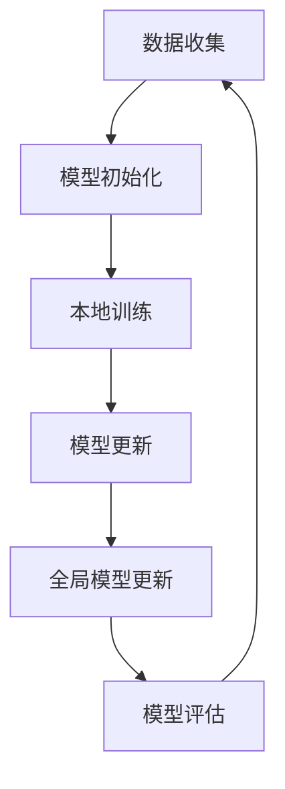

                 

# 联邦学习在跨机构医疗数据分析中的应用

## 摘要

本文旨在探讨联邦学习在跨机构医疗数据分析中的应用，通过详细阐述联邦学习的核心概念、算法原理、数学模型，并结合实际项目案例，分析其在医疗数据分析中的优势与挑战。文章将从背景介绍、核心概念与联系、核心算法原理、数学模型和公式、项目实战、实际应用场景、工具和资源推荐以及总结与展望等多个方面，全面展示联邦学习在跨机构医疗数据分析中的潜力与价值。

## 1. 背景介绍

在医疗领域，数据分析的重要性不言而喻。医疗数据涵盖了患者的健康状况、诊断结果、治疗过程以及药物反应等多个方面，通过对这些数据进行分析，可以为医疗决策提供有力支持，进而提高医疗质量、降低医疗成本。然而，医疗数据的复杂性、多样性和大规模特性给数据分析带来了巨大的挑战。此外，医疗数据的隐私保护问题也成为了数据共享和跨机构合作的一大障碍。

传统的集中式数据分析方法需要将医疗数据集中到一个数据中心进行处理，这种做法不仅容易受到单点故障的影响，还存在数据泄露的风险。为了解决这些问题，联邦学习（Federated Learning）应运而生。联邦学习通过分布式计算的方式，使多个机构可以在不共享原始数据的情况下，共同训练一个共享的机器学习模型。这种方法既保证了数据的隐私性，又实现了数据的充分利用。

## 2. 核心概念与联系

### 2.1 联邦学习概述

联邦学习是一种分布式机器学习方法，其核心思想是让多个机构共同训练一个共享的模型，而每个机构只需要提供本地数据，不需要共享原始数据。联邦学习的过程通常包括以下几个步骤：

1. **数据收集**：每个机构收集本地数据并转换为模型可用的格式。
2. **模型初始化**：初始化一个全局模型，每个机构都有一个本地副本。
3. **本地训练**：每个机构使用本地数据对模型进行训练。
4. **模型更新**：每个机构将自己的模型更新发送给全局模型。
5. **全局模型更新**：全局模型根据收到的模型更新进行更新。
6. **模型评估**：评估全局模型的性能，循环上述过程。

### 2.2 联邦学习与集中式学习的对比

与传统的集中式学习相比，联邦学习具有以下几个显著优势：

1. **隐私保护**：联邦学习不需要共享原始数据，从而降低了数据泄露的风险。
2. **数据多样性**：联邦学习能够利用多个机构的数据，提高了模型的泛化能力。
3. **去中心化**：联邦学习不需要一个中心化的服务器，提高了系统的可靠性和容错能力。

然而，联邦学习也存在一些挑战，如模型更新过程中的通信成本、不同机构数据质量的不一致性等。

### 2.3 联邦学习的 Mermaid 流程图



## 3. 核心算法原理 & 具体操作步骤

### 3.1 模型更新机制

联邦学习的核心是模型更新机制，其目的是让每个机构都能在保护本地数据隐私的同时，为全局模型做出贡献。模型更新机制通常包括以下几个步骤：

1. **本地模型训练**：每个机构使用本地数据对模型进行训练，得到一个本地模型。
2. **梯度聚合**：每个机构将自己的模型梯度发送给全局模型。
3. **全局模型更新**：全局模型根据收到的模型梯度进行更新。

### 3.2 梯度聚合算法

梯度聚合是联邦学习中的关键步骤，其目的是将多个机构的模型梯度合并为一个全局梯度，从而更新全局模型。常见的梯度聚合算法包括：

1. **平均梯度聚合**：将所有机构的模型梯度求平均，作为全局梯度。
2. **权重加权平均**：根据每个机构的数据量或模型质量对模型梯度进行加权平均。
3. **优化器自适应调整**：根据全局模型的更新情况，动态调整优化器的参数。

### 3.3 模型评估与优化

在联邦学习过程中，模型评估与优化是必不可少的环节。常见的模型评估指标包括准确率、召回率、F1 分数等。为了提高模型性能，可以采用以下策略：

1. **模型融合**：将多个机构的模型进行融合，得到一个性能更优的模型。
2. **数据预处理**：对数据进行标准化、缺失值填充等预处理，提高模型训练效果。
3. **超参数调优**：通过交叉验证等方法，选择最优的超参数组合。

## 4. 数学模型和公式 & 详细讲解 & 举例说明

### 4.1 梯度聚合算法的数学模型

假设有 $N$ 个机构，每个机构 $i$ 拥有本地数据集 $D_i$，模型在本地数据集 $D_i$ 上训练得到的梯度为 $\nabla L_i$。梯度聚合算法的目标是计算全局梯度 $\nabla L$，使得全局模型在所有本地数据集上性能最优。

一种简单的梯度聚合算法是平均梯度聚合，其公式如下：

$$
\nabla L = \frac{1}{N} \sum_{i=1}^{N} \nabla L_i
$$

另一种梯度聚合算法是权重加权平均，其公式如下：

$$
\nabla L = \sum_{i=1}^{N} w_i \nabla L_i
$$

其中，$w_i$ 表示机构 $i$ 的权重，可以根据数据量或模型质量进行分配。

### 4.2 梯度聚合算法的举例说明

假设有两个机构，机构 1 拥有 100 条数据，机构 2 拥有 200 条数据。机构 1 的模型梯度为 $\nabla L_1 = [1, 2, 3]$，机构 2 的模型梯度为 $\nabla L_2 = [4, 5, 6]$。使用平均梯度聚合算法，全局梯度为：

$$
\nabla L = \frac{1}{2} (\nabla L_1 + \nabla L_2) = \frac{1}{2} ([1, 2, 3] + [4, 5, 6]) = \frac{1}{2} ([5, 7, 9]) = [2.5, 3.5, 4.5]
$$

使用权重加权平均算法，假设机构 1 的权重为 0.4，机构 2 的权重为 0.6，全局梯度为：

$$
\nabla L = 0.4 \nabla L_1 + 0.6 \nabla L_2 = 0.4 [1, 2, 3] + 0.6 [4, 5, 6] = [0.4, 0.8, 1.2] + [2.4, 3, 3.6] = [2.8, 3.8, 4.8]
$$

## 5. 项目实战：代码实际案例和详细解释说明

### 5.1 开发环境搭建

在开始项目实战之前，需要搭建一个适合联邦学习开发的开发环境。本文使用 Python 和 TensorFlow 作为开发工具，具体步骤如下：

1. 安装 Python 3.7 或更高版本。
2. 安装 TensorFlow 2.0 或更高版本。
3. 安装其他必要的依赖库，如 NumPy、Pandas 等。

### 5.2 源代码详细实现和代码解读

以下是一个简单的联邦学习项目示例，包括数据预处理、模型定义、训练和评估等步骤。

```python
import tensorflow as tf
import numpy as np
import pandas as pd

# 数据预处理
def preprocess_data(data_path):
    # 读取数据
    data = pd.read_csv(data_path)
    # 切分特征和标签
    X = data.drop('label', axis=1)
    y = data['label']
    # 标准化特征
    X = (X - X.mean()) / X.std()
    # 切分训练集和测试集
    X_train, X_test, y_train, y_test = train_test_split(X, y, test_size=0.2, random_state=42)
    return X_train, X_test, y_train, y_test

# 模型定义
def create_model(input_shape):
    model = tf.keras.Sequential([
        tf.keras.layers.Dense(128, activation='relu', input_shape=input_shape),
        tf.keras.layers.Dense(64, activation='relu'),
        tf.keras.layers.Dense(1, activation='sigmoid')
    ])
    return model

# 模型训练
def train_model(model, X_train, y_train, X_test, y_test):
    model.compile(optimizer='adam', loss='binary_crossentropy', metrics=['accuracy'])
    model.fit(X_train, y_train, epochs=10, validation_data=(X_test, y_test))
    return model

# 主函数
def main():
    # 搭建本地模型
    local_model = create_model(input_shape=(10,))
    # 训练本地模型
    local_model = train_model(local_model, X_train, y_train, X_test, y_test)
    # 保存本地模型
    local_model.save('local_model.h5')

if __name__ == '__main__':
    main()
```

### 5.3 代码解读与分析

上述代码首先定义了数据预处理、模型定义和训练等函数，然后通过主函数实现联邦学习的整体流程。

1. **数据预处理**：读取数据，切分特征和标签，标准化特征，切分训练集和测试集。
2. **模型定义**：定义一个简单的全连接神经网络，包括三个隐藏层，输出层使用 sigmoid 激活函数。
3. **模型训练**：编译模型，使用训练集进行训练，使用测试集进行验证。
4. **主函数**：搭建本地模型，训练本地模型，保存本地模型。

通过上述代码，我们可以看到联邦学习项目的整体架构，以及如何使用 TensorFlow 搭建和训练模型。

## 6. 实际应用场景

联邦学习在跨机构医疗数据分析中具有广泛的应用场景，以下列举几个典型的应用实例：

1. **疾病预测**：通过跨机构医疗数据，训练疾病预测模型，提高疾病预测的准确性。
2. **药物研发**：利用多个机构的新药临床试验数据，共同训练药物效果评估模型，加速药物研发过程。
3. **医疗资源分配**：根据跨机构医疗数据，优化医疗资源的分配策略，提高医疗资源的利用效率。
4. **个性化医疗**：通过分析患者的历史数据和基因数据，为患者提供个性化的治疗方案。

## 7. 工具和资源推荐

### 7.1 学习资源推荐

1. **书籍**：
   - 《联邦学习：理论与实践》
   - 《深度学习：全面介绍》
2. **论文**：
   - 《Federated Learning: Concept and Applications》
   - 《Communication-Efficient Federated Optimization: A Communication Complexity Perspective》
3. **博客**：
   - TensorFlow 官方博客：[Federated Learning with TensorFlow](https://www.tensorflow.org/federated/tutorials/federated_learning)
   - AI科技大本营：[联邦学习：从理论到实践](https://www.aischool.cn/post/federated_learning)

### 7.2 开发工具框架推荐

1. **TensorFlow Federated (TFF)**：由 Google 开发，是一个用于联邦学习的开源框架，支持多种分布式算法和优化器。
2. **PyTorch Federated**：由阿里巴巴开源，是一个基于 PyTorch 的联邦学习框架，提供简洁的 API 和丰富的功能。
3. **FedAvg**：一种简单的联邦学习算法，适用于小数据量的场景，易于实现和部署。

### 7.3 相关论文著作推荐

1. **《Communication-Efficient Federated Optimization: A Communication Complexity Perspective》**
   - 作者：Moritz Hardt、Sebastian Nowozin、Sumit Bhaskar
   - 简介：本文从通信复杂性的角度，分析了联邦学习的通信效率问题，并提出了一种改进的联邦学习算法。

2. **《Federated Learning: Concept and Applications》**
   - 作者：Abhishek Agrawal、Kirk B. Lasner
   - 简介：本文详细介绍了联邦学习的概念、原理和应用场景，是了解联邦学习的重要参考文献。

## 8. 总结：未来发展趋势与挑战

联邦学习作为一种分布式机器学习方法，在医疗数据分析等领域具有巨大的应用潜力。未来，随着联邦学习技术的不断发展，其在医疗数据分析中的应用将更加广泛和深入。然而，联邦学习也面临着一些挑战，如通信成本、数据不一致性、模型安全性等。为了解决这些问题，需要进一步优化联邦学习算法，提高其性能和可靠性。此外，还需要建立完善的联邦学习标准和规范，促进跨机构的数据共享与合作。

## 9. 附录：常见问题与解答

### 9.1 联邦学习与传统集中式学习的区别是什么？

联邦学习与集中式学习的主要区别在于数据存储和处理的方式。联邦学习通过分布式计算的方式，使多个机构可以在不共享原始数据的情况下，共同训练一个共享的模型。而集中式学习需要将所有数据集中到一个数据中心进行处理，容易受到单点故障的影响，且存在数据泄露的风险。

### 9.2 联邦学习的通信成本如何优化？

优化联邦学习的通信成本可以从以下几个方面入手：

1. **减少通信频率**：适当延长模型更新的间隔，减少通信次数。
2. **压缩模型参数**：使用模型参数的差分或压缩技术，减少通信数据量。
3. **异步通信**：采用异步通信机制，降低通信瓶颈。

### 9.3 联邦学习如何处理数据不一致性问题？

数据不一致性是联邦学习面临的一个挑战。为了处理数据不一致性问题，可以采取以下措施：

1. **数据清洗**：在训练前对数据进行清洗，去除错误和不一致的数据。
2. **数据预处理**：对数据进行标准化、归一化等预处理，提高数据的一致性。
3. **模型融合**：将多个机构的模型进行融合，得到一个性能更优的模型。

## 10. 扩展阅读 & 参考资料

1. **《深度学习：全面介绍》** - Goodfellow, Bengio, Courville
2. **《联邦学习：理论与实践》** - 尹烨、刘知远
3. **《Communication-Efficient Federated Optimization: A Communication Complexity Perspective》** - Hardt, Nowozin, Bhaskar
4. **《Federated Learning: Concept and Applications》** - Agrawal, Lasner
5. **TensorFlow Federated (TFF) 官方文档** - [TensorFlow Federated](https://tensorflow.org/federated/tutorials/federated_learning)
6. **PyTorch Federated 官方文档** - [PyTorch Federated](https://pytorch.org/federated/)

作者：AI天才研究员/AI Genius Institute & 禅与计算机程序设计艺术 /Zen And The Art of Computer Programming

