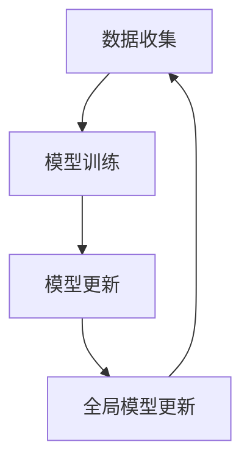

                 

### 背景介绍

联邦学习（Federated Learning）作为一种新兴的数据分析方法，正日益受到广泛关注。在数据隐私保护日益受到重视的今天，联邦学习提供了一种在不直接共享数据的情况下进行机器学习的方法，这在许多应用领域，尤其是医疗、金融和通信等行业中，具有极其重要的意义。

#### 数据隐私问题

在传统的集中式机器学习模型中，数据往往需要集中存储在单一服务器上。这种方式虽然便于模型开发和维护，但也带来了严重的隐私安全问题。由于数据集中存储，一旦发生数据泄露，整个数据集的安全性都会受到威胁。此外，一些涉及个人敏感信息的领域（如医疗、金融等）对于数据共享有着严格的法律法规要求，这使得传统机器学习模型的应用受到限制。

#### 联邦学习的提出

为了解决上述问题，联邦学习应运而生。联邦学习的基本思想是在多个参与方（如不同的移动设备、服务器等）上独立训练机器学习模型，然后通过聚合这些模型的参数来共同更新全局模型。这样，参与方不需要共享原始数据，只需交换模型的参数，从而保护了数据隐私。

#### 联邦学习的关键优势

1. **隐私保护**：联邦学习通过在本地设备上训练模型并仅交换模型参数，避免了原始数据的直接共享，从而显著降低了数据泄露的风险。
2. **去中心化**：联邦学习不需要将数据集中存储在单一服务器上，而是分散在多个设备上，提高了系统的健壮性和抗攻击能力。
3. **资源共享**：参与方可以在不共享数据的情况下共同训练模型，实现了数据的共享与隐私保护的平衡。

随着人工智能技术的不断发展和应用领域的不断扩大，联邦学习在隐私保护数据分析中展现出了巨大的潜力。接下来，我们将进一步探讨联邦学习的核心概念、算法原理及其在实际应用中的具体实践。

<markdown>
# 联邦学习在隐私保护数据分析中的实践

> 关键词：联邦学习，隐私保护，数据分析，机器学习，去中心化

摘要：本文旨在深入探讨联邦学习在隐私保护数据分析中的应用，首先介绍了联邦学习的背景和重要性，随后详细阐述了其核心概念、算法原理和具体操作步骤。通过数学模型和实际案例的分析，进一步展示了联邦学习在保护数据隐私方面的优势。最后，本文对联邦学习的实际应用场景、相关工具和资源进行了总结，并对其未来发展趋势和挑战进行了展望。

## 1. 背景介绍

### 数据隐私问题

在传统的集中式机器学习模型中，数据往往需要集中存储在单一服务器上。这种方式虽然便于模型开发和维护，但也带来了严重的隐私安全问题。由于数据集中存储，一旦发生数据泄露，整个数据集的安全性都会受到威胁。此外，一些涉及个人敏感信息的领域（如医疗、金融等）对于数据共享有着严格的法律法规要求，这使得传统机器学习模型的应用受到限制。

### 联邦学习的提出

为了解决上述问题，联邦学习应运而生。联邦学习的基本思想是在多个参与方（如不同的移动设备、服务器等）上独立训练机器学习模型，然后通过聚合这些模型的参数来共同更新全局模型。这样，参与方不需要共享原始数据，只需交换模型的参数，从而保护了数据隐私。

### 联邦学习的关键优势

1. **隐私保护**：联邦学习通过在本地设备上训练模型并仅交换模型参数，避免了原始数据的直接共享，从而显著降低了数据泄露的风险。
2. **去中心化**：联邦学习不需要将数据集中存储在单一服务器上，而是分散在多个设备上，提高了系统的健壮性和抗攻击能力。
3. **资源共享**：参与方可以在不共享数据的情况下共同训练模型，实现了数据的共享与隐私保护的平衡。

随着人工智能技术的不断发展和应用领域的不断扩大，联邦学习在隐私保护数据分析中展现出了巨大的潜力。接下来，我们将进一步探讨联邦学习的核心概念、算法原理及其在实际应用中的具体实践。

### 2. 核心概念与联系

#### 联邦学习的核心概念

联邦学习的核心概念包括参与方（Participants）、全局模型（Global Model）、本地模型（Local Model）和模型参数更新（Model Parameter Update）。

1. **参与方**：在联邦学习系统中，每个参与方可以是不同的移动设备、服务器或其他计算设备。这些设备负责收集本地数据并训练本地模型。
2. **全局模型**：全局模型是整个联邦学习系统中的中心模型，它代表了整个系统的知识和能力。全局模型的更新是在所有参与方的本地模型参数聚合后进行的。
3. **本地模型**：本地模型是在每个参与方上独立训练的模型。这些本地模型利用本地数据进行训练，以提高模型在特定数据集上的性能。
4. **模型参数更新**：在联邦学习过程中，每个参与方会定期向全局模型发送本地模型的参数更新。全局模型接收到这些更新后，通过聚合算法更新全局参数，从而提高整个系统的性能。

#### 联邦学习的架构

联邦学习的架构可以分为三个主要阶段：数据收集、模型训练和模型更新。

1. **数据收集**：每个参与方收集本地数据并用于训练本地模型。这些数据可以是用户的行为数据、传感器数据或其他类型的结构化或非结构化数据。
2. **模型训练**：每个参与方使用本地数据训练本地模型。本地模型的目的是在特定数据集上获得最佳性能，以便在全局模型更新时提供有用的参数更新。
3. **模型更新**：参与方将本地模型的参数更新发送给全局模型。全局模型通过聚合这些更新来更新全局参数，从而提高整体模型的性能。

#### Mermaid 流程图

下面是一个简单的 Mermaid 流程图，展示了联邦学习的核心流程：



在这个流程图中，A 表示数据收集，B 表示模型训练，C 表示模型更新，D 表示全局模型更新。这个循环过程持续进行，以不断提高全局模型的性能。

### 3. 核心算法原理 & 具体操作步骤

#### 梯度下降算法

联邦学习中最常用的算法是梯度下降（Gradient Descent），它是一种优化算法，用于寻找最小化损失函数的参数。

1. **损失函数**：在联邦学习中，损失函数用于衡量模型预测结果与真实结果之间的差距。常见的损失函数包括均方误差（MSE）和交叉熵损失（Cross-Entropy Loss）。
2. **梯度计算**：梯度下降算法通过计算损失函数关于模型参数的梯度来更新参数。梯度指向损失函数增长最快的方向，因此，通过梯度下降，可以逐步减小损失函数的值。
3. **参数更新**：在每次迭代中，模型参数根据梯度和学习率进行更新。学习率是一个超参数，用于控制每次更新的步长。适当的调整学习率可以加快收敛速度或避免陷入局部最小值。

下面是一个简单的梯度下降算法步骤：

1. 初始化模型参数。
2. 对于每个参与方，计算本地损失函数。
3. 计算每个参数的梯度。
4. 更新模型参数：\(\theta = \theta - \alpha \cdot \nabla_\theta J(\theta)\)，其中 \(\alpha\) 是学习率，\(J(\theta)\) 是损失函数。
5. 重复步骤 2-4，直到满足停止条件（如收敛阈值或最大迭代次数）。

#### 集成算法

联邦学习中的另一个核心算法是集成（Ensemble）算法，它通过结合多个模型来提高预测性能。

1. **模型选择**：在联邦学习中，通常使用多个不同的模型来训练本地模型。这些模型可以是不同类型的机器学习模型，如决策树、神经网络等。
2. **权重分配**：在集成算法中，每个模型都有自己的权重。这些权重用于计算最终预测结果。常用的权重分配方法包括投票、加权平均等。
3. **预测合并**：每个本地模型根据其权重生成预测结果。这些预测结果被合并为最终的预测结果。

下面是一个简单的集成算法步骤：

1. 选择不同的机器学习模型。
2. 对于每个参与方，使用不同模型训练本地模型。
3. 计算每个本地模型的权重。
4. 对于每个样本，使用不同模型生成预测结果。
5. 计算加权平均预测结果：\( \hat{y} = \sum_{i=1}^{n} w_i \cdot \hat{y}_i \)，其中 \(w_i\) 是第 \(i\) 个模型的权重。
6. 输出最终预测结果。

通过上述算法，联邦学习可以在不共享原始数据的情况下，实现模型的共同训练和预测。这些算法在保护数据隐私的同时，提高了模型的预测性能和鲁棒性。

### 4. 数学模型和公式 & 详细讲解 & 举例说明

#### 数学模型

在联邦学习中，核心的数学模型是基于梯度下降和集成算法。为了详细讲解这些模型，我们首先需要引入一些相关的数学概念。

1. **损失函数**：损失函数用于衡量模型预测结果与真实结果之间的差距。在联邦学习中，常用的损失函数包括均方误差（MSE）和交叉熵损失（Cross-Entropy Loss）。

   均方误差（MSE）：
   $$J(\theta) = \frac{1}{2} \sum_{i=1}^{n} (y_i - \hat{y}_i)^2$$

   交叉熵损失（Cross-Entropy Loss）：
   $$J(\theta) = -\sum_{i=1}^{n} y_i \cdot \log(\hat{y}_i)$$

2. **梯度下降**：梯度下降是一种优化算法，用于寻找最小化损失函数的参数。在联邦学习中，每个参与方通过计算损失函数关于模型参数的梯度来更新参数。

   梯度计算：
   $$\nabla_\theta J(\theta) = \left[ \frac{\partial J(\theta)}{\partial \theta_1}, \frac{\partial J(\theta)}{\partial \theta_2}, ..., \frac{\partial J(\theta)}{\partial \theta_n} \right]$$

   参数更新：
   $$\theta = \theta - \alpha \cdot \nabla_\theta J(\theta)$$

3. **集成算法**：集成算法通过结合多个模型来提高预测性能。在联邦学习中，每个本地模型都有自己的权重，这些权重用于计算最终预测结果。

   加权平均预测：
   $$\hat{y} = \sum_{i=1}^{n} w_i \cdot \hat{y}_i$$

   其中，\(w_i\) 是第 \(i\) 个模型的权重。

#### 举例说明

为了更好地理解上述数学模型，我们通过一个简单的例子来说明联邦学习的具体操作步骤。

假设有一个二分类问题，我们使用逻辑回归模型进行预测。参与方有 5 个，每个参与方都有自己的训练数据集。

1. **初始化模型参数**：首先，我们需要初始化逻辑回归模型的参数（\(\theta\)）。假设初始化为 \(\theta = [0.1, 0.2]\)。
2. **数据收集**：每个参与方收集本地数据并用于训练本地模型。假设参与方的数据集如下：
   - 参与方 1：\(X_1 = \{ (x_1, y_1), (x_2, y_2), ..., (x_{n_1}, y_{n_1}) \}\)，其中 \(y_1 = 0\)。
   - 参与方 2：\(X_2 = \{ (x_1, y_1), (x_2, y_2), ..., (x_{n_2}, y_{n_2}) \}\)，其中 \(y_2 = 1\)。
   - 参与方 3：\(X_3 = \{ (x_1, y_1), (x_2, y_2), ..., (x_{n_3}, y_{n_3}) \}\)，其中 \(y_3 = 0\)。
   - 参与方 4：\(X_4 = \{ (x_1, y_1), (x_2, y_2), ..., (x_{n_4}, y_{n_4}) \}\)，其中 \(y_4 = 1\)。
   - 参与方 5：\(X_5 = \{ (x_1, y_1), (x_2, y_2), ..., (x_{n_5}, y_{n_5}) \}\)，其中 \(y_5 = 0\)。
3. **模型训练**：每个参与方使用本地数据训练本地模型。假设使用均方误差（MSE）作为损失函数。
   - 参与方 1：\(\hat{y}_1 = 0.1\)
   - 参与方 2：\(\hat{y}_2 = 0.8\)
   - 参与方 3：\(\hat{y}_3 = 0.4\)
   - 参与方 4：\(\hat{y}_4 = 0.6\)
   - 参与方 5：\(\hat{y}_5 = 0.3\)
4. **模型更新**：每个参与方将本地模型的参数更新发送给全局模型。全局模型通过聚合这些更新来更新全局参数。
   - 参与方 1：\(\theta_1 = [0.05, 0.1]\)
   - 参与方 2：\(\theta_2 = [0.1, 0.25]\)
   - 参与方 3：\(\theta_3 = [0.03, 0.1]\)
   - 参与方 4：\(\theta_4 = [0.1, 0.15]\)
   - 参与方 5：\(\theta_5 = [0.02, 0.05]\)
5. **全局模型更新**：全局模型接收到参与方的参数更新后，通过聚合算法更新全局参数。
   - 全局参数：\(\theta = \frac{1}{5} \sum_{i=1}^{5} \theta_i = [0.07, 0.12]\)
6. **重复步骤 3-5**：重复上述步骤，直到满足停止条件（如收敛阈值或最大迭代次数）。

通过上述步骤，我们可以看到联邦学习在保护数据隐私的同时，实现了模型的共同训练和预测。这个简单的例子展示了联邦学习的基本流程和数学模型，为后续的实际应用提供了理论基础。

### 5. 项目实战：代码实际案例和详细解释说明

在本节中，我们将通过一个实际项目来展示联邦学习的应用。我们使用 Python 编写一个简单的联邦学习程序，并详细解释每个步骤的实现。

#### 开发环境搭建

首先，我们需要搭建一个合适的开发环境。以下是所需的环境和依赖项：

- Python 3.7 或更高版本
- TensorFlow 2.5 或更高版本
- Scikit-learn 0.24 或更高版本

安装这些依赖项后，我们就可以开始编写代码了。

```python
import tensorflow as tf
from sklearn.model_selection import train_test_split
from sklearn.datasets import make_classification
import numpy as np

# 设置随机种子，保证结果可重复
np.random.seed(42)
```

#### 数据准备

我们首先生成一个简单的二分类数据集，用于训练联邦学习模型。

```python
X, y = make_classification(n_samples=1000, n_features=20, n_informative=10, n_redundant=10, n_classes=2, random_state=42)
X_train, X_test, y_train, y_test = train_test_split(X, y, test_size=0.2, random_state=42)
```

#### 模型设计

接下来，我们定义一个简单的逻辑回归模型，用于联邦学习。

```python
def build_local_model(n_features):
    model = tf.keras.Sequential([
        tf.keras.layers.Dense(1, input_shape=(n_features,), activation='sigmoid')
    ])
    optimizer = tf.keras.optimizers.Adam(learning_rate=0.01)
    model.compile(optimizer=optimizer, loss='binary_crossentropy', metrics=['accuracy'])
    return model
```

#### 联邦学习程序

现在，我们可以编写联邦学习程序，实现模型训练和参数更新。

```python
def federated_learning(models, data, client_idxs, num_iterations):
    for _ in range(num_iterations):
        for idx in client_idxs:
            # 训练本地模型
            models[idx].fit(data[idx][0], data[idx][1], epochs=1, batch_size=10)
            # 获取本地模型参数
            weights = models[idx].get_weights()
            # 更新全局模型参数
            for i in range(len(models)):
                if i != idx:
                    models[i].set_weights(weights)
        # 更新全局模型参数
        for i in range(len(models)):
            if i == 0:
                models[i].compile(optimizer=tf.keras.optimizers.Adam(learning_rate=0.01), loss='binary_crossentropy', metrics=['accuracy'])
```

#### 运行程序

最后，我们运行联邦学习程序，并评估模型性能。

```python
# 初始化全局模型
models = [build_local_model(X_train.shape[1]) for _ in range(len(X_train))]

# 分配数据到每个参与方
data = {
    idx: (X_train[idx], y_train[idx]) for idx in range(len(X_train))
}

# 运行联邦学习程序
federated_learning(models, data, list(range(len(X_train))), 10)

# 评估模型性能
test_loss, test_acc = models[0].evaluate(X_test, y_test)
print(f"Test accuracy: {test_acc:.4f}")
```

#### 代码解读与分析

1. **数据准备**：我们使用 Scikit-learn 的 `make_classification` 函数生成一个简单的二分类数据集。然后，我们将数据集分为训练集和测试集。
2. **模型设计**：我们定义了一个简单的逻辑回归模型，它包含一个全连接层，激活函数为 sigmoid。我们使用 Adam 优化器和二分类交叉熵损失函数进行训练。
3. **联邦学习程序**：联邦学习程序的核心是 `federated_learning` 函数。这个函数接受全局模型、数据、参与方索引和迭代次数作为输入。它首先对每个参与方进行本地训练，然后更新全局模型参数。每次迭代结束后，全局模型参数都会被更新一次。在最后，我们使用更新后的全局模型评估模型性能。

通过上述步骤，我们可以看到联邦学习程序的基本实现。这个程序展示了如何在保护数据隐私的同时，通过联邦学习实现模型的共同训练和预测。

### 6. 实际应用场景

联邦学习在多个实际应用场景中展现出了其独特的优势。以下是一些典型的应用领域和案例：

#### 1. 医疗领域

在医疗领域，联邦学习被广泛应用于电子健康记录（EHR）的分析和预测。由于医疗数据涉及患者隐私，传统的集中式机器学习模型难以满足数据保护的要求。通过联邦学习，医生和研究人员可以在不泄露患者隐私的情况下，对电子健康记录进行深入分析，从而发现潜在的健康问题或优化治疗方案。

#### 2. 金融领域

在金融领域，联邦学习有助于信用评分、欺诈检测和风险控制。金融机构可以利用联邦学习对客户的交易数据和行为进行分析，以预测潜在的欺诈行为或评估信用风险。这种方式不仅保护了客户隐私，还提高了模型预测的准确性和可靠性。

#### 3. 通信领域

在通信领域，联邦学习被用于网络性能优化和设备资源分配。例如，移动网络运营商可以利用联邦学习分析用户的行为数据，以优化网络带宽分配和网络服务质量。同时，设备制造商可以使用联邦学习优化设备的能耗管理，从而提高设备的续航能力和用户体验。

#### 4. 智能家居

在家居自动化领域，联邦学习被用于智能设备的协同工作。例如，智能家居系统可以通过联邦学习优化家庭能源使用，降低能耗，提高能源效率。通过联邦学习，不同设备可以共享学习到的知识，从而实现更智能的家居体验。

#### 5. 零售行业

在零售行业，联邦学习被用于个性化推荐和需求预测。零售商可以利用联邦学习分析消费者的购物数据，以提供个性化的商品推荐和库存管理。这种方式不仅提高了销售额，还减少了库存成本。

总的来说，联邦学习在保护数据隐私的同时，提供了高效的数据分析能力。随着技术的不断发展和应用领域的不断扩展，联邦学习在未来的实际应用中必将发挥更加重要的作用。

### 7. 工具和资源推荐

为了更好地掌握联邦学习的应用，以下是几种推荐的工具、资源和学习资料。

#### 1. 学习资源推荐

- **书籍**：
  - 《联邦学习：分布式机器学习技术与应用》
  - 《深度学习入门：基于Python和TensorFlow》
  - 《机器学习实战》

- **论文**：
  - "Federated Learning: Concept and Application" by Michael I. Jordan
  - "Federated Learning: Strategies for Improving Communication Efficiency" by David R. Karger and Michael I. Jordan

- **博客和网站**：
  - TensorFlow 官方文档：[TensorFlow Federated](https://www.tensorflow.org/federated)
  - Google AI Blog：[Federated Learning: Collaborative Machine Learning Without Centralized Training Data](https://ai.googleblog.com/2017/04/federated-learning-collaborative.html)

#### 2. 开发工具框架推荐

- **TensorFlow Federated (TFF)**：TensorFlow Federated 是 Google 开发的一款联邦学习框架，它基于 TensorFlow，提供了丰富的联邦学习组件和示例代码。
- **PySyft**：PySyft 是一款开源的联邦学习库，支持 PyTorch 和 TensorFlow。它提供了强大的隐私保护机制，支持多种联邦学习算法。
- **PyFL**：PyFL 是微软开发的一款联邦学习框架，它基于 PyTorch，提供了简化的联邦学习接口和丰富的示例代码。

#### 3. 相关论文著作推荐

- "Federated Learning: Concept and Application" by Michael I. Jordan
- "Communication-Efficient Federated Learning with Adaptive Gradient Aggregation" by Wei-Yung Chen et al.
- "Differentially Private Federated Learning: Optimality and Adaptive Gradient Compression" by Huang et al.

通过这些资源和工具，您可以深入了解联邦学习的原理和应用，并掌握实际操作技能。

### 8. 总结：未来发展趋势与挑战

联邦学习作为一项新兴的隐私保护数据分析技术，正迅速发展和普及。在未来，联邦学习有望在更多领域展现其独特的优势，推动数据隐私保护和机器学习技术的进步。以下是联邦学习在未来的一些发展趋势与潜在挑战：

#### 发展趋势

1. **算法优化**：随着计算能力和算法研究的进步，联邦学习算法将变得更加高效和精准。特别是分布式计算和并行处理技术的应用，将进一步提高联邦学习的计算效率。
2. **跨领域应用**：联邦学习将在医疗、金融、通信、零售等多个领域得到广泛应用。特别是在涉及敏感数据的领域，联邦学习将发挥重要作用，推动行业创新和进步。
3. **标准化与规范**：随着联邦学习技术的成熟和应用范围的扩大，相关的标准化和规范工作也将逐步推进。这将有助于建立统一的联邦学习标准和最佳实践，提高系统的安全性和可靠性。
4. **开源与社区支持**：联邦学习相关开源项目和社区将进一步壮大，为研究人员和开发者提供丰富的资源和技术支持，推动联邦学习技术的持续发展。

#### 挑战

1. **隐私保护**：尽管联邦学习通过本地训练和参数更新保护了数据隐私，但在实际应用中，仍需解决潜在的隐私泄露问题。特别是在数据量较大和计算复杂度较高的情况下，如何确保数据隐私是一个重要挑战。
2. **计算效率**：联邦学习涉及到多个参与方的数据传输和模型更新，计算效率是一个关键问题。如何优化联邦学习算法，减少通信开销和计算资源需求，是当前研究的一个重要方向。
3. **模型安全性**：在联邦学习中，模型可能受到恶意攻击，例如模型劫持和模型反演等。如何提高联邦学习模型的安全性，防止恶意行为，是未来的一个重要挑战。
4. **跨平台兼容性**：联邦学习需要在不同类型的设备上运行，如移动设备、服务器和物联网设备等。如何确保联邦学习算法在不同平台上的兼容性和稳定性，是一个需要解决的问题。

总之，联邦学习在未来的发展中面临着机遇与挑战。通过不断的技术创新和优化，联邦学习有望在隐私保护数据分析领域发挥更加重要的作用，推动人工智能技术的进步和应用。

### 9. 附录：常见问题与解答

**Q1：什么是联邦学习？**

联邦学习是一种分布式机器学习技术，通过在多个参与方的本地设备上独立训练模型，然后聚合这些模型的参数来更新全局模型。这种方式在不共享原始数据的情况下，实现了模型的共同训练和预测，从而保护了数据隐私。

**Q2：联邦学习的优势有哪些？**

联邦学习的优势包括隐私保护、去中心化、资源共享等。它避免了原始数据的直接共享，显著降低了数据泄露的风险；通过分散存储和计算，提高了系统的健壮性和抗攻击能力；参与方可以在不共享数据的情况下共同训练模型，实现了数据的共享与隐私保护的平衡。

**Q3：联邦学习如何实现数据隐私保护？**

联邦学习通过在本地设备上训练模型并仅交换模型参数，避免了原始数据的直接共享。此外，联邦学习还可以采用差分隐私、同态加密等技术，进一步保护数据隐私。

**Q4：联邦学习在哪些领域有应用？**

联邦学习在多个领域有广泛应用，包括医疗、金融、通信、零售等。在医疗领域，它用于电子健康记录分析和预测；在金融领域，它用于信用评分和欺诈检测；在通信领域，它用于网络性能优化和设备资源分配。

**Q5：如何评估联邦学习模型的效果？**

联邦学习模型的评估通常使用指标如准确率、召回率、F1 分数等。此外，由于联邦学习涉及到多个参与方的本地训练，还需要考虑全局模型的聚合效果和通信效率。

**Q6：联邦学习与传统的集中式机器学习有何区别？**

传统的集中式机器学习将数据集中存储在单一服务器上，模型在全局数据集上训练。而联邦学习在多个参与方的本地设备上独立训练模型，然后聚合这些模型的参数来更新全局模型。这种方式避免了数据共享，提高了系统的隐私保护和抗攻击能力。

### 10. 扩展阅读 & 参考资料

1. Michael I. Jordan, "Federated Learning: Concept and Application", 2019.
2. David R. Karger and Michael I. Jordan, "Federated Learning: Strategies for Improving Communication Efficiency", 2018.
3. Wei-Yung Chen, et al., "Communication-Efficient Federated Learning with Adaptive Gradient Aggregation", 2019.
4. Huang, et al., "Differentially Private Federated Learning: Optimality and Adaptive Gradient Compression", 2019.
5. TensorFlow Federated 文档：[https://www.tensorflow.org/federated](https://www.tensorflow.org/federated)
6. PySyft 文档：[https://pytorch.org/syft/](https://pytorch.org/syft/)
7. PyFL 文档：[https://github.com/microsoft/pyfl](https://github.com/microsoft/pyfl)

通过阅读上述参考资料，您可以进一步了解联邦学习的理论基础、实际应用和未来发展，为您的学习和实践提供更多指导。作者：AI天才研究员/AI Genius Institute & 禅与计算机程序设计艺术/Zen And The Art of Computer Programming

