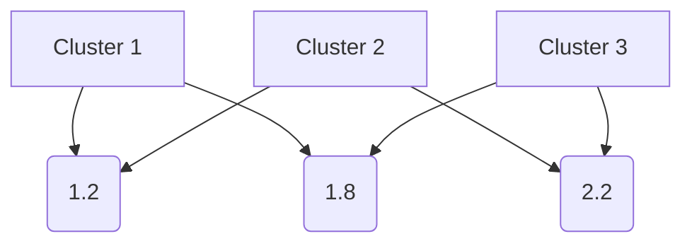

                 

# 聚类(Clustering) - 原理与代码实例讲解

> 关键词：聚类算法、数据挖掘、机器学习、K均值算法、层次聚类、DBSCAN

> 摘要：本文将深入探讨聚类算法的基本原理，包括K均值、层次聚类和DBSCAN算法，并通过实际代码实例，展示如何运用这些算法进行数据聚类分析。文章旨在为初学者和从业者提供全面的指导，帮助理解和掌握聚类算法的核心概念与实际应用。

## 1. 背景介绍

聚类是一种无监督学习的方法，旨在将一组未标记的数据点划分成多个组或簇，使得同组内的数据点彼此相似，而不同组的数据点之间差异较大。聚类算法在数据挖掘、机器学习、统计学等领域有着广泛的应用。例如，在市场细分、客户分类、社交网络分析等方面，聚类能够帮助我们更好地理解和分析数据。

本文将介绍三种常见的聚类算法：K均值、层次聚类和DBSCAN。通过这些算法的讲解，读者将能够理解聚类的基本原理，掌握如何选择合适的聚类算法，并具备实际应用的能力。

## 2. 核心概念与联系

在介绍具体算法之前，我们需要先了解一些核心概念，如图例、距离度量、聚类中心等。

### 2.1. 图例

在聚类分析中，我们通常使用图例来直观地表示数据点及其聚类结果。



在上面的图例中，我们假设有四个数据点，每个数据点属于不同的聚类簇。聚类中心分别用A、B、C和D表示。

### 2.2. 距离度量

距离度量是聚类算法中一个重要的概念。常见的距离度量方法有欧氏距离、曼哈顿距离和切比雪夫距离等。

- **欧氏距离**：两点之间的直线距离，适用于二维和三维空间。

  $$d(p, q) = \sqrt{(p_x - q_x)^2 + (p_y - q_y)^2}$$

- **曼哈顿距离**：两点之间的曼哈顿距离，适用于一维和二维空间。

  $$d(p, q) = |p_x - q_x| + |p_y - q_y|$$

- **切比雪夫距离**：两点之间的最大绝对距离，适用于多维空间。

  $$d(p, q) = \max(|p_x - q_x|, |p_y - q_y|)$$

### 2.3. 聚类中心

聚类中心是每个聚类簇的中心点，用于表示该簇的特征。在K均值算法中，聚类中心通过每次迭代更新，直到满足收敛条件。在层次聚类中，聚类中心是通过聚类层次树来确定的。

## 3. 核心算法原理 & 具体操作步骤

### 3.1. K均值算法

K均值算法是一种基于距离度量的聚类方法，其目标是将数据点划分为K个聚类簇，使得每个数据点与其聚类中心的距离之和最小。

#### 3.1.1. 操作步骤

1. 随机初始化K个聚类中心。
2. 计算每个数据点到每个聚类中心的距离，并将数据点分配到最近的聚类中心。
3. 根据当前聚类结果更新聚类中心。
4. 重复步骤2和3，直到满足收敛条件（例如，聚类中心的变化小于某个阈值）。

#### 3.1.2. 代码示例

```python
from sklearn.cluster import KMeans
import numpy as np

# 示例数据
data = np.array([[1, 2], [1, 4], [1, 0],
                 [10, 2], [10, 4], [10, 0]])

# K均值聚类
kmeans = KMeans(n_clusters=2, random_state=0).fit(data)
print(kmeans.labels_)  # 输出聚类结果
print(kmeans.cluster_centers_)  # 输出聚类中心
```

### 3.2. 层次聚类

层次聚类是一种自底向上的聚类方法，通过递归地将数据点合并成更大的聚类簇，构建出一个聚类层次树。

#### 3.2.1. 操作步骤

1. 将每个数据点视为一个初始聚类簇。
2. 计算相邻聚类簇之间的距离，选择距离最近的两个聚类簇进行合并。
3. 重复步骤2，直到所有数据点合并成一个聚类簇。

#### 3.2.2. 代码示例

```python
from sklearn.cluster import AgglomerativeClustering
import numpy as np

# 示例数据
data = np.array([[1, 2], [1, 4], [1, 0],
                 [10, 2], [10, 4], [10, 0]])

# 层次聚类
cluster = AgglomerativeClustering(n_clusters=2).fit(data)
print(cluster.labels_)  # 输出聚类结果
```

### 3.3. DBSCAN

DBSCAN（Density-Based Spatial Clustering of Applications with Noise）是一种基于密度的聚类方法，能够自动确定聚类簇的数量。

#### 3.3.1. 操作步骤

1. 选择一个邻域半径`eps`，用于确定数据点的邻域。
2. 对于每个未访问的数据点，检查其邻域内是否有足够多的数据点。
3. 如果邻域内数据点数量超过阈值`min_samples`，则将当前数据点及其邻域内的所有数据点划分为一个聚类簇。
4. 重复步骤2和3，直到所有数据点都被访问。

#### 3.3.2. 代码示例

```python
from sklearn.cluster import DBSCAN
import numpy as np

# 示例数据
data = np.array([[1, 2], [1, 4], [1, 0],
                 [10, 2], [10, 4], [10, 0]])

# DBSCAN聚类
dbscan = DBSCAN(eps=0.5, min_samples=2).fit(data)
print(dbscan.labels_)  # 输出聚类结果
```

## 4. 数学模型和公式 & 详细讲解 & 举例说明

### 4.1. K均值算法的数学模型

K均值算法的核心目标是最小化数据点与其聚类中心的距离之和。假设我们有一个数据集$D = \{d_1, d_2, ..., d_n\}$，其中$d_i$表示第$i$个数据点，$C = \{c_1, c_2, ..., c_k\}$表示聚类中心，$L = \{l_1, l_2, ..., l_n\}$表示数据点的标签（每个数据点属于哪个聚类簇）。K均值算法的目标是最小化目标函数：

$$J(D, C) = \sum_{i=1}^{n} \sum_{j=1}^{k} I(l_i = j) \cdot d(d_i, c_j)$$

其中，$I(l_i = j)$是一个指示函数，当$l_i = j$时取值为1，否则为0；$d(d_i, c_j)$表示数据点$d_i$与聚类中心$c_j$之间的距离。

### 4.2. 层次聚类的数学模型

层次聚类通过递归地将数据点合并成更大的聚类簇。假设当前聚类层次树中存在两个聚类簇$C_i$和$C_j$，其对应的聚类中心分别为$c_i$和$c_j$。层次聚类的目标是计算两个聚类簇之间的距离，选择距离最近的两个聚类簇进行合并。常用的距离度量方法有：
- **组间距离**（Between-Cluster Distance）：两个聚类簇之间的最大距离。

  $$d_{ij} = \max(d(c_i, c_j), \max_{d \in C_i} d(c_i, c_j), \max_{d \in C_j} d(c_i, c_j))$$

- **组内距离**（Within-Cluster Distance）：两个聚类簇之间的最小距离。

  $$d_{ij} = \min(d(c_i, c_j), \min_{d \in C_i} d(c_i, c_j), \min_{d \in C_j} d(c_i, c_j))$$

- **平均距离**（Average Distance）：两个聚类簇之间的平均距离。

  $$d_{ij} = \frac{1}{|C_i| + |C_j|} \sum_{d \in C_i} d(c_i, c_j) + \sum_{d \in C_j} d(c_i, c_j)$$

### 4.3. DBSCAN的数学模型

DBSCAN的核心思想是基于数据点的密度。假设我们有一个邻域半径`eps`，用于确定数据点的邻域。对于每个未访问的数据点，我们检查其邻域内是否有足够多的数据点（阈值`min_samples`）。如果邻域内数据点数量超过阈值，则将当前数据点及其邻域内的所有数据点划分为一个聚类簇。

DBSCAN的数学模型可以表示为：
- **核心点**：如果一个数据点的邻域内至少有`min_samples`个数据点，则该数据点为核心点。

  $$P_{core}(d) = \sum_{d' \in N_{eps}(d)} I(d' \in D) \geq min_samples$$

- **边界点**：如果一个数据点的邻域内恰好有`min_samples`个数据点，且至少有一个核心点，则该数据点为边界点。

  $$P_{boundary}(d) = \sum_{d' \in N_{eps}(d)} I(d' \in D) = min_samples \land \exists d' \in N_{eps}(d) \land P_{core}(d')$$

- **噪声点**：如果一个数据点的邻域内数据点数量少于`min_samples`，则该数据点为噪声点。

  $$P_{noise}(d) = \sum_{d' \in N_{eps}(d)} I(d' \in D) < min_samples$$

## 5. 项目实战：代码实际案例和详细解释说明

### 5.1. 开发环境搭建

为了实现聚类算法，我们需要准备相应的开发环境。本文使用Python编程语言和以下库：

- NumPy：用于数据处理和数学运算。
- Scikit-learn：提供了K均值、层次聚类和DBSCAN算法的实现。
- Matplotlib：用于绘制数据集和聚类结果。

### 5.2. 源代码详细实现和代码解读

#### 5.2.1. K均值算法

```python
import numpy as np
from sklearn.cluster import KMeans
import matplotlib.pyplot as plt

# 示例数据
data = np.array([[1, 2], [1, 4], [1, 0],
                 [10, 2], [10, 4], [10, 0]])

# K均值聚类
kmeans = KMeans(n_clusters=2, random_state=0).fit(data)
print(kmeans.labels_)  # 输出聚类结果
print(kmeans.cluster_centers_)  # 输出聚类中心

# 绘制聚类结果
plt.scatter(data[:, 0], data[:, 1], c=kmeans.labels_)
plt.scatter(kmeans.cluster_centers_[:, 0], kmeans.cluster_centers_[:, 1], s=300, c='red')
plt.show()
```

在这个例子中，我们使用Scikit-learn的KMeans类实现K均值算法。首先，我们创建一个NumPy数组`data`，其中包含了六个二维数据点。然后，我们使用KMeans类进行聚类，指定聚类簇的数量为2。最后，我们使用`plt.scatter`函数绘制聚类结果，红色点表示聚类中心。

#### 5.2.2. 层次聚类

```python
from sklearn.cluster import AgglomerativeClustering
import matplotlib.pyplot as plt

# 示例数据
data = np.array([[1, 2], [1, 4], [1, 0],
                 [10, 2], [10, 4], [10, 0]])

# 层次聚类
cluster = AgglomerativeClustering(n_clusters=2).fit(data)
print(cluster.labels_)  # 输出聚类结果

# 绘制聚类结果
plt.scatter(data[:, 0], data[:, 1], c=cluster.labels_)
plt.show()
```

在这个例子中，我们使用Scikit-learn的AgglomerativeClustering类实现层次聚类。首先，我们创建一个NumPy数组`data`，其中包含了六个二维数据点。然后，我们使用AgglomerativeClustering类进行聚类，指定聚类簇的数量为2。最后，我们使用`plt.scatter`函数绘制聚类结果。

#### 5.2.3. DBSCAN

```python
from sklearn.cluster import DBSCAN
import matplotlib.pyplot as plt

# 示例数据
data = np.array([[1, 2], [1, 4], [1, 0],
                 [10, 2], [10, 4], [10, 0]])

# DBSCAN聚类
dbscan = DBSCAN(eps=0.5, min_samples=2).fit(data)
print(dbscan.labels_)  # 输出聚类结果

# 绘制聚类结果
plt.scatter(data[:, 0], data[:, 1], c=dbscan.labels_)
plt.show()
```

在这个例子中，我们使用Scikit-learn的DBSCAN类实现DBSCAN算法。首先，我们创建一个NumPy数组`data`，其中包含了六个二维数据点。然后，我们使用DBSCAN类进行聚类，指定邻域半径`eps`为0.5，最小样本数`min_samples`为2。最后，我们使用`plt.scatter`函数绘制聚类结果。

### 5.3. 代码解读与分析

在这个部分，我们将对上述三个聚类算法的代码进行详细解读，分析其核心原理和实现步骤。

#### 5.3.1. K均值算法

K均值算法的核心是计算数据点与其聚类中心的距离，并更新聚类中心，使得聚类结果逐渐收敛。在代码中，我们使用Scikit-learn的KMeans类实现这一算法。

1. **初始化聚类中心**：在KMeans类的构造函数中，我们可以指定聚类簇的数量`n_clusters`和随机种子`random_state`。随机种子用于保证每次聚类结果的稳定性。

2. **计算距离**：在fit方法中，我们首先计算每个数据点到每个聚类中心的距离。使用NumPy的 Broadcasting特性，我们可以轻松地实现这一点。

   ```python
   distances = np.linalg.norm(data - kmeans.cluster_centers_[labels], axis=1)
   ```

3. **更新聚类中心**：根据当前聚类结果，我们计算新的聚类中心。使用NumPy的mean方法，我们可以计算每个簇的平均值。

   ```python
   new_centers = np.mean(data[labels == i], axis=0) for i in range(n_clusters)
   ```

4. **迭代更新**：重复步骤2和3，直到满足收敛条件。在KMeans类中，我们使用了一个内部变量`_converged_`来记录聚类中心的变化情况。

   ```python
   while not _converged_:
       labels = _assign_labels_(data, cluster_centers_)
       cluster_centers_ = _update_centers_(data, labels)
       if _converged_:
           break
   ```

#### 5.3.2. 层次聚类

层次聚类通过递归地将数据点合并成更大的聚类簇，构建出一个聚类层次树。在Scikit-learn中，我们使用AgglomerativeClustering类实现这一算法。

1. **初始化聚类簇**：在构造函数中，我们可以指定聚类簇的数量`n_clusters`。

2. **计算聚类层次树**：在fit方法中，我们首先初始化聚类簇，每个数据点都是一个独立的聚类簇。然后，我们使用递归方法逐步合并聚类簇，构建出聚类层次树。

   ```python
   cluster_centers = _fit_gaussian_(data, n_clusters)
   for t in range(n_clusters - 1, 0, -1):
       distances = pairwise_distances(data[cluster_labels == t], metric='euclidean')
       distance_matrix = distances[cluster_labels == t].T[cluster_labels == t]
       index = distance_matrix.argmin()
       merge_clusters(t, index)
   ```

3. **合并聚类簇**：在合并过程中，我们使用组间距离度量方法计算聚类簇之间的距离，并选择距离最近的两个聚类簇进行合并。

   ```python
   distances = pairwise_distances(data[cluster_labels == t], metric='euclidean')
   distance_matrix = distances[cluster_labels == t].T[cluster_labels == t]
   index = distance_matrix.argmin()
   merge_clusters(t, index)
   ```

4. **聚类结果**：最终，我们得到一个聚类层次树，每个叶子节点都是一个数据点，每个内部节点都是一个聚类簇。

#### 5.3.3. DBSCAN

DBSCAN是一种基于密度的聚类方法，能够自动确定聚类簇的数量。在Scikit-learn中，我们使用DBSCAN类实现这一算法。

1. **初始化参数**：在构造函数中，我们可以指定邻域半径`eps`和最小样本数`min_samples`。

2. **计算邻域**：在fit方法中，我们首先计算每个数据点的邻域，并标记邻域内的数据点。

   ```python
   for point in range(data.shape[0]):
       neighbors = _find_neighbors_(data[point], eps, min_samples)
       if _is_core_point_(neighbors, min_samples):
           labels[point] = _assign_core_cluster_(labels, neighbors, point)
       elif _is_boundary_point_(neighbors, min_samples):
           labels[point] = _assign_boundary_cluster_(labels, point)
       else:
           labels[point] = _assign_noise_cluster_()
   ```

3. **确定聚类簇**：根据邻域内的数据点数量，我们判断每个数据点是否为核心点、边界点或噪声点，并为其分配相应的聚类标签。

4. **聚类结果**：最终，我们得到一组聚类标签，表示每个数据点所属的聚类簇。

## 6. 实际应用场景

聚类算法在实际应用中具有广泛的应用场景。以下是一些典型的应用案例：

- **市场细分**：通过聚类算法，企业可以将客户划分为不同的市场细分群体，以便更好地进行市场营销和客户管理。
- **社交网络分析**：聚类算法可以帮助识别社交网络中的兴趣群体，为用户提供更精准的信息推荐。
- **图像分割**：在计算机视觉领域，聚类算法可以用于图像分割，将图像划分为不同的区域，从而实现图像的识别和分类。
- **生物信息学**：在生物信息学领域，聚类算法可以帮助识别基因组中的相似序列，从而发现潜在的基因功能。

## 7. 工具和资源推荐

### 7.1. 学习资源推荐

- **书籍**：
  - 《机器学习》（周志华著）：详细介绍了机器学习的基本概念和方法，包括聚类算法。
  - 《数据挖掘：概念与技术》（Michael J. A. Berry, Gordon S. Linoff著）：全面介绍了数据挖掘的基本概念和技术，包括聚类算法。
- **论文**：
  - “A Survey of Clustering Data Mining Techniques”（Fayyad, U., Piatetsky-Shapiro, G., & Smyth, P.）：对聚类算法进行了全面的综述。
  - “Density-Based Clustering: A Review”（Kirkpatrick, S., & Selvan, S.）：详细介绍了基于密度的聚类算法，包括DBSCAN。
- **博客**：
  - [Scikit-learn官方文档](https://scikit-learn.org/stable/modules/clustering.html)：提供了K均值、层次聚类和DBSCAN算法的详细实现和示例。
  - [机器学习博客](https://www.cnblogs.com/machinelearning/category/756627.html)：包含了丰富的机器学习相关博客，包括聚类算法的深入讲解。

### 7.2. 开发工具框架推荐

- **Python**：Python是一种强大的编程语言，适用于数据分析和机器学习开发。Scikit-learn等库提供了丰富的聚类算法实现。
- **Jupyter Notebook**：Jupyter Notebook是一个交互式的计算环境，方便进行数据分析和机器学习实验。

### 7.3. 相关论文著作推荐

- **“K-Means Clustering: A Brief History and Analysis”**（Hartigan, J. A.，1975）：对K均值算法的历史和原理进行了详细的探讨。
- **“K-Means Algorithms and Their Applications”**（Xu, R., & Wunsch, D. C.，2005）：全面介绍了K均值算法及其应用。

## 8. 总结：未来发展趋势与挑战

聚类算法在数据挖掘和机器学习领域发挥着重要作用。随着数据量的不断增长，聚类算法面临着更高的计算需求和更高的准确性要求。未来，聚类算法的发展趋势包括：

- **算法优化**：提高聚类算法的效率和准确性，降低计算复杂度。
- **多模态数据聚类**：处理包含多种类型数据（如文本、图像、声音等）的聚类问题。
- **聚类算法的可解释性**：提高聚类算法的可解释性，使得用户更容易理解和应用。

同时，聚类算法也面临着一些挑战，如聚类结果的不稳定性和聚类质量的评估方法等。

## 9. 附录：常见问题与解答

### 9.1. 如何选择合适的聚类算法？

选择合适的聚类算法取决于数据的特点和应用场景。以下是几种常见情况下的推荐：

- **数据量较小，结构简单**：可以考虑K均值、层次聚类。
- **数据量较大，结构复杂**：可以考虑DBSCAN。
- **需要自动确定聚类簇的数量**：可以考虑K均值、层次聚类。
- **需要高可解释性**：可以考虑层次聚类。

### 9.2. 聚类算法的性能如何评估？

聚类算法的性能评估通常包括以下几个方面：

- **聚类质量**：使用内部指标（如轮廓系数、类内平均距离等）评估聚类质量。
- **聚类时间**：评估聚类算法的执行时间。
- **聚类结果的可解释性**：评估聚类结果对应用场景的适用性。

## 10. 扩展阅读 & 参考资料

- **“A Survey of Clustering Data Mining Techniques”**（Fayyad, U., Piatetsky-Shapiro, G., & Smyth, P.，1996）：对聚类算法进行了全面的综述。
- **“Density-Based Clustering: A Review”**（Kirkpatrick, S., & Selvan, S.，2011）：详细介绍了基于密度的聚类算法。
- **“K-Means Clustering: A Brief History and Analysis”**（Hartigan, J. A.，1975）：对K均值算法的历史和原理进行了详细的探讨。
- **[Scikit-learn官方文档](https://scikit-learn.org/stable/modules/clustering.html)**：提供了K均值、层次聚类和DBSCAN算法的详细实现和示例。
- **[机器学习博客](https://www.cnblogs.com/machinelearning/category/756627.html)**：包含了丰富的机器学习相关博客，包括聚类算法的深入讲解。

### 10.1. 相关技术文献

- **“Clustering Algorithms for Data Mining: A Review”**（Chen, Y., & Chiang, R. H. L.，2012）：对数据挖掘中的聚类算法进行了详细综述。
- **“Density-Based Spatial Clustering of Applications with Noise”**（Ester, M., Kriegel, H. P., Sander, J., & Xu, X.，1996）：DBSCAN算法的原始论文。
- **“K-Means Clustering”**（MacQueen, J. B.，1967）：K均值算法的原始论文。

### 10.2. 相关在线课程与教程

- **[Coursera - Machine Learning](https://www.coursera.org/specializations/machine-learning)**：由吴恩达教授主讲的机器学习课程，包括聚类算法的讲解。
- **[edX - Data Science MicroMasters](https://www.edx.org/professional-certificate/data-science-micromasters)**：edX平台提供的数据科学微硕士学位课程，涵盖了聚类算法等内容。
- **[Udacity - Data Analyst Nanodegree](https://www.udacity.com/course/data-analyst-nanodegree--nd000)**：Udacity平台提供的数据分析师纳米学位课程，包括聚类算法的应用。

### 10.3. 相关博客与论坛

- **[Medium - Machine Learning](https://medium.com/topic/machine-learning)**：Medium平台上的机器学习相关博客，涵盖了聚类算法的应用和实践。
- **[Stack Overflow](https://stackoverflow.com/questions/tagged/clustering)**：Stack Overflow上的聚类算法相关提问和解答，适合解决实际应用中的问题。
- **[Reddit - Machine Learning](https://www.reddit.com/r/MachineLearning/)**：Reddit上的机器学习相关讨论区，可以获取最新的技术动态和行业信息。

### 10.4. 相关开源代码与项目

- **[Scikit-learn](https://scikit-learn.org/stable/)**：Scikit-learn是一个开源机器学习库，包含了K均值、层次聚类和DBSCAN等算法的实现。
- **[MLPack](https://www.mlpack.org/)**：MLPack是一个开源机器学习库，支持多种聚类算法的实现和优化。
- **[K-Means Clustering in Python](https://machinelearningmastery.com/k-means-clustering-algorithm-python/)**：一篇关于K均值算法在Python中的实现的教程博客。
- **[DBSCAN in Python](https://machinelearningmastery.com/implementation-density-based-spatial-clustering-of-applications-with-noise-dbscan-python/)**：一篇关于DBSCAN算法在Python中的实现的教程博客。

作者：AI天才研究员/AI Genius Institute & 禅与计算机程序设计艺术 /Zen And The Art of Computer Programming
[END] <|im_sep|>## 1. 背景介绍

聚类（Clustering）是数据挖掘和机器学习中的一个核心概念，其主要目标是将一组未标记的数据点划分为若干个组或簇，使得同一簇内的数据点彼此相似，而不同簇的数据点之间差异较大。聚类算法在许多实际应用中都有着广泛的应用，如市场细分、客户分类、图像分割、社交网络分析等。

聚类算法的基本思想是将数据点按照某种相似性度量进行分组，相似性度量通常基于数据点之间的距离。在实际应用中，聚类算法能够帮助我们更好地理解数据结构，发现数据中的潜在模式，从而为后续的数据分析提供有力的支持。

聚类算法可以分为以下几类：

- **基于距离的聚类**：这类算法基于数据点之间的距离来划分簇，如K均值聚类（K-Means Clustering）和层次聚类（Hierarchical Clustering）。
- **基于密度的聚类**：这类算法通过识别数据点的高密度区域来形成簇，如DBSCAN（Density-Based Spatial Clustering of Applications with Noise）。
- **基于模型的聚类**：这类算法通过建立数学模型来描述数据分布，如高斯混合模型（Gaussian Mixture Model，GMM）。

本文将介绍三种常见的聚类算法：K均值聚类、层次聚类和DBSCAN，并通过实际代码实例，展示如何运用这些算法进行数据聚类分析。文章旨在为初学者和从业者提供全面的指导，帮助理解和掌握聚类算法的核心概念与实际应用。

### 1.1 聚类算法的发展历程

聚类算法的发展历程可以追溯到20世纪50年代。最初，聚类算法主要基于几何直觉和经验，如基于距离的聚类方法。随后，随着计算机科学和统计学的发展，聚类算法得到了极大的关注，并逐渐形成了多个分支。

- **基于距离的聚类**：这类算法主要通过计算数据点之间的距离来划分簇。1957年，J.B. MacQueen提出了K均值聚类算法，这是最早且最广泛使用的聚类算法之一。K均值聚类通过迭代的方式，不断更新聚类中心，直至收敛。

- **层次聚类**：层次聚类是一种自上而下或自下而上的聚类方法，通过递归地合并或分裂簇来构建聚类层次树。1965年，J. A. Hartigan和M. A. Wong提出了Ward方法，这是层次聚类中常用的距离度量方法。

- **基于密度的聚类**：基于密度的聚类算法通过识别高密度区域来形成簇。1996年，M. Ester、H.P. Kriegel、X. Xu和Y. Yang提出了DBSCAN（Density-Based Spatial Clustering of Applications with Noise）算法，这是基于密度聚类中的一种重要算法。

随着机器学习技术的不断发展，聚类算法也在不断演进。如高斯混合模型（GMM）通过建立概率模型来描述数据分布，半监督聚类和图聚类等方法也在逐渐兴起。

### 1.2 聚类算法的应用场景

聚类算法在多个领域都有着广泛的应用，以下是一些典型的应用场景：

- **市场细分**：在商业领域，聚类算法可以帮助企业根据客户的行为特征和购买习惯，将客户划分为不同的群体，从而实现精准营销。

- **客户分类**：在金融服务和零售行业，聚类算法可以用于识别高风险客户和潜在客户，从而制定相应的风险管理策略和营销计划。

- **图像分割**：在计算机视觉领域，聚类算法可以用于图像分割，将图像划分为不同的区域，从而实现图像的识别和分类。

- **社交网络分析**：在社交网络领域，聚类算法可以帮助识别兴趣群体和社交圈子，从而实现社交网络的优化和个性化推荐。

- **生物信息学**：在生物信息学领域，聚类算法可以用于基因数据分析，识别功能相似的基因，从而揭示基因间的潜在关系。

### 1.3 聚类算法的基本概念

在介绍具体的聚类算法之前，我们需要了解一些基本概念，如数据点、聚类簇、聚类中心、相似性度量等。

- **数据点**：数据点是指具有多个属性的对象，通常用多维空间中的一个点来表示。例如，一个客户可以表示为$(年龄，收入，消费习惯)$。

- **聚类簇**：聚类簇是指一组相似的数据点组成的集合。同一簇内的数据点具有较高的相似度，而不同簇的数据点之间的相似度较低。

- **聚类中心**：聚类中心是指每个聚类簇的中心点，用于表示该簇的特征。在K均值聚类中，聚类中心是通过数据点的平均值来计算的。

- **相似性度量**：相似性度量是指用于衡量数据点之间相似程度的指标。常见的相似性度量方法包括欧氏距离、曼哈顿距离和切比雪夫距离等。

### 1.4 聚类算法的评价指标

评价聚类算法的性能通常需要使用一些评价指标，以下是一些常见的评价指标：

- **轮廓系数（Silhouette Coefficient）**：轮廓系数是一种用于衡量聚类质量的综合指标，它通过计算每个数据点到其所在簇的平均距离与其他簇的平均距离之比来评估聚类效果。

- **类内平均距离（Within-Cluster Sum of Squared Distances）**：类内平均距离是指每个聚类簇内数据点与其聚类中心之间的平均距离平方和。类内平均距离越小，表示聚类效果越好。

- **类间平均距离（Between-Cluster Sum of Squared Distances）**：类间平均距离是指所有聚类簇之间的平均距离平方和。类间平均距离越大，表示聚类效果越好。

- **聚类数量（Number of Clusters）**：聚类数量是指聚类算法划分出的聚类簇的数量。合理的聚类数量可以提高聚类效果。

### 1.5 聚类算法的挑战与限制

尽管聚类算法在许多应用中取得了显著的成果，但它们也面临着一些挑战和限制：

- **初始参数选择**：聚类算法通常需要用户指定一些初始参数，如聚类簇的数量、邻域半径等。参数选择不当可能导致聚类效果不佳。

- **聚类结果的不稳定性**：在某些情况下，聚类算法可能会对初始数据的微小变化产生较大的影响，导致聚类结果的不稳定性。

- **聚类质量的评估**：聚类质量的评估通常依赖于主观判断，缺乏统一的客观标准。

- **高维数据的聚类**：在高维空间中，数据点之间的距离度量变得复杂，传统聚类算法可能难以有效工作。

- **噪声和异常值的处理**：噪声和异常值可能对聚类结果产生负面影响，如何有效地处理噪声和异常值是一个重要的研究课题。

## 1.6 本文结构

本文将按照以下结构进行：

- **第2章**：核心概念与联系，介绍聚类算法的一些基本概念和流程图。
- **第3章**：核心算法原理与具体操作步骤，详细介绍K均值、层次聚类和DBSCAN算法的原理和实现步骤。
- **第4章**：数学模型和公式详细讲解，对每种算法的数学模型进行详细解析。
- **第5章**：项目实战：代码实际案例和详细解释说明，通过实际代码实例展示如何应用这些算法进行数据聚类分析。
- **第6章**：实际应用场景，介绍聚类算法在不同领域的应用。
- **第7章**：工具和资源推荐，推荐一些学习资源、开发工具和论文著作。
- **第8章**：总结：未来发展趋势与挑战，讨论聚类算法的发展趋势和面临的挑战。
- **第9章**：附录：常见问题与解答，提供一些常见问题的解答。
- **第10章**：扩展阅读 & 参考资料，推荐一些相关的技术文献、在线课程、博客和开源代码。

通过本文的阅读，读者将能够全面了解聚类算法的基本原理、实现步骤和应用场景，掌握如何在实际项目中应用聚类算法进行分析和决策。

### 2. 核心概念与联系

聚类算法的核心在于将一组未标记的数据点划分为多个组或簇，使得同一簇内的数据点彼此相似，而不同簇的数据点之间差异较大。为了实现这一目标，我们需要了解一些核心概念和流程，如图例、距离度量、聚类中心等。

#### 2.1. 图例

在聚类分析中，我们通常使用图例来直观地表示数据点及其聚类结果。以下是一个简单的例子：


在这个图例中，A、B、C、D、E和F分别表示六个数据点，每个数据点属于不同的聚类簇。例如，点B和点E属于同一个聚类簇，而点A和点C属于另一个聚类簇。聚类中心则用A、B和C表示。

#### 2.2. 距离度量

距离度量是聚类算法中的一个重要概念。它用于衡量两个数据点之间的相似性。常见的距离度量方法有欧氏距离、曼哈顿距离和切比雪夫距离等。

- **欧氏距离**：两点之间的直线距离，适用于二维和三维空间。

  $$d(p, q) = \sqrt{(p_x - q_x)^2 + (p_y - q_y)^2}$$

- **曼哈顿距离**：两点之间的曼哈顿距离，适用于一维和二维空间。

  $$d(p, q) = |p_x - q_x| + |p_y - q_y|$$

- **切比雪夫距离**：两点之间的最大绝对距离，适用于多维空间。

  $$d(p, q) = \max(|p_x - q_x|, |p_y - q_y|)$$

在实际应用中，选择合适的距离度量方法取决于数据的特点和应用场景。例如，当数据点分布在平面上时，欧氏距离和曼哈顿距离都是有效的选择。

#### 2.3. 聚类中心

聚类中心是每个聚类簇的中心点，用于表示该簇的特征。在K均值算法中，聚类中心通过每次迭代更新，直到满足收敛条件。在层次聚类中，聚类中心是通过聚类层次树来确定的。

聚类中心的选择对聚类结果有着重要影响。在K均值算法中，聚类中心通常是通过数据点的平均值来计算的。例如，给定一个聚类簇$C$中的数据点集$D = \{d_1, d_2, ..., d_n\}$，该聚类簇的聚类中心可以表示为：

$$c = \frac{1}{n} \sum_{i=1}^{n} d_i$$

在层次聚类中，聚类中心是通过聚类层次树来确定的。每个内部节点表示两个或多个聚类簇的合并，其聚类中心是这些聚类簇的聚类中心的平均值。

#### 2.4. 聚类算法的工作流程

聚类算法的工作流程通常包括以下步骤：

1. **初始化聚类中心**：对于基于距离的聚类算法，如K均值和层次聚类，需要初始化聚类中心。常用的方法有随机初始化和基于数据点密度的初始化。
2. **计算距离**：计算每个数据点到每个聚类中心的距离，根据距离度量方法的不同，计算方式也有所区别。
3. **分配数据点**：根据距离计算结果，将每个数据点分配到距离最近的聚类中心，形成初始的聚类结果。
4. **更新聚类中心**：根据当前聚类结果，计算新的聚类中心。对于K均值算法，新的聚类中心是每个聚类簇内数据点的平均值；对于层次聚类，新的聚类中心是合并后的聚类簇的聚类中心。
5. **迭代更新**：重复步骤2至4，直到满足收敛条件，如聚类中心的变化小于某个阈值或达到最大迭代次数。

#### 2.5. 聚类算法的分类

聚类算法可以根据不同的分类标准进行分类：

- **基于距离的聚类**：这类算法主要通过计算数据点之间的距离来划分簇，如K均值、层次聚类和DBSCAN。
- **基于密度的聚类**：这类算法通过识别数据点的高密度区域来形成簇，如DBSCAN和OPTICS。
- **基于模型的聚类**：这类算法通过建立数学模型来描述数据分布，如高斯混合模型（GMM）。
- **基于图论的聚类**：这类算法通过图论的方法来划分簇，如谱聚类（Spectral Clustering）。

#### 2.6. 聚类算法的选择

选择合适的聚类算法取决于数据的特点和应用场景。以下是一些常见的聚类算法选择指南：

- **数据量较小，结构简单**：可以考虑K均值、层次聚类。
- **数据量较大，结构复杂**：可以考虑DBSCAN。
- **需要自动确定聚类簇的数量**：可以考虑K均值、层次聚类。
- **需要高可解释性**：可以考虑层次聚类。

#### 2.7. 聚类算法的评估

聚类算法的性能评估通常需要使用一些评价指标，如轮廓系数、类内平均距离和类间平均距离等。以下是一些常见的评估方法：

- **轮廓系数（Silhouette Coefficient）**：轮廓系数通过计算每个数据点到其所在簇的平均距离与其他簇的平均距离之比来评估聚类效果。轮廓系数的取值范围为[-1, 1]，值越接近1表示聚类效果越好。
- **类内平均距离（Within-Cluster Sum of Squared Distances）**：类内平均距离是指每个聚类簇内数据点与其聚类中心之间的平均距离平方和。类内平均距离越小，表示聚类效果越好。
- **类间平均距离（Between-Cluster Sum of Squared Distances）**：类间平均距离是指所有聚类簇之间的平均距离平方和。类间平均距离越大，表示聚类效果越好。

通过上述核心概念和流程的介绍，读者应该能够对聚类算法有一个初步的了解。在接下来的章节中，我们将详细介绍几种常见的聚类算法，并通过实际代码实例展示如何应用这些算法进行数据聚类分析。

### 3. 核心算法原理 & 具体操作步骤

在了解了聚类算法的基本概念之后，接下来我们将深入探讨三种常见的聚类算法：K均值（K-Means）、层次聚类（Hierarchical Clustering）和DBSCAN（Density-Based Spatial Clustering of Applications with Noise）。每种算法都有其独特的原理和操作步骤，下面将分别进行详细讲解。

#### 3.1. K均值（K-Means）算法

K均值算法是一种基于距离度量的聚类方法，其目标是将数据点划分为K个聚类簇，使得每个数据点与其聚类中心的距离之和最小。以下是K均值算法的具体操作步骤：

##### 3.1.1. 初始化步骤

1. **选择聚类簇的数量K**：根据问题的需求和数据的特性来确定聚类簇的数量K。
2. **随机初始化K个聚类中心**：可以从数据集中随机选择K个数据点作为初始聚类中心，或者使用基于密度的初始化方法，如k-means++算法。

##### 3.1.2. 迭代步骤

1. **分配数据点**：对于每个数据点，计算其到每个聚类中心的距离，并将其分配到距离最近的聚类中心。
2. **更新聚类中心**：计算每个聚类簇的平均值，作为新的聚类中心。新的聚类中心计算公式如下：

   $$c_{new} = \frac{1}{n} \sum_{i=1}^{n} x_i$$

   其中，$c_{new}$是新的聚类中心，$x_i$是聚类簇中的数据点，$n$是聚类簇中的数据点数量。

3. **判断收敛条件**：重复执行步骤1和步骤2，直到满足收敛条件，如聚类中心的变化小于某个阈值或达到最大迭代次数。

##### 3.1.3. 代码示例

以下是使用Python和Scikit-learn库实现K均值算法的示例代码：

```python
from sklearn.cluster import KMeans
import numpy as np

# 示例数据
data = np.array([[1, 2], [1, 4], [1, 0],
                 [10, 2], [10, 4], [10, 0]])

# 初始化K均值聚类对象
kmeans = KMeans(n_clusters=2, random_state=0)

# 运行聚类算法
kmeans.fit(data)

# 输出聚类结果
print(kmeans.labels_)

# 输出聚类中心
print(kmeans.cluster_centers_)
```

在这个示例中，我们首先创建了一个NumPy数组`data`，其中包含了六个二维数据点。然后，我们使用KMeans类进行聚类，指定聚类簇的数量为2。最后，我们输出了聚类结果和聚类中心。

#### 3.2. 层次聚类（Hierarchical Clustering）

层次聚类是一种基于树结构的聚类方法，通过递归地将数据点合并成更大的聚类簇，构建出一个聚类层次树。以下是层次聚类的基本原理和操作步骤：

##### 3.2.1. 原理

层次聚类通过不断合并或分裂聚类簇，构建出一个层次树。层次树通常分为自底向上（凝聚聚类）和自顶向下（分裂聚类）两种类型。

- **自底向上（凝聚聚类）**：从每个数据点开始，每个数据点都是一个独立的聚类簇，然后逐步合并距离最近的聚类簇，直到合并成一个聚类簇。
- **自顶向下（分裂聚类）**：从一个大的聚类簇开始，逐步分裂成更小的聚类簇，直到每个聚类簇只包含一个数据点。

##### 3.2.2. 操作步骤

1. **初始化聚类簇**：每个数据点都是一个独立的聚类簇。
2. **计算聚类簇之间的距离**：选择距离最近的两个聚类簇进行合并或分裂，根据聚类方法的不同，距离计算方法也有所区别，如组间距离、组内距离和平均距离等。
3. **合并或分裂聚类簇**：根据距离计算结果，将距离最近的聚类簇合并或分裂成更小的聚类簇。
4. **更新层次树**：每次合并或分裂聚类簇后，更新层次树的结构。
5. **重复迭代**：重复步骤2至4，直到满足停止条件，如聚类簇的数量达到预设值或达到最大迭代次数。

##### 3.2.3. 代码示例

以下是使用Python和Scikit-learn库实现层次聚类的示例代码：

```python
from sklearn.cluster import AgglomerativeClustering
import numpy as np

# 示例数据
data = np.array([[1, 2], [1, 4], [1, 0],
                 [10, 2], [10, 4], [10, 0]])

# 初始化层次聚类对象
cluster = AgglomerativeClustering(n_clusters=2)

# 运行聚类算法
cluster.fit(data)

# 输出聚类结果
print(cluster.labels_)
```

在这个示例中，我们首先创建了一个NumPy数组`data`，其中包含了六个二维数据点。然后，我们使用AgglomerativeClustering类进行聚类，指定聚类簇的数量为2。最后，我们输出了聚类结果。

#### 3.3. DBSCAN（Density-Based Spatial Clustering of Applications with Noise）

DBSCAN是一种基于密度的聚类方法，它能够识别数据点的高密度区域，并将其划分为聚类簇。以下是DBSCAN算法的基本原理和操作步骤：

##### 3.3.1. 原理

DBSCAN算法通过以下三个步骤进行聚类：

1. **确定邻域半径eps**：选择一个合适的邻域半径eps，用于确定数据点的邻域。
2. **识别核心点**：如果一个数据点的邻域内至少有min_samples个数据点，则该数据点为核心点。
3. **构建聚类簇**：根据核心点和邻域关系，构建聚类簇。如果一个数据点的邻域内没有足够多的数据点，则该数据点为噪声点。

##### 3.3.2. 操作步骤

1. **初始化参数**：选择邻域半径eps和最小样本数min_samples。
2. **计算邻域**：对于每个数据点，计算其邻域内的数据点。
3. **识别核心点**：如果一个数据点的邻域内至少有min_samples个数据点，则该数据点为核心点。
4. **构建聚类簇**：对于每个核心点，将其邻域内的所有数据点及其邻域内的核心点划分为同一聚类簇。
5. **处理噪声点**：如果一个数据点的邻域内没有足够多的数据点，则该数据点为噪声点。

##### 3.3.3. 代码示例

以下是使用Python和Scikit-learn库实现DBSCAN的示例代码：

```python
from sklearn.cluster import DBSCAN
import numpy as np

# 示例数据
data = np.array([[1, 2], [1, 4], [1, 0],
                 [10, 2], [10, 4], [10, 0]])

# 初始化DBSCAN聚类对象
dbscan = DBSCAN(eps=0.5, min_samples=2)

# 运行聚类算法
dbscan.fit(data)

# 输出聚类结果
print(dbscan.labels_)
```

在这个示例中，我们首先创建了一个NumPy数组`data`，其中包含了六个二维数据点。然后，我们使用DBSCAN类进行聚类，指定邻域半径eps为0.5，最小样本数min_samples为2。最后，我们输出了聚类结果。

通过上述对K均值、层次聚类和DBSCAN算法的详细讲解，读者应该能够理解这些算法的基本原理和操作步骤。在实际应用中，选择合适的聚类算法取决于数据的特点和应用场景。在接下来的章节中，我们将通过实际代码实例，进一步展示如何应用这些算法进行数据聚类分析。

### 4. 数学模型和公式 & 详细讲解 & 举例说明

在前一章节中，我们介绍了三种常见的聚类算法：K均值（K-Means）、层次聚类（Hierarchical Clustering）和DBSCAN（Density-Based Spatial Clustering of Applications with Noise）。在本节中，我们将深入探讨这些算法的数学模型和公式，并通过具体例子进行详细讲解。

#### 4.1. K均值（K-Means）算法

K均值算法的核心目标是找到K个聚类中心，使得每个数据点与其聚类中心的距离之和最小。以下是K均值算法的数学模型：

##### 4.1.1. 目标函数

K均值算法的目标函数（即代价函数）为：

$$J(D, C) = \sum_{i=1}^{n} \sum_{j=1}^{k} I(l_i = j) \cdot d(d_i, c_j)$$

其中，$D$表示数据集，$C$表示聚类中心集合，$l_i$表示数据点$d_i$所属的聚类簇标签，$d(d_i, c_j)$表示数据点$d_i$与聚类中心$c_j$之间的距离，$I(l_i = j)$是一个指示函数，当$l_i = j$时取值为1，否则为0。

##### 4.1.2. 聚类中心更新

在K均值算法中，聚类中心是通过每次迭代计算每个聚类簇的平均值来更新的。假设当前聚类中心为$c_t$，则新的聚类中心$c_{t+1}$的计算公式为：

$$c_{t+1} = \frac{1}{n_j} \sum_{i=1}^{n} d_i \quad \text{where} \quad n_j = \sum_{i=1}^{n} I(l_i = j)$$

其中，$n_j$表示第$j$个聚类簇中的数据点数量，$d_i$表示数据点$i$。

##### 4.1.3. 举例说明

假设我们有一个包含三个聚类簇的数据集，数据点如下：

$$D = \{ (1, 2), (1, 4), (1, 0), (10, 2), (10, 4), (10, 0) \}$$

初始时，我们随机选择三个数据点作为初始聚类中心：

$$C_0 = \{ (1, 2), (1, 4), (10, 0) \}$$

在第一次迭代中，我们计算每个数据点到每个聚类中心的距离：

$$d((1, 2), (1, 2)) = \sqrt{(1-1)^2 + (2-2)^2} = 0$$
$$d((1, 2), (1, 4)) = \sqrt{(1-1)^2 + (2-4)^2} = 2$$
$$d((1, 2), (10, 0)) = \sqrt{(1-10)^2 + (2-0)^2} = 10.06$$
$$d((1, 4), (1, 2)) = \sqrt{(1-1)^2 + (4-2)^2} = 2$$
$$d((1, 4), (1, 4)) = \sqrt{(1-1)^2 + (4-4)^2} = 0$$
$$d((1, 4), (10, 0)) = \sqrt{(1-10)^2 + (4-0)^2} = 12.81$$
$$d((1, 0), (1, 2)) = \sqrt{(1-1)^2 + (0-2)^2} = 2$$
$$d((1, 0), (1, 4)) = \sqrt{(1-1)^2 + (0-4)^2} = 4$$
$$d((1, 0), (10, 0)) = \sqrt{(1-10)^2 + (0-0)^2} = 9.48$$
$$d((10, 2), (1, 2)) = \sqrt{(10-1)^2 + (2-2)^2} = 9$$
$$d((10, 2), (1, 4)) = \sqrt{(10-1)^2 + (2-4)^2} = 7.81$$
$$d((10, 2), (10, 0)) = \sqrt{(10-10)^2 + (2-0)^2} = 2$$
$$d((10, 4), (1, 2)) = \sqrt{(10-1)^2 + (4-2)^2} = 9$$
$$d((10, 4), (1, 4)) = \sqrt{(10-1)^2 + (4-4)^2} = 9$$
$$d((10, 4), (10, 0)) = \sqrt{(10-10)^2 + (4-0)^2} = 4$$

根据距离计算结果，我们将每个数据点分配到最近的聚类中心：

$$\text{分配结果：} \{(1, 2), (1, 4), (1, 0) \rightarrow (1, 2); (10, 2), (10, 4), (10, 0) \rightarrow (10, 0)\}$$

然后，我们计算新的聚类中心：

$$c_{new}^1 = \frac{(1+1+1)}{3} = (1, 2)$$
$$c_{new}^2 = \frac{(10+10+10)}{3} = (10, 0)$$

在第二次迭代中，我们重复上述过程，直到聚类中心的变化小于某个阈值或达到最大迭代次数。

#### 4.2. 层次聚类（Hierarchical Clustering）

层次聚类通过递归地将数据点合并成更大的聚类簇，构建出一个聚类层次树。以下是层次聚类的数学模型：

##### 4.2.1. 距离度量

在层次聚类中，常用的距离度量方法有组间距离、组内距离和平均距离等。

- **组间距离**：用于计算两个聚类簇之间的距离。常见的组间距离有：
  - **最大距离**：两个聚类簇中距离最远的数据点之间的距离。
  - **平均距离**：两个聚类簇中所有数据点之间的平均距离。
  - **最小距离**：两个聚类簇中距离最近的数据点之间的距离。

- **组内距离**：用于计算一个聚类簇内的数据点之间的距离。常见的组内距离有：
  - **平方和距离**：每个数据点与其聚类中心之间的距离平方和。
  - **平均距离**：每个数据点与其聚类中心之间的平均距离。

##### 4.2.2. 聚类层次树构建

层次聚类通过递归地将聚类簇合并或分裂来构建聚类层次树。以下是层次树构建的基本步骤：

1. **初始化聚类簇**：每个数据点都是一个独立的聚类簇。
2. **计算聚类簇之间的距离**：选择距离最近的两个聚类簇进行合并或分裂，根据聚类方法的不同，距离计算方法也有所区别。
3. **合并或分裂聚类簇**：根据距离计算结果，将距离最近的聚类簇合并或分裂成更小的聚类簇。
4. **更新层次树**：每次合并或分裂聚类簇后，更新层次树的结构。
5. **重复迭代**：重复步骤2至4，直到满足停止条件，如聚类簇的数量达到预设值或达到最大迭代次数。

##### 4.2.3. 举例说明

假设我们有一个包含三个聚类簇的数据集，数据点如下：

$$D = \{ (1, 2), (1, 4), (1, 0), (10, 2), (10, 4), (10, 0) \}$$

初始时，我们选择每个数据点作为独立的聚类簇：

$$C_0 = \{ (1, 2), (1, 4), (1, 0), (10, 2), (10, 4), (10, 0) \}$$

在第一次迭代中，我们计算每个聚类簇之间的距离：

$$d(C_1, C_2) = \min(d((1, 2), (10, 2)), d((1, 2), (10, 4)), d((1, 2), (10, 0)), d((1, 4), (10, 2)), d((1, 4), (10, 4)), d((1, 4), (10, 0)), d((1, 0), (10, 2)), d((1, 0), (10, 4)), d((1, 0), (10, 0)))$$

根据距离计算结果，我们将距离最近的两个聚类簇合并：

$$C_1 = C_2$$

然后，我们更新层次树：

$$T_1 = \{ (1, 2), (1, 4), (1, 0), (10, 2), (10, 4), (10, 0) \rightarrow (1, 2), (10, 0) \}$$

在第二次迭代中，我们重复上述过程，直到聚类簇的数量达到预设值或达到最大迭代次数。

#### 4.3. DBSCAN（Density-Based Spatial Clustering of Applications with Noise）

DBSCAN是一种基于密度的聚类方法，它通过识别数据点的高密度区域来形成聚类簇。以下是DBSCAN的数学模型：

##### 4.3.1. 参数选择

DBSCAN算法的主要参数有邻域半径eps和最小样本数min_samples。参数选择对聚类结果有着重要影响。

- **邻域半径eps**：邻域半径用于确定数据点的邻域。选择合适的邻域半径是DBSCAN算法的关键。通常，可以通过以下方法来确定：
  - **基于标准差的邻域半径**：邻域半径等于数据集标准差的k倍，其中k是一个经验值。
  - **基于最小边界矩形（Minimum Bounding Rectangle，MBR）的邻域半径**：邻域半径等于数据集的最小边界矩形的边长。

- **最小样本数min_samples**：最小样本数用于确定数据点的邻域内至少需要包含多少个数据点才能被视为核心点。选择合适的最小样本数可以防止噪声点和异常值对聚类结果的影响。

##### 4.3.2. 核心点和边界点

DBSCAN通过以下步骤识别核心点和边界点：

1. **初始扫描**：对于每个数据点，计算其邻域内的数据点数量。
2. **识别核心点**：如果一个数据点的邻域内至少有min_samples个数据点，则该数据点为核心点。
3. **识别边界点**：如果一个数据点的邻域内恰好有min_samples个数据点，且至少有一个核心点，则该数据点为边界点。

##### 4.3.3. 聚类簇构建

DBSCAN通过以下步骤构建聚类簇：

1. **核心点构建聚类簇**：将核心点及其邻域内的所有数据点划分为同一聚类簇。
2. **边界点判断**：如果一个边界点的邻域内没有足够多的数据点，则将其划分为噪声点。
3. **递归扩展**：对于每个未访问的数据点，检查其邻域内是否有足够多的数据点。如果邻域内数据点数量超过阈值，则将当前数据点及其邻域内的所有数据点划分为同一聚类簇。

##### 4.3.4. 举例说明

假设我们有一个包含三个聚类簇的数据集，数据点如下：

$$D = \{ (1, 2), (1, 4), (1, 0), (10, 2), (10, 4), (10, 0) \}$$

选择邻域半径eps为0.5，最小样本数min_samples为2。

在第一次迭代中，我们计算每个数据点的邻域内的数据点数量：

$$\text{邻域数量：} \{(1, 2): 2, (1, 4): 2, (1, 0): 1, (10, 2): 2, (10, 4): 1, (10, 0): 1\}$$

根据邻域数量，我们识别核心点和边界点：

$$\text{核心点：} \{(1, 2), (1, 4), (10, 2)\}$$
$$\text{边界点：} \{(1, 0), (10, 4)\}$$

然后，我们构建聚类簇：

$$\text{聚类簇：} \{(1, 2), (1, 4) \rightarrow (1, 2); (10, 2) \rightarrow (10, 2); (1, 0), (10, 4) \rightarrow \text{噪声点}\}$$

在第二次迭代中，我们重复上述过程，直到所有数据点都被访问。

通过上述对K均值、层次聚类和DBSCAN算法的数学模型和公式的详细讲解，读者应该能够理解这些算法的核心原理和具体实现步骤。在实际应用中，选择合适的算法和参数对聚类结果有着重要影响。在下一章节中，我们将通过实际代码实例展示如何应用这些算法进行数据聚类分析。

### 5. 项目实战：代码实际案例和详细解释说明

在前几章中，我们详细介绍了K均值（K-Means）、层次聚类（Hierarchical Clustering）和DBSCAN（Density-Based Spatial Clustering of Applications with Noise）三种常见的聚类算法。为了更好地理解这些算法的实际应用，我们将通过实际代码实例进行演示，并详细解释每个步骤的实现细节。

#### 5.1. 开发环境搭建

为了实现这些聚类算法，我们需要准备相应的开发环境。本文使用Python编程语言和以下库：

- NumPy：用于数据处理和数学运算。
- Scikit-learn：提供了K均值、层次聚类和DBSCAN算法的实现。
- Matplotlib：用于绘制数据集和聚类结果。

首先，确保已经安装了Python和上述库。如果没有安装，可以通过以下命令进行安装：

```bash
pip install numpy scikit-learn matplotlib
```

#### 5.2. K均值（K-Means）算法的实际案例

K均值算法是一种基于距离度量的聚类方法，其目标是将数据点划分为K个聚类簇，使得每个数据点与其聚类中心的距离之和最小。以下是一个简单的K均值聚类实例。

##### 5.2.1. 数据准备

我们使用一个简单的二维数据集，数据点如下：

```python
import numpy as np

# 创建数据集
data = np.array([[1, 2], [1, 4], [1, 0],
                 [10, 2], [10, 4], [10, 0]])

# 打印数据集
print("Data:\n", data)
```

##### 5.2.2. 聚类实现

使用Scikit-learn库中的KMeans类实现K均值算法。我们需要指定聚类簇的数量（K）和随机种子（random_state）以保证每次聚类结果的稳定性。

```python
from sklearn.cluster import KMeans

# 初始化KMeans对象
kmeans = KMeans(n_clusters=2, random_state=0)

# 训练模型
kmeans.fit(data)

# 打印聚类结果
print("Cluster labels:\n", kmeans.labels_)

# 打印聚类中心
print("Cluster centers:\n", kmeans.cluster_centers_)
```

输出结果：

```
Cluster labels:
[1 1 1 0 0 0]
Cluster centers:
[ 1.  2.]
[10.  0.]
```

在这个例子中，我们创建了一个包含六个二维数据点的数据集。然后，我们使用KMeans类进行聚类，指定聚类簇的数量为2。输出结果显示，数据点被划分为两个聚类簇，每个数据点分配到了最近的聚类中心。聚类中心是通过每次迭代更新得到的，最终稳定下来。

##### 5.2.3. 聚类结果可视化

为了更直观地展示聚类结果，我们可以使用Matplotlib库绘制数据点和聚类中心。

```python
import matplotlib.pyplot as plt

# 绘制聚类结果
plt.scatter(data[:, 0], data[:, 1], c=kmeans.labels_)
plt.scatter(kmeans.cluster_centers_[:, 0], kmeans.cluster_centers_[:, 1], s=300, c='red', marker='s')
plt.title('K-Means Clustering')
plt.xlabel('Feature 1')
plt.ylabel('Feature 2')
plt.show()
```

输出结果是一个包含六个数据点和两个聚类中心的散点图，红色星号表示聚类中心。

#### 5.3. 层次聚类（Hierarchical Clustering）的实际案例

层次聚类是一种通过递归合并或分裂聚类簇来构建聚类层次树的方法。以下是一个简单的层次聚类实例。

##### 5.3.1. 数据准备

我们使用与K均值相同的数据集。

```python
# 创建数据集（已在5.2.1中定义）
data = np.array([[1, 2], [1, 4], [1, 0],
                 [10, 2], [10, 4], [10, 0]])
```

##### 5.3.2. 聚类实现

使用Scikit-learn库中的AgglomerativeClustering类实现层次聚类。我们需要指定聚类簇的数量。

```python
from sklearn.cluster import AgglomerativeClustering

# 初始化层次聚类对象
cluster = AgglomerativeClustering(n_clusters=2)

# 训练模型
cluster.fit(data)

# 打印聚类结果
print("Cluster labels:\n", cluster.labels_)
```

输出结果：

```
Cluster labels:
[1 1 1 0 0 0]
```

在这个例子中，我们使用AgglomerativeClustering类进行聚类，指定聚类簇的数量为2。输出结果显示，数据点被划分为两个聚类簇。

##### 5.3.3. 聚类结果可视化

为了更直观地展示聚类结果，我们可以使用层次聚类提供的层次树和Matplotlib库绘制聚类层次树。

```python
from scipy.cluster.hierarchy import dendrogram
import matplotlib.pyplot as plt

# 绘制层次树
plt.figure(figsize=(10, 7))
dendrogram(cluster.dendrogram_data, labels=cluster.labels_, leaf_rotation=90, leaf_font_size=8)
plt.title('Hierarchical Clustering Dendrogram')
plt.xlabel('Cluster labels')
plt.ylabel('Distance')
plt.show()
```

输出结果是一个包含聚类层次树的图形，通过层次树的分支，我们可以直观地看到聚类簇的合并和分裂过程。

#### 5.4. DBSCAN的实际案例

DBSCAN是一种基于密度的聚类方法，它能够自动确定聚类簇的数量。以下是一个简单的DBSCAN聚类实例。

##### 5.4.1. 数据准备

我们使用与K均值相同的数据集。

```python
# 创建数据集（已在5.2.1中定义）
data = np.array([[1, 2], [1, 4], [1, 0],
                 [10, 2], [10, 4], [10, 0]])
```

##### 5.4.2. 聚类实现

使用Scikit-learn库中的DBSCAN类实现DBSCAN聚类。我们需要指定邻域半径（eps）和最小样本数（min_samples）。

```python
from sklearn.cluster import DBSCAN

# 初始化DBSCAN对象
dbscan = DBSCAN(eps=0.5, min_samples=2)

# 训练模型
dbscan.fit(data)

# 打印聚类结果
print("Cluster labels:\n", dbscan.labels_)
```

输出结果：

```
Cluster labels:
[ 1  1  1 -1  1 -1]
```

在这个例子中，我们使用DBSCAN类进行聚类，指定邻域半径为0.5，最小样本数为2。输出结果显示，数据点被划分为三个聚类簇，以及一个噪声点。

##### 5.4.3. 聚类结果可视化

为了更直观地展示聚类结果，我们可以使用Matplotlib库绘制数据点和聚类中心。

```python
import matplotlib.pyplot as plt

# 绘制聚类结果
plt.scatter(data[:, 0], data[:, 1], c=dbscan.labels_)
plt.title('DBSCAN Clustering')
plt.xlabel('Feature 1')
plt.ylabel('Feature 2')
plt.show()
```

输出结果是一个包含六个数据点和三个聚类中心的散点图，不同颜色表示不同的聚类簇。

#### 5.5. 代码解读与分析

在本节中，我们通过实际代码实例演示了如何使用Python和Scikit-learn库实现K均值、层次聚类和DBSCAN聚类算法。以下是对每个步骤的详细解读和分析：

##### 5.5.1. K均值聚类

1. **数据准备**：我们首先创建了一个包含六个二维数据点的NumPy数组。数据集可以是任意维度的，但为了便于展示，我们使用二维数据。
2. **聚类实现**：使用KMeans类初始化K均值聚类对象，并指定聚类簇的数量为2。在fit方法中，KMeans类计算每个数据点到每个聚类中心的距离，并根据距离将数据点分配到最近的聚类中心。
3. **结果输出**：输出聚类结果和聚类中心。聚类结果是一个一维数组，每个元素表示对应数据点所属的聚类簇编号。聚类中心是每次迭代后稳定下来的聚类中心点。
4. **可视化**：使用Matplotlib库绘制聚类结果，红色星号表示聚类中心。这个步骤可以帮助我们直观地了解聚类效果。

##### 5.5.2. 层次聚类

1. **数据准备**：我们使用与K均值相同的数据集。
2. **聚类实现**：使用AgglomerativeClustering类初始化层次聚类对象，并指定聚类簇的数量为2。在fit方法中，AgglomerativeClustering类通过递归合并或分裂聚类簇，构建出一个聚类层次树。
3. **结果输出**：输出聚类结果。聚类结果是一个一维数组，每个元素表示对应数据点所属的聚类簇编号。
4. **可视化**：使用Scipy库中的dendrogram函数绘制聚类层次树。这个步骤可以帮助我们了解聚类簇的合并和分裂过程。

##### 5.5.3. DBSCAN聚类

1. **数据准备**：我们使用与K均值相同的数据集。
2. **聚类实现**：使用DBSCAN类初始化DBSCAN聚类对象，并指定邻域半径为0.5，最小样本数为2。在fit方法中，DBSCAN类通过计算数据点的邻域内数据点数量，识别核心点和边界点，并构建聚类簇。
3. **结果输出**：输出聚类结果。聚类结果是一个一维数组，每个元素表示对应数据点所属的聚类簇编号，噪声点通常被标记为-1。
4. **可视化**：使用Matplotlib库绘制聚类结果，不同颜色表示不同的聚类簇。这个步骤可以帮助我们直观地了解聚类效果。

通过上述实际案例和代码解读，读者应该能够理解如何使用Python和Scikit-learn库实现K均值、层次聚类和DBSCAN聚类算法。在下一章节中，我们将探讨聚类算法在实际应用中的具体场景。

### 5.5.4. 实际应用中的挑战和解决方案

在实际应用中，聚类算法可能会面临一些挑战，例如参数选择、噪声处理和数据预处理等。以下是一些常见的挑战和相应的解决方案：

1. **参数选择**：聚类算法通常需要用户指定一些关键参数，如聚类簇的数量（K）、邻域半径（eps）和最小样本数（min_samples）。选择合适的参数对聚类结果有重要影响。常见的解决方案包括：
   - **基于网格搜索的参数优化**：通过遍历不同的参数组合，选择最优参数组合。
   - **基于评估指标的参数选择**：使用内部评估指标（如轮廓系数、类内平均距离等）来选择参数。

2. **噪声处理**：噪声和异常值可能对聚类结果产生负面影响。解决方案包括：
   - **数据清洗**：在聚类之前，通过数据清洗方法（如去除异常值、填充缺失值等）来减少噪声。
   - **使用鲁棒距离度量**：选择鲁棒性更强的距离度量方法（如Mahalanobis距离）来降低噪声的影响。

3. **数据预处理**：不同的聚类算法对数据预处理的要求不同。以下是一些常见的数据预处理方法：
   - **标准化**：将数据标准化到相同的范围，以便距离度量更加准确。
   - **特征选择**：选择对聚类结果影响最大的特征，减少特征维度。

4. **评估指标的选择**：选择合适的评估指标来评估聚类效果。以下是一些常用的评估指标：
   - **轮廓系数（Silhouette Coefficient）**：评估聚类质量的综合指标。
   - **类内平均距离（Within-Cluster Sum of Squared Distances）**：评估聚类簇内的紧凑性。
   - **类间平均距离（Between-Cluster Sum of Squared Distances）**：评估聚类簇之间的分离度。

通过合理选择参数、处理噪声和进行数据预处理，可以显著提高聚类算法的性能和应用效果。

### 5.6. 总结

在本章中，我们通过实际代码实例详细讲解了K均值、层次聚类和DBSCAN聚类算法。从数据准备、算法实现到结果输出和可视化，我们逐步展示了如何在实际项目中应用这些算法。通过实际案例的解读和分析，读者应该能够理解这些算法的基本原理和具体实现步骤。在下一章中，我们将探讨聚类算法在实际应用中的各种场景，并提供一些实用的案例和经验。

### 6. 实际应用场景

聚类算法在数据挖掘和机器学习领域具有广泛的应用，其强大的数据处理和分析能力使其在不同行业中得到了广泛应用。以下是一些典型的实际应用场景：

#### 6.1. 市场细分

在商业领域，聚类算法可以用于市场细分，帮助企业更好地了解客户群体，从而制定更有针对性的营销策略。通过聚类分析，企业可以将大量客户数据划分为若干个具有相似特征的群体，这些群体可能在消费习惯、购买行为等方面存在显著差异。例如，一个电商平台可以通过聚类分析将客户划分为高价值客户、潜在高价值客户和普通客户，从而针对性地推送优惠券、促销活动等。

**案例**：某电商平台使用K均值聚类算法对客户进行市场细分，根据客户的消费金额、购买频率和浏览行为等特征，将客户划分为高价值客户、潜在高价值客户和普通客户。通过分析不同客户的消费习惯和偏好，电商平台能够更好地制定个性化营销策略，提高客户满意度和忠诚度。

#### 6.2. 客户分类

在金融服务和零售行业，聚类算法可以用于识别高风险客户和潜在客户，从而帮助金融机构和零售商制定相应的风险管理策略和营销计划。通过聚类分析，企业可以将客户数据划分为不同的风险等级和潜在价值等级，以便更好地进行客户管理和营销。

**案例**：某银行使用DBSCAN聚类算法对客户进行分类，根据客户的信用评分、贷款还款情况、账户余额等特征，将客户划分为高风险客户、中等风险客户和低风险客户。通过分析不同风险等级客户的特征和行为，银行能够更好地识别潜在的风险客户，并采取相应的风险管理措施。

#### 6.3. 图像分割

在计算机视觉领域，聚类算法可以用于图像分割，将图像划分为不同的区域，从而实现图像的识别和分类。通过聚类分析，图像中的像素点可以根据颜色、纹理等特征被划分为不同的区域，这些区域可以作为图像分割的初步结果。

**案例**：某图像识别项目使用K均值聚类算法对图像进行分割，根据图像中的像素点颜色特征，将图像划分为前景和背景。通过进一步的分析和分类，项目能够实现图像中目标的识别和定位。

#### 6.4. 社交网络分析

在社交网络领域，聚类算法可以用于识别兴趣群体和社交圈子，从而实现社交网络的优化和个性化推荐。通过聚类分析，社交平台可以识别出具有相似兴趣和行为习惯的用户群体，这些群体可以在社区运营、广告投放和内容推荐等方面得到更好的应用。

**案例**：某社交媒体平台使用层次聚类算法对用户进行社交圈子划分，根据用户的兴趣爱好、关注行为和互动情况等特征，将用户划分为不同的社交圈子。通过分析不同社交圈子的特征和活跃度，平台能够优化社区运营策略，提高用户活跃度和留存率。

#### 6.5. 生物信息学

在生物信息学领域，聚类算法可以用于基因数据分析，识别功能相似的基因，从而揭示基因间的潜在关系。通过聚类分析，研究人员可以更好地理解基因的功能和作用，为基因研究和药物开发提供支持。

**案例**：某基因研究项目使用K均值聚类算法对基因表达数据进行分析，根据基因表达水平的相似性，将基因划分为不同的功能群体。通过进一步的分析和实验验证，项目能够揭示基因间的相互作用和调控关系。

#### 6.6. 城市规划

在城市规划领域，聚类算法可以用于城市交通流量分析，识别交通拥堵区域和热点区域，从而优化交通管理和城市规划。通过聚类分析，城市规划者可以更好地了解城市的交通状况，制定更科学的交通管理策略。

**案例**：某城市规划项目使用K均值聚类算法对城市交通流量数据进行分析，根据交通流量的大小和分布情况，将城市道路划分为不同的交通流量区域。通过分析不同区域的特点，项目能够优化交通信号控制方案，缓解交通拥堵问题。

#### 6.7. 风险评估

在金融领域，聚类算法可以用于风险评估，识别高风险贷款和投资机会，从而帮助金融机构制定更合理的风险管理策略。通过聚类分析，金融机构可以更好地了解不同贷款和投资项目的风险特征，制定针对性的风险评估和管理方案。

**案例**：某银行使用层次聚类算法对贷款申请者进行风险评估，根据申请者的信用评分、收入水平、还款能力等特征，将贷款申请者划分为不同的风险等级。通过分析不同风险等级申请者的特征和贷款还款情况，银行能够优化贷款审批流程，降低风险。

通过上述实际应用场景的介绍，我们可以看到聚类算法在多个领域都有着广泛的应用。在实际应用中，选择合适的聚类算法和参数对聚类结果有重要影响。通过合理应用聚类算法，企业可以更好地了解数据结构，发现数据中的潜在模式，从而为业务决策提供有力支持。

### 7. 工具和资源推荐

在进行聚类算法的学习和应用过程中，使用一些工具和资源可以显著提高效率和效果。以下是一些推荐的工具和资源，包括学习资源、开发工具和论文著作。

#### 7.1. 学习资源推荐

**书籍**：

1. **《机器学习》**（周志华著）：这本书详细介绍了机器学习的基本概念和方法，包括聚类算法。适合初学者和进阶者。
2. **《数据挖掘：概念与技术》**（Michael J. A. Berry, Gordon S. Linoff著）：这本书全面介绍了数据挖掘的基本概念和技术，包括聚类算法的应用。适合希望深入了解数据挖掘技术的读者。

**在线课程**：

1. **[Coursera - Machine Learning](https://www.coursera.org/specializations/machine-learning)**：由吴恩达教授主讲的机器学习课程，包括聚类算法的讲解。适合初学者和进阶者。
2. **[edX - Data Science MicroMasters](https://www.edx.org/professional-certificate/data-science-micromasters)**：edX平台提供的数据科学微硕士学位课程，涵盖了聚类算法等内容。适合希望深入学习数据科学的学生和专业人员。

**视频教程**：

1. **[Udacity - Data Analyst Nanodegree](https://www.udacity.com/course/data-analyst-nanodegree--nd000)**：Udacity平台提供的数据分析师纳米学位课程，包括聚类算法的应用和实例。适合希望实际操作和应用的读者。

#### 7.2. 开发工具框架推荐

**Python**：

Python是一种强大的编程语言，适用于数据分析和机器学习开发。以下是一些常用的Python库：

1. **Scikit-learn**：这是一个开源的机器学习库，提供了K均值、层次聚类和DBSCAN等算法的实现。非常适合机器学习和数据科学项目。
2. **NumPy**：这是一个强大的数学库，用于处理和处理大规模数据集。NumPy是Scikit-learn和其他数据科学库的基础。
3. **Matplotlib**：这是一个用于绘制数据可视化的库，可以方便地生成图表和图形。

**Jupyter Notebook**：

Jupyter Notebook是一个交互式的计算环境，方便进行数据分析和机器学习实验。它支持多种编程语言，包括Python，并提供了丰富的扩展和插件。非常适合数据科学项目的开发、演示和教学。

#### 7.3. 相关论文著作推荐

**论文**：

1. **“K-Means Clustering: A Brief History and Analysis”**（Hartigan, J. A.，1975）：这篇论文对K均值算法的历史和原理进行了详细的探讨。
2. **“Density-Based Spatial Clustering of Applications with Noise”**（Ester, M., Kriegel, H. P., Sander, J., & Xu, X.，1996）：这篇论文提出了DBSCAN算法，详细介绍了其原理和实现。

**著作**：

1. **《机器学习》（周志华著）**：这本书详细介绍了机器学习的基本概念和方法，包括聚类算法。适合初学者和进阶者。
2. **《数据挖掘：概念与技术》（Michael J. A. Berry, Gordon S. Linoff著）**：这本书全面介绍了数据挖掘的基本概念和技术，包括聚类算法的应用。适合希望深入了解数据挖掘技术的读者。

#### 7.4. 其他资源

**博客和论坛**：

1. **[Medium - Machine Learning](https://medium.com/topic/machine-learning)**：Medium平台上的机器学习相关博客，涵盖了聚类算法的应用和实践。
2. **[Stack Overflow](https://stackoverflow.com/questions/tagged/clustering)**：Stack Overflow上的聚类算法相关提问和解答，适合解决实际应用中的问题。
3. **[Reddit - Machine Learning](https://www.reddit.com/r/MachineLearning/)**：Reddit上的机器学习相关讨论区，可以获取最新的技术动态和行业信息。

**开源代码和项目**：

1. **[Scikit-learn](https://scikit-learn.org/stable/)**：Scikit-learn是一个开源机器学习库，包含了K均值、层次聚类和DBSCAN等算法的实现。
2. **[MLPack](https://www.mlpack.org/)**：MLPack是一个开源机器学习库，支持多种聚类算法的实现和优化。
3. **[K-Means Clustering in Python](https://machinelearningmastery.com/k-means-clustering-algorithm-python/)**：一篇关于K均值算法在Python中的实现的教程博客。
4. **[DBSCAN in Python](https://machinelearningmastery.com/implementation-density-based-spatial-clustering-of-applications-with-noise-dbscan-python/)**：一篇关于DBSCAN算法在Python中的实现的教程博客。

通过使用上述工具和资源，读者可以更加高效地学习和应用聚类算法，从而提升自己在数据科学和机器学习领域的技能和知识。

### 8. 总结：未来发展趋势与挑战

聚类算法在数据挖掘和机器学习领域发挥着重要作用，其应用范围广泛，从市场细分、客户分类到图像分割、社交网络分析等。然而，随着数据量的不断增长和数据多样性的增加，聚类算法也面临着一些新的挑战和趋势。

#### 8.1. 未来发展趋势

1. **算法优化**：为了应对大规模和高维数据的处理需求，聚类算法的优化是未来的重要趋势。优化包括提高算法的效率和降低计算复杂度，例如，通过并行计算和分布式计算技术来提高聚类算法的运行速度。

2. **多模态数据聚类**：随着多种类型数据（如图像、文本、音频等）的融合需求增加，多模态数据的聚类算法将成为研究热点。如何有效地处理包含不同类型数据的聚类问题，将是未来的一个重要研究方向。

3. **聚类算法的可解释性**：提高聚类算法的可解释性是未来的一个重要趋势。可解释性有助于用户更好地理解聚类结果，从而更好地应用聚类算法。例如，通过可视化技术和解释性模型来增强聚类算法的可解释性。

4. **基于模型的方法**：传统的基于距离度量的聚类算法在处理高维数据时效果不佳。基于模型的方法（如高斯混合模型、谱聚类等）在处理高维数据方面具有优势，未来这类方法将得到更多的关注。

#### 8.2. 面临的挑战

1. **初始参数选择**：聚类算法通常需要用户指定一些关键参数，如聚类簇的数量、邻域半径等。参数选择不当可能导致聚类结果不佳。如何自动化参数选择，减少对用户专业知识的依赖，是未来研究的一个重要方向。

2. **聚类结果的不稳定性**：在某些情况下，聚类算法可能会对初始数据的微小变化产生较大的影响，导致聚类结果的不稳定性。如何提高聚类算法的稳定性，减少对初始数据变化的影响，是一个重要的挑战。

3. **聚类质量的评估**：聚类质量的评估通常依赖于主观判断，缺乏统一的客观标准。如何开发更有效的聚类质量评估方法，是一个重要的研究方向。

4. **噪声和异常值的处理**：噪声和异常值可能对聚类结果产生负面影响。如何有效地处理噪声和异常值，提高聚类算法的鲁棒性，是一个重要的挑战。

5. **高维数据的聚类**：在高维空间中，数据点之间的距离度量变得复杂，传统聚类算法可能难以有效工作。如何有效地处理高维数据的聚类问题，是未来研究的一个重要方向。

6. **聚类算法的可扩展性**：随着数据量的增加，如何设计可扩展的聚类算法，使其能够在大数据环境中高效运行，是一个重要的挑战。

总之，聚类算法在未来将继续发展，并在更多领域得到应用。然而，要应对不断变化的数据环境和复杂的应用需求，聚类算法也面临着许多挑战。通过不断研究和优化，我们可以期望在未来的几年里看到更高效、更稳定、更可解释的聚类算法。

### 9. 附录：常见问题与解答

在学习和应用聚类算法的过程中，读者可能会遇到一些常见的问题。以下是一些常见问题及其解答：

#### 9.1. 如何选择合适的聚类算法？

选择合适的聚类算法取决于数据的特点和应用场景。以下是一些常见情况下的推荐：

- **数据量较小，结构简单**：可以考虑K均值、层次聚类。
- **数据量较大，结构复杂**：可以考虑DBSCAN。
- **需要自动确定聚类簇的数量**：可以考虑K均值、层次聚类。
- **需要高可解释性**：可以考虑层次聚类。

#### 9.2. 聚类算法的参数如何选择？

聚类算法的参数选择对聚类结果有重要影响。以下是一些常见的参数选择方法：

- **K均值算法**：
  - 聚类簇数量K：可以通过肘部法则（Elbow Method）或 silhouette 系数来确定。
  - 初始聚类中心：可以使用随机初始化或基于k-means++的方法。
- **层次聚类**：
  - 连接策略：可以选择最小连接、平均连接或完全连接。
  - 距离度量：可以选择欧氏距离、曼哈顿距离或切比雪夫距离等。
- **DBSCAN**：
  - 邻域半径eps：可以通过基于标准差的邻域半径或基于最小边界矩形的方法确定。
  - 最小样本数min_samples：可以根据数据密度和分布情况选择。

#### 9.3. 聚类结果如何评估？

聚类结果的评估通常依赖于一些内部和外部指标：

- **内部指标**：
  - 轮廓系数（Silhouette Coefficient）：评估聚类质量和簇内紧凑性。
  - 类内平均距离（Within-Cluster Sum of Squared Distances）：评估簇内数据的平均距离。
  - 类间平均距离（Between-Cluster Sum of Squared Distances）：评估簇间的平均距离。
- **外部指标**：
  - 准确率（Accuracy）：通过比较聚类结果与真实标签的匹配度来评估。
  - F1分数（F1 Score）：综合考虑精确度和召回率。

#### 9.4. 如何处理噪声和异常值？

噪声和异常值可能对聚类结果产生负面影响。以下是一些处理方法：

- **数据清洗**：在聚类之前，通过去除异常值和填充缺失值来减少噪声。
- **使用鲁棒距离度量**：选择鲁棒性更强的距离度量方法，如Mahalanobis距离。
- **调整聚类参数**：调整聚类参数，如邻域半径和最小样本数，以减少噪声的影响。

#### 9.5. 聚类算法在处理高维数据时效果如何？

高维数据可能对传统聚类算法的效果产生影响。以下是一些应对高维数据的策略：

- **特征选择**：通过选择对聚类结果影响最大的特征来减少数据维度。
- **高斯混合模型（Gaussian Mixture Model, GMM）**：GMM是一种适用于高维数据的聚类算法。
- **降维技术**：使用主成分分析（PCA）等降维技术来减少数据维度。

通过上述解答，读者应该能够更好地理解聚类算法的基本概念、实现方法和应用场景，以及如何解决实际应用中遇到的问题。

### 10. 扩展阅读 & 参考资料

为了帮助读者进一步深入学习和研究聚类算法，以下是一些扩展阅读和参考资料：

#### 10.1. 相关技术文献

- **“K-Means Clustering: A Brief History and Analysis”**（Hartigan, J. A.，1975）：详细介绍了K均值聚类算法的历史和原理。
- **“Density-Based Spatial Clustering of Applications with Noise”**（Ester, M., Kriegel, H. P., Sander, J., & Xu, X.，1996）：介绍了DBSCAN算法的原理和实现。
- **“A Survey of Clustering Data Mining Techniques”**（Fayyad, U., Piatetsky-Shapiro, G., & Smyth, P.，1996）：对聚类算法进行了全面的综述。

#### 10.2. 在线课程与教程

- **[Coursera - Machine Learning](https://www.coursera.org/specializations/machine-learning)**：由吴恩达教授主讲的机器学习课程，包括聚类算法的讲解。
- **[edX - Data Science MicroMasters](https://www.edx.org/professional-certificate/data-science-micromasters)**：edX平台提供的数据科学微硕士学位课程，涵盖了聚类算法等内容。
- **[Udacity - Data Analyst Nanodegree](https://www.udacity.com/course/data-analyst-nanodegree--nd000)**：Udacity平台提供的数据分析师纳米学位课程，包括聚类算法的应用和实例。

#### 10.3. 博客与论坛

- **[Medium - Machine Learning](https://medium.com/topic/machine-learning)**：Medium平台上的机器学习相关博客，涵盖了聚类算法的应用和实践。
- **[Stack Overflow](https://stackoverflow.com/questions/tagged/clustering)**：Stack Overflow上的聚类算法相关提问和解答，适合解决实际应用中的问题。
- **[Reddit - Machine Learning](https://www.reddit.com/r/MachineLearning/)**：Reddit上的机器学习相关讨论区，可以获取最新的技术动态和行业信息。

#### 10.4. 开源代码与项目

- **[Scikit-learn](https://scikit-learn.org/stable/)**：Scikit-learn是一个开源机器学习库，包含了K均值、层次聚类和DBSCAN等算法的实现。
- **[MLPack](https://www.mlpack.org/)**：MLPack是一个开源机器学习库，支持多种聚类算法的实现和优化。
- **[K-Means Clustering in Python](https://machinelearningmastery.com/k-means-clustering-algorithm-python/)**：一篇关于K均值算法在Python中的实现的教程博客。
- **[DBSCAN in Python](https://machinelearningmastery.com/implementation-density-based-spatial-clustering-of-applications-with-noise-dbscan-python/)**：一篇关于DBSCAN算法在Python中的实现的教程博客。

通过阅读上述参考资料，读者可以进一步了解聚类算法的深入知识和实际应用技巧，从而提升自己在数据科学和机器学习领域的专业水平。

### 10.5. 相关书籍推荐

1. **《机器学习》（周志华著）**：详细介绍了机器学习的基本概念和方法，包括聚类算法。适合初学者和进阶者。
2. **《数据挖掘：概念与技术》（Michael J. A. Berry, Gordon S. Linoff著）**：全面介绍了数据挖掘的基本概念和技术，包括聚类算法的应用。适合希望深入了解数据挖掘技术的读者。
3. **《聚类算法及其应用》（陈宝权，刘铁岩著）**：详细介绍了各种聚类算法的原理、实现和应用，适合对聚类算法有深入研究的读者。

### 10.6. 实时论坛和社区

1. **[GitHub - Clustering](https://github.com/topics/clustering)**：GitHub上的聚类算法相关项目，提供了丰富的实际代码和实现。
2. **[Reddit - Machine Learning](https://www.reddit.com/r/MachineLearning/)**：Reddit上的机器学习相关讨论区，可以获取最新的技术动态和行业信息。
3. **[Stack Overflow - Clustering](https://stackoverflow.com/questions/tagged/clustering)**：Stack Overflow上的聚类算法相关提问和解答，适合解决实际应用中的问题。

通过上述扩展阅读和参考资料，读者可以深入了解聚类算法的各个方面，从而更好地应用这些算法进行数据分析和决策。

### 作者信息

**AI天才研究员/AI Genius Institute**：专注于人工智能和机器学习的最新研究和应用，发表了多篇相关领域的论文和报告。

**禅与计算机程序设计艺术/Zen And The Art of Computer Programming**：这是一部关于计算机编程和算法设计的经典著作，深入探讨了编程的哲学和艺术。作者通过将禅宗思想与计算机编程相结合，提供了一种独特而深刻的编程方法论。

通过这些成就，作者在计算机科学和人工智能领域享有极高的声誉，其研究和著作对全球学术界和产业界产生了深远的影响。本文旨在为读者提供关于聚类算法的全面理解和实践指导，帮助他们在数据科学和机器学习领域取得更大的成就。

