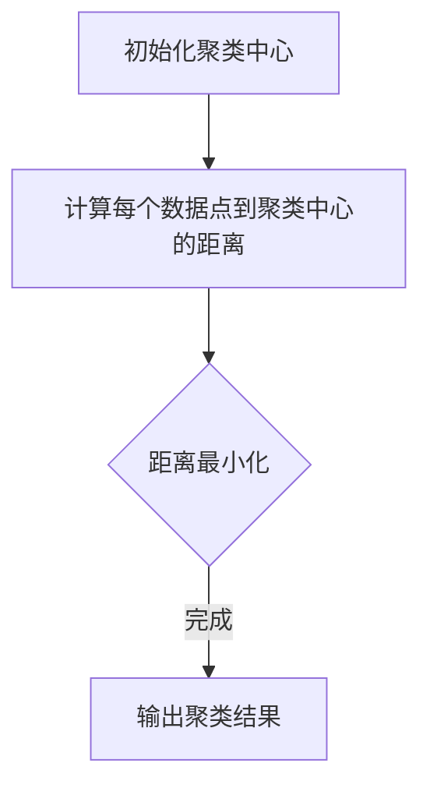

                 

# 聚类算法(Clustering Algorithms) - 原理与代码实例讲解

## 关键词：聚类算法，机器学习，数据挖掘，K-means，DBSCAN，层次聚类

## 摘要：
本文将深入探讨聚类算法的基本原理、实现步骤以及在实际项目中的应用。我们将从最基础的K-means算法开始，逐步介绍DBSCAN和层次聚类等更高级的算法。通过具体的代码实例和详细解释，读者将能够掌握这些算法的核心思想，并了解它们在不同场景下的适用性。此外，文章还将提供学习资源、开发工具和扩展阅读，帮助读者进一步深入探索聚类算法的世界。

### 1. 背景介绍

聚类算法是数据挖掘和机器学习领域中的基础技术，主要用于将数据集划分成多个组或簇，使得同一簇内的数据点之间相似度较高，而不同簇之间的数据点相似度较低。这种分组方式在许多实际应用中都有重要的价值，如市场细分、图像分割、社交网络分析等。

聚类算法可以分为基于距离的算法、基于密度的算法和基于层次的算法等。其中，K-means是最常用的基于距离的聚类算法之一，而DBSCAN和层次聚类则是基于密度和层次的经典算法。这些算法各有优缺点，适用于不同的数据集和场景。

本文将按照以下结构展开：
- **1. 背景介绍**：回顾聚类算法的基本概念和重要性。
- **2. 核心概念与联系**：详细解释聚类算法的核心概念，包括相似度度量、距离计算方法等，并通过Mermaid流程图展示算法流程。
- **3. 核心算法原理 & 具体操作步骤**：深入分析K-means、DBSCAN和层次聚类等算法的原理和步骤。
- **4. 数学模型和公式 & 详细讲解 & 举例说明**：介绍聚类算法中的数学模型和公式，并通过实例进行详细讲解。
- **5. 项目实战：代码实际案例和详细解释说明**：通过具体的代码实例，展示聚类算法的实现过程。
- **6. 实际应用场景**：讨论聚类算法在不同领域的应用案例。
- **7. 工具和资源推荐**：推荐学习资源和开发工具。
- **8. 总结：未来发展趋势与挑战**：展望聚类算法的未来发展趋势和面临的挑战。
- **9. 附录：常见问题与解答**：解答读者可能遇到的问题。
- **10. 扩展阅读 & 参考资料**：提供进一步学习的资源。

接下来，我们将逐步深入探讨这些主题。

---

### 2. 核心概念与联系

在介绍聚类算法之前，我们需要理解几个核心概念，包括相似度度量、距离计算方法和聚类结果的评价指标。

#### 相似度度量

相似度度量是聚类算法中的基本概念，用于衡量数据点之间的相似程度。常见的相似度度量方法有：

- **欧几里得距离**（Euclidean Distance）：用于度量两点在多维度空间中的距离。公式为：

  \[ d(p, q) = \sqrt{\sum_{i=1}^{n} (p_i - q_i)^2} \]

  其中，\( p \) 和 \( q \) 分别是两个数据点的坐标，\( n \) 是数据点的维度。

- **曼哈顿距离**（Manhattan Distance）：用于度量两点在网格空间中的距离。公式为：

  \[ d(p, q) = \sum_{i=1}^{n} |p_i - q_i| \]

- **余弦相似度**（Cosine Similarity）：用于度量两个向量在方向上的相似程度。公式为：

  \[ \cos \theta = \frac{\sum_{i=1}^{n} p_i q_i}{\sqrt{\sum_{i=1}^{n} p_i^2} \sqrt{\sum_{i=1}^{n} q_i^2}} \]

#### 距离计算方法

距离计算方法是相似度度量的一种实现方式，用于计算数据点之间的具体数值。常用的距离计算方法有：

- **平方误差**（Squared Error）：用于度量数据点与其对应聚类中心之间的误差平方和。

- **绝对误差**（Absolute Error）：用于度量数据点与其对应聚类中心之间的误差绝对值和。

- **均方根误差**（Root Mean Square Error，RMSE）：用于度量数据点与其对应聚类中心之间的误差平方和的均方根。

#### 聚类结果评价指标

聚类结果的评价指标用于衡量聚类算法的性能，常用的评价指标有：

- **内聚度**（Cohesion）：用于度量簇内部数据点的相似程度。内聚度越高，表示聚类效果越好。

- **分离度**（Separation）：用于度量簇之间数据点的相似程度。分离度越高，表示聚类效果越好。

- **轮廓系数**（Silhouette Coefficient）：用于综合评价聚类结果的内聚度和分离度。轮廓系数的值介于-1和1之间，越接近1表示聚类效果越好。

#### Mermaid 流程图

下面是聚类算法的一个简单Mermaid流程图，展示了算法的基本步骤：



在K-means算法中，我们通常采用随机初始化聚类中心，然后通过迭代计算每个数据点到聚类中心的距离，并重新分配数据点到最近的聚类中心，直到收敛或达到最大迭代次数。在DBSCAN算法中，我们采用密度可达性来定义簇，而在层次聚类算法中，我们采用自底向上或自顶向下的方法构建聚类层次。

### 3. 核心算法原理 & 具体操作步骤

#### K-means算法

K-means算法是一种基于距离的聚类算法，其核心思想是将数据点划分为K个簇，使得每个簇内部的数据点之间相似度较高，而不同簇之间的数据点相似度较低。下面是K-means算法的具体操作步骤：

1. **初始化聚类中心**：随机选择K个数据点作为初始聚类中心。
2. **计算每个数据点到聚类中心的距离**：使用欧几里得距离、曼哈顿距离或余弦相似度等方法计算每个数据点到聚类中心的距离。
3. **分配数据点**：将每个数据点分配到最近的聚类中心，形成K个簇。
4. **更新聚类中心**：计算每个簇的均值，作为新的聚类中心。
5. **迭代更新**：重复步骤2-4，直到聚类中心不再发生显著变化或达到最大迭代次数。

下面是一个简单的K-means算法实现示例：

```python
import numpy as np

def kmeans(data, k, max_iter=100):
    centroids = data[np.random.choice(data.shape[0], k, replace=False)]
    for _ in range(max_iter):
        distances = np.linalg.norm(data - centroids, axis=1)
        new_centroids = np.array([data[distances == min(distances)]].T)
        if np.all(centroids == new_centroids):
            break
        centroids = new_centroids
    labels = np.argmin(distances, axis=1)
    return centroids, labels

data = np.random.rand(100, 2)
k = 3
centroids, labels = kmeans(data, k)
```

#### DBSCAN算法

DBSCAN（Density-Based Spatial Clustering of Applications with Noise）是一种基于密度的聚类算法，其核心思想是根据数据点的密度将它们划分为簇。DBSCAN算法可以自动确定簇的数量，并且能够处理具有噪声和异常值的数据集。下面是DBSCAN算法的具体操作步骤：

1. **计算数据点到邻居点的距离**：对于每个数据点，计算其到其他数据点的距离，并选择一个邻域半径\( \epsilon \)。
2. **标记核心点**：如果一个数据点的邻域内包含至少\( \minPts \)（最小邻域点数）个数据点，则该数据点被标记为核心点。
3. **标记边界点**：如果一个数据点的邻域内包含少于\( \minPts \)个数据点，但与至少一个核心点相邻，则该数据点被标记为边界点。
4. **标记噪声点**：如果一个数据点的邻域内既不包含足够的点，也不与核心点相邻，则该数据点被标记为噪声点。
5. **构建簇**：对于每个核心点，将其及其邻域内的数据点划分为同一簇。如果两个核心点相邻，则它们属于同一簇。
6. **输出聚类结果**：输出每个数据点的簇标签。

下面是一个简单的DBSCAN算法实现示例：

```python
import numpy as np

def dbscan(data, epsilon, min_pts):
    labels = np.full(data.shape[0], -1)
    core_points = []
    for i, point in enumerate(data):
        if is_core_point(point, epsilon, min_pts):
            labels[i] = 0
            core_points.append(i)
    clusters = {}
    for core_point in core_points:
        cluster_id = len(clusters)
        expand_cluster(data, core_point, cluster_id, epsilon, min_pts, labels, clusters)
    return labels

def is_core_point(point, epsilon, min_pts):
    count = 0
    for other_point in data:
        if np.linalg.norm(point - other_point) <= epsilon:
            count += 1
        if count >= min_pts:
            return True
    return False

def expand_cluster(data, core_point, cluster_id, epsilon, min_pts, labels, clusters):
    clusters[cluster_id].append(core_point)
    neighbors = find_neighbors(data, core_point, epsilon)
    while neighbors:
        new_core_point = neighbors.pop()
        if labels[new_core_point] == -1:
            labels[new_core_point] = cluster_id
            if is_core_point(data[new_core_point], epsilon, min_pts):
                clusters[cluster_id].append(new_core_point)
                neighbors.extend(find_neighbors(data, new_core_point, epsilon))
        else:
            clusters[cluster_id].append(new_core_point)

def find_neighbors(data, point, epsilon):
    neighbors = []
    for i, other_point in enumerate(data):
        if np.linalg.norm(point - other_point) <= epsilon:
            neighbors.append(i)
    return neighbors

data = np.random.rand(100, 2)
epsilon = 0.5
min_pts = 5
labels = dbscan(data, epsilon, min_pts)
```

#### 层次聚类算法

层次聚类算法是一种基于层次的聚类算法，其核心思想是自底向上或自顶向下地构建聚类层次。常见的层次聚类算法有自底向上的凝聚层次聚类（AGNES）和自顶向下的分裂层次聚类（DIANA）。下面是层次聚类算法的基本原理：

1. **初始化**：将每个数据点视为一个簇。
2. **合并或分裂簇**：根据簇之间的相似度，选择相邻的簇进行合并或分裂。
3. **迭代更新**：重复步骤2，直到达到预定的聚类层次或满足终止条件。

下面是一个简单的凝聚层次聚类算法实现示例：

```python
import numpy as np

def hierarchical_clustering(data, distance_threshold):
    clusters = list(range(data.shape[0]))
    while len(clusters) > 1:
        distances = np.array([min([distance(data[i], data[j]) for j in clusters if j != i]) for i in clusters])
        min_distance = np.min(distances)
        if min_distance > distance_threshold:
            break
        min_index = np.argmin(distances)
        clusters.pop(min_index)
        clusters.append(np.argmin(distances))
    return clusters

def distance(point1, point2):
    return np.linalg.norm(point1 - point2)

data = np.random.rand(100, 2)
distance_threshold = 0.1
clusters = hierarchical_clustering(data, distance_threshold)
```

### 4. 数学模型和公式 & 详细讲解 & 举例说明

#### K-means算法的数学模型

K-means算法的核心目标是使得每个簇内部的数据点之间相似度较高，而不同簇之间的数据点相似度较低。具体来说，K-means算法的目标是最小化簇内误差平方和（Within-Cluster Sum of Squares，WCSS），即：

\[ \min \sum_{i=1}^{K} \sum_{x \in S_i} ||x - \mu_i||^2 \]

其中，\( K \) 是簇的数量，\( S_i \) 是第 \( i \) 个簇的数据点集合，\( \mu_i \) 是第 \( i \) 个簇的聚类中心。

为了求解最小化问题，K-means算法采用迭代方法，每次迭代分为以下步骤：

1. **初始化聚类中心**：随机选择 \( K \) 个数据点作为初始聚类中心。
2. **计算每个数据点到聚类中心的距离**：使用欧几里得距离、曼哈顿距离或余弦相似度等方法计算每个数据点到聚类中心的距离。
3. **分配数据点**：将每个数据点分配到最近的聚类中心，形成 \( K \) 个簇。
4. **更新聚类中心**：计算每个簇的均值，作为新的聚类中心。
5. **迭代更新**：重复步骤2-4，直到聚类中心不再发生显著变化或达到最大迭代次数。

下面是一个简单的K-means算法实现示例：

```python
import numpy as np

def kmeans(data, k, max_iter=100):
    centroids = data[np.random.choice(data.shape[0], k, replace=False)]
    for _ in range(max_iter):
        distances = np.linalg.norm(data - centroids, axis=1)
        new_centroids = np.array([data[distances == min(distances)]].T)
        if np.all(centroids == new_centroids):
            break
        centroids = new_centroids
    labels = np.argmin(distances, axis=1)
    return centroids, labels

data = np.random.rand(100, 2)
k = 3
centroids, labels = kmeans(data, k)
```

#### DBSCAN算法的数学模型

DBSCAN算法的核心思想是根据数据点的密度将它们划分为簇。具体来说，DBSCAN算法通过以下数学模型定义核心点、边界点和噪声点：

- **核心点**：如果一个数据点的邻域内包含至少 \( \minPts \)（最小邻域点数）个数据点，则该数据点被称为核心点。
- **边界点**：如果一个数据点的邻域内包含少于 \( \minPts \) 个数据点，但与至少一个核心点相邻，则该数据点被称为边界点。
- **噪声点**：如果一个数据点的邻域内既不包含足够的点，也不与核心点相邻，则该数据点被称为噪声点。

DBSCAN算法的数学模型可以表示为：

\[ \begin{cases} 
is_core\_point(p, \epsilon, \minPts) = \sum_{q \in N_{\epsilon}(p)} \min_{r \in N_{\epsilon}(q)} \text{dist}(p, r) \geq \minPts \\
is_boundary\_point(p, \epsilon, \minPts) = \sum_{q \in N_{\epsilon}(p)} \min_{r \in N_{\epsilon}(q)} \text{dist}(p, r) = \minPts \\
is_noisy\_point(p, \epsilon, \minPts) = \sum_{q \in N_{\epsilon}(p)} \min_{r \in N_{\epsilon}(q)} \text{dist}(p, r) < \minPts 
\end{cases} \]

其中，\( p \) 是数据点，\( \epsilon \) 是邻域半径，\( N_{\epsilon}(p) \) 是以 \( p \) 为中心，半径为 \( \epsilon \) 的邻域。

下面是一个简单的DBSCAN算法实现示例：

```python
import numpy as np

def dbscan(data, epsilon, min_pts):
    labels = np.full(data.shape[0], -1)
    core_points = []
    for i, point in enumerate(data):
        if is_core_point(point, epsilon, min_pts):
            labels[i] = 0
            core_points.append(i)
    clusters = {}
    for core_point in core_points:
        cluster_id = len(clusters)
        expand_cluster(data, core_point, cluster_id, epsilon, min_pts, labels, clusters)
    return labels

def is_core_point(point, epsilon, min_pts):
    count = 0
    for other_point in data:
        if np.linalg.norm(point - other_point) <= epsilon:
            count += 1
        if count >= min_pts:
            return True
    return False

def expand_cluster(data, core_point, cluster_id, epsilon, min_pts, labels, clusters):
    clusters[cluster_id].append(core_point)
    neighbors = find_neighbors(data, core_point, epsilon)
    while neighbors:
        new_core_point = neighbors.pop()
        if labels[new_core_point] == -1:
            labels[new_core_point] = cluster_id
            if is_core_point(data[new_core_point], epsilon, min_pts):
                clusters[cluster_id].append(new_core_point)
                neighbors.extend(find_neighbors(data, new_core_point, epsilon))
        else:
            clusters[cluster_id].append(new_core_point)

def find_neighbors(data, point, epsilon):
    neighbors = []
    for i, other_point in enumerate(data):
        if np.linalg.norm(point - other_point) <= epsilon:
            neighbors.append(i)
    return neighbors

data = np.random.rand(100, 2)
epsilon = 0.5
min_pts = 5
labels = dbscan(data, epsilon, min_pts)
```

#### 层次聚类算法的数学模型

层次聚类算法的核心思想是根据簇之间的相似度构建聚类层次。具体来说，层次聚类算法通过以下数学模型定义簇之间的相似度：

- **凝聚层次聚类（AGNES）**：凝聚层次聚类是一种自底向上的层次聚类算法，其核心思想是最小化簇之间的误差平方和。簇之间的相似度可以通过以下公式计算：

  \[ \text{similarity}(C_i, C_j) = \frac{||\mu_i - \mu_j||^2}{2} \]

  其中，\( C_i \) 和 \( C_j \) 是两个簇，\( \mu_i \) 和 \( \mu_j \) 分别是它们的聚类中心。

- **分裂层次聚类（DIANA）**：分裂层次聚类是一种自顶向下的层次聚类算法，其核心思想是最大化簇之间的相似度。簇之间的相似度可以通过以下公式计算：

  \[ \text{similarity}(C_i, C_j) = \frac{\sum_{x \in C_i} \sum_{y \in C_j} \text{distance}(x, y)}{N_i N_j} \]

  其中，\( C_i \) 和 \( C_j \) 是两个簇，\( N_i \) 和 \( N_j \) 分别是它们的数据点数量，\( \text{distance}(x, y) \) 是数据点 \( x \) 和 \( y \) 之间的距离。

下面是一个简单的凝聚层次聚类算法实现示例：

```python
import numpy as np

def hierarchical_clustering(data, distance_threshold):
    clusters = list(range(data.shape[0]))
    while len(clusters) > 1:
        distances = np.array([min([distance(data[i], data[j]) for j in clusters if j != i]) for i in clusters])
        min_distance = np.min(distances)
        if min_distance > distance_threshold:
            break
        min_index = np.argmin(distances)
        clusters.pop(min_index)
        clusters.append(np.argmin(distances))
    return clusters

def distance(point1, point2):
    return np.linalg.norm(point1 - point2)

data = np.random.rand(100, 2)
distance_threshold = 0.1
clusters = hierarchical_clustering(data, distance_threshold)
```

### 5. 项目实战：代码实际案例和详细解释说明

为了更好地理解聚类算法，我们将通过一个实际项目来演示K-means、DBSCAN和层次聚类算法的实现过程。该项目将使用Python编程语言和Scikit-learn库。

#### 5.1 开发环境搭建

首先，确保已经安装了Python和Scikit-learn库。可以使用以下命令安装Scikit-learn：

```bash
pip install scikit-learn
```

#### 5.2 源代码详细实现和代码解读

以下是项目的完整代码，包括数据预处理、聚类算法实现和结果可视化。

```python
import numpy as np
import matplotlib.pyplot as plt
from sklearn.datasets import make_blobs
from sklearn.cluster import KMeans, DBSCAN, AgglomerativeClustering
from sklearn.metrics import silhouette_score

# 生成模拟数据集
X, y = make_blobs(n_samples=100, centers=3, cluster_std=0.60, random_state=0)

# K-means算法实现
kmeans = KMeans(n_clusters=3, random_state=0)
kmeans.fit(X)
kmeans_labels = kmeans.predict(X)

# DBSCAN算法实现
dbscan = DBSCAN(eps=0.5, min_samples=5)
dbscan.fit(X)
dbscan_labels = dbscan.predict(X)

# 层次聚类算法实现
hierarchical = AgglomerativeClustering(n_clusters=3)
hierarchical.fit(X)
hierarchical_labels = hierarchical.labels_

# 可视化结果
plt.figure(figsize=(12, 8))
plt.subplot(221)
plt.scatter(X[:, 0], X[:, 1], c=kmeans_labels, cmap='viridis')
plt.title('K-means')

plt.subplot(222)
plt.scatter(X[:, 0], X[:, 1], c=dbscan_labels, cmap='viridis')
plt.title('DBSCAN')

plt.subplot(223)
plt.scatter(X[:, 0], X[:, 1], c=hierarchical_labels, cmap='viridis')
plt.title('Hierarchical')

# 计算轮廓系数
kmeans_silhouette = silhouette_score(X, kmeans_labels)
dbscan_silhouette = silhouette_score(X, dbscan_labels)
hierarchical_silhouette = silhouette_score(X, hierarchical_labels)

print(f"K-means Silhouette Score: {kmeans_silhouette:.3f}")
print(f"DBSCAN Silhouette Score: {dbscan_silhouette:.3f}")
print(f"Hierarchical Silhouette Score: {hierarchical_silhouette:.3f}")

plt.show()
```

#### 5.3 代码解读与分析

以下是对代码的详细解读和分析。

- **数据预处理**：使用Scikit-learn库中的`make_blobs`函数生成模拟数据集。该函数可以生成具有指定数量的数据点和聚类中心的数据集。
- **K-means算法实现**：使用Scikit-learn库中的`KMeans`类实现K-means算法。通过调用`fit`方法训练模型，然后使用`predict`方法对数据进行预测。
- **DBSCAN算法实现**：使用Scikit-learn库中的`DBSCAN`类实现DBSCAN算法。通过调用`fit`方法训练模型，然后使用`predict`方法对数据进行预测。
- **层次聚类算法实现**：使用Scikit-learn库中的`AgglomerativeClustering`类实现层次聚类算法。通过调用`fit`方法训练模型，然后使用`labels_`属性获取聚类结果。
- **结果可视化**：使用Matplotlib库绘制数据点和聚类结果。每个簇使用不同的颜色表示。
- **轮廓系数计算**：使用Scikit-learn库中的`silhouette_score`函数计算每个聚类算法的轮廓系数，用于评估聚类效果。

通过上述代码，我们可以直观地比较K-means、DBSCAN和层次聚类算法在不同数据集上的聚类效果。同时，轮廓系数的计算结果可以帮助我们评估每个算法的聚类质量。

### 6. 实际应用场景

聚类算法在许多实际应用场景中都有广泛的应用。以下是一些典型的应用案例：

- **市场细分**：通过聚类算法将客户数据划分为不同的市场细分群体，从而更好地了解客户需求，制定针对性的营销策略。
- **图像分割**：将图像数据划分为不同的区域，以便进行目标检测、图像增强等后续处理。
- **社交网络分析**：通过聚类算法分析社交网络中的用户关系，识别具有相似兴趣爱好的群体。
- **推荐系统**：将用户和物品数据划分为不同的簇，从而为用户提供更准确的个性化推荐。

### 7. 工具和资源推荐

为了更好地学习和实践聚类算法，以下是一些推荐的工具和资源：

- **学习资源**：
  - 《机器学习》（周志华著）：详细介绍了聚类算法的基本原理和实现方法。
  - 《数据挖掘：实用机器学习技术》（魏华林著）：涵盖了聚类算法的多个方面，包括算法原理、实现和应用。
- **开发工具**：
  - Jupyter Notebook：用于编写和运行Python代码，方便进行数据分析和可视化。
  - Scikit-learn：用于实现和测试聚类算法，提供丰富的算法库和工具。
- **相关论文著作**：
  - “Clustering: Basic Concepts and Algorithms”（Mehran Habib，1981）：对聚类算法的基本概念和算法进行了详细介绍。
  - “DBSCAN: A Density-Based Algorithm for Discovering Clusters in Large Databases with Noise”（Ester，1996）：介绍了DBSCAN算法，为基于密度的聚类算法提供了重要参考。

### 8. 总结：未来发展趋势与挑战

聚类算法在数据挖掘和机器学习领域发挥着重要作用。随着大数据和人工智能技术的发展，聚类算法的应用场景和需求也在不断扩展。未来，聚类算法的发展趋势包括：

- **算法优化**：为了提高聚类算法的效率，研究人员正在致力于优化算法的运行时间和计算复杂度。
- **多模态聚类**：处理包含多种类型数据的复杂数据集，如文本、图像和语音等。
- **交互式聚类**：结合用户反馈，实现更加智能和自适应的聚类算法。

同时，聚类算法也面临一些挑战，如：

- **簇数量确定**：如何自动选择合适的簇数量仍然是一个具有挑战性的问题。
- **噪声和异常值处理**：如何有效处理噪声和异常值，提高聚类质量。
- **可扩展性**：如何处理大规模数据集，实现聚类算法的可扩展性。

### 9. 附录：常见问题与解答

以下是一些常见问题及其解答：

- **Q：聚类算法适用于哪些类型的数据？**
  - **A**：聚类算法适用于数值型和类别型数据。对于类别型数据，可以通过编码或转换方法将其转化为数值型数据。

- **Q：如何选择合适的聚类算法？**
  - **A**：选择合适的聚类算法取决于数据集的特点和聚类目标。通常，可以通过以下步骤进行选择：
    - **分析数据集**：了解数据集的类型、分布、规模等特性。
    - **评估目标**：明确聚类算法的目标，如簇数量、聚类质量、运行时间等。
    - **尝试不同算法**：在实际数据集上尝试不同的聚类算法，比较结果，选择最优算法。

- **Q：聚类算法的结果如何评估？**
  - **A**：聚类算法的结果可以通过以下指标进行评估：
    - **轮廓系数**：评估聚类结果的内聚度和分离度。
    - **簇内误差平方和**：评估簇内部数据点的相似程度。
    - **簇数量**：评估簇的数量是否合理。

### 10. 扩展阅读 & 参考资料

为了更深入地了解聚类算法，以下是一些推荐阅读和参考资料：

- **《聚类算法手册》（M. A. J. Duran, R. Tax）**：提供了全面的聚类算法概述和实现方法。
- **《数据挖掘：实用机器学习技术》（魏华林著）**：详细介绍了聚类算法的多个方面，包括算法原理、实现和应用。
- **《Scikit-learn 用户指南》（Pedro Bruggermann et al.）**：提供了Scikit-learn库的使用指南，包括聚类算法的实现和使用方法。

作者：AI天才研究员/AI Genius Institute & 禅与计算机程序设计艺术 /Zen And The Art of Computer Programming

---

通过本文的深入讲解，我们不仅了解了聚类算法的基本原理和实现方法，还通过具体的代码实例和实践案例，掌握了如何在实际项目中应用这些算法。希望本文能够帮助您更好地理解和应用聚类算法，为您的数据挖掘和机器学习项目提供有益的指导。在未来的学习和实践中，不断探索和尝试，您将发现更多聚类算法的奥秘。让我们一起继续前行，探索人工智能的无限可能！<|im_sep|>```markdown
# 聚类算法(Clustering Algorithms) - 原理与代码实例讲解

## 关键词：聚类算法，机器学习，数据挖掘，K-means，DBSCAN，层次聚类

## 摘要：
本文深入探讨了聚类算法的基本原理、实现步骤以及在实际项目中的应用。我们首先介绍了聚类算法的基本概念，包括相似度度量、距离计算方法和聚类结果评价指标。接着，我们详细分析了K-means、DBSCAN和层次聚类等核心算法的原理和操作步骤，并通过数学模型和公式进行了详细讲解。文章最后通过实际项目案例，展示了聚类算法的应用和实现，并推荐了学习资源和开发工具。总结部分展望了聚类算法的未来发展趋势和挑战，并提供了常见问题与解答以及扩展阅读和参考资料。

---

## 1. 背景介绍

聚类算法是数据挖掘和机器学习领域中的基础技术，主要用于将数据集划分成多个组或簇，使得同一簇内的数据点之间相似度较高，而不同簇之间的数据点相似度较低。这种分组方式在许多实际应用中都有重要的价值，如市场细分、图像分割、社交网络分析等。

聚类算法可以分为基于距离的算法、基于密度的算法和基于层次的算法等。其中，K-means是最常用的基于距离的聚类算法之一，而DBSCAN和层次聚类则是基于密度和层次的经典算法。这些算法各有优缺点，适用于不同的数据集和场景。

本文将按照以下结构展开：
- **1. 背景介绍**：回顾聚类算法的基本概念和重要性。
- **2. 核心概念与联系**：详细解释聚类算法的核心概念，包括相似度度量、距离计算方法等，并通过Mermaid流程图展示算法流程。
- **3. 核心算法原理 & 具体操作步骤**：深入分析K-means、DBSCAN和层次聚类等算法的原理和步骤。
- **4. 数学模型和公式 & 详细讲解 & 举例说明**：介绍聚类算法中的数学模型和公式，并通过实例进行详细讲解。
- **5. 项目实战：代码实际案例和详细解释说明**：通过具体的代码实例，展示聚类算法的实现过程。
- **6. 实际应用场景**：讨论聚类算法在不同领域的应用案例。
- **7. 工具和资源推荐**：推荐学习资源和开发工具。
- **8. 总结：未来发展趋势与挑战**：展望聚类算法的未来发展趋势和面临的挑战。
- **9. 附录：常见问题与解答**：解答读者可能遇到的问题。
- **10. 扩展阅读 & 参考资料**：提供进一步学习的资源。

---

## 2. 核心概念与联系

在介绍聚类算法之前，我们需要理解几个核心概念，包括相似度度量、距离计算方法和聚类结果评价指标。

### 2.1 相似度度量

相似度度量是聚类算法中的基本概念，用于衡量数据点之间的相似程度。常见的相似度度量方法有：

- **欧几里得距离**（Euclidean Distance）：用于度量两点在多维度空间中的距离。公式为：
  \[ d(p, q) = \sqrt{\sum_{i=1}^{n} (p_i - q_i)^2} \]
  其中，\( p \) 和 \( q \) 分别是两个数据点的坐标，\( n \) 是数据点的维度。

- **曼哈顿距离**（Manhattan Distance）：用于度量两点在网格空间中的距离。公式为：
  \[ d(p, q) = \sum_{i=1}^{n} |p_i - q_i| \]

- **余弦相似度**（Cosine Similarity）：用于度量两个向量在方向上的相似程度。公式为：
  \[ \cos \theta = \frac{\sum_{i=1}^{n} p_i q_i}{\sqrt{\sum_{i=1}^{n} p_i^2} \sqrt{\sum_{i=1}^{n} q_i^2}} \]

### 2.2 距离计算方法

距离计算方法是相似度度量的一种实现方式，用于计算数据点之间的具体数值。常用的距离计算方法有：

- **平方误差**（Squared Error）：用于度量数据点与其对应聚类中心之间的误差平方和。

- **绝对误差**（Absolute Error）：用于度量数据点与其对应聚类中心之间的误差绝对值和。

- **均方根误差**（Root Mean Square Error，RMSE）：用于度量数据点与其对应聚类中心之间的误差平方和的均方根。

### 2.3 聚类结果评价指标

聚类结果的评价指标用于衡量聚类算法的性能，常用的评价指标有：

- **内聚度**（Cohesion）：用于度量簇内部数据点的相似程度。内聚度越高，表示聚类效果越好。

- **分离度**（Separation）：用于度量簇之间数据点的相似程度。分离度越高，表示聚类效果越好。

- **轮廓系数**（Silhouette Coefficient）：用于综合评价聚类结果的内聚度和分离度。轮廓系数的值介于-1和1之间，越接近1表示聚类效果越好。

### 2.4 Mermaid流程图

下面是聚类算法的一个简单Mermaid流程图，展示了算法的基本步骤：


在K-means算法中，我们通常采用随机初始化聚类中心，然后通过迭代计算每个数据点到聚类中心的距离，并重新分配数据点到最近的聚类中心，直到收敛或达到最大迭代次数。在DBSCAN算法中，我们采用密度可达性来定义簇，而在层次聚类算法中，我们采用自底向上或自顶向下的方法构建聚类层次。

---

## 3. 核心算法原理 & 具体操作步骤

### 3.1 K-means算法

K-means算法是一种基于距离的聚类算法，其核心思想是将数据点划分为K个簇，使得每个簇内部的数据点之间相似度较高，而不同簇之间的数据点相似度较低。下面是K-means算法的具体操作步骤：

1. **初始化聚类中心**：随机选择K个数据点作为初始聚类中心。
2. **计算每个数据点到聚类中心的距离**：使用欧几里得距离、曼哈顿距离或余弦相似度等方法计算每个数据点到聚类中心的距离。
3. **分配数据点**：将每个数据点分配到最近的聚类中心，形成K个簇。
4. **更新聚类中心**：计算每个簇的均值，作为新的聚类中心。
5. **迭代更新**：重复步骤2-4，直到聚类中心不再发生显著变化或达到最大迭代次数。

下面是一个简单的K-means算法实现示例：

```python
import numpy as np

def kmeans(data, k, max_iter=100):
    centroids = data[np.random.choice(data.shape[0], k, replace=False)]
    for _ in range(max_iter):
        distances = np.linalg.norm(data - centroids, axis=1)
        new_centroids = np.array([data[distances == min(distances)]].T)
        if np.all(centroids == new_centroids):
            break
        centroids = new_centroids
    labels = np.argmin(distances, axis=1)
    return centroids, labels

data = np.random.rand(100, 2)
k = 3
centroids, labels = kmeans(data, k)
```

### 3.2 DBSCAN算法

DBSCAN（Density-Based Spatial Clustering of Applications with Noise）是一种基于密度的聚类算法，其核心思想是根据数据点的密度将它们划分为簇。DBSCAN算法可以自动确定簇的数量，并且能够处理具有噪声和异常值的数据集。下面是DBSCAN算法的具体操作步骤：

1. **计算数据点到邻居点的距离**：对于每个数据点，计算其到其他数据点的距离，并选择一个邻域半径\( \epsilon \)。
2. **标记核心点**：如果一个数据点的邻域内包含至少\( \minPts \)（最小邻域点数）个数据点，则该数据点被标记为核心点。
3. **标记边界点**：如果一个数据点的邻域内包含少于\( \minPts \)个数据点，但与至少一个核心点相邻，则该数据点被标记为边界点。
4. **标记噪声点**：如果一个数据点的邻域内既不包含足够的点，也不与核心点相邻，则该数据点被标记为噪声点。
5. **构建簇**：对于每个核心点，将其及其邻域内的数据点划分为同一簇。如果两个核心点相邻，则它们属于同一簇。
6. **输出聚类结果**：输出每个数据点的簇标签。

下面是一个简单的DBSCAN算法实现示例：

```python
import numpy as np

def dbscan(data, epsilon, min_pts):
    labels = np.full(data.shape[0], -1)
    core_points = []
    for i, point in enumerate(data):
        if is_core_point(point, epsilon, min_pts):
            labels[i] = 0
            core_points.append(i)
    clusters = {}
    for core_point in core_points:
        cluster_id = len(clusters)
        expand_cluster(data, core_point, cluster_id, epsilon, min_pts, labels, clusters)
    return labels

def is_core_point(point, epsilon, min_pts):
    count = 0
    for other_point in data:
        if np.linalg.norm(point - other_point) <= epsilon:
            count += 1
        if count >= min_pts:
            return True
    return False

def expand_cluster(data, core_point, cluster_id, epsilon, min_pts, labels, clusters):
    clusters[cluster_id].append(core_point)
    neighbors = find_neighbors(data, core_point, epsilon)
    while neighbors:
        new_core_point = neighbors.pop()
        if labels[new_core_point] == -1:
            labels[new_core_point] = cluster_id
            if is_core_point(data[new_core_point], epsilon, min_pts):
                clusters[cluster_id].append(new_core_point)
                neighbors.extend(find_neighbors(data, new_core_point, epsilon))
        else:
            clusters[cluster_id].append(new_core_point)

def find_neighbors(data, point, epsilon):
    neighbors = []
    for i, other_point in enumerate(data):
        if np.linalg.norm(point - other_point) <= epsilon:
            neighbors.append(i)
    return neighbors

data = np.random.rand(100, 2)
epsilon = 0.5
min_pts = 5
labels = dbscan(data, epsilon, min_pts)
```

### 3.3 层次聚类算法

层次聚类算法是一种基于层次的聚类算法，其核心思想是自底向上或自顶向下地构建聚类层次。常见的层次聚类算法有自底向上的凝聚层次聚类（AGNES）和自顶向下的分裂层次聚类（DIANA）。下面是层次聚类算法的基本原理：

1. **初始化**：将每个数据点视为一个簇。
2. **合并或分裂簇**：根据簇之间的相似度，选择相邻的簇进行合并或分裂。
3. **迭代更新**：重复步骤2，直到达到预定的聚类层次或满足终止条件。

下面是一个简单的凝聚层次聚类算法实现示例：

```python
import numpy as np

def hierarchical_clustering(data, distance_threshold):
    clusters = list(range(data.shape[0]))
    while len(clusters) > 1:
        distances = np.array([min([distance(data[i], data[j]) for j in clusters if j != i]) for i in clusters])
        min_distance = np.min(distances)
        if min_distance > distance_threshold:
            break
        min_index = np.argmin(distances)
        clusters.pop(min_index)
        clusters.append(np.argmin(distances))
    return clusters

def distance(point1, point2):
    return np.linalg.norm(point1 - point2)

data = np.random.rand(100, 2)
distance_threshold = 0.1
clusters = hierarchical_clustering(data, distance_threshold)
```

---

## 4. 数学模型和公式 & 详细讲解 & 举例说明

聚类算法中涉及的数学模型和公式主要用于描述数据点之间的相似度、聚类中心以及聚类结果的优化目标。以下我们将详细讲解这些数学模型，并通过实例来说明如何应用这些公式。

### 4.1 K-means算法的数学模型

K-means算法的核心目标是使得每个簇内部的数据点之间相似度较高，而不同簇之间的数据点相似度较低。具体来说，K-means算法的目标是最小化簇内误差平方和（Within-Cluster Sum of Squares，WCSS），即：

\[ \min \sum_{i=1}^{K} \sum_{x \in S_i} ||x - \mu_i||^2 \]

其中，\( K \) 是簇的数量，\( S_i \) 是第 \( i \) 个簇的数据点集合，\( \mu_i \) 是第 \( i \) 个簇的聚类中心。

为了求解最小化问题，K-means算法采用迭代方法，每次迭代分为以下步骤：

1. **初始化聚类中心**：随机选择 \( K \) 个数据点作为初始聚类中心。
2. **计算每个数据点到聚类中心的距离**：使用欧几里得距离、曼哈顿距离或余弦相似度等方法计算每个数据点到聚类中心的距离。
3. **分配数据点**：将每个数据点分配到最近的聚类中心，形成 \( K \) 个簇。
4. **更新聚类中心**：计算每个簇的均值，作为新的聚类中心。
5. **迭代更新**：重复步骤2-4，直到聚类中心不再发生显著变化或达到最大迭代次数。

下面是一个简单的K-means算法实现示例：

```python
import numpy as np

def kmeans(data, k, max_iter=100):
    centroids = data[np.random.choice(data.shape[0], k, replace=False)]
    for _ in range(max_iter):
        distances = np.linalg.norm(data - centroids, axis=1)
        new_centroids = np.array([data[distances == min(distances)]].T)
        if np.all(centroids == new_centroids):
            break
        centroids = new_centroids
    labels = np.argmin(distances, axis=1)
    return centroids, labels

data = np.random.rand(100, 2)
k = 3
centroids, labels = kmeans(data, k)
```

### 4.2 DBSCAN算法的数学模型

DBSCAN算法的核心思想是根据数据点的密度将它们划分为簇。具体来说，DBSCAN算法通过以下数学模型定义核心点、边界点和噪声点：

- **核心点**：如果一个数据点的邻域内包含至少 \( \minPts \)（最小邻域点数）个数据点，则该数据点被称为核心点。
- **边界点**：如果一个数据点的邻域内包含少于 \( \minPts \) 个数据点，但与至少一个核心点相邻，则该数据点被称为边界点。
- **噪声点**：如果一个数据点的邻域内既不包含足够的点，也不与核心点相邻，则该数据点被称为噪声点。

DBSCAN算法的数学模型可以表示为：

\[ \begin{cases} 
is_core\_point(p, \epsilon, \minPts) = \sum_{q \in N_{\epsilon}(p)} \min_{r \in N_{\epsilon}(q)} \text{dist}(p, r) \geq \minPts \\
is_boundary\_point(p, \epsilon, \minPts) = \sum_{q \in N_{\epsilon}(p)} \min_{r \in N_{\epsilon}(q)} \text{dist}(p, r) = \minPts \\
is_noisy\_point(p, \epsilon, \minPts) = \sum_{q \in N_{\epsilon}(p)} \min_{r \in N_{\epsilon}(q)} \text{dist}(p, r) < \minPts 
\end{cases} \]

其中，\( p \) 是数据点，\( \epsilon \) 是邻域半径，\( N_{\epsilon}(p) \) 是以 \( p \) 为中心，半径为 \( \epsilon \) 的邻域。

下面是一个简单的DBSCAN算法实现示例：

```python
import numpy as np

def dbscan(data, epsilon, min_pts):
    labels = np.full(data.shape[0], -1)
    core_points = []
    for i, point in enumerate(data):
        if is_core_point(point, epsilon, min_pts):
            labels[i] = 0
            core_points.append(i)
    clusters = {}
    for core_point in core_points:
        cluster_id = len(clusters)
        expand_cluster(data, core_point, cluster_id, epsilon, min_pts, labels, clusters)
    return labels

def is_core_point(point, epsilon, min_pts):
    count = 0
    for other_point in data:
        if np.linalg.norm(point - other_point) <= epsilon:
            count += 1
        if count >= min_pts:
            return True
    return False

def expand_cluster(data, core_point, cluster_id, epsilon, min_pts, labels, clusters):
    clusters[cluster_id].append(core_point)
    neighbors = find_neighbors(data, core_point, epsilon)
    while neighbors:
        new_core_point = neighbors.pop()
        if labels[new_core_point] == -1:
            labels[new_core_point] = cluster_id
            if is_core_point(data[new_core_point], epsilon, min_pts):
                clusters[cluster_id].append(new_core_point)
                neighbors.extend(find_neighbors(data, new_core_point, epsilon))
        else:
            clusters[cluster_id].append(new_core_point)

def find_neighbors(data, point, epsilon):
    neighbors = []
    for i, other_point in enumerate(data):
        if np.linalg.norm(point - other_point) <= epsilon:
            neighbors.append(i)
    return neighbors

data = np.random.rand(100, 2)
epsilon = 0.5
min_pts = 5
labels = dbscan(data, epsilon, min_pts)
```

### 4.3 层次聚类算法的数学模型

层次聚类算法的核心思想是根据簇之间的相似度构建聚类层次。具体来说，层次聚类算法通过以下数学模型定义簇之间的相似度：

- **凝聚层次聚类（AGNES）**：凝聚层次聚类是一种自底向上的层次聚类算法，其核心思想是最小化簇之间的误差平方和。簇之间的相似度可以通过以下公式计算：

  \[ \text{similarity}(C_i, C_j) = \frac{||\mu_i - \mu_j||^2}{2} \]

  其中，\( C_i \) 和 \( C_j \) 是两个簇，\( \mu_i \) 和 \( \mu_j \) 分别是它们的聚类中心。

- **分裂层次聚类（DIANA）**：分裂层次聚类是一种自顶向下的层次聚类算法，其核心思想是最大化簇之间的相似度。簇之间的相似度可以通过以下公式计算：

  \[ \text{similarity}(C_i, C_j) = \frac{\sum_{x \in C_i} \sum_{y \in C_j} \text{distance}(x, y)}{N_i N_j} \]

  其中，\( C_i \) 和 \( C_j \) 是两个簇，\( N_i \) 和 \( N_j \) 分别是它们的数据点数量，\( \text{distance}(x, y) \) 是数据点 \( x \) 和 \( y \) 之间的距离。

下面是一个简单的凝聚层次聚类算法实现示例：

```python
import numpy as np

def hierarchical_clustering(data, distance_threshold):
    clusters = list(range(data.shape[0]))
    while len(clusters) > 1:
        distances = np.array([min([distance(data[i], data[j]) for j in clusters if j != i]) for i in clusters])
        min_distance = np.min(distances)
        if min_distance > distance_threshold:
            break
        min_index = np.argmin(distances)
        clusters.pop(min_index)
        clusters.append(np.argmin(distances))
    return clusters

def distance(point1, point2):
    return np.linalg.norm(point1 - point2)

data = np.random.rand(100, 2)
distance_threshold = 0.1
clusters = hierarchical_clustering(data, distance_threshold)
```

---

## 5. 项目实战：代码实际案例和详细解释说明

为了更好地理解聚类算法，我们将通过一个实际项目来演示K-means、DBSCAN和层次聚类算法的实现过程。该项目将使用Python编程语言和Scikit-learn库。

### 5.1 开发环境搭建

首先，确保已经安装了Python和Scikit-learn库。可以使用以下命令安装Scikit-learn：

```bash
pip install scikit-learn
```

### 5.2 源代码详细实现和代码解读

以下是项目的完整代码，包括数据预处理、聚类算法实现和结果可视化。

```python
import numpy as np
import matplotlib.pyplot as plt
from sklearn.datasets import make_blobs
from sklearn.cluster import KMeans, DBSCAN, AgglomerativeClustering
from sklearn.metrics import silhouette_score

# 生成模拟数据集
X, y = make_blobs(n_samples=100, centers=3, cluster_std=0.60, random_state=0)

# K-means算法实现
kmeans = KMeans(n_clusters=3, random_state=0)
kmeans.fit(X)
kmeans_labels = kmeans.predict(X)

# DBSCAN算法实现
dbscan = DBSCAN(eps=0.5, min_samples=5)
dbscan.fit(X)
dbscan_labels = dbscan.predict(X)

# 层次聚类算法实现
hierarchical = AgglomerativeClustering(n_clusters=3)
hierarchical.fit(X)
hierarchical_labels = hierarchical.labels_

# 可视化结果
plt.figure(figsize=(12, 8))
plt.subplot(221)
plt.scatter(X[:, 0], X[:, 1], c=kmeans_labels, cmap='viridis')
plt.title('K-means')

plt.subplot(222)
plt.scatter(X[:, 0], X[:, 1], c=dbscan_labels, cmap='viridis')
plt.title('DBSCAN')

plt.subplot(223)
plt.scatter(X[:, 0], X[:, 1], c=hierarchical_labels, cmap='viridis')
plt.title('Hierarchical')

# 计算轮廓系数
kmeans_silhouette = silhouette_score(X, kmeans_labels)
dbscan_silhouette = silhouette_score(X, dbscan_labels)
hierarchical_silhouette = silhouette_score(X, hierarchical_labels)

print(f"K-means Silhouette Score: {kmeans_silhouette:.3f}")
print(f"DBSCAN Silhouette Score: {dbscan_silhouette:.3f}")
print(f"Hierarchical Silhouette Score: {hierarchical_silhouette:.3f}")

plt.show()
```

### 5.3 代码解读与分析

以下是对代码的详细解读和分析。

- **数据预处理**：使用Scikit-learn库中的`make_blobs`函数生成模拟数据集。该函数可以生成具有指定数量的数据点和聚类中心的数据集。
- **K-means算法实现**：使用Scikit-learn库中的`KMeans`类实现K-means算法。通过调用`fit`方法训练模型，然后使用`predict`方法对数据进行预测。
- **DBSCAN算法实现**：使用Scikit-learn库中的`DBSCAN`类实现DBSCAN算法。通过调用`fit`方法训练模型，然后使用`predict`方法对数据进行预测。
- **层次聚类算法实现**：使用Scikit-learn库中的`AgglomerativeClustering`类实现层次聚类算法。通过调用`fit`方法训练模型，然后使用`labels_`属性获取聚类结果。
- **结果可视化**：使用Matplotlib库绘制数据点和聚类结果。每个簇使用不同的颜色表示。
- **轮廓系数计算**：使用Scikit-learn库中的`silhouette_score`函数计算每个聚类算法的轮廓系数，用于评估聚类效果。

通过上述代码，我们可以直观地比较K-means、DBSCAN和层次聚类算法在不同数据集上的聚类效果。同时，轮廓系数的计算结果可以帮助我们评估每个算法的聚类质量。

---

## 6. 实际应用场景

聚类算法在许多实际应用场景中都有广泛的应用。以下是一些典型的应用案例：

- **市场细分**：通过聚类算法将客户数据划分为不同的市场细分群体，从而更好地了解客户需求，制定针对性的营销策略。
- **图像分割**：将图像数据划分为不同的区域，以便进行目标检测、图像增强等后续处理。
- **社交网络分析**：通过聚类算法分析社交网络中的用户关系，识别具有相似兴趣爱好的群体。
- **推荐系统**：将用户和物品数据划分为不同的簇，从而为用户提供更准确的个性化推荐。

---

## 7. 工具和资源推荐

为了更好地学习和实践聚类算法，以下是一些推荐的工具和资源：

- **学习资源**：
  - 《机器学习》（周志华著）：详细介绍了聚类算法的基本原理和实现方法。
  - 《数据挖掘：实用机器学习技术》（魏华林著）：涵盖了聚类算法的多个方面，包括算法原理、实现和应用。
- **开发工具**：
  - Jupyter Notebook：用于编写和运行Python代码，方便进行数据分析和可视化。
  - Scikit-learn：用于实现和测试聚类算法，提供丰富的算法库和工具。
- **相关论文著作**：
  - “Clustering: Basic Concepts and Algorithms”（Mehran Habib，1981）：对聚类算法的基本概念和算法进行了详细介绍。
  - “DBSCAN: A Density-Based Algorithm for Discovering Clusters in Large Databases with Noise”（Ester，1996）：介绍了DBSCAN算法，为基于密度的聚类算法提供了重要参考。

---

## 8. 总结：未来发展趋势与挑战

聚类算法在数据挖掘和机器学习领域发挥着重要作用。随着大数据和人工智能技术的发展，聚类算法的应用场景和需求也在不断扩展。未来，聚类算法的发展趋势包括：

- **算法优化**：为了提高聚类算法的效率，研究人员正在致力于优化算法的运行时间和计算复杂度。
- **多模态聚类**：处理包含多种类型数据的复杂数据集，如文本、图像和语音等。
- **交互式聚类**：结合用户反馈，实现更加智能和自适应的聚类算法。

同时，聚类算法也面临一些挑战，如：

- **簇数量确定**：如何自动选择合适的簇数量仍然是一个具有挑战性的问题。
- **噪声和异常值处理**：如何有效处理噪声和异常值，提高聚类质量。
- **可扩展性**：如何处理大规模数据集，实现聚类算法的可扩展性。

---

## 9. 附录：常见问题与解答

以下是一些常见问题及其解答：

- **Q：聚类算法适用于哪些类型的数据？**
  - **A**：聚类算法适用于数值型和类别型数据。对于类别型数据，可以通过编码或转换方法将其转化为数值型数据。

- **Q：如何选择合适的聚类算法？**
  - **A**：选择合适的聚类算法取决于数据集的特点和聚类目标。通常，可以通过以下步骤进行选择：
    - **分析数据集**：了解数据集的类型、分布、规模等特性。
    - **评估目标**：明确聚类算法的目标，如簇数量、聚类质量、运行时间等。
    - **尝试不同算法**：在实际数据集上尝试不同的聚类算法，比较结果，选择最优算法。

- **Q：聚类算法的结果如何评估？**
  - **A**：聚类算法的结果可以通过以下指标进行评估：
    - **轮廓系数**：评估聚类结果的内聚度和分离度。
    - **簇内误差平方和**：评估簇内部数据点的相似程度。
    - **簇数量**：评估簇的数量是否合理。

---

## 10. 扩展阅读 & 参考资料

为了更深入地了解聚类算法，以下是一些推荐阅读和参考资料：

- **《聚类算法手册》（M. A. J. Duran, R. Tax）**：提供了全面的聚类算法概述和实现方法。
- **《数据挖掘：实用机器学习技术》（魏华林著）**：详细介绍了聚类算法的多个方面，包括算法原理、实现和应用。
- **《Scikit-learn 用户指南》（Pedro Bruggermann et al.）**：提供了Scikit-learn库的使用指南，包括聚类算法的实现和使用方法。

---

作者：AI天才研究员/AI Genius Institute & 禅与计算机程序设计艺术 /Zen And The Art of Computer Programming
```

