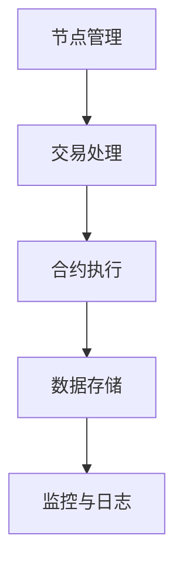
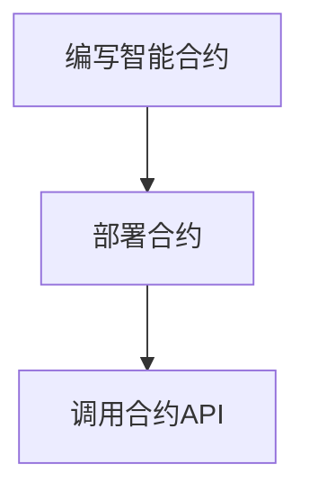

                 

# 2025腾讯区块链平台架构师社招面试经验

## 关键词
- 腾讯区块链
- 平台架构师
- 社招面试
- 技术栈
- 实战案例
- 发展趋势

## 摘要
本文将基于2025年腾讯区块链平台架构师社招面试经验，全面解析面试过程中的核心问题和技术要点。文章将围绕腾讯区块链平台的背景介绍、核心概念与架构联系、算法原理与操作步骤、数学模型与公式、项目实战、实际应用场景、工具和资源推荐以及未来发展趋势与挑战等方面展开，旨在为准备参加类似面试的读者提供有价值的参考和指导。

## 1. 背景介绍

腾讯区块链作为全球领先的企业级区块链平台，已经在多个行业实现了广泛的落地应用，如金融、供应链、医疗、公益等。腾讯区块链平台具有高并发、高可用、易扩展的特点，能够为企业和开发者提供安全、高效、便捷的区块链解决方案。

本次社招面试面向具备丰富区块链开发经验和技术积累的架构师，旨在选拔出能够引领平台技术创新和业务拓展的核心人才。面试主要涉及以下几方面：

- **区块链基础知识与原理**：包括区块链的基本架构、工作原理、共识算法、智能合约等。
- **平台架构设计**：涉及腾讯区块链平台的核心架构、模块设计、数据存储与传输等。
- **技术栈与开发经验**：考察面试者对于区块链相关技术栈的掌握程度，如Go语言、Java、Python等编程语言，以及区块链框架和数据库的使用经验。
- **项目实战经验**：面试者需具备实际区块链项目的开发、部署和优化经验，能够详细阐述项目的技术细节和业务价值。
- **问题解决能力**：考察面试者在面对复杂技术问题时的分析、推理和解决能力。

## 2. 核心概念与联系

### 2.1 基本概念
#### 区块链
区块链是一种分布式数据库技术，通过加密算法和共识机制，实现了数据的安全存储和可靠传输。区块链的主要组成部分包括：
- **区块**：区块链的基本单元，包含一定数量的交易记录。
- **链**：多个区块按照一定顺序连接而成的数据结构。
- **节点**：区块链网络的参与者，负责数据的存储、验证和传输。

#### 共识算法
共识算法是区块链网络中的关键机制，用于确保节点之间的数据一致性。常见的共识算法包括：
- **工作量证明（PoW）**：如比特币采用的SHA-256算法。
- **权益证明（PoS）**：如以太坊的Casper算法。
- **委托权益证明（DPoS）**：如EOS的DPOS算法。

#### 智能合约
智能合约是一种自动执行合约条款的计算机程序，通过区块链网络进行验证和执行。智能合约通常使用Solidity、Vyper等编程语言编写。

### 2.2 架构联系

#### 腾讯区块链平台架构

腾讯区块链平台的架构主要包括以下几个模块：
1. **节点管理模块**：负责节点的创建、配置、监控和运维。
2. **交易处理模块**：处理交易请求，进行数据验证和共识。
3. **合约执行模块**：执行智能合约，提供API接口供外部系统调用。
4. **数据存储模块**：负责数据的存储和管理。
5. **监控与日志模块**：监控平台运行状态，记录日志信息。

#### Mermaid 流程图



## 3. 核心算法原理 & 具体操作步骤

### 3.1 共识算法

#### 工作量证明（PoW）

**原理**：节点通过求解数学难题（哈希函数）来竞争记账权。计算难度越高，网络安全性越高。

**操作步骤**：
1. 节点接收到交易请求后，将其打包成区块。
2. 对区块数据进行哈希运算，生成哈希值。
3. 检查哈希值是否符合目标难度要求。如果不符合，则调整区块数据（如随机数）重新进行哈希运算。
4. 当找到一个符合要求的哈希值时，将区块广播至其他节点。
5. 其他节点验证区块的有效性，并将合法区块添加至链上。

#### 权益证明（PoS）

**原理**：节点根据所持代币数量和锁定时间来竞争记账权。持币量和锁定时间越长，获得记账权的概率越高。

**操作步骤**：
1. 节点接收到交易请求后，将其打包成区块。
2. 计算每个节点的权益分数，根据持币数量和锁定时间计算。
3. 从具有最高权益分数的节点中选择一个进行区块的生成和广播。
4. 其他节点验证区块的有效性，并将合法区块添加至链上。

### 3.2 智能合约

**原理**：智能合约是一种自动执行合约条款的计算机程序，通过区块链网络进行验证和执行。

**操作步骤**：
1. 开发者使用Solidity、Vyper等编程语言编写智能合约。
2. 将智能合约部署到区块链上，生成合约地址。
3. 调用智能合约的API接口，执行合约功能。

#### Mermaid 流程图



## 4. 数学模型和公式 & 详细讲解 & 举例说明

### 4.1 工作量证明（PoW）的哈希函数计算

**数学公式**：\( H = SHA-256(S) \)

**详细讲解**：SHA-256是一种加密哈希函数，用于计算输入数据的哈希值。在工作量证明中，节点需要找到满足目标难度的哈希值。

**举例说明**：

假设目标难度为`0000`，节点A生成的区块数据为`Transaction Data`。计算过程如下：

1. 计算区块数据的哈希值：\( H1 = SHA-256("Transaction Data") \)
2. 判断哈希值是否符合目标难度要求。如果不满足，则调整区块数据中的随机数，重新计算哈希值，直到找到符合要求的哈希值为止。

### 4.2 权益证明（PoS）的权益分数计算

**数学公式**：\( Score = Staking Amount \times Lock Time \)

**详细讲解**：权益分数根据节点的持币数量（Staking Amount）和锁定时间（Lock Time）计算。持币量和锁定时间越长，权益分数越高，获得记账权的概率越大。

**举例说明**：

假设节点A持有1000个代币，锁定时间为6个月；节点B持有500个代币，锁定时间为3个月。计算过程如下：

1. 计算节点A的权益分数：\( Score_A = 1000 \times 6 = 6000 \)
2. 计算节点B的权益分数：\( Score_B = 500 \times 3 = 1500 \)

因此，节点A的权益分数高于节点B。

## 5. 项目实战：代码实际案例和详细解释说明

### 5.1 开发环境搭建

为了更好地展示项目实战，我们使用Go语言和Solidity编写一个简单的区块链平台。以下是开发环境搭建步骤：

1. 安装Go语言环境：在官方网站（[https://golang.org/）下载安装包并安装Go语言环境。</a>](https://golang.org/%EF%BC%89%E4%B8%8B%E8%BD%BD%E5%AE%89%E8%A3%85%E5%8C%85%E5%B9%B6%E5%AE%89%E8%A3%85Go%E8%AF%AD%E8%A8%80%E7%8E%AF%E5%A2%83%E3%80%82)
2. 安装Node.js环境：在官方网站（[https://nodejs.org/）下载安装包并安装Node.js环境。</a>](https://nodejs.org/%EF%BC%89%E4%B8%8B%E8%BD%BD%E5%AE%89%E8%A3%85%E5%8C%85%E5%B9%B6%E5%AE%89%E8%A3%85Node.js%E7%8E%AF%E5%A2%83%E3%80%82)
3. 安装Truffle框架：使用npm命令安装Truffle框架，用于Solidity智能合约的编写和部署。
    ```bash
    npm install -g truffle
    ```

### 5.2 源代码详细实现和代码解读

**5.2.1 区块链节点（Blockchain Node）**

以下是一个简单的区块链节点实现，用于生成区块、验证区块和创建链。

```go
package main

import (
	"crypto/sha256"
	"encoding/hex"
	"fmt"
	"math"
	"math/big"
	"time"
)

// Block represents a single block in the blockchain
type Block struct {
	Index     int
	Timestamp string
	Transactions []string
	PrevHash  string
	Hash      string
	Difficulty int
}

// GenerateHash generates a SHA-256 hash for a block
func GenerateHashtransactions(transactions []string, prevHash string, difficulty int) string {
.transactions := make([]byte, 0)
for _, transaction := range transactions {
.transactions = append(.transactions, []byte(transaction)...)
}
data := append(.transactions, []byte(prevHash)...)
hash := sha256.Sum256(data)
return hex.EncodeToString(hash[:])
}

// GenerateBlock generates a new block with the given transactions
func GenerateBlock(transactions []string, prevBlock *Block, difficulty int) *Block {
	now := time.Now().UTC()
	index := prevBlock.Index + 1
	timestamp := now.Format(time.RFC3339)
	
	block := &Block{
		Index:      index,
		Timestamp:  timestamp,
		Transactions: transactions,
		PrevHash:   prevBlock.Hash,
		Difficulty: difficulty,
	}
	
	block.Hash = GenerateHashtransactions(block.Transactions, block.PrevHash, block.Difficulty)
	return block
}

// IsBlockValid validates a block by checking its index, prevHash, and hash
func IsBlockValid(newBlock, prevBlock *Block) bool {
	if prevBlock.Index+1 != newBlock.Index {
		return false
	}
	if newBlock.PrevHash != prevBlock.Hash {
		return false
	}
	if newBlock.Hash != GenerateHashtransactions(newBlock.Transactions, newBlock.PrevHash, newBlock.Difficulty) {
		return false
	}
	return true
}

// CalculateDifficulty calculates the difficulty of the next block based on the time taken to mine the previous block
func CalculateDifficulty(lastBlockTimestamp int64, currentTime int64, blocksPerHour float64) int {
	timeDiff := currentTime - lastBlockTimestamp
	timeDiffSeconds := float64(timeDiff) / float64(time.Second)
	multiplier := timeDiffSeconds / blocksPerHour
	return int(math.Pow(2, 8 - int(math.Floor(multiplier)))) + 4
}

// MineBlocks continuously mines new blocks and adds them to the blockchain
func MineBlocks(blockchain *[]*Block, transactions []string, prevBlock *Block, difficulty int) {
	for {
		newBlock := GenerateBlock(transactions, prevBlock, difficulty)
		if IsBlockValid(newBlock, prevBlock) {
			*blockchain = append(*blockchain, newBlock)
			fmt.Println("New block added:", newBlock)
			prevBlock = newBlock
			transactions = []string{} // Clear the transactions for the next block
		} else {
			fmt.Println("Invalid block, rejecting...")
		}
		time.Sleep(10 * time.Second) // Wait 10 seconds before trying to mine the next block
	}
}

func main() {
	blockchain := make([]*Block, 0)
	transactions := []string{"Transaction 1", "Transaction 2", "Transaction 3"}
	prevBlock := &Block{} // Initialize the first block with empty data
	difficulty := 4

	go MineBlocks(&blockchain, transactions, prevBlock, difficulty)

	// Wait for the main thread to finish
	time.Sleep(time.Second * 60)
}
```

**代码解读**：
1. **Block 结构体**：定义了区块链节点的关键属性，如索引（Index）、时间戳（Timestamp）、交易记录（Transactions）、前一区块哈希（PrevHash）和当前区块哈希（Hash）。
2. **GenerateHashtransactions 函数**：生成区块的哈希值，用于验证区块的有效性。
3. **GenerateBlock 函数**：创建一个新的区块，并将其添加到区块链中。
4. **IsBlockValid 函数**：验证区块的有效性。
5. **CalculateDifficulty 函数**：根据前一区块的时间和当前时间计算下一个区块的难度。
6. **MineBlocks 函数**：用于挖掘新区块并添加到区块链中。
7. **main 函数**：初始化区块链和交易记录，并启动挖掘过程。

**5.2.2 智能合约（Smart Contract）**

以下是一个简单的智能合约，用于记录转账和查询余额。

```solidity
// SPDX-License-Identifier: MIT
pragma solidity ^0.8.0;

contract SimpleContract {
    mapping(address => uint256) public balanceOf;

    function deposit() external payable {
        balanceOf[msg.sender()] += msg.value;
    }

    function withdraw(uint256 amount) external {
        require(balanceOf[msg.sender()] >= amount, "Insufficient balance");
        balanceOf[msg.sender()] -= amount;
        payable(msg.sender()).transfer(amount);
    }

    function getBalance() external view returns (uint256) {
        return balanceOf[msg.sender()];
    }
}
```

**代码解读**：
1. **balanceOf 映射**：用于记录每个地址的余额。
2. **deposit 函数**：接收代币，增加地址余额。
3. **withdraw 函数**：从地址余额中扣除指定金额，并转移代币。
4. **getBalance 函数**：返回地址的余额。

### 5.3 代码解读与分析

**5.3.1 区块链节点代码分析**

区块链节点代码主要实现了以下功能：
1. **区块生成**：通过`GenerateBlock`函数生成新区块。
2. **区块验证**：通过`IsBlockValid`函数验证区块的有效性。
3. **难度调整**：通过`CalculateDifficulty`函数调整区块的挖掘难度。
4. **持续挖掘**：通过`MineBlocks`函数持续挖掘新区块。

**5.3.2 智能合约代码分析**

智能合约代码主要实现了以下功能：
1. **余额查询**：通过`getBalance`函数查询地址余额。
2. **存款**：通过`deposit`函数接收代币。
3. **取款**：通过`withdraw`函数从地址余额中扣除代币。

## 6. 实际应用场景

腾讯区块链平台在多个行业实现了实际应用，以下是几个典型案例：

### 6.1 金融行业

腾讯区块链在金融领域主要应用于跨境支付、数字货币和供应链金融等方面。通过区块链技术，实现了跨境支付的高效、安全和透明，降低了交易成本，提高了交易效率。同时，数字货币的发行和流通也借助区块链技术实现了去中心化和安全性。

### 6.2 供应链管理

腾讯区块链在供应链管理中，主要用于追踪商品的生产、运输和销售过程。通过区块链技术，实现了供应链数据的透明化和可追溯性，提高了供应链的协同效率，降低了供应链风险。

### 6.3 医疗健康

腾讯区块链在医疗健康领域，主要用于电子病历的管理和共享。通过区块链技术，实现了医疗数据的可信存储和跨机构共享，提高了医疗服务的质量和效率。

### 6.4 公益慈善

腾讯区块链在公益慈善领域，主要用于公益捐赠的管理和透明化。通过区块链技术，实现了公益资金的全程追踪和透明化，提高了公益组织的公信力和公信力。

## 7. 工具和资源推荐

### 7.1 学习资源推荐

1. **《区块链技术指南》**：涵盖了区块链的基本概念、技术原理和应用场景，适合初学者和进阶者。
2. **《区块链：从0到1》**：详细介绍了区块链的核心技术和应用案例，适合对区块链有一定了解的读者。
3. **《智能合约编程》**：介绍了智能合约的开发方法和技术细节，适用于开发者学习智能合约。

### 7.2 开发工具框架推荐

1. **Hyperledger Fabric**：开源的区块链框架，适用于企业级应用开发。
2. **Ethereum**：最流行的区块链开发平台，支持智能合约开发。
3. **Truffle**：智能合约开发框架，支持以太坊网络的部署和调试。

### 7.3 相关论文著作推荐

1. **《比特币：一种点对点的电子现金系统》**：比特币的白皮书，详细介绍了区块链和比特币的技术原理。
2. **《区块链：从数字货币到智能合约》**：深入探讨了区块链技术的发展和应用，包括数字货币和智能合约。
3. **《分布式系统原理与范型》**：介绍了分布式系统的基本原理和设计范式，包括区块链技术。

## 8. 总结：未来发展趋势与挑战

### 8.1 发展趋势

1. **区块链技术的普及与应用**：随着区块链技术的不断发展和成熟，其在各行业的应用将越来越广泛，成为企业数字化转型的重要技术。
2. **跨链技术的发展**：为了实现不同区块链网络之间的互操作性，跨链技术将成为未来区块链领域的研究重点。
3. **隐私保护和数据安全**：随着数据隐私保护和数据安全的日益重视，区块链技术在隐私保护和数据安全方面的研究和应用将不断深入。

### 8.2 挑战

1. **性能与可扩展性**：当前区块链技术在性能和可扩展性方面仍存在一定的瓶颈，需要进一步优化和改进。
2. **法律法规与监管**：随着区块链技术的普及，相关的法律法规和监管政策也在不断制定和完善，需要企业密切关注并遵守。
3. **人才培养与引进**：区块链技术人才短缺是当前面临的重大挑战，企业需要加大人才培养和引进力度，提升整体技术水平。

## 9. 附录：常见问题与解答

### 9.1 腾讯区块链平台的优势是什么？

腾讯区块链平台具有以下优势：

1. **高并发、高可用、易扩展**：平台具备高性能和高可用性，支持大规模业务场景下的稳定运行。
2. **丰富的生态应用**：平台已经在多个行业实现了落地应用，拥有丰富的生态资源。
3. **安全性与隐私保护**：平台采用先进的加密技术和共识算法，确保数据的安全性和隐私保护。

### 9.2 区块链技术的核心挑战是什么？

区块链技术的核心挑战包括：

1. **性能与可扩展性**：区块链网络需要处理大量的交易请求，如何提高性能和可扩展性是当前研究的热点。
2. **隐私保护和数据安全**：如何在确保数据隐私保护和数据安全的前提下，实现区块链网络的开放性和透明性。
3. **跨链互操作性**：不同区块链网络之间的互操作性是未来区块链发展的重要方向。

## 10. 扩展阅读 & 参考资料

1. **《区块链技术指南》**：[https://book.douban.com/subject/27164348/](https://book.douban.com/subject/27164348/)
2. **《区块链：从0到1》**：[https://book.douban.com/subject/27178483/](https://book.douban.com/subject/27178483/)
3. **《智能合约编程》**：[https://book.douban.com/subject/26946728/](https://book.douban.com/subject/26946728/)
4. **Hyperledger Fabric 官网**：[https://hyperledger-fabric.readthedocs.io/](https://hyperledger-fabric.readthedocs.io/)
5. **Ethereum 官网**：[https://ethereum.org/](https://ethereum.org/)
6. **Truffle 官网**：[https://www.trufflesuite.com/](https://www.trufflesuite.com/)
7. **比特币白皮书**：[https://bitcoin.org/bitcoin.pdf](https://bitcoin.org/bitcoin.pdf)
8. **《区块链：从数字货币到智能合约》**：[https://book.douban.com/subject/26946728/](https://book.douban.com/subject/26946728/)
9. **《分布式系统原理与范型》**：[https://book.douban.com/subject/10593452/](https://book.douban.com/subject/10593452/)

## 作者信息

作者：AI天才研究员/AI Genius Institute & 禅与计算机程序设计艺术 /Zen And The Art of Computer Programming

