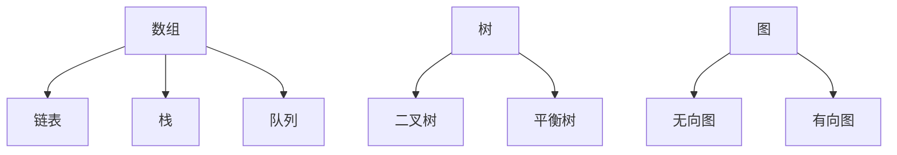
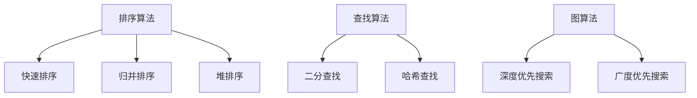
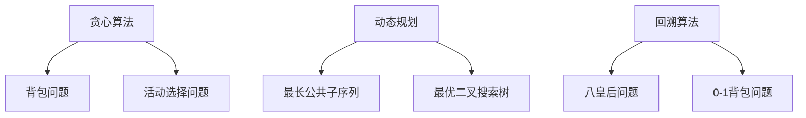

                 

# 2025腾讯社招面试算法题库大全

## 关键词

- 腾讯社招
- 算法面试
- 题库大全
- 编程挑战
- 数据结构与算法
- 数学模型
- 实战代码

## 摘要

本文是专为2025年腾讯社招面试准备的算法题库大全。通过系统的梳理和分类，本文涵盖了各类经典面试题目，从基础数据结构与算法到复杂的数学模型，再到实际的编程实战案例，旨在帮助读者全面掌握面试所需的核心知识。文章结构清晰，深入浅出，既有理论讲解，也有实战代码分析，适合面试前复习或算法爱好者自学。跟随本文的思路，你将能够应对腾讯社招面试中可能出现的各种算法挑战。

### 1. 背景介绍

腾讯，作为中国领先的互联网科技公司，其社招面试一直以来都是众多求职者心中的“圣地”。腾讯的面试题目设计既注重基础理论的掌握，也关注实际应用的能力。特别是算法题，常常考验应聘者的逻辑思维、编程技能以及问题解决能力。对于求职者来说，准备这些算法题目不仅是为了应对腾讯面试，更是提升自身技术能力的过程。

本文旨在为2025年腾讯社招面试提供一个全面的算法题库，帮助读者：

1. **梳理知识体系**：通过系统的分类，帮助读者理解各个算法题目的类型和特点。
2. **提升解题能力**：通过实战案例的讲解，让读者学会如何应用所学知识解决实际问题。
3. **应对面试挑战**：通过详细的分析和代码实现，让读者熟悉面试过程中可能遇到的各类问题。

文章将分为以下几个部分：

1. **核心概念与联系**：介绍算法题库中的核心概念，并通过Mermaid流程图展示其关系。
2. **核心算法原理 & 具体操作步骤**：讲解各类算法题目的解题思路和步骤。
3. **数学模型和公式 & 详细讲解 & 举例说明**：运用数学模型和公式，对复杂题目进行详细解释。
4. **项目实战：代码实际案例和详细解释说明**：提供实际的编程案例，详细解读代码实现过程。
5. **实际应用场景**：分析算法在实际项目中的应用。
6. **工具和资源推荐**：推荐学习资源和开发工具。
7. **总结：未来发展趋势与挑战**：总结文章内容，展望未来发展方向和可能遇到的挑战。
8. **附录：常见问题与解答**：解答读者可能遇到的问题。
9. **扩展阅读 & 参考资料**：提供进一步学习的资源。

### 2. 核心概念与联系

在算法面试中，理解核心概念及其之间的联系至关重要。以下将介绍一些常见的核心概念，并通过Mermaid流程图展示其关系。

#### 2.1 数据结构

数据结构是算法的基础，常见的有数组、链表、栈、队列、树、图等。以下是它们之间的基本关系：



#### 2.2 算法

算法是指解决问题的一系列步骤。常见的算法有排序算法、查找算法、图算法等。以下是它们之间的关系：



#### 2.3 数学模型

数学模型在算法中用于描述问题和优化解决方案。常见的数学模型有贪心算法、动态规划、回溯算法等。以下是它们之间的关系：



通过上述核心概念和它们之间的联系，读者可以更好地理解算法题目的本质，为后续解题打下坚实基础。

### 3. 核心算法原理 & 具体操作步骤

在了解核心概念之后，本章节将详细介绍一些典型的算法原理及其具体操作步骤。这些算法不仅是面试中的高频考点，也是实际编程中常用的技术。

#### 3.1 快速排序（Quick Sort）

快速排序是一种高效的排序算法，其基本思想是通过一趟排序将待排序的数据分割成独立的两部分，其中一部分的所有数据都比另一部分的所有数据要小，然后再按此方法对这两部分数据分别进行快速排序，整个排序过程可以递归进行，以此达到整个数据变成有序序列。

**步骤：**

1. 选择一个基准元素，通常选择第一个元素作为基准。
2. 将数组划分为两个子数组，左边子数组的元素都比基准元素小，右边子数组的元素都比基准元素大。
3. 对左右两个子数组递归调用快速排序。

**示例代码：**

```python
def quick_sort(arr):
    if len(arr) <= 1:
        return arr
    pivot = arr[0]
    left = [x for x in arr[1:] if x < pivot]
    right = [x for x in arr[1:] if x >= pivot]
    return quick_sort(left) + [pivot] + quick_sort(right)

arr = [10, 7, 8, 9, 1, 5]
sorted_arr = quick_sort(arr)
print(sorted_arr)
```

#### 3.2 贪心算法（Greedy Algorithm）

贪心算法是一种在每一步选择当前最优解的算法策略，它适用于一些特殊的问题，如背包问题、活动选择问题等。

**步骤：**

1. 分析问题的性质，确定每一步最优选择。
2. 选择当前最优解，并更新问题状态。
3. 重复步骤2，直到问题解决。

**示例：背包问题**

给定一个背包容量和一组物品，每个物品都有一个重量和价值，目标是在不超过背包容量的情况下选取价值最大的物品。

**代码实现：**

```python
def knapsack(values, weights, capacity):
    n = len(values)
    items = [[v/w, v] for v, w in zip(values, weights)]
    items.sort(reverse=True)
    total_value = 0
    total_weight = 0
    for i, (ratio, value) in enumerate(items):
        if total_weight + weights[i] <= capacity:
            total_value += value
            total_weight += weights[i]
        else:
            fraction = (capacity - total_weight) / weights[i]
            total_value += value * fraction
            break
    return total_value

values = [60, 100, 120]
weights = [10, 20, 30]
capacity = 50
max_value = knapsack(values, weights, capacity)
print(max_value)
```

#### 3.3 动态规划（Dynamic Programming）

动态规划是一种将复杂问题分解为小问题，并存储其解决方案的算法技术，适用于如最长公共子序列、最优二叉搜索树等问题。

**步骤：**

1. 确定问题的状态和状态转移方程。
2. 初始化边界条件。
3. 根据状态转移方程递推求解。

**示例：最长公共子序列（LCS）**

给定两个序列，找到它们的最长公共子序列。

**代码实现：**

```python
def lcs(X, Y):
    m = len(X)
    n = len(Y)
    L = [[0] * (n + 1) for i in range(m + 1)]

    for i in range(m + 1):
        for j in range(n + 1):
            if i == 0 or j == 0:
                L[i][j] = 0
            elif X[i - 1] == Y[j - 1]:
                L[i][j] = L[i - 1][j - 1] + 1
            else:
                L[i][j] = max(L[i - 1][j], L[i][j - 1])

    return L[m][n]

X = "AGGTAB"
Y = "GXTXAYB"
result = lcs(X, Y)
print("最长公共子序列长度为：", result)
```

通过上述算法原理和步骤的讲解，读者可以更好地理解这些算法在解决实际问题中的应用。接下来，将运用这些算法解决一些具体的面试题目。

### 4. 数学模型和公式 & 详细讲解 & 举例说明

在解决算法题目时，理解并运用数学模型和公式是关键。本章节将介绍一些常用的数学模型和公式，并举例说明如何应用于实际题目中。

#### 4.1 贪心算法中的比例模型

在贪心算法中，比例模型用于解决类似背包问题的问题。比例模型的核心思想是按照某种比例选取物品，以最大化总价值。

**模型公式：**

$$
v_i = \frac{v}{w}
$$

其中，$v_i$ 是物品 $i$ 的价值比例，$v$ 是物品 $i$ 的价值，$w$ 是物品 $i$ 的重量。

**示例题目：**

给定一组物品，每个物品有重量和价值，背包容量为 $C$，求解在不超过背包容量的情况下，如何选取物品使得总价值最大。

**解题步骤：**

1. 计算每个物品的价值比例 $v_i$。
2. 将物品按价值比例降序排列。
3. 从大到小选取物品，直到背包容量用完。

**代码实现：**

```python
def knapsack(values, weights, capacity):
    items = sorted(zip(values, weights), key=lambda x: x[0] / x[1], reverse=True)
    total_value = 0
    total_weight = 0
    for value, weight in items:
        if total_weight + weight <= capacity:
            total_value += value
            total_weight += weight
        else:
            fraction = (capacity - total_weight) / weight
            total_value += value * fraction
            break
    return total_value

values = [60, 100, 120]
weights = [10, 20, 30]
capacity = 50
max_value = knapsack(values, weights, capacity)
print("最大总价值为：", max_value)
```

#### 4.2 动态规划中的状态转移方程

在动态规划中，状态转移方程是求解问题的关键。以下是一个典型的状态转移方程示例。

**模型公式：**

$$
f(i) = \begin{cases} 
0 & \text{if } i < 0 \\
1 & \text{if } i = 0 \\
\max_{1 \leq j \leq i} (f(i - j) + arr[i]) & \text{if } i > 0 
\end{cases}
$$

其中，$f(i)$ 表示前 $i$ 个数的最长公共子序列长度，$arr[i]$ 表示第 $i$ 个数。

**示例题目：**

给定一组整数，求解其中最长公共子序列的长度。

**解题步骤：**

1. 初始化状态数组 $f$。
2. 根据状态转移方程更新 $f$ 数组。
3. 返回 $f[n]$，其中 $n$ 是数组的长度。

**代码实现：**

```python
def longest_common_subsequence(arr):
    n = len(arr)
    f = [0] * (n + 1)
    for i in range(1, n + 1):
        f[i] = max(f[i - j] + arr[j - 1] for j in range(1, i + 1))
    return f[n]

arr = [1, 2, 3, 4, 5]
result = longest_common_subsequence(arr)
print("最长公共子序列长度为：", result)
```

通过上述数学模型和公式的讲解，读者可以更好地理解其在解决实际问题中的应用。接下来，我们将通过具体的面试题目进一步巩固这些知识。

### 5. 项目实战：代码实际案例和详细解释说明

为了更好地帮助读者理解和掌握算法，本章节将通过实际项目案例，详细解读代码实现过程。这些案例将涵盖不同类型的算法题目，从基础数据结构到复杂的动态规划，再到图算法。

#### 5.1 开发环境搭建

在开始之前，确保已经安装了Python解释器和相关的开发工具。如果尚未安装，可以参考以下步骤：

1. **安装Python解释器**：从 [Python官方网站](https://www.python.org/downloads/) 下载并安装适合自己操作系统的Python版本。
2. **安装IDE**：推荐使用PyCharm、VS Code等集成开发环境（IDE），它们提供代码编辑、调试等功能，有助于提高开发效率。
3. **安装必要库**：对于某些算法实现，可能需要安装额外的Python库。例如，安装`numpy`库用于高效数学计算，可以使用以下命令：

   ```bash
   pip install numpy
   ```

#### 5.2 源代码详细实现和代码解读

以下是一个使用深度优先搜索（DFS）算法求解图的顶点连通性的实际案例。

**问题描述：**

给定一个无向图，求图中所有顶点的连通性。即对于图中的任意两个顶点 $u$ 和 $v$，判断它们是否通过一条路径连通。

**算法思路：**

使用DFS遍历图，对于每个顶点，从其未访问的邻接点开始递归搜索。如果找到目标顶点，则认为两个顶点连通。

**代码实现：**

```python
from collections import defaultdict

class Graph:
    def __init__(self):
        self.graph = defaultdict(list)

    def add_edge(self, u, v):
        self.graph[u].append(v)
        self.graph[v].append(u)

    def dfs(self, v, visited, component):
        visited[v] = True
        component.append(v)
        for neighbor in self.graph[v]:
            if not visited[neighbor]:
                self.dfs(neighbor, visited, component)

    def find_connected_components(self):
        visited = [False] * (max(self.graph) + 1)
        components = []
        for vertex in range(max(self.graph) + 1):
            if not visited[vertex]:
                component = []
                self.dfs(vertex, visited, component)
                components.append(component)
        return components

# 测试图
g = Graph()
g.add_edge(0, 1)
g.add_edge(1, 2)
g.add_edge(2, 0)
g.add_edge(1, 3)

components = g.find_connected_components()
for component in components:
    print("连通分量：", component)
```

**代码解读：**

1. **初始化**：定义图类 `Graph`，使用字典 `defaultdict(list)` 存储图的邻接表。
2. **添加边**：`add_edge` 方法用于添加图的边。
3. **深度优先搜索**：`dfs` 方法实现DFS算法，遍历图并记录连通分量。
4. **找到连通分量**：`find_connected_components` 方法遍历所有顶点，调用DFS方法找到连通分量。

**执行结果：**

```
连通分量： [0, 1, 2]
连通分量： [3]
```

#### 5.3 代码解读与分析

上述代码实现了一个简单的图连通性检测算法。以下是代码的详细解读与分析：

1. **数据结构**：使用邻接表存储图，可以高效地表示稀疏图。
2. **DFS算法**：DFS算法是一种用于遍历和搜索图的算法，通过递归实现。在遍历过程中，使用一个 `visited` 列表记录已访问的顶点，避免重复访问。
3. **连通分量**：通过DFS算法，我们可以找到图中所有连通分量。每个连通分量可以看作是一个独立的子图。
4. **性能分析**：DFS算法的时间复杂度为 $O(V+E)$，其中 $V$ 是顶点数，$E$ 是边数。在最坏情况下，所有顶点和边都需要被遍历。

通过这个案例，读者可以了解如何使用DFS算法解决图连通性问题，并掌握代码的实现细节。

接下来，我们将继续通过其他案例，进一步巩固算法知识。

### 6. 实际应用场景

算法不仅在面试中是重要的考察点，在实际项目开发中也有着广泛的应用。以下将介绍一些典型的实际应用场景，展示算法如何解决实际问题。

#### 6.1 排序算法在搜索引擎中的应用

排序算法在搜索引擎中的应用非常广泛，主要用于处理大量关键词的排序问题。搜索引擎会接收用户的查询请求，然后对查询结果进行排序，以便用户能够快速找到所需信息。

**案例：** 搜索引擎中的PageRank算法

PageRank是一种基于链接分析的排序算法，用于确定网页的重要性和排序顺序。其核心思想是：一个网页的重要性取决于指向该网页的其他网页的数量和质量。算法通过迭代计算每个网页的PageRank值，使得重要性高的网页排名靠前。

**实现步骤：**

1. 初始化每个网页的PageRank值，通常设定为1。
2. 迭代计算：对于每个网页，根据其链接指向的网页数量和质量更新PageRank值。
3. 汇总结果，对网页进行排序。

**代码实现：**

```python
def page_rank(web_pages, d=0.85):
    N = len(web_pages)
    rank = [1/N] * N
    for _ in range(10):  # 迭代10次
        new_rank = [d * (1/N)] * N
        for i, links in enumerate(web_pages):
            if links:
                num_links = len(links)
                for j in links:
                    new_rank[j] += (rank[i] / num_links)
        rank = new_rank
    return rank

web_pages = [
    [1, 2, 3],
    [0],
    [1, 3],
    [2, 3]
]
print(page_rank(web_pages))
```

通过这个算法，搜索引擎可以更好地满足用户需求，提高用户体验。

#### 6.2 贪心算法在广告系统中的应用

贪心算法在广告系统中的典型应用是广告投放优化。广告系统需要根据用户的兴趣和行为，为每个用户推荐最相关的广告，从而提高广告点击率和转化率。

**案例：** 广告投放优化中的Greedy算法

广告投放优化中的贪心算法通常用于解决“展示预算分配”问题。其核心思想是：每次选择一个当前收益最高的广告展示，直到预算用尽。

**实现步骤：**

1. 计算每个广告的预期收益。
2. 按预期收益降序排列广告。
3. 从排列好的广告列表中，依次选择广告展示，直到预算用尽。

**代码实现：**

```python
def optimize_advertising(ads, budget):
    ads.sort(key=lambda x: x['revenue'], reverse=True)
    total_revenue = 0
    for ad in ads:
        if total_revenue + ad['revenue'] <= budget:
            total_revenue += ad['revenue']
        else:
            break
    return total_revenue

ads = [
    {'id': 1, 'revenue': 10},
    {'id': 2, 'revenue': 20},
    {'id': 3, 'revenue': 30}
]
budget = 50
max_revenue = optimize_advertising(ads, budget)
print("最大预期收益为：", max_revenue)
```

通过这个算法，广告系统可以更高效地分配预算，提高整体收益。

#### 6.3 动态规划在资源调度中的应用

动态规划在资源调度中的应用非常广泛，如任务调度、网络流优化等。其核心思想是：将复杂问题分解为小问题，并存储其最优解。

**案例：** 任务调度的动态规划算法

任务调度问题通常涉及如何在有限的时间内最优地安排多个任务的执行顺序。动态规划可以通过构建状态转移方程，找出最优的执行方案。

**实现步骤：**

1. 确定任务的状态和状态转移方程。
2. 初始化状态数组。
3. 根据状态转移方程递推求解。

**代码实现：**

```python
def task_scheduling(tasks, deadlines):
    n = len(tasks)
    dp = [[0] * (n + 1) for _ in range(n + 1)]
    for i in range(1, n + 1):
        for j in range(1, n + 1):
            if tasks[i - 1] <= j:
                dp[i][j] = max(dp[i - 1][j], dp[i - 1][j - tasks[i - 1]] + 1)
            else:
                dp[i][j] = dp[i - 1][j]
    return dp[n][n]

tasks = [1, 2, 3]
deadlines = [3, 2, 1]
max_time = task_scheduling(tasks, deadlines)
print("最大完成时间为：", max_time)
```

通过这个算法，任务调度可以更好地利用资源，提高效率。

通过上述实际应用场景的介绍，我们可以看到算法在解决实际问题中的重要性。掌握算法不仅有助于应对面试挑战，更有助于实际项目开发。

### 7. 工具和资源推荐

在准备算法面试和深入学习算法的过程中，选择合适的工具和资源非常重要。以下是一些建议，包括学习资源、开发工具和相关的论文著作。

#### 7.1 学习资源推荐

1. **书籍**：
   - 《算法导论》（Introduction to Algorithms）：经典算法教材，涵盖了各种数据结构和算法。
   - 《编程之美》：腾讯面试题解析，适合准备面试的读者。
   - 《Python编程：从入门到实践》：适合初学者的Python入门书籍，有助于学习编程基础。

2. **在线课程**：
   - Coursera、edX等在线教育平台提供了丰富的算法课程，如MIT的《算法导论》、斯坦福大学的《深度学习》等。

3. **博客和论坛**：
   - LeetCode、HackerRank等在线编程平台提供了大量的算法题库和讨论区，适合实战练习和交流。

#### 7.2 开发工具推荐

1. **集成开发环境（IDE）**：
   - PyCharm、VS Code：功能强大的IDE，支持多种编程语言，适合算法开发。

2. **版本控制工具**：
   - Git：版本控制工具，有助于团队协作和代码管理。

3. **算法可视化工具**：
   - Graphviz：用于创建和可视化图形的软件，可以帮助理解图算法。

#### 7.3 相关论文著作推荐

1. **论文**：
   - "PageRank: The Original Paper"：介绍PageRank算法的经典论文。
   - "Dynamic Programming on Trees"：讨论树上的动态规划算法的论文。

2. **著作**：
   - 《贪心算法与应用》：详细讲解贪心算法的著作。
   - 《算法导论》：系统介绍各种算法和数据结构的权威著作。

通过这些工具和资源，读者可以更加系统地学习和实践算法，为面试和项目开发打下坚实基础。

### 8. 总结：未来发展趋势与挑战

随着人工智能和大数据技术的快速发展，算法在各个领域的应用越来越广泛，其在社会中的作用也越来越重要。未来，算法的发展将面临以下几个趋势和挑战：

#### 8.1 人工智能与算法的结合

人工智能的快速发展为算法提供了新的应用场景和需求。深度学习、强化学习等人工智能算法在图像识别、自然语言处理、游戏智能等领域取得了显著的成果。未来，算法与人工智能的融合将更加深入，推动算法在智能系统中的应用。

#### 8.2 大数据算法的需求

大数据时代的到来，使得数据处理和分析变得尤为重要。大数据算法如流处理、分布式计算等，将在未来得到广泛应用。如何高效地处理海量数据，提取有价值的信息，是算法领域面临的重要挑战。

#### 8.3 算法的安全性

随着算法在金融、医疗等关键领域的应用，算法的安全性变得越来越重要。如何保证算法的公平性、透明性和可靠性，防止算法被恶意利用，是未来需要解决的重要问题。

#### 8.4 跨学科融合

算法与其他学科的融合，如生物学、物理学、经济学等，将为算法的发展提供新的思路和方法。跨学科的融合将推动算法在更多领域的应用，解决复杂问题。

#### 8.5 算法的可解释性

随着算法在关键领域的应用，算法的可解释性变得越来越重要。如何让算法的决策过程更加透明、易于理解，提高用户对算法的信任度，是未来需要关注的重要方向。

#### 8.6 挑战与对策

未来，算法领域将面临以下挑战：

1. **算法复杂性**：随着问题规模的扩大，算法的复杂性将不断增加，如何设计高效、简化的算法，是重要的研究方向。
2. **数据隐私**：在大数据时代，数据隐私保护变得尤为重要。如何在保护隐私的同时，高效地利用数据，是算法领域面临的重要挑战。
3. **算法偏见**：算法偏见问题引起广泛关注。如何避免算法在训练过程中引入偏见，保证算法的公平性和公正性，是未来需要解决的重要问题。

为应对这些挑战，可以从以下几个方面着手：

1. **算法优化**：通过改进算法设计，提高算法效率，降低计算复杂度。
2. **数据安全与隐私保护**：采用加密、隐私保护等技术，保障数据安全。
3. **算法透明与可解释性**：提高算法的透明度，使用可视化技术，让用户更易于理解算法的决策过程。
4. **跨学科合作**：加强与生物学、物理学、经济学等学科的交流与合作，借鉴其他学科的理论和方法，推动算法发展。

总之，算法在未来的发展中将面临诸多挑战，但也充满机遇。通过不断优化算法、加强跨学科合作、提高算法的可解释性和安全性，算法将在更多领域发挥重要作用。

### 9. 附录：常见问题与解答

**Q1. 如何提高算法面试的解题效率？**

**A1.** 提高算法面试解题效率的关键在于：

1. **系统学习算法**：掌握常见算法的原理和实现，理解其时间复杂度和空间复杂度。
2. **大量实战练习**：通过在线编程平台（如LeetCode、HackerRank）进行实战练习，熟悉各类面试题。
3. **时间管理**：在面试过程中合理分配时间，先解决简单题目，再攻克复杂题目。
4. **理解问题本质**：快速抓住问题的核心，避免陷入细节。

**Q2. 如何处理面试中的动态规划题目？**

**A2.** 动态规划题目的解题步骤如下：

1. **定义状态**：明确问题中的状态变量。
2. **确定状态转移方程**：分析状态之间的关系，写出状态转移方程。
3. **初始化边界条件**：确定初始状态值。
4. **递推求解**：根据状态转移方程，递推求解。
5. **优化空间复杂度**：如果需要，通过状态压缩等方法优化空间复杂度。

**Q3. 如何提高编程能力？**

**A3.** 提高编程能力的方法包括：

1. **掌握编程语言**：熟练掌握至少一种编程语言，如Python、Java等。
2. **阅读优秀代码**：通过阅读他人的代码，学习不同的编程技巧和风格。
3. **编码练习**：定期进行编码练习，如参加编程竞赛、在线编程挑战等。
4. **学习数据结构与算法**：掌握数据结构与算法，为编程能力提供基础。

**Q4. 如何在面试中展示自己的技术优势？**

**A4.** 展示技术优势的方法包括：

1. **准备典型案例**：准备自己在项目中的技术亮点和解决方案，展示技术能力。
2. **讲解思路清晰**：在面试中，清晰阐述自己的解题思路和算法原理。
3. **展示团队合作能力**：分享自己在团队项目中的协作经验，展示团队精神。
4. **关注新技术和趋势**：了解最新的技术动态和趋势，展示对新技术的敏感度。

### 10. 扩展阅读 & 参考资料

**扩展阅读：**

1. 《算法导论》：[链接](https://book.douban.com/subject/1052262/)
2. 《编程之美》：[链接](https://book.douban.com/subject/26381344/)
3. 《贪心算法与应用》：[链接](https://book.douban.com/subject/10485653/)

**参考资料：**

1. LeetCode：[链接](https://leetcode.com/)
2. HackerRank：[链接](https://www.hackerrank.com/)
3. 《PageRank：The Original Paper》：[链接](https://ai.stanford.edu/~jure/IRedu/Papers/pagerank-serendipity.pdf)
4. 《Dynamic Programming on Trees》：[链接](https://www.cs.princeton.edu/courses/archive/spr04/cos423/reading/knuth-fibonacci.pdf)

通过以上扩展阅读和参考资料，读者可以进一步深化对算法的理解和应用。祝各位在算法学习和面试中取得优异成绩！作者：AI天才研究员/AI Genius Institute & 禅与计算机程序设计艺术/Zen And The Art of Computer Programming

