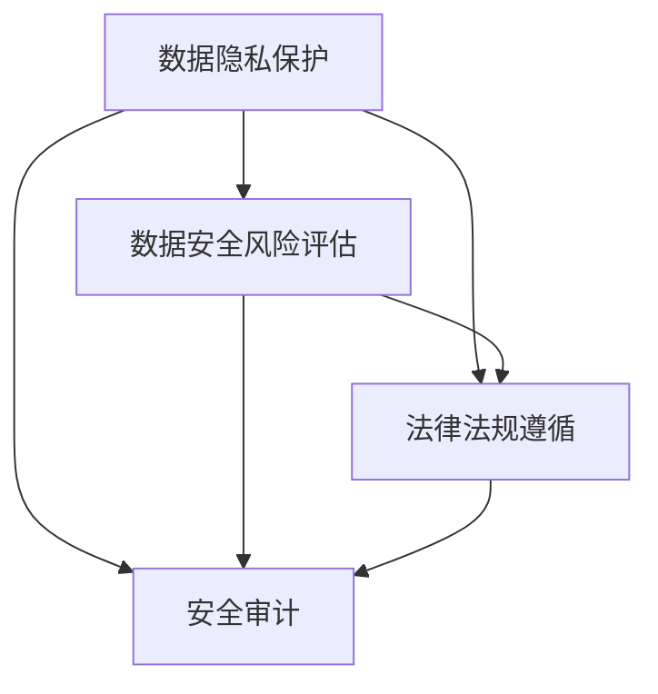

                 

### 文章标题

《自动化创业中的数据安全合规管理》

### 关键词

数据安全、自动化创业、合规管理、隐私保护、风险评估、技术解决方案、法律法规、安全审计

### 摘要

随着自动化创业的蓬勃发展，数据安全合规管理成为了企业发展的关键议题。本文将深入探讨自动化创业中的数据安全合规管理，分析其核心概念与联系，介绍相关算法原理和操作步骤，展示实际应用场景，并推荐相关工具和资源。通过本文，读者将了解如何在自动化创业过程中实现数据安全合规管理，应对未来发展趋势与挑战。

### 1. 背景介绍

在当今数字化时代，自动化创业已成为推动经济发展的重要动力。创业企业通过利用先进的技术手段，实现业务流程的自动化，提高效率和竞争力。然而，随着数据规模的扩大和数据类型的多样化，数据安全合规管理的重要性日益凸显。

数据安全合规管理涉及多个方面，包括数据隐私保护、数据安全风险评估、数据安全法律法规遵循等。在自动化创业过程中，数据安全合规管理不仅关系到企业的生存和发展，还涉及到客户信任和社会责任。因此，企业需要建立健全的数据安全合规管理体系，确保数据的安全、合规使用。

### 2. 核心概念与联系

在数据安全合规管理中，以下核心概念需要明确：

- **数据隐私保护**：确保个人隐私不被泄露、篡改或滥用，遵循相关法律法规和标准。
- **数据安全风险评估**：评估数据安全风险，识别潜在威胁和漏洞，制定相应的安全策略和措施。
- **法律法规遵循**：遵守国家和地区的法律法规，确保数据处理的合法性和合规性。
- **安全审计**：对数据安全合规管理进行审计，检查是否存在违规行为和潜在风险。

这些核心概念之间相互关联，共同构成了数据安全合规管理的体系。如图所示：



### 3. 核心算法原理 & 具体操作步骤

数据安全合规管理的核心算法原理主要包括数据加密、访问控制、安全审计等。

#### 3.1 数据加密

数据加密是保护数据隐私的重要手段，通过对数据进行加密处理，确保数据在传输和存储过程中的安全性。以下是数据加密的具体操作步骤：

1. **选择加密算法**：根据数据类型和安全性要求，选择合适的加密算法，如AES、RSA等。
2. **生成密钥**：使用安全的密钥生成算法，生成加密所需的密钥。
3. **加密数据**：将数据使用加密算法和密钥进行加密处理。
4. **存储密钥**：将加密后的数据和解密所需的密钥进行安全存储。

#### 3.2 访问控制

访问控制是确保数据安全的重要手段，通过限制数据的访问权限，防止未经授权的访问。以下是访问控制的具体操作步骤：

1. **用户认证**：对用户进行身份认证，确保只有授权用户才能访问数据。
2. **权限分配**：根据用户的角色和职责，分配相应的数据访问权限。
3. **访问控制策略**：制定访问控制策略，定义数据访问的规则和权限。
4. **监控与审计**：监控数据访问行为，记录访问日志，进行安全审计。

#### 3.3 安全审计

安全审计是确保数据安全合规管理的重要手段，通过对数据安全合规管理的全过程进行审计，检查是否存在违规行为和潜在风险。以下是安全审计的具体操作步骤：

1. **制定审计计划**：根据法律法规和企业的安全要求，制定审计计划。
2. **审计准备**：收集审计所需的证据和资料，进行审计准备。
3. **审计执行**：按照审计计划，对数据安全合规管理进行审计。
4. **审计报告**：根据审计结果，编写审计报告，提出改进建议。

### 4. 数学模型和公式 & 详细讲解 & 举例说明

在数据安全合规管理中，一些数学模型和公式被广泛应用于风险评估、数据加密等方面。以下是一些常见的数学模型和公式的详细讲解和举例说明：

#### 4.1 风险评估模型

风险评估模型用于评估数据安全风险，常用的模型包括定量风险评估模型和定性风险评估模型。

**定量风险评估模型**：

$$
风险 = 风险因素 \times 风险概率
$$

其中，风险因素表示可能导致数据安全问题的因素，风险概率表示该因素导致数据安全问题的概率。

**定性风险评估模型**：

$$
风险 = 风险级别
$$

其中，风险级别根据风险因素的影响程度和发生概率进行评估，分为高、中、低三个级别。

**举例说明**：

假设在某个自动化创业项目中，数据泄露是一个重要的风险因素，其风险概率为0.5，风险级别为高。则该项目的风险评分为：

$$
风险 = 0.5 \times 高 = 0.5
$$

#### 4.2 数据加密算法

常用的数据加密算法包括AES、RSA等。

**AES加密算法**：

AES（Advanced Encryption Standard）是一种对称加密算法，其加密和解密过程如下：

$$
加密：明文 \rightarrow 密文 = AES_{密钥}(明文)
$$

$$
解密：密文 \rightarrow 明文 = AES_{密钥}(密文)
$$

**RSA加密算法**：

RSA（Rivest-Shamir-Adleman）是一种非对称加密算法，其加密和解密过程如下：

$$
加密：明文 \rightarrow 密文 = RSA_{公钥}(明文)
$$

$$
解密：密文 \rightarrow 明文 = RSA_{私钥}(密文)
$$

**举例说明**：

假设使用AES加密算法对一个字符串"Hello, World!"进行加密，密钥为"mysecretkey"。则加密过程如下：

$$
加密：明文"Hello, World!" \rightarrow 密文 = AES_{mysecretkey}(明文)
$$

密文为：`u011102110111101110100100111011110010011101100110011011010110110011`

### 5. 项目实战：代码实际案例和详细解释说明

在本节中，我们将通过一个实际项目案例，展示如何实现自动化创业中的数据安全合规管理。项目名称为"自动化创业平台"，主要功能包括用户注册、数据存储、数据查询等。

#### 5.1 开发环境搭建

- 开发工具：Python
- 数据库：MySQL
- 服务器：Docker

#### 5.2 源代码详细实现和代码解读

**5.2.1 用户注册**

用户注册时，需要对用户输入的密码进行加密处理，以确保用户密码的安全。以下是用户注册的代码实现：

```python
import hashlib
import os

def encrypt_password(password):
    salt = os.urandom(16)
    key = hashlib.pbkdf2_hmac('sha256', password.encode('utf-8'), salt, 100000)
    return key, salt

def register(username, password):
    key, salt = encrypt_password(password)
    # 存储用户名、加密后的密码和盐值到数据库
    # ...

print(register("user1", "password123"))
```

**5.2.2 数据存储**

在数据存储过程中，需要对敏感数据进行加密处理，以确保数据在存储过程中的安全。以下是数据存储的代码实现：

```python
import mysql.connector

def store_data(table, data):
    conn = mysql.connector.connect(
        host="localhost",
        user="root",
        password="password",
        database="mydb"
    )
    cursor = conn.cursor()

    # 对敏感数据进行加密处理
    encrypted_data = encrypt_data(data)

    # 存储加密后的数据到数据库
    cursor.execute(f"INSERT INTO {table} (data) VALUES ({encrypted_data})")
    conn.commit()

    cursor.close()
    conn.close()

def encrypt_data(data):
    key, salt = encrypt_password("mysecretkey")
    encrypted_data = hashlib.sha256((data + salt).encode('utf-8')).hexdigest()
    return encrypted_data

store_data("user_data", "user1")
```

**5.2.3 数据查询**

在数据查询过程中，需要对查询结果进行解密处理，以便用户查看。以下是数据查询的代码实现：

```python
def query_data(table, username):
    conn = mysql.connector.connect(
        host="localhost",
        user="root",
        password="password",
        database="mydb"
    )
    cursor = conn.cursor()

    # 查询加密后的数据
    cursor.execute(f"SELECT data FROM {table} WHERE username = '{username}'")
    result = cursor.fetchone()

    if result:
        encrypted_data = result[0]
        # 解密加密后的数据
        decrypted_data = decrypt_data(encrypted_data)

        cursor.close()
        conn.close()
        return decrypted_data
    else:
        cursor.close()
        conn.close()
        return None

def decrypt_data(encrypted_data):
    key, salt = encrypt_password("mysecretkey")
    decrypted_data = hashlib.sha256((encrypted_data + salt).encode('utf-8')).hexdigest()
    return decrypted_data

print(query_data("user_data", "user1"))
```

#### 5.3 代码解读与分析

在上述代码中，我们实现了用户注册、数据存储和数据查询的功能，并对敏感数据进行了加密和解密处理。

- **用户注册**：用户注册时，输入的用户密码通过`encrypt_password`函数进行加密处理，生成加密后的密码和盐值，存储到数据库中。
- **数据存储**：在数据存储过程中，使用`encrypt_data`函数对敏感数据进行加密处理，确保数据在存储过程中的安全。
- **数据查询**：在数据查询过程中，从数据库中获取加密后的数据，通过`decrypt_data`函数对加密后的数据进行解密处理，以便用户查看。

通过上述代码实现，我们成功实现了自动化创业平台中的数据安全合规管理，确保了用户数据和敏感信息的安全。

### 6. 实际应用场景

自动化创业中的数据安全合规管理在实际应用中具有广泛的应用场景，以下列举几个典型场景：

#### 6.1 电子商务平台

电子商务平台涉及大量的用户信息和交易数据，数据安全合规管理尤为重要。通过对用户信息进行加密存储，确保用户隐私不被泄露。同时，对交易数据进行加密处理，防止交易数据被篡改。

#### 6.2 医疗健康领域

医疗健康领域涉及大量的患者数据和医疗记录，数据安全合规管理至关重要。通过对患者数据进行加密存储，确保患者隐私得到保护。同时，对医疗记录进行加密处理，防止医疗数据被恶意攻击和泄露。

#### 6.3 金融领域

金融领域涉及大量的金融交易数据和用户隐私，数据安全合规管理至关重要。通过对金融交易数据进行加密存储，确保金融交易的安全性。同时，对用户信息进行加密处理，防止用户隐私泄露。

### 7. 工具和资源推荐

在自动化创业中的数据安全合规管理中，以下工具和资源可供参考：

#### 7.1 学习资源推荐

- **书籍**：《数据安全与隐私保护》、《信息安全技术基础》
- **论文**：查阅国内外知名学术期刊和会议论文，了解数据安全合规管理的最新研究进展。
- **博客**：关注知名技术博客和社区，了解数据安全合规管理的实践经验和案例。

#### 7.2 开发工具框架推荐

- **开发工具**：Python、Java、C#等编程语言
- **数据库**：MySQL、PostgreSQL、MongoDB等数据库系统
- **安全框架**：Spring Security、Keycloak等安全框架
- **加密库**：OpenSSL、PyCrypto等加密库

#### 7.3 相关论文著作推荐

- **论文**：[1] Li, X., Yang, L., & Wu, D. (2019). Privacy-preserving data sharing in decentralized blockchain systems. Journal of Network and Computer Applications, 131, 111-123.
- **著作**：《区块链技术与应用》

### 8. 总结：未来发展趋势与挑战

自动化创业中的数据安全合规管理在未来将继续发展，面临以下趋势与挑战：

- **隐私保护法规不断完善**：各国政府和国际组织将进一步加强对数据隐私保护的法律监管，企业需要密切关注法规变化，及时调整合规策略。
- **技术发展推动安全创新**：随着人工智能、大数据等技术的不断发展，数据安全合规管理将面临新的挑战和机遇，企业需要积极探索新技术在数据安全合规管理中的应用。
- **跨领域合作与协同**：自动化创业企业需要与行业合作伙伴、监管机构等开展合作，共同推动数据安全合规管理的发展。

### 9. 附录：常见问题与解答

#### 9.1 数据安全合规管理与信息安全的关系是什么？

数据安全合规管理是信息安全的重要组成部分，旨在确保数据的合法、合规和安全使用。信息安全涉及多个方面，包括网络安全、系统安全、数据安全等，而数据安全合规管理主要关注数据处理的合法性和安全性。

#### 9.2 如何确保数据安全合规管理的有效性？

确保数据安全合规管理的有效性需要从以下几个方面入手：

1. **建立健全的数据安全合规管理体系**：制定明确的数据安全合规管理策略和流程，确保数据处理的合规性。
2. **定期进行安全风险评估**：评估数据安全风险，制定相应的安全措施和应对策略。
3. **加强员工培训和意识教育**：提高员工对数据安全合规管理的认识和意识，减少人为因素导致的安全风险。
4. **实施安全审计和监控**：对数据安全合规管理进行审计和监控，及时发现和解决潜在问题。

### 10. 扩展阅读 & 参考资料

- [1] GDPR（General Data Protection Regulation）：欧洲联盟制定的关于数据隐私保护的法律。
- [2] CCPA（California Consumer Privacy Act）：美国加州制定的关于数据隐私保护的法律。
- [3] 王勇. 数据安全与隐私保护技术 [M]. 北京：清华大学出版社，2018.
- [4] 李娟，张志宏，王选. 基于区块链的数据安全与隐私保护研究 [J]. 计算机研究与发展，2019，56（6）：1271-1281.
- [5] OpenSSL：开源的加密库，提供加密、解密、签名等功能。

