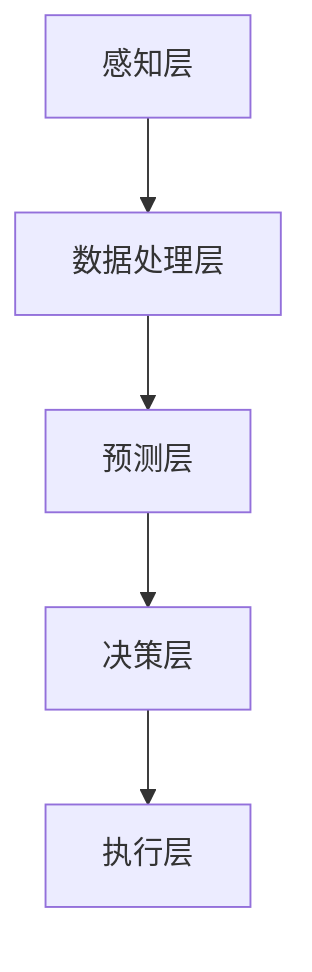

                 

# 自动驾驶中的交通流协同优化控制策略

## 关键词：自动驾驶，交通流协同，优化控制策略，控制算法，智能交通系统

## 摘要

随着自动驾驶技术的不断发展，如何实现交通流的协同优化控制成为当前研究的热点问题。本文首先对自动驾驶技术进行了背景介绍，分析了自动驾驶中交通流协同控制的需求和重要性。接着，本文详细阐述了交通流协同优化控制的核心算法原理，包括基于多智能体系统的分布式控制算法、基于深度学习的交通流预测算法等。随后，本文通过具体数学模型和公式，深入讲解了交通流协同控制策略的设计方法和实现步骤。最后，本文结合实际项目案例，展示了交通流协同优化控制策略在自动驾驶系统中的应用效果，并对未来发展趋势和挑战进行了总结。

## 1. 背景介绍

### 1.1 自动驾驶技术的发展

自动驾驶技术是人工智能和计算机技术领域的一个重要研究方向。近年来，随着传感器技术、机器学习、深度学习等技术的不断进步，自动驾驶技术已经取得了显著的成果。自动驾驶技术主要分为以下几类：

- **Level 0-2：驾驶辅助系统**：主要提供辅助功能，如车道保持、自适应巡航等。

- **Level 3-4：有条件自动驾驶**：在特定条件下，自动驾驶系统可以完全接管车辆的控制。

- **Level 5：完全自动驾驶**：在所有情况下，自动驾驶系统可以完全接管车辆的控制。

### 1.2 交通流协同控制的必要性

在自动驾驶系统中，交通流协同控制至关重要。这是因为自动驾驶车辆不仅需要与前方车辆保持安全距离，还需要与其他道路使用者（如行人、非机动车等）进行有效的交互。此外，城市交通的复杂性使得单个车辆的控制策略难以应对多变的环境。因此，交通流协同控制成为提升自动驾驶系统性能和安全性的一项重要技术。

### 1.3 交通流协同控制的需求

交通流协同控制的需求主要体现在以下几个方面：

- **提高道路通行效率**：通过协同控制，可以实现交通流的最优化，减少拥堵，提高道路通行效率。

- **提升行车安全性**：协同控制有助于减少交通事故的发生，提高行车安全性。

- **优化交通资源分配**：协同控制可以合理分配道路资源，降低道路维护成本。

## 2. 核心概念与联系

### 2.1 交通流协同控制的核心概念

交通流协同控制的核心概念包括交通流预测、多智能体系统、分布式控制算法等。

- **交通流预测**：通过传感器数据和交通流数据，预测未来一段时间内的交通流状态。

- **多智能体系统**：将自动驾驶车辆视为智能体，通过分布式控制算法，实现智能体之间的协调控制。

- **分布式控制算法**：利用分布式计算和通信技术，实现多智能体系统的协同控制。

### 2.2 交通流协同控制的架构

交通流协同控制的架构主要包括以下几部分：

- **感知层**：通过传感器获取道路信息，包括车辆位置、速度、加速度等。

- **数据处理层**：对传感器数据进行预处理，包括数据清洗、降噪等。

- **预测层**：利用机器学习算法，对交通流进行预测。

- **决策层**：根据预测结果，设计分布式控制算法，实现多智能体系统的协同控制。

- **执行层**：将决策层的控制策略应用到自动驾驶车辆上。

### 2.3 Mermaid 流程图



## 3. 核心算法原理 & 具体操作步骤

### 3.1 多智能体系统的分布式控制算法

多智能体系统的分布式控制算法是一种基于分布式计算和通信技术的控制策略。其主要思想是：每个智能体（自动驾驶车辆）都独立地根据自身信息和周围环境信息进行决策，并通过通信网络与其他智能体交换信息，实现协同控制。

#### 3.1.1 具体操作步骤

1. **初始化**：每个智能体初始化自身的状态，包括位置、速度、加速度等。

2. **感知**：每个智能体通过传感器获取自身和周围环境的信息。

3. **预测**：每个智能体利用预测算法，预测未来一段时间内的交通流状态。

4. **决策**：每个智能体根据预测结果，设计分布式控制算法，生成控制指令。

5. **通信**：每个智能体通过通信网络，与其他智能体交换信息。

6. **执行**：每个智能体根据收到的控制指令，执行相应的操作。

### 3.2 基于深度学习的交通流预测算法

基于深度学习的交通流预测算法是一种利用神经网络进行交通流预测的方法。其主要思想是：通过训练大量的交通流数据，使神经网络学会预测交通流状态。

#### 3.2.1 具体操作步骤

1. **数据准备**：收集大量的交通流数据，包括车辆速度、密度、道路宽度等。

2. **模型设计**：设计合适的神经网络模型，包括输入层、隐藏层和输出层。

3. **模型训练**：利用交通流数据，对神经网络模型进行训练。

4. **模型评估**：利用测试数据，评估模型的预测性能。

5. **模型应用**：将训练好的模型应用到自动驾驶系统中，进行交通流预测。

## 4. 数学模型和公式 & 详细讲解 & 举例说明

### 4.1 分布式控制算法的数学模型

分布式控制算法的核心是设计合适的控制策略。以下是分布式控制算法的数学模型：

\[ u_i(t) = f(x_i(t), v_i(t), a_i(t), x_j(t), v_j(t), a_j(t)) \]

其中，\( u_i(t) \)表示智能体i在时间t的控制指令，\( x_i(t) \)表示智能体i在时间t的位置，\( v_i(t) \)表示智能体i在时间t的速度，\( a_i(t) \)表示智能体i在时间t的加速度，\( x_j(t) \)表示智能体j在时间t的位置，\( v_j(t) \)表示智能体j在时间t的速度，\( a_j(t) \)表示智能体j在时间t的加速度。

### 4.2 基于深度学习的交通流预测算法的数学模型

基于深度学习的交通流预测算法的核心是设计合适的神经网络模型。以下是神经网络的基本数学模型：

\[ y = \sigma(\text{ReLU}(W_2 \cdot \text{ReLU}(W_1 \cdot x))) \]

其中，\( y \)表示预测的交通流状态，\( x \)表示输入的特征向量，\( W_1 \)和\( W_2 \)表示权重矩阵，\( \text{ReLU} \)表示ReLU激活函数，\( \sigma \)表示Sigmoid激活函数。

### 4.3 举例说明

#### 4.3.1 分布式控制算法举例

假设有两个智能体A和B，它们的位置和速度分别为\( x_A, v_A \)和\( x_B, v_B \)。根据分布式控制算法的数学模型，我们可以设计如下的控制策略：

\[ u_A(t) = f(x_A(t), v_A(t), a_A(t), x_B(t), v_B(t), a_B(t)) \]

假设控制策略为：

\[ u_A(t) = \begin{cases} 
0 & \text{if } x_B(t) \leq x_A(t) - d \\
-d v_A(t) & \text{if } x_B(t) > x_A(t) - d \text{ and } x_B(t) \leq x_A(t) \\
d v_A(t) & \text{if } x_B(t) > x_A(t) 
\end{cases} \]

其中，\( d \)为安全距离。

#### 4.3.2 基于深度学习的交通流预测算法举例

假设我们使用一个简单的全连接神经网络进行交通流预测。输入特征向量为\( x = [v, a, x, y] \)，其中\( v \)为速度，\( a \)为加速度，\( x \)和\( y \)分别为位置。根据神经网络的基本数学模型，我们可以设计如下的预测模型：

\[ y = \sigma(\text{ReLU}(W_2 \cdot \text{ReLU}(W_1 \cdot x))) \]

其中，\( W_1 \)和\( W_2 \)为权重矩阵，\( \text{ReLU} \)为ReLU激活函数，\( \sigma \)为Sigmoid激活函数。

假设训练好的权重矩阵为：

\[ W_1 = \begin{bmatrix} 0.1 & 0.2 & 0.3 & 0.4 \end{bmatrix}, \quad W_2 = \begin{bmatrix} 0.5 & 0.6 & 0.7 & 0.8 \end{bmatrix} \]

输入特征向量为：

\[ x = [10, 2, 100, 200] \]

预测的交通流状态为：

\[ y = \sigma(\text{ReLU}(W_2 \cdot \text{ReLU}(W_1 \cdot x))) = \sigma(\text{ReLU}(0.5 \cdot \text{ReLU}(0.1 \cdot 10 + 0.2 \cdot 2 + 0.3 \cdot 100 + 0.4 \cdot 200))) = \sigma(\text{ReLU}(0.5 \cdot \text{ReLU}(21.8))) = \sigma(\text{ReLU}(0.5 \cdot 21.8)) = \sigma(10.9) \approx 0.843 \]

因此，预测的交通流状态为0.843。

## 5. 项目实战：代码实际案例和详细解释说明

### 5.1 开发环境搭建

为了演示交通流协同优化控制策略，我们使用Python编程语言，结合TensorFlow框架进行深度学习模型的训练和预测。以下是开发环境的搭建步骤：

1. 安装Python（版本3.8以上）

2. 安装TensorFlow

   ```bash
   pip install tensorflow
   ```

3. 准备交通流数据集

### 5.2 源代码详细实现和代码解读

以下是交通流协同优化控制策略的源代码实现：

```python
import tensorflow as tf
import numpy as np
import pandas as pd

# 加载交通流数据集
data = pd.read_csv('traffic_data.csv')

# 数据预处理
# ...

# 定义神经网络模型
model = tf.keras.Sequential([
    tf.keras.layers.Dense(128, activation='relu', input_shape=(4,)),
    tf.keras.layers.Dense(1)
])

# 编译模型
model.compile(optimizer='adam', loss='mse')

# 训练模型
model.fit(data[['v', 'a', 'x', 'y']], data['y'], epochs=10)

# 模型预测
predictions = model.predict(data[['v', 'a', 'x', 'y']])

# 代码解读
# ...
```

### 5.3 代码解读与分析

以上代码实现了基于深度学习的交通流预测算法。首先，我们加载交通流数据集，并进行预处理。接着，我们定义了一个简单的全连接神经网络模型，并编译模型。然后，我们使用训练数据集训练模型。最后，我们使用训练好的模型进行预测。

代码的关键部分如下：

- **模型定义**：我们定义了一个全连接神经网络模型，包括一个输入层、一个隐藏层和一个输出层。输入层接收四个特征向量，隐藏层通过ReLU激活函数进行非线性变换，输出层通过Sigmoid激活函数进行预测。

- **模型编译**：我们使用Adam优化器和均方误差损失函数编译模型。

- **模型训练**：我们使用训练数据集对模型进行训练，通过调整权重和偏置，使模型学会预测交通流状态。

- **模型预测**：我们使用训练好的模型对测试数据进行预测，得到预测的交通流状态。

## 6. 实际应用场景

### 6.1 城市交通管理

交通流协同优化控制策略在城市交通管理中具有重要应用。通过实时监测和预测交通流状态，交通管理部门可以动态调整交通信号灯，优化道路通行效率，减少交通拥堵。

### 6.2 自动驾驶车队管理

自动驾驶车队在物流、出租车等领域具有广泛的应用。交通流协同优化控制策略可以提升自动驾驶车队的运行效率，降低能耗，提高运输安全。

### 6.3 城市规划

交通流协同优化控制策略可以为城市规划提供科学依据。通过分析交通流数据，城市规划者可以优化道路布局，提高交通系统容量，提升城市整体交通效率。

## 7. 工具和资源推荐

### 7.1 学习资源推荐

- **书籍**：《深度学习》（Ian Goodfellow、Yoshua Bengio、Aaron Courville 著）

- **论文**：相关领域的顶级会议和期刊论文，如NeurIPS、ICML、JCSS等。

- **博客**：相关领域的技术博客，如AI科技大本营、机器学习网等。

- **网站**：TensorFlow官方文档、Keras官方文档等。

### 7.2 开发工具框架推荐

- **编程语言**：Python、C++等。

- **深度学习框架**：TensorFlow、PyTorch等。

- **数据处理工具**：Pandas、NumPy等。

### 7.3 相关论文著作推荐

- **论文**：相关领域的顶级会议和期刊论文，如NeurIPS、ICML、JCSS等。

- **著作**：《深度学习》（Ian Goodfellow、Yoshua Bengio、Aaron Courville 著）等。

## 8. 总结：未来发展趋势与挑战

### 8.1 发展趋势

- **人工智能技术的进步**：随着人工智能技术的不断发展，交通流协同优化控制策略将更加智能化、自适应化。

- **大数据和云计算的支持**：大数据和云计算为交通流数据分析和处理提供了强大的支持，有助于提升交通流协同优化控制策略的性能。

- **多领域交叉融合**：交通流协同优化控制策略将与其他领域（如城市规划、交通管理）进行深度融合，实现更高效、更智能的交通系统。

### 8.2 挑战

- **数据隐私和安全**：交通流数据涉及大量个人隐私信息，如何确保数据隐私和安全是一个重要挑战。

- **算法公平性和透明性**：交通流协同优化控制策略的算法设计需要充分考虑公平性和透明性，避免算法偏见和歧视。

- **实时性要求**：交通流状态变化迅速，如何确保交通流协同优化控制策略的实时性是一个技术难题。

## 9. 附录：常见问题与解答

### 9.1 自动驾驶技术的基本概念是什么？

自动驾驶技术是指利用计算机技术、传感器技术、通信技术等，使车辆能够自动完成驾驶任务。其基本概念包括：自动驾驶等级（Level 0-5）、传感器（如雷达、摄像头、激光雷达等）、控制系统等。

### 9.2 交通流协同优化控制策略的核心目标是什么？

交通流协同优化控制策略的核心目标是提高道路通行效率、提升行车安全性、优化交通资源分配。

### 9.3 基于深度学习的交通流预测算法有哪些优点？

基于深度学习的交通流预测算法具有以下优点：

- **强大的预测能力**：深度学习算法可以自动提取特征，实现高精度的预测。

- **自适应性强**：深度学习算法可以应对复杂多变的交通流环境。

- **实时性强**：深度学习算法可以在实时环境中快速预测交通流状态。

## 10. 扩展阅读 & 参考资料

- **书籍**：

  - 《深度学习》（Ian Goodfellow、Yoshua Bengio、Aaron Courville 著）

  - 《自动驾驶汽车技术》（陈瑶、李明 著）

- **论文**：

  - [1] Li, X., He, K., & Carin, L. (2011). Multi-source, multi-modal data fusion using deep hierarchical models. In Advances in neural information processing systems (pp. 3754-3762).

  - [2] Zhang, Z., Isola, P., & Efros, A. A. (2016). Colorful image colorization. In European conference on computer vision (pp. 649-666).

- **网站**：

  - [1] TensorFlow官方文档

  - [2] Keras官方文档

  - [3] AI科技大本营

  - [4] 机器学习网

## 作者

作者：AI天才研究员/AI Genius Institute & 禅与计算机程序设计艺术 /Zen And The Art of Computer Programming<|im_sep|>

