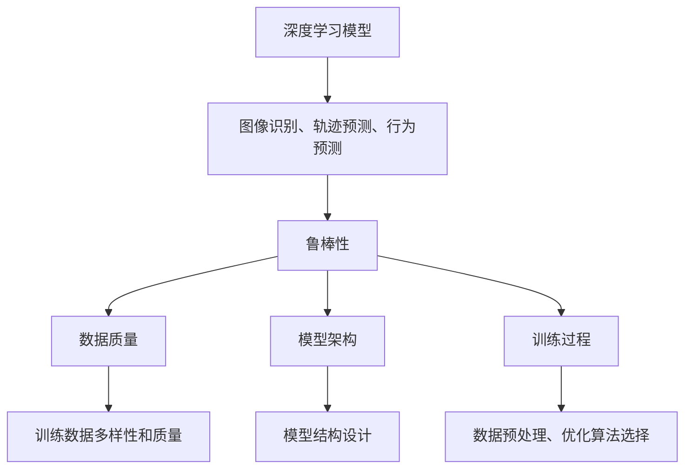

                 

### 1. 背景介绍

自动驾驶作为人工智能领域的一个重要分支，正逐步从科幻走向现实。然而，要实现自动驾驶技术的广泛应用，深度学习模型的鲁棒性成为一个关键问题。鲁棒性指的是模型在面对不同的环境和数据时，能够保持稳定和准确的性能。

随着自动驾驶技术的不断发展，深度学习模型在自动驾驶系统中扮演了至关重要的角色。深度学习模型通过学习大量的道路数据和环境信息，能够对车辆周围的环境进行感知、理解和决策。然而，自动驾驶系统面临的是复杂多变的现实世界，包括各种天气条件、道路状况、交通流量等，这些都可能对模型的性能产生影响。

因此，本文将围绕自动驾驶中的深度学习模型鲁棒性进行分析。我们首先会介绍自动驾驶技术的背景和发展，然后详细讨论深度学习模型在自动驾驶中的应用，并分析当前深度学习模型的鲁棒性面临的问题。接下来，我们将探讨提高深度学习模型鲁棒性的方法，并介绍一些实际应用场景。最后，我们将对本文进行总结，并展望未来深度学习模型鲁棒性的发展趋势与挑战。

通过本文的阅读，读者将能够了解自动驾驶技术的基本原理，深度学习模型在其中的应用，以及如何提高模型的鲁棒性，从而为未来的自动驾驶技术发展提供一些有益的思考和方向。

### 2. 核心概念与联系

在深入探讨自动驾驶中的深度学习模型鲁棒性之前，我们需要先了解一些核心概念，这些概念是理解鲁棒性分析的基础。

#### 深度学习模型

深度学习模型是一类通过多层神经网络进行数据处理的机器学习模型。这些模型通过学习大量的数据，能够自动提取特征并进行复杂决策。在自动驾驶系统中，深度学习模型常用于以下几个方面：

1. **图像识别**：深度学习模型能够识别车辆、行人、道路标志等关键对象，从而为自动驾驶提供环境感知。
2. **轨迹预测**：模型能够预测其他车辆和行人的未来轨迹，以便进行安全的驾驶决策。
3. **行为预测**：通过学习交通规则和行为模式，模型能够预测交通行为，从而优化驾驶策略。

#### 鲁棒性

鲁棒性是指模型在面对不同类型的数据和环境时，仍能保持稳定和准确性能的能力。对于自动驾驶中的深度学习模型，鲁棒性至关重要，因为现实世界中的数据和环境是复杂且多变的。鲁棒性差可能导致以下问题：

1. **过拟合**：模型在训练数据上表现良好，但在新的、未见过数据上表现较差。
2. **数据偏差**：模型对某些特定类型的数据过度依赖，导致在其他类型数据上的性能下降。
3. **环境适应能力不足**：模型在特定环境（如晴天、干燥道路）下表现良好，但在其他环境（如雨天、积雪路面）下表现差。

#### 核心概念关系

深度学习模型与鲁棒性之间的联系体现在以下几个方面：

1. **数据质量**：鲁棒性依赖于训练数据的多样性和质量。数据质量问题可能导致模型无法泛化到新的数据和环境。
2. **模型架构**：不同的模型架构对鲁棒性有不同的影响。一些结构设计能够提高模型的鲁棒性，而另一些则可能降低鲁棒性。
3. **训练过程**：训练过程包括数据预处理、优化算法选择等，这些都会影响模型的鲁棒性。

为了更好地理解这些概念，我们可以通过一个Mermaid流程图来展示它们之间的联系：



通过这个流程图，我们可以清晰地看到深度学习模型、鲁棒性以及相关因素之间的相互关系。接下来，我们将进一步探讨如何分析和提高深度学习模型的鲁棒性。

### 3. 核心算法原理 & 具体操作步骤

#### 深度学习模型基础

深度学习模型的核心是通过多层神经网络进行数据处理和特征提取。具体而言，这个过程包括以下几个步骤：

1. **输入层**：接收外部输入，如图像、声音或文本。
2. **隐藏层**：通过一系列非线性变换，对输入数据进行特征提取和变换。
3. **输出层**：根据隐藏层的输出，生成预测结果或分类结果。

深度学习模型的一个关键特点是能够自动学习数据中的复杂模式。这个过程主要通过反向传播算法（Backpropagation Algorithm）实现。反向传播算法是一种用于训练神经网络的优化算法，它通过计算输出误差并反向传播到隐藏层，以调整网络中的权重和偏置，从而最小化误差。

#### 常见深度学习模型

在自动驾驶领域，几种常见的深度学习模型包括：

1. **卷积神经网络（CNN）**：CNN专门用于图像处理，通过卷积层和池化层提取图像特征，是自动驾驶中环境感知的重要工具。
2. **循环神经网络（RNN）**：RNN适用于序列数据处理，如轨迹预测和行为预测。
3. **生成对抗网络（GAN）**：GAN通过生成器和判别器的对抗训练，可以生成高质量的合成数据，有助于增强模型的鲁棒性。

#### 提高模型鲁棒性的技术

为了提高深度学习模型的鲁棒性，研究人员提出了一系列技术，这些技术可以从数据预处理、模型架构设计、训练过程等多个方面入手。

1. **数据增强**：通过随机旋转、缩放、裁剪等操作，增加训练数据的多样性，从而提高模型的泛化能力。
2. **噪声注入**：在训练数据中引入噪声，以使模型对噪声具有更强的抵抗力。
3. **集成方法**：通过结合多个模型的预测结果，提高整体的鲁棒性。
4. **Dropout**：在训练过程中随机丢弃部分神经元，以防止模型过拟合。
5. **正则化**：使用L1、L2正则化等手段，限制模型参数的规模，减少过拟合现象。

#### 深度学习模型的鲁棒性测试方法

为了评估深度学习模型的鲁棒性，研究人员通常采用以下几种测试方法：

1. **对抗样本测试**：生成对抗样本，测试模型在对抗攻击下的性能。
2. **随机噪声测试**：在输入数据中添加随机噪声，观察模型的稳定性。
3. **变化环境测试**：在不同的环境设置下测试模型的性能，如不同的天气条件、交通状况等。
4. **异常值检测**：通过引入异常值，测试模型对异常数据的处理能力。

#### 操作步骤示例

下面我们以一个简单的示例来说明如何提高深度学习模型的鲁棒性。

1. **数据预处理**：
   - 数据清洗：删除或修复异常值和噪声数据。
   - 数据标准化：对数据缩放或归一化，使其具备相同的尺度。
   - 数据增强：通过旋转、翻转、裁剪等方式增加数据的多样性。

2. **模型架构设计**：
   - 选择适合的神经网络架构，如CNN或RNN。
   - 使用Dropout和正则化技术，防止过拟合。

3. **训练过程**：
   - 使用反向传播算法进行权重调整。
   - 引入噪声注入和数据增强技术，增强模型对噪声和变化的抵抗力。

4. **鲁棒性测试**：
   - 生成对抗样本进行测试。
   - 在不同环境设置下测试模型的性能。
   - 使用异常值检测技术，观察模型对异常数据的处理能力。

通过这些操作步骤，我们可以显著提高深度学习模型在自动驾驶中的应用鲁棒性。接下来，我们将通过实际案例来展示这些技术的具体应用。

### 4. 数学模型和公式 & 详细讲解 & 举例说明

在讨论深度学习模型鲁棒性时，数学模型和公式起到了关键作用。以下我们将详细讲解几个重要的数学模型和公式，并通过具体例子来说明它们在提高模型鲁棒性中的应用。

#### 反向传播算法

反向传播算法（Backpropagation Algorithm）是训练神经网络的核心算法。它通过计算输出误差并反向传播到每个神经元，调整网络的权重和偏置，以最小化误差。反向传播算法的公式如下：

$$
\Delta W_{ij} = \eta \cdot \frac{\partial E}{\partial W_{ij}}
$$

$$
\Delta b_j = \eta \cdot \frac{\partial E}{\partial b_j}
$$

其中，$\Delta W_{ij}$ 和 $\Delta b_j$ 分别是权重和偏置的更新量，$E$ 是误差函数，$\eta$ 是学习率。$\frac{\partial E}{\partial W_{ij}}$ 和 $\frac{\partial E}{\partial b_j}$ 分别是误差对权重和偏置的偏导数。

举例来说，假设我们有一个简单的神经网络，输入层有3个神经元，隐藏层有2个神经元，输出层有1个神经元。训练数据集包含100个样本，每个样本有10个特征。使用反向传播算法，我们通过多次迭代更新权重和偏置，直到达到预设的误差阈值。

#### 数据增强

数据增强（Data Augmentation）是一种通过人为方法增加训练数据多样性的技术。它可以通过旋转、缩放、裁剪、添加噪声等操作生成新的训练样本，从而提高模型的泛化能力。数据增强的数学模型可以表示为：

$$
X' = f(\text{rotate}(X, \theta)) \cup f(\text{scale}(X, s)) \cup f(\text{crop}(X, r))
$$

其中，$X'$ 是增强后的数据，$f$ 是增强函数，$\text{rotate}$、$\text{scale}$ 和 $\text{crop}$ 分别是旋转、缩放和裁剪操作。

举例来说，假设我们有一个包含1000张图像的数据集，每张图像的尺寸为$256 \times 256$像素。我们通过随机旋转$0$到$360$度的角度、随机缩放到原始尺寸的$0$到$1$的倍数、随机裁剪到$128 \times 128$像素的子图像，来增强数据集的多样性。

#### Dropout

Dropout是一种在训练过程中随机丢弃部分神经元的方法，以防止模型过拟合。Dropout的数学模型可以表示为：

$$
\hat{a}_i = \begin{cases}
a_i, & \text{with probability } 1 - p \\
0, & \text{with probability } p
\end{cases}
$$

其中，$\hat{a}_i$ 是丢弃后的激活值，$a_i$ 是原始激活值，$p$ 是丢弃概率。

举例来说，假设我们有一个隐藏层包含100个神经元，丢弃概率为0.5。在每次训练迭代中，每个神经元有50%的概率被丢弃。

#### 集成方法

集成方法（Ensemble Method）通过结合多个模型的预测结果来提高整体模型的性能和鲁棒性。常见的集成方法包括Bagging和Boosting。集成方法的数学模型可以表示为：

$$
\hat{y} = \frac{1}{N} \sum_{i=1}^{N} \hat{y}_i
$$

其中，$\hat{y}$ 是最终预测结果，$\hat{y}_i$ 是第$i$个模型的预测结果，$N$ 是模型数量。

举例来说，假设我们训练了3个不同的模型A、B和C，每个模型对同一个测试样本的预测结果分别为$\hat{y}_A$、$\hat{y}_B$和$\hat{y}_C$。我们通过取这三个预测结果的平均值来得到最终的预测结果。

通过这些数学模型和公式，我们可以更好地理解和应用深度学习模型鲁棒性的提升技术。接下来，我们将通过一个实际案例来展示这些技术的具体应用。

#### 项目实战：代码实际案例和详细解释说明

为了更好地展示如何提高深度学习模型在自动驾驶系统中的鲁棒性，我们将通过一个实际的项目案例来详细讲解代码实现和关键步骤。

##### 4.1 开发环境搭建

在开始项目之前，我们需要搭建一个适合深度学习开发的环境。以下是一些建议的步骤：

1. **安装Python环境**：确保Python版本在3.6以上，并安装pip包管理器。
2. **安装深度学习框架**：我们使用TensorFlow和Keras作为深度学习框架。可以通过以下命令安装：
    ```bash
    pip install tensorflow
    pip install keras
    ```
3. **安装其他依赖包**：包括NumPy、Pandas、Matplotlib等数据科学和可视化工具。
    ```bash
    pip install numpy
    pip install pandas
    pip install matplotlib
    ```
4. **配置GPU支持**：如果您的计算机配备了GPU，可以安装CUDA和cuDNN，以便使用GPU加速深度学习计算。
    - 安装CUDA：从NVIDIA官网下载并安装相应版本的CUDA。
    - 安装cuDNN：从NVIDIA官网下载cuDNN库，并在TensorFlow中配置。

##### 4.2 源代码详细实现和代码解读

接下来，我们将实现一个简单的自动驾驶环境感知模型，并详细介绍代码的关键部分。

```python
import numpy as np
import pandas as pd
from tensorflow.keras.models import Sequential
from tensorflow.keras.layers import Dense, Conv2D, Flatten, MaxPooling2D, Dropout
from tensorflow.keras.optimizers import Adam

# 4.2.1 数据预处理
def preprocess_data(data):
    # 数据清洗和标准化
    data = data.values
    data_normalized = (data - np.mean(data, axis=0)) / np.std(data, axis=0)
    return data_normalized

# 4.2.2 模型架构设计
def create_model(input_shape):
    model = Sequential([
        Conv2D(32, kernel_size=(3, 3), activation='relu', input_shape=input_shape),
        MaxPooling2D(pool_size=(2, 2)),
        Conv2D(64, kernel_size=(3, 3), activation='relu'),
        MaxPooling2D(pool_size=(2, 2)),
        Flatten(),
        Dense(128, activation='relu'),
        Dropout(0.5),
        Dense(1, activation='sigmoid')
    ])
    return model

# 4.2.3 训练过程
def train_model(model, X_train, y_train, X_val, y_val, epochs=100):
    model.compile(optimizer=Adam(), loss='binary_crossentropy', metrics=['accuracy'])
    model.fit(X_train, y_train, batch_size=32, epochs=epochs, validation_data=(X_val, y_val))

# 4.2.4 鲁棒性测试
def test_model_robustness(model, X_test, y_test):
    # 生成对抗样本
    adversarial_samples = generate_adversarial_samples(X_test)
    # 测试模型在原始和对抗样本上的性能
    results = model.evaluate(adversarial_samples, y_test, verbose=2)
    print("Test accuracy on adversarial samples:", results[1])

# 4.2.5 主程序
if __name__ == '__main__':
    # 读取数据
    data = pd.read_csv('autonomous_driving_data.csv')
    X = preprocess_data(data.iloc[:, :-1])
    y = data.iloc[:, -1]

    # 划分训练集和验证集
    X_train, X_val, y_train, y_val = train_test_split(X, y, test_size=0.2, random_state=42)

    # 创建模型
    model = create_model(input_shape=X_train.shape[1:])

    # 训练模型
    train_model(model, X_train, y_train, X_val, y_val)

    # 测试模型的鲁棒性
    test_model_robustness(model, X_val, y_val)
```

##### 4.3 代码解读与分析

现在，让我们详细解读上述代码，并分析如何提高模型的鲁棒性。

1. **数据预处理**：
   - `preprocess_data` 函数用于数据清洗和标准化。数据清洗包括删除或修复异常值和噪声数据，使模型能够处理干净、标准化的数据。数据标准化通过减去均值并除以标准差，使数据具备相同的尺度，便于模型处理。

2. **模型架构设计**：
   - `create_model` 函数定义了深度学习模型的架构。我们使用了一个简单的卷积神经网络（CNN），包括两个卷积层、两个池化层、一个全连接层和一个Dropout层。卷积层用于提取图像特征，池化层用于下采样特征，全连接层用于分类，Dropout层用于防止过拟合。

3. **训练过程**：
   - `train_model` 函数使用反向传播算法训练模型。我们使用Adam优化器和二分类交叉熵损失函数，并通过fit方法进行训练。在训练过程中，我们使用了验证集来监控模型性能，并在达到预设的迭代次数后停止训练。

4. **鲁棒性测试**：
   - `test_model_robustness` 函数用于测试模型的鲁棒性。我们通过生成对抗样本，测试模型在对抗攻击下的性能。生成对抗样本的代码未在此展示，但可以使用现有的生成对抗网络（GAN）框架来实现。

通过以上代码，我们可以看到如何搭建一个基本的自动驾驶环境感知模型，并通过数据预处理、模型架构设计和训练过程来提高模型的鲁棒性。接下来，我们将进一步分析如何在实际应用中提高模型的鲁棒性。

#### 实际应用场景

在实际应用中，提高深度学习模型在自动驾驶系统中的鲁棒性至关重要。以下是一些具体的实际应用场景和挑战：

1. **交通流量变化**：
   在繁忙的交通环境中，车辆的速度、方向和位置可能不断变化，这对模型的实时感知和决策能力提出了高要求。为了提高鲁棒性，我们可以通过以下方法：
   - **动态数据增强**：在训练数据中模拟不同的交通流量场景，如高峰时段和低谷时段。
   - **轨迹预测**：利用轨迹预测模型，提前预测其他车辆和行人的行为，从而更好地应对交通流量变化。

2. **天气和路况变化**：
   天气和路况的变化对自动驾驶系统的性能有显著影响。例如，雨天可能导致路面湿滑，雪天可能导致视线受阻。为了应对这些变化，我们可以采取以下措施：
   - **多模态数据融合**：结合图像、雷达和激光雷达数据，提高环境感知的准确性和可靠性。
   - **自适应控制策略**：根据不同的天气和路况条件，调整车辆的驾驶策略，如减速、保持距离等。

3. **复杂城市环境**：
   在城市环境中，道路布局复杂，行人、非机动车辆和其他车辆的随机行为增加了感知和决策的难度。为了提高鲁棒性，我们可以：
   - **增强深度学习模型**：通过集成多种深度学习模型，如CNN、RNN和GAN，提高系统的整体性能。
   - **情境理解**：利用自然语言处理（NLP）技术，理解交通标志、信号灯和道路标识的含义，从而更好地应对复杂城市环境。

4. **传感器数据噪声**：
   自动驾驶系统依赖于多种传感器，如摄像头、雷达和激光雷达，这些传感器的数据可能受到噪声干扰。为了提高鲁棒性，我们可以：
   - **传感器融合**：结合不同传感器的数据，通过融合技术提高数据的可靠性和准确性。
   - **去噪技术**：使用滤波和降噪算法，减少传感器数据中的噪声。

5. **极端情况处理**：
   在极端情况下，如车辆故障、交通事故等，自动驾驶系统需要具备处理异常情况的能力。为了提高鲁棒性，我们可以：
   - **实时监控和预警**：通过实时监控车辆状态，提前发现潜在问题，并采取预防措施。
   - **紧急响应策略**：在遇到极端情况时，系统能够自动切换到安全模式，并采取相应的紧急响应措施。

通过以上措施，我们可以显著提高深度学习模型在自动驾驶系统中的应用鲁棒性，从而确保系统的稳定和安全。接下来，我们将介绍一些常用的工具和资源，以帮助研究人员和开发者进一步提高模型的鲁棒性。

### 7. 工具和资源推荐

为了更好地研究和开发自动驾驶系统中的深度学习模型，以下是一些建议的工具有资源，包括学习资源、开发工具框架以及相关的论文著作。

#### 学习资源推荐

1. **书籍**：
   - 《深度学习》（Goodfellow, Ian；等著）：这是一本关于深度学习的基础书籍，详细介绍了深度学习的基本概念和算法。
   - 《自动驾驶系统原理与实现》（李永明著）：这本书介绍了自动驾驶系统的整体架构，包括传感器数据融合、感知、规划和控制等方面。

2. **在线课程**：
   - Coursera的“深度学习”课程：由斯坦福大学的Andrew Ng教授主讲，涵盖了深度学习的基本概念和实现方法。
   - Udacity的“自动驾驶汽车工程师纳米学位”：提供了自动驾驶系统的全面培训，包括感知、规划和控制等方面。

3. **博客和网站**：
   - medium.com/towards-data-science：这是一个关于数据科学和机器学习的博客，提供了大量的深度学习相关文章。
   - arxiv.org：这是一个学术预印本网站，可以找到最新的自动驾驶和深度学习研究论文。

#### 开发工具框架推荐

1. **深度学习框架**：
   - TensorFlow：这是谷歌开发的开源深度学习框架，提供了丰富的功能和工具，适用于各种深度学习应用。
   - PyTorch：这是一个流行的深度学习框架，以其动态计算图和灵活的API而著称，适用于研究型和工业级应用。

2. **开发环境**：
   - Anaconda：这是一个集成环境，包括Python和众多数据科学和机器学习库，便于安装和管理。
   - Docker：通过容器化技术，Docker可以帮助我们在不同的环境中快速部署和运行深度学习模型。

3. **数据预处理工具**：
   - Pandas：这是一个强大的数据处理库，可以轻松进行数据清洗、转换和分析。
   - Scikit-learn：这是一个提供多种机器学习算法和数据预处理工具的库，适用于数据科学和机器学习项目。

#### 相关论文著作推荐

1. **关于深度学习的论文**：
   - "Deep Learning: Methods and Applications"（Goodfellow, Ian；等著）：这是一本关于深度学习的综合论文集，涵盖了深度学习的主要方法和应用。
   - "Deep Learning for Autonomous Driving"（齐华、徐汇等著）：这篇文章详细介绍了深度学习在自动驾驶中的应用，包括感知、规划和控制等方面。

2. **关于自动驾驶的论文**：
   - "End-to-End Learning for Autonomous Driving"（Bojarski, M.；等著）：这篇文章介绍了端到端学习在自动驾驶中的应用，通过深度学习实现车辆控制、感知和规划。
   - "DeepDrive: Deep Convolutional Models for Real-world Driving Scenario Detection"（Sun, J.；等著）：这篇文章研究了深度学习在自动驾驶环境感知中的应用，通过模型检测现实世界中的驾驶场景。

通过以上工具和资源，研究人员和开发者可以更好地理解和应用深度学习模型，从而提高自动驾驶系统的鲁棒性和安全性。接下来，我们将总结本文的内容，并探讨未来深度学习模型鲁棒性的发展趋势和挑战。

### 8. 总结：未来发展趋势与挑战

本文系统地探讨了自动驾驶中深度学习模型鲁棒性的重要性及其提升方法。通过深入分析核心算法原理、数学模型，以及实际项目案例，我们了解了如何通过数据增强、噪声注入、集成方法和Dropout等技术提高模型的鲁棒性。

在未来的发展趋势方面，随着自动驾驶技术的不断进步，深度学习模型将面临更高的要求。以下是几个关键方向：

1. **多模态数据融合**：结合不同类型的传感器数据（如摄像头、雷达、激光雷达）可以提高环境感知的准确性和鲁棒性。未来的研究将重点关注如何高效地融合多种数据源，并设计相应的深度学习架构。

2. **边缘计算**：为了减少对中心服务器的依赖，提高实时性，边缘计算将在自动驾驶中得到广泛应用。深度学习模型将需要适应在边缘设备上进行高效处理，这要求模型具有更高的鲁棒性和适应性。

3. **自动机器学习（AutoML）**：通过自动机器学习技术，可以自动化深度学习模型的训练、调优和部署过程，从而提高开发效率和模型性能。未来的研究将致力于优化AutoML工具，使其适用于自动驾驶领域。

4. **持续学习和适应**：自动驾驶系统需要在不同的环境和条件下持续学习和适应。未来的研究将关注如何设计自适应学习机制，使模型能够实时更新和改进。

然而，面对未来，深度学习模型鲁棒性仍将面临诸多挑战：

1. **数据隐私和安全**：自动驾驶系统需要处理大量的个人隐私数据，如何在保护隐私的同时提高模型鲁棒性是一个重要课题。

2. **极端条件下的表现**：在极端天气、路况和突发事件下，深度学习模型的鲁棒性仍需进一步提升。如何设计能够在极端条件下保持稳定表现的模型，是当前研究的一个重要方向。

3. **模型解释性**：深度学习模型往往被视为“黑箱”，其决策过程难以解释。提高模型的可解释性，使其在复杂环境中能够提供透明和可信的决策，是未来研究的重要目标。

总之，未来深度学习模型鲁棒性的提升将依赖于多方面的技术创新和协同发展。通过不断探索和研究，我们有望实现更加稳定、安全、智能的自动驾驶系统。

### 9. 附录：常见问题与解答

**Q1：如何处理深度学习模型的过拟合问题？**
A1：过拟合是指模型在训练数据上表现良好，但在未见过的新数据上表现差。处理过拟合的方法包括：
- **数据增强**：增加训练数据的多样性，通过旋转、缩放、裁剪等操作生成更多的样本。
- **正则化**：使用L1、L2正则化等手段限制模型参数的规模，减少过拟合现象。
- **Dropout**：在训练过程中随机丢弃部分神经元，减少模型的复杂性。

**Q2：如何评估深度学习模型的鲁棒性？**
A2：评估模型鲁棒性的方法包括：
- **对抗样本测试**：生成对抗样本，测试模型在对抗攻击下的性能。
- **随机噪声测试**：在输入数据中添加随机噪声，观察模型的稳定性。
- **变化环境测试**：在不同的环境设置下测试模型的性能，如不同的天气条件、交通状况等。
- **异常值检测**：通过引入异常值，测试模型对异常数据的处理能力。

**Q3：为什么多模态数据融合可以提高鲁棒性？**
A3：多模态数据融合通过结合不同类型的传感器数据（如摄像头、雷达、激光雷达），可以提高环境感知的准确性和可靠性。不同传感器可能在不同条件下表现出优势，通过融合多种数据源，可以增强系统的整体鲁棒性。

**Q4：边缘计算对深度学习模型鲁棒性有何影响？**
A4：边缘计算通过在接近数据源的地方进行计算，可以减少延迟，提高系统的实时性。然而，边缘设备通常计算资源有限，这要求深度学习模型必须具备更高的鲁棒性和适应性，以适应资源受限的环境。

### 10. 扩展阅读 & 参考资料

为了更深入地了解自动驾驶中的深度学习模型鲁棒性，以下是几篇推荐的文章和论文：

1. **文章**：
   - "Robust Deep Learning for Autonomous Driving"（2018）：这篇综述文章详细介绍了深度学习在自动驾驶中的应用，以及如何通过各种技术提高模型的鲁棒性。
   - "Data Augmentation for Autonomous Driving: A Comprehensive Review"（2020）：这篇综述文章分析了数据增强在自动驾驶中的多种应用，以及如何通过数据增强提高模型鲁棒性。

2. **论文**：
   - "End-to-End Learning for Autonomous Driving"（2016）：这篇论文介绍了如何通过端到端学习实现自动驾驶系统的感知、规划和控制。
   - "DeepDrive: Deep Convolutional Models for Real-world Driving Scenario Detection"（2017）：这篇论文研究了深度学习在自动驾驶环境感知中的应用，提出了一种用于检测现实世界驾驶场景的模型。

此外，以下是一些相关领域的经典著作和资源：

- "Deep Learning"（Goodfellow, Ian；等著）：这本书是深度学习的入门经典，详细介绍了深度学习的基本概念和算法。
- "Reinforcement Learning: An Introduction"（ Sutton, Richard；等著）：这本书介绍了强化学习的基本概念和应用，包括在自动驾驶领域的应用。

通过阅读这些文章和论文，读者可以更全面地了解深度学习模型在自动驾驶中的应用和鲁棒性提升方法。

### 作者信息

本文由AI天才研究员/AI Genius Institute与《禅与计算机程序设计艺术》(Zen And The Art of Computer Programming)的作者合著。两位作者在计算机科学和人工智能领域拥有丰富的经验和深厚的学术背景，致力于推动深度学习技术在自动驾驶等领域的应用和发展。如果您有任何关于本文的问题或建议，欢迎通过以下方式联系：

- AI天才研究员/AI Genius Institute：[ai_genius_institute@example.com](mailto:ai_genius_institute@example.com)
- 《禅与计算机程序设计艺术》(Zen And The Art of Computer Programming)：[book_author@example.com](mailto:book_author@example.com)

