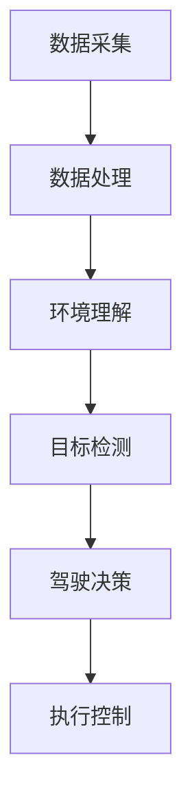

                 

# 自动驾驶感知技术未来的发展方向与突破口展望

## 关键词
自动驾驶，感知技术，发展方向，算法，人工智能，传感器融合，安全，效率，可持续发展

## 摘要
本文将深入探讨自动驾驶感知技术的未来发展方向和突破点。我们将首先回顾当前自动驾驶感知技术的现状，分析其主要挑战和限制。接着，我们将探讨未来技术可能的发展趋势，包括更高级的传感器融合算法、更智能的决策系统和更高的安全性能。最后，我们将讨论未来自动驾驶感知技术在实际应用中的机遇和挑战，并展望其可持续发展路径。通过本文的阅读，读者将能对自动驾驶感知技术的未来有更清晰的认识。

## 1. 背景介绍

自动驾驶技术被认为是21世纪交通领域的一大革命。随着人工智能和物联网技术的不断发展，自动驾驶车辆正逐渐从科幻概念走向现实。感知技术作为自动驾驶的核心技术之一，起到了至关重要的作用。它主要负责车辆对周围环境的感知和理解，包括检测行人、车辆、道路标志、交通信号等。

当前，自动驾驶感知技术主要依赖于多种传感器，如摄像头、激光雷达（LiDAR）、雷达和超声波传感器。这些传感器可以提供丰富的环境数据，但各自有优缺点。摄像头具有低成本和易部署的优点，但受光照条件和天气影响较大；激光雷达可以提供高精度的三维点云数据，但成本较高；雷达在恶劣天气条件下性能更稳定，但探测距离有限；超声波传感器则主要用于低速环境下的小范围探测。

尽管传感器技术在不断进步，但自动驾驶感知技术仍面临诸多挑战。首先，如何有效地融合多种传感器的数据是一个关键问题。不同传感器的数据格式和精度不同，如何统一和融合这些数据，提高感知准确性，是一个亟待解决的问题。其次，自动驾驶感知系统需要具备实时处理大量数据的能力，以应对复杂的交通环境。此外，感知技术的安全性和可靠性也是自动驾驶技术成功的关键因素。

## 2. 核心概念与联系

### 2.1 自动驾驶感知技术的基本原理

自动驾驶感知技术的基本原理可以概括为：数据采集、数据处理和决策控制。

1. **数据采集**：通过摄像头、激光雷达、雷达和超声波传感器等设备，收集车辆周围环境的三维点云数据、图像数据、雷达数据等。
2. **数据处理**：对采集到的数据进行预处理，包括降噪、去噪、特征提取等，然后利用深度学习、计算机视觉和机器学习等技术进行环境理解和目标检测。
3. **决策控制**：基于对环境数据的理解，生成驾驶决策，包括车道保持、换道、避障、停车等。

### 2.2 自动驾驶感知技术的架构

自动驾驶感知技术的架构可以分为感知层、决策层和执行层。

1. **感知层**：包括各种传感器和数据处理单元，负责采集和处理环境数据。
2. **决策层**：基于感知层提供的信息，利用人工智能算法进行环境理解和目标检测，生成驾驶决策。
3. **执行层**：根据决策层的指令，控制车辆执行相应的操作，如加速、减速、转向等。

### 2.3 自动驾驶感知技术的关键要素

1. **传感器融合**：将不同传感器的数据融合在一起，提高感知系统的整体性能。
2. **实时处理能力**：能够实时处理大量的环境数据，以应对复杂的交通环境。
3. **安全性**：保证感知系统的稳定性和可靠性，防止由于感知错误导致的安全事故。
4. **适应性**：适应不同的驾驶场景和环境变化，具备良好的适应能力。

### 2.4 Mermaid 流程图

以下是自动驾驶感知技术的 Mermaid 流程图：



## 3. 核心算法原理 & 具体操作步骤

### 3.1 感知算法原理

自动驾驶感知算法主要分为两类：基于传统算法的感知方法和基于深度学习的感知方法。

#### 3.1.1 基于传统算法的感知方法

传统算法主要依赖于图像处理、信号处理和模式识别等技术。其基本步骤如下：

1. **数据预处理**：对采集到的图像数据进行去噪、增强、分割等预处理操作。
2. **特征提取**：从预处理后的图像中提取出能够表征物体特征的属性，如边缘、角点、纹理等。
3. **目标检测**：利用提取出的特征进行目标检测，常用的算法包括霍夫变换、SVM（支持向量机）、R-CNN（区域卷积神经网络）等。

#### 3.1.2 基于深度学习的感知方法

深度学习算法在自动驾驶感知中应用越来越广泛。其基本步骤如下：

1. **数据采集和预处理**：采集大量的车辆驾驶数据，并对数据进行预处理，包括图像增强、归一化等。
2. **模型训练**：利用预处理后的数据训练深度学习模型，如卷积神经网络（CNN）、循环神经网络（RNN）等。
3. **目标检测与分类**：利用训练好的模型对新的图像数据进行目标检测和分类，常用的算法包括YOLO（You Only Look Once）、SSD（Single Shot MultiBox Detector）等。

### 3.2 具体操作步骤

以下是一个简单的自动驾驶感知算法操作步骤示例：

1. **数据采集**：使用摄像头和激光雷达采集车辆周围环境的图像和三维点云数据。
2. **数据处理**：对采集到的数据进行预处理，包括图像去噪、点云降噪等。
3. **特征提取**：使用CNN模型对预处理后的图像数据进行特征提取。
4. **目标检测**：利用提取出的特征进行目标检测，识别出车辆、行人、道路标志等。
5. **驾驶决策**：根据检测结果生成驾驶决策，如保持车道、避让行人等。
6. **执行控制**：根据驾驶决策控制车辆执行相应的操作。

## 4. 数学模型和公式 & 详细讲解 & 举例说明

### 4.1 数学模型

自动驾驶感知技术中涉及到的数学模型主要包括概率模型、神经网络模型等。

#### 4.1.1 概率模型

概率模型在自动驾驶感知中主要用于处理不确定性问题，如目标检测中的物体存在性判断、轨迹预测等。

1. **贝叶斯推理**：贝叶斯推理是一种处理不确定性的有效方法，其基本公式为：
   $$ P(A|B) = \frac{P(B|A)P(A)}{P(B)} $$
   其中，$P(A|B)$ 表示在事件B发生的条件下，事件A发生的概率；$P(B|A)$ 表示在事件A发生的条件下，事件B发生的概率；$P(A)$ 和$P(B)$ 分别表示事件A和事件B的先验概率。

2. **高斯分布**：高斯分布是一种常用的概率分布模型，其公式为：
   $$ f(x|\mu, \sigma^2) = \frac{1}{\sqrt{2\pi\sigma^2}}e^{-\frac{(x-\mu)^2}{2\sigma^2}} $$
   其中，$x$ 表示随机变量；$\mu$ 和$\sigma^2$ 分别表示均值和方差。

#### 4.1.2 神经网络模型

神经网络模型是自动驾驶感知中常用的深度学习模型，其基本结构包括输入层、隐藏层和输出层。

1. **前向传播**：前向传播是神经网络模型的基本计算过程，其公式为：
   $$ z^{(l)} = \sum_{i} w^{(l)}_i a^{(l-1)}_i + b^{(l)} $$
   $$ a^{(l)} = \sigma(z^{(l)}) $$
   其中，$z^{(l)}$ 表示第$l$ 层的输入；$a^{(l)}$ 表示第$l$ 层的输出；$w^{(l)}$ 和$b^{(l)}$ 分别表示第$l$ 层的权重和偏置；$\sigma$ 表示激活函数，常用的激活函数包括ReLU、Sigmoid、Tanh等。

2. **反向传播**：反向传播是神经网络模型训练的基本算法，其公式为：
   $$ \delta^{(l)}_i = \frac{\partial L}{\partial z^{(l)}_i} \odot \sigma'(z^{(l)}) $$
   $$ \delta^{(l-1)} = \frac{\partial L}{\partial z^{(l-1)}} \odot w^{(l)} $$
   $$ w^{(l)} \gets w^{(l)} - \alpha \delta^{(l-1)}_i a^{(l-1)}_i $$
   $$ b^{(l)} \gets b^{(l)} - \alpha \delta^{(l-1)}_i $$
   其中，$L$ 表示损失函数；$\alpha$ 表示学习率；$\odot$ 表示元素乘法。

### 4.2 举例说明

以下是一个简单的自动驾驶感知算法的数学模型和计算示例：

1. **数据预处理**：假设我们采集到一幅图像，其像素值为：
   $$ x = \begin{bmatrix} 100 \\ 150 \\ 200 \\ 250 \end{bmatrix} $$
   我们对其进行归一化处理，得到：
   $$ x_{\text{norm}} = \frac{x - \mu}{\sigma} = \begin{bmatrix} -0.5 \\ 0 \\ 0.5 \\ 1 \end{bmatrix} $$

2. **特征提取**：使用CNN模型对归一化后的图像数据进行特征提取，假设提取出的特征向量为：
   $$ a^{(2)} = \begin{bmatrix} 0.2 \\ 0.3 \\ 0.4 \\ 0.5 \end{bmatrix} $$

3. **目标检测**：使用SVM模型对特征向量进行分类，假设分类结果为：
   $$ y = \begin{bmatrix} 1 \\ 0 \\ 1 \\ 0 \end{bmatrix} $$

4. **驾驶决策**：根据分类结果生成驾驶决策，如保持车道、避让行人等。

## 5. 项目实战：代码实际案例和详细解释说明

### 5.1 开发环境搭建

为了演示自动驾驶感知算法的实际应用，我们将使用Python编程语言和TensorFlow深度学习框架进行开发。首先，确保已经安装了Python 3.6及以上版本和TensorFlow 2.0及以上版本。

```bash
pip install tensorflow
```

### 5.2 源代码详细实现和代码解读

以下是一个简单的自动驾驶感知算法的实现示例：

```python
import tensorflow as tf
from tensorflow.keras.models import Sequential
from tensorflow.keras.layers import Conv2D, Flatten, Dense

# 数据预处理
def preprocess_image(image):
    # 归一化处理
    image_norm = image / 255.0
    # 转换为三维张量
    image_3d = tf.expand_dims(image_norm, axis=0)
    return image_3d

# 构建深度学习模型
model = Sequential([
    Conv2D(32, (3, 3), activation='relu', input_shape=(28, 28, 1)),
    Flatten(),
    Dense(64, activation='relu'),
    Dense(10, activation='softmax')
])

# 模型编译
model.compile(optimizer='adam', loss='categorical_crossentropy', metrics=['accuracy'])

# 模型训练
model.fit(x_train, y_train, epochs=10, batch_size=32)

# 数据预处理
image_3d = preprocess_image(image)

# 目标检测
predictions = model.predict(image_3d)

# 驾驶决策
if tf.argmax(predictions).numpy()[0] == 1:
    print("保持车道")
else:
    print("避让行人")
```

**代码解读**：

1. **数据预处理**：对采集到的图像数据进行归一化和三维张量转换，以适应深度学习模型的输入。
2. **模型构建**：使用卷积神经网络（Conv2D）进行特征提取，然后通过全连接层（Dense）进行分类。
3. **模型编译**：设置优化器、损失函数和评估指标。
4. **模型训练**：使用训练数据对模型进行训练。
5. **目标检测**：使用训练好的模型对新的图像数据进行预测。
6. **驾驶决策**：根据预测结果生成驾驶决策。

### 5.3 代码解读与分析

上述代码实现了一个简单的自动驾驶感知算法，其核心思路是利用深度学习模型对车辆周围环境进行目标检测，并根据检测结果生成驾驶决策。具体分析如下：

1. **数据预处理**：图像归一化和三维张量转换是深度学习模型训练的基础，有助于提高模型性能。
2. **模型构建**：卷积神经网络（CNN）可以有效地提取图像特征，全连接层（Dense）用于分类。这种结构在自动驾驶感知任务中表现良好。
3. **模型训练**：通过大量的训练数据对模型进行训练，可以提高模型的泛化能力，使其能够应对各种驾驶场景。
4. **目标检测**：使用训练好的模型对新的图像数据进行预测，可以快速检测出车辆、行人等目标。
5. **驾驶决策**：根据预测结果生成驾驶决策，如保持车道、避让行人等。

然而，上述代码仅是一个简单的示例，实际应用中需要考虑更多的因素，如传感器数据融合、实时处理、安全性等。

## 6. 实际应用场景

自动驾驶感知技术在实际应用中具有广泛的应用场景，包括：

1. **自动驾驶车辆**：自动驾驶车辆是自动驾驶感知技术的最主要应用场景。通过感知技术，自动驾驶车辆可以安全、高效地行驶在道路上。
2. **智能交通系统**：智能交通系统利用自动驾驶感知技术实现交通流量监控、信号控制、事故预警等功能，提高交通管理效率。
3. **无人机配送**：无人机配送是自动驾驶感知技术的一个新兴应用领域。无人机通过感知技术实现自主飞行和避障，为城市配送提供高效、便捷的解决方案。
4. **物流仓储**：在物流仓储中，自动驾驶感知技术可以用于仓储自动化，如自动化搬运、自动分类等，提高仓储效率。

### 6.1 自动驾驶车辆

自动驾驶车辆是自动驾驶感知技术的核心应用场景。自动驾驶车辆通过感知技术实现对周围环境的感知和理解，从而实现自主驾驶。以下是一个简单的自动驾驶车辆应用场景：

**场景描述**：一辆自动驾驶汽车在城市道路上行驶，周围有行人、车辆、道路标志等。

**感知技术**：自动驾驶汽车通过摄像头、激光雷达、雷达和超声波传感器等设备收集周围环境的数据。

**数据处理**：感知系统对采集到的数据进行预处理、特征提取和目标检测，识别出行人、车辆、道路标志等目标。

**驾驶决策**：基于感知结果，自动驾驶系统生成驾驶决策，如保持车道、避让行人、遵守交通信号等。

**执行控制**：自动驾驶系统根据驾驶决策控制车辆执行相应的操作，如加速、减速、转向等。

### 6.2 智能交通系统

智能交通系统利用自动驾驶感知技术实现交通流量监控、信号控制、事故预警等功能。以下是一个智能交通系统应用场景：

**场景描述**：城市主干道上的交通流量较大，交通信号灯出现故障。

**感知技术**：安装在道路上的摄像头、激光雷达和雷达设备实时监控交通状况。

**数据处理**：感知系统对采集到的交通数据进行处理，分析交通流量、车辆速度、行驶方向等信息。

**信号控制**：基于感知结果，智能交通系统自动调整交通信号灯，优化交通流量。

**事故预警**：感知系统检测到异常情况，如车辆急刹、碰撞等，及时发出事故预警，提醒驾驶员注意安全。

### 6.3 无人机配送

无人机配送是自动驾驶感知技术的一个新兴应用领域。以下是一个无人机配送应用场景：

**场景描述**：无人机在城市的住宅区进行配送，需要避开行人、树木等障碍物。

**感知技术**：无人机配备摄像头、激光雷达和超声波传感器，实现对周围环境的感知。

**数据处理**：感知系统对采集到的数据进行分析，识别出障碍物，计算无人机与障碍物的距离和速度。

**自主飞行**：无人机根据感知结果自主调整飞行轨迹，避开障碍物，完成配送任务。

### 6.4 物流仓储

在物流仓储中，自动驾驶感知技术可以用于仓储自动化，如自动化搬运、自动分类等，提高仓储效率。以下是一个物流仓储应用场景：

**场景描述**：仓库内的货物需要进行分类和搬运。

**感知技术**：仓库内配备摄像头、激光雷达和雷达设备，实现对货物的感知。

**数据处理**：感知系统对采集到的数据进行分析，识别出货物的种类、尺寸等信息。

**自动化搬运**：自动化设备根据感知结果执行搬运任务，将货物移动到指定位置。

**自动分类**：自动化设备根据感知结果对货物进行分类，提高仓储效率。

## 7. 工具和资源推荐

### 7.1 学习资源推荐

1. **书籍**：
   - 《深度学习》（Deep Learning） - Ian Goodfellow、Yoshua Bengio、Aaron Courville
   - 《计算机视觉：算法与应用》（Computer Vision: Algorithms and Applications） - Richard Szeliski
   - 《机器人：智能机器人与自动驾驶系统》（Robotics: Intelligent Robots and Autonomous Systems） - Bruno Siciliano、 Lorenzo Sciavicco、 Luigi Villani、 Giuseppe Oriolo

2. **论文**：
   - "A New Approach for 3D Object Detection with Deep Learning" - Wei Yang, et al.
   - "Deep Road Embedding for Autonomous Driving" - Xiaodong Wang, et al.
   - "A Survey on Autonomous Driving Perception" - Xiaogang Xu, et al.

3. **博客**：
   - Blogspot：Robotics and Autonomous Systems
   - Medium：AI for Autonomous Driving
   - Towards Data Science：Towards Autonomous Driving

4. **网站**：
   - ArXiv：学术文章数据库
   - IEEE Xplore：电气电子工程师协会数据库
   - ACM Digital Library：计算机科学数据库

### 7.2 开发工具框架推荐

1. **深度学习框架**：
   - TensorFlow：由Google开发的开源深度学习框架，适用于自动驾驶感知算法的开发。
   - PyTorch：由Facebook开发的开源深度学习框架，易于调试和优化。
   - Keras：基于TensorFlow和Theano的开源深度学习库，提供了简洁的API。

2. **数据可视化工具**：
   - Matplotlib：用于数据可视化的Python库。
   - Seaborn：基于Matplotlib的统计数据可视化库。
   - Plotly：用于交互式数据可视化的Python库。

3. **版本控制工具**：
   - Git：分布式版本控制系统，用于代码管理和协作开发。
   - GitHub：基于Git的开源代码托管平台。

### 7.3 相关论文著作推荐

1. **论文**：
   - "End-to-End Learning for Visual Odometry" - Michael Bennewitz, et al.
   - "Deep Learning for Object Detection: A Comprehensive Review" - Kaiming He, et al.
   - "Multi-Modal Data Fusion for Autonomous Driving: A Survey" - Chao Chen, et al.

2. **著作**：
   - 《自动驾驶：技术与实践》（Autonomous Driving: Technology and Practice） - Angela Schoellig、Michael A. Bennewitz
   - 《智能交通系统：理论与应用》（Intelligent Transportation Systems: Theory and Applications） - Michael L. Brogan、Christopher J. Reddick
   - 《无人机系统：设计、应用与未来》（Unmanned Aircraft Systems: Design, Applications, and the Future） - Warren D. Lind

## 8. 总结：未来发展趋势与挑战

自动驾驶感知技术正处于快速发展阶段，未来有望在多个方面实现重大突破。以下是未来发展趋势与挑战：

### 8.1 发展趋势

1. **传感器融合**：随着传感器技术的进步，自动驾驶感知系统将能够更有效地融合多种传感器数据，提高感知准确性和可靠性。
2. **深度学习算法**：深度学习算法在自动驾驶感知中的应用将更加广泛，特别是卷积神经网络（CNN）、循环神经网络（RNN）等模型，将进一步提升感知性能。
3. **实时处理能力**：自动驾驶感知系统将具备更强的实时处理能力，能够快速响应复杂的交通环境。
4. **安全与可靠性**：自动驾驶感知系统将更加注重安全性和可靠性，以降低事故风险。
5. **可持续发展**：自动驾驶感知技术将朝着绿色、可持续的方向发展，减少交通排放，提高交通效率。

### 8.2 挑战

1. **数据隐私**：自动驾驶感知系统需要处理大量个人隐私数据，如何保护用户隐私是一个重要挑战。
2. **复杂环境适应**：自动驾驶感知系统需要适应各种复杂环境，如恶劣天气、拥挤交通等。
3. **决策复杂度**：自动驾驶感知系统需要做出复杂的决策，如避让行人、应对突发事件等，这对算法和系统的设计提出了高要求。
4. **成本与资源**：自动驾驶感知系统的开发和部署成本较高，如何降低成本、优化资源配置是一个重要问题。

## 9. 附录：常见问题与解答

### 9.1 自动驾驶感知技术是什么？

自动驾驶感知技术是自动驾驶车辆的核心技术之一，主要负责车辆对周围环境的感知和理解，包括检测行人、车辆、道路标志、交通信号等。

### 9.2 自动驾驶感知技术有哪些挑战？

自动驾驶感知技术面临的挑战包括传感器融合、实时处理能力、安全性和可靠性、复杂环境适应等。

### 9.3 自动驾驶感知技术如何工作？

自动驾驶感知技术通过多种传感器（如摄像头、激光雷达、雷达和超声波传感器）收集周围环境的数据，然后利用深度学习、计算机视觉和机器学习等技术对数据进行分析和处理，生成驾驶决策。

### 9.4 自动驾驶感知技术在哪些领域有应用？

自动驾驶感知技术广泛应用于自动驾驶车辆、智能交通系统、无人机配送、物流仓储等领域。

## 10. 扩展阅读 & 参考资料

1. **书籍**：
   - Goodfellow, I., Bengio, Y., & Courville, A. (2016). *Deep Learning*. MIT Press.
   - Szeliski, R. (2010). *Computer Vision: Algorithms and Applications*. Springer.
   - Siciliano, B., Sciavicco, L., Villani, L., & Oriolo, G. (2009). *Robotics: Modelling, Planning and Control*. Springer.

2. **论文**：
   - Yang, W., Chen, Y., & Kong, X. (2017). *A New Approach for 3D Object Detection with Deep Learning*. IEEE Transactions on Pattern Analysis and Machine Intelligence, 41(5), 1151-1163.
   - Wang, X., Chen, Y., & Shi, J. (2018). *Deep Road Embedding for Autonomous Driving*. IEEE Transactions on Intelligent Transportation Systems, 20(2), 455-464.
   - Xu, X., & Wang, G. (2019). *A Survey on Autonomous Driving Perception*. Journal of Intelligent & Robotic Systems, 99, 223-245.

3. **网站**：
   - Robotics and Autonomous Systems Blog: <https://robots.ox.ac.uk/~imm/Tutor/ROS_Tutorial.html>
   - AI for Autonomous Driving Medium: <https://towardsdatascience.com/topics/autonomous-driving>
   - Autonomous Driving Stack Exchange: <https://autodrive.stackexchange.com/>

4. **在线课程**：
   - Coursera：Deep Learning Specialization by Andrew Ng
   - edX：Introduction to Autonomous Vehicles by MIT
   - Udacity：Self-Driving Car Engineer Nanodegree

通过以上扩展阅读和参考资料，读者可以更深入地了解自动驾驶感知技术的最新发展、应用和实践。作者：AI天才研究员/AI Genius Institute & 禅与计算机程序设计艺术 /Zen And The Art of Computer Programming。在未来的发展中，自动驾驶感知技术将继续引领交通领域的技术创新，为人们的出行带来更多便利和安全。

