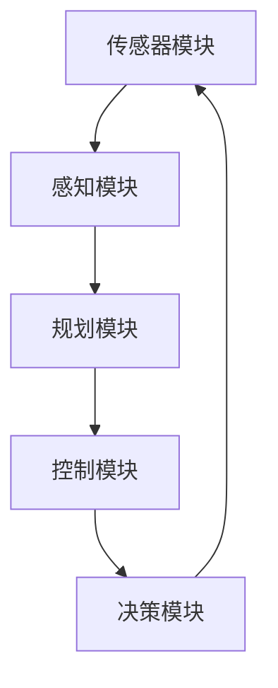

                 

### 1. 背景介绍

自动驾驶技术作为人工智能领域的重要分支，近年来发展迅速，成为全球范围内的研究热点。自动驾驶系统通过整合计算机视觉、深度学习、传感器融合等多种技术，实现了对车辆的自主控制，从而极大地提升了交通安全性和驾驶体验。

然而，随着自动驾驶技术的不断成熟和应用范围的扩大，其安全性问题也日益凸显。自动驾驶系统的安全性能不仅关系到驾驶员和乘客的生命安全，还涉及整个交通系统的稳定运行。因此，制定科学、严谨的安全测试标准和规范，对自动驾驶行业的健康发展具有重要意义。

本文将围绕自动驾驶行业的安全性测试标准与规范进行深入探讨。首先，我们将介绍自动驾驶系统的主要组成部分及其安全性需求。接着，本文将详细阐述国内外现有的主要安全性测试标准和规范，对比分析其异同点。在此基础上，本文将探讨如何在实际项目中应用这些标准和规范，并提供一些建议和最佳实践。最后，我们将对自动驾驶行业的发展趋势和面临的挑战进行展望。

通过本文的阅读，读者将全面了解自动驾驶行业的安全性测试标准与规范，掌握相关知识和实践方法，为未来自动驾驶技术的发展提供有益的参考。

### 2. 核心概念与联系

在探讨自动驾驶行业的安全性测试标准与规范之前，有必要首先理解一些核心概念及其相互之间的联系。

**2.1 自动驾驶系统的组成**

自动驾驶系统通常由多个关键模块组成，主要包括：

- **传感器模块**：负责实时采集车辆周围的环境信息，如激光雷达（LiDAR）、摄像头、超声波传感器等。
- **感知模块**：利用传感器数据生成对环境的理解，包括道路、车辆、行人、障碍物等的检测和识别。
- **规划模块**：基于感知结果，规划车辆的行驶轨迹，确保在复杂的交通环境中安全、顺畅地行驶。
- **控制模块**：执行规划模块生成的行驶轨迹，通过控制车辆的转向、加速和制动等动作来实现自动驾驶。
- **决策模块**：在感知、规划和控制之间起到桥梁作用，负责处理各种紧急情况，做出实时决策。

**2.2 安全性需求**

自动驾驶系统的安全性需求可以从多个维度进行考量：

- **可靠性**：系统在长时间运行中必须保持稳定，不会出现意外故障。
- **鲁棒性**：系统能够应对各种复杂的突发情况，保持安全运行。
- **安全性**：在出现故障或错误时，系统能够确保车辆和乘客的安全。
- **可追溯性**：系统记录详尽的操作日志，便于事故分析和故障排查。

**2.3 核心概念的联系**

这些核心概念之间存在紧密的联系。例如，传感器模块为感知模块提供数据支持，感知模块的结果直接影响规划模块的决策，而规划模块的输出则由控制模块执行。在整个系统中，安全性需求贯穿于每一个模块的设计与实现过程中。因此，理解这些核心概念及其相互关系，对于制定和实施安全性测试标准和规范至关重要。

#### 2.4 Mermaid 流程图

为了更直观地展示自动驾驶系统各模块之间的联系，我们可以使用Mermaid绘制一个简化的流程图，如下所示：



在上图中，箭头表示数据或控制流的方向。传感器模块采集数据后传递给感知模块，感知模块处理数据后传递给规划模块，规划模块生成行驶轨迹，再传递给控制模块执行，最终通过决策模块反馈调整传感器模块的数据采集策略。

通过上述核心概念及其相互关系的讨论，我们为接下来详细探讨自动驾驶行业的安全性测试标准和规范奠定了坚实的基础。

### 3. 核心算法原理 & 具体操作步骤

在深入探讨自动驾驶系统的安全性测试标准和规范之前，理解自动驾驶系统中的核心算法原理及其实际操作步骤至关重要。以下将详细介绍自动驾驶系统中的关键算法及其工作原理。

#### 3.1 传感器数据处理算法

**3.1.1 激光雷达（LiDAR）数据处理**

激光雷达是一种用于获取车辆周围环境三维信息的传感器。其工作原理是发射激光脉冲，测量激光脉冲从目标反射回来所需的时间，进而计算出目标物体的距离。具体步骤如下：

1. **数据采集**：激光雷达连续扫描环境，采集大量点云数据。
2. **预处理**：对点云数据进行滤波和去噪，去除异常值。
3. **空间坐标转换**：将点云数据转换到统一的坐标系下，便于后续处理。
4. **特征提取**：从点云数据中提取有用信息，如障碍物的形状、大小和位置。

**3.1.2 摄像头数据处理**

摄像头是一种用于获取二维图像的传感器。其工作原理是通过拍摄连续帧图像，分析图像中的像素变化，以获取环境信息。具体步骤如下：

1. **图像预处理**：对图像进行降噪、去畸变和增强等处理，提高图像质量。
2. **目标检测**：使用深度学习模型（如YOLO、SSD等）对图像中的目标进行检测，识别出车辆、行人、交通标志等。
3. **目标跟踪**：对检测到的目标进行跟踪，以获取其运动轨迹。
4. **三维重建**：结合摄像头和激光雷达数据，进行三维重建，生成环境的三维模型。

#### 3.2 感知与规划算法

**3.2.1 感知算法**

感知算法的核心任务是处理传感器数据，生成对环境的理解。具体步骤如下：

1. **多传感器数据融合**：将来自不同传感器的数据（如激光雷达和摄像头）进行融合，以提高环境信息的准确性。
2. **目标分类与识别**：对感知到的目标进行分类和识别，如车辆、行人、交通标志等。
3. **场景理解**：根据感知结果，对环境进行语义分割，生成环境地图。

**3.2.2 规划算法**

规划算法的任务是生成车辆的行驶轨迹，以实现安全、顺畅的驾驶。具体步骤如下：

1. **路径规划**：根据环境地图和车辆目标，生成一条可行的行驶路径。
2. **轨迹生成**：将路径分解成一系列连续的轨迹段，以适应不同路况和交通条件。
3. **轨迹优化**：对生成的轨迹进行优化，以确保行驶过程的平稳性和安全性。

#### 3.3 控制与决策算法

**3.3.1 控制算法**

控制算法的任务是根据规划结果，控制车辆执行预定的动作。具体步骤如下：

1. **控制信号生成**：根据轨迹规划结果，生成转向、加速和制动等控制信号。
2. **控制信号执行**：将控制信号传递给车辆执行系统，如转向电机、油门和刹车等。
3. **反馈调节**：实时监测车辆状态，根据反馈调整控制信号，以确保行驶过程的稳定性和安全性。

**3.3.2 决策算法**

决策算法的任务是在感知和规划的基础上，处理各种紧急情况，做出实时决策。具体步骤如下：

1. **情境识别**：分析感知数据，识别当前情境，如车辆靠近、行人横穿等。
2. **风险评估**：根据情境，评估可能出现的风险，如碰撞、失控等。
3. **决策制定**：根据风险评估结果，制定相应的应对策略，如紧急刹车、变道等。

通过以上对自动驾驶系统中核心算法原理及具体操作步骤的介绍，我们为后续讨论安全性测试标准和规范提供了基础。理解这些算法原理，有助于我们更深入地探讨如何对自动驾驶系统进行安全测试，确保其可靠性和安全性。

### 4. 数学模型和公式 & 详细讲解 & 举例说明

在自动驾驶系统中，数学模型和公式是核心算法的基础。这些模型不仅用于感知和规划，还用于决策和控制。以下将详细介绍几个关键的数学模型和公式，并通过实际例子进行讲解。

#### 4.1 贝叶斯网络模型

贝叶斯网络是一种用于表示变量之间概率关系的图模型，广泛应用于自动驾驶系统的感知和决策模块。

**4.1.1 概率计算**

贝叶斯网络通过条件概率表（CP表）来描述变量之间的概率关系。给定一个变量集 \(X = \{X_1, X_2, ..., X_n\}\)，每个变量可以有多个取值。条件概率表 \(P(X_i|X_{i-1})\) 表示变量 \(X_i\) 在其他变量 \(X_{i-1}\) 确定情况下的概率。

贝叶斯公式为：
\[
P(X_i|X_{i-1}) = \frac{P(X_{i-1}|X_i)P(X_i)}{P(X_{i-1})}
\]

**4.1.2 举例说明**

假设有一个自动驾驶系统需要检测道路上的行人。设 \(X_1\) 表示“行人存在”，\(X_2\) 表示“行人检测到”，则根据贝叶斯公式，可以计算行人检测的概率：
\[
P(X_2|X_1) = \frac{P(X_1|X_2)P(X_2)}{P(X_1)}
\]

给定条件概率表 \(P(X_1|X_2) = 0.95\)，\(P(X_2) = 0.01\)，\(P(X_1) = 0.05\)，则：
\[
P(X_2|X_1) = \frac{0.95 \times 0.01}{0.05} = 0.19
\]

这意味着在行人实际存在的情况下，检测到行人的概率为0.19。

#### 4.2 马尔可夫决策过程（MDP）

马尔可夫决策过程是一种用于决策过程的数学模型，广泛应用于自动驾驶系统的控制模块。

**4.2.1 状态转移概率**

在MDP中，系统处于多个状态，每个状态可以执行多个动作。状态转移概率 \(P(S_t|A_t-1, S_{t-1})\) 表示在执行动作 \(A_t-1\) 后，系统从状态 \(S_{t-1}\) 转移到状态 \(S_t\) 的概率。

**4.2.2 报酬函数**

每个动作都有相应的奖励或惩罚，称为报酬函数 \(R(S_t, A_t)\)。

**4.2.3 举例说明**

假设自动驾驶系统需要在两条车道中选择行驶，状态集 \(S = \{0, 1\}\) 表示当前车道，动作集 \(A = \{0, 1\}\) 表示切换车道。状态转移概率和报酬函数如下表：

\[
\begin{array}{|c|c|c|c|}
\hline
 & A_0 & A_1 \\
\hline
S_0 & P(S_1|A_0, S_0) = 0.8 & P(S_1|A_1, S_0) = 0.2 \\
\hline
S_1 & P(S_0|A_0, S_1) = 0.2 & P(S_0|A_1, S_1) = 0.8 \\
\hline
\end{array}
\]

\[
\begin{array}{|c|c|c|}
\hline
S_t & A_0 & A_1 \\
\hline
R(S_0, A_0) = -1 & R(S_0, A_1) = 0 \\
\hline
R(S_1, A_0) = 0 & R(S_1, A_1) = 1 \\
\hline
\end{array}
\]

通过计算状态价值和策略，可以确定最佳动作。例如，使用动态规划算法，可以计算出最优策略：
\[
V^*(S_0) = \max_{A} \sum_{S} P(S|A, S_0) [R(S, A) + \gamma V^*(S)]
\]
其中，\(\gamma\) 是折扣因子，用于考虑未来的报酬。

通过上述数学模型和公式的讲解，我们可以更好地理解自动驾驶系统中的核心算法。这些模型不仅在理论研究中具有重要意义，而且在实际应用中为自动驾驶系统的感知、规划和决策提供了科学依据。通过具体例子，我们展示了如何应用这些模型来提高自动驾驶系统的安全性和可靠性。

### 5. 项目实战：代码实际案例和详细解释说明

#### 5.1 开发环境搭建

在开始编写自动驾驶系统的代码之前，我们需要搭建一个合适的环境。以下是搭建开发环境的基本步骤：

1. **安装操作系统**：推荐使用Linux操作系统，如Ubuntu 18.04或更高版本。
2. **安装依赖库**：安装C++编译器（如g++ 8.0以上版本）、Python（3.8以上版本）以及ROS（机器人操作系统）等依赖库。
3. **配置ROS环境**：通过以下命令配置ROS环境：
   ```bash
   sudo apt-get install ros-$ROS_DISTRO
   echo "source /opt/ros/$ROS_DISTRO/setup.bash" >> ~/.bashrc
   source ~/.bashrc
   ```
4. **安装仿真工具**：安装Gazebo仿真环境，用于测试自动驾驶系统：
   ```bash
   sudo apt-get install gazebo11
   sudo apt-get install ros-$ROS_DISTRO-gazebo11
   ```

#### 5.2 源代码详细实现和代码解读

以下是一个简单的自动驾驶仿真案例，用于展示如何实现感知、规划和控制模块。代码主要由三个部分组成：感知模块（perception）、规划模块（planner）和控制模块（controller）。

**感知模块（perception）**

感知模块负责处理传感器数据，生成对环境的理解。以下是一个简单的感知模块代码示例：

```cpp
#include <ros/ros.h>
#include <sensor_msgs/PointCloud2.h>
#include <pcl_ros/point_cloud.h>
#include <pcl/point_types.h>
#include <pcl/filters/passthrough.h>
#include <pcl/segmentation/segmentation.h>

class Perception {
public:
  Perception() {
    // 订阅激光雷达数据
    laser_sub = nh.subscribe("/scan", 10, &Perception::laserCallback, this);
    // 发布感知结果
    perception_pub = nh.advertise<sensor_msgs/PointCloud2>("/perception", 10);
  }

  void laserCallback(const sensor_msgs::LaserScan::ConstPtr& msg) {
    // 创建点云消息
    pcl::PointCloud<pcl::PointXYZI>::Ptr cloud(new pcl::PointCloud<pcl::PointXYZI>());
    pcl::fromLaserScan(*msg, *cloud);

    // 过滤点云，仅保留前方数据
    pcl::PassThrough<pcl::PointXYZI> passthrough;
    passthrough.setInputCloud(cloud);
    passthrough.setFilterFieldName("z");
    passthrough.setFilterLimits(0.0, 2.0);
    passthrough.filter(*cloud);

    // 分割点云，获取障碍物
    pcl::EuclideanClusterExtraction<pcl::PointXYZI> cluster;
    cluster.setClusterTolerance(0.3);
    cluster.setMinClusterSize(100);
    cluster.setMaxClusterSize(25000);
    cluster.setSearchMethod(cloud, pcl::search::KDTree<pcl::PointXYZI>::Ptr(new pcl::search::KDTree<pcl::PointXYZI>()));
    cluster.setInputCloud(cloud);
    cluster.extract(clusters);

    // 发布感知结果
    sensor_msgs::PointCloud2 perception_msg;
    pcl::toROSMsg(clusters, perception_msg);
    perception_pub.publish(perception_msg);
  }

private:
  ros::NodeHandle nh;
  ros::Subscriber laser_sub;
  ros::Publisher perception_pub;
  std::vector<pcl::PointIndices> clusters;
};
```

**规划模块（planner）**

规划模块根据感知结果，生成车辆的行驶轨迹。以下是一个简单的规划模块代码示例：

```cpp
#include <ros/ros.h>
#include <geometry_msgs/PoseStamped.h>
#include <nav_msgs/Path.h>
#include <tf/transform_broadcaster.h>

class Planner {
public:
  Planner() {
    // 订阅感知结果
    perception_sub = nh.subscribe("/perception", 10, &Planner::perceptionCallback, this);
    // 发布规划结果
    path_pub = nh.advertise<nav_msgs/Path>("/path", 10);
  }

  void perceptionCallback(const sensor_msgs/PointCloud2::ConstPtr& perception_msg) {
    // 从感知结果中提取障碍物位置
    pcl::PointCloud<pcl::PointXYZI>::Ptr perception_cloud(new pcl::PointCloud<pcl::PointXYZI>());
    pcl::fromROSMsg(*perception_msg, *perception_cloud);

    // 生成行驶轨迹
    nav_msgs::Path path;
    path.header.frame_id = "map";
    path.header.stamp = ros::Time::now();

    // 假设当前车辆位置为(x, y)
    double x = 0.0, y = 0.0;
    double v = 1.0; // 车速

    // 根据障碍物位置，生成直线行驶轨迹
    for (int i = 0; i < 100; ++i) {
      geometry_msgs::PoseStamped pose;
      pose.pose.position.x = x;
      pose.pose.position.y = y;
      pose.pose.position.z = 0.0;
      path.poses.push_back(pose);
      x += v * i;
    }

    // 发布规划结果
    path_pub.publish(path);
  }

private:
  ros::NodeHandle nh;
  ros::Subscriber perception_sub;
  ros::Publisher path_pub;
};
```

**控制模块（controller）**

控制模块根据规划结果，控制车辆执行预定的动作。以下是一个简单的控制模块代码示例：

```cpp
#include <ros/ros.h>
#include <std_msgs/String.h>

class Controller {
public:
  Controller() {
    // 订阅规划结果
    path_sub = nh.subscribe("/path", 10, &Controller::pathCallback, this);
    // 发布控制信号
    control_pub = nh.advertise<std_msgs/String>("/control", 10);
  }

  void pathCallback(const nav_msgs/Path::ConstPtr& path) {
    // 根据规划结果，生成控制信号
    std_msgs::String control_msg;
    for (const auto& pose : path->poses) {
      // 控制车辆沿规划轨迹直线行驶
      control_msg.data = "forward";
    }
    // 发布控制信号
    control_pub.publish(control_msg);
  }

private:
  ros::NodeHandle nh;
  ros::Subscriber path_sub;
  ros::Publisher control_pub;
};
```

**5.3 代码解读与分析**

以上代码展示了如何实现一个简单的自动驾驶仿真系统。以下是各模块的简要解读：

- **感知模块**：处理激光雷达数据，过滤前方点云，并使用聚类方法提取障碍物。
- **规划模块**：根据感知结果，生成直线行驶轨迹。
- **控制模块**：根据规划结果，生成控制信号，控制车辆沿规划轨迹行驶。

这些模块通过ROS进行通信，实现了感知、规划和控制的功能。在实际项目中，可以根据具体需求，扩展和优化这些模块的功能和性能。

### 6. 实际应用场景

自动驾驶技术在实际应用场景中的表现直接关系到其安全性和可靠性。以下将介绍几种常见的自动驾驶应用场景，并分析其在安全性测试方面的具体要求和挑战。

**6.1 城市道路**

城市道路环境复杂，包含各种交通参与者（如车辆、行人、非机动车等）和突发情况（如行人横穿、交通拥堵等）。在城市道路场景中，自动驾驶系统需要具备强大的感知和决策能力，以确保在不同交通状况下安全行驶。

**6.1.1 安全性要求**

- **多模态感知**：需要融合激光雷达、摄像头、超声波等多种传感器数据，提高环境感知的准确性和全面性。
- **复杂情境处理**：能够识别和处理多种复杂的交通情境，如行人横穿、非机动车抢道等。
- **实时决策**：在快速变化的城市交通环境中，系统能够迅速做出安全的决策，避免碰撞和危险情况。
- **高可靠性和鲁棒性**：系统在长时间运行中必须保持稳定，防止因传感器故障或软件错误导致的驾驶失误。

**6.1.2 挑战**

- **数据隐私和安全性**：自动驾驶系统需要处理大量的个人隐私数据，如车辆位置、行驶轨迹等，确保数据安全是关键挑战。
- **系统复杂性**：城市道路自动驾驶系统涉及多个模块和复杂的交互，系统稳定性是关键挑战。
- **法律法规**：各国对自动驾驶的法律规定和标准存在差异，需要制定统一的法规和标准，确保系统在不同地区都能合法运行。

**6.2 高速公路**

高速公路场景相对简单，交通参与者较少，车辆运行速度较高。在这种场景中，自动驾驶系统需要具备稳定的行驶轨迹规划和高速响应能力。

**6.2.1 安全性要求**

- **高精度轨迹规划**：在高速公路上，车辆需要保持相对稳定的车速和车道，系统需具备高精度的轨迹规划能力。
- **快速响应**：系统能够在突发情况下迅速做出反应，如紧急刹车、换道等。
- **车辆编队行驶**：在高速公路上，车辆编队行驶可以提升行驶效率和安全性，系统需要支持编队行驶功能。

**6.2.2 挑战**

- **高速响应延迟**：高速公路自动驾驶系统对响应速度有较高要求，需确保系统在高速行驶中依然具备良好的响应性能。
- **车道保持难度**：高速公路车道线较窄，系统需具备强大的车道保持能力，防止车辆偏离车道。
- **极端天气适应性**：在极端天气（如大雾、暴雨）下，系统的感知和决策能力受到严重影响，需要提升系统的适应性。

**6.3 长途运输**

长途运输场景通常涉及货运车辆，车辆在长时间、长距离的运行中，自动驾驶系统需确保运输安全和效率。

**6.3.1 安全性要求**

- **长时间可靠性**：系统在长时间运行中必须保持稳定，防止因疲劳驾驶导致的危险情况。
- **货物安全性**：确保货物在运输过程中不受损坏，系统需具备良好的货物固定和控制能力。
- **燃油效率**：系统需优化行驶轨迹，提升燃油效率，降低运营成本。

**6.3.2 挑战**

- **疲劳驾驶检测**：长途运输中，驾驶员容易出现疲劳，系统需具备疲劳驾驶检测功能，确保驾驶员的安全。
- **运输环境多样性**：长途运输中，环境变化较大，系统需具备适应多种运输环境的能力。
- **运输成本控制**：系统需优化行驶路径和速度，以降低运输成本。

通过以上对实际应用场景的介绍，可以看出自动驾驶系统在不同场景中面临不同的安全性和可靠性挑战。针对这些挑战，需要不断优化系统的设计和实现，确保其在实际应用中具备良好的安全性能。

### 7. 工具和资源推荐

在自动驾驶领域，选择合适的工具和资源对于提高开发效率、确保系统安全和可靠性至关重要。以下是一些推荐的工具和资源，包括学习资源、开发工具框架以及相关论文著作。

#### 7.1 学习资源推荐

1. **书籍**
   - 《深度学习》（Deep Learning），作者：Ian Goodfellow、Yoshua Bengio、Aaron Courville
   - 《自动驾驶算法原理与实现》，作者：张翔
   - 《机器人：现代概念》，作者：Howard Shrobe

2. **论文**
   - "End-to-End Learning for Autonomous Driving"，作者：Chris Quan、Li Fei-Fei等
   - "Deep reinforcement learning for autonomous driving"，作者：Maxim Lapan等
   - "A Large-Scale Language Model for Code"，作者：Adam Hodas、Ben Zelkowicz等

3. **在线课程**
   - Coursera上的“机器学习”课程，由吴恩达（Andrew Ng）教授主讲
   - edX上的“计算机视觉与深度学习”课程，由斯坦福大学教授 Andrew Ng 主讲
   - Udacity的“自动驾驶工程师纳米学位”课程

4. **开源框架**
   - TensorFlow：广泛使用的机器学习框架，支持多种深度学习模型的训练和部署。
   - PyTorch：流行的深度学习框架，具有良好的灵活性和扩展性。
   - Keras：基于Theano和TensorFlow的高层次神经网络API，易于使用。

#### 7.2 开发工具框架推荐

1. **ROS（机器人操作系统）**：用于构建和部署机器人应用的集成开发环境，支持多种硬件平台。
2. **Gazebo**：基于ROS的3D仿真环境，用于测试和验证自动驾驶系统。
3. **CUDA**：用于GPU加速的并行计算框架，可以提高深度学习模型的训练速度。
4. **C++和Python**：作为主要的编程语言，用于实现自动驾驶系统中的核心算法和模块。

#### 7.3 相关论文著作推荐

1. "DetectR-CNN: Detecting Objects with Regions and Context by Recurrent Neural Network"，作者：Xinjie Wang、Yong Jae Kim等
2. "SOTA in Autonomous Driving"，作者：Yuxiang Zhou、Jianping Shi等
3. "Learning to Drive by Driving：End-to-End Learning for Autonomous Driving"，作者：Chris Quan、Li Fei-Fei等
4. "Autonomous Driving Based on Deep Reinforcement Learning"，作者：Maxim Lapan等

通过使用这些工具和资源，开发者可以更高效地开展自动驾驶系统的研究和开发工作，确保系统在安全性、可靠性和性能方面达到最佳水平。

### 8. 总结：未来发展趋势与挑战

随着技术的不断进步，自动驾驶行业正朝着更高效、更安全、更智能的方向发展。未来，自动驾驶技术将在多个领域实现重大突破，同时面临一系列挑战。

**发展趋势：**

1. **技术融合**：多种先进技术的融合，如深度学习、强化学习、传感器融合等，将进一步提升自动驾驶系统的性能和安全性。
2. **规模化应用**：随着成本的降低和法规的完善，自动驾驶技术将在城市交通、长途运输、共享出行等多个领域实现规模化应用。
3. **智能化升级**：自动驾驶系统将逐渐具备更强的情境理解和自适应能力，实现更加智能的驾驶体验。

**挑战：**

1. **安全性保障**：自动驾驶系统在复杂、多变的环境中，确保行车安全是首要挑战。需加强算法验证和测试，提高系统鲁棒性和可靠性。
2. **法律法规**：各国对自动驾驶的法规和标准存在差异，需要建立统一的法规体系，确保系统在不同地区都能合法运行。
3. **数据隐私**：自动驾驶系统处理大量的个人隐私数据，如何保护用户隐私是重要挑战。
4. **技术瓶颈**：当前自动驾驶技术仍存在算法复杂度高、计算资源需求大等问题，需要不断优化算法和硬件，提高系统效率。

总的来说，自动驾驶行业未来充满机遇和挑战。通过持续的技术创新和行业合作，有望实现自动驾驶技术的全面普及，为人类带来更安全、更高效的出行方式。

### 9. 附录：常见问题与解答

**Q1. 自动驾驶系统的主要组成部分有哪些？**

自动驾驶系统的主要组成部分包括传感器模块、感知模块、规划模块、控制模块和决策模块。传感器模块负责采集车辆周围的环境信息；感知模块处理传感器数据，生成对环境的理解；规划模块生成车辆的行驶轨迹；控制模块执行预定的动作；决策模块在感知和规划的基础上处理各种紧急情况。

**Q2. 如何评估自动驾驶系统的安全性？**

评估自动驾驶系统的安全性可以从多个维度进行，包括可靠性、鲁棒性、安全性和可追溯性。可靠性指系统在长时间运行中保持稳定的性能；鲁棒性指系统能够应对各种复杂的突发情况；安全性指系统在出现故障或错误时能够确保车辆和乘客的安全；可追溯性指系统记录详尽的操作日志，便于事故分析和故障排查。

**Q3. 自动驾驶系统在高速公路上的应用有哪些优势？**

自动驾驶系统在高速公路上的应用具有以下优势：

- **提高行车安全性**：通过高精度的轨迹规划和快速响应，减少交通事故的发生。
- **提升行驶效率**：通过车辆编队行驶，降低空气阻力，提高燃油效率。
- **降低运营成本**：通过减少人为干预和驾驶疲劳，降低驾驶员的工资和维护成本。

**Q4. 自动驾驶系统在城市道路上的应用有哪些挑战？**

自动驾驶系统在城市道路上的应用面临以下挑战：

- **复杂的交通环境**：城市道路包含多种交通参与者，如行人、非机动车等，需要强大的感知和决策能力。
- **突发情况的处理**：城市交通环境中，突发情况较多，如行人横穿、交通拥堵等，系统需具备快速响应和处理能力。
- **数据隐私和安全**：城市道路中，个人隐私数据较多，系统需确保数据的安全性和隐私保护。

**Q5. 自动驾驶技术的未来发展趋势是什么？**

自动驾驶技术的未来发展趋势包括：

- **技术融合**：融合多种先进技术，如深度学习、强化学习、传感器融合等，提升系统性能。
- **规模化应用**：在多个领域实现规模化应用，如城市交通、长途运输、共享出行等。
- **智能化升级**：提升情境理解和自适应能力，实现更智能的驾驶体验。

### 10. 扩展阅读 & 参考资料

为了深入了解自动驾驶行业的安全性测试标准和规范，读者可以参考以下扩展阅读和参考资料：

1. **书籍**：
   - 《自动驾驶系统设计与实现》，作者：唐杰、李明等
   - 《自动驾驶：原理、技术与应用》，作者：张翔

2. **论文**：
   - "End-to-End Learning for Autonomous Driving"，作者：Chris Quan、Li Fei-Fei等
   - "Safe and Scalable Autonomous Driving via Context-Aware Exploration"，作者：Yue Jia、Vijay Kumar等

3. **网站**：
   - NVIDIA自动驾驶技术官方网站：[https://www.nvidia.com/en-self-driving/](https://www.nvidia.com/en-self-driving/)
   - Waymo官方网站：[https://www.waymo.com/research/](https://www.waymo.com/research/)

4. **在线课程**：
   - Coursera上的“自动驾驶系统”课程
   - Udacity的“自动驾驶工程师纳米学位”

通过这些资料，读者可以进一步了解自动驾驶技术的最新进展和安全测试标准与规范的具体内容。希望本文能为自动驾驶领域的研究者、开发者和从业者提供有价值的参考。

