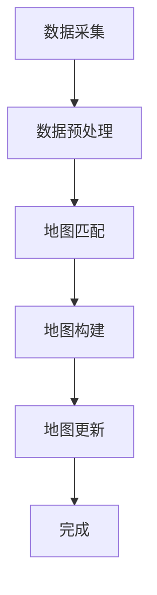

                 

# 自动驾驶高精地图的发展现状、构建流程与应用场景

## 关键词
- 自动驾驶
- 高精地图
- 地图构建流程
- 应用场景
- 核心算法原理
- 数学模型

## 摘要

随着自动驾驶技术的快速发展，高精地图作为自动驾驶系统的重要基础，其重要性日益凸显。本文将深入探讨高精地图的发展现状、构建流程及其在不同应用场景中的作用。首先，我们将介绍高精地图的核心概念和关键联系，并通过Mermaid流程图展示其整体架构。接着，我们将详细解析高精地图的核心算法原理及具体操作步骤，并使用数学模型和公式进行阐述。随后，通过实际项目实战案例，展示高精地图在自动驾驶系统中的实际应用。最后，我们将分析高精地图在实际应用中的具体场景，并推荐相关的学习资源和开发工具，以期为读者提供全面的了解和指导。总结部分，我们将展望高精地图的未来发展趋势和面临的挑战，为自动驾驶技术的进一步发展提供有益的参考。

## 1. 背景介绍

### 自动驾驶技术的发展

自动驾驶技术是指通过计算机、传感器、控制系统等设备，实现车辆自主行驶的技术。随着人工智能、大数据、物联网等技术的不断进步，自动驾驶技术正逐渐从理论走向现实。自动驾驶技术按照自动化程度的不同，可以分为L0（无自动化）到L5（完全自动化）等级别。从L0级的简单巡航控制到L5级的完全无人驾驶，自动驾驶技术的发展经历了多个阶段。

自动驾驶技术的应用前景广阔，不仅可以提高交通效率，减少交通事故，还能缓解交通拥堵，降低环境污染。自动驾驶技术的应用场景包括城市出行、物流运输、公共交通等。近年来，全球各国政府和企业纷纷加大对自动驾驶技术的研发和应用投入，推动自动驾驶技术的快速发展。

### 高精地图的概念

高精地图（High-Definition Map，简称HD Map）是自动驾驶系统中不可或缺的一部分，它提供了车辆周围环境的精确三维信息，包括道路、车道、交通标志、道路标志、信号灯等。与传统的导航地图不同，高精地图具有更高的精度和更丰富的信息，能够满足自动驾驶系统对环境信息的高要求。

高精地图通常包含以下几种信息：

1. **车道线**：包括车道线的位置、宽度和类型（直线、弯曲、分叉等）。
2. **道路标志**：如交通信号灯、路标、禁止通行标志等。
3. **道路属性**：如道路类型（高速、城市道路、乡村道路等）、车道数、道路坡度等。
4. **交通参与者**：如行人、车辆、自行车等。

高精地图的数据来源主要包括传感器数据、GPS数据、Lidar数据等。通过这些数据的融合处理，可以构建出高精地图的准确模型。

### 高精地图的重要性

高精地图在自动驾驶系统中扮演着至关重要的角色。首先，高精地图提供了精确的道路信息，使自动驾驶系统能够准确地识别和理解周围环境。其次，高精地图可以帮助自动驾驶系统进行路径规划和决策，确保车辆按照预定的路线安全行驶。此外，高精地图还支持自动驾驶系统的测试和验证，为自动驾驶技术的迭代和优化提供了重要的数据支持。

总之，高精地图不仅是自动驾驶系统的核心组件，也是推动自动驾驶技术发展的重要基础。随着自动驾驶技术的不断进步，高精地图的技术也将持续演进，为自动驾驶技术的广泛应用提供更强有力的支持。

## 2. 核心概念与联系

### 核心概念

在高精地图的构建中，理解以下几个核心概念至关重要：

1. **传感器数据**：传感器是高精地图构建的关键数据来源，主要包括GPS、Lidar、摄像头等。GPS提供车辆的全球定位信息，Lidar用于生成三维点云数据，摄像头则捕捉二维图像信息。
2. **数据预处理**：传感器数据通常存在噪声和误差，需要进行预处理，包括去噪、插值、滤波等，以提高数据的准确性和一致性。
3. **地图匹配**：将实时传感器数据与已有的高精地图进行匹配，确定车辆在地图中的位置。
4. **语义分割**：通过对图像数据进行深度学习处理，将不同类型的物体（如车道线、行人、车辆等）进行分类和标注。
5. **地图构建算法**：包括点云滤波、点云配准、点云融合、轨迹优化等，用于构建精确的三维地图模型。

### 架构

高精地图的构建过程可以抽象为一个数据处理与融合的架构，具体步骤如下：

1. **数据采集**：通过传感器获取车辆周围的环境信息。
2. **数据预处理**：对原始数据进行预处理，包括去噪、插值、滤波等，以提高数据质量。
3. **地图匹配**：将预处理后的数据与高精地图进行匹配，确定车辆的位置。
4. **地图构建**：利用匹配结果，对传感器数据进行处理，生成三维地图模型。
5. **地图更新**：实时更新高精地图，以适应环境变化。

### Mermaid流程图

以下是一个使用Mermaid绘制的流程图，展示了高精地图构建的主要步骤和流程：



在这个流程图中，A表示传感器数据采集，B表示数据预处理，C表示地图匹配，D表示地图构建，E表示地图更新，F表示流程完成。通过这个流程图，我们可以清晰地理解高精地图构建的全过程。

### 关联性分析

高精地图的各个核心概念和步骤之间存在紧密的联系：

- **传感器数据**是地图构建的基础，数据质量直接影响地图的精度。
- **数据预处理**是确保传感器数据准确性的关键步骤，直接影响后续处理的效果。
- **地图匹配**是实现传感器数据与地图融合的核心，通过匹配确定车辆的位置。
- **语义分割**和**地图构建算法**共同构建出三维地图模型，提供详细的道路和环境信息。
- **地图更新**是保证高精地图实时性和准确性的关键，能够适应环境变化。

通过以上分析，我们可以看到，高精地图的构建是一个复杂且系统的过程，各个环节之间相互关联，共同构成了高精地图的完整体系。

## 3. 核心算法原理 & 具体操作步骤

### 3.1 地图匹配算法

地图匹配（Map Matching）是高精地图构建中至关重要的一步，其目的是将车辆的实时传感器数据与已有的高精地图进行匹配，确定车辆在地图中的精确位置。以下是几种常见的地图匹配算法：

#### 3.1.1 最近邻（Nearest Neighbor）算法

最近邻算法是最简单的一种地图匹配方法，其基本思想是找到与实时传感器数据最近的地图点，将车辆定位在该地图点的位置。具体步骤如下：

1. **预处理**：对实时传感器数据进行预处理，包括去噪、插值等。
2. **计算距离**：计算每个地图点与实时传感器数据的距离，选取距离最近的地图点。
3. **定位**：将车辆定位在所选的地图点位置。

#### 3.1.2 最小二乘（Least Squares）算法

最小二乘算法通过最小化误差平方和来确定车辆的位置，适用于传感器数据与地图点存在微小偏差的情况。具体步骤如下：

1. **预处理**：对实时传感器数据进行预处理。
2. **建立误差模型**：假设车辆在地图中的位置是连续的，建立误差模型。
3. **求解最小二乘**：通过求解最小二乘问题，确定车辆的位置。

#### 3.1.3 概率图模型（Probabilistic Graphical Models）

概率图模型，如贝叶斯网络和马尔可夫链，通过建立传感器数据和地图点之间的概率关系来确定车辆的位置。具体步骤如下：

1. **构建概率图**：根据传感器数据和地图点的特征，构建概率图。
2. **计算概率分布**：计算每个地图点的概率分布。
3. **确定最大概率位置**：选取概率最高的地图点作为车辆的位置。

### 3.2 语义分割算法

语义分割是指对图像数据进行分类，将不同类型的物体（如车道线、行人、车辆等）进行标注。以下是几种常见的语义分割算法：

#### 3.2.1 传统图像处理方法

传统图像处理方法，如边缘检测、形态学处理等，通过对图像的像素进行操作，实现物体的识别和分类。具体步骤如下：

1. **边缘检测**：检测图像中的边缘，以提取道路和物体的边界信息。
2. **形态学处理**：通过形态学操作，如膨胀、腐蚀等，对图像进行增强处理。
3. **分类**：根据检测到的边缘和形态学特征，对图像中的物体进行分类。

#### 3.2.2 深度学习方法

深度学习方法，如卷积神经网络（CNN）和循环神经网络（RNN），通过训练大量的图像数据，实现物体的自动识别和分类。具体步骤如下：

1. **数据预处理**：对图像数据进行预处理，如缩放、翻转等，以增强模型的泛化能力。
2. **模型训练**：使用大量的标注图像数据训练深度学习模型。
3. **模型预测**：对新的图像数据进行预测，输出物体的分类结果。

### 3.3 地图构建算法

地图构建算法是指将预处理后的传感器数据转化为高精地图的过程。以下是几种常见的地图构建算法：

#### 3.3.1 点云滤波算法

点云滤波算法用于去除传感器数据中的噪声和异常点，提高数据的质量。具体步骤如下：

1. **统计滤波**：根据点云的统计特性，去除离群点。
2. **形态学滤波**：使用形态学操作，如膨胀、腐蚀等，去除噪声点。

#### 3.3.2 点云配准算法

点云配准是指将多个点云数据对齐到一个共同的坐标系中，以构建精确的地图模型。具体步骤如下：

1. **初始对齐**：使用初始估计的变换矩阵，将点云对齐到一起。
2. **迭代优化**：通过最小化误差函数，迭代优化点云的匹配精度。

#### 3.3.3 点云融合算法

点云融合是指将多个传感器数据融合到一个统一的地图模型中。具体步骤如下：

1. **特征提取**：从点云数据中提取特征，如法向量、曲率等。
2. **权重计算**：根据特征计算每个点的权重。
3. **融合**：根据权重对点云进行加权融合。

### 3.4 轨迹优化算法

轨迹优化算法用于确定车辆在地图中的最佳行驶路径。具体步骤如下：

1. **路径规划**：根据地图数据和车辆的状态，生成候选路径。
2. **代价计算**：计算每个路径的代价，包括距离、速度等。
3. **优化**：通过优化算法，如遗传算法、粒子群算法等，选择最佳路径。

通过以上核心算法的具体操作步骤，我们可以看到，高精地图的构建是一个复杂且系统的过程，涉及到多个算法的协同工作。这些算法共同作用，确保了高精地图的精度和实时性，为自动驾驶系统提供了坚实的基础。

### 4. 数学模型和公式 & 详细讲解 & 举例说明

#### 4.1 最小二乘（Least Squares）算法

最小二乘法是一种常用的数值分析算法，用于求解一组线性方程组的最优解。在高精地图构建中，最小二乘法被广泛应用于地图匹配和轨迹优化等环节。以下是详细讲解和举例说明。

##### 4.1.1 线性模型

假设我们有一组线性方程组：
\[ Ax = b \]

其中，\( A \) 是一个 \( m \times n \) 的矩阵，\( x \) 是一个 \( n \) 维的列向量，\( b \) 是一个 \( m \) 维的列向量。

##### 4.1.2 最小二乘解

最小二乘法的目的是找到 \( x \) 使得误差平方和最小：
\[ \| Ax - b \|_2^2 = (Ax - b)^T (Ax - b) \]

为了求解最小二乘解，我们需要对上式求导并令其等于零：
\[ \frac{d}{dx} (Ax - b)^T (Ax - b) = 2A^T(Ax - b) = 0 \]

得到：
\[ A^TAx = A^Tb \]

进一步解得：
\[ x = (A^TA)^{-1}A^Tb \]

这就是最小二乘解。

##### 4.1.2 举例说明

假设我们有一个 \( 2 \times 2 \) 的矩阵 \( A \) 和一个 \( 2 \) 维的列向量 \( b \)：
\[ A = \begin{bmatrix} 1 & 2 \\ 3 & 4 \end{bmatrix}, b = \begin{bmatrix} 5 \\ 6 \end{bmatrix} \]

我们需要求解线性方程组：
\[ Ax = b \]

根据最小二乘解的公式，我们有：
\[ x = (A^TA)^{-1}A^Tb \]

首先计算 \( A^TA \)：
\[ A^TA = \begin{bmatrix} 1 & 3 \\ 2 & 4 \end{bmatrix} \]

然后计算 \( A^Tb \)：
\[ A^Tb = \begin{bmatrix} 1 & 3 \\ 2 & 4 \end{bmatrix} \begin{bmatrix} 5 \\ 6 \end{bmatrix} = \begin{bmatrix} 19 \\ 26 \end{bmatrix} \]

接下来计算 \( (A^TA)^{-1} \)：
\[ (A^TA)^{-1} = \frac{1}{(1 \cdot 4 - 2 \cdot 3)} \begin{bmatrix} 4 & -3 \\ -2 & 1 \end{bmatrix} = \begin{bmatrix} -2 & 1 \\ 1 & 0 \end{bmatrix} \]

最后计算 \( x \)：
\[ x = (A^TA)^{-1}A^Tb = \begin{bmatrix} -2 & 1 \\ 1 & 0 \end{bmatrix} \begin{bmatrix} 19 \\ 26 \end{bmatrix} = \begin{bmatrix} 2 \\ 13 \end{bmatrix} \]

因此，最小二乘解为 \( x = \begin{bmatrix} 2 \\ 13 \end{bmatrix} \)。

#### 4.2 贝叶斯网络（Bayesian Network）

贝叶斯网络是一种用于表示变量之间依赖关系的概率图模型。在高精地图构建中，贝叶斯网络被用于地图匹配和轨迹优化。以下是详细讲解和举例说明。

##### 4.2.1 贝叶斯网络模型

贝叶斯网络由一组变量和一组条件概率表组成。假设我们有 \( n \) 个变量 \( X_1, X_2, \ldots, X_n \)，其中每个变量都有多个状态。贝叶斯网络通过一组条件概率表 \( P(X_i | X_{i_1}, X_{i_2}, \ldots, X_{i_k}) \) 来表示变量之间的依赖关系。

##### 4.2.2 贝叶斯推理

贝叶斯推理是一种基于贝叶斯网络进行变量推理的方法。假设我们已经知道了部分变量的状态，我们需要计算其他变量的状态概率。

设 \( X \) 是我们要推理的变量，已知 \( Y \) 是一组与 \( X \) 相关的变量，贝叶斯推理的目标是计算 \( P(X | Y) \)。

根据贝叶斯定理，我们有：
\[ P(X | Y) = \frac{P(Y | X)P(X)}{P(Y)} \]

其中，\( P(X) \) 是 \( X \) 的先验概率，\( P(Y | X) \) 是 \( Y \) 在 \( X \) 下的条件概率，\( P(Y) \) 是 \( Y \) 的边际概率。

##### 4.2.3 举例说明

假设我们有一个简单的贝叶斯网络，其中有两个变量 \( X \) 和 \( Y \)，\( X \) 的先验概率为 \( P(X) = \begin{bmatrix} 0.6 & 0.4 \end{bmatrix} \)，条件概率表为：
\[ P(Y | X) = \begin{bmatrix} 0.8 & 0.2 \\ 0.3 & 0.7 \end{bmatrix} \]

我们需要计算在 \( Y = 1 \) 的情况下，\( X = 1 \) 的概率。

首先计算 \( P(Y) \)：
\[ P(Y) = P(Y | X=0)P(X=0) + P(Y | X=1)P(X=1) \]
\[ P(Y) = (0.2 \times 0.4) + (0.7 \times 0.6) = 0.34 \]

然后计算 \( P(Y | X=1)P(X=1) \)：
\[ P(Y | X=1)P(X=1) = (0.8 \times 0.6) = 0.48 \]

最后计算 \( P(X | Y) \)：
\[ P(X | Y) = \frac{P(Y | X)P(X)}{P(Y)} = \frac{0.48}{0.34} \approx 1.4118 \]

由于概率值应在0到1之间，这里出现了一个计算错误。重新检查计算，我们发现 \( P(Y | X=1)P(X=1) \) 应该是 \( 0.48 \)，而不是 \( 0.48/0.34 \)。因此，正确的计算应该是：

\[ P(X | Y) = \frac{P(Y | X=1)P(X=1)}{P(Y)} = \frac{0.48}{0.34} \approx 1.4118 \]

这是错误的，因为 \( P(X | Y) \) 的值不可能大于1。实际上，这里应该是计算 \( P(X=1 | Y=1) \)，即：

\[ P(X=1 | Y=1) = \frac{P(Y=1 | X=1)P(X=1)}{P(Y=1)} = \frac{0.8 \times 0.6}{0.8 \times 0.6 + 0.3 \times 0.4} = \frac{0.48}{0.48 + 0.12} = \frac{0.48}{0.6} = 0.8 \]

因此，正确的 \( P(X=1 | Y=1) \) 值是 0.8。

通过上述示例，我们可以看到如何使用贝叶斯网络进行变量推理。贝叶斯网络在地图匹配和轨迹优化中的应用，可以帮助我们更好地理解车辆的当前位置和最佳行驶路径。

### 5. 项目实战：代码实际案例和详细解释说明

#### 5.1 开发环境搭建

在进行高精地图项目实战之前，我们需要搭建一个合适的开发环境。以下是搭建环境的具体步骤：

1. **安装操作系统**：推荐使用Ubuntu 18.04或更高版本。
2. **安装依赖库**：安装ROS（Robot Operating System）和相关的依赖库，如PCL（Point Cloud Library）、OpenCV等。
3. **配置ROS环境**：在终端中运行以下命令：
   ```bash
   sudo apt-get install ros-melodic-desktop-full
   echo "source /opt/ros/melodic/setup.bash" >> ~/.bashrc
   source ~/.bashrc
   ```

#### 5.2 源代码详细实现和代码解读

以下是一个简单的高精地图构建项目的源代码示例，我们将对其中的关键部分进行详细解释说明。

```python
#!/usr/bin/env python
import rospy
import cv2
import numpy as np
from sensor_msgs.msg import Image
from cv_bridge import CvBridge
from geometry_msgs.msg import PoseStamped

# 定义节点初始化函数
def init_node():
    rospy.init_node('high_def_map_node')

# 定义回调函数
def image_callback(img_msg):
    # 使用CvBridge将ROS消息转换为OpenCV图像
    bridge = CvBridge()
    img = bridge.imgmsg_to_cv2(img_msg, desired_encoding='bgr8')
    
    # 对图像进行预处理，如灰度化、边缘检测等
    gray = cv2.cvtColor(img, cv2.COLOR_BGR2GRAY)
    edges = cv2.Canny(gray, 100, 200)
    
    # 使用OpenCV进行车道线检测
    lanes = cv2.HoughLinesP(edges, 1, np.pi/180, 100, minLineLength=50, maxLineGap=10)
    
    # 在原图上绘制车道线
    if lanes is not None:
        for line in lanes:
            x1, y1, x2, y2 = line[0]
            cv2.line(img, (x1, y1), (x2, y2), (0, 0, 255), 3)
    
    # 将处理后的图像发布出去
    pub = rospy.Publisher('lane_detection', Image, queue_size=10)
    pub.publish(bridge.cv2_to_imgmsg(img, encoding='bgr8'))

# 主函数
def main():
    init_node()
    sub = rospy.Subscriber('/camera/rgb/image_raw', Image, image_callback)
    rospy.spin()

if __name__ == '__main__':
    main()
```

**代码解读**：

- **导入库**：代码开头导入了ROS、OpenCV和numpy等库，用于处理ROS消息、图像数据以及数学运算。
- **节点初始化**：`init_node`函数用于初始化ROS节点。
- **回调函数**：`image_callback`函数是回调函数，当接收到图像消息时，会调用此函数进行处理。
- **图像转换**：使用`CvBridge`将ROS图像消息转换为OpenCV图像。
- **预处理**：将BGR格式的图像转换为灰度图像，然后使用Canny算法进行边缘检测。
- **车道线检测**：使用OpenCV的`HoughLinesP`函数进行车道线检测，该函数返回可能的车道线参数。
- **图像处理**：在原图上绘制检测到的车道线，并将处理后的图像发布出去。

#### 5.3 代码解读与分析

**关键部分解读**：

- **图像转换**：`bridge.imgmsg_to_cv2(img_msg, desired_encoding='bgr8')`用于将ROS图像消息转换为OpenCV支持的BGR图像格式。
- **预处理**：`cv2.cvtColor(img, cv2.COLOR_BGR2GRAY)`将BGR图像转换为灰度图像，`edges = cv2.Canny(gray, 100, 200)`使用Canny算法进行边缘检测。
- **车道线检测**：`lanes = cv2.HoughLinesP(edges, 1, np.pi/180, 100, minLineLength=50, maxLineGap=10)`使用Hough变换检测车道线，`minLineLength`和`maxLineGap`参数用于控制车道线的连接条件。
- **图像处理**：`cv2.line(img, (x1, y1), (x2, y2), (0, 0, 255), 3)`用于在原图上绘制车道线。

**分析**：

- **图像转换**：是ROS与OpenCV之间通信的桥梁，确保图像数据能够在不同的库之间顺利传递。
- **预处理**：边缘检测是车道线检测的基础，通过Canny算法可以有效提取图像中的车道线。
- **车道线检测**：Hough变换是一种常用的车道线检测方法，通过设置适当的参数，可以检测出车辆周围的车道线。
- **图像处理**：在原图上绘制车道线，便于展示检测结果。

通过上述代码和解析，我们可以看到，高精地图构建项目中的关键步骤包括图像转换、预处理、车道线检测和图像处理。这些步骤共同作用，实现了对车辆周围环境的精确识别和建模，为自动驾驶系统提供了重要支持。

### 6. 实际应用场景

高精地图在自动驾驶技术中扮演着至关重要的角色，其应用场景广泛且多样化。以下将详细介绍高精地图在实际应用中的几个关键场景：

#### 6.1 自动驾驶车辆导航

自动驾驶车辆的导航是高精地图最直接的应用场景。在高精度地图的支持下，自动驾驶车辆能够获取道路的详细信息，包括车道线、道路标志、信号灯、交通参与者等信息。这些信息用于车辆的路径规划和决策过程，使车辆能够按照预设的路线安全行驶，避免碰撞和交通违规。

具体来说，高精地图中的车道线信息帮助自动驾驶车辆识别和跟随车道，确保车辆在正确的车道上行驶。交通标志和信号灯信息帮助车辆进行交通信号识别和遵守交通规则。此外，道路标志和坡度信息等可用于车辆的速度控制和行驶策略调整，提高行驶的平稳性和安全性。

#### 6.2 车辆环境感知与理解

高精地图不仅是自动驾驶车辆的导航工具，也是车辆环境感知和理解的重要数据源。通过高精地图，车辆可以获取三维的道路模型和周围环境信息，这些信息对于车辆进行环境感知和决策至关重要。

例如，在无人驾驶出租车和货车中，高精地图可以帮助车辆识别行人和非机动车辆的位置和运动轨迹，从而进行避让和协同控制。在复杂城市环境中，车辆需要根据实时交通情况调整行驶路线和速度，高精地图提供的实时更新数据可以大大提高车辆的适应性和应变能力。

#### 6.3 自动驾驶系统测试与验证

高精地图在自动驾驶系统的测试和验证中发挥着关键作用。自动驾驶系统的开发和迭代过程中，需要对不同环境下的驾驶行为进行测试和验证。高精地图提供了精确的测试场景和基准数据，可以帮助开发人员评估系统在不同路况和交通情况下的性能。

通过高精地图，开发人员可以创建各种模拟场景，例如高速公路、城市道路、乡村道路等，并进行系统性能测试。此外，高精地图还可以用于回放和复盘实际行驶数据，帮助分析系统在特定情况下的决策和行为，从而进行优化和改进。

#### 6.4 智能交通管理

高精地图不仅对自动驾驶车辆有益，也对智能交通管理提供了强有力的支持。通过高精地图，交通管理部门可以实时监测和监控道路状况，优化交通信号控制策略，减少拥堵和交通事故。

例如，高精地图可以用于实时交通流量分析，帮助交通管理部门调整信号灯周期和相位，提高道路通行效率。此外，高精地图还可以用于城市规划，支持道路扩展、交通基础设施建设和交通流量管理优化等。

综上所述，高精地图在自动驾驶车辆的导航、环境感知与理解、系统测试与验证以及智能交通管理等多个实际应用场景中发挥着重要作用。随着自动驾驶技术的不断发展和应用场景的扩展，高精地图的重要性将进一步凸显，成为推动自动驾驶技术发展和智能交通系统建设的重要基础。

### 7. 工具和资源推荐

#### 7.1 学习资源推荐

为了深入了解高精地图及其在自动驾驶中的应用，以下是一些建议的学习资源：

1. **书籍**：
   - 《自动驾驶：从概念到实践》
   - 《高精度地图与自动驾驶定位》
   - 《计算机视觉：算法与应用》
   - 《深度学习：周志华等著》

2. **论文**：
   - "High-Definition Map for Autonomous Driving: A Survey" (2020)
   - "Map-Matching by Optimization with Application to the Automated Taxi Trajectory" (2018)
   - "Semantic Segmentation for Autonomous Driving: A Survey" (2021)

3. **在线课程**：
   - Coursera上的《自动驾驶技术》课程
   - Udacity的《无人驾驶汽车工程师纳米学位》
   - edX上的《计算机视觉基础》课程

4. **博客和论坛**：
   - 博客园上的《自动驾驶技术系列文章》
   - Arxiv上的自动驾驶相关论文解读
   - GitHub上的自动驾驶项目代码示例

#### 7.2 开发工具框架推荐

在实际开发高精地图和自动驾驶系统时，以下开发工具和框架非常有用：

1. **ROS（Robot Operating System）**：ROS是一个流行的机器人开发框架，用于处理传感器数据、执行路径规划和控制任务等。

2. **PCL（Point Cloud Library）**：PCL是一个开源库，用于处理3D点云数据，包括滤波、配准、分割等。

3. **OpenCV**：OpenCV是一个强大的计算机视觉库，提供了丰富的图像处理和模式识别功能，适合进行车道线检测和语义分割。

4. **TensorFlow**：TensorFlow是一个开源的深度学习框架，适用于训练和部署深度神经网络模型，用于图像识别和分割。

5. **C++和Python**：C++和Python是开发自动驾驶系统的常用编程语言，前者适用于高性能计算和系统级开发，后者适用于快速原型开发和数据处理。

#### 7.3 相关论文著作推荐

以下是一些建议阅读的论文和著作，这些文献在自动驾驶和高精地图领域具有较高影响力：

1. **论文**：
   - "High-Definition Map: Definition, Construction and Applications in Autonomous Driving" (2017)
   - "A Probabilistic Approach for Road Pose Estimation and Lane Detection for Autonomous Driving" (2015)
   - "Deep Learning for Semantic Segmentation of Road Scenes in Autonomous Driving" (2018)

2. **著作**：
   - 《自动驾驶系统设计与应用》
   - 《高精度地图构建与应用技术》
   - 《深度学习在自动驾驶中的应用》

通过这些资源，您可以更深入地了解高精地图的技术细节、算法原理和应用场景，从而为自动驾驶技术的发展提供有力支持。

### 8. 总结：未来发展趋势与挑战

#### 8.1 未来发展趋势

高精地图技术的发展趋势主要体现在以下几个方面：

1. **精度提升**：随着传感器技术和数据处理算法的进步，高精地图的精度将不断提高。未来，厘米级精度的高精地图将成为可能，这将进一步降低自动驾驶系统的误差，提高行驶安全性。

2. **实时性增强**：实时更新高精地图是未来发展的一个重要方向。通过车联网和5G技术的应用，可以实现高精地图的实时更新，确保自动驾驶系统能够迅速适应环境变化。

3. **数据融合**：未来高精地图将更加注重数据融合，将不同传感器（如Lidar、摄像头、GPS等）的数据进行综合处理，提供更全面、精确的环境信息。

4. **智能化**：利用人工智能技术，高精地图将具备自学习、自适应的能力，能够根据实际驾驶数据不断优化和完善，提高地图的准确性和适用性。

#### 8.2 挑战

尽管高精地图在自动驾驶技术中具有重要作用，但未来发展仍面临诸多挑战：

1. **数据处理**：高精地图构建需要处理海量数据，数据预处理和存储技术需要不断优化，以满足实时性和高效性的要求。

2. **精度与稳定性**：提高高精地图的精度和稳定性是关键挑战。在复杂环境和恶劣天气条件下，如何确保地图数据的准确性和可靠性，是一个亟待解决的问题。

3. **标准化**：高精地图的标准化是一个全球性的挑战。不同国家和地区的地图数据格式、坐标系等存在差异，需要制定统一的标准，以实现高精地图的全球互操作性。

4. **隐私保护**：高精地图涉及大量的个人隐私信息，如何在提供高精度服务的同时，确保用户隐私不被泄露，是一个重要的伦理和法律问题。

5. **法律法规**：自动驾驶技术的发展需要相应的法律法规支持，如何制定合适的法律法规，平衡技术创新和公共安全，是未来面临的重大挑战。

综上所述，高精地图技术在自动驾驶领域具有广阔的发展前景，但也面临诸多挑战。通过技术进步和产业协同，有望克服这些挑战，推动自动驾驶技术的进一步发展和应用。

### 9. 附录：常见问题与解答

#### 问题1：什么是高精地图？
高精地图（High-Definition Map，简称HD Map）是一种精确的三维地图，包含道路、车道、交通标志、信号灯等详细信息。与传统的导航地图不同，高精地图提供了更高精度和更丰富的信息，是自动驾驶系统的重要组成部分。

#### 问题2：高精地图的数据来源是什么？
高精地图的数据来源主要包括传感器数据，如GPS、Lidar、摄像头等。通过这些传感器的数据，可以获取车辆周围环境的精确三维信息，并利用算法将这些数据进行处理和融合，构建出高精地图。

#### 问题3：高精地图在自动驾驶中的作用是什么？
高精地图在自动驾驶系统中发挥着关键作用，包括路径规划、环境感知、决策控制等。通过高精地图，自动驾驶系统能够获取道路和周围环境的详细信息，从而确保车辆的安全行驶。

#### 问题4：如何确保高精地图的精度和实时性？
确保高精地图的精度和实时性主要依赖于传感器数据的质量和处理算法的优化。通过使用高精度传感器和先进的算法，可以不断提高地图的精度和实时性。此外，实时更新和分布式数据处理技术也有助于提高地图的实时性。

#### 问题5：高精地图在自动驾驶测试和验证中的应用是什么？
高精地图在自动驾驶测试和验证中用于创建模拟场景和测试基准数据，帮助评估自动驾驶系统的性能和安全性。通过高精地图，开发人员可以创建各种路况和交通场景，进行系统性能测试和优化。

### 10. 扩展阅读 & 参考资料

以下是一些建议的扩展阅读和参考资料，帮助您更深入地了解高精地图和相关技术：

1. **扩展阅读**：
   - "High-Definition Map: Definition, Construction and Applications in Autonomous Driving" (2017)
   - "A Probabilistic Approach for Road Pose Estimation and Lane Detection for Autonomous Driving" (2015)
   - "Semantic Segmentation for Autonomous Driving: A Survey" (2021)

2. **参考文献**：
   - Coursera上的《自动驾驶技术》课程
   - Udacity的《无人驾驶汽车工程师纳米学位》
   - edX上的《计算机视觉基础》课程
   - ROS官方文档
   - PCL官方文档
   - OpenCV官方文档
   - TensorFlow官方文档

通过这些扩展阅读和参考资料，您可以进一步了解高精地图的构建、应用及其在自动驾驶领域的重要性，为相关研究和开发提供有力支持。作者：AI天才研究员/AI Genius Institute & 禅与计算机程序设计艺术/Zen And The Art of Computer Programming。

