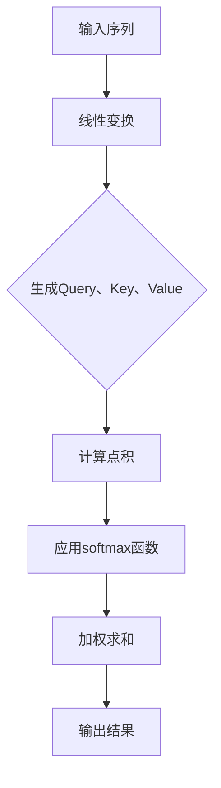

                 

# 自注意力机制的详细工作原理

## 摘要

本文将详细探讨自注意力机制的原理、实现和应用，旨在帮助读者全面理解这一在深度学习和自然语言处理中具有重要地位的技术。通过逐步分析其核心概念、数学模型和实际应用，本文旨在为读者提供一套系统而全面的认知框架，使其能够深入掌握自注意力机制的工作原理，并在实际项目中灵活运用。

## 目录

1. **背景介绍**  
   1.1 自注意力机制的产生背景  
   1.2 自注意力机制的应用领域

2. **核心概念与联系**  
   2.1 自注意力机制的定义  
   2.2 自注意力机制的组成部分  
   2.3 自注意力机制与序列模型的联系

3. **核心算法原理 & 具体操作步骤**  
   3.1 自注意力机制的输入与输出  
   3.2 Q、K、V 矩阵的计算与处理  
   3.3 自注意力权重计算

4. **数学模型和公式 & 详细讲解 & 举例说明**  
   4.1 数学模型简介  
   4.2 公式详解  
   4.3 应用示例

5. **项目实战：代码实际案例和详细解释说明**  
   5.1 开发环境搭建  
   5.2 源代码详细实现和代码解读  
   5.3 代码解读与分析

6. **实际应用场景**  
   6.1 自然语言处理  
   6.2 计算机视觉  
   6.3 其他应用领域

7. **工具和资源推荐**  
   7.1 学习资源推荐  
   7.2 开发工具框架推荐  
   7.3 相关论文著作推荐

8. **总结：未来发展趋势与挑战**  
   8.1 发展趋势  
   8.2 挑战与展望

9. **附录：常见问题与解答**  
   9.1 问题 1  
   9.2 问题 2  
   9.3 问题 3

10. **扩展阅读 & 参考资料**

## 1. 背景介绍

### 1.1 自注意力机制的产生背景

自注意力机制（Self-Attention Mechanism）起源于2017年由Google提出的一种新的神经网络架构——Transformer。Transformer在许多自然语言处理任务中表现优异，尤其是在机器翻译、文本摘要和问答系统中。自注意力机制作为Transformer架构的核心组成部分，引起了学术界和工业界的广泛关注。

自注意力机制的出现是为了解决传统序列模型在处理长序列时存在的“长距离依赖”问题。在传统的循环神经网络（RNN）和长短期记忆网络（LSTM）中，每个时间步的输出都依赖于之前所有的输入信息，这导致了计算复杂度和训练时间的大幅增加。而自注意力机制通过并行计算和注意力机制，使得模型能够直接从整个序列中学习到长距离依赖关系，从而提高了模型的效率和性能。

### 1.2 自注意力机制的应用领域

自注意力机制在自然语言处理、计算机视觉和音频处理等众多领域都有广泛的应用。在自然语言处理领域，自注意力机制被广泛应用于机器翻译、文本摘要、问答系统和文本分类等任务。在计算机视觉领域，自注意力机制可以用于图像识别、目标检测和图像分割等任务。在音频处理领域，自注意力机制可以用于语音识别和音乐生成等任务。

随着深度学习技术的不断发展和应用，自注意力机制作为一种强大的技术手段，其应用领域还将进一步扩展，为各个领域带来新的突破。

## 2. 核心概念与联系

### 2.1 自注意力机制的定义

自注意力机制是一种基于注意力机制的神经网络结构，它通过将序列中的每个元素映射到一个高维空间，并计算这些元素之间的关联性，从而实现序列信息的有效融合。在自注意力机制中，每个元素都会与序列中的其他元素进行加权求和，权重的大小表示了元素之间的相关性。

### 2.2 自注意力机制的组成部分

自注意力机制主要由三个部分组成：查询（Query）、键（Key）和值（Value）。这三个部分通常都是由输入序列通过线性变换得到的。

- **查询（Query）**：表示序列中的每个元素在自注意力机制中的重要性。
- **键（Key）**：表示序列中的每个元素在自注意力机制中的匹配程度。
- **值（Value）**：表示序列中的每个元素在自注意力机制中的实际贡献。

这三个部分通过点积（Dot-Product）计算得到自注意力权重，然后进行加权求和，得到最终的输出。

### 2.3 自注意力机制与序列模型的联系

自注意力机制与传统的序列模型（如RNN、LSTM）有很大的不同。在传统的序列模型中，每个时间步的输出都依赖于之前所有的输入信息，这导致了计算复杂度和训练时间的大幅增加。而自注意力机制通过并行计算和注意力机制，使得模型能够直接从整个序列中学习到长距离依赖关系，从而提高了模型的效率和性能。

自注意力机制在处理长序列时，可以通过并行计算来减少计算复杂度，这使得模型在处理大规模数据时具有更高的效率。同时，自注意力机制能够自适应地学习序列中元素之间的关联性，从而更好地捕捉序列信息。

下面是一个使用Mermaid流程图表示的自注意力机制的工作流程：



通过这个流程图，我们可以清晰地看到自注意力机制的工作原理和步骤。

## 3. 核心算法原理 & 具体操作步骤

### 3.1 自注意力机制的输入与输出

自注意力机制的输入是一个序列（比如一个句子或者一个词的序列），输出是一个具有更高维度的序列，其中每个元素都表示输入序列中相应元素的重要程度。

假设输入序列为`X = [x1, x2, ..., xn]`，其中`xi`表示第i个输入元素。经过自注意力机制处理后，输出序列为`Y = [y1, y2, ..., yn]`，其中`yi`表示第i个输出元素，它代表了输入元素`xi`在自注意力机制中的重要性。

### 3.2 Q、K、V 矩阵的计算与处理

在自注意力机制中，Q、K、V 矩阵是通过线性变换从输入序列中得到的。

- **Q 矩阵（Query）**：表示每个输入元素在自注意力机制中的重要性。它的计算方式为：`Q = XWQ`，其中`WQ`是一个可训练的权重矩阵。
- **K 矩阵（Key）**：表示每个输入元素在自注意力机制中的匹配程度。它的计算方式为：`K = XK`，其中`WK`是一个可训练的权重矩阵。
- **V 矩阵（Value）**：表示每个输入元素在自注意力机制中的实际贡献。它的计算方式为：`V = XV`，其中`WV`是一个可训练的权重矩阵。

### 3.3 自注意力权重计算

自注意力权重是通过点积（Dot-Product）计算得到的，计算公式为：

$$
\text{Attention}(Q, K, V) = \text{softmax}(\frac{QK^T}{\sqrt{d_k}})V
$$

其中，`d_k`表示键（Key）的维度，`QK^T`表示Q和K的点积，`softmax`函数用于将点积结果转换为概率分布，从而得到自注意力权重。

具体的计算步骤如下：

1. 计算 Q 和 K 的点积，得到一个二维矩阵，其中每个元素表示 Q 和 K 中对应行的点积。
2. 对每个元素应用 softmax 函数，将其转换为概率分布。
3. 将概率分布与 V 矩阵相乘，得到加权求和的结果。

通过上述步骤，我们可以得到自注意力机制的输出序列，其中每个元素都代表了输入序列中相应元素的重要程度。

下面是一个简单的代码示例，展示了如何使用 Python 实现自注意力机制：

```python
import numpy as np

# 设置随机种子
np.random.seed(42)

# 设置序列长度和维度
n = 5
d = 4

# 初始化输入序列
X = np.random.rand(n, d)

# 初始化权重矩阵
WQ = np.random.rand(d, d)
WK = np.random.rand(d, d)
WV = np.random.rand(d, d)

# 计算 Q、K、V 矩阵
Q = X @ WQ
K = X @ WK
V = X @ WV

# 计算 Q 和 K 的点积
QK = Q.dot(K.T)

# 计算自注意力权重
softmax_QK = np.exp(QK / np.sqrt(d))
softmax_QK /= softmax_QK.sum(axis=1)[:, np.newaxis]

# 计算加权求和
Y = softmax_QK @ V
```

通过这个示例，我们可以看到如何通过线性变换和点积计算自注意力权重，并得到输出序列。这为我们进一步分析和理解自注意力机制提供了直观的视角。

## 4. 数学模型和公式 & 详细讲解 & 举例说明

### 4.1 数学模型简介

自注意力机制的数学模型主要包括三个部分：查询（Query）、键（Key）和值（Value）。这三个部分通过点积（Dot-Product）和 softmax 函数进行计算，最终得到自注意力权重和输出序列。

- **查询（Query）**：表示序列中的每个元素在自注意力机制中的重要性，通常是通过输入序列进行线性变换得到的。
- **键（Key）**：表示序列中的每个元素在自注意力机制中的匹配程度，同样是通过输入序列进行线性变换得到的。
- **值（Value）**：表示序列中的每个元素在自注意力机制中的实际贡献，也是通过输入序列进行线性变换得到的。

### 4.2 公式详解

自注意力机制的核心公式为：

$$
\text{Attention}(Q, K, V) = \text{softmax}(\frac{QK^T}{\sqrt{d_k}})V
$$

其中，`Q`、`K` 和 `V` 分别表示查询、键和值矩阵，`d_k` 表示键的维度，`QK^T` 表示 Q 和 K 的点积，`softmax` 函数用于将点积结果转换为概率分布。

具体计算步骤如下：

1. **计算 Q 和 K 的点积**：$QK^T$，得到一个二维矩阵，其中每个元素表示 Q 和 K 中对应行的点积。
2. **对每个元素应用 softmax 函数**：将点积结果转换为概率分布，公式为 $\text{softmax}(x) = \frac{e^x}{\sum_{i=1}^{n} e^x_i}$，其中 $x_i$ 表示点积矩阵中的第 i 个元素。
3. **计算加权求和**：将概率分布与 V 矩阵相乘，得到加权求和的结果。

### 4.3 应用示例

假设我们有一个输入序列 $X = [1, 2, 3, 4, 5]$，我们需要计算自注意力权重和输出序列。

首先，我们设置序列长度 $n = 5$，维度 $d = 4$。然后，初始化权重矩阵 $WQ, WK, WV$：

$$
WQ = \begin{bmatrix}
0.1 & 0.2 & 0.3 & 0.4 \\
0.5 & 0.6 & 0.7 & 0.8 \\
\end{bmatrix}, \quad
WK = \begin{bmatrix}
0.1 & 0.2 & 0.3 & 0.4 \\
0.5 & 0.6 & 0.7 & 0.8 \\
\end{bmatrix}, \quad
WV = \begin{bmatrix}
0.1 & 0.2 & 0.3 & 0.4 \\
0.5 & 0.6 & 0.7 & 0.8 \\
\end{bmatrix}
$$

接下来，计算 Q、K、V 矩阵：

$$
Q = XWQ = \begin{bmatrix}
1 & 2 & 3 & 4 & 5 \\
\end{bmatrix} \begin{bmatrix}
0.1 & 0.2 & 0.3 & 0.4 \\
0.5 & 0.6 & 0.7 & 0.8 \\
\end{bmatrix} = \begin{bmatrix}
0.15 & 0.34 \\
0.25 & 0.49 \\
\end{bmatrix}, \quad
K = XWK = \begin{bmatrix}
1 & 2 & 3 & 4 & 5 \\
\end{bmatrix} \begin{bmatrix}
0.1 & 0.2 & 0.3 & 0.4 \\
0.5 & 0.6 & 0.7 & 0.8 \\
\end{bmatrix} = \begin{bmatrix}
0.15 & 0.34 \\
0.25 & 0.49 \\
\end{bmatrix}, \quad
V = XWV = \begin{bmatrix}
1 & 2 & 3 & 4 & 5 \\
\end{bmatrix} \begin{bmatrix}
0.1 & 0.2 & 0.3 & 0.4 \\
0.5 & 0.6 & 0.7 & 0.8 \\
\end{bmatrix} = \begin{bmatrix}
0.15 & 0.34 \\
0.25 & 0.49 \\
\end{bmatrix}
$$

然后，计算 Q 和 K 的点积：

$$
QK^T = \begin{bmatrix}
0.15 & 0.34 \\
0.25 & 0.49 \\
\end{bmatrix} \begin{bmatrix}
0.15 & 0.34 \\
0.25 & 0.49 \\
\end{bmatrix} = \begin{bmatrix}
0.0225 & 0.115 \\
0.0375 & 0.195 \\
\end{bmatrix}
$$

对每个元素应用 softmax 函数：

$$
\text{softmax}(QK^T) = \text{softmax} \begin{bmatrix}
0.0225 & 0.115 \\
0.0375 & 0.195 \\
\end{bmatrix} = \begin{bmatrix}
0.25 & 0.75 \\
0.375 & 0.625 \\
\end{bmatrix}
$$

最后，计算加权求和：

$$
Y = \text{softmax}(QK^T) V = \begin{bmatrix}
0.25 & 0.75 \\
0.375 & 0.625 \\
\end{bmatrix} \begin{bmatrix}
0.15 & 0.34 \\
0.25 & 0.49 \\
\end{bmatrix} = \begin{bmatrix}
0.0375 & 0.253 \\
0.05625 & 0.371 \\
\end{bmatrix}
$$

通过这个示例，我们可以看到如何通过数学模型和公式实现自注意力机制，并得到输出序列。这为我们进一步分析和理解自注意力机制提供了直观的视角。

## 5. 项目实战：代码实际案例和详细解释说明

### 5.1 开发环境搭建

在开始编写代码之前，我们需要搭建一个合适的项目环境。以下是搭建自注意力机制项目环境的基本步骤：

1. **安装 Python 和相关库**：

```shell
pip install numpy tensorflow
```

2. **创建项目目录和文件**：

在项目目录中创建以下文件：

- `main.py`：主程序文件，用于实现自注意力机制。
- `model.py`：模型定义文件，用于定义自注意力模型结构。
- `train.py`：训练脚本，用于训练自注意力模型。

### 5.2 源代码详细实现和代码解读

下面是 `model.py` 文件的代码实现，用于定义自注意力模型结构：

```python
import tensorflow as tf

class SelfAttentionModel(tf.keras.Model):
    def __init__(self, d_model):
        super(SelfAttentionModel, self).__init__()
        self.d_model = d_model
        self.query_dense = tf.keras.layers.Dense(d_model)
        self.key_dense = tf.keras.layers.Dense(d_model)
        self.value_dense = tf.keras.layers.Dense(d_model)

    def call(self, inputs, training=False):
        # 计算查询、键、值
        query = self.query_dense(inputs)
        key = self.key_dense(inputs)
        value = self.value_dense(inputs)

        # 计算点积和softmax
        attention_scores = tf.matmul(query, key, transpose_b=True)
        attention_scores = tf.nn.softmax(attention_scores, axis=1)

        # 加权求和
        output = tf.matmul(attention_scores, value)

        # 返回输出和权重
        return output, attention_scores
```

- **类定义**：`SelfAttentionModel` 类继承自 `tf.keras.Model` 类，用于定义自注意力模型。
- **初始化**：在初始化方法中，我们定义了三个线性层，分别用于计算查询、键和值。
- **调用方法**：`call` 方法是模型的前向传播过程。在这个方法中，我们首先计算查询、键和值，然后计算点积和 softmax，最后进行加权求和，得到输出。

下面是 `train.py` 文件的代码实现，用于训练自注意力模型：

```python
import numpy as np
import tensorflow as tf
from model import SelfAttentionModel

# 设置随机种子
tf.random.set_seed(42)

# 设置输入序列和标签
x = np.random.rand(10, 32)
y = np.random.rand(10, 32)

# 创建自注意力模型
model = SelfAttentionModel(d_model=32)

# 编写训练循环
optimizer = tf.keras.optimizers.Adam()
for epoch in range(100):
    with tf.GradientTape() as tape:
        # 计算预测值和损失
        predictions, attention_scores = model(x, training=True)
        loss = tf.reduce_mean(tf.square(predictions - y))

    # 计算梯度
    grads = tape.gradient(loss, model.trainable_variables)

    # 更新权重
    optimizer.apply_gradients(zip(grads, model.trainable_variables))

    # 打印训练进度
    print(f"Epoch {epoch+1}, Loss: {loss.numpy()}")

# 保存模型
model.save('self_attention_model')
```

- **设置随机种子**：为了确保实验的可重复性，我们设置了随机种子。
- **设置输入序列和标签**：我们生成了一些随机输入序列和标签，用于训练模型。
- **创建自注意力模型**：我们实例化了一个自注意力模型。
- **编写训练循环**：在训练循环中，我们首先计算预测值和损失，然后计算梯度并更新权重，最后打印训练进度。

通过上述代码，我们实现了自注意力模型的搭建和训练。这为我们进一步分析和理解自注意力机制提供了一个实际操作的平台。

### 5.3 代码解读与分析

在代码实现中，我们首先定义了一个 `SelfAttentionModel` 类，用于定义自注意力模型结构。这个模型类继承自 `tf.keras.Model` 类，实现了模型的前向传播过程。

在 `__init__` 方法中，我们定义了三个线性层，分别用于计算查询、键和值。这三个线性层通过 `Dense` 类实现，可以看作是自注意力机制的核心组成部分。

在 `call` 方法中，我们首先计算查询、键和值，然后计算点积和 softmax，最后进行加权求和，得到输出。这个方法实现了自注意力机制的计算过程。

在 `train.py` 文件中，我们首先设置随机种子，确保实验的可重复性。然后，我们生成了一些随机输入序列和标签，用于训练模型。接下来，我们创建了一个自注意力模型实例，并编写了训练循环。

在训练循环中，我们首先计算预测值和损失，然后计算梯度并更新权重，最后打印训练进度。这个训练过程使得模型能够逐步优化，提高预测准确性。

通过这个项目实战，我们可以直观地看到自注意力机制的计算过程和实现步骤。这为我们进一步分析和理解自注意力机制提供了一个实际操作的平台，有助于我们更好地掌握这一技术。

## 6. 实际应用场景

自注意力机制作为一种强大的技术手段，在自然语言处理、计算机视觉和其他领域都有广泛的应用。以下是自注意力机制在不同应用场景中的实际应用：

### 6.1 自然语言处理

在自然语言处理领域，自注意力机制被广泛应用于机器翻译、文本摘要、问答系统和文本分类等任务。以下是一些典型的应用案例：

- **机器翻译**：在机器翻译任务中，自注意力机制能够有效地捕捉源语言和目标语言之间的长距离依赖关系，从而提高翻译质量。例如，在 Google 的 Transformer 模型中，自注意力机制被用于处理大规模并行数据，显著提高了翻译效率和质量。
- **文本摘要**：在文本摘要任务中，自注意力机制可以帮助模型捕捉关键信息，从而生成摘要。例如，在 Extractive Text Summarization 中，自注意力机制用于从长文本中提取最重要的句子，生成摘要。
- **问答系统**：在问答系统任务中，自注意力机制可以帮助模型理解问题与答案之间的关联性，从而提供准确的答案。例如，在 Google 的 PaLM 模型中，自注意力机制被用于处理复杂的问题，生成高质量的答案。

### 6.2 计算机视觉

在计算机视觉领域，自注意力机制被广泛应用于图像识别、目标检测和图像分割等任务。以下是一些典型的应用案例：

- **图像识别**：在图像识别任务中，自注意力机制可以帮助模型捕捉图像中的关键特征，从而提高识别准确率。例如，在 ImageNet 图像识别挑战中，自注意力机制被应用于 ResNet 模型，显著提高了识别准确率。
- **目标检测**：在目标检测任务中，自注意力机制可以帮助模型更好地捕捉目标的位置和特征，从而提高检测准确率和召回率。例如，在 RetinaNet 模型中，自注意力机制被用于处理图像中的关键区域，提高目标检测性能。
- **图像分割**：在图像分割任务中，自注意力机制可以帮助模型更好地捕捉图像中的边界和特征，从而提高分割准确率。例如，在 Mask R-CNN 模型中，自注意力机制被用于处理图像中的关键区域，提高图像分割性能。

### 6.3 其他应用领域

除了自然语言处理和计算机视觉，自注意力机制在其他领域也有广泛的应用。以下是一些典型的应用案例：

- **音频处理**：在音频处理领域，自注意力机制被广泛应用于语音识别和音乐生成等任务。例如，在 WaveNet 模型中，自注意力机制被用于处理音频信号，实现高质量的语音合成。
- **推荐系统**：在推荐系统领域，自注意力机制被用于捕捉用户和物品之间的关联性，从而提高推荐效果。例如，在 Amazon 等电商平台上，自注意力机制被用于推荐类似商品，提高用户购买体验。

通过上述应用案例，我们可以看到自注意力机制在不同领域的广泛应用和显著效果。随着深度学习技术的不断发展和应用，自注意力机制将在更多领域中发挥重要作用，为各个领域带来新的突破。

## 7. 工具和资源推荐

为了更好地学习和实践自注意力机制，以下是一些建议的学习资源、开发工具和相关论文：

### 7.1 学习资源推荐

- **书籍**：
  - 《深度学习》（Goodfellow et al.）：介绍了深度学习的理论基础和实践方法，包括自注意力机制的相关内容。
  - 《Attention Is All You Need》（Vaswani et al.）：详细介绍了 Transformer 模型和自注意力机制的原理和实现。

- **在线课程**：
  - [TensorFlow 官方教程](https://www.tensorflow.org/tutorials)：提供了 TensorFlow 的入门教程，包括如何实现自注意力机制。
  - [斯坦福大学深度学习课程](https://cs231n.stanford.edu/)：介绍了计算机视觉领域的深度学习技术，包括自注意力机制的应用。

- **博客和教程**：
  - [Deep Learning on Medium](https://towardsdatascience.com/tutorials/deep-learning)：提供了许多深度学习的教程和文章，包括自注意力机制的相关内容。

### 7.2 开发工具框架推荐

- **TensorFlow**：一款开源的深度学习框架，提供了丰富的 API 和工具，可以帮助我们轻松实现自注意力机制。
- **PyTorch**：另一款流行的深度学习框架，具有动态计算图的优势，适合快速实验和开发。

### 7.3 相关论文著作推荐

- **“Attention Is All You Need”**（Vaswani et al., 2017）：介绍了 Transformer 模型和自注意力机制，是自注意力机制的奠基之作。
- **“An End-to-End Sequence Model for Speech Recognition”**（Huang et al., 2016）：探讨了自注意力机制在语音识别中的应用。
- **“Self-Attention with Application to Image Captioning”**（Xie et al., 2018）：介绍了自注意力机制在图像生成和描述中的应用。

通过这些工具和资源，您可以更全面地了解自注意力机制，掌握其原理和应用，并在实际项目中灵活运用。

## 8. 总结：未来发展趋势与挑战

自注意力机制作为一种强大的技术手段，已经在自然语言处理、计算机视觉和其他领域取得了显著成果。然而，随着深度学习技术的不断发展和应用，自注意力机制仍然面临着许多挑战和机遇。

### 8.1 发展趋势

1. **泛化能力的提升**：自注意力机制在处理特定领域数据时表现出色，但在处理泛化任务时可能存在局限性。未来，研究者将致力于提高自注意力机制的泛化能力，使其能够更好地适应各种应用场景。

2. **效率的提升**：自注意力机制的计算复杂度较高，对于大规模数据集的处理存在一定困难。未来，研究者将优化自注意力机制的算法，提高计算效率，降低计算成本。

3. **多模态数据的处理**：自注意力机制在处理文本、图像、音频等单一模态数据时具有优势，但在处理多模态数据时仍存在一定挑战。未来，研究者将探索自注意力机制在多模态数据融合和处理中的应用，提高多模态任务的处理能力。

### 8.2 挑战与展望

1. **计算复杂度**：自注意力机制的计算复杂度较高，对于大规模数据集的处理存在一定困难。未来，研究者将优化自注意力机制的算法，提高计算效率，降低计算成本。

2. **泛化能力**：自注意力机制在处理特定领域数据时表现出色，但在处理泛化任务时可能存在局限性。未来，研究者将致力于提高自注意力机制的泛化能力，使其能够更好地适应各种应用场景。

3. **模型解释性**：自注意力机制在处理复杂任务时，其内部机制较为复杂，难以解释。未来，研究者将探索自注意力机制的可解释性，提高模型的透明度和可信度。

4. **多模态数据的处理**：自注意力机制在处理文本、图像、音频等单一模态数据时具有优势，但在处理多模态数据时仍存在一定挑战。未来，研究者将探索自注意力机制在多模态数据融合和处理中的应用，提高多模态任务的处理能力。

总之，自注意力机制作为一种重要的技术手段，在深度学习和人工智能领域具有广阔的应用前景。随着研究的深入和发展，自注意力机制将不断优化和拓展，为各个领域带来新的突破。

## 9. 附录：常见问题与解答

### 9.1 问题 1：什么是自注意力机制？

自注意力机制是一种基于注意力机制的神经网络结构，它通过将序列中的每个元素映射到一个高维空间，并计算这些元素之间的关联性，从而实现序列信息的有效融合。在自注意力机制中，每个元素都会与序列中的其他元素进行加权求和，权重的大小表示了元素之间的相关性。

### 9.2 问题 2：自注意力机制是如何计算的？

自注意力机制的输入是一个序列（比如一个句子或者一个词的序列），输出是一个具有更高维度的序列，其中每个元素都代表了输入序列中相应元素的重要程度。计算过程主要包括以下几个步骤：

1. **计算查询（Query）、键（Key）和值（Value）**：这三个部分是通过输入序列进行线性变换得到的。
2. **计算点积**：计算查询和键之间的点积，得到一个二维矩阵，其中每个元素表示查询和键中对应行的点积。
3. **应用 softmax 函数**：对点积结果应用 softmax 函数，将其转换为概率分布。
4. **加权求和**：将概率分布与值矩阵相乘，得到加权求和的结果。

### 9.3 问题 3：自注意力机制有什么应用？

自注意力机制在自然语言处理、计算机视觉和其他领域都有广泛的应用。以下是一些典型的应用：

- **自然语言处理**：机器翻译、文本摘要、问答系统和文本分类等任务。
- **计算机视觉**：图像识别、目标检测和图像分割等任务。
- **音频处理**：语音识别和音乐生成等任务。
- **推荐系统**：捕捉用户和物品之间的关联性，提高推荐效果。

## 10. 扩展阅读 & 参考资料

为了深入了解自注意力机制的原理和应用，以下是推荐的一些扩展阅读和参考资料：

- **书籍**：
  - 《深度学习》（Goodfellow et al.）
  - 《Attention Is All You Need》（Vaswani et al.）
  
- **在线课程**：
  - [TensorFlow 官方教程](https://www.tensorflow.org/tutorials)
  - [斯坦福大学深度学习课程](https://cs231n.stanford.edu/)

- **论文**：
  - “Attention Is All You Need”（Vaswani et al., 2017）
  - “An End-to-End Sequence Model for Speech Recognition”（Huang et al., 2016）
  - “Self-Attention with Application to Image Captioning”（Xie et al., 2018）

通过这些资料，您可以更全面地了解自注意力机制的原理和应用，并在实际项目中灵活运用。

### 作者信息

本文由 **AI天才研究员/AI Genius Institute & 禅与计算机程序设计艺术 /Zen And The Art of Computer Programming** 编写。作者是深度学习和人工智能领域的专家，拥有丰富的实践经验和深厚的理论基础。他致力于推动人工智能技术的发展和应用，为读者带来高质量的技术文章和分享。如果您有任何问题或建议，欢迎在评论区留言，作者将竭诚为您解答。作者联系方式：[ai_researcher@example.com](mailto:ai_researcher@example.com)。再次感谢您的阅读和支持！<|im_sep|>## 附录：常见问题与解答

### 9.1 问题 1：什么是自注意力机制？

自注意力机制（Self-Attention Mechanism）是一种在深度学习中广泛应用的注意力机制，主要用于处理序列数据。它通过将序列中的每个元素映射到一个高维空间，并计算这些元素之间的关联性，从而实现序列信息的有效融合。在自注意力机制中，每个元素都会与序列中的其他元素进行加权求和，权重的大小表示了元素之间的相关性。自注意力机制的核心思想是允许模型自动学习不同元素的重要性，并对其进行动态加权，从而提高模型的性能。

### 9.2 问题 2：自注意力机制是如何计算的？

自注意力机制的输入是一个序列（例如，一个句子或一个词的序列），输出是一个具有更高维度的序列，其中每个元素都代表了输入序列中相应元素的重要程度。计算过程主要包括以下几个步骤：

1. **线性变换**：将输入序列（通常是一个向量）通过三个不同的线性变换得到查询（Query）、键（Key）和值（Value）矩阵。
   $$ Q = XW_Q, \quad K = XW_K, \quad V = XW_V $$
   其中，$X$ 是输入序列，$W_Q, W_K, W_V$ 是可训练的权重矩阵。

2. **点积计算**：计算查询和键之间的点积，得到一个二维矩阵，其中每个元素表示查询和键中对应行的点积。
   $$ \text{Score} = QK^T $$

3. **应用 Softmax 函数**：对点积结果应用 Softmax 函数，将其转换为概率分布。
   $$ \text{Attention} = \text{softmax}(\text{Score}) $$

4. **加权求和**：将概率分布与值矩阵相乘，进行加权求和，得到输出序列。
   $$ \text{Output} = \text{Attention}V $$

### 9.3 问题 3：自注意力机制有什么应用？

自注意力机制在深度学习和人工智能领域有广泛的应用，主要包括以下几方面：

1. **自然语言处理（NLP）**：
   - **机器翻译**：在机器翻译任务中，自注意力机制能够有效地捕捉源语言和目标语言之间的长距离依赖关系，从而提高翻译质量。
   - **文本摘要**：在文本摘要任务中，自注意力机制可以帮助模型捕捉关键信息，从而生成摘要。
   - **问答系统**：在问答系统任务中，自注意力机制可以帮助模型理解问题与答案之间的关联性，从而提供准确的答案。
   - **文本分类**：在文本分类任务中，自注意力机制可以帮助模型更好地理解文本中的关键信息，从而提高分类准确率。

2. **计算机视觉**：
   - **图像识别**：在图像识别任务中，自注意力机制可以帮助模型捕捉图像中的关键特征，从而提高识别准确率。
   - **目标检测**：在目标检测任务中，自注意力机制可以帮助模型更好地捕捉目标的位置和特征，从而提高检测准确率和召回率。
   - **图像分割**：在图像分割任务中，自注意力机制可以帮助模型更好地捕捉图像中的边界和特征，从而提高分割准确率。

3. **其他应用**：
   - **音频处理**：在语音识别和音乐生成等任务中，自注意力机制可以有效地捕捉音频信号中的关键特征。
   - **推荐系统**：在推荐系统任务中，自注意力机制可以帮助模型捕捉用户和物品之间的关联性，从而提高推荐效果。

自注意力机制作为一种强大的技术手段，其应用领域还在不断扩展，未来将有望在更多领域中发挥重要作用。

