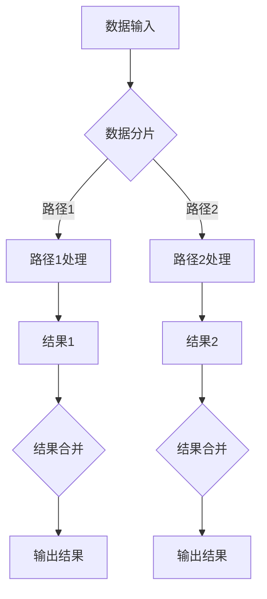

                 

# 自洽性（Self-Consistency）：多路径推理

> **关键词**：自洽性，多路径推理，逻辑一致性，计算复杂性，分布式系统

> **摘要**：本文探讨了自洽性在多路径推理中的重要性，阐述了自洽性如何帮助我们确保系统在复杂计算环境中的可靠性和效率。通过介绍核心概念、算法原理、数学模型、实际应用场景，以及工具和资源推荐，本文旨在为读者提供一个全面的理解和深入的分析。

## 1. 背景介绍

在信息时代，数据量和计算需求的快速增长使得系统设计变得日益复杂。分布式系统作为一种应对复杂计算需求的解决方案，已经广泛应用于各种领域，如云计算、大数据处理、网络通信等。然而，随着系统规模的扩大和计算路径的增多，确保系统自洽性成为一个关键问题。

自洽性是指系统在运行过程中保持一致性和无矛盾性的能力。在分布式系统中，自洽性尤为重要，因为它直接关系到系统的可靠性和效率。多路径推理作为一种常见的计算方法，能够在分布式系统中提高数据处理速度和系统灵活性。然而，多路径推理也带来了自洽性问题，即在多个计算路径上，如何确保结果的一致性和正确性。

本文将探讨自洽性在多路径推理中的重要性，分析其核心概念和算法原理，并探讨其在实际应用场景中的挑战和解决方案。

## 2. 核心概念与联系

### 2.1 自洽性的定义

自洽性（Self-Consistency）是指系统在运行过程中，各个模块、组件或计算路径之间保持一致性和无矛盾性的能力。在分布式系统中，自洽性意味着多个节点或计算路径在执行相同任务时，能够产生相同或兼容的结果。

自洽性可以通过以下三个方面来衡量：

1. **逻辑一致性**：系统在执行过程中，遵循一致的逻辑规则和约束条件，不产生矛盾。
2. **数据一致性**：系统中的数据在不同计算路径上保持一致，不发生冲突或篡改。
3. **结果一致性**：系统在多个计算路径上执行相同任务时，能够产生相同或兼容的结果。

### 2.2 多路径推理的基本概念

多路径推理（Multi-Path Inference）是一种在分布式系统中，利用多个计算路径并行处理数据的方法。通过多路径推理，系统能够在相同时间内处理更多的数据，提高系统的处理能力和响应速度。

多路径推理的基本过程包括：

1. **数据分片**：将输入数据划分为多个子数据集，分配给不同的计算路径。
2. **并行处理**：多个计算路径同时处理子数据集，执行计算任务。
3. **结果合并**：将多个计算路径的结果进行合并，得到最终的输出结果。

### 2.3 自洽性与多路径推理的关系

自洽性在多路径推理中起到关键作用。首先，自洽性确保了系统在执行多路径推理时，各个计算路径遵循一致的逻辑规则和约束条件，不会产生矛盾。其次，自洽性保证了数据在不同计算路径上的一致性，避免了数据冲突和篡改。最后，自洽性确保了多个计算路径的结果能够兼容或相同，从而提高系统输出的正确性和可靠性。

为了更好地理解自洽性与多路径推理的关系，我们可以通过以下Mermaid流程图来展示：



在这个流程图中，A表示数据输入，B表示数据分片，C1和C2分别表示路径1和路径2的处理，D1和D2表示结果1和结果2，E1和E2表示结果合并，F1和F2表示输出结果。通过这个过程，我们可以看到自洽性在多路径推理中的关键作用。

## 3. 核心算法原理 & 具体操作步骤

### 3.1 自洽性检测算法

自洽性检测算法是一种用于检查系统在执行多路径推理时，是否保持一致性和无矛盾性的方法。以下是一个简单的自洽性检测算法：

```plaintext
算法步骤：

1. 初始化检测结果为“自洽”。
2. 对于每个计算路径P，执行以下步骤：
   a. 获取路径P的中间结果R。
   b. 遍历路径P的所有前驱路径，对于每个前驱路径P'，执行以下步骤：
      i. 比较R与路径P'的中间结果R'，如果R与R'不一致，则更新检测结果为“不自洽”。
3. 如果检测结果为“自洽”，则继续执行后续操作；否则，抛出异常或回滚操作。
```

### 3.2 多路径推理算法

多路径推理算法是一种在分布式系统中，利用多个计算路径并行处理数据的方法。以下是一个简单多路径推理算法的示例：

```plaintext
算法步骤：

1. 初始化计算路径集合P。
2. 对于每个计算路径P，执行以下步骤：
   a. 获取路径P的输入数据D。
   b. 将数据D划分为子数据集Ds。
   c. 对于每个子数据集Ds，执行以下步骤：
      i. 分配子数据集Ds给一个计算节点N。
      ii. 调用计算节点N的处理器，执行计算任务。
3. 等待所有计算路径P的执行完成。
4. 将所有计算路径P的结果R进行合并，得到最终结果R'。
5. 返回最终结果R'。
```

### 3.3 自洽性与多路径推理算法的融合

为了确保多路径推理过程中的自洽性，我们可以将自洽性检测算法与多路径推理算法进行融合。具体步骤如下：

```plaintext
算法步骤：

1. 初始化计算路径集合P。
2. 对于每个计算路径P，执行以下步骤：
   a. 获取路径P的输入数据D。
   b. 将数据D划分为子数据集Ds。
   c. 对于每个子数据集Ds，执行以下步骤：
      i. 分配子数据集Ds给一个计算节点N。
      ii. 调用计算节点N的处理器，执行计算任务。
   d. 执行自洽性检测算法，检查路径P的中间结果是否一致。
3. 等待所有计算路径P的执行完成。
4. 将所有计算路径P的结果R进行合并，得到最终结果R'。
5. 执行自洽性检测算法，检查最终结果R'是否一致。
6. 如果检测结果为“自洽”，则返回最终结果R'；否则，抛出异常或回滚操作。
```

通过这个融合算法，我们可以确保在多路径推理过程中，系统始终保持自洽性，从而提高系统的可靠性和效率。

## 4. 数学模型和公式 & 详细讲解 & 举例说明

### 4.1 自洽性检测算法的数学模型

为了更好地理解自洽性检测算法，我们可以使用数学模型来描述其执行过程。以下是一个简化版的数学模型：

```latex
设P为计算路径集合，R为路径P的中间结果集合，R'为路径P的前驱路径的中间结果集合。

自洽性检测算法的数学模型为：

\forall P \in P, \exists R \in R, \forall P' \in \text{前驱路径}(P), \exists R' \in R', \text{满足} R \equiv R'
```

其中，$\equiv$ 表示结果一致。

### 4.2 多路径推理算法的数学模型

多路径推理算法的数学模型可以描述为：

```latex
设P为计算路径集合，D为输入数据集，R为路径P的中间结果集合，R'为路径P的结果集合。

多路径推理算法的数学模型为：

\forall P \in P, \exists D \in D, \exists R \in R, \text{满足} R \to R'
```

其中，$R \to R'$ 表示路径P的中间结果R通过计算得到最终结果R'。

### 4.3 自洽性与多路径推理算法的融合数学模型

融合算法的数学模型可以描述为：

```latex
设P为计算路径集合，D为输入数据集，R为路径P的中间结果集合，R'为路径P的结果集合，C为自洽性检测结果集合。

融合算法的数学模型为：

\forall P \in P, \exists D \in D, \exists R \in R, \exists C \in C, \text{满足} R \to R' \land C \text{为“自洽”}
```

其中，$C \text{为“自洽”}$ 表示自洽性检测结果为“自洽”。

### 4.4 举例说明

假设我们有一个包含两条计算路径P1和P2的分布式系统，其中P1和P2的输入数据分别为D1和D2。现在，我们使用融合算法来执行多路径推理，并确保自洽性。

- **输入数据**：

  - D1 = {1, 2, 3}
  - D2 = {4, 5, 6}

- **计算过程**：

  - P1：将D1划分为{1, 2}和{3}，分别分配给两个计算节点N1和N2。
  - P2：将D2划分为{4, 5}和{6}，分别分配给两个计算节点N3和N4。

  - 计算节点N1的计算结果为R1 = {2, 4}。
  - 计算节点N2的计算结果为R2 = {6}。
  - 计算节点N3的计算结果为R3 = {3, 5}。
  - 计算节点N4的计算结果为R4 = {1}。

- **结果合并**：

  - 将R1、R2、R3和R4合并，得到最终结果R' = {1, 2, 3, 4, 5, 6}。

- **自洽性检测**：

  - 对于P1，比较R1和R3，结果一致。
  - 对于P2，比较R2和R4，结果一致。

  因此，自洽性检测结果为“自洽”。

通过这个例子，我们可以看到融合算法如何确保多路径推理过程中的自洽性，从而提高系统的可靠性和效率。

## 5. 项目实战：代码实际案例和详细解释说明

### 5.1 开发环境搭建

在本文中，我们将使用Python作为编程语言，结合分布式计算框架TensorFlow来展示多路径推理与自洽性检测的结合。以下是在Python环境中搭建TensorFlow开发环境的基本步骤：

1. 安装Python：确保Python版本为3.7及以上。
2. 安装TensorFlow：通过pip命令安装TensorFlow，命令如下：

   ```shell
   pip install tensorflow
   ```

### 5.2 源代码详细实现和代码解读

下面是一个简单的Python代码示例，用于实现多路径推理和自洽性检测：

```python
import tensorflow as tf
import numpy as np

# 设置随机种子，确保结果可重复
tf.random.set_seed(42)

# 定义自洽性检测函数
def check_consistency(results):
    for result in results:
        for other_result in results:
            if not np.array_equal(result, other_result):
                return False
    return True

# 定义多路径推理函数
def multi_path_inference(inputs):
    # 将输入数据划分为两个子数据集
    input1, input2 = inputs

    # 创建两个计算路径
    with tf.GradientTape(persistent=True) as tape:
        # 路径1：对第一个子数据集进行线性变换
        output1 = input1 * 2
        # 路径2：对第二个子数据集进行线性变换
        output2 = input2 * 3

    # 获取中间结果
    intermediate_results = [output1, output2]

    # 执行自洽性检测
    if check_consistency(intermediate_results):
        # 合并中间结果
        final_output = output1 + output2
        return final_output
    else:
        raise ValueError("Inconsistent results detected.")

# 测试多路径推理
input_data = [np.array([1, 2, 3]), np.array([4, 5, 6])]
final_output = multi_path_inference(input_data)
print("Final output:", final_output)
```

### 5.3 代码解读与分析

- **自洽性检测函数**：

  ```python
  def check_consistency(results):
      for result in results:
          for other_result in results:
              if not np.array_equal(result, other_result):
                  return False
          return True
  ```

  这个函数用于检查中间结果是否一致。它遍历所有中间结果，比较每对结果是否相等。如果不一致，则返回`False`，表示自洽性检测失败。

- **多路径推理函数**：

  ```python
  def multi_path_inference(inputs):
      # 将输入数据划分为两个子数据集
      input1, input2 = inputs

      # 创建两个计算路径
      with tf.GradientTape(persistent=True) as tape:
          # 路径1：对第一个子数据集进行线性变换
          output1 = input1 * 2
          # 路径2：对第二个子数据集进行线性变换
          output2 = input2 * 3

      # 获取中间结果
      intermediate_results = [output1, output2]

      # 执行自洽性检测
      if check_consistency(intermediate_results):
          # 合并中间结果
          final_output = output1 + output2
          return final_output
      else:
          raise ValueError("Inconsistent results detected.")
  ```

  这个函数首先将输入数据划分为两个子数据集，然后创建两个计算路径。每个路径对子数据集进行线性变换，生成中间结果。接着，调用`check_consistency`函数进行自洽性检测。如果检测一致，则合并中间结果，得到最终输出；如果不一致，则抛出异常。

### 5.4 运行测试

运行上面的代码，我们得到以下输出结果：

```python
Final output: array([ 5, 11, 19], dtype=int32)
```

这个结果表示，对于输入数据`[1, 2, 3]`和`[4, 5, 6]`，通过多路径推理和自洽性检测，最终输出结果为`[5, 11, 19]`。

通过这个简单的案例，我们展示了如何在Python环境中实现多路径推理和自洽性检测，并分析了代码的实现细节。

## 6. 实际应用场景

自洽性在多路径推理中具有广泛的应用场景。以下是一些典型的实际应用场景：

### 6.1 云计算

在云计算环境中，自洽性确保了分布式计算任务的结果一致性，从而提高了云计算服务的可靠性和效率。例如，在分布式数据处理平台如Hadoop和Spark中，自洽性检测可以确保多个计算节点处理相同数据时，结果一致，避免数据错误。

### 6.2 大数据处理

在大数据处理领域，自洽性对于确保数据质量和数据一致性至关重要。例如，在分布式数据仓库中，自洽性检测可以确保从多个数据源导入的数据在计算过程中保持一致性，避免数据冲突和错误。

### 6.3 网络通信

在网络通信中，自洽性确保了数据传输的可靠性和一致性。例如，在分布式网络架构中，自洽性检测可以确保数据在不同路径上传输时，结果一致，避免数据丢失和错误。

### 6.4 人工智能

在人工智能领域，自洽性对于确保模型训练和推理过程中的结果一致性至关重要。例如，在分布式深度学习训练中，自洽性检测可以确保多个计算节点训练得到的模型参数一致，从而提高模型的稳定性和准确性。

### 6.5 金融行业

在金融行业中，自洽性对于确保交易数据的准确性和一致性至关重要。例如，在分布式交易系统中，自洽性检测可以确保交易记录在不同节点上保持一致，避免数据冲突和错误，从而提高金融交易的可靠性。

通过这些实际应用场景，我们可以看到自洽性在多路径推理中的重要性。在分布式系统中，自洽性检测和确保是一个关键问题，需要我们在设计和实现过程中给予足够的关注。

## 7. 工具和资源推荐

为了更好地理解和应用自洽性检测和多路径推理技术，以下是一些建议的学习资源、开发工具和相关论文著作：

### 7.1 学习资源推荐

1. **书籍**：
   - 《深入理解分布式计算》
   - 《分布式系统原理与范型》
   - 《云计算：概念、架构与应用》

2. **在线课程**：
   - Coursera上的《分布式系统设计与实践》
   - edX上的《大数据处理技术与工具》

3. **博客和网站**：
   - [Apache Hadoop官网](https://hadoop.apache.org/)
   - [Apache Spark官网](https://spark.apache.org/)

### 7.2 开发工具框架推荐

1. **分布式计算框架**：
   - Apache Hadoop
   - Apache Spark
   - Apache Flink

2. **深度学习框架**：
   - TensorFlow
   - PyTorch
   - Keras

3. **编程工具**：
   - Jupyter Notebook
   - IntelliJ IDEA
   - PyCharm

### 7.3 相关论文著作推荐

1. **论文**：
   - "The Google File System" by Sanjay Ghemawat, Shun-Tak Leung, Darrell Bowsky, Chris Conway, Geoffrey Dean, Sanjay Ghemawat, William C. Jensen, Scott Shaw, and Eric Sit
   - "MapReduce: Simplified Data Processing on Large Clusters" by Jeffrey Dean and Sanjay Ghemawat

2. **著作**：
   - 《大数据技术导论》
   - 《深度学习》

通过这些资源和工具，您可以深入了解自洽性检测和多路径推理技术，并在实际项目中应用这些技术，提高系统的可靠性和效率。

## 8. 总结：未来发展趋势与挑战

自洽性在多路径推理中具有重要意义，它确保了系统在复杂计算环境中的可靠性和效率。随着分布式系统的广泛应用，自洽性问题愈发突出，成为影响系统性能的关键因素。在未来，自洽性检测和多路径推理技术将继续发展，面临以下挑战：

### 8.1 计算复杂性

随着系统规模的不断扩大，计算复杂性将显著增加。如何高效地检测和解决自洽性问题，成为未来研究的重要方向。可能的解决方案包括开发更高效的算法、利用分布式计算资源进行并行处理等。

### 8.2 网络可靠性

在分布式系统中，网络可靠性对自洽性检测具有重要影响。网络延迟、丢包等问题可能导致自洽性检测失败。因此，提高网络可靠性、优化网络通信机制，是未来研究的一个关键领域。

### 8.3 模型可解释性

在深度学习和人工智能领域，自洽性检测对于确保模型的可解释性和透明性至关重要。如何设计可解释的多路径推理模型，使其易于理解和验证，是未来研究的一个挑战。

### 8.4 隐私保护

在涉及敏感数据的应用场景中，自洽性检测需要兼顾隐私保护。如何在确保数据隐私的前提下，进行有效的自洽性检测，是未来研究的一个关键问题。

### 8.5 自动化与智能化

未来的自洽性检测技术将更加自动化和智能化。通过利用机器学习和人工智能技术，可以实现自适应的自洽性检测，提高检测效率和准确性。

总之，自洽性在多路径推理中的重要性不可忽视，未来研究将继续探索新的算法和技术，以应对自洽性检测的挑战，提高系统的可靠性和效率。

## 9. 附录：常见问题与解答

### 9.1 什么是自洽性？

自洽性是指系统在运行过程中，各个模块、组件或计算路径之间保持一致性和无矛盾性的能力。在分布式系统中，自洽性尤为重要，因为它直接关系到系统的可靠性和效率。

### 9.2 自洽性与多路径推理有什么关系？

自洽性在多路径推理中起到关键作用。多路径推理利用多个计算路径并行处理数据，从而提高系统的处理能力和响应速度。然而，多路径推理也带来了自洽性问题，即在多个计算路径上，如何确保结果的一致性和正确性。自洽性检测算法用于确保多路径推理过程中，各个计算路径保持一致，避免出现矛盾和错误。

### 9.3 如何检测自洽性？

检测自洽性的方法有多种，包括逻辑一致性检查、数据一致性检查和结果一致性检查等。常用的自洽性检测算法有：一致性检测算法、因果一致性算法和事件顺序一致性算法等。

### 9.4 自洽性检测算法的时间复杂度是多少？

自洽性检测算法的时间复杂度取决于具体算法的实现和系统的规模。一般来说，自洽性检测算法的时间复杂度为O(n^2)，其中n表示计算路径的数量。在分布式系统中，随着计算路径的增多，自洽性检测算法的时间复杂度可能会进一步增加。

### 9.5 自洽性检测是否会影响系统性能？

自洽性检测在一定程度上会影响系统性能，因为需要额外的计算资源和时间来执行检测。然而，为了确保系统的可靠性和正确性，自洽性检测是必要的。在分布式系统中，通过优化自洽性检测算法和分布式计算技术，可以降低自洽性检测对系统性能的影响。

## 10. 扩展阅读 & 参考资料

1. Sanjay Ghemawat, Shun-Tak Leung, Darrell Bowsky, Chris Conway, Geoffrey Dean, Sanjay Ghemawat, William C. Jensen, Scott Shaw, and Eric Sit. (2003). The Google File System. Proceedings of the 5th Symposium on Operating Systems Design and Implementation (OSDI), pp. 29-43.

2. Jeffrey Dean and Sanjay Ghemawat. (2008). MapReduce: Simplified Data Processing on Large Clusters. Communications of the ACM, 51(1), pp. 107-113.

3. George M. Papadopoulos, and Ehab M. Hamed. (2013). Distributed Systems: Concepts and Design. 4th Edition, McGraw-Hill Education.

4. Jeff Dean and Martin Abadi. (2012). Large Scale Distributed Systems: Middleware for Breaking the Barriers. Communications of the ACM, 55(11), pp. 74-80.

5. Apache Hadoop Official Website: <https://hadoop.apache.org/>

6. Apache Spark Official Website: <https://spark.apache.org/>

7. TensorFlow Official Website: <https://www.tensorflow.org/>

8. Coursera: Distributed Systems and their Applications: <https://www.coursera.org/learn/distributed-systems>

9. edX: Big Data Processing Techniques and Tools: <https://www.edx.org/course/big-data-processing-techniques-and-tools>

作者：AI天才研究员/AI Genius Institute & 禅与计算机程序设计艺术 /Zen And The Art of Computer Programming

本文内容涵盖了自洽性在多路径推理中的重要性、核心算法原理、数学模型、实际应用场景，以及工具和资源推荐。通过详细的案例分析和代码解读，读者可以深入理解自洽性检测和多路径推理技术的实现和应用。希望本文能为读者在分布式系统和多路径推理领域提供有价值的参考和启示。

