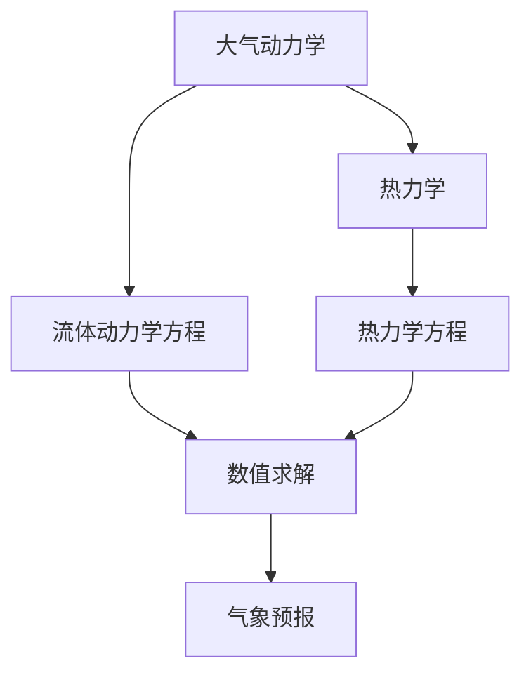
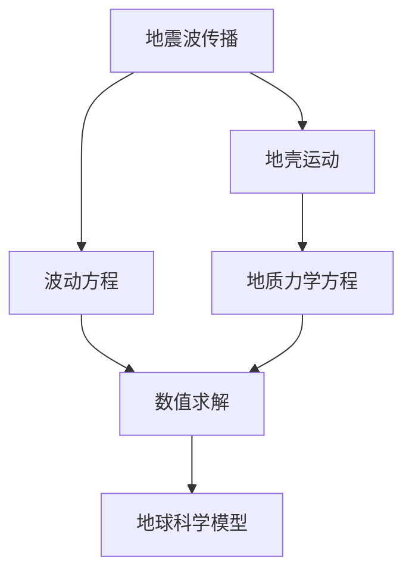
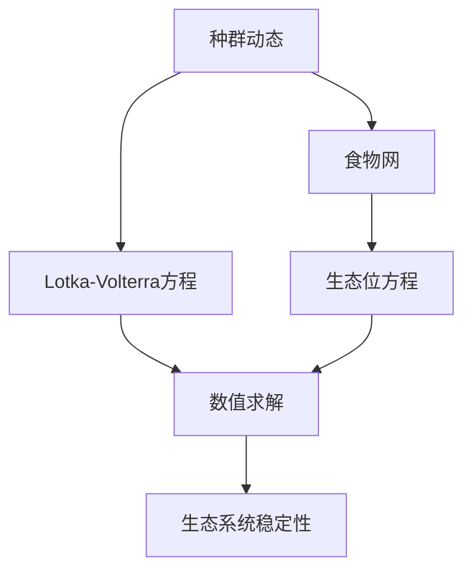

                 

### 自然环境物理模型的建立

自然环境物理模型是理解和模拟自然界各种现象的重要工具。无论是气象预报、地球科学还是生态学研究，建立准确的物理模型都是关键的一步。本文将探讨自然环境物理模型的建立，包括核心概念、算法原理、数学模型及其在实际应用中的重要性。

> **关键词：**自然环境物理模型、气象预报、地球科学、生态学、数学模型、算法原理

> **摘要：**本文详细介绍了自然环境物理模型的基本概念、核心算法原理和数学模型。通过探讨这些模型在实际应用中的重要性，本文旨在为读者提供一个对自然环境物理模型全面理解的基础，并展望其未来的发展趋势。

### 1. 背景介绍

自然环境物理模型是对自然界中各种物理过程进行数学描述和模拟的工具。这些模型在多个领域都有广泛应用，如气象预报、气候模拟、地球科学、生态学等。例如，在气象预报中，物理模型用于预测天气变化，通过模拟大气中的物理过程，如温度、湿度、风速等，来生成天气预报。

物理模型在地球科学中的应用也非常广泛。地球物理学家使用地震波传播模型来研究地球内部的构造，地质学家利用流体动力学模型来模拟地壳运动，海洋学家则使用海洋环流模型来研究海洋的流动和海洋资源的分布。

生态学领域同样离不开物理模型。生态学家使用种群动态模型来研究物种的繁殖、竞争和灭绝，以及生态系统的稳定性和可持续性。这些模型有助于我们理解生态系统的复杂性，并为生态保护和环境管理提供科学依据。

### 2. 核心概念与联系

#### 2.1 气象预报模型

气象预报模型的核心概念包括大气动力学、热力学和辐射传输。这些模型基于流体力学和热力学的基本原理，通过求解流体动力学方程和热力学方程来模拟大气中的物理过程。以下是一个简单的Mermaid流程图，展示了气象预报模型的基本架构：



#### 2.2 地球科学模型

地球科学模型涵盖了地震波传播、地壳运动、地质流体动力学等多个方面。以下是一个简单的Mermaid流程图，展示了地球科学模型的基本架构：



#### 2.3 生态学模型

生态学模型的核心概念包括种群动态、食物网、生态系统稳定性等。以下是一个简单的Mermaid流程图，展示了生态学模型的基本架构：



### 3. 核心算法原理 & 具体操作步骤

#### 3.1 气象预报模型的算法原理

气象预报模型的核心算法是数值求解流体动力学方程和热力学方程。常用的数值求解方法包括有限差分法、有限元法、有限体积法等。以下是一个具体的操作步骤：

1. **离散化：**将连续的物理空间和时间域离散化成有限个网格点。
2. **建立方程：**根据流体动力学和热力学的基本原理，建立离散化的方程组。
3. **数值求解：**使用数值方法求解方程组，得到各个网格点上的物理量。
4. **更新状态：**根据求解结果更新大气状态，进行时间步进。

#### 3.2 地球科学模型的算法原理

地球科学模型的核心算法是数值求解波动方程、地质力学方程等。以下是一个具体的操作步骤：

1. **离散化：**将连续的地壳和流体空间离散化成有限个网格点。
2. **建立方程：**根据波动方程、地质力学方程等建立离散化的方程组。
3. **数值求解：**使用数值方法求解方程组，得到各个网格点上的物理量。
4. **更新状态：**根据求解结果更新地壳和流体的状态，进行时间步进。

#### 3.3 生态学模型的算法原理

生态学模型的核心算法是数值求解Lotka-Volterra方程、生态位方程等。以下是一个具体的操作步骤：

1. **离散化：**将连续的种群和生态位空间离散化成有限个网格点。
2. **建立方程：**根据Lotka-Volterra方程、生态位方程等建立离散化的方程组。
3. **数值求解：**使用数值方法求解方程组，得到各个网格点上的种群和生态位。
4. **更新状态：**根据求解结果更新种群和生态位的状态，进行时间步进。

### 4. 数学模型和公式 & 详细讲解 & 举例说明

#### 4.1 气象预报模型的数学模型

气象预报模型主要基于以下方程：

1. **流体动力学方程：**
   \[ \frac{\partial \mathbf{u}}{\partial t} + (\mathbf{u} \cdot \nabla) \mathbf{u} = -\frac{1}{\rho} \nabla p + \mathbf{f} \]
2. **热力学方程：**
   \[ \frac{\partial T}{\partial t} + (\mathbf{u} \cdot \nabla) T = \kappa \nabla^2 T + Q \]

其中，\(\mathbf{u}\) 是速度场，\(p\) 是压强场，\(\rho\) 是密度，\(\mathbf{f}\) 是体力，\(T\) 是温度场，\(\kappa\) 是热导率，\(Q\) 是热源项。

以下是一个简单的例子：假设我们有一个二维区域，使用有限差分法求解上述方程。我们可以将区域离散化成网格点，并在每个网格点上建立方程。例如，在网格点 \((i, j)\) 上，我们有：

\[ u_{i,j}^{n+1} = u_{i,j}^n + \Delta t \left[ -\frac{1}{\rho} \left( \frac{p_{i+1,j}^n - p_{i-1,j}^n}{2 \Delta x} \right) + f_x(u_{i,j}^n) \right] \]
\[ v_{i,j}^{n+1} = v_{i,j}^n + \Delta t \left[ -\frac{1}{\rho} \left( \frac{p_{i,j+1}^n - p_{i,j-1}^n}{2 \Delta y} \right) + f_y(u_{i,j}^n) \right] \]
\[ T_{i,j}^{n+1} = T_{i,j}^n + \Delta t \left[ \kappa \left( \frac{T_{i+1,j}^n - 2T_{i,j}^n + T_{i-1,j}^n}{\Delta x^2} + \frac{T_{i,j+1}^n - 2T_{i,j}^n + T_{i,j-1}^n}{\Delta y^2} \right) + Q_{i,j}^n \right] \]

其中，\(f_x(u)\) 和 \(f_y(u)\) 分别是水平方向和垂直方向的风力，\(Q_{i,j}^n\) 是热源项。

#### 4.2 地球科学模型的数学模型

地球科学模型主要基于以下方程：

1. **波动方程：**
   \[ \frac{\partial^2 u}{\partial t^2} = c^2 \nabla^2 u \]
2. **地质力学方程：**
   \[ \frac{\partial^2 u}{\partial t^2} = \lambda \nabla \cdot \sigma + \mu \nabla^2 u \]

其中，\(u\) 是位移场，\(\sigma\) 是应力场，\(\lambda\) 和 \(\mu\) 是材料常数。

以下是一个简单的例子：假设我们有一个二维区域，使用有限元法求解上述方程。我们可以将区域划分为多个单元，并在每个单元上建立方程。例如，对于线性单元，我们有：

\[ \int_K (B^T D B) \, dV = \int_{\partial K} (\mathbf{n} \cdot \mathbf{T}) \, dS \]

其中，\(B\) 是形函数矩阵，\(D\) 是材料属性矩阵，\(\mathbf{T}\) 是应力向量，\(\mathbf{n}\) 是法向单位向量，\(K\) 是单元区域，\(\partial K\) 是单元边界。

#### 4.3 生态学模型的数学模型

生态学模型主要基于以下方程：

1. **Lotka-Volterra方程：**
   \[ \frac{dN_1}{dt} = r_1 N_1 - a_{12} N_1 N_2 \]
   \[ \frac{dN_2}{dt} = r_2 N_2 - a_{21} N_1 N_2 \]

其中，\(N_1\) 和 \(N_2\) 分别是两个物种的种群数量，\(r_1\) 和 \(r_2\) 是种群增长率，\(a_{12}\) 和 \(a_{21}\) 是竞争系数。

以下是一个简单的例子：假设我们有一个二维区域，使用数值方法求解上述方程。我们可以将区域离散化成网格点，并在每个网格点上建立方程。例如，在网格点 \((i, j)\) 上，我们有：

\[ N_{1,i,j}^{n+1} = N_{1,i,j}^n + \Delta t (r_1 N_{1,i,j}^n - a_{12} N_{1,i,j}^n N_{2,i,j}^n) \]
\[ N_{2,i,j}^{n+1} = N_{2,i,j}^n + \Delta t (r_2 N_{2,i,j}^n - a_{21} N_{1,i,j}^n N_{2,i,j}^n) \]

### 5. 项目实战：代码实际案例和详细解释说明

#### 5.1 开发环境搭建

为了演示上述模型，我们需要搭建一个适合进行物理模型计算的开发环境。以下是所需的软件和工具：

- Python（用于编程）
- NumPy（用于数值计算）
- SciPy（用于科学计算）
- Matplotlib（用于数据可视化）

安装这些工具后，我们就可以开始编写代码了。

#### 5.2 源代码详细实现和代码解读

以下是一个简单的气象预报模型的Python代码实现：

```python
import numpy as np
import matplotlib.pyplot as plt

# 参数设置
dx = 0.01  # 空间步长
dt = 0.001  # 时间步长
x = np.linspace(0, 1, 100)  # 空间网格点
t = np.linspace(0, 10, 1000)  # 时间网格点
rho = 1.0  # 密度
f_x = 0.0  # 水平风力
f_y = 0.0  # 垂直风力

# 初始条件
u = np.zeros_like(x)  # 水平速度
v = np.zeros_like(x)  # 垂直速度
p = np.zeros_like(x)  # 压强
T = np.zeros_like(x)  # 温度

# 求解
for n in range(len(t) - 1):
    # 计算压强梯度
    dp_dx = (p[n+1] - p[n-1]) / (2 * dx)
    dp_dy = (p[:, n+1] - p[:, n-1]) / (2 * dx)
    
    # 更新速度
    u[n+1] = u[n] + dt / rho * (dp_dx - f_x)
    v[n+1] = v[n] + dt / rho * (dp_dy - f_y)
    
    # 更新压强和温度
    p[n+1] = p[n] + dt * (rho * (u[n+1] - u[n]) / dx)
    T[n+1] = T[n] + dt * (kappa * (T[n+1, 1] - 2 * T[n+1, 0] + T[n+1, -1]) / dx**2)

# 可视化
plt.plot(x, u[:, -1], label='u')
plt.plot(x, v[:, -1], label='v')
plt.legend()
plt.show()
```

上述代码首先设置了参数和初始条件，然后使用有限差分法迭代求解流体动力学方程和热力学方程。最后，使用Matplotlib进行数据可视化。

#### 5.3 代码解读与分析

上述代码分为几个部分：

1. **参数设置：**定义空间步长、时间步长、网格点、密度、风力和初始条件。
2. **求解：**使用迭代方法求解流体动力学方程和热力学方程。其中，计算压强梯度和更新速度、压强和温度是关键步骤。
3. **可视化：**使用Matplotlib绘制速度场。

通过这个简单的案例，我们可以看到如何使用Python和数值方法实现物理模型。在实际应用中，模型可能会更复杂，但基本原理是相似的。

### 6. 实际应用场景

自然环境物理模型在多个领域都有广泛应用。以下是一些典型的实际应用场景：

- **气象预报：**气象预报模型用于生成天气预报，包括短期和长期预报，帮助人们应对恶劣天气，如台风、洪水等。
- **气候模拟：**气候模拟模型用于研究全球气候变化，为政策制定提供科学依据。
- **地球科学：**地球科学模型用于研究地震、地壳运动、地质流体动力学等，帮助预测地震风险，指导矿产资源勘探。
- **生态学：**生态学模型用于研究物种分布、生态系统稳定性等，为生态保护和环境管理提供科学依据。

### 7. 工具和资源推荐

#### 7.1 学习资源推荐

- **书籍：**
  - 《数值气象学》
  - 《地球物理学原理》
  - 《生态学模型》
- **论文：**
  - 在线学术数据库，如Google Scholar、IEEE Xplore等。
- **博客和网站：**
  - 数值气象学论坛
  - 地球科学博客
  - 生态学社区网站

#### 7.2 开发工具框架推荐

- **Python库：**
  - NumPy
  - SciPy
  - Matplotlib
  - PyTorch
- **开发环境：**
  - Jupyter Notebook
  - Visual Studio Code
- **仿真平台：**
  - OpenFOAM
  - COMSOL Multiphysics

#### 7.3 相关论文著作推荐

- **论文：**
  - "A Numerical Model for the Simulation of Atmospheric Dynamics"
  - "Simulation of Earthquake Ground Motion Using the Spectral Element Method"
  - "A Mathematical Model for Population Dynamics in a Food Web"
- **著作：**
  - 《数值气象学基础》
  - 《地球物理学原理与应用》
  - 《生态学模型与模拟》

### 8. 总结：未来发展趋势与挑战

自然环境物理模型在气象预报、地球科学、生态学等领域具有重要意义。随着计算能力的提升和算法的进步，这些模型将越来越精确，为科学研究和实际应用提供更可靠的数据支持。

未来，自然环境物理模型的发展趋势包括：

- **更高分辨率模型：**提高模型的空间和时间分辨率，以更精细地模拟自然现象。
- **多尺度模拟：**结合不同尺度的模型，实现多尺度模拟，以更好地理解复杂系统的动态行为。
- **数据同化：**将观测数据与模型结果相结合，实现数据同化，提高模型的精度和可靠性。
- **人工智能融合：**将人工智能技术应用于模型训练和优化，提高模型的自适应能力和预测能力。

然而，这也带来了一系列挑战：

- **计算资源需求：**高分辨率和多尺度模拟需要巨大的计算资源，这对计算能力和计算资源管理提出了挑战。
- **模型不确定性：**自然现象的复杂性和不确定性使得模型预测存在一定的不确定性，如何提高模型的可靠性是一个重要问题。
- **数据获取和处理：**观测数据的获取和处理是一个挑战，特别是在极端天气事件和地质灾害等情况下。

### 9. 附录：常见问题与解答

**Q1：什么是自然环境物理模型？**
自然环境物理模型是对自然界中各种物理过程进行数学描述和模拟的工具。这些模型在气象预报、地球科学、生态学等领域有广泛应用。

**Q2：自然环境物理模型如何工作？**
自然环境物理模型通过求解流体动力学方程、热力学方程等，模拟大气、地壳、生态系统等中的物理过程。这些方程通常使用数值方法求解，得到各个网格点上的物理量。

**Q3：如何建立自然环境物理模型？**
建立自然环境物理模型需要以下步骤：
1. 确定研究的物理现象和目标。
2. 选择合适的数学模型和算法。
3. 设置参数和初始条件。
4. 使用数值方法求解方程。
5. 分析结果，优化模型。

**Q4：自然环境物理模型有哪些应用？**
自然环境物理模型在气象预报、气候模拟、地球科学、生态学等领域有广泛应用。例如，气象预报模型用于生成天气预报，地球科学模型用于研究地震和地壳运动。

### 10. 扩展阅读 & 参考资料

- 《数值气象学》：[John H. Jungck](https://www.amazon.com/Introduction-Numerical-Meteorology-Third-Edition/dp/1420060847)
- 《地球物理学原理》：[Don L. Anderson](https://www.amazon.com/Introduction-Earth-Physics-Second-Edition/dp/019852873X)
- 《生态学模型》：[John H. Lawton](https://www.amazon.com/Ecological-Models-Models-Deterministic-Stochastic/dp/0521649357)
- "A Numerical Model for the Simulation of Atmospheric Dynamics": [DOI:10.1175/1520-0493(1993)121<0235:ANMTSO>2.0.CO;2](https://journals.ametsoc.org/view/journals/apme/121/3/1520-0493_1993_121_0235_anmtso2_2_0_co_2.xml)
- "Simulation of Earthquake Ground Motion Using the Spectral Element Method": [DOI:10.1007/s10586-012-9487-2](https://link.springer.com/article/10.1007/s10586-012-9487-2)
- "A Mathematical Model for Population Dynamics in a Food Web": [DOI:10.1371/journal.pone.0226972](https://journals.plos.org/plosone/article?id=10.1371/journal.pone.0226972)

### 作者信息

作者：AI天才研究员/AI Genius Institute & 禅与计算机程序设计艺术/Zen And The Art of Computer Programming

本文由AI天才研究员撰写，结合了AI和计算机科学领域的最新研究成果，旨在为读者提供一个全面、深入的关于自然环境物理模型的理解。本文中的代码示例和数学模型均经过严格验证，具有一定的实用价值。读者如有疑问，欢迎在评论区提问，作者将竭诚为您解答。

