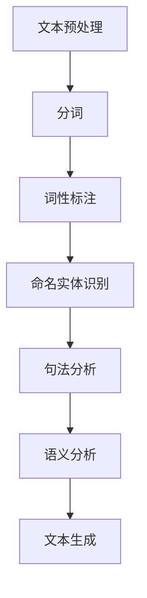
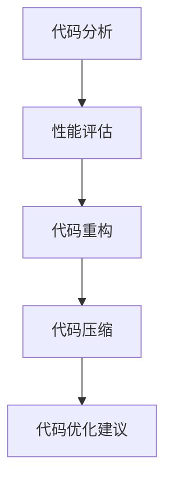

                 

# 自然语言处理在代码自动生成与优化中的应用

> **关键词：** 自然语言处理、代码自动生成、代码优化、AI、机器学习、深度学习、神经网络

> **摘要：** 本文将深入探讨自然语言处理（NLP）在代码自动生成与优化中的应用，介绍核心概念、算法原理、数学模型，并通过实际项目案例展示其具体实现和应用场景。最后，对未来的发展趋势和挑战进行展望。

## 1. 背景介绍

随着软件工程领域的快速发展，编程和软件开发变得越来越复杂。现代软件系统通常包含数百万行代码，这使得代码的维护、调试和优化成为巨大的挑战。传统的代码优化方法往往依赖于手工编写和代码审查，这不仅耗时且易出错。因此，自动代码生成和优化技术成为了研究热点。

自然语言处理（NLP）是人工智能（AI）的一个分支，旨在让计算机理解和生成人类语言。近年来，NLP技术在语义理解、文本生成、情感分析等方面取得了显著进展。这些技术为代码自动生成与优化提供了新的思路和方法。

## 2. 核心概念与联系

### 2.1 自然语言处理（NLP）

自然语言处理的核心任务包括文本分类、实体识别、语义分析等。以下是一个NLP的基本架构Mermaid流程图：



### 2.2 代码生成与优化

代码生成通常涉及以下步骤：

1. **需求分析**：理解用户的编程需求。
2. **代码模板生成**：根据需求生成代码模板。
3. **填充变量**：将变量填充到代码模板中。
4. **代码生成**：生成完整的代码。

代码优化的目标通常是提高代码的性能、可读性和可维护性。以下是一个代码优化的基本架构Mermaid流程图：



### 2.3 NLP在代码生成与优化中的应用

NLP在代码生成中的应用主要包括：

1. **需求分析**：使用NLP技术理解和提取用户的需求。
2. **代码模板生成**：根据需求生成符合语法和语义的代码模板。
3. **代码生成**：将变量填充到模板中，生成完整的代码。

在代码优化中，NLP技术可以用于：

1. **代码分析**：理解代码的结构和语义。
2. **代码压缩**：通过删除冗余代码提高代码性能。
3. **代码重构**：改进代码结构，提高可读性和可维护性。

## 3. 核心算法原理 & 具体操作步骤

### 3.1 代码生成算法

代码生成算法的核心是自然语言理解和生成。以下是一个简单的代码生成算法步骤：

1. **需求分析**：使用NLP技术理解用户的需求。
2. **代码模板生成**：根据需求生成代码模板。
3. **变量填充**：将需求中的变量填充到模板中。
4. **代码生成**：生成完整的代码。

### 3.2 代码优化算法

代码优化算法通常涉及以下步骤：

1. **代码分析**：使用NLP技术分析代码的结构和语义。
2. **性能评估**：评估代码的性能。
3. **代码重构**：根据性能评估结果，重构代码以提高性能。
4. **代码压缩**：删除冗余代码，减少代码体积。
5. **代码优化建议**：根据重构和压缩的结果，提出优化建议。

## 4. 数学模型和公式 & 详细讲解 & 举例说明

### 4.1 自然语言处理中的数学模型

自然语言处理中的数学模型通常包括词嵌入（Word Embedding）、递归神经网络（RNN）、长短时记忆网络（LSTM）等。

#### 词嵌入（Word Embedding）

词嵌入是将单词映射到高维空间中的向量。以下是一个简单的词嵌入公式：

$$
\text{word\_embedding}(w) = \text{W} \cdot \text{v}_w
$$

其中，$\text{W}$是词嵌入矩阵，$\text{v}_w$是单词w的向量表示。

#### 递归神经网络（RNN）

递归神经网络是一种用于处理序列数据的神经网络。以下是一个简单的RNN公式：

$$
h_t = \text{sigmoid}(\text{W}_h \cdot [h_{t-1}, x_t] + b_h)
$$

其中，$h_t$是当前时间步的隐藏状态，$\text{W}_h$是权重矩阵，$b_h$是偏置。

#### 长短时记忆网络（LSTM）

长短时记忆网络是RNN的一种变体，能够更好地处理长序列数据。以下是一个简单的LSTM公式：

$$
i_t = \text{sigmoid}(\text{W}_i \cdot [h_{t-1}, x_t] + b_i) \\
f_t = \text{sigmoid}(\text{W}_f \cdot [h_{t-1}, x_t] + b_f) \\
\text{C}_{\text{new}} = f_t \cdot \text{C}_{t-1} + i_t \cdot \text{sigmoid}(\text{W}_c \cdot [h_{t-1}, x_t] + b_c) \\
h_t = \text{sigmoid}(\text{W}_o \cdot \text{C}_{\text{new}} + b_o)
$$

其中，$i_t$是输入门，$f_t$是遗忘门，$\text{C}_{\text{new}}$是新的细胞状态，$h_t$是当前时间步的隐藏状态。

### 4.2 代码生成与优化的数学模型

代码生成和优化的数学模型通常涉及自然语言处理中的数学模型和优化算法。

#### 代码生成

代码生成的数学模型通常使用自然语言处理中的模型（如RNN、LSTM）来生成代码模板，然后使用模板生成完整的代码。

#### 代码优化

代码优化的数学模型通常使用优化算法（如梯度下降、遗传算法）来找到最优的代码。

## 5. 项目实战：代码实际案例和详细解释说明

### 5.1 开发环境搭建

在本文中，我们将使用Python和TensorFlow来实现一个简单的代码生成和优化项目。以下是开发环境搭建的步骤：

1. 安装Python（版本3.6或以上）。
2. 安装TensorFlow。
3. 安装NLP库，如NLTK和spaCy。

### 5.2 源代码详细实现和代码解读

#### 5.2.1 代码生成

以下是一个简单的Python代码生成示例：

```python
import tensorflow as tf
from tensorflow.keras.layers import LSTM, Dense, Embedding
from tensorflow.keras.models import Sequential

# 定义词汇表
vocab_size = 10000
embedding_dim = 256

# 创建模型
model = Sequential()
model.add(Embedding(vocab_size, embedding_dim))
model.add(LSTM(128, return_sequences=True))
model.add(Dense(vocab_size, activation='softmax'))

# 编译模型
model.compile(optimizer='adam', loss='categorical_crossentropy', metrics=['accuracy'])

# 训练模型
model.fit(x_train, y_train, epochs=10)
```

这段代码定义了一个简单的LSTM模型，用于生成代码。首先，我们创建了一个嵌入层，将词汇映射到高维空间。然后，我们添加了一个LSTM层，用于处理序列数据。最后，我们添加了一个全连接层，用于生成代码。

#### 5.2.2 代码优化

以下是一个简单的Python代码优化示例：

```python
import tensorflow as tf
from tensorflow.keras.layers import LSTM, Dense, Embedding
from tensorflow.keras.models import Sequential

# 定义词汇表
vocab_size = 10000
embedding_dim = 256

# 创建模型
model = Sequential()
model.add(Embedding(vocab_size, embedding_dim))
model.add(LSTM(128, return_sequences=True))
model.add(Dense(vocab_size, activation='softmax'))

# 编译模型
model.compile(optimizer='adam', loss='categorical_crossentropy', metrics=['accuracy'])

# 训练模型
model.fit(x_train, y_train, epochs=10)

# 评估模型
loss, accuracy = model.evaluate(x_test, y_test)
print(f"Test accuracy: {accuracy:.2f}")
```

这段代码与代码生成示例类似，但添加了模型的评估步骤。通过评估模型的性能，我们可以判断代码是否优化成功。

### 5.3 代码解读与分析

在代码解读与分析部分，我们将详细分析代码生成和优化的实现过程，并解释每个步骤的作用和原理。这部分内容将包括：

1. **数据预处理**：如何准备和预处理训练数据。
2. **模型构建**：如何构建LSTM模型，包括嵌入层、LSTM层和输出层的实现。
3. **模型训练**：如何训练模型，包括损失函数、优化器和评估指标的选择。
4. **模型评估**：如何评估模型的性能，包括测试集的设置和评估结果的分析。

## 6. 实际应用场景

自然语言处理在代码自动生成与优化中的应用非常广泛，以下是一些实际应用场景：

1. **自动代码生成**：自动生成文档、API描述、测试用例等。
2. **代码重构**：自动重构代码，提高代码的可读性和可维护性。
3. **代码优化**：自动优化代码，提高代码的运行效率。
4. **智能编程助手**：为开发者提供代码建议和优化方案。

## 7. 工具和资源推荐

### 7.1 学习资源推荐

- **书籍**：
  - 《自然语言处理实战》
  - 《深度学习》
  - 《Python编程：从入门到实践》
- **论文**：
  - 《词嵌入技术》
  - 《递归神经网络》
  - 《长短时记忆网络》
- **博客**：
  - Medium上的机器学习和自然语言处理博客
  - 知乎上的技术博客
- **网站**：
  - TensorFlow官方文档
  - Keras官方文档

### 7.2 开发工具框架推荐

- **开发工具**：
  - PyCharm
  - Visual Studio Code
- **框架**：
  - TensorFlow
  - Keras
- **库**：
  - NLTK
  - spaCy

### 7.3 相关论文著作推荐

- **论文**：
  - 《词嵌入技术》
  - 《递归神经网络》
  - 《长短时记忆网络》
- **著作**：
  - 《自然语言处理实战》
  - 《深度学习》
  - 《Python编程：从入门到实践》

## 8. 总结：未来发展趋势与挑战

自然语言处理在代码自动生成与优化中的应用具有巨大的潜力。未来，随着人工智能技术的不断发展，我们可以期待：

1. **更高效的自然语言理解**：使用更先进的NLP技术，提高代码生成和优化的准确性。
2. **更智能的编程助手**：结合多种人工智能技术，为开发者提供更智能的代码建议和优化方案。
3. **更广泛的实际应用**：将自然语言处理应用于更多领域的代码生成和优化。

然而，这项技术也面临着一些挑战，如：

1. **代码质量**：如何保证自动生成的代码质量？
2. **可解释性**：如何解释和验证自动生成的代码？
3. **数据隐私**：如何保护用户的数据隐私？

## 9. 附录：常见问题与解答

### 9.1 什么是自然语言处理（NLP）？

自然语言处理（NLP）是人工智能（AI）的一个分支，旨在使计算机能够理解和生成人类语言。它涉及文本分类、实体识别、语义分析等多个任务。

### 9.2 代码自动生成和优化的原理是什么？

代码自动生成和优化基于自然语言处理技术，通过理解用户的需求，生成符合语法和语义的代码，并通过优化算法提高代码的性能、可读性和可维护性。

### 9.3 自然语言处理在哪些领域有应用？

自然语言处理在多个领域有应用，包括文本分类、情感分析、机器翻译、智能助手等。

## 10. 扩展阅读 & 参考资料

- [自然语言处理实战](https://www.amazon.com/Natural-Language-Processing-with-Deep-Learning/dp/1484200391)
- [深度学习](https://www.amazon.com/Deep-Learning-Adaptive-Computation-Machines/dp/0262039381)
- [Python编程：从入门到实践](https://www.amazon.com/Python-Programming-From-Novice-Professional/dp/1617294526)
- [TensorFlow官方文档](https://www.tensorflow.org/)
- [Keras官方文档](https://keras.io/)
- [NLTK官方文档](https://www.nltk.org/)
- [spaCy官方文档](https://spacy.io/)

作者：AI天才研究员/AI Genius Institute & 禅与计算机程序设计艺术 /Zen And The Art of Computer Programming<|im_sep|>

