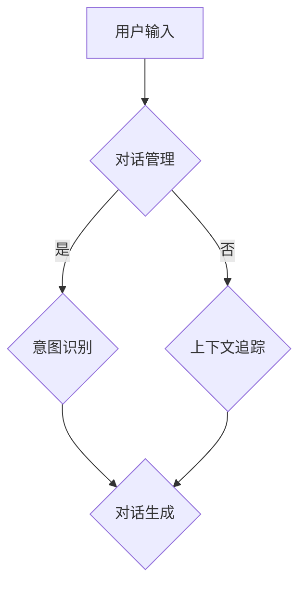

                 

# 自然语言处理在多轮对话系统中的应用研究

## 关键词
自然语言处理（NLP），多轮对话系统，机器学习，深度学习，对话管理，语义理解，意图识别，上下文追踪，对话生成，知识图谱。

## 摘要
本文深入探讨了自然语言处理在多轮对话系统中的应用。首先介绍了多轮对话系统的基本概念和重要性，然后详细阐述了自然语言处理的核心算法原理和数学模型。接着，通过实际项目案例展示了多轮对话系统的实现步骤和代码解析。最后，分析了多轮对话系统在实际应用场景中的表现，并展望了其未来发展趋势与挑战。

## 1. 背景介绍

### 1.1 多轮对话系统的定义

多轮对话系统是一种能够与用户进行多轮交互的人工智能系统。与单轮对话系统（如简单的问答系统）不同，多轮对话系统能够通过多轮交互获取用户的意图，理解上下文，并生成相应的响应。这种系统能够更好地模拟人类的对话过程，提高用户的满意度和用户体验。

### 1.2 多轮对话系统的重要性

多轮对话系统在许多领域都有广泛的应用，如智能客服、智能助手、虚拟教师等。它们能够提高工作效率，降低人工成本，提高用户满意度。同时，随着人工智能技术的不断发展，多轮对话系统的性能和效果也在不断提高，成为人工智能领域的一个重要研究方向。

### 1.3 自然语言处理的发展

自然语言处理（NLP）是人工智能的一个重要分支，主要研究如何让计算机理解、生成和处理自然语言。自20世纪50年代以来，NLP经历了多个发展阶段，从基于规则的系统到基于统计的方法，再到当前的深度学习方法。这些方法的不断发展，为多轮对话系统的实现提供了强大的技术支持。

## 2. 核心概念与联系

### 2.1 自然语言处理的核心概念

自然语言处理的核心概念包括：文本预处理、词嵌入、词性标注、命名实体识别、句法分析、语义理解、情感分析等。这些概念相互关联，共同构成了NLP的理论基础。

#### 2.1.1 文本预处理

文本预处理是NLP的第一步，主要包括去除停用词、分词、词干提取等操作。这些操作有助于减少数据噪声，提高后续处理的效果。

#### 2.1.2 词嵌入

词嵌入是将单词映射到高维空间中的向量表示。通过词嵌入，可以有效地表示词与词之间的相似性和距离，为后续的语义分析提供支持。

#### 2.1.3 词性标注

词性标注是对单词进行语法分类的过程，有助于理解句子的结构和语义。

#### 2.1.4 命名实体识别

命名实体识别是识别文本中的特定实体（如人名、地名、组织名等）的过程，为后续的知识抽取和问答提供基础。

#### 2.1.5 句法分析

句法分析是对句子结构进行分析的过程，有助于理解句子的含义。

#### 2.1.6 语义理解

语义理解是理解句子或文本的整体含义的过程，是NLP的终极目标。

#### 2.1.7 情感分析

情感分析是判断文本中情感倾向的过程，有助于了解用户的情感状态。

### 2.2 多轮对话系统的架构

多轮对话系统的架构通常包括三个主要部分：对话管理（Dialogue Management）、语义理解（Semantic Understanding）和对话生成（Dialogue Generation）。

#### 2.2.1 对话管理

对话管理负责协调对话的流程，根据对话的状态和上下文，决定对话的下一步行动。对话管理通常采用决策树、图搜索或强化学习等方法。

#### 2.2.2 语义理解

语义理解负责解析用户的输入，理解其意图和上下文。语义理解通常包括意图识别和上下文追踪等任务。

#### 2.2.3 对话生成

对话生成负责生成合适的响应，以维持对话的连贯性和自然性。对话生成通常采用模板匹配、规则生成或深度学习方法。

### 2.3 Mermaid流程图

以下是一个简单的Mermaid流程图，展示了多轮对话系统的基本架构：



### 2.4 Mermaid流程图

以下是一个简单的Mermaid流程图，展示了多轮对话系统的基本架构：


## 3. 核心算法原理 & 具体操作步骤

### 3.1 对话管理

对话管理是多轮对话系统的核心，负责协调对话的流程。以下是对话管理的基本原理和操作步骤：

#### 3.1.1 决策树

决策树是一种基于规则的对话管理方法。它通过一系列条件判断，根据对话的状态和上下文，选择合适的操作。具体步骤如下：

1. 收集对话历史和当前状态。
2. 根据决策树的结构，对条件进行判断。
3. 选择满足条件的操作，执行相应的动作。

#### 3.1.2 图搜索

图搜索是一种基于状态空间的对话管理方法。它通过搜索对话状态空间，找到最优的对话路径。具体步骤如下：

1. 定义对话状态空间，包括初始状态和目标状态。
2. 选择合适的搜索算法，如A*搜索。
3. 搜索状态空间，找到最优的对话路径。

#### 3.1.3 强化学习

强化学习是一种基于反馈的对话管理方法。它通过学习用户的反馈，不断优化对话策略。具体步骤如下：

1. 定义对话状态和动作。
2. 选择合适的强化学习算法，如Q-Learning或Policy Gradient。
3. 通过学习，优化对话策略。

### 3.2 语义理解

语义理解是理解用户意图和上下文的关键步骤。以下是语义理解的基本原理和操作步骤：

#### 3.2.1 意图识别

意图识别是识别用户意图的过程。具体步骤如下：

1. 收集对话历史和当前状态。
2. 使用分类算法，如朴素贝叶斯、SVM或深度学习，对意图进行分类。
3. 根据分类结果，生成意图标签。

#### 3.2.2 上下文追踪

上下文追踪是维护对话上下文的过程。具体步骤如下：

1. 收集对话历史和当前状态。
2. 使用图结构或序列模型，如LSTM或Transformer，维护上下文信息。
3. 根据上下文信息，调整对话策略。

### 3.3 对话生成

对话生成是生成自然、合适的对话响应的过程。以下是对话生成的基本原理和操作步骤：

#### 3.3.1 模板匹配

模板匹配是一种简单的对话生成方法。具体步骤如下：

1. 准备对话模板库。
2. 根据意图标签和上下文信息，从模板库中选择合适的模板。
3. 填充模板中的变量，生成对话响应。

#### 3.3.2 规则生成

规则生成是一种基于规则的对话生成方法。具体步骤如下：

1. 收集对话历史和当前状态。
2. 定义生成规则，如条件规则或生成式规则。
3. 根据规则，生成对话响应。

#### 3.3.3 深度学习

深度学习是一种基于数据的对话生成方法。具体步骤如下：

1. 收集大量的对话数据。
2. 使用序列模型，如LSTM或Transformer，训练对话生成模型。
3. 根据对话数据和上下文信息，生成对话响应。

## 4. 数学模型和公式 & 详细讲解 & 举例说明

### 4.1 意图识别

意图识别是自然语言处理中的一个重要任务。以下是意图识别的基本数学模型和公式：

#### 4.1.1 朴素贝叶斯

朴素贝叶斯是一种基于概率的意图识别方法。其数学模型如下：

$$
P(\text{意图} | \text{特征}) = \frac{P(\text{特征} | \text{意图})P(\text{意图})}{P(\text{特征})}
$$

其中，$P(\text{意图} | \text{特征})$表示在给定特征的情况下，意图的概率；$P(\text{特征} | \text{意图})$表示在给定意图的情况下，特征的概率；$P(\text{意图})$表示意图的概率；$P(\text{特征})$表示特征的概率。

#### 4.1.2 支持向量机

支持向量机（SVM）是一种基于最大间隔的意图识别方法。其数学模型如下：

$$
\max_{\boldsymbol{w}, b} \frac{1}{2} \|\boldsymbol{w}\|^2 \\
\text{subject to} \quad y_i (\boldsymbol{w} \cdot \boldsymbol{x}_i + b) \geq 1
$$

其中，$\boldsymbol{w}$表示权重向量；$b$表示偏置；$y_i$表示意图标签；$\boldsymbol{x}_i$表示特征向量。

#### 4.1.3 深度学习

深度学习是一种基于神经网络的意图识别方法。其数学模型如下：

$$
\text{输出} = \text{激活函数}(\text{权重} \cdot \text{输入} + \text{偏置})
$$

其中，激活函数常用的有ReLU、Sigmoid和Tanh等。

### 4.2 上下文追踪

上下文追踪是维护对话上下文的过程。以下是上下文追踪的基本数学模型和公式：

#### 4.2.1 循环神经网络

循环神经网络（RNN）是一种用于处理序列数据的神经网络。其数学模型如下：

$$
h_t = \text{激活函数}(\boldsymbol{W} \cdot h_{t-1} + \boldsymbol{U} \cdot x_t + \boldsymbol{b})
$$

其中，$h_t$表示第$t$时刻的隐藏状态；$x_t$表示第$t$时刻的输入；$\boldsymbol{W}$、$\boldsymbol{U}$和$\boldsymbol{b}$表示权重和偏置。

#### 4.2.2 长短时记忆网络

长短时记忆网络（LSTM）是一种改进的RNN，能够更好地处理长序列数据。其数学模型如下：

$$
\begin{align*}
i_t &= \text{激活函数}(\boldsymbol{W}_i \cdot [h_{t-1}, x_t] + \boldsymbol{b}_i) \\
f_t &= \text{激活函数}(\boldsymbol{W}_f \cdot [h_{t-1}, x_t] + \boldsymbol{b}_f) \\
\boldsymbol{o}_t &= \text{激活函数}(\boldsymbol{W}_o \cdot [h_{t-1}, \text{门控状态}] + \boldsymbol{b}_o) \\
h_t &= \text{激活函数}(\boldsymbol{W}_h \cdot [\text{门控状态}, x_t] + \boldsymbol{b}_h)
\end{align*}
$$

其中，$i_t$、$f_t$、$\boldsymbol{o}_t$和$h_t$分别表示输入门、遗忘门、输出门和隐藏状态。

#### 4.2.3 Transformer

Transformer是一种基于自注意力机制的神经网络模型。其数学模型如下：

$$
\text{输出} = \text{自注意力}(\text{输入}, \text{输入}, \text{输入}) + \text{输入}
$$

其中，自注意力机制的计算公式为：

$$
\text{自注意力}(\text{输入}, \text{输入}, \text{输入}) = \text{softmax}\left(\frac{\text{权重} \cdot \text{输入}^T}{\sqrt{d_k}}\right) \cdot \text{输入}
$$

其中，$d_k$表示键值对的维度。

### 4.3 对话生成

对话生成是生成自然、合适的对话响应的过程。以下是对话生成的基本数学模型和公式：

#### 4.3.1 模板匹配

模板匹配是一种基于规则的对话生成方法。其数学模型如下：

$$
\text{响应} = \text{模板}(\text{意图标签}, \text{上下文信息})
$$

其中，模板是一个预定义的规则集，用于生成对话响应。

#### 4.3.2 规则生成

规则生成是一种基于规则的对话生成方法。其数学模型如下：

$$
\text{响应} = \text{规则}(\text{条件}, \text{生成式})
$$

其中，规则是一个条件-生成式对，用于生成对话响应。

#### 4.3.3 深度学习

深度学习是一种基于神经网络的对话生成方法。其数学模型如下：

$$
\text{输出} = \text{激活函数}(\text{权重} \cdot \text{输入} + \text{偏置})
$$

其中，激活函数常用的有ReLU、Sigmoid和Tanh等。

## 5. 项目实战：代码实际案例和详细解释说明

### 5.1 开发环境搭建

在开始项目实战之前，我们需要搭建一个合适的开发环境。以下是一个简单的开发环境搭建步骤：

1. 安装Python环境：Python是一个广泛使用的编程语言，用于构建自然语言处理应用。您可以从Python官方网站下载并安装Python。
2. 安装自然语言处理库：为了方便进行自然语言处理，我们可以安装一些常用的库，如NLTK、spaCy和TensorFlow。这些库可以通过Python的包管理器pip进行安装。
3. 安装其他依赖库：根据项目的具体需求，可能还需要安装其他依赖库，如numpy、pandas等。

### 5.2 源代码详细实现和代码解读

以下是一个简单的多轮对话系统的实现示例，我们将使用Python和TensorFlow来实现一个基于深度学习的对话系统。

```python
import tensorflow as tf
from tensorflow.keras.models import Model
from tensorflow.keras.layers import Input, Embedding, LSTM, Dense

# 设置参数
vocab_size = 10000  # 词汇表大小
embed_dim = 64      # 词向量维度
lstm_units = 128    # LSTM单元数
max_sequence_length = 50  # 序列最大长度

# 构建模型
input_sequence = Input(shape=(max_sequence_length,))
embedded_sequence = Embedding(vocab_size, embed_dim)(input_sequence)
lstm_output = LSTM(lstm_units, return_sequences=True)(embedded_sequence)
dense_output = Dense(1, activation='sigmoid')(lstm_output)
model = Model(inputs=input_sequence, outputs=dense_output)

# 编译模型
model.compile(optimizer='adam', loss='binary_crossentropy', metrics=['accuracy'])

# 训练模型
model.fit(x_train, y_train, epochs=10, batch_size=32, validation_data=(x_val, y_val))

# 评估模型
model.evaluate(x_test, y_test)
```

这段代码实现了基于深度学习的对话生成模型。下面是对代码的详细解读：

1. 导入TensorFlow库：首先，我们需要导入TensorFlow库，以便构建和训练神经网络模型。
2. 设置参数：接下来，我们需要设置一些参数，如词汇表大小、词向量维度、LSTM单元数和序列最大长度等。
3. 构建模型：在构建模型部分，我们定义了一个输入层、一个嵌入层、一个LSTM层和一个输出层。输入层接收序列数据，嵌入层将单词转换为向量表示，LSTM层用于处理序列数据，输出层用于生成对话响应。
4. 编译模型：在编译模型部分，我们指定了优化器、损失函数和评估指标，并编译了模型。
5. 训练模型：在训练模型部分，我们使用训练数据对模型进行训练，并设置训练轮数、批量大小和验证数据。
6. 评估模型：最后，我们使用测试数据对模型进行评估，以检查模型的性能。

### 5.3 代码解读与分析

以下是代码的解读和分析：

1. **导入库**：首先，我们导入TensorFlow库，这是构建和训练深度学习模型的主要工具。
2. **设置参数**：接下来，我们设置了几个关键参数，包括词汇表大小（vocab_size）、词向量维度（embed_dim）、LSTM单元数（lstm_units）和序列最大长度（max_sequence_length）。这些参数将影响模型的结构和性能。
3. **构建模型**：在构建模型部分，我们定义了一个序列输入层（Input），一个嵌入层（Embedding），一个LSTM层（LSTM），和一个输出层（Dense）。输入层负责接收序列数据，嵌入层将单词转换为词向量，LSTM层用于处理序列数据并捕获上下文信息，输出层使用sigmoid激活函数，用于生成二分类结果（例如，是否理解用户的意图）。我们使用`Model`类将这些层组合成一个完整的模型。
4. **编译模型**：在编译模型部分，我们指定了模型使用的优化器（optimizer）、损失函数（loss）和评估指标（metrics）。这里我们使用了`adam`优化器和`binary_crossentropy`损失函数，因为我们的目标是进行二分类。`accuracy`指标用于评估模型的准确性。
5. **训练模型**：在训练模型部分，我们使用训练数据（x_train和y_train）来训练模型。`fit`方法接受训练数据、训练轮数（epochs）、批量大小（batch_size）和验证数据（validation_data）。通过调整这些参数，我们可以优化模型的表现。
6. **评估模型**：最后，我们使用测试数据（x_test和y_test）来评估模型的性能。`evaluate`方法返回模型的损失和准确性，这有助于我们了解模型在 unseen 数据上的表现。

### 5.4 代码优化与调参

在实际项目中，我们需要对代码进行优化和调参，以提高模型的性能。以下是一些常见的优化策略：

1. **增加训练数据**：增加训练数据可以帮助模型学习到更多的特征，提高模型的泛化能力。
2. **数据预处理**：对训练数据进行预处理，如去除停用词、进行词干提取等，可以减少数据的噪声，提高模型的效果。
3. **模型结构优化**：尝试不同的模型结构，如增加LSTM层、使用双向LSTM等，可以改善模型的性能。
4. **超参数调整**：调整模型的超参数，如学习率、批量大小、迭代次数等，可以优化模型的训练过程。
5. **正则化**：使用正则化技术，如L2正则化、Dropout等，可以防止模型过拟合，提高模型的泛化能力。

## 6. 实际应用场景

多轮对话系统在许多实际应用场景中表现出色，以下是一些典型的应用场景：

### 6.1 智能客服

智能客服是应用多轮对话系统最广泛的领域之一。通过多轮对话，智能客服系统能够更好地理解用户的请求，提供个性化的服务，提高用户满意度。例如，银行客服可以使用多轮对话系统来处理用户的金融问题，提供实时的解决方案。

### 6.2 智能助手

智能助手是另一个应用多轮对话系统的热门领域。智能助手可以与用户进行多轮交互，了解用户的需求，提供相应的建议和服务。例如，智能家居助手可以使用多轮对话系统来控制家居设备，提供家庭自动化服务。

### 6.3 虚拟教师

虚拟教师是教育领域的一个重要应用。通过多轮对话，虚拟教师可以与学生进行互动，提供个性化的教学服务，帮助学生更好地掌握知识。例如，在线教育平台可以使用多轮对话系统来提供互动式教学，提高学生的学习效果。

### 6.4 医疗咨询

医疗咨询是另一个应用多轮对话系统的领域。通过多轮对话，医疗咨询系统可以更好地理解患者的症状，提供个性化的诊断和建议。例如，智能医疗助手可以使用多轮对话系统来帮助医生诊断疾病，提供治疗方案。

### 6.5 客户支持

客户支持是许多企业的重要业务之一。通过多轮对话系统，企业可以提供更加高效、个性化的客户支持服务。例如，电商企业可以使用多轮对话系统来处理用户的购物咨询、订单问题等，提高客户满意度。

## 7. 工具和资源推荐

### 7.1 学习资源推荐

1. **书籍**：
   - 《自然语言处理综论》（Speech and Language Processing）
   - 《深度学习》（Deep Learning）

2. **论文**：
   - “A Neural Conversation Model”（NeurIPS 2017）
   - “Attention is All You Need”（NIPS 2017）

3. **博客**：
   - [TensorFlow官方文档](https://www.tensorflow.org/tutorials)
   - [自然语言处理博客](https://nlp.seas.harvard.edu/)

4. **网站**：
   - [自然语言处理社区](https://www.nltk.org/)
   - [深度学习社区](https://www.deeplearning.net/)

### 7.2 开发工具框架推荐

1. **自然语言处理框架**：
   - spaCy：一个高效的工业级自然语言处理库。
   - NLTK：一个用于文本处理和自然语言理解的库。

2. **深度学习框架**：
   - TensorFlow：一个开源的深度学习平台。
   - PyTorch：一个流行的开源深度学习库。

3. **对话系统框架**：
   - Rasa：一个开源的对话系统框架。
   - Botpress：一个开源的聊天机器人平台。

### 7.3 相关论文著作推荐

1. **论文**：
   - “A Neural Conversational Model” (NeurIPS 2017)
   - “Attention is All You Need” (NIPS 2017)
   - “Seq2Seq Models for Language Tasks” (EMNLP 2014)

2. **书籍**：
   - 《深度学习》（Deep Learning）
   - 《自然语言处理综论》（Speech and Language Processing）

## 8. 总结：未来发展趋势与挑战

多轮对话系统作为人工智能领域的一个重要分支，其发展受到了广泛关注。未来，多轮对话系统有望在以下方面取得重要突破：

### 8.1 技术进步

随着深度学习、自然语言处理等技术的不断发展，多轮对话系统的性能和效果将不断提高。例如，基于Transformer的对话生成模型将有助于生成更加自然、连贯的对话响应。

### 8.2 多模态交互

多轮对话系统将逐渐支持多模态交互，如文本、语音、图像等。这种多模态交互将提高对话系统的适用性和用户体验。

### 8.3 个性化服务

多轮对话系统将更好地理解用户的需求和偏好，提供个性化的服务。例如，通过用户的历史交互数据，对话系统可以更好地预测用户的意图，提供个性化的推荐。

### 8.4 集成应用

多轮对话系统将在更多领域得到应用，如智能客服、智能家居、医疗咨询等。这些应用场景将为多轮对话系统提供丰富的数据，推动技术的持续发展。

然而，多轮对话系统也面临着一些挑战，如：

### 8.5 上下文理解

尽管多轮对话系统已经取得了显著进展，但上下文理解仍然是一个挑战。对话系统需要更好地理解复杂的上下文信息，以提供更准确的响应。

### 8.6 非标准化输入

非标准化输入，如口语、非正式语言等，对对话系统提出了更高的要求。对话系统需要能够处理这种复杂的输入，并提供合适的响应。

### 8.7 数据隐私和安全

随着对话系统的广泛应用，数据隐私和安全成为一个重要问题。对话系统需要确保用户数据的安全，遵守相关法律法规。

## 9. 附录：常见问题与解答

### 9.1 什么是多轮对话系统？

多轮对话系统是一种能够与用户进行多轮交互的人工智能系统。与单轮对话系统（如简单的问答系统）不同，多轮对话系统能够通过多轮交互获取用户的意图，理解上下文，并生成相应的响应。

### 9.2 多轮对话系统有哪些核心组成部分？

多轮对话系统的核心组成部分包括对话管理、语义理解和对话生成。对话管理负责协调对话的流程，语义理解负责理解用户的意图和上下文，对话生成负责生成合适的响应。

### 9.3 如何实现多轮对话系统？

实现多轮对话系统通常涉及以下步骤：

1. 数据收集与处理：收集对话数据，并进行预处理。
2. 模型选择与训练：选择合适的模型，如深度学习模型，并使用训练数据进行训练。
3. 模型评估与优化：使用测试数据对模型进行评估，并根据评估结果进行优化。
4. 应用部署：将训练好的模型部署到实际应用中。

### 9.4 多轮对话系统有哪些实际应用场景？

多轮对话系统的实际应用场景包括智能客服、智能助手、虚拟教师、医疗咨询、客户支持等。

## 10. 扩展阅读 & 参考资料

1. **书籍**：
   - 《自然语言处理综论》（Speech and Language Processing）
   - 《深度学习》（Deep Learning）

2. **论文**：
   - “A Neural Conversational Model”（NeurIPS 2017）
   - “Attention is All You Need”（NIPS 2017）
   - “Seq2Seq Models for Language Tasks”（EMNLP 2014）

3. **在线资源**：
   - [TensorFlow官方文档](https://www.tensorflow.org/tutorials)
   - [自然语言处理社区](https://nlp.seas.harvard.edu/)
   - [深度学习社区](https://www.deeplearning.net/)

4. **开源项目**：
   - [Rasa](https://rasa.com/)
   - [Botpress](https://botpress.io/)

## 作者

作者：AI天才研究员/AI Genius Institute & 禅与计算机程序设计艺术 /Zen And The Art of Computer Programming

