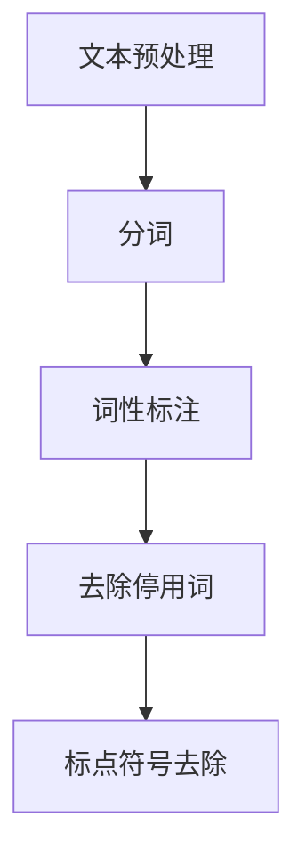
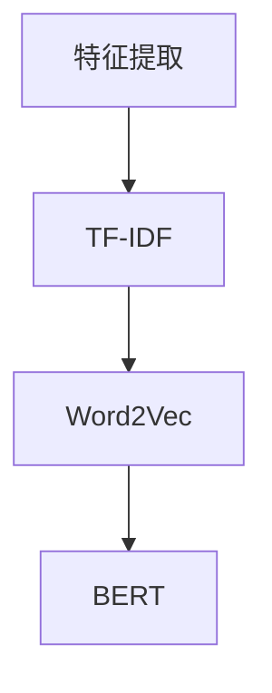
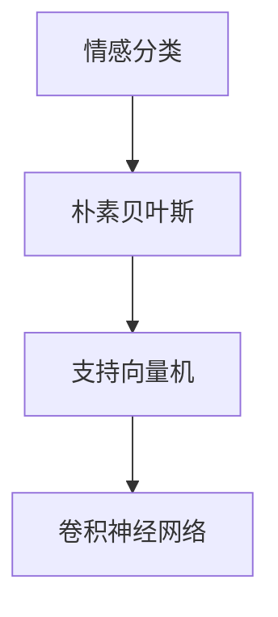
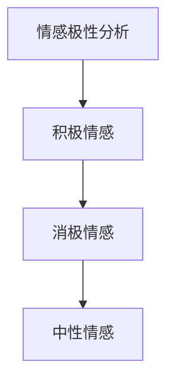
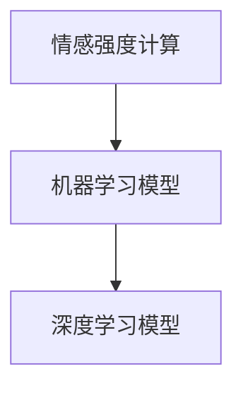

                 

# 自然语言处理在情感计算中的应用

## 关键词：自然语言处理、情感计算、机器学习、深度学习、文本情感分析、情感识别、情感分类

## 摘要：

本文将探讨自然语言处理（NLP）在情感计算中的应用，从背景介绍、核心概念、算法原理、数学模型、项目实战、实际应用场景、工具和资源推荐等方面，系统性地阐述情感计算的原理和方法。文章旨在为读者提供对自然语言处理和情感计算领域的一个全面且深入的认知，并探讨这一领域的发展趋势与挑战。

## 1. 背景介绍

随着互联网的飞速发展，大数据和人工智能技术的普及，自然语言处理（NLP）作为人工智能的一个重要分支，正逐渐渗透到我们日常生活的方方面面。从智能客服、智能助手，到舆情监测、情感分析，NLP技术已经深刻地改变了我们的沟通方式和信息获取方式。

情感计算，作为NLP的一个重要应用领域，旨在使计算机理解和模拟人类情感。它通过自然语言处理技术，从文本中提取情感信息，进而对情感进行识别、分类和分析。情感计算不仅在商业领域有广泛的应用，如个性化推荐、情感广告等，也在医疗、教育、法律等领域展现出巨大的潜力。

## 2. 核心概念与联系

### 2.1 自然语言处理（NLP）

自然语言处理（NLP）是人工智能领域的一个重要分支，主要研究如何使计算机能够理解、生成和处理自然语言。NLP的核心任务包括：

- 文本预处理：包括分词、词性标注、命名实体识别等。
- 语言模型：用于预测下一个单词或句子的概率分布。
- 语义理解：包括词义消歧、实体识别、语义角色标注等。
- 文本生成：包括机器翻译、文本摘要、对话系统等。

### 2.2 情感计算

情感计算（Affective Computing）是指计算机系统模拟、识别、理解和表达情感的能力。情感计算的核心任务包括：

- 情感识别：从文本、语音、图像等数据中提取情感信息。
- 情感分类：将情感分为不同的类别，如积极、消极、中性等。
- 情感分析：对情感信息进行深入分析，如情感强度、情感变化等。

### 2.3 NLP与情感计算的联系

自然语言处理（NLP）是情感计算（Affective Computing）的基础。NLP技术用于提取文本中的情感信息，如情感词汇、情感短语等。这些信息经过情感计算模型处理后，可以得到情感分类、情感强度等信息。因此，NLP和情感计算是相互依赖、相互促进的关系。

## 3. 核心算法原理 & 具体操作步骤

### 3.1 文本情感分析

文本情感分析是情感计算中最基本、最常用的技术。它主要通过以下步骤进行：

- **文本预处理**：包括去除停用词、标点符号、进行词性标注等。



- **特征提取**：将文本转换为特征向量，常用的方法有TF-IDF、Word2Vec、BERT等。



- **情感分类**：使用机器学习或深度学习模型对特征向量进行分类，常用的模型有朴素贝叶斯、支持向量机、卷积神经网络等。



### 3.2 情感强度分析

情感强度分析是对文本中的情感进行量化分析，以了解情感的强度和变化。它主要通过以下步骤进行：

- **情感极性分析**：将情感分为积极、消极和中性三个类别，并标记每个类别的强度。



- **情感强度计算**：使用机器学习或深度学习模型计算每个类别的情感强度。



## 4. 数学模型和公式 & 详细讲解 & 举例说明

### 4.1 特征提取

#### 4.1.1 TF-IDF

TF-IDF（Term Frequency-Inverse Document Frequency）是一种常用的文本特征提取方法。它通过计算词频（TF）和逆文档频率（IDF）来衡量词的重要性。

- **词频（TF）**：词频是指一个词在文档中出现的次数。
  
  $$TF(t, d) = \frac{f(t, d)}{N}$$

  其中，$t$ 表示词，$d$ 表示文档，$f(t, d)$ 表示词$t$在文档$d$中出现的次数，$N$ 表示文档长度。

- **逆文档频率（IDF）**：逆文档频率是指一个词在文档集合中未出现的频率。
  
  $$IDF(t, D) = \log \frac{N}{|d \in D| : t \in d|}$$

  其中，$D$ 表示文档集合，$|d \in D| : t \in d|$ 表示文档集合中包含词$t$的文档数量。

- **TF-IDF**：将词频和逆文档频率结合，得到词的重要性。
  
  $$TF-IDF(t, d, D) = TF(t, d) \times IDF(t, D)$$

#### 4.1.2 Word2Vec

Word2Vec 是一种基于神经网络的文本特征提取方法。它通过将词映射到向量空间，以捕获词的语义信息。

- **Word2Vec 模型**：Word2Vec 模型是一种基于神经网络的文本特征提取方法。它通过将词映射到向量空间，以捕获词的语义信息。
  
  $$v_w = \text{sgnsim}(w, w')$$

  其中，$v_w$ 表示词 $w$ 的向量表示，$\text{sgnsim}$ 表示相似性函数。

#### 4.1.3 BERT

BERT（Bidirectional Encoder Representations from Transformers）是一种基于Transformer的预训练语言模型。它通过双向编码器来捕获文本的语义信息。

- **BERT 模型**：BERT 模型通过在大量文本数据上预训练，学习文本的语义表示。

  $$[CLS] X [SEP]$$

  其中，$X$ 表示文本序列，$[CLS]$ 和 $[SEP]$ 分别表示分类和分隔标记。

### 4.2 情感分类

#### 4.2.1 朴素贝叶斯

朴素贝叶斯是一种基于概率论的分类算法。它通过计算先验概率、条件概率和后验概率来预测标签。

- **先验概率**：先验概率表示每个类别的概率。

  $$P(y) = \frac{N(y)}{N}$$

  其中，$y$ 表示类别，$N(y)$ 表示类别 $y$ 的样本数量，$N$ 表示总样本数量。

- **条件概率**：条件概率表示在某个类别下，某个特征的取值的概率。

  $$P(x|y) = \frac{P(x, y)}{P(y)}$$

  其中，$x$ 表示特征，$y$ 表示类别。

- **后验概率**：后验概率表示在给定特征的情况下，某个类别的概率。

  $$P(y|x) = \frac{P(x|y)P(y)}{P(x)}$$

#### 4.2.2 支持向量机

支持向量机（SVM）是一种基于优化理论的分类算法。它通过最大化分类边界来划分数据。

- **优化目标**：优化目标是最小化分类边界上的间隔。

  $$\min_{\mathbf{w}, b} \frac{1}{2}||\mathbf{w}||^2$$

  其中，$\mathbf{w}$ 表示权重向量，$b$ 表示偏置。

- **约束条件**：约束条件是所有样本都位于分类边界的一侧。

  $$y_i(\mathbf{w}\cdot x_i + b) \geq 1$$

#### 4.2.3 卷积神经网络

卷积神经网络（CNN）是一种基于神经网络的分类算法。它通过卷积操作和池化操作来提取特征。

- **卷积操作**：卷积操作用于提取局部特征。

  $$h_i = \sum_{j=1}^{C} w_{ij} \cdot h_{i-j} + b$$

  其中，$h_i$ 表示输出特征，$w_{ij}$ 表示权重，$h_{i-j}$ 表示输入特征，$C$ 表示卷积核数量，$b$ 表示偏置。

- **池化操作**：池化操作用于降低特征维度。

  $$p_i = \max_{j \in \Omega_i} h_{ij}$$

  其中，$p_i$ 表示输出特征，$\Omega_i$ 表示池化区域。

## 5. 项目实战：代码实际案例和详细解释说明

### 5.1 开发环境搭建

在开始项目实战之前，我们需要搭建一个合适的开发环境。以下是一个基本的开发环境搭建步骤：

1. 安装 Python 解释器：版本要求 Python 3.6 或以上。
2. 安装 NLP 相关库：如 NLTK、spaCy、gensim、transformers 等。
3. 安装机器学习库：如 Scikit-learn、TensorFlow、PyTorch 等。

### 5.2 源代码详细实现和代码解读

以下是一个简单的文本情感分析项目的源代码实现和代码解读。

```python
# 导入相关库
import nltk
from nltk.corpus import stopwords
from sklearn.feature_extraction.text import TfidfVectorizer
from sklearn.model_selection import train_test_split
from sklearn.naive_bayes import MultinomialNB
from sklearn.metrics import classification_report

# 下载停用词
nltk.download('stopwords')

# 读取数据
with open('data.csv', 'r', encoding='utf-8') as f:
    data = f.readlines()

# 分割数据
texts = [line.strip() for line in data[::2]]
labels = [line.strip() for line in data[1::2]]

# 文本预处理
stop_words = set(stopwords.words('english'))
preprocessed_texts = [' '.join([word for word in text.split() if word not in stop_words]) for text in texts]

# 特征提取
vectorizer = TfidfVectorizer()
X = vectorizer.fit_transform(preprocessed_texts)

# 分割数据集
X_train, X_test, y_train, y_test = train_test_split(X, labels, test_size=0.2, random_state=42)

# 模型训练
model = MultinomialNB()
model.fit(X_train, y_train)

# 模型评估
predictions = model.predict(X_test)
print(classification_report(y_test, predictions))
```

### 5.3 代码解读与分析

- **数据读取**：使用 Python 的文件操作功能，读取数据集。
- **文本预处理**：去除停用词、标点符号等，对文本进行清洗。
- **特征提取**：使用 TF-IDF 方法将文本转换为特征向量。
- **模型训练**：使用朴素贝叶斯模型进行训练。
- **模型评估**：使用分类报告评估模型性能。

## 6. 实际应用场景

### 6.1 舆情监测

舆情监测是情感计算在实际应用中的一个重要场景。通过分析社交媒体、新闻评论等文本数据，可以实时了解公众对某一事件或产品的态度和情感。这对于企业制定营销策略、政府监控社会动态具有重要意义。

### 6.2 个性化推荐

个性化推荐系统通过分析用户的情感偏好，为用户推荐符合其兴趣的内容。情感计算技术可以用于提取用户的情感信息，从而提高推荐系统的准确性。例如，在电子商务平台上，可以通过情感分析为用户推荐其可能感兴趣的商品。

### 6.3 智能客服

智能客服系统通过情感计算技术，可以更好地理解用户的情感和需求，提供更加人性化、贴心的服务。例如，在金融行业中，智能客服可以通过情感分析识别用户的情绪波动，及时调整服务策略，提高用户满意度。

## 7. 工具和资源推荐

### 7.1 学习资源推荐

- **书籍**：
  - 《自然语言处理综合教程》
  - 《情感计算：理论与实践》
  - 《深度学习：周志华著》
- **论文**：
  - 《情感分析的最新进展》
  - 《基于深度学习的文本情感分析》
  - 《情感计算的挑战与机遇》
- **博客**：
  - 阮一峰的网络日志
  - 吴恩达的博客
  - 知乎相关话题
- **网站**：
  - Kaggle
  - arXiv
  - Google Research

### 7.2 开发工具框架推荐

- **开发工具**：
  - Jupyter Notebook
  - PyCharm
  - VS Code
- **框架**：
  - TensorFlow
  - PyTorch
  - spaCy

### 7.3 相关论文著作推荐

- **论文**：
  - “Affective Computing: A Survey” by Luna and Picard
  - “Sentiment Analysis: An Overview” by Liu
  - “Deep Learning for Text Classification” by Yang et al.
- **著作**：
  - 《自然语言处理综述》
  - 《情感计算：理论与实践》
  - 《深度学习：周志华著》

## 8. 总结：未来发展趋势与挑战

### 8.1 发展趋势

- **跨模态情感计算**：随着语音识别、图像识别等技术的发展，跨模态情感计算将成为未来的一个重要研究方向。通过结合多种模态信息，可以更准确地理解和模拟人类情感。
- **低资源情感计算**：在资源受限的环境下，如何进行有效的情感计算是一个重要挑战。未来的研究将关注如何在低资源环境下实现高效的情感计算。
- **情感生成**：情感生成是指生成具有特定情感特征的文本。未来的研究将关注如何利用情感计算技术生成具有丰富情感信息的文本，为虚拟现实、游戏等领域提供支持。

### 8.2 挑战

- **情感理解的深度和广度**：目前的情感计算技术主要关注情感识别和分类，如何深入理解情感的深度和广度是一个重要挑战。
- **跨语言情感计算**：不同语言的文化差异和表达方式不同，如何进行有效的跨语言情感计算是一个难题。
- **隐私保护**：在处理大量用户数据时，如何保护用户隐私是一个重要问题。

## 9. 附录：常见问题与解答

### 9.1 问题1

**问题**：什么是自然语言处理（NLP）？

**解答**：自然语言处理（NLP）是人工智能领域的一个重要分支，主要研究如何使计算机能够理解、生成和处理自然语言。NLP涉及的语言包括英语、中文、法语、德语等多种语言，其目的是使计算机能够理解人类的语言，并能够以自然的方式进行交流。

### 9.2 问题2

**问题**：情感计算的核心任务是什么？

**解答**：情感计算的核心任务是使计算机能够理解和模拟人类情感。这包括情感识别、情感分类、情感强度分析等任务。情感计算的核心任务是通过自然语言处理技术从文本、语音、图像等多模态数据中提取情感信息，并对情感进行深入分析。

## 10. 扩展阅读 & 参考资料

- 《自然语言处理综合教程》
- 《情感计算：理论与实践》
- 《深度学习：周志华著》
- “Affective Computing: A Survey” by Luna and Picard
- “Sentiment Analysis: An Overview” by Liu
- “Deep Learning for Text Classification” by Yang et al.
- [阮一峰的网络日志](https://www.ruanyifeng.com/)
- [吴恩达的博客](https://www.deeplearning.net/)
- [知乎相关话题](https://www.zhihu.com/)
- [Kaggle](https://www.kaggle.com/)
- [arXiv](https://arxiv.org/)
- [Google Research](https://research.google.com/)

