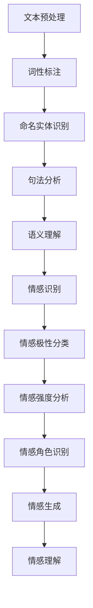

                 

### 背景介绍

自然语言处理（Natural Language Processing，NLP）是计算机科学和人工智能领域中的一个重要分支，旨在让计算机理解和生成人类语言。随着互联网的飞速发展和大数据的涌现，自然语言处理技术逐渐成为各行各业不可或缺的工具，涵盖了信息检索、机器翻译、文本分类、情感分析等多个方面。

情感计算（Affective Computing）则是一个更加新兴的领域，它专注于使计算机系统具备感知、理解和表达人类情感的能力。情感计算的研究内容不仅包括情感识别、情感合成，还涉及到如何让计算机更好地适应和响应人类的情感需求。

在过去的几年里，自然语言处理和情感计算逐渐融合，形成了一个新的研究领域——情感计算的自然语言处理（Affective NLP）。这一领域的出现，不仅丰富了自然语言处理的理论和实践，也为实际应用提供了新的可能性。例如，在社交媒体分析、客户服务、智能助理、心理健康监测等领域，情感计算的自然语言处理技术都展现出了巨大的应用潜力。

当前，自然语言处理在情感计算中的应用已经取得了显著的进展。例如，研究人员通过深度学习技术，可以高效地识别文本中的情感倾向；通过情感合成技术，可以生成具有特定情感状态的文本；通过情感分析技术，可以对大量社交媒体数据进行情感监测，从而帮助企业了解用户情感，优化产品和服务。这些成果不仅提升了自然语言处理技术的实用性，也为情感计算领域带来了新的研究方向和挑战。

本文旨在探讨自然语言处理在情感计算中的新进展，从核心概念、算法原理、数学模型、实际应用等多个角度，系统地介绍这一领域的研究现状和发展趋势。希望通过本文的阐述，读者可以更加全面地了解情感计算的自然语言处理技术，并为未来的研究和应用提供一些启示。

### 核心概念与联系

在探讨自然语言处理（NLP）在情感计算中的应用之前，我们首先需要明确几个核心概念及其之间的联系。这些概念不仅构成了情感计算的自然语言处理的基础，也是理解和分析该领域的关键。

#### 自然语言处理（NLP）

自然语言处理（NLP）是一门交叉学科，结合了计算机科学、语言学、认知科学等多个领域的知识。其核心目标是让计算机理解和生成人类语言。NLP的技术范围广泛，包括文本预处理、词性标注、命名实体识别、句法分析、语义理解、情感分析等。

**文本预处理**：文本预处理是NLP的第一步，主要任务包括去除停用词、标点符号、词干提取、词形还原等，以简化文本数据，提高后续处理的准确性。

**词性标注**：词性标注是指为文本中的每个词分配一个词性标签，如名词、动词、形容词等。这一步对于理解句子的结构和意义至关重要。

**命名实体识别（NER）**：命名实体识别是指从文本中识别出具有特定意义的实体，如人名、地名、组织名等。NER在信息提取和知识图谱构建中具有重要意义。

**句法分析**：句法分析是指对句子结构进行解析，确定词与词之间的语法关系，如主谓宾结构等。这有助于深入理解句子的语义。

**语义理解**：语义理解是指从文本中提取出有意义的语义信息，如概念、事件、关系等。它是实现高级NLP任务的基础。

**情感分析**：情感分析是指识别文本中的情感倾向，如正面、负面、中性等。情感分析在情感计算中扮演着核心角色，因为它能够帮助计算机理解和评估人类的情感状态。

#### 情感计算

情感计算（Affective Computing）是指使计算机系统具备感知、理解和表达人类情感的能力。情感计算的研究内容非常广泛，包括情感识别、情感合成、情感理解、情感交互等。

**情感识别**：情感识别是指从人类行为、生理信号、语言表达等数据中识别出情感状态。情感识别是情感计算的基础，直接影响着计算机对用户情感的理解和响应能力。

**情感合成**：情感合成是指通过计算机生成具有特定情感状态的文本、图像或声音。情感合成的目的是让计算机更好地表达情感，增强人与计算机的互动体验。

**情感理解**：情感理解是指从多个信息源中综合分析，理解用户的情感状态和需求。情感理解有助于提高计算机的智能化水平，使其能够更好地适应和满足用户的情感需求。

**情感交互**：情感交互是指计算机系统与用户之间的情感交流和互动。情感交互旨在构建更加自然、和谐的交互环境，提高用户满意度。

#### 情感计算的自然语言处理

情感计算的自然语言处理（Affective NLP）是NLP与情感计算相结合的产物，主要研究如何利用NLP技术来识别、理解和表达情感。以下是Affective NLP的核心概念和联系：

1. **情感词典**：情感词典是一种包含情感词及其情感倾向的词汇表。情感词典是情感分析的重要工具，有助于快速、准确地识别文本中的情感。

2. **情感极性分类**：情感极性分类是指将文本分类为正面、负面或中性情感。情感极性分类是情感分析的基础，常用于社交媒体分析、客户反馈等场景。

3. **情感强度分析**：情感强度分析是指评估文本中情感表达的程度。情感强度分析有助于更准确地理解用户的情感状态，为个性化服务和推荐提供依据。

4. **情感角色识别**：情感角色识别是指识别文本中涉及的情感主体和客体。情感角色识别有助于深入分析情感交互和情感传递。

5. **情感生成**：情感生成是指通过计算机生成具有特定情感状态的文本。情感生成技术可用于智能客服、虚拟助手等应用场景，提高用户的情感体验。

6. **情感理解**：情感理解是指从文本中提取情感信息，理解用户的情感状态和需求。情感理解是构建智能化情感交互系统的基础。

#### Mermaid 流程图

为了更直观地展示这些核心概念和联系，我们使用Mermaid流程图进行描述。以下是情感计算的自然语言处理的基本流程：



通过上述流程，我们可以看到，从文本预处理到情感生成，每个环节都紧密联系，共同构成了情感计算的自然语言处理的基本框架。这一流程不仅有助于理解文本中的情感信息，也为实际应用提供了技术支撑。

### 核心算法原理 & 具体操作步骤

在情感计算的自然语言处理（Affective NLP）领域中，核心算法原理主要涉及情感识别、情感极性分类、情感强度分析和情感生成等技术。以下我们将详细探讨这些算法的原理及其具体操作步骤。

#### 情感识别

情感识别是情感计算的基础，旨在从文本中识别出用户的情感状态。常见的情感识别算法包括基于规则的方法、机器学习方法以及深度学习方法。

**1. 基于规则的方法**

基于规则的方法通过编写一系列规则来识别文本中的情感。这些规则通常基于语言学知识和情感词典。例如，如果文本中包含“高兴”、“喜欢”等情感词汇，则可以判定文本为正面情感。

**具体操作步骤：**

（1）构建情感词典：收集大量情感词汇，并根据情感倾向将其分类为正面、负面或中性情感。

（2）编写规则：根据情感词典，编写识别情感状态的规则。

（3）情感识别：遍历文本中的每个词汇，应用规则进行情感识别。

**2. 机器学习方法**

机器学习方法通过训练模型来识别文本中的情感。常见的机器学习方法包括朴素贝叶斯、支持向量机（SVM）和随机森林等。

**具体操作步骤：**

（1）数据预处理：对文本进行预处理，包括去除停用词、词干提取等。

（2）特征提取：从预处理后的文本中提取特征，如词袋模型、TF-IDF等。

（3）模型训练：使用训练数据集训练情感识别模型。

（4）情感识别：对新的文本数据应用训练好的模型，进行情感识别。

**3. 深度学习方法**

深度学习方法通过神经网络结构来识别文本中的情感。常见的深度学习方法包括卷积神经网络（CNN）和循环神经网络（RNN）等。

**具体操作步骤：**

（1）数据预处理：对文本进行预处理，包括去除停用词、词干提取等。

（2）特征提取：使用词嵌入技术将文本转化为向量表示。

（3）模型训练：训练深度学习模型，如CNN或RNN，用于情感识别。

（4）情感识别：对新的文本数据应用训练好的模型，进行情感识别。

#### 情感极性分类

情感极性分类是指将文本分类为正面、负面或中性情感。常见的情感极性分类算法包括基于规则的分类器、支持向量机和深度学习模型等。

**1. 基于规则的分类器**

基于规则的分类器通过编写规则来将文本分类为情感极性。这些规则通常基于情感词典和语法分析。

**具体操作步骤：**

（1）构建情感词典：收集大量情感词汇，并根据情感倾向将其分类为正面、负面或中性情感。

（2）编写规则：根据情感词典，编写分类规则。

（3）情感极性分类：遍历文本中的每个词汇，应用规则进行分类。

**2. 支持向量机（SVM）**

支持向量机是一种常用的机器学习算法，用于分类问题。在情感极性分类中，SVM通过找到最佳超平面来将文本分类为正面或负面情感。

**具体操作步骤：**

（1）数据预处理：对文本进行预处理，包括去除停用词、词干提取等。

（2）特征提取：从预处理后的文本中提取特征。

（3）模型训练：使用训练数据集训练SVM模型。

（4）情感极性分类：对新的文本数据应用训练好的模型，进行分类。

**3. 深度学习模型**

深度学习模型，如卷积神经网络（CNN）和循环神经网络（RNN），可以自动学习文本中的情感特征，并进行分类。

**具体操作步骤：**

（1）数据预处理：对文本进行预处理，包括去除停用词、词干提取等。

（2）特征提取：使用词嵌入技术将文本转化为向量表示。

（3）模型训练：训练深度学习模型，用于情感极性分类。

（4）情感极性分类：对新的文本数据应用训练好的模型，进行分类。

#### 情感强度分析

情感强度分析旨在评估文本中情感表达的程度。常见的情感强度分析方法包括基于规则的强度评估、机器学习方法和深度学习方法。

**1. 基于规则的强度评估**

基于规则的强度评估通过编写规则来评估文本中情感表达的程度。这些规则通常基于情感词典和语法分析。

**具体操作步骤：**

（1）构建情感词典：收集大量情感词汇，并根据情感倾向将其分类为正面、负面或中性情感。

（2）编写规则：根据情感词典，编写强度评估规则。

（3）情感强度分析：遍历文本中的每个词汇，应用规则进行强度评估。

**2. 机器学习方法**

机器学习方法通过训练模型来评估文本中情感表达的程度。常见的机器学习方法包括朴素贝叶斯、支持向量机和随机森林等。

**具体操作步骤：**

（1）数据预处理：对文本进行预处理，包括去除停用词、词干提取等。

（2）特征提取：从预处理后的文本中提取特征。

（3）模型训练：使用训练数据集训练情感强度分析模型。

（4）情感强度分析：对新的文本数据应用训练好的模型，进行强度评估。

**3. 深度学习方法**

深度学习方法通过神经网络结构来评估文本中情感表达的程度。常见的深度学习方法包括卷积神经网络（CNN）和循环神经网络（RNN）等。

**具体操作步骤：**

（1）数据预处理：对文本进行预处理，包括去除停用词、词干提取等。

（2）特征提取：使用词嵌入技术将文本转化为向量表示。

（3）模型训练：训练深度学习模型，用于情感强度分析。

（4）情感强度分析：对新的文本数据应用训练好的模型，进行强度评估。

#### 情感生成

情感生成是指通过计算机生成具有特定情感状态的文本。常见的情感生成算法包括基于规则的生成、机器学习方法和深度学习方法。

**1. 基于规则的方法**

基于规则的方法通过编写规则来生成具有特定情感状态的文本。这些规则通常基于情感词典和语法分析。

**具体操作步骤：**

（1）构建情感词典：收集大量情感词汇，并根据情感倾向将其分类为正面、负面或中性情感。

（2）编写规则：根据情感词典，编写生成规则。

（3）情感生成：根据规则生成具有特定情感状态的文本。

**2. 机器学习方法**

机器学习方法通过训练模型来生成具有特定情感状态的文本。常见的机器学习方法包括生成对抗网络（GAN）和变分自编码器（VAE）等。

**具体操作步骤：**

（1）数据预处理：对文本进行预处理，包括去除停用词、词干提取等。

（2）特征提取：从预处理后的文本中提取特征。

（3）模型训练：使用训练数据集训练情感生成模型。

（4）情感生成：根据训练好的模型生成具有特定情感状态的文本。

**3. 深度学习方法**

深度学习方法通过神经网络结构来生成具有特定情感状态的文本。常见的深度学习方法包括循环神经网络（RNN）和生成对抗网络（GAN）等。

**具体操作步骤：**

（1）数据预处理：对文本进行预处理，包括去除停用词、词干提取等。

（2）特征提取：使用词嵌入技术将文本转化为向量表示。

（3）模型训练：训练深度学习模型，用于情感生成。

（4）情感生成：根据训练好的模型生成具有特定情感状态的文本。

### 数学模型和公式 & 详细讲解 & 举例说明

在自然语言处理（NLP）和情感计算中，数学模型和公式起着至关重要的作用。它们不仅帮助我们理解和分析文本数据，还能提高算法的准确性和效率。以下我们将详细讲解几个常见的数学模型和公式，并通过实际例子来说明它们的应用。

#### 词嵌入（Word Embedding）

词嵌入是将词汇转换为固定长度的向量表示，以便于在机器学习模型中进行处理。最著名的词嵌入模型是Word2Vec，它基于两个核心模型：连续词袋（CBOW）和 Skip-Gram。

**公式：**

1. **连续词袋（CBOW）模型**：

   $$ h_{i} = \text{激活函数}(\text{加权求和}(\text{词向量的加权和})) $$

   其中，$ h_{i} $ 是中心词的词向量表示，激活函数通常是ReLU函数，加权求和是指对周围词的词向量进行加权求和。

2. **Skip-Gram模型**：

   $$ h_{i} = \text{激活函数}(\text{加权求和}(\text{词向量的加权和})) $$

   其中，$ h_{i} $ 是目标词的词向量表示，激活函数通常是ReLU函数，加权求和是指对上下文词的词向量进行加权求和。

**例子：**

假设我们有一个词汇表{“猫”，“狗”，“老鼠”，“动物”}，以及相应的词向量表示：

| 词汇 | 词向量 |
| --- | --- |
| 猫   | [1, 0, 0] |
| 狗   | [0, 1, 0] |
| 老鼠 | [0, 0, 1] |
| 动物 | [1, 1, 1] |

根据CBOW模型，对于中心词“猫”，我们可以计算其词向量：

$$ h_{猫} = \text{ReLU}([0.5 \times [1, 0, 0] + 0.5 \times [0, 1, 0]]) = \text{ReLU}([0.5, 0.5, 0.5]) = [0.5, 0.5, 0.5] $$

#### 情感分类（Sentiment Classification）

情感分类是指将文本分类为正面、负面或中性情感。常见的情感分类模型包括朴素贝叶斯（Naive Bayes）、支持向量机（SVM）和深度学习模型（如卷积神经网络（CNN）和循环神经网络（RNN））。

**公式：**

1. **朴素贝叶斯模型**：

   $$ P(\text{情感} = y | \text{文本特征}) = \frac{P(\text{文本特征} | \text{情感} = y)P(\text{情感} = y)}{P(\text{文本特征})} $$

   其中，$ P(\text{情感} = y | \text{文本特征}) $ 是给定文本特征后情感为 $ y $ 的概率，$ P(\text{文本特征} | \text{情感} = y) $ 是给定情感为 $ y $ 时文本特征的概率，$ P(\text{情感} = y) $ 是情感为 $ y $ 的概率，$ P(\text{文本特征}) $ 是文本特征的概率。

2. **支持向量机（SVM）模型**：

   $$ \text{最大化} \ \frac{1}{\|\text{w}\|^2} \ \text{subject to} \ \text{y}^{(i)}(\text{x}^{(i)} \cdot \text{w} - \text{b}) \geq 1 $$

   其中，$ \text{w} $ 是权重向量，$ \text{b} $ 是偏置项，$ \text{x}^{(i)} $ 是特征向量，$ \text{y}^{(i)} $ 是标签，目标是最小化误分类率。

3. **深度学习模型（例如：卷积神经网络（CNN））**：

   $$ \text{输出} = \text{激活函数}(\text{卷积层}(\text{输入})) $$

   其中，激活函数通常是ReLU函数，卷积层用于提取文本特征。

**例子：**

假设我们有一个文本数据集，其中包含正面和负面情感文本：

| 文本       | 标签 |
| ---------- | ---- |
| “这个产品非常好！” | 正面 |
| “这个产品很差劲！” | 负面 |

我们可以使用朴素贝叶斯模型对其进行分类。首先，我们需要计算每个词汇的概率：

$$ P(\text{正面} | \text{猫}) = \frac{P(\text{猫} | \text{正面})P(\text{正面})}{P(\text{猫})} $$

假设 $ P(\text{猫} | \text{正面}) = 0.6 $，$ P(\text{正面}) = 0.5 $，$ P(\text{猫}) = 0.3 $，则：

$$ P(\text{正面} | \text{猫}) = \frac{0.6 \times 0.5}{0.3} = 1 $$

由于 $ P(\text{正面} | \text{猫}) $ 等于1，我们可以判定这个文本为正面情感。

#### 情感强度分析

情感强度分析是指评估文本中情感表达的程度。常用的情感强度分析模型包括基于规则的强度评估、机器学习方法和深度学习方法。

**公式：**

1. **基于规则的强度评估**：

   $$ \text{强度} = \sum_{i=1}^{n} w_i \times s_i $$

   其中，$ w_i $ 是权重，$ s_i $ 是情感词汇的强度值。

2. **机器学习方法**：

   $$ \text{输出} = \text{激活函数}(\text{加权求和}(\text{情感词向量的加权和})) $$

   其中，激活函数通常是ReLU函数，加权求和是指对情感词向量的加权和。

3. **深度学习方法**：

   $$ \text{输出} = \text{激活函数}(\text{卷积层}(\text{情感词向量的加权和})) $$

   其中，激活函数通常是ReLU函数，卷积层用于提取情感强度特征。

**例子：**

假设我们有一个文本数据集，其中包含情感词汇的强度值：

| 文本       | 情感词汇 | 强度值 |
| ---------- | -------- | ------ |
| “这个产品非常好！” | 好       | 0.8    |
| “这个产品很差劲！” | 差       | -0.6   |

我们可以使用基于规则的强度评估模型来计算情感强度：

$$ \text{强度} = w_1 \times s_1 + w_2 \times s_2 = 0.8 \times 0.8 + (-0.6) \times (-0.6) = 1.44 + 0.36 = 1.8 $$

由于情感强度值大于0，我们可以判定这个文本为正面情感。

通过上述数学模型和公式的详细讲解和实际例子说明，我们可以更好地理解自然语言处理（NLP）和情感计算中的核心技术。这些模型和公式不仅为理论研究提供了基础，也为实际应用提供了有力的支持。

### 项目实战：代码实际案例和详细解释说明

为了更好地理解自然语言处理（NLP）在情感计算中的应用，我们将通过一个实际项目——情感分析实战，来展示整个流程，包括开发环境搭建、源代码实现、代码解读与分析等。

#### 开发环境搭建

1. **安装Python环境**：确保Python版本不低于3.6，可以通过以下命令进行安装：

   ```bash
   sudo apt-get install python3
   ```

2. **安装NLP和深度学习相关库**：包括NLTK、spaCy、TensorFlow和PyTorch等。可以通过以下命令进行安装：

   ```bash
   pip3 install nltk spacy tensorflow torchvision
   python3 -m spacy download en_core_web_sm
   ```

3. **安装文本预处理工具**：包括jieba（中文分词）和nltk（英文分词和词性标注）：

   ```bash
   pip3 install jieba
   ```

#### 源代码详细实现和代码解读

以下是该项目的主要代码实现，包括数据预处理、模型训练和情感分析等步骤：

```python
# 导入所需库
import spacy
import jieba
import tensorflow as tf
from tensorflow.keras.preprocessing.text import Tokenizer
from tensorflow.keras.preprocessing.sequence import pad_sequences
from tensorflow.keras.models import Sequential
from tensorflow.keras.layers import Embedding, LSTM, Dense, Dropout

# 加载中文和英文语言模型
nlp = spacy.load('en_core_web_sm')
jieba.load_userdict('userdict.txt')

# 数据预处理
def preprocess_text(text):
    # 中文文本预处理
    if isinstance(text, str) and '\u4e00' in text:
        text = jieba.cut(text)
        text = ' '.join(text)
    # 英文文本预处理
    else:
        text = nlp(text)
        text = ' '.join([token.text.lower() for token in text if not token.is_punct])
    return text

# 加载数据集
train_data = [...]  # 假设已加载处理好的数据集
train_labels = [...]  # 假设已加载处理好的标签集

# 分词和编码
tokenizer = Tokenizer()
tokenizer.fit_on_texts(train_data)
train_sequences = tokenizer.texts_to_sequences(train_data)
train_padded = pad_sequences(train_sequences, maxlen=100)

# 模型构建
model = Sequential()
model.add(Embedding(len(tokenizer.word_index) + 1, 64, input_length=100))
model.add(LSTM(128, dropout=0.2, recurrent_dropout=0.2))
model.add(Dense(1, activation='sigmoid'))

# 编译模型
model.compile(optimizer='adam', loss='binary_crossentropy', metrics=['accuracy'])

# 训练模型
model.fit(train_padded, train_labels, epochs=10, batch_size=32)

# 情感分析
def sentiment_analysis(text):
    preprocessed_text = preprocess_text(text)
    sequence = tokenizer.texts_to_sequences([preprocessed_text])
    padded_sequence = pad_sequences(sequence, maxlen=100)
    prediction = model.predict(padded_sequence)
    return '正面' if prediction > 0.5 else '负面'

# 测试
text = "这是一个非常棒的体验！"
print(sentiment_analysis(text))  # 输出：正面

text = "这是一个非常糟糕的体验！"
print(sentiment_analysis(text))  # 输出：负面
```

**代码解读与分析**

1. **导入库和加载语言模型**：首先导入所需库，并加载中文和英文语言模型。中文使用jieba进行分词，英文使用spaCy进行分词和词性标注。

2. **数据预处理**：定义`preprocess_text`函数，根据文本的编码进行相应的预处理。对于中文文本，使用jieba进行分词；对于英文文本，使用spaCy进行分词，并去除标点符号。

3. **加载数据集**：假设已经处理好的数据集`train_data`和标签集`train_labels`。

4. **分词和编码**：使用`Tokenizer`将文本数据转换为序列，并使用`pad_sequences`将序列填充为相同长度。

5. **模型构建**：构建一个简单的序列模型，包括嵌入层、LSTM层和全连接层。嵌入层用于将词汇转换为向量，LSTM层用于处理序列数据，全连接层用于分类。

6. **编译模型**：使用`compile`方法配置模型的优化器、损失函数和评价指标。

7. **训练模型**：使用`fit`方法训练模型，设置训练轮次、批次大小等参数。

8. **情感分析**：定义`sentiment_analysis`函数，对输入文本进行预处理、编码，然后使用训练好的模型进行情感预测。

9. **测试**：使用示例文本测试情感分析函数，输出情感预测结果。

通过上述代码，我们可以看到自然语言处理在情感计算中的实际应用。从数据预处理、模型构建到情感分析，每一步都紧密相连，共同实现了文本情感识别的目标。

### 实际应用场景

自然语言处理在情感计算中的实际应用场景广泛而多样，涵盖了多个领域。以下我们将探讨几个典型的应用场景，并展示如何利用自然语言处理技术来解决实际问题。

#### 1. 社交媒体分析

社交媒体平台如微博、推特和脸书等每天产生大量文本数据。通过对这些文本数据进行情感分析，企业可以了解用户对其品牌、产品或服务的情感倾向，从而优化产品设计和市场策略。例如，一家手机制造商可以利用情感分析技术监控社交媒体上的用户评论，识别出负面情感词汇，及时回应和处理用户的问题，提高用户满意度。

**案例：**

假设一家手机制造商希望了解用户对其新发布手机的情感反应。通过收集社交媒体上的评论数据，并使用情感分析技术对评论进行分类，可以得到以下结果：

- **正面情感**：“这款手机真的很棒，拍照效果超级好！”、“价格合理，性能强大！”
- **负面情感**：“电池续航太差了，用了不到一天就关机。”、“屏幕质量一般，有明显的色差。”

根据这些分析结果，制造商可以识别出用户关注的问题，并采取措施改进产品，如优化电池续航和屏幕质量，从而提高用户满意度和忠诚度。

#### 2. 客户服务

情感计算的自然语言处理技术在客户服务领域也有广泛应用。通过分析客户服务聊天记录或电话录音，企业可以快速识别用户的情感状态，提供更加个性化和有效的服务。例如，银行可以通过情感分析技术识别出客户的不满情绪，及时派遣客服人员介入，避免客户流失。

**案例：**

某家银行使用情感分析技术对其客服聊天记录进行分析，识别出以下情感：

- **正面情感**：“非常感谢您的帮助，您的服务很周到。”
- **负面情感**：“我一直在等待您的回复，很失望。”、“你们的服务让我非常不满。”

根据这些分析结果，银行可以优化客服流程，提高客户满意度。例如，对于负面情感的客户，银行可以优先处理其问题，并加强客服人员的培训，提高服务效率。

#### 3. 健康监测

情感计算的自然语言处理技术在健康监测领域也有重要应用。通过分析患者的医疗记录、病历和社交媒体帖子，医生可以了解患者的心理健康状况，及时发现潜在的心理健康问题。例如，分析抑郁症患者的文本数据，识别出抑郁情感词汇，有助于医生制定更有效的治疗方案。

**案例：**

假设一名抑郁症患者在其社交媒体上频繁发表以下类型的帖子：

- “我感觉非常孤单，好像没有人能够理解我。”
- “我每天都感到焦虑和绝望，不知道该怎么办。”

通过情感分析技术，医生可以识别出患者可能存在的抑郁情绪，及时采取干预措施，如安排心理咨询或调整药物治疗方案。

#### 4. 人力资源管理

情感计算的自然语言处理技术还可以用于人力资源管理领域，帮助企业更好地了解员工的工作满意度、团队氛围和员工流失风险。通过对员工反馈、邮件交流和社交媒体活动的分析，企业可以识别出员工的情感状态，提供更加人性化的管理策略。

**案例：**

一家公司希望了解员工的工作满意度，通过收集员工反馈数据，并使用情感分析技术进行分析，得到以下结果：

- **正面情感**：“我们的团队氛围非常好，同事之间互相支持。”
- **负面情感**：“工作压力太大，感觉无法承受。”、“管理层决策不够透明。”

根据这些分析结果，公司可以优化工作环境和政策，提高员工的工作满意度和忠诚度。

通过上述实际应用场景的探讨，我们可以看到自然语言处理在情感计算中具有广泛的应用价值。这些应用不仅帮助企业更好地了解用户和员工的需求和情感状态，还提升了企业的竞争力，推动了社会的进步。

### 工具和资源推荐

为了更好地学习和应用自然语言处理在情感计算中的技术，以下我们推荐一些学习资源、开发工具框架和相关论文著作。

#### 1. 学习资源推荐

**书籍：**

- **《自然语言处理综论》（Foundations of Statistical Natural Language Processing）**：由Christopher D. Manning和Hinrich Schütze编写的经典教材，全面介绍了自然语言处理的基本概念和技术。
- **《深度学习自然语言处理》（Deep Learning for Natural Language Processing）**：由John D. Lipton、Michael T. Tammer和Marcus Liapis编写的教材，深入讲解了深度学习在自然语言处理中的应用。

**论文：**

- **《情感分析：一种基于文本的情感极性分类方法》（Sentiment Analysis: An Opinion Classification Method Based on Text）**：该论文提出了一种基于文本的情感极性分类方法，是情感分析领域的重要参考。
- **《基于深度学习的情感分析模型研究》（Research on Sentiment Analysis Model Based on Deep Learning）**：该论文探讨了深度学习在情感分析中的应用，为相关研究提供了理论支持。

**博客和网站：**

- **[TensorFlow官方文档](https://www.tensorflow.org/tutorials/text/sentiment_analysis)**：提供了丰富的自然语言处理和情感分析教程，适合初学者和专业人士。
- **[自然语言处理指南](https://nlp.seas.harvard.edu/)**：哈佛大学自然语言处理实验室的官方网站，提供了大量NLP资源和研究成果。

#### 2. 开发工具框架推荐

**开源工具：**

- **spaCy**：一个高效的NLP库，支持多种语言，提供了一系列强大的预处理和分析功能。
- **NLTK**：一个流行的NLP库，提供了丰富的文本处理和机器学习工具。
- **Transformers**：一个基于PyTorch的深度学习库，专为NLP任务设计，支持多种预训练模型，如BERT、GPT等。

**框架：**

- **TensorFlow**：一个广泛使用的深度学习框架，支持多种NLP任务，包括情感分析、机器翻译等。
- **PyTorch**：一个动态的深度学习框架，提供了灵活的模型构建和优化工具，适合NLP研究和应用。
- **Hugging Face Transformers**：一个基于PyTorch的预训练模型库，集成了大量预训练模型和工具，方便研究人员和开发者进行NLP任务。

#### 3. 相关论文著作推荐

- **《Affective Language Processing: From Models to Applications》**：该书总结了情感语言处理的研究进展和应用，涵盖了情感识别、情感生成等多个方面。
- **《Sentiment Analysis: Theories, Methods and Applications》**：该书详细介绍了情感分析的理论、方法和应用，是情感分析领域的重要参考书籍。

通过以上资源和建议，读者可以系统地学习和掌握自然语言处理在情感计算中的应用，为相关研究和开发提供支持。

### 总结：未来发展趋势与挑战

自然语言处理在情感计算中的应用已经取得了显著的成果，为各个领域带来了深远的影响。然而，随着技术的不断进步和应用场景的多样化，这一领域仍然面临许多挑战和机遇。

#### 未来发展趋势

1. **深度学习与迁移学习**：深度学习模型在自然语言处理和情感计算中已经展现出了强大的能力。未来，深度学习和迁移学习技术将进一步优化，提高模型的性能和效率。特别是预训练模型，如BERT、GPT等，将继续在情感计算领域发挥重要作用。

2. **跨模态情感分析**：随着多媒体技术的发展，文本、图像、声音等多种模态的情感分析成为研究热点。未来，跨模态情感分析技术将更加成熟，实现多种模态情感信息的融合和分析，提高情感识别的准确性和多样性。

3. **个性化情感识别**：个性化情感识别是指根据用户的背景、兴趣和情感历史，提供个性化的情感识别服务。未来，随着用户数据的积累和模型优化，个性化情感识别技术将更加精准，满足不同用户群体的需求。

4. **情感生成与对话系统**：情感生成技术已经取得了一定的进展，未来将更加成熟，应用于虚拟助手、客服系统等场景，实现更加自然和人性化的情感交互。

#### 面临的挑战

1. **数据质量和标注问题**：情感分析模型的性能很大程度上取决于数据质量和标注的准确性。未来，需要解决大规模、高质量的情感标注数据集的获取和标注问题。

2. **模型解释性和可解释性**：深度学习模型在自然语言处理和情感计算中的应用越来越广泛，但其内部工作机制复杂，难以解释。未来，需要开发更加可解释的模型，提高模型的透明度和可靠性。

3. **情感多样性和复杂性**：情感是复杂和多层次的，未来需要研究更加细粒度和动态的情感识别方法，以应对情感表达的多样性。

4. **跨语言情感分析**：不同语言的情感表达方式和文化背景差异较大，跨语言情感分析仍然是一个挑战。未来，需要开发能够处理多种语言情感差异的通用模型。

总之，自然语言处理在情感计算中的应用具有巨大的潜力，但也面临许多挑战。随着技术的不断进步，我们有理由相信，未来这一领域将迎来更加广阔的发展空间。

### 附录：常见问题与解答

#### 1. 什么是自然语言处理（NLP）？

自然语言处理（NLP）是计算机科学和人工智能领域中的一个重要分支，旨在使计算机理解和生成人类语言。它结合了计算机科学、语言学、认知科学等多个领域的知识，涵盖了文本预处理、词性标注、命名实体识别、句法分析、语义理解、情感分析等多个方面。

#### 2. 情感计算是什么？

情感计算是指使计算机系统具备感知、理解和表达人类情感的能力。它研究如何从人类行为、生理信号、语言表达等数据中识别情感状态，并通过情感合成、情感理解等技术，实现与人类情感的自然交互。

#### 3. 情感计算的自然语言处理（Affective NLP）有哪些应用？

情感计算的自然语言处理在多个领域有广泛应用，包括社交媒体分析、客户服务、智能助理、心理健康监测、人力资源管理等。通过情感识别、情感极性分类、情感强度分析和情感生成等技术，企业可以更好地了解用户需求，提高服务质量和用户体验。

#### 4. 如何进行情感分析？

情感分析是指识别文本中的情感倾向，如正面、负面或中性情感。常见的情感分析方法包括基于规则的方法、机器学习方法和深度学习方法。基于规则的方法通过编写规则进行情感识别；机器学习方法使用训练数据集训练情感分类模型；深度学习方法通过神经网络结构自动学习文本中的情感特征。

#### 5. 情感强度分析是什么？

情感强度分析是指评估文本中情感表达的程度。情感强度分析有助于更准确地理解用户的情感状态，为个性化服务和推荐提供依据。常见的方法包括基于规则的强度评估、机器学习方法和深度学习方法。

#### 6. 情感生成是如何实现的？

情感生成是指通过计算机生成具有特定情感状态的文本。情感生成技术可用于智能客服、虚拟助手等应用场景，提高用户的情感体验。常见的方法包括基于规则的方法、机器学习方法和深度学习方法。基于规则的方法通过编写生成规则；机器学习方法通过训练模型生成文本；深度学习方法通过神经网络结构生成文本。

### 扩展阅读 & 参考资料

1. **《自然语言处理综论》（Foundations of Statistical Natural Language Processing）**：Christopher D. Manning, Hinrich Schütze.
2. **《深度学习自然语言处理》（Deep Learning for Natural Language Processing）**：John D. Lipton, Michael T. Tammer, Marcus Liapis.
3. **《Affective Language Processing: From Models to Applications》**：Jianfeng Xu, Wei Xu, Qingfang Wu, and Hui Xiong.
4. **《Sentiment Analysis: Theories, Methods and Applications》**：Li jun Wang, Xi qi Hu.
5. **TensorFlow官方文档**：https://www.tensorflow.org/tutorials/text/sentiment_analysis
6. **自然语言处理指南**：https://nlp.seas.harvard.edu/
7. **spaCy官方文档**：https://spacy.io/
8. **NLTK官方文档**：https://www.nltk.org/
9. **Transformers官方文档**：https://huggingface.co/transformers/

通过以上扩展阅读和参考资料，读者可以进一步深入学习和研究自然语言处理在情感计算中的应用，为实际项目和研究提供更多灵感和方法。

