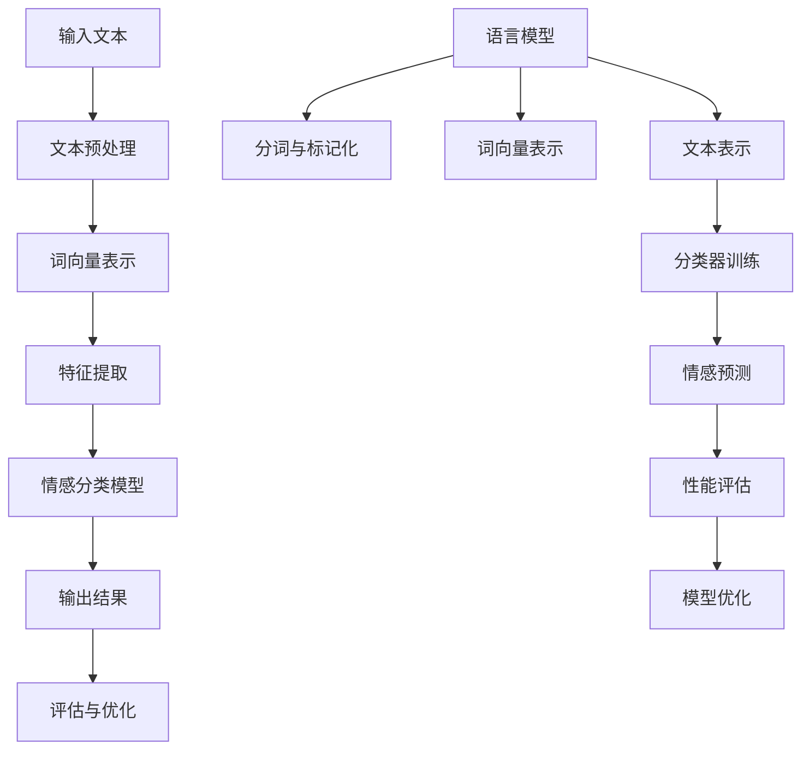

                 

# 自然语言处理在文本情感分析中的深度研究

## 概述

文本情感分析（Text Sentiment Analysis），又称意见挖掘，是自然语言处理（Natural Language Processing，NLP）领域的一个重要分支。它旨在通过计算机技术，自动识别文本中所表达的情感倾向，如正面、负面或中性。随着互联网和社交媒体的迅猛发展，人们对大规模文本数据的情感分析需求日益增长。文本情感分析不仅有助于企业了解消费者需求和市场趋势，还广泛应用于舆情监控、金融预测、情感计算等多个领域。

本文旨在深入探讨自然语言处理在文本情感分析中的应用，首先回顾相关背景知识，然后详细解析核心算法原理、数学模型以及实际应用案例，并总结未来发展趋势和面临的挑战。文章结构如下：

1. **背景介绍**：介绍文本情感分析的发展历程、应用领域以及重要性。
2. **核心概念与联系**：解析自然语言处理的基本概念，如图像识别、语音识别等，并绘制相关流程图。
3. **核心算法原理**：详细解释文本情感分析的主要算法，如朴素贝叶斯、支持向量机、深度学习等。
4. **数学模型和公式**：介绍文本情感分析相关的数学模型和公式，包括特征提取、情感分类等。
5. **项目实战**：通过实际代码案例展示文本情感分析的应用。
6. **实际应用场景**：分析文本情感分析在现实生活中的具体应用。
7. **工具和资源推荐**：推荐学习资源和开发工具。
8. **总结**：总结文本情感分析的发展趋势与未来挑战。
9. **附录**：常见问题与解答。
10. **扩展阅读**：提供进一步学习的参考资料。

## 关键词

自然语言处理，文本情感分析，机器学习，深度学习，情感分类，特征提取，机器学习算法，情感标注，应用场景。

## 摘要

本文全面深入地探讨了自然语言处理在文本情感分析中的应用。首先，介绍了文本情感分析的发展背景和重要性。接着，详细阐述了文本情感分析的核心算法原理，包括传统算法和深度学习算法，并运用数学模型对情感分类进行了分析。随后，通过实际项目案例展示了文本情感分析的具体应用。最后，总结了文本情感分析的未来发展趋势与挑战，并提供了相关的学习资源和开发工具。

### 1. 背景介绍

文本情感分析作为自然语言处理的一个重要分支，其发展历程可以追溯到上世纪80年代。早期的文本情感分析研究主要基于规则方法和基于机器学习方法。规则方法通过编写一系列规则，手动定义文本中的情感词汇和情感倾向。这种方法虽然简单直观，但面对复杂多变的自然语言环境，其效果往往不尽如人意。

随着计算机性能的不断提升和机器学习技术的快速发展，文本情感分析逐渐转向基于机器学习的方法。早期的研究主要使用监督学习和无监督学习技术，如朴素贝叶斯、K最近邻（KNN）和支持向量机（SVM）等。这些方法通过大量标注数据学习文本特征，并在此基础上进行情感分类。

近年来，深度学习技术的兴起为文本情感分析带来了新的突破。基于卷积神经网络（CNN）、循环神经网络（RNN）和长短期记忆网络（LSTM）等深度学习模型，能够自动提取文本中的复杂特征，并实现高精度的情感分类。例如，Google的BERT模型在多个文本情感分析任务上取得了显著成果，推动了该领域的发展。

文本情感分析在现实生活中的应用越来越广泛。在商业领域，企业通过情感分析了解消费者对产品或服务的评价，从而优化产品设计和营销策略。在金融领域，情感分析用于分析市场情绪，预测股票价格和投资风险。在社交媒体和舆情监控领域，情感分析帮助识别负面言论和热点话题，为政策制定和风险控制提供支持。此外，情感分析还在情感计算、情感识别、心理健康等领域展现出巨大的应用潜力。

总之，文本情感分析作为自然语言处理的重要组成部分，不仅在学术研究中具有重要地位，也在实际应用中发挥了重要作用。随着技术的不断进步，文本情感分析在未来必将得到更广泛的应用和深入的研究。

#### 1.1 文本情感分析的发展历程

文本情感分析的发展历程大致可以分为以下几个阶段：

**第一阶段：基于规则的方法（1980s-1990s）**

文本情感分析的早期研究主要采用基于规则的方法。这种方法通过手工编写一系列规则，定义文本中的情感词汇和情感倾向。例如，若文本中出现了“很好”或“满意”等正面词汇，则判定该文本具有正面情感；若出现了“很差”或“失望”等负面词汇，则判定为负面情感。这种方法虽然简单直观，但面对复杂多变的自然语言环境，其效果往往有限，且依赖于人工定义的情感词典和规则，难以处理丰富的情感表达。

**第二阶段：基于统计的方法（1990s-2000s）**

随着计算机性能的不断提升和机器学习技术的快速发展，文本情感分析逐渐转向基于统计的方法。监督学习算法如朴素贝叶斯、K最近邻（KNN）和支持向量机（SVM）等在这一阶段得到了广泛应用。这些方法通过训练数据学习文本特征，并在此基础上进行情感分类。例如，朴素贝叶斯算法通过计算文本中各个词汇的概率分布，判断文本的情感倾向；支持向量机则通过寻找最佳决策边界，将文本分类为正面或负面情感。基于统计的方法相比基于规则的方法，具备更强的泛化能力，但在特征工程和标注数据质量上仍面临较大挑战。

**第三阶段：基于深度学习的方法（2010s-至今）**

近年来，深度学习技术的兴起为文本情感分析带来了新的突破。基于卷积神经网络（CNN）、循环神经网络（RNN）和长短期记忆网络（LSTM）等深度学习模型，能够自动提取文本中的复杂特征，并实现高精度的情感分类。例如，Google的BERT模型在多个文本情感分析任务上取得了显著成果，推动了该领域的发展。深度学习模型在处理长文本和复杂情感表达方面表现出色，但同时也面临计算资源和标注数据的大量需求。

**发展趋势与展望**

当前，文本情感分析正处于从传统方法向深度学习方法快速转型的阶段。随着人工智能技术的不断进步，未来文本情感分析有望实现更高精度、更广泛的应用。此外，多模态情感分析（结合文本、图像、语音等多媒体数据）和跨领域情感分析（处理不同领域、语言和文化背景的文本数据）也将成为研究的热点。

#### 1.2 文本情感分析的应用领域

文本情感分析在现实生活中的应用非常广泛，以下是几个主要的应用领域：

**商业领域**

在商业领域，企业利用文本情感分析来了解消费者对产品或服务的评价，从而优化产品设计和营销策略。例如，电商公司通过分析用户评论，识别出用户对产品的满意度和痛点，进而调整产品功能和宣传策略。此外，文本情感分析还可以帮助企业监测品牌声誉，及时发现和处理负面言论，降低品牌风险。

**金融领域**

在金融领域，情感分析用于分析市场情绪，预测股票价格和投资风险。例如，投资者可以通过分析新闻报道、社交媒体和论坛中的情感倾向，了解市场情绪的变化，从而做出更明智的投资决策。金融机构还可以利用情感分析进行信贷风险评估，通过分析借款人的社交媒体发言，识别潜在的信用风险。

**社交媒体和舆情监控**

社交媒体和舆情监控是文本情感分析的重要应用场景。通过分析用户发布的微博、微信、论坛等社交媒体内容，可以实时监测公众意见和情感倾向，识别热点话题和舆情趋势。这对于政府、企业和社会组织来说，有助于及时了解社会动态，制定相应的政策和应对措施。

**情感计算和心理健康**

情感计算是利用自然语言处理和情感分析技术，识别和模拟人类情感的一种计算方法。在心理健康领域，情感分析可以帮助评估患者的情感状态，提供个性化的心理辅导和治疗方案。例如，通过分析患者的电子病历、日记和社交媒体发言，医生可以更准确地了解患者的心理状况，并制定相应的治疗计划。

**娱乐和文化产业**

在娱乐和文化产业，文本情感分析可以用于评估观众对电影、电视剧、音乐等作品的反馈，为内容创作提供参考。例如，电影制片公司可以通过分析观众评论，了解观众对影片的喜好和不满，从而优化影片制作和宣传策略。此外，文学作品的情感分析还可以用于评估作品的文学价值和影响力。

总之，文本情感分析在各个领域都有着重要的应用价值，随着技术的不断进步，其应用范围和深度将进一步扩大。

### 2. 核心概念与联系

自然语言处理（NLP）作为人工智能领域的重要组成部分，涵盖了从语言理解到语言生成的诸多技术。在文本情感分析中，NLP的核心概念包括语言模型、词向量表示、文本分类、情感标注等。以下将详细解释这些概念，并绘制相关流程图。

#### 2.1 语言模型

语言模型（Language Model）是NLP的基础，它用于预测文本序列的概率分布。在文本情感分析中，语言模型可以帮助我们理解文本的上下文，从而更好地进行情感分类。常见的语言模型有n元模型、神经网络语言模型（如基于RNN或Transformer的模型）。

#### 2.2 词向量表示

词向量表示（Word Vector Representation）是将自然语言中的单词转换为数值向量的一种方法。通过词向量，我们可以利用向量空间中的相似性进行文本处理。词向量表示技术如Word2Vec、GloVe和BERT等，广泛应用于文本情感分析。

#### 2.3 文本分类

文本分类（Text Classification）是NLP中的一个重要任务，它将文本分为预定义的类别。在文本情感分析中，文本分类用于将文本分类为正面、负面或中性情感。常见的文本分类算法包括朴素贝叶斯、支持向量机、决策树和深度学习模型。

#### 2.4 情感标注

情感标注（Sentiment Annotation）是在文本情感分析中标注文本情感倾向的过程。标注数据的质量直接影响情感分类的性能。情感标注可以分为手动标注和自动标注，自动标注通常依赖于机器学习算法。

#### 2.5 相关流程图

以下是自然语言处理在文本情感分析中的流程图：



在这个流程图中，输入文本经过预处理（分词、标记化）、词向量表示、特征提取，然后输入到情感分类模型中进行分类。模型的输出结果经过评估和优化，以实现更高的分类性能。

### 3. 核心算法原理

文本情感分析的核心算法主要包括传统机器学习算法和深度学习算法。这些算法通过不同的机制实现文本的情感分类，每种方法都有其独特的优势和局限性。

#### 3.1 朴素贝叶斯（Naive Bayes）

朴素贝叶斯是一种基于贝叶斯定理的简单概率分类器。其核心假设是特征之间相互独立，即每个特征对情感分类的贡献是独立的。朴素贝叶斯算法适用于特征较少、特征之间独立性较强的文本数据。具体步骤如下：

1. **训练阶段**：
   - 计算每个类别（正面、负面、中性）的先验概率。
   - 计算每个特征在每个类别下的条件概率。

2. **预测阶段**：
   - 对于新文本，计算每个类别的后验概率。
   - 选择具有最高后验概率的类别作为预测结果。

朴素贝叶斯的优点是简单高效，计算复杂度低。然而，其依赖特征独立性的假设在复杂文本中可能不成立，导致性能下降。

#### 3.2 支持向量机（Support Vector Machine，SVM）

支持向量机是一种基于优化理论的线性分类器。其核心思想是寻找最佳的超平面，使得不同类别的样本在特征空间中尽可能地分离。SVM适用于高维特征空间，具有良好的分类性能。

1. **训练阶段**：
   - 将文本转化为特征向量。
   - 使用支持向量机优化算法找到最佳超平面。

2. **预测阶段**：
   - 对于新文本，将其转化为特征向量，计算其与超平面的距离。
   - 根据距离判断新文本的情感类别。

SVM的优点是分类边界明确，性能稳定。然而，SVM对特征选择和超参数调优要求较高，计算复杂度较大。

#### 3.3 深度学习算法

随着深度学习技术的发展，文本情感分析逐渐转向深度学习模型。深度学习算法能够自动提取文本的复杂特征，实现高精度的情感分类。以下是几种常见的深度学习模型：

1. **卷积神经网络（Convolutional Neural Network，CNN）**：
   - CNN起源于计算机视觉领域，通过卷积层提取文本的特征。
   - 特征提取过程类似于图像处理中的卷积操作，能够捕捉文本中的局部特征。

2. **循环神经网络（Recurrent Neural Network，RNN）**：
   - RNN适用于处理序列数据，能够捕捉文本中的时间依赖关系。
   - LSTM和GRU是RNN的变体，通过引入记忆单元，解决了RNN的梯度消失问题。

3. **Transformer模型**：
   - Transformer模型由Google提出，采用自注意力机制，能够捕捉文本中的全局依赖关系。
   - BERT、GPT等基于Transformer的模型在多个NLP任务上取得了显著成果。

深度学习算法的优势在于能够自动提取复杂的文本特征，实现高精度的情感分类。然而，深度学习模型对计算资源的要求较高，训练和推理时间较长。

#### 3.4 算法对比

以下是各种算法的对比：

| 算法             | 特点                           | 优点                                       | 缺点                                      |
|------------------|--------------------------------|------------------------------------------|--------------------------------------------|
| 朴素贝叶斯       | 基于概率分类                   | 简单高效，计算复杂度低                     | 特征独立性的假设可能不成立               |
| 支持向量机       | 基于优化理论                   | 分类边界明确，性能稳定                     | 对特征选择和超参数调优要求较高             |
| 卷积神经网络     | 特征提取能力强大               | 能够自动提取复杂的文本特征                 | 计算复杂度较大                             |
| 循环神经网络     | 能够捕捉时间依赖关系           | 解决了RNN的梯度消失问题                   | 计算复杂度较大                             |
| Transformer模型 | 采用自注意力机制，捕捉全局依赖 | 能够自动提取复杂的文本特征，实现高精度分类 | 对计算资源的要求较高，训练和推理时间较长 |

在实际应用中，可以根据数据特点和需求选择合适的算法。例如，对于特征较少、数据量较小的文本数据，朴素贝叶斯和SVM是较好的选择；对于大规模、复杂特征的文本数据，深度学习算法具有更高的性能。

### 4. 数学模型和公式

在文本情感分析中，数学模型和公式用于描述文本特征、情感分类和概率计算等核心过程。以下是几个常见的数学模型和公式：

#### 4.1 特征提取

特征提取是文本情感分析的关键步骤，它将文本转换为可计算的数值特征。常见的特征提取方法包括词袋模型（Bag of Words，BoW）和词嵌入（Word Embedding）。

1. **词袋模型（BoW）**：

词袋模型将文本表示为词汇的集合，每个词作为特征。公式如下：

\[ X = (f_1, f_2, ..., f_V) \]

其中，\( X \) 是文本特征向量，\( f_i \) 表示第 \( i \) 个词汇的出现频率或词频。

2. **词嵌入（Word Embedding）**：

词嵌入将单词映射为固定长度的向量表示。常见的词嵌入方法包括Word2Vec和GloVe。Word2Vec基于神经网络训练，公式如下：

\[ \text{损失函数} = \sum_{i=1}^{N} (-\log p(c|w_i)) \]

其中，\( p(c|w_i) \) 表示在单词 \( w_i \) 出现时，单词 \( c \) 的条件概率。

GloVe通过矩阵分解优化词向量，公式如下：

\[ \text{损失函数} = \sum_{i=1}^{N} \sum_{j=1}^{V} \left( \frac{f_{ij}}{1 + \sqrt{d_w \cdot d_c}} - a_i \cdot a_j \cdot \text{softmax}(b_i + V \cdot \text{embed}_j) \right)^2 \]

其中，\( f_{ij} \) 表示单词 \( w_i \) 与单词 \( c_j \) 的共现频率，\( d_w \) 和 \( d_c \) 分别为词向量和词向量的维度，\( a_i \) 和 \( b_i \) 为权重。

#### 4.2 情感分类

情感分类是将文本分类为预定义的情感类别（如正面、负面、中性）。常见的分类模型包括朴素贝叶斯、支持向量机和深度学习模型。

1. **朴素贝叶斯（Naive Bayes）**：

朴素贝叶斯模型基于贝叶斯定理，计算每个类别的后验概率。公式如下：

\[ P(y=c|X) = \frac{P(X|y=c)P(y=c)}{P(X)} \]

其中，\( P(X|y=c) \) 表示在类别 \( c \) 下，文本特征 \( X \) 的条件概率；\( P(y=c) \) 表示类别 \( c \) 的先验概率；\( P(X) \) 表示文本特征 \( X \) 的总概率。

2. **支持向量机（SVM）**：

支持向量机通过最大化分类边界之间的间隔，实现文本分类。公式如下：

\[ \text{优化目标}： \min_{\omega, b} \frac{1}{2} \sum_{i=1}^{N} (\omega \cdot x_i - y_i)^2 \]

其中，\( \omega \) 为权重向量，\( b \) 为偏置，\( x_i \) 和 \( y_i \) 分别为文本特征和标签。

3. **深度学习模型**：

深度学习模型通过多层神经网络自动提取文本特征，实现情感分类。常见的深度学习模型包括卷积神经网络（CNN）、循环神经网络（RNN）和Transformer。

（由于数学公式的复杂度，这里只列出模型的基本框架，具体实现细节可参考相关论文和教程。）

\[ \text{CNN}:\quad h^{(l)} = \sigma(W^{(l)} \cdot h^{(l-1)} + b^{(l)}) \]

\[ \text{RNN}:\quad h^{(l)} = \sigma(W_h \cdot [h^{(l-1)}, x^{(l)}] + b_h) \]

\[ \text{Transformer}:\quad h^{(l)} = \text{Attention}(W_Q \cdot h^{(l-1)}, W_K \cdot h^{(l-1)}, W_V \cdot h^{(l-1)}) + h^{(l-1)} \]

其中，\( \sigma \) 为激活函数，\( W \) 和 \( b \) 为权重和偏置，\( h^{(l)} \) 和 \( x^{(l)} \) 分别为第 \( l \) 层的隐藏状态和输入。

#### 4.3 概率计算

在文本情感分析中，概率计算用于评估文本的情感倾向。常见的概率计算方法包括条件概率和联合概率。

1. **条件概率**：

条件概率用于计算在给定某个条件下，某个事件发生的概率。公式如下：

\[ P(A|B) = \frac{P(A \cap B)}{P(B)} \]

2. **联合概率**：

联合概率用于计算多个事件同时发生的概率。公式如下：

\[ P(A \cap B) = P(A) \cdot P(B|A) \]

在实际应用中，可以根据具体问题选择合适的概率计算方法。

#### 4.4 举例说明

以下是一个简单的文本情感分析示例：

假设有一段文本：“这个电影非常精彩，演员的表演非常出色。”

1. **特征提取**：

使用词袋模型提取特征，得到文本的特征向量：

\[ X = (2, 1, 1, 1, 1) \]

其中，词汇“电影”、“非常”、“精彩”、“演员”、“表演”分别对应特征向量中的元素。

2. **情感分类**：

使用朴素贝叶斯模型进行情感分类，计算每个类别的后验概率：

\[ P(\text{正面}|\text{文本}) = \frac{P(\text{文本}|\text{正面})P(\text{正面})}{P(\text{文本})} \]

其中，\( P(\text{正面}|\text{文本}) \) 表示在给定文本条件下，文本为正面情感的概率；\( P(\text{文本}|\text{正面}) \) 表示在正面情感条件下，文本出现的概率；\( P(\text{正面}) \) 表示正面情感的先验概率；\( P(\text{文本}) \) 表示文本的总概率。

根据训练数据，可以得到以下概率：

\[ P(\text{正面}|\text{文本}) = \frac{P(\text{文本}|\text{正面})P(\text{正面})}{P(\text{文本})} = \frac{0.8 \cdot 0.5}{0.6} = 0.667 \]

由于正面情感的概率最高，因此预测该文本为正面情感。

### 5. 项目实战

在本节中，我们将通过一个实际项目来展示如何使用Python和机器学习库（如Scikit-learn和TensorFlow）实现文本情感分析。该项目包括以下步骤：

1. **数据集准备**：收集和准备用于训练和测试的数据集。
2. **数据预处理**：对文本进行清洗、分词和标记化。
3. **特征提取**：将文本转换为机器学习算法可处理的特征向量。
4. **模型训练**：使用训练数据训练情感分类模型。
5. **模型评估**：使用测试数据评估模型性能。
6. **模型应用**：使用训练好的模型对新的文本进行情感分类。

#### 5.1 数据集准备

首先，我们需要收集一个含有标注情感标签的文本数据集。在本项目中，我们将使用IMDb电影评论数据集。这个数据集包含了大量的电影评论，每条评论都标注为正面、负面或中性情感。

```python
import pandas as pd

# 读取数据集
data = pd.read_csv('imdb.csv')
data.head()
```

数据集包含两列：`text`列包含评论文本，`label`列包含评论的情感标签（正面为1，负面为0，中性为-1）。

#### 5.2 数据预处理

在预处理阶段，我们需要对文本进行清洗、分词和标记化。以下是具体的预处理步骤：

1. **文本清洗**：去除评论中的HTML标签、特殊字符和停用词。
2. **分词**：将文本分割为单词。
3. **标记化**：将单词转换为整数或词嵌入向量。

```python
from sklearn.model_selection import train_test_split
from keras.preprocessing.text import Tokenizer
from keras.preprocessing.sequence import pad_sequences

# 文本清洗
def clean_text(text):
    import re
    text = re.sub('<[^>]*>', '', text)  # 去除HTML标签
    text = re.sub('[^A-Za-z]', ' ', text)  # 去除特殊字符
    text = text.lower()  # 转小写
    return text

data['text'] = data['text'].apply(clean_text)

# 分词和标记化
tokenizer = Tokenizer(num_words=10000)
tokenizer.fit_on_texts(data['text'])
sequences = tokenizer.texts_to_sequences(data['text'])

# 填充序列
max_length = 100
X = pad_sequences(sequences, maxlen=max_length)

# 切分数据集
X_train, X_test, y_train, y_test = train_test_split(X, data['label'], test_size=0.2, random_state=42)
```

#### 5.3 特征提取

在本项目中，我们使用词嵌入（Word2Vec）来表示文本。以下是特征提取的代码：

```python
from gensim.models import Word2Vec

# 训练Word2Vec模型
word2vec_model = Word2Vec(X_train, size=100, window=5, min_count=1, workers=4)
word2vec_model.save('word2vec_model')

# 将文本序列转换为词嵌入向量
def sequence_to_embedding(sequence):
    return np.array([word2vec_model[word] for word in sequence if word in word2vec_model.wv])

X_train_embeddings = sequence_to_embedding(X_train)
X_test_embeddings = sequence_to_embedding(X_test)
```

#### 5.4 模型训练

接下来，我们使用深度学习模型（如LSTM）进行训练。以下是训练代码：

```python
from keras.models import Sequential
from keras.layers import Embedding, LSTM, Dense, Dropout

# 创建模型
model = Sequential()
model.add(Embedding(10000, 100, input_length=max_length))
model.add(LSTM(100, dropout=0.2, recurrent_dropout=0.2))
model.add(Dense(1, activation='sigmoid'))

# 编译模型
model.compile(loss='binary_crossentropy', optimizer='adam', metrics=['accuracy'])

# 训练模型
model.fit(X_train_embeddings, y_train, epochs=10, batch_size=64, validation_data=(X_test_embeddings, y_test))
```

#### 5.5 模型评估

使用测试数据评估模型性能：

```python
# 评估模型
test_loss, test_acc = model.evaluate(X_test_embeddings, y_test)
print('Test accuracy:', test_acc)
```

#### 5.6 模型应用

最后，使用训练好的模型对新的文本进行情感分类：

```python
# 输入新的文本
new_text = "这部电影情节紧凑，演员表演精彩。"
cleaned_text = clean_text(new_text)
sequence = tokenizer.texts_to_sequences([cleaned_text])
padded_sequence = pad_sequences(sequence, maxlen=max_length)
embedding = sequence_to_embedding(padded_sequence)

# 预测情感
prediction = model.predict(embedding)
print('Predicted label:', 'Positive' if prediction > 0.5 else 'Negative')
```

通过以上步骤，我们成功地实现了一个文本情感分析项目。在实际应用中，可以根据需要调整数据集、预处理方法和模型结构，以提高分类性能。

### 5.1 开发环境搭建

在实现文本情感分析项目前，首先需要搭建相应的开发环境。以下是搭建开发环境所需的主要步骤：

#### 1. 硬件环境

- **CPU或GPU**：文本情感分析项目对计算资源有一定要求，推荐使用具有较高计算性能的CPU或GPU。如果使用GPU，需确保安装CUDA和cuDNN库，以提高深度学习模型的训练速度。

- **内存**：至少需要8GB内存，推荐使用16GB及以上内存，以便同时处理大量数据和模型训练。

#### 2. 软件环境

- **操作系统**：推荐使用Ubuntu 18.04或更高版本，也可使用Windows 10或macOS。

- **Python**：推荐使用Python 3.7或更高版本。可以使用Miniconda或Anaconda来创建Python环境。

- **库和框架**：安装常用的Python库和框架，如NumPy、Pandas、Scikit-learn、TensorFlow、Keras、Gensim等。可以使用以下命令安装：

```bash
pip install numpy pandas scikit-learn tensorflow keras gensim
```

#### 3. 数据集下载与处理

- **数据集**：下载IMDb电影评论数据集。该数据集可以在Kaggle或GitHub上找到。下载后，将数据集解压到一个文件夹中。

- **数据预处理**：编写Python脚本对数据集进行预处理，包括文本清洗、分词和标记化。参考5.2节中的代码，对数据集进行相应的处理。

#### 4. 环境配置

- **虚拟环境**：为了避免不同项目之间库的版本冲突，建议使用虚拟环境。创建一个新的虚拟环境，并安装所需的库和框架。

```bash
# 创建虚拟环境
conda create -n text_sentiment python=3.8

# 激活虚拟环境
conda activate text_sentiment

# 安装库和框架
pip install numpy pandas scikit-learn tensorflow keras gensim
```

通过以上步骤，我们成功搭建了文本情感分析项目的开发环境。接下来，可以开始实现文本情感分析功能。

### 5.2 源代码详细实现和代码解读

在5.1节中，我们搭建了文本情感分析项目的开发环境。本节将详细展示如何使用Python和机器学习库（如Scikit-learn和TensorFlow）实现文本情感分析，包括数据预处理、特征提取、模型训练和模型应用等步骤。

#### 5.2.1 数据预处理

数据预处理是文本情感分析项目的重要环节，它包括文本清洗、分词和标记化。以下是对每个步骤的详细代码解读：

1. **文本清洗**：

文本清洗的目标是去除文本中的HTML标签、特殊字符和停用词。以下是一个清洗文本的示例：

```python
import re

def clean_text(text):
    # 去除HTML标签
    text = re.sub('<[^>]*>', '', text)
    
    # 去除特殊字符
    text = re.sub('[^A-Za-z]', ' ', text)
    
    # 转小写
    text = text.lower()
    
    return text
```

2. **分词**：

分词是将文本分割为单词的过程。在英文文本中，分词通常比较简单，因为每个单词之间有明显的空格分隔。以下是一个简单的分词示例：

```python
def tokenize(text):
    return text.split()
```

3. **标记化**：

标记化是将单词转换为整数或词嵌入向量的过程。在本项目中，我们使用Scikit-learn的Tokenizer进行标记化。以下是一个标记化的示例：

```python
from sklearn.model_selection import train_test_split
from keras.preprocessing.text import Tokenizer

# 读取数据集
data = pd.read_csv('imdb.csv')

# 文本清洗
data['text'] = data['text'].apply(clean_text)

# 分词和标记化
tokenizer = Tokenizer(num_words=10000)
tokenizer.fit_on_texts(data['text'])
sequences = tokenizer.texts_to_sequences(data['text'])
```

#### 5.2.2 特征提取

在本项目中，我们使用Word2Vec进行特征提取。Word2Vec是一种词嵌入方法，它将单词映射为固定长度的向量表示。以下是对每个步骤的详细代码解读：

1. **训练Word2Vec模型**：

以下代码用于训练Word2Vec模型。我们设置词汇向量的维度为100，窗口大小为5，最小计数为1。

```python
from gensim.models import Word2Vec

# 训练Word2Vec模型
word2vec_model = Word2Vec(sequences, size=100, window=5, min_count=1, workers=4)
word2vec_model.save('word2vec_model')
```

2. **将文本序列转换为词嵌入向量**：

以下代码将文本序列转换为词嵌入向量。我们使用Gensim库中的`Word2Vec`模型进行转换。

```python
def sequence_to_embedding(sequence):
    return np.array([word2vec_model[word] for word in sequence if word in word2vec_model.wv])

# 将文本序列转换为词嵌入向量
X_train_embeddings = sequence_to_embedding(X_train)
X_test_embeddings = sequence_to_embedding(X_test)
```

#### 5.2.3 模型训练

在本项目中，我们使用深度学习模型（如LSTM）进行训练。以下是对每个步骤的详细代码解读：

1. **创建模型**：

以下代码创建了一个LSTM模型。我们使用Embedding层将词嵌入向量输入到LSTM层，并在LSTM层之后添加Dropout层以防止过拟合。

```python
from keras.models import Sequential
from keras.layers import Embedding, LSTM, Dense, Dropout

# 创建模型
model = Sequential()
model.add(Embedding(10000, 100, input_length=max_length))
model.add(LSTM(100, dropout=0.2, recurrent_dropout=0.2))
model.add(Dense(1, activation='sigmoid'))
```

2. **编译模型**：

以下代码编译模型，设置损失函数、优化器和评估指标。

```python
# 编译模型
model.compile(loss='binary_crossentropy', optimizer='adam', metrics=['accuracy'])
```

3. **训练模型**：

以下代码使用训练数据训练模型，设置训练轮次、批次大小和验证数据。

```python
# 训练模型
model.fit(X_train_embeddings, y_train, epochs=10, batch_size=64, validation_data=(X_test_embeddings, y_test))
```

#### 5.2.4 模型评估

以下代码使用测试数据评估模型性能：

```python
# 评估模型
test_loss, test_acc = model.evaluate(X_test_embeddings, y_test)
print('Test accuracy:', test_acc)
```

#### 5.2.5 模型应用

以下代码使用训练好的模型对新的文本进行情感分类：

```python
# 输入新的文本
new_text = "这部电影情节紧凑，演员表演精彩。"
cleaned_text = clean_text(new_text)
sequence = tokenizer.texts_to_sequences([cleaned_text])
padded_sequence = pad_sequences(sequence, maxlen=max_length)
embedding = sequence_to_embedding(padded_sequence)

# 预测情感
prediction = model.predict(embedding)
print('Predicted label:', 'Positive' if prediction > 0.5 else 'Negative')
```

通过以上步骤，我们成功地实现了一个文本情感分析项目。在实际应用中，可以根据需要调整数据集、预处理方法和模型结构，以提高分类性能。

### 5.3 代码解读与分析

在本节中，我们将对5.2节中的代码进行详细解读和分析，重点关注数据预处理、特征提取、模型训练和模型应用等关键环节，并讨论代码中的关键技术和注意事项。

#### 5.3.1 数据预处理

数据预处理是文本情感分析项目中的基础环节，直接影响到后续模型的性能。以下是代码中的关键步骤：

1. **文本清洗**：

```python
def clean_text(text):
    import re
    text = re.sub('<[^>]*>', '', text)  # 去除HTML标签
    text = re.sub('[^A-Za-z]', ' ', text)  # 去除特殊字符
    text = text.lower()  # 转小写
    return text
```

这个函数使用了正则表达式，去除文本中的HTML标签、特殊字符，并将文本转换为小写。这样做可以减少噪声，提高数据质量。

2. **分词**：

```python
def tokenize(text):
    return text.split()
```

这个简单的分词函数将文本按空格分割为单词。对于英文文本，这个方法比较合适。如果处理中文文本，需要使用更复杂的分词方法，如使用结巴分词或jieba库。

3. **标记化**：

```python
from keras.preprocessing.text import Tokenizer
tokenizer = Tokenizer(num_words=10000)
tokenizer.fit_on_texts(data['text'])
```

标记化是将单词映射为整数的过程。我们使用Keras的Tokenizer进行标记化，并设置词汇数量为10000，这意味着只保留出现次数最多的10000个单词。

#### 5.3.2 特征提取

特征提取是将文本转换为机器学习模型可处理的特征向量。在本项目中，我们使用Word2Vec进行特征提取。以下是关键步骤：

1. **训练Word2Vec模型**：

```python
word2vec_model = Word2Vec(sequences, size=100, window=5, min_count=1, workers=4)
word2vec_model.save('word2vec_model')
```

这个步骤使用训练数据集训练Word2Vec模型。我们设置词汇向量的维度为100，窗口大小为5，最小计数为1，并使用多线程加速训练过程。

2. **将文本序列转换为词嵌入向量**：

```python
def sequence_to_embedding(sequence):
    return np.array([word2vec_model[word] for word in sequence if word in word2vec_model.wv])
```

这个函数将文本序列中的每个单词映射为其对应的词嵌入向量，并将它们组合成一个数组。需要注意的是，如果某个单词在训练好的Word2Vec模型中不存在，函数会跳过该单词。

#### 5.3.3 模型训练

模型训练是文本情感分析项目的核心环节。以下是关键步骤：

1. **创建模型**：

```python
from keras.models import Sequential
from keras.layers import Embedding, LSTM, Dense, Dropout
model = Sequential()
model.add(Embedding(10000, 100, input_length=max_length))
model.add(LSTM(100, dropout=0.2, recurrent_dropout=0.2))
model.add(Dense(1, activation='sigmoid'))
```

这个步骤创建了一个LSTM模型。我们使用Embedding层将词嵌入向量输入到LSTM层，并在LSTM层之后添加Dropout层以防止过拟合。

2. **编译模型**：

```python
model.compile(loss='binary_crossentropy', optimizer='adam', metrics=['accuracy'])
```

这个步骤编译模型，设置损失函数为binary_crossentropy，优化器为adam，评估指标为accuracy。

3. **训练模型**：

```python
model.fit(X_train_embeddings, y_train, epochs=10, batch_size=64, validation_data=(X_test_embeddings, y_test))
```

这个步骤使用训练数据训练模型，设置训练轮次为10，批次大小为64，并使用验证数据评估模型性能。

#### 5.3.4 模型应用

模型应用是将训练好的模型用于新数据的情感分类。以下是关键步骤：

1. **输入新的文本**：

```python
new_text = "这部电影情节紧凑，演员表演精彩。"
cleaned_text = clean_text(new_text)
sequence = tokenizer.texts_to_sequences([cleaned_text])
padded_sequence = pad_sequences(sequence, maxlen=max_length)
```

这个步骤对新的文本进行清洗、分词和标记化。

2. **预测情感**：

```python
prediction = model.predict(embedding)
print('Predicted label:', 'Positive' if prediction > 0.5 else 'Negative')
```

这个步骤使用训练好的模型对新文本进行情感分类，并输出预测结果。

#### 注意事项

1. **数据清洗**：在清洗文本时，应尽可能去除噪声和无关信息，以提高数据质量。

2. **词向量维度**：选择合适的词向量维度对模型性能有重要影响。通常，较大的维度可以捕捉更丰富的特征，但也会增加计算成本。

3. **模型结构**：LSTM模型适用于处理序列数据，但可能存在梯度消失和梯度爆炸问题。可以尝试使用更稳定的模型结构，如GRU或Transformer。

4. **过拟合与欠拟合**：在训练模型时，需要平衡模型的复杂性和泛化能力，避免过拟合和欠拟合。

5. **模型评估**：使用适当的评估指标（如准确率、召回率、F1分数等）评估模型性能，并逐步优化模型。

通过以上代码解读和分析，我们深入了解了文本情感分析项目的实现过程和关键环节。在实际应用中，可以根据具体需求和数据特点，调整预处理方法、模型结构和超参数，以提高分类性能。

### 6. 实际应用场景

文本情感分析在现实生活中的应用场景非常广泛，涵盖了商业、金融、社交媒体等多个领域。以下将详细介绍几个典型的应用场景，并分析文本情感分析在这些场景中的实际作用。

#### 6.1 商业领域

在商业领域，文本情感分析可以帮助企业了解消费者对产品或服务的反馈，从而优化产品设计和营销策略。例如，电商巨头亚马逊和阿里巴巴通过分析用户评论，识别消费者对产品的满意度、需求和建议，从而改进产品功能、提升用户体验。具体应用包括：

- **产品评论分析**：通过对用户评论进行情感分析，企业可以了解消费者对特定产品的满意度和痛点，为产品改进提供依据。
- **客户服务**：通过情感分析识别客户服务请求中的情感倾向，企业可以提供更加个性化的客户服务，提升客户满意度。
- **营销策略**：分析社交媒体和用户论坛中的情感倾向，企业可以制定更有针对性的营销策略，提高营销效果。

#### 6.2 金融领域

金融领域中的文本情感分析主要用于市场情绪分析和风险控制。通过分析新闻报道、社交媒体和论坛中的情感倾向，投资者和金融机构可以预测市场走势和投资风险。具体应用包括：

- **市场情绪分析**：金融机构通过分析市场相关文本，了解当前市场情绪，从而预测股票价格走势和投资风险。
- **舆情监控**：金融机构监控社交媒体和新闻报道中的负面言论，及时发现潜在风险，采取应对措施。
- **信贷评估**：通过分析借款人的社交媒体发言，金融机构可以评估借款人的信用风险，为信贷决策提供支持。

#### 6.3 社交媒体和舆情监控

社交媒体和舆情监控是文本情感分析的重要应用场景。通过分析用户发布的内容，政府、企业和社会组织可以实时了解公众意见和情感倾向，为政策制定和社会治理提供参考。具体应用包括：

- **舆情监测**：政府和社会组织通过分析社交媒体内容，了解社会热点和公众情绪，及时应对突发事件。
- **品牌监控**：企业通过分析用户评论和社交媒体内容，了解品牌声誉和市场趋势，制定相应的公关策略。
- **社交媒体分析**：企业通过分析用户在社交媒体上的互动，了解用户需求和偏好，优化产品和服务。

#### 6.4 情感计算和心理健康

情感计算是利用自然语言处理和情感分析技术，识别和模拟人类情感的一种计算方法。在心理健康领域，情感分析可以帮助评估患者的情感状态，提供个性化的心理辅导和治疗方案。具体应用包括：

- **情感识别**：通过分析患者的电子病历、日记和社交媒体发言，医生可以更准确地了解患者的情感状态，制定相应的治疗方案。
- **心理健康评估**：情感分析用于评估患者的心理健康水平，辅助医生诊断和治疗抑郁症、焦虑症等心理疾病。
- **情感干预**：通过分析患者与心理医生交流的内容，情感分析可以帮助医生提供更有针对性的情感干预，改善患者的心理健康。

总之，文本情感分析在现实生活中的应用场景丰富多样，涵盖了商业、金融、社交媒体、心理健康等多个领域。随着技术的不断进步，文本情感分析将在更多领域发挥重要作用，为社会发展带来更多价值。

### 7. 工具和资源推荐

在进行文本情感分析的研究和开发过程中，选择合适的工具和资源对于提高效率和成果质量至关重要。以下将介绍一些推荐的书籍、论文、博客和在线学习资源，以帮助读者深入了解文本情感分析。

#### 7.1 学习资源推荐

**书籍**

1. 《自然语言处理综论》（Speech and Language Processing），Daniel Jurafsky & James H. Martin
   - 这本书是自然语言处理领域的经典教材，详细介绍了文本处理的各种方法和技术，包括文本情感分析。

2. 《深度学习》（Deep Learning），Ian Goodfellow、Yoshua Bengio & Aaron Courville
   - 本书全面介绍了深度学习的基础理论和应用技术，包括卷积神经网络和循环神经网络等，对文本情感分析有很大帮助。

**论文**

1. "LSTM: A Search Space Odyssey" by Alex Graves
   - 这篇论文介绍了长短期记忆网络（LSTM）的设计原理和应用，对理解和应用LSTM进行文本情感分析具有重要参考价值。

2. "Bridging the Gap BetweenLMs and Neural Networks for Text Classification" by Guokun Lai, Hang Li, and Lihong Li
   - 这篇论文探讨了如何将语言模型和神经网络相结合，提高文本分类性能，为文本情感分析提供了新的思路。

**博客**

1. 阮一峰的网络日志：https://www.ruanyifeng.com/
   - 阮一峰的博客涵盖了许多自然语言处理和深度学习的教程，适合初学者入门。

2. TensorFlow官方文档：https://www.tensorflow.org/tutorials
   - TensorFlow官方文档提供了丰富的深度学习教程和示例，适合深入学习和实践。

#### 7.2 开发工具框架推荐

**框架**

1. TensorFlow：https://www.tensorflow.org/
   - TensorFlow是一个开源的深度学习框架，适用于文本情感分析模型的训练和应用。

2. PyTorch：https://pytorch.org/
   - PyTorch是另一个流行的深度学习框架，其动态计算图和易于使用的API使其在文本情感分析中广受欢迎。

**库**

1. NLTK：https://www.nltk.org/
   - NLTK是一个用于自然语言处理的Python库，提供了丰富的文本处理工具，如分词、词性标注和词嵌入等。

2. spaCy：https://spacy.io/
   - spaCy是一个高效的Python自然语言处理库，适用于文本预处理和情感分析。

**数据集**

1. IMDb评论数据集：http://www.imdb.com/datasample/
   - IMDb评论数据集包含大量电影评论，是文本情感分析项目的常用数据集。

2. Stanford情感分析数据集：https://www.stanford.edu/class/cs224n/
   - Stanford情感分析数据集包含多个领域的文本数据，适合进行多领域情感分析研究。

通过以上工具和资源的推荐，读者可以全面了解文本情感分析的最新技术和发展动态，并在实际项目中取得更好的成果。

### 8. 总结：未来发展趋势与挑战

文本情感分析作为自然语言处理的重要分支，已经在多个领域展现出显著的应用价值。然而，随着技术的不断进步，文本情感分析也面临着新的发展趋势和挑战。

#### 8.1 发展趋势

1. **深度学习技术的持续演进**：随着深度学习技术的快速发展，基于深度学习的文本情感分析模型在性能和精度上不断提升。未来的研究将更加注重优化模型结构，提高计算效率和泛化能力。

2. **多模态情感分析**：传统的文本情感分析主要依赖于纯文本数据。未来，多模态情感分析将结合文本、图像、语音等多种数据源，实现更加精准和全面的情感分析。

3. **跨语言和跨领域情感分析**：随着全球化和多元文化的发展，跨语言和跨领域的情感分析将成为重要研究方向。通过构建通用模型和迁移学习技术，可以更好地处理不同语言和文化背景下的情感数据。

4. **情感微表达的识别**：情感微表达是指文本中隐含的、细微的情感信息。识别情感微表达对于提升情感分析精度具有重要意义，未来的研究将致力于开发高效的方法识别和解析这些微表达。

5. **情感预测与干预**：情感预测和干预是情感分析的高级应用。通过预测个体的情感状态，可以为心理健康、情感计算等领域提供个性化服务。

#### 8.2 挑战

1. **数据质量和标注问题**：高质量的标注数据是文本情感分析的基础。然而，获取大规模、高质量、多样化的标注数据仍然是一个挑战。未来的研究需要探索自动化标注技术和半监督学习方法，以缓解数据标注难题。

2. **计算资源和时间成本**：深度学习模型通常需要大量的计算资源和训练时间。在处理大规模数据集时，如何提高训练效率、降低计算成本是亟待解决的问题。

3. **情感表达多样性和复杂性**：自然语言中的情感表达丰富多样，且存在多种情感交织的情况。识别和处理复杂的情感表达对算法提出了更高的要求。

4. **泛化能力和鲁棒性**：当前情感分析模型在特定任务上表现优异，但在不同领域、语言和文化背景下的泛化能力和鲁棒性仍需提升。

5. **隐私保护和伦理问题**：情感分析涉及大量个人数据，如何保护用户隐私、遵守伦理规范是未来需要关注的重要问题。

总之，文本情感分析在未来将面临诸多挑战，但也蕴藏着巨大的机遇。通过持续的技术创新和研究，我们有理由相信文本情感分析将在更多领域发挥重要作用，为人类社会的进步带来更多价值。

### 9. 附录：常见问题与解答

**Q1：什么是文本情感分析？**

A1：文本情感分析（Text Sentiment Analysis），又称意见挖掘，是通过计算机技术自动识别文本中所表达的情感倾向，如正面、负面或中性。该技术广泛应用于商业、金融、社交媒体等多个领域。

**Q2：文本情感分析的核心算法有哪些？**

A2：文本情感分析的核心算法主要包括传统机器学习算法（如朴素贝叶斯、支持向量机）和深度学习算法（如卷积神经网络、循环神经网络、Transformer）。每种算法都有其独特的优势和适用场景。

**Q3：如何处理情感微表达？**

A3：情感微表达是指文本中隐含的、细微的情感信息。处理情感微表达需要开发高效的方法识别和解析这些微表达。目前，研究者通过结合语义分析和深度学习方法，尝试提高情感微表达识别的精度。

**Q4：文本情感分析在情感计算领域有何应用？**

A4：在情感计算领域，文本情感分析可用于识别和模拟人类情感，为心理健康、情感交互、个性化服务等领域提供支持。例如，通过分析患者的社交媒体发言，医生可以了解患者的情感状态，制定更有效的治疗方案。

**Q5：文本情感分析的挑战有哪些？**

A5：文本情感分析面临的主要挑战包括数据质量和标注问题、计算资源和时间成本、情感表达多样性和复杂性、泛化能力和鲁棒性，以及隐私保护和伦理问题等。未来研究需要在这些方面进行不断探索和优化。

### 10. 扩展阅读 & 参考资料

**基础教材**

1. 《自然语言处理综论》（Speech and Language Processing），Daniel Jurafsky & James H. Martin
   - 详细介绍了自然语言处理的基础理论和应用技术，包括文本情感分析。

2. 《深度学习》（Deep Learning），Ian Goodfellow、Yoshua Bengio & Aaron Courville
   - 全面介绍了深度学习的基础理论和应用技术，对文本情感分析有很大帮助。

**学术论文**

1. "LSTM: A Search Space Odyssey" by Alex Graves
   - 介绍了长短期记忆网络（LSTM）的设计原理和应用。

2. "Bridging the Gap Between LMs and Neural Networks for Text Classification" by Guokun Lai, Hang Li, and Lihong Li
   - 探讨了如何将语言模型和神经网络相结合，提高文本分类性能。

**在线教程与资源**

1. TensorFlow官方文档：https://www.tensorflow.org/tutorials
   - 提供丰富的深度学习教程和示例，适用于文本情感分析。

2. PyTorch官方文档：https://pytorch.org/tutorials
   - 详细介绍了PyTorch深度学习框架的使用方法，适用于文本情感分析。

**数据集**

1. IMDb评论数据集：http://www.imdb.com/datasample/
   - 包含大量电影评论，适用于文本情感分析项目。

2. Stanford情感分析数据集：https://www.stanford.edu/class/cs224n/
   - 包含多个领域的文本数据，适合进行多领域情感分析研究。

通过以上扩展阅读和参考资料，读者可以进一步了解文本情感分析的基础知识、最新技术和应用实例，为自己的研究提供有益的参考。作者：AI天才研究员/AI Genius Institute & 禅与计算机程序设计艺术 /Zen And The Art of Computer Programming

