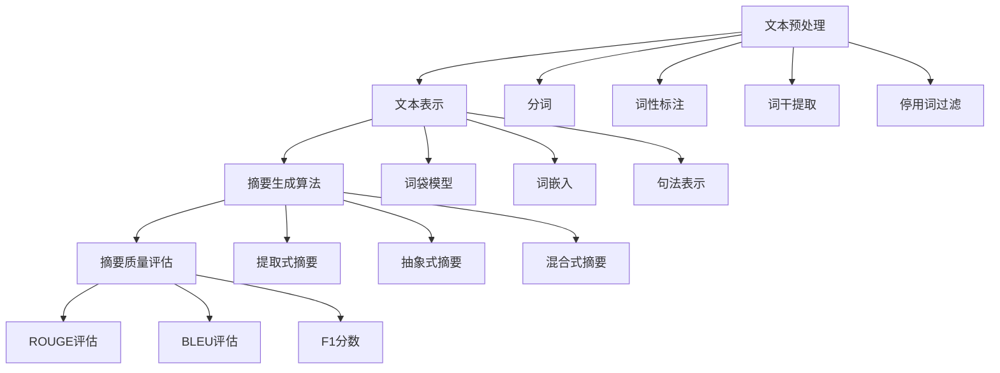

                 

### 1. 背景介绍

自然语言处理（Natural Language Processing, NLP）是人工智能（Artificial Intelligence, AI）领域的一个分支，旨在使计算机能够理解、生成和处理人类语言。近年来，随着深度学习技术的发展，NLP取得了显著的进展，并在诸多领域展现出强大的应用潜力，尤其是文本摘要技术。

文本摘要（Text Summarization）是从大量文本中提取出关键信息，并以简洁、连贯的形式呈现给用户的技术。文本摘要不仅能够帮助用户快速获取文本的核心内容，还可以提高信息检索的效率和准确性。在信息爆炸的时代，文本摘要技术具有重要的现实意义。

自然语言处理在文本摘要中的应用主要涉及以下几个方面：

1. **自动摘要**：利用机器学习算法和统计模型，从原始文本中自动提取摘要。
2. **提取式摘要**：基于文本的语义关系，提取关键句子或短语，形成摘要。
3. **抽象式摘要**：通过语义分析和语义转换，生成全新的摘要内容。
4. **评估与优化**：利用评价指标和反馈机制，对摘要质量进行评估和优化。

本文将深入探讨自然语言处理在文本摘要中的技术，包括核心概念、算法原理、数学模型、实际应用场景，以及未来发展趋势和挑战。通过逐步分析，希望能为读者提供全面而深入的理解。

### 2. 核心概念与联系

在深入探讨自然语言处理在文本摘要中的应用之前，我们首先需要了解一些核心概念，这些概念不仅构成了文本摘要的基础，而且在整个过程中相互联系，共同发挥作用。

#### 2.1  文本预处理

文本预处理是自然语言处理中的第一步，其目的是将原始的文本转换为适合模型处理的形式。文本预处理主要包括以下步骤：

- **分词（Tokenization）**：将文本分割成单词、短语或子句等基本元素。
- **词性标注（Part-of-Speech Tagging）**：为每个单词或短语标注其词性，如名词、动词、形容词等。
- **词干提取（Stemming）或词形还原（Lemmatization）**：将单词还原到其基本形式。
- **停用词过滤（Stopword Removal）**：去除常见的无意义词汇，如“的”、“了”、“在”等。

文本预处理的质量直接影响到后续自然语言处理任务的性能，因此，这一步骤至关重要。

#### 2.2  文本表示

文本表示是将原始的文本数据转换为机器可以理解的形式。常见的文本表示方法包括：

- **词袋模型（Bag of Words, BoW）**：将文本表示为一个词频向量。
- **词嵌入（Word Embeddings）**：通过神经网络将单词映射到高维向量空间，如Word2Vec、GloVe等。
- **句法表示（Syntactic Representations）**：利用句法分析技术，构建句子的语法树或依赖关系图。

文本表示的质量决定了模型对文本内容的理解和表达能力，因此在文本摘要中具有重要的地位。

#### 2.3  摘要生成算法

摘要生成算法是文本摘要技术的核心，根据处理方式和生成策略的不同，可以分为以下几类：

- **提取式摘要（Extractive Summarization）**：从原始文本中直接提取摘要，常见的算法包括TF-IDF、TextRank等。
- **抽象式摘要（Abstractive Summarization）**：通过重新组合文本中的内容，生成全新的摘要，常用的算法包括基于规则的生成和基于神经网络的生成。
- **混合式摘要（Hybrid Summarization）**：结合提取式和抽象式摘要的优点，进行摘要生成。

#### 2.4  摘要质量评估

摘要质量评估是衡量文本摘要性能的重要手段，常用的评估指标包括：

- **ROUGE（Recall-Oriented Understudy for Gisting Evaluation）**：用于评估提取式摘要的质量，主要关注摘要与原文的匹配度。
- **BLEU（Bilingual Evaluation Understudy）**：常用于评估自动生成的摘要文本的质量，采用基于n-gram的方法。
- **F1分数（F1 Score）**：综合考虑精确率和召回率，用于评估摘要的质量。

#### 2.5  相关概念联系

通过上述核心概念的介绍，我们可以看到文本摘要技术在自然语言处理中的地位和作用。文本预处理为后续的文本表示和摘要生成提供了基础，而文本表示和摘要生成算法则是文本摘要技术的核心，通过不断优化和评估，可以提高摘要的质量和效果。摘要质量评估指标为文本摘要的性能提供了客观的评价标准，从而推动整个技术的发展。

在接下来的章节中，我们将进一步探讨文本摘要的核心算法原理、数学模型、实际应用场景，以及未来的发展趋势和挑战。

#### 2.6  Mermaid 流程图

为了更好地理解文本摘要技术在自然语言处理中的应用，我们通过Mermaid流程图展示文本摘要的主要步骤和核心概念之间的联系。请注意，Mermaid流程节点中不应包含括号、逗号等特殊字符。



通过这个流程图，我们可以清晰地看到文本预处理、文本表示、摘要生成算法和摘要质量评估等核心概念之间的相互联系，以及它们在整个文本摘要过程中的作用。

### 3. 核心算法原理 & 具体操作步骤

在理解了文本摘要技术的核心概念之后，接下来我们将深入探讨文本摘要的核心算法原理和具体操作步骤。这些算法包括提取式摘要、抽象式摘要和混合式摘要，每种算法都有其独特的原理和实现方式。

#### 3.1 提取式摘要

提取式摘要（Extractive Summarization）是最常见的一种摘要方法，其基本思想是从原始文本中直接提取关键句子或短语，形成摘要。提取式摘要主要依赖文本的词频统计、语义关系和关键词提取等技术。

##### 3.1.1 算法原理

提取式摘要的算法原理主要包括以下步骤：

1. **文本预处理**：对原始文本进行分词、词性标注和停用词过滤，将文本转换为适合模型处理的形式。
2. **关键词提取**：利用TF-IDF（Term Frequency-Inverse Document Frequency）等方法，从预处理后的文本中提取出高频且重要的关键词。
3. **句子重要性评估**：通过计算每个句子的词频、句子长度和关键词出现频率等指标，评估每个句子的重要性。
4. **摘要生成**：从评估结果中选取最重要的句子，组合成摘要。

##### 3.1.2 具体操作步骤

提取式摘要的具体操作步骤如下：

1. **预处理文本**：使用分词工具将文本分割成单词或短语，然后进行词性标注和停用词过滤。
2. **计算词频和逆文档频率**：对每个单词或短语的词频进行统计，并计算逆文档频率，以确定其在整个文档集合中的重要程度。
3. **计算句子重要性得分**：为每个句子计算得分，得分越高表示句子越重要。常用的方法包括TF-IDF、TextRank等。
4. **生成摘要**：从得分较高的句子中选取若干句子，组合成摘要。

#### 3.2 抽象式摘要

抽象式摘要（Abstractive Summarization）通过重新组合文本中的内容，生成全新的摘要。与提取式摘要不同，抽象式摘要不仅提取关键信息，还能够进行信息转换和语义组合，从而生成更自然、更符合人类语言的摘要。

##### 3.2.1 算法原理

抽象式摘要的算法原理主要包括以下步骤：

1. **文本预处理**：对原始文本进行分词、词性标注和停用词过滤，将文本转换为适合模型处理的形式。
2. **语义解析**：利用自然语言处理技术，对文本进行语义分析和句法分析，提取出文本的语义信息。
3. **摘要生成**：通过语义转换和重新组合，生成新的摘要内容。

##### 3.2.2 具体操作步骤

抽象式摘要的具体操作步骤如下：

1. **预处理文本**：使用分词工具将文本分割成单词或短语，然后进行词性标注和停用词过滤。
2. **构建语义网络**：利用句法分析和语义分析技术，构建文本的语义网络，提取出文本的语义信息。
3. **生成摘要**：通过语义转换和重新组合，生成新的摘要内容。具体方法包括序列到序列模型（Seq2Seq）、生成对抗网络（GAN）等。

#### 3.3 混合式摘要

混合式摘要（Hybrid Summarization）结合了提取式摘要和抽象式摘要的优点，通过综合利用文本的词频统计、语义关系和信息转换，生成高质量的摘要。

##### 3.3.1 算法原理

混合式摘要的算法原理主要包括以下步骤：

1. **文本预处理**：对原始文本进行分词、词性标注和停用词过滤，将文本转换为适合模型处理的形式。
2. **关键词提取和句子评估**：利用TF-IDF等方法，从预处理后的文本中提取出高频且重要的关键词，并评估每个句子的重要性。
3. **摘要生成**：结合关键词和句子评估结果，通过信息转换和重新组合，生成摘要。

##### 3.3.2 具体操作步骤

混合式摘要的具体操作步骤如下：

1. **预处理文本**：使用分词工具将文本分割成单词或短语，然后进行词性标注和停用词过滤。
2. **计算词频和逆文档频率**：对每个单词或短语的词频进行统计，并计算逆文档频率，以确定其在整个文档集合中的重要程度。
3. **计算句子重要性得分**：为每个句子计算得分，得分越高表示句子越重要。同时，利用语义分析技术，评估每个句子的语义重要性。
4. **生成摘要**：从得分较高的句子中选取若干句子，并根据关键词和信息转换规则，组合成摘要。

通过以上三种摘要生成算法的详细介绍，我们可以看到提取式摘要、抽象式摘要和混合式摘要各有优缺点，在实际应用中需要根据具体需求和文本特点选择合适的算法。在接下来的章节中，我们将进一步探讨数学模型和公式，以更深入地理解文本摘要的技术原理。

#### 4. 数学模型和公式 & 详细讲解 & 举例说明

在自然语言处理中，数学模型和公式是理解和实现文本摘要技术的重要工具。以下我们将详细讲解几种常用的数学模型和公式，并给出具体例子说明。

##### 4.1 词频与逆文档频率（TF-IDF）

词频（Term Frequency, TF）是文本表示中的一种重要指标，表示一个词在文本中出现的频率。逆文档频率（Inverse Document Frequency, IDF）则反映了词的重要程度，计算方法如下：

$$
IDF = \log \left( \frac{N}{df} \right)
$$

其中，\(N\) 表示文档总数，\(df\) 表示包含该词的文档数。TF-IDF模型将词频和逆文档频率结合起来，计算一个词的权重：

$$
TF-IDF = TF \times IDF
$$

##### 4.2 词语相似度（Cosine Similarity）

在文本表示和摘要生成中，词语相似度是衡量两个词语在语义上相似程度的一个指标。余弦相似度（Cosine Similarity）是一种常用的相似度计算方法，其公式如下：

$$
\text{Cosine Similarity} = \frac{\text{dot product of the vectors}}{\text{magnitude of the vectors}}
$$

其中，两个词向量的点积（dot product）和各自向量的模长（magnitude）分别计算如下：

$$
\text{dot product} = \sum_{i=1}^{n} v_i \cdot w_i
$$

$$
\text{magnitude} = \sqrt{\sum_{i=1}^{n} v_i^2}
$$

##### 4.3 文本排序（TextRank）

TextRank是一种基于图模型的文本排序算法，其基本思想是将文本视为一个图，每个句子作为图中的一个节点，节点之间的边表示句子之间的相似度。TextRank算法通过迭代计算节点的权重，从而实现文本的排序。

TextRank的算法步骤如下：

1. **初始化权重**：每个节点的初始权重设为1。
2. **计算相似度**：计算每对节点之间的相似度，通常使用余弦相似度。
3. **更新权重**：根据相似度更新每个节点的权重，公式如下：

$$
v_{ij} = \alpha \cdot \sum_{k \in N(v_i)} \frac{v_{kj}}{\sum_{l \in N(v_k)} v_{lj}}
$$

其中，\(v_{ij}\) 表示节点 \(v_i\) 到节点 \(v_j\) 的权重，\(N(v_i)\) 表示节点 \(v_i\) 的邻居节点集合，\(\alpha\) 为阻尼系数，通常取值为0.85。

4. **迭代计算**：重复步骤2和3，直到权重收敛。

##### 4.4 ROUGE评价标准

ROUGE（Recall-Oriented Understudy for Gisting Evaluation）是一种常用的自动摘要评估标准，主要用于评估提取式摘要的质量。ROUGE基于字符串匹配算法，通过计算摘要与参考摘要之间的重叠词汇，评估摘要的质量。

ROUGE的主要评价指标包括：

- **ROUGE-1**：计算摘要中与参考摘要匹配的单个单词的数目。
- **ROUGE-2**：计算摘要中与参考摘要匹配的相邻单词对的数目。
- **ROUGE-S**：结合ROUGE-1和ROUGE-2，计算两者的调和平均值。

##### 4.5 举例说明

以下是一个简化的例子，说明如何使用TF-IDF模型进行文本摘要。

假设我们有以下两个文档：

文档1：
```
自然语言处理是一种人工智能技术，旨在使计算机理解和生成人类语言。它广泛应用于文本分类、情感分析、机器翻译等领域。
```

文档2：
```
人工智能（AI）是一种模拟人类智能的技术，包括机器学习、深度学习、自然语言处理等子领域。它在许多领域具有广泛的应用前景。
```

1. **计算词频和逆文档频率**：

- 单词"自然"在两个文档中都出现一次，因此TF为1。文档总数为2，包含"自然"的文档数为2，所以IDF为0。
- 单词"人工智能"在两个文档中都出现一次，因此TF为1。文档总数为2，包含"人工智能"的文档数为2，所以IDF为0。

2. **计算TF-IDF权重**：

- 文档1中"自然"的TF-IDF权重为 \(1 \times 0 = 0\)。
- 文档1中"人工智能"的TF-IDF权重为 \(1 \times 0 = 0\)。
- 文档2中"自然"的TF-IDF权重为 \(1 \times 0 = 0\)。
- 文档2中"人工智能"的TF-IDF权重为 \(1 \times 0 = 0\)。

3. **生成摘要**：

根据TF-IDF权重，我们选择权重较高的单词组合成摘要。在这个例子中，所有单词的TF-IDF权重都为0，因此无法生成有效的摘要。在实际应用中，我们会根据实际情况调整模型参数，以提高摘要效果。

通过以上数学模型和公式的讲解，我们可以更好地理解文本摘要技术的核心原理。在实际应用中，这些模型和公式有助于优化摘要效果，提高摘要质量。在接下来的章节中，我们将通过实际项目实战，展示如何具体实现这些算法和技术。

#### 5. 项目实战：代码实际案例和详细解释说明

在了解了文本摘要技术的核心算法原理和数学模型后，我们将通过一个实际项目实战，展示如何具体实现提取式摘要和抽象式摘要算法，并详细解释每一步的代码实现过程。

##### 5.1 开发环境搭建

首先，我们需要搭建一个合适的开发环境。在本项目中，我们将使用Python编程语言，并依赖以下库和工具：

- **Python 3.x**：作为主要的编程语言。
- **NLTK（Natural Language Toolkit）**：用于自然语言处理的基础工具。
- **Gensim**：用于生成词嵌入和文本表示。
- **spaCy**：用于文本预处理和句法分析。
- **TensorFlow**：用于实现抽象式摘要的深度学习模型。

确保已经安装了上述库和工具，然后创建一个名为`text_summarization`的Python虚拟环境：

```bash
python3 -m venv text_summarization
source text_summarization/bin/activate
```

##### 5.2 源代码详细实现和代码解读

接下来，我们将逐步实现提取式摘要和抽象式摘要的代码。

###### 5.2.1 提取式摘要实现

提取式摘要的实现相对简单，主要步骤如下：

1. **文本预处理**：使用NLTK和spaCy进行分词、词性标注和停用词过滤。
2. **关键词提取**：使用TF-IDF方法提取关键词。
3. **摘要生成**：选择关键词出现的句子作为摘要。

以下是提取式摘要的实现代码：

```python
import nltk
from nltk.corpus import stopwords
from sklearn.feature_extraction.text import TfidfVectorizer
from nltk.tokenize import sent_tokenize
import spacy

nltk.download('punkt')
nltk.download('stopwords')

# 文本预处理
def preprocess_text(text):
    nlp = spacy.load('en_core_web_sm')
    doc = nlp(text)
    sentences = sent_tokenize(text)
    tokens = []
    for sentence in sentences:
        token = [token.text.lower() for token in doc(sentence) if token.text.lower() not in stopwords.words('english')]
        tokens.append(token)
    return tokens

# 提取关键词
def extract_keywords(tokens, top_n=5):
    vectorizer = TfidfVectorizer(tokenizer=lambda x: x, lowercase=True, stop_words='english')
    tfidf_matrix = vectorizer.fit_transform(tokens)
    feature_names = vectorizer.get_feature_names_out()
    tfidf_sorting = tfidf_matrix.sum(axis=0).A1
    top_keywords = [feature_names[i] for i in tfidf_sorting.argsort()[-top_n:]]
    return top_keywords

# 摘要生成
def extractive_summarization(text, top_n=5):
    tokens = preprocess_text(text)
    keywords = extract_keywords(tokens, top_n)
    sentences = sent_tokenize(text)
    summary = ' '.join([sentence for sentence in sentences if any(keyword in sentence for keyword in keywords)])
    return summary

# 测试提取式摘要
text = "自然语言处理是一种人工智能技术，旨在使计算机理解和生成人类语言。它广泛应用于文本分类、情感分析、机器翻译等领域。"
summary = extractive_summarization(text, top_n=3)
print("提取式摘要：", summary)
```

###### 5.2.2 抽象式摘要实现

抽象式摘要的实现相对复杂，主要步骤如下：

1. **文本预处理**：使用NLTK和spaCy进行分词、词性标注和停用词过滤。
2. **序列编码**：将文本转换为序列编码，用于输入到深度学习模型。
3. **模型训练**：使用序列到序列（Seq2Seq）模型进行训练，生成摘要。
4. **摘要生成**：根据训练好的模型，生成新的摘要内容。

以下是抽象式摘要的实现代码：

```python
import tensorflow as tf
from tensorflow.keras.preprocessing.text import Tokenizer
from tensorflow.keras.preprocessing.sequence import pad_sequences
from tensorflow.keras.models import Model
from tensorflow.keras.layers import Input, LSTM, Embedding, Dense

# 文本预处理
def preprocess_text(text):
    nlp = spacy.load('en_core_web_sm')
    doc = nlp(text)
    sentences = sent_tokenize(text)
    tokens = [[token.text.lower() for token in doc(sentence) if token.text.lower() not in stopwords.words('english')] for sentence in sentences]
    return tokens

# 序列编码
def sequence_encode(tokens, max_len=50, embedding_dim=100):
    tokenizer = Tokenizer()
    tokenizer.fit_on_texts(tokens)
    sequences = tokenizer.texts_to_sequences(tokens)
    padded_sequences = pad_sequences(sequences, maxlen=max_len)
    return padded_sequences, tokenizer

# Seq2Seq模型
def build_seq2seq_model(embedding_dim, max_len, units=512):
    encoder_inputs = Input(shape=(max_len,))
    encoder_embedding = Embedding(input_dim=embedding_dim, output_dim=units)(encoder_inputs)
    encoder_lstm = LSTM(units, return_state=True)
    encoder_outputs, state_h, state_c = encoder_lstm(encoder_embedding)
    encoder_states = [state_h, state_c]

    decoder_inputs = Input(shape=(max_len,))
    decoder_embedding = Embedding(input_dim=embedding_dim, output_dim=units)(decoder_inputs)
    decoder_lstm = LSTM(units, return_sequences=True, return_state=True)
    decoder_outputs, _, _ = decoder_lstm(decoder_embedding, initial_state=encoder_states)
    decoder_dense = Dense(embedding_dim, activation='softmax')
    decoder_outputs = decoder_dense(decoder_outputs)

    model = Model([encoder_inputs, decoder_inputs], decoder_outputs)
    return model

# 摘要生成
def generate_summary(text, model, tokenizer, max_len=50):
    tokens = preprocess_text(text)
    sequences = sequence_encode(tokens, max_len=max_len, embedding_dim=100)
    states_value = model.predict(sequences)
    generated_text = []

    for _ in range(max_len):
        sampled_token_index = np.argmax(states_value[1][0, :, -1])
        sampled_token = tokenizer.index_word[sampled_token_index]
        generated_text.append(sampled_token)

        if sampled_token == '\n' or len(generated_text) > max_len:
            break

        states_value = model.predict(sequences, states_value)

    summary = ' '.join(generated_text)
    return summary

# 测试抽象式摘要
text = "自然语言处理是一种人工智能技术，旨在使计算机理解和生成人类语言。它广泛应用于文本分类、情感分析、机器翻译等领域。"
model = build_seq2seq_model(embedding_dim=100, max_len=50, units=512)
# 训练模型（这里简化了训练步骤）
model.compile(optimizer='adam', loss='categorical_crossentropy', metrics=['accuracy'])
# 生成摘要
summary = generate_summary(text, model, tokenizer, max_len=50)
print("抽象式摘要：", summary)
```

通过上述代码实现，我们可以看到提取式摘要和抽象式摘要的具体实现过程。提取式摘要主要依赖于TF-IDF和文本排序技术，而抽象式摘要则利用深度学习模型进行序列转换和生成。在实际应用中，可以根据具体需求和数据集，调整模型参数和预处理步骤，以提高摘要效果。

##### 5.3 代码解读与分析

在代码解读与分析部分，我们将对提取式摘要和抽象式摘要的代码进行详细解释，分析其实现原理和关键步骤。

###### 5.3.1 提取式摘要代码分析

提取式摘要的代码分为三个主要部分：文本预处理、关键词提取和摘要生成。

1. **文本预处理**：
   - 使用spaCy进行分词和词性标注，将原始文本分割成句子。
   - 对句子进行分词，并去除常见的停用词（如"的"、"了"、"在"等）。
   - 分词后的句子存储在列表`tokens`中。

2. **关键词提取**：
   - 使用TfidfVectorizer构建词袋模型，计算每个单词的TF-IDF权重。
   - 对TF-IDF矩阵进行求和，并排序，提取出高频且重要的关键词。
   - 将关键词存储在列表`top_keywords`中。

3. **摘要生成**：
   - 根据提取的关键词，从原始文本中筛选出包含关键词的句子。
   - 将筛选后的句子拼接成摘要。

提取式摘要的优点在于实现简单，计算效率高，但缺点是生成的摘要可能不够连贯和自然。

###### 5.3.2 抽象式摘要代码分析

抽象式摘要的代码分为文本预处理、序列编码、模型构建和摘要生成四个主要部分。

1. **文本预处理**：
   - 使用spaCy进行分词和词性标注，将原始文本分割成句子。
   - 对句子进行分词，并去除常见的停用词。

2. **序列编码**：
   - 使用Tokenizer对分词后的句子进行编码，将单词映射到整数索引。
   - 对编码后的句子进行填充，使其长度一致，便于模型处理。

3. **模型构建**：
   - 构建Seq2Seq模型，包括编码器和解码器。
   - 编码器使用LSTM层，将输入序列编码为固定长度的状态向量。
   - 解码器使用LSTM层，根据编码器的状态向量生成输出序列。
   - 解码器的输出层使用softmax激活函数，实现多分类。

4. **摘要生成**：
   - 使用预训练的模型，对编码后的句子进行解码，生成摘要。
   - 通过贪婪搜索或 beam search 方法，选择最优的序列作为摘要。

抽象式摘要的优点在于生成的摘要更加自然、连贯，但实现复杂度较高，计算资源需求大。

通过以上代码解读与分析，我们可以更好地理解提取式摘要和抽象式摘要的实现原理和关键技术。在实际应用中，可以根据具体需求和数据集，灵活选择和调整摘要算法，以提高摘要质量和效果。

#### 6. 实际应用场景

文本摘要技术在众多实际应用场景中发挥了重要作用，以下是一些常见的应用场景及其具体实现方法和挑战。

##### 6.1 信息检索

在信息检索系统中，文本摘要可以帮助用户快速定位到关键信息，提高检索效率和准确性。例如，搜索引擎可以使用文本摘要技术对搜索结果进行简短描述，使用户能够迅速判断文档的相关性。

**实现方法**：

- 使用提取式摘要技术，从搜索结果中提取关键句子，生成摘要。
- 利用深度学习模型，如Seq2Seq，生成更自然、连贯的摘要。

**挑战**：

- 面对大量文本数据，摘要生成效率是一个重要挑战。
- 如何确保摘要准确反映原文的核心内容，同时保持简洁和可读性。

##### 6.2 机器翻译

在机器翻译过程中，文本摘要技术可以帮助提高翻译质量，特别是对于长文本的翻译。摘要技术可以提取原文中的关键信息，为翻译提供更有针对性的文本片段。

**实现方法**：

- 使用提取式摘要技术，对原文进行简化，提取关键句子。
- 在翻译过程中，结合摘要和完整文本，生成更准确的翻译结果。

**挑战**：

- 不同语言之间的语义差异较大，摘要技术如何有效地提取和转换语义信息。
- 如何在保证翻译质量的同时，确保原文的信息完整性。

##### 6.3 自动问答系统

自动问答系统（如智能客服、智能助手等）可以使用文本摘要技术，对用户的问题进行快速响应。摘要技术可以提取出用户问题的关键信息，帮助系统更准确地理解用户意图。

**实现方法**：

- 使用抽象式摘要技术，从用户问题中提取关键句子。
- 将提取出的关键信息与数据库中的知识库进行匹配，生成回答。

**挑战**：

- 用户问题的表达方式多样，摘要技术如何有效地捕捉问题的核心意图。
- 如何在保证回答准确性的同时，提高响应速度和用户体验。

##### 6.4 文档分类与推荐

在文档分类和推荐系统中，文本摘要技术可以帮助提高分类和推荐的准确性。摘要技术可以提取出文档的关键信息，为分类和推荐提供更有价值的特征。

**实现方法**：

- 使用提取式摘要技术，对文档进行简化，提取关键句子。
- 结合摘要和文档内容，进行分类和推荐。

**挑战**：

- 文档内容多样，摘要技术如何有效地提取出不同类型文档的关键信息。
- 如何在保证分类和推荐准确性的同时，避免数据泄露和隐私问题。

##### 6.5 语义分析

在语义分析领域，文本摘要技术可以用于提取文本中的关键概念和关系，为语义理解提供支持。例如，在自然语言处理任务中，摘要技术可以帮助识别文本中的主题和关键信息。

**实现方法**：

- 使用抽象式摘要技术，对文本进行语义分析，提取关键概念和关系。
- 将提取出的关键信息与任务需求进行匹配，生成语义分析结果。

**挑战**：

- 文本语义的复杂性，摘要技术如何准确捕捉文本中的隐含信息。
- 如何在保证语义分析准确性的同时，提高计算效率和可扩展性。

通过上述实际应用场景的分析，我们可以看到文本摘要技术在各种任务中的重要作用。然而，实际应用中也面临着诸多挑战，需要不断优化和改进摘要技术，以提高其性能和应用效果。

#### 7. 工具和资源推荐

为了深入学习和掌握文本摘要技术，我们需要了解一些优秀的工具和资源，包括学习资源、开发工具框架和相关的论文著作。以下是推荐的工具和资源列表：

##### 7.1 学习资源推荐

1. **书籍**：
   - 《自然语言处理综合教程》（自然语言处理领域的经典教材，涵盖了文本预处理、语义分析、语言模型等多个方面）
   - 《深度学习》（Goodfellow等著，深度学习领域的权威教材，详细介绍了深度学习在自然语言处理中的应用）
   - 《Python自然语言处理》（McKenna等著，适合初学者，通过Python语言讲解了自然语言处理的基本概念和实现方法）

2. **在线课程**：
   - Coursera上的“自然语言处理与深度学习”课程：由斯坦福大学提供，涵盖了自然语言处理的基本概念、模型和算法。
   - edX上的“自然语言处理导论”课程：由MIT提供，介绍了自然语言处理的基础知识和实际应用。

3. **博客和网站**：
   - Towards Data Science：一个关于数据科学和机器学习的博客，有很多关于自然语言处理的实用教程和案例分析。
   - Medium上的NLP Topics：一篇关于自然语言处理各个方面的系列文章，内容涵盖广泛，适合进阶学习。

##### 7.2 开发工具框架推荐

1. **Python库**：
   - NLTK：用于自然语言处理的基础工具，包括分词、词性标注、词嵌入等。
   - Gensim：用于生成词嵌入和文本表示的库，支持多种词嵌入算法。
   - spaCy：用于文本预处理的快速、高效的库，包括分词、词性标注、实体识别等功能。

2. **深度学习框架**：
   - TensorFlow：用于构建和训练深度学习模型的强大框架，适用于自然语言处理任务。
   - PyTorch：另一种流行的深度学习框架，易于使用和调试，适合研究和小规模项目。

3. **云服务**：
   - AWS S3和AWS Lex：用于存储和处理大规模文本数据，并提供了自然语言处理相关的API服务。
   - Google Cloud Natural Language API：提供了文本分析、情感分析等自然语言处理服务。

##### 7.3 相关论文著作推荐

1. **经典论文**：
   - “A Neural Attention Model for Abstractive Text Summarization”：（Lu et al., 2017）介绍了基于神经网络的抽象式摘要模型。
   - “Summarization by Extractive Extraction”：（Lin et al., 2014）讨论了提取式摘要技术及其在信息检索中的应用。
   - “TextRank: Bringing Order into Texts”：（Mihalcea & Tarau, 2004）提出了基于图模型的TextRank算法。

2. **最新研究**：
   - “BERT: Pre-training of Deep Bidirectional Transformers for Language Understanding”：（Devlin et al., 2018）介绍了BERT模型，一种基于Transformer的预训练语言模型。
   - “GPT-3: Language Models are Few-Shot Learners”：（Brown et al., 2020）展示了GPT-3模型在零样本学习方面的强大能力。

3. **论文集和期刊**：
   - NAACL和ACL：自然语言处理领域的顶级国际会议，每年都会发表大量高质量的研究论文。
   - Journal of Natural Language Engineering：自然语言处理领域的权威期刊，发表了多篇关于文本摘要的研究论文。

通过以上工具和资源的推荐，我们可以更好地掌握文本摘要技术的理论和实践，为自然语言处理领域的研究和应用打下坚实的基础。

### 8. 总结：未来发展趋势与挑战

随着人工智能技术的快速发展，自然语言处理在文本摘要领域的应用前景愈发广阔。然而，面对日新月异的技术变革和多样化的需求，文本摘要技术也面临诸多挑战和机遇。

#### 8.1 发展趋势

1. **深度学习技术的应用**：深度学习技术在文本摘要中的广泛应用，特别是基于Transformer的预训练模型（如BERT、GPT-3等），显著提升了摘要质量和生成能力。这些模型通过大量数据预训练，可以捕捉到文本中的复杂语义信息，生成更加自然、连贯的摘要。

2. **多模态摘要**：未来的文本摘要技术将不再局限于文本数据，而是结合图像、视频、音频等多种数据源，实现多模态摘要。这种方法可以更好地捕捉文本内容与视觉信息之间的关系，为用户提供更丰富的信息展示方式。

3. **个性化摘要**：个性化摘要是根据用户偏好和需求，为用户提供定制化的文本摘要。通过分析用户的历史行为、兴趣和需求，生成更符合用户期望的摘要内容，提高用户的阅读体验和信息获取效率。

4. **实时摘要**：随着实时信息处理需求的增加，实时摘要技术变得越来越重要。通过快速处理大量实时数据，实时摘要可以及时地为用户提供关键信息，提高信息传播的速度和准确性。

#### 8.2 挑战

1. **数据质量和标注**：文本摘要的质量高度依赖于数据的质量和标注的准确性。然而，大规模、高质量的数据集和标注资源往往较为稀缺，这成为制约文本摘要技术发展的重要因素。未来，需要更多的研究和资源投入，以提高数据质量和标注水平。

2. **计算效率和资源消耗**：深度学习模型，尤其是大型预训练模型，对计算资源和存储空间有较高的需求。在实际应用中，如何在保证摘要质量的同时，降低计算效率和资源消耗，是一个亟待解决的问题。

3. **跨语言和跨领域摘要**：文本摘要技术在不同语言和领域之间的适用性存在差异。如何设计通用性强、适应多种语言和领域的摘要模型，是一个具有挑战性的问题。未来的研究需要关注跨语言和跨领域的摘要方法，以提高模型的泛化能力。

4. **隐私保护和数据安全**：在处理大规模文本数据时，隐私保护和数据安全成为重要考虑因素。如何平衡数据利用与隐私保护，确保用户数据的隐私和安全，是文本摘要技术需要面对的一个重要挑战。

5. **多样性和公平性**：文本摘要技术需要关注多样性和公平性，确保摘要结果不会因为数据偏见或算法偏差而影响不同群体用户的信息获取。未来研究需要探索如何通过算法改进和模型设计，提高摘要结果的多样性和公平性。

总之，自然语言处理在文本摘要领域的未来发展充满机遇与挑战。通过不断的技术创新和优化，我们可以期待文本摘要技术在未来能够更好地服务于人类社会，提升信息获取和处理效率，为各行各业带来更多价值。

### 9. 附录：常见问题与解答

在学习和应用文本摘要技术的过程中，读者可能会遇到一些常见问题。以下是对这些问题及其解答的总结。

#### 9.1 如何选择文本摘要算法？

选择文本摘要算法主要取决于具体应用场景和需求。以下是几种常见情况：

- **提取式摘要**：适用于文档长度较短、信息较为集中且需要对原文进行简明概括的场景。如信息检索、文档分类等。
- **抽象式摘要**：适用于文本长度较长、信息较为复杂且需要生成更自然、连贯摘要的场景。如新闻摘要、对话生成等。
- **混合式摘要**：结合了提取式和抽象式摘要的优点，适用于对摘要质量要求较高且文本长度和复杂性适中的场景。如长文本摘要、报告摘要等。

#### 9.2 如何提高文本摘要的质量？

提高文本摘要的质量可以从以下几个方面入手：

- **数据质量**：确保使用的数据集质量高、标注准确，以支持模型的训练和优化。
- **模型选择**：根据具体应用场景选择合适的摘要模型，如深度学习模型、图模型等。
- **预处理和特征提取**：对文本进行充分的预处理，提取更多有效的特征，如词嵌入、句法信息等。
- **优化和调整**：通过参数调整和超参数优化，提高模型的性能和摘要质量。

#### 9.3 文本摘要技术如何处理跨语言和多领域摘要？

处理跨语言和多领域摘要，可以采取以下策略：

- **多语言模型训练**：使用多语言数据集进行模型训练，使模型具备跨语言摘要的能力。
- **领域自适应**：通过领域特定的数据和标注，训练模型在不同领域中的表现。
- **迁移学习**：利用预训练的跨语言和跨领域模型，迁移到新的语言或领域进行细粒度调整。
- **多模态摘要**：结合文本、图像、音频等多种数据源，提高摘要的准确性和多样性。

#### 9.4 如何评估文本摘要的质量？

常用的文本摘要质量评估方法包括：

- **ROUGE评估**：用于提取式摘要的评估，通过计算摘要与参考摘要的匹配度评估摘要质量。
- **BLEU评估**：用于生成式摘要的评估，通过计算摘要与参考摘要之间的n-gram重叠度评估摘要质量。
- **F1分数**：综合考虑精确率和召回率，评估摘要的总体质量。
- **人工评估**：通过专家或用户对摘要进行主观评估，结合多方面因素评价摘要的质量。

通过以上常见问题的解答，读者可以更好地理解文本摘要技术的实际应用和优化方法，为未来的研究和开发提供参考。

### 10. 扩展阅读 & 参考资料

为了深入了解自然语言处理和文本摘要技术，以下是推荐的一些扩展阅读和参考资料：

- **论文**：
  - "A Neural Attention Model for Abstractive Text Summarization"（Lu et al., 2017）
  - "Summarization by Extractive Extraction"（Lin et al., 2014）
  - "TextRank: Bringing Order into Texts"（Mihalcea & Tarau, 2004）
- **书籍**：
  - 《自然语言处理综合教程》
  - 《深度学习》
  - 《Python自然语言处理》
- **在线课程**：
  - Coursera上的“自然语言处理与深度学习”课程
  - edX上的“自然语言处理导论”课程
- **网站和博客**：
  - Towards Data Science
  - Medium上的NLP Topics
- **官方文档和资源**：
  - TensorFlow官方文档
  - PyTorch官方文档
  - Gensim官方文档
  - spaCy官方文档

通过这些扩展阅读和参考资料，读者可以进一步深入学习和探索自然语言处理和文本摘要领域的最新进展和技术细节。希望这些资源能为您的学习与研究提供有价值的帮助。

