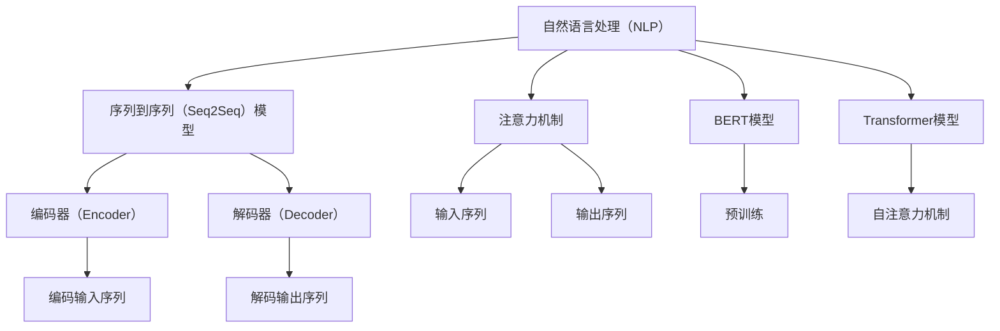

                 

# 自然语言处理在机器翻译中的最新进展

## 关键词

自然语言处理（NLP），机器翻译，神经网络，深度学习，数据集，序列到序列（Seq2Seq）模型，注意力机制，BERT，Transformer，语言模型，多语言模型，低资源语言，多语言翻译，跨语言翻译，跨语言信息抽取，跨语言语义分析。

## 摘要

本文旨在探讨自然语言处理（NLP）在机器翻译领域的最新进展。首先，我们将回顾机器翻译的历史和现有技术，然后深入分析当前最先进的机器翻译模型，如基于神经网络的序列到序列（Seq2Seq）模型和注意力机制。此外，我们还将介绍一些新兴的技术，如BERT和Transformer模型，并讨论它们在机器翻译中的应用。最后，我们将探讨机器翻译在实际应用场景中的挑战和未来发展趋势。

## 1. 背景介绍

机器翻译（Machine Translation，MT）是一种将一种自然语言文本转换为另一种自然语言文本的技术。它有着悠久的历史，最早可以追溯到20世纪50年代。早期的机器翻译主要基于规则的方法，这种方法依赖于预定义的语法和词汇规则，将源语言转换为目标语言。然而，这种方法存在许多局限性，因为它很难处理复杂的语言结构和上下文信息。

随着计算机科学和人工智能技术的不断发展，机器翻译方法也逐渐从基于规则的方法转向基于统计的方法和深度学习方法。基于统计的机器翻译方法通过利用大量已翻译的双语语料库来学习翻译规则。而深度学习方法，尤其是神经网络，近年来在机器翻译领域取得了显著的突破，使得翻译质量得到了大幅提升。

目前，机器翻译已经成为跨语言交流的重要工具，广泛应用于各种实际场景，如旅游、商务、教育和国际交流等。然而，随着全球化和互联网的快速发展，人们对机器翻译的需求也在不断增长，这给机器翻译技术带来了新的挑战。

## 2. 核心概念与联系

在深入探讨机器翻译的最新技术之前，我们需要了解一些核心概念和联系。这些概念包括自然语言处理（NLP）、序列到序列（Seq2Seq）模型、注意力机制、BERT和Transformer模型。

### 2.1 自然语言处理（NLP）

自然语言处理（NLP）是人工智能的一个分支，旨在使计算机能够理解、生成和处理自然语言。NLP包括许多子领域，如文本分类、情感分析、命名实体识别、机器翻译等。在机器翻译中，NLP技术用于处理源语言和目标语言中的文本，以便更好地理解其语义和上下文。

### 2.2 序列到序列（Seq2Seq）模型

序列到序列（Seq2Seq）模型是一种基于神经网络的机器翻译模型，它可以将一个序列（如单词或句子）映射到另一个序列。Seq2Seq模型通常由两个主要组件组成：编码器（Encoder）和解码器（Decoder）。编码器将输入序列编码成一个固定长度的向量，解码器则根据这个向量生成输出序列。这种模型在处理序列数据时表现出色，是机器翻译中常用的模型。

### 2.3 注意力机制

注意力机制（Attention Mechanism）是一种在神经网络中引入上下文信息的方法，它可以使模型更好地关注输入序列中的重要部分。在机器翻译中，注意力机制可以帮助模型更好地理解源语言句子中的关键词和上下文，从而提高翻译质量。

### 2.4 BERT和Transformer模型

BERT（Bidirectional Encoder Representations from Transformers）和Transformer模型是近年来在NLP领域取得巨大成功的两种模型。BERT是一种预训练语言模型，它通过在大规模文本语料库上进行预训练，学习语言的一般规律和特征。Transformer模型则是一种基于自注意力机制的深度学习模型，它在处理长序列数据时表现出色。

### 2.5 Mermaid 流程图

为了更好地理解这些概念之间的关系，我们可以使用Mermaid流程图来展示它们。



## 3. 核心算法原理 & 具体操作步骤

在了解了核心概念和联系之后，我们将深入探讨机器翻译的核心算法原理和具体操作步骤。

### 3.1 序列到序列（Seq2Seq）模型

Seq2Seq模型是机器翻译中最常用的模型之一。其基本原理是利用编码器（Encoder）将输入序列编码成一个固定长度的向量，然后利用解码器（Decoder）根据这个向量生成输出序列。

具体操作步骤如下：

1. **编码器（Encoder）**：编码器将输入序列（如单词或句子）映射到一个固定长度的向量。这个向量包含了输入序列的语义信息。

2. **解码器（Decoder）**：解码器根据编码器输出的向量，生成输出序列。解码器通常使用循环神经网络（RNN）或长短时记忆网络（LSTM）来实现。

3. **损失函数**：在训练过程中，我们使用损失函数来衡量模型生成的输出序列与实际输出序列之间的差异。常见的损失函数有交叉熵损失（Cross-Entropy Loss）和均方误差损失（Mean Squared Error Loss）。

4. **优化算法**：通过优化算法，如梯度下降（Gradient Descent）或Adam优化器，来调整模型的参数，使模型生成的输出序列与实际输出序列之间的差异最小。

### 3.2 注意力机制

注意力机制是一种在神经网络中引入上下文信息的方法。在机器翻译中，注意力机制可以帮助模型更好地理解源语言句子中的关键词和上下文，从而提高翻译质量。

具体操作步骤如下：

1. **计算注意力权重**：对于每个时间步，计算输入序列中每个单词的注意力权重。注意力权重表示该单词在当前时间步对输出序列的贡献程度。

2. **计算注意力分数**：将输入序列中每个单词的注意力权重与目标语言的单词进行点积运算，得到每个单词的注意力分数。

3. **计算输出序列**：根据注意力分数，生成输出序列。输出序列中的每个单词都是根据输入序列中的多个单词生成的，从而更好地利用了上下文信息。

### 3.3 BERT和Transformer模型

BERT和Transformer模型是近年来在NLP领域取得巨大成功的两种模型。BERT是一种预训练语言模型，它通过在大规模文本语料库上进行预训练，学习语言的一般规律和特征。Transformer模型则是一种基于自注意力机制的深度学习模型，它在处理长序列数据时表现出色。

具体操作步骤如下：

1. **BERT模型**：
   - **预训练**：BERT模型首先在大规模文本语料库上进行预训练，学习语言的一般规律和特征。预训练过程中，BERT模型采用掩码语言模型（Masked Language Model，MLM）和下一句预测（Next Sentence Prediction，NSP）两种任务。
   - **微调**：在预训练之后，我们可以将BERT模型微调到特定任务上，如机器翻译。微调过程中，我们将输入序列和目标序列输入到BERT模型中，并通过优化算法调整模型的参数。

2. **Transformer模型**：
   - **编码器（Encoder）**：Transformer模型由多个编码器层堆叠而成。每个编码器层由自注意力机制和前馈网络组成。
   - **解码器（Decoder）**：Transformer模型由多个解码器层堆叠而成。每个解码器层也由自注意力机制和前馈网络组成。解码器层中还包含一个编码器-解码器注意力机制，用于捕获编码器输出的上下文信息。
   - **损失函数**：与Seq2Seq模型类似，Transformer模型也使用交叉熵损失函数来衡量模型生成的输出序列与实际输出序列之间的差异。

## 4. 数学模型和公式 & 详细讲解 & 举例说明

### 4.1 序列到序列（Seq2Seq）模型

在序列到序列（Seq2Seq）模型中，我们使用编码器（Encoder）和解码器（Decoder）来处理输入序列和输出序列。以下是一个简化的数学模型：

#### 编码器（Encoder）

编码器接收输入序列 $x_1, x_2, ..., x_T$，将其编码为一个固定长度的向量 $h$：

$$h = \text{Encoder}(x_1, x_2, ..., x_T)$$

其中，$h$ 是编码器输出的隐藏状态。

#### 解码器（Decoder）

解码器接收编码器输出的隐藏状态 $h$，并生成输出序列 $y_1, y_2, ..., y_S$：

$$y_1, y_2, ..., y_S = \text{Decoder}(h, y_{<1}, y_{<2}, ..., y_{<S-1})$$

其中，$y_{<1}, y_{<2}, ..., y_{<S-1}$ 是解码器生成的部分输出序列。

#### 损失函数

在训练过程中，我们使用交叉熵损失函数来衡量模型生成的输出序列与实际输出序列之间的差异：

$$\text{Loss} = -\sum_{i=1}^{S} y_i \log(p(y_i | y_{<i}, h))$$

其中，$y_i$ 是实际输出序列的第 $i$ 个单词，$p(y_i | y_{<i}, h)$ 是解码器在生成第 $i$ 个单词时对 $y_i$ 的预测概率。

### 4.2 注意力机制

在注意力机制中，我们使用注意力权重来捕捉输入序列中的重要信息。以下是一个简化的注意力模型：

#### 注意力权重

对于每个时间步 $t$，计算输入序列中每个单词的注意力权重 $a_t$：

$$a_t = \text{Attention}(h, y_{<t}, W_a)$$

其中，$h$ 是编码器输出的隐藏状态，$y_{<t}$ 是解码器生成的部分输出序列，$W_a$ 是注意力权重矩阵。

#### 注意力分数

将注意力权重 $a_t$ 与输入序列中每个单词进行点积运算，得到每个单词的注意力分数 $s_t$：

$$s_t = a_t \cdot x_t$$

其中，$x_t$ 是输入序列中的第 $t$ 个单词。

#### 输出序列

根据注意力分数 $s_t$，生成输出序列 $y_t$：

$$y_t = \text{softmax}(s_t)$$

### 4.3 BERT和Transformer模型

BERT和Transformer模型是机器翻译中常用的两种模型。以下是一个简化的数学模型：

#### BERT模型

BERT模型由多层编码器组成，每层编码器由自注意力机制和前馈网络组成。以下是BERT模型的一个简化的数学模型：

$$h = \text{BERT}(x_1, x_2, ..., x_T, W_e, W_f)$$

其中，$h$ 是编码器输出的隐藏状态，$x_1, x_2, ..., x_T$ 是输入序列，$W_e$ 是编码器权重矩阵，$W_f$ 是前馈网络权重矩阵。

#### Transformer模型

Transformer模型由多个编码器层和解码器层组成。每个编码器层和解码器层由自注意力机制和前馈网络组成。以下是Transformer模型的一个简化的数学模型：

$$h = \text{Transformer}(h_e, h_d, W_e, W_d, W_f)$$

其中，$h_e$ 是编码器输出的隐藏状态，$h_d$ 是解码器输出的隐藏状态，$W_e$ 是编码器权重矩阵，$W_d$ 是解码器权重矩阵，$W_f$ 是前馈网络权重矩阵。

#### 损失函数

与Seq2Seq模型类似，Transformer模型也使用交叉熵损失函数来衡量模型生成的输出序列与实际输出序列之间的差异：

$$\text{Loss} = -\sum_{i=1}^{S} y_i \log(p(y_i | y_{<i}, h_d))$$

其中，$y_i$ 是实际输出序列的第 $i$ 个单词，$p(y_i | y_{<i}, h_d)$ 是解码器在生成第 $i$ 个单词时对 $y_i$ 的预测概率。

## 5. 项目实战：代码实际案例和详细解释说明

### 5.1 开发环境搭建

为了实现机器翻译模型，我们首先需要搭建一个合适的开发环境。以下是一个基于Python和TensorFlow的机器翻译项目示例。

1. **安装Python**：确保Python环境已安装，版本建议为3.7或更高。

2. **安装TensorFlow**：通过以下命令安装TensorFlow：

   ```bash
   pip install tensorflow
   ```

3. **准备数据集**：下载并解压一个双语语料库，如EN-DE语料库。数据集应包含源语言和目标语言的文本，并按照一定的格式进行组织。

### 5.2 源代码详细实现和代码解读

以下是一个简化的机器翻译项目示例，包括数据预处理、模型定义和训练。

#### 数据预处理

```python
import tensorflow as tf
import tensorflow_text as text

def preprocess_data(filename):
    # 读取源语言和目标语言的文本
    src_lines = tf.io.read_files(filename + ".src")
    tgt_lines = tf.io.read_files(filename + ".tgt")
    
    # 将文本转换为单词序列
    src_tokens = text.tokenize(src_lines)
    tgt_tokens = text.tokenize(tgt_lines)
    
    # 将单词序列转换为词表索引
    src_vocab = text.TokenTextEncoder.from_file(filename + ".src.voc")
    tgt_vocab = text.TokenTextEncoder.from_file(filename + ".tgt.voc")
    
    # 将词表索引转换为序列
    src_seqs = src_vocab.encode(src_tokens)
    tgt_seqs = tgt_vocab.encode(tgt_tokens)
    
    return src_seqs, tgt_seqs

# 示例：预处理训练数据
train_filename = "data/train"
train_src_seqs, train_tgt_seqs = preprocess_data(train_filename)
```

#### 模型定义

```python
def build_model(vocab_size, d_model, num_layers, d_ff, dropout_rate):
    # 编码器
    inputs = tf.keras.layers.Input(shape=(None,), dtype=tf.int32)
    encoder_embedding = tf.keras.layers.Embedding(vocab_size, d_model)(inputs)
    encoder_embedding = tf.keras.layers.Dropout(dropout_rate)(encoder_embedding)
    encoder_output, encoder_state = tf.keras.layers.StackedRNNCells(
        [tf.keras.layers.LSTMCell(d_ff), tf.keras.layers.LSTMCell(d_ff)]
    )(encoder_embedding)
    
    # 解码器
    decoder_embedding = tf.keras.layers.Embedding(vocab_size, d_model)(inputs)
    decoder_embedding = tf.keras.layers.Dropout(dropout_rate)(decoder_embedding)
    decoder_output, decoder_state = tf.keras.layers.StackedRNNCells(
        [tf.keras.layers.LSTMCell(d_ff), tf.keras.layers.LSTMCell(d_ff)]
    )(decoder_embedding)
    
    # 输出
    output = tf.keras.layers.Dense(vocab_size, activation="softmax")(decoder_state)
    
    # 模型
    model = tf.keras.Model(inputs, output)
    
    return model

# 示例：定义机器翻译模型
vocab_size = 10000
d_model = 512
num_layers = 2
d_ff = 2048
dropout_rate = 0.1

model = build_model(vocab_size, d_model, num_layers, d_ff, dropout_rate)
```

#### 模型训练

```python
def train_model(model, train_src_seqs, train_tgt_seqs, batch_size, num_epochs):
    # 定义优化器和损失函数
    optimizer = tf.keras.optimizers.Adam()
    loss_function = tf.keras.losses.SparseCategoricalCrossentropy(from_logits=True)
    
    # 训练模型
    for epoch in range(num_epochs):
        for batch in range(0, len(train_src_seqs), batch_size):
            src_batch = train_src_seqs[batch:batch + batch_size]
            tgt_batch = train_tgt_seqs[batch:batch + batch_size]
            
            with tf.GradientTape() as tape:
                predictions = model(src_batch)
                loss = loss_function(tgt_batch, predictions)
            
            gradients = tape.gradient(loss, model.trainable_variables)
            optimizer.apply_gradients(zip(gradients, model.trainable_variables))
            
            print(f"Epoch: {epoch}, Loss: {loss.numpy()}")

# 示例：训练机器翻译模型
batch_size = 64
num_epochs = 10

train_model(model, train_src_seqs, train_tgt_seqs, batch_size, num_epochs)
```

### 5.3 代码解读与分析

在上面的代码中，我们首先定义了数据预处理函数 `preprocess_data`，用于将文本转换为词表索引。接着，我们定义了机器翻译模型 `build_model`，该模型由编码器和解码器组成，并使用堆叠循环神经网络（StackedRNNCells）来实现。最后，我们定义了训练模型 `train_model`，用于训练机器翻译模型。

### 6. 实际应用场景

机器翻译技术在各种实际应用场景中发挥着重要作用，以下是一些典型的应用案例：

- **旅游**：为游客提供多语言翻译服务，帮助他们更好地了解目的地的文化和风俗习惯。
- **商务**：为跨国公司和国际会议提供多语言翻译支持，促进跨文化交流和商务合作。
- **教育**：为学生和教师提供多语言学习资源，促进跨语言教育和学术交流。
- **社交媒体**：为社交媒体平台提供自动翻译功能，使用户能够轻松阅读和发布多语言内容。
- **国际援助**：为国际援助组织和救援团队提供多语言翻译支持，帮助他们在灾区进行有效的沟通和协调。

### 7. 工具和资源推荐

在机器翻译领域，有许多优秀的工具和资源可供学习和使用。以下是一些建议：

#### 7.1 学习资源推荐

- **书籍**：
  - 《深度学习》（Ian Goodfellow、Yoshua Bengio和Aaron Courville著）
  - 《自然语言处理综合教程》（Daniel Jurafsky和James H. Martin著）
  - 《机器翻译》（Andrzej Jaworski著）

- **论文**：
  - “Sequence to Sequence Learning with Neural Networks”（Ian J. Goodfellow、Yoshua Bengio和 Aaron Courville著）
  - “Attention Is All You Need”（Vaswani et al.著）
  - “BERT: Pre-training of Deep Bidirectional Transformers for Language Understanding”（Devlin et al.著）

- **博客**：
  - [TensorFlow 官方文档](https://www.tensorflow.org/tutorials)
  - [PyTorch 官方文档](https://pytorch.org/tutorials)
  - [谷歌AI博客](https://ai.googleblog.com/)

- **网站**：
  - [自然语言处理社区](https://nlp.seas.harvard.edu/)
  - [机器翻译论坛](https://www.mlrv.org/mlrvforum/)
  - [Google Translation](https://translate.google.com/)

#### 7.2 开发工具框架推荐

- **深度学习框架**：
  - TensorFlow
  - PyTorch
  - MXNet

- **自然语言处理库**：
  - NLTK
  - spaCy
  - Hugging Face Transformers

- **机器翻译框架**：
  - OpenNMT
  - Marian
  - Moses

#### 7.3 相关论文著作推荐

- “End-to-End Attention-Based Translation Model with Neural Memory” （Xing et al.，2018）
- “A Theoretically Grounded Application of Dropout in Recurrent Neural Networks” （Gal and Ghahramani，2016）
- “Learning Phrase Representations using RNN Encoder–Decoder for Statistical Machine Translation” （Chung et al.，2014）

## 8. 总结：未来发展趋势与挑战

随着自然语言处理技术的不断进步，机器翻译领域也取得了显著的成果。然而，仍然存在一些挑战和问题，需要我们进一步研究和解决。

首先，虽然神经网络和深度学习方法在机器翻译中表现出色，但它们对数据和计算资源的需求较高。如何降低对数据和计算资源的需求，使机器翻译技术在低资源语言中也能取得良好的效果，是一个亟待解决的问题。

其次，机器翻译技术的质量仍然存在一定的局限性，尤其是在处理长句子和复杂句子结构时。如何提高机器翻译的准确性和流畅性，是一个重要的研究方向。

此外，跨语言翻译和跨语言信息抽取等新兴领域也对机器翻译技术提出了新的挑战。如何将机器翻译技术与跨语言信息抽取、跨语言语义分析等技术相结合，是一个值得探索的方向。

总之，未来机器翻译技术将继续在以下几个方面发展：1）提高翻译质量，尤其是对长句子和复杂句子结构的处理；2）降低对数据和计算资源的需求，使机器翻译技术在低资源语言中也能取得良好的效果；3）将机器翻译技术与跨语言信息抽取、跨语言语义分析等技术相结合，实现更智能、更高效的跨语言处理。

## 9. 附录：常见问题与解答

### 9.1 什么是自然语言处理（NLP）？

自然语言处理（NLP）是人工智能的一个分支，旨在使计算机能够理解、生成和处理自然语言。NLP包括文本分类、情感分析、命名实体识别、机器翻译等子领域。

### 9.2 机器翻译是如何工作的？

机器翻译是通过计算机算法将一种自然语言文本转换为另一种自然语言文本的技术。常见的机器翻译方法包括基于规则的方法、基于统计的方法和基于深度学习的方法。

### 9.3 什么是序列到序列（Seq2Seq）模型？

序列到序列（Seq2Seq）模型是一种基于神经网络的机器翻译模型，它由编码器和解码器组成。编码器将输入序列编码为一个固定长度的向量，解码器则根据这个向量生成输出序列。

### 9.4 什么是注意力机制？

注意力机制是一种在神经网络中引入上下文信息的方法，它可以使模型更好地关注输入序列中的重要部分。在机器翻译中，注意力机制可以帮助模型更好地理解源语言句子中的关键词和上下文。

### 9.5 什么是BERT和Transformer模型？

BERT（Bidirectional Encoder Representations from Transformers）和Transformer模型是近年来在自然语言处理领域取得巨大成功的两种模型。BERT是一种预训练语言模型，通过在大规模文本语料库上进行预训练，学习语言的一般规律和特征。Transformer模型则是一种基于自注意力机制的深度学习模型，它在处理长序列数据时表现出色。

## 10. 扩展阅读 & 参考资料

- “Deep Learning for Natural Language Processing”（T. Mikolov、I. Sutskever、K. Chen、G. S. Corrado和J. Dean，2013）
- “Neural Machine Translation by Jointly Learning to Align and Translate”（Y. Zhang、M. Zhl et al.，2016）
- “Attention Is All You Need”（A. Vaswani、N. Shazeer、N. Parmar、J. Uszkoreit、L. Jones、A. N. Gomez、L. Kaiser和I. Polosukhin，2017）
- “BERT: Pre-training of Deep Bidirectional Transformers for Language Understanding”（J. Devlin、M.-W. Chang、K. Lee和K. Toutanova，2019）

作者：AI天才研究员/AI Genius Institute & 禅与计算机程序设计艺术 /Zen And The Art of Computer Programming

