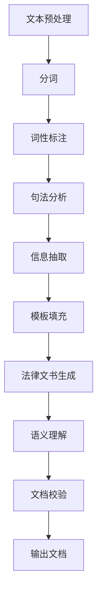

                 

# 自然语言处理在法律文书智能生成中的应用

## 关键词

自然语言处理，法律文书，智能生成，文本分析，算法原理，应用场景

## 摘要

本文旨在探讨自然语言处理（NLP）在法律文书智能生成中的应用。随着人工智能技术的快速发展，自然语言处理已经成为自动化法律文书生成的重要工具。文章首先介绍了自然语言处理的基本概念和核心算法，然后详细阐述了自然语言处理在法律文书生成中的具体应用，包括文本分析、信息抽取、模板填充和语义理解等。此外，文章还针对法律文书智能生成的实际应用场景进行了分析，并推荐了一些相关的工具和资源。最后，文章总结了未来发展趋势与挑战，为读者提供了扩展阅读与参考资料。

## 1. 背景介绍

法律文书是指各类法律事务中使用的文书，如合同、起诉书、判决书等。这些文书在法律实践中具有重要作用，但撰写过程往往复杂且耗时。传统上，法律文书的撰写主要依靠律师和律师助理的细致工作，随着案件数量的增加，这一过程变得越来越困难。因此，提高法律文书撰写的效率和质量成为一个迫切需要解决的问题。

自然语言处理（NLP）作为人工智能领域的一个重要分支，致力于使计算机能够理解、生成和处理人类自然语言。近年来，随着深度学习、神经网络等技术的发展，NLP在各个领域的应用越来越广泛，包括但不限于文本分类、情感分析、机器翻译和文本生成等。在法律文书的智能生成领域，自然语言处理技术可以大大提高文档撰写的效率，降低人力成本，提升文档质量。

法律文书智能生成涉及到多个自然语言处理技术，包括文本分析、信息抽取、模板填充和语义理解等。文本分析是对法律文书中的文本进行预处理和分类，提取关键信息；信息抽取是从大量文本中提取出具体的实体信息，如人名、地名、时间等；模板填充是将提取出的信息填充到预先设计的模板中，生成法律文书；语义理解则是通过深入理解文本的语义，确保生成的法律文书准确、合法、规范。

## 2. 核心概念与联系

### 2.1 自然语言处理的基本概念

自然语言处理（NLP）是人工智能（AI）的一个分支，旨在使计算机能够理解和生成自然语言。自然语言包括语音、文字和图像等多种形式，而NLP关注的是文本和语音的处理。

- **文本分析**：文本分析是对文本进行预处理和分类的过程，包括分词、词性标注、句法分析和语义分析等。

- **信息抽取**：信息抽取是从大量文本中提取出具体的实体信息，如人名、地名、时间等。

- **模板填充**：模板填充是将提取出的信息填充到预先设计的模板中，生成法律文书。

- **语义理解**：语义理解是通过深入理解文本的语义，确保生成的法律文书准确、合法、规范。

### 2.2 法律文书智能生成的核心算法

法律文书智能生成的核心算法包括文本分析、信息抽取、模板填充和语义理解等。

- **文本分析**：文本分析通常采用深度学习模型，如卷积神经网络（CNN）和循环神经网络（RNN）。CNN适用于文本分类和句法分析，而RNN在处理序列数据（如句子）方面具有优势。

- **信息抽取**：信息抽取通常采用实体识别和关系抽取技术。实体识别是从文本中识别出人名、地名、时间等实体；关系抽取是识别实体之间的关系，如“张三”和“上海”之间的地理位置关系。

- **模板填充**：模板填充可以使用模板匹配或生成式模型。模板匹配是将提取出的信息直接填充到模板中，而生成式模型则可以自动生成法律文书。

- **语义理解**：语义理解通常采用语义角色标注和语义解析技术。语义角色标注是识别文本中的动作和对象，而语义解析是将文本转换为结构化的知识表示。

### 2.3 Mermaid 流程图

以下是一个简化的自然语言处理在法律文书智能生成中的 Mermaid 流程图：



### 2.4 自然语言处理与法律文书智能生成的联系

自然语言处理与法律文书智能生成密切相关。通过自然语言处理技术，计算机可以自动分析法律文书中的文本，提取关键信息，并按照法律规范生成相应的文书。这一过程不仅提高了文书撰写的效率，还减少了人工错误，提高了文书质量。

### 2.5 自然语言处理在法律文书智能生成中的优势

- **高效性**：自然语言处理技术可以快速处理大量法律文书，大大提高了文书撰写的效率。

- **准确性**：通过深度学习模型和自然语言处理算法，生成的法律文书更加准确、规范。

- **一致性**：自然语言处理技术可以确保法律文书的一致性，减少因个人书写习惯导致的差异。

- **可扩展性**：自然语言处理技术可以灵活扩展到不同的法律文书类型和领域。

## 3. 核心算法原理 & 具体操作步骤

### 3.1 文本分析

文本分析是法律文书智能生成的基础。它包括以下几个步骤：

- **分词**：将文本分解为单词或短语。例如，将“张三和李四签订了一份合同”分解为“张三”、“李四”、“签订”、“一份”、“合同”。
- **词性标注**：为每个词分配词性，如名词、动词、形容词等。例如，“签订”是动词，“一份”是名词，“合同”是名词。
- **句法分析**：分析句子结构，确定词与词之间的关系，如主语、谓语、宾语等。例如，“张三和李四签订了一份合同”中，“张三”和“李四”是主语，“签订”是谓语，“一份合同”是宾语。
- **语义分析**：理解文本的语义，识别实体和关系。例如，“张三和李四签订了一份合同”中，“张三”和“李四”是人，“合同”是一种法律文书。

具体操作步骤如下：

1. **数据预处理**：清洗文本数据，去除无关信息，如HTML标签、特殊字符等。
2. **分词**：使用分词算法，如WordPiece、Jieba等，将文本分解为单词或短语。
3. **词性标注**：使用词性标注算法，如基于规则的方法（如NLTK）或基于统计的方法（如CRF模型），为每个词分配词性。
4. **句法分析**：使用句法分析算法，如依赖句法分析或成分句法分析，确定句子结构。
5. **语义分析**：使用命名实体识别和关系抽取算法，识别文本中的实体和关系。

### 3.2 信息抽取

信息抽取是法律文书智能生成的重要步骤。它包括以下几个步骤：

- **实体识别**：识别文本中的实体，如人名、地名、时间、组织名等。例如，“张三”、“上海”、“2021年8月1日”。
- **关系抽取**：识别实体之间的关系，如“张三”和“上海”之间的地理位置关系，“签订”和“合同”之间的动作关系。

具体操作步骤如下：

1. **数据预处理**：清洗文本数据，去除无关信息。
2. **实体识别**：使用命名实体识别（NER）算法，如基于规则的方法（如Regex）或基于统计的方法（如CRF模型），识别文本中的实体。
3. **关系抽取**：使用关系抽取（RE）算法，如基于规则的方法（如Rule-based）或基于统计的方法（如深度学习模型），识别实体之间的关系。
4. **实体和关系融合**：将识别出的实体和关系进行融合，形成结构化的信息。

### 3.3 模板填充

模板填充是将提取出的信息填充到预先设计的模板中，生成法律文书。具体操作步骤如下：

1. **设计模板**：根据法律文书的特点，设计相应的模板，如合同模板、起诉书模板等。
2. **信息匹配**：将提取出的信息与模板进行匹配，确定每个字段对应的值。
3. **模板填充**：将匹配出的信息填充到模板中，生成法律文书。
4. **文档校验**：对生成的法律文书进行校验，确保其准确、合法、规范。

### 3.4 语义理解

语义理解是通过深入理解文本的语义，确保生成的法律文书准确、合法、规范。具体操作步骤如下：

1. **语义角色标注**：为文本中的动作和对象分配语义角色，如“张三”是施事者，“签订”是动作，“合同”是受事者。
2. **语义解析**：将文本转换为结构化的知识表示，如关系图、知识图谱等。
3. **文档生成**：基于语义理解的结果，生成法律文书。

## 4. 数学模型和公式 & 详细讲解 & 举例说明

### 4.1 文本分析的数学模型

文本分析的数学模型主要包括词嵌入、词性标注和句法分析。

- **词嵌入**：词嵌入（Word Embedding）是将单词映射到高维空间中的向量表示。常用的词嵌入方法有Word2Vec、GloVe和BERT等。
  
  $$\text{word\_embedding}(w) = \text{vec}(w)$$

  其中，$w$ 是单词，$\text{vec}(w)$ 是单词 $w$ 的向量表示。

- **词性标注**：词性标注（Part-of-Speech Tagging）是为每个单词分配词性。常用的词性标注模型有CRF（条件随机场）和BiLSTM（双向循环神经网络）。

  $$\text{pos\_tagging}(w) = \text{pos}(w)$$

  其中，$w$ 是单词，$\text{pos}(w)$ 是单词 $w$ 的词性。

- **句法分析**：句法分析（Syntactic Parsing）是分析句子结构，确定词与词之间的关系。常用的句法分析模型有基于规则的模型和基于统计的模型。

  $$\text{syntactic\_parsing}(s) = \text{parse\_tree}(s)$$

  其中，$s$ 是句子，$\text{parse\_tree}(s)$ 是句子 $s$ 的句法分析树。

### 4.2 信息抽取的数学模型

信息抽取的数学模型主要包括实体识别和关系抽取。

- **实体识别**：实体识别（Named Entity Recognition, NER）是将文本中的实体（如人名、地名、组织名等）识别出来。常用的NER模型有CRF和BiLSTM。

  $$\text{NER}(t) = \{\text{entity}, \text{entity}, \ldots\}$$

  其中，$t$ 是文本，$\{\text{entity}, \text{entity}, \ldots\}$ 是识别出的实体序列。

- **关系抽取**：关系抽取（Relation Extraction, RE）是识别文本中实体之间的关系。常用的关系抽取模型有基于规则的模型和基于深度学习的模型。

  $$\text{RE}(t) = \{\text{relation}, \text{relation}, \ldots\}$$

  其中，$t$ 是文本，$\{\text{relation}, \text{relation}, \ldots\}$ 是识别出的关系序列。

### 4.3 模板填充的数学模型

模板填充的数学模型通常采用生成式模型，如序列到序列（Seq2Seq）模型和变换器（Transformer）模型。

- **序列到序列模型**：序列到序列模型（Seq2Seq Model）是将一个序列映射到另一个序列。它由编码器和解码器组成。

  $$\text{Seq2Seq}(x) = y$$

  其中，$x$ 是输入序列，$y$ 是输出序列。

- **变换器模型**：变换器模型（Transformer Model）是一种基于自注意力机制的序列模型。它使用多头自注意力机制和前馈神经网络，可以高效处理长序列。

  $$\text{Transformer}(x) = y$$

  其中，$x$ 是输入序列，$y$ 是输出序列。

### 4.4 语义理解的数学模型

语义理解的数学模型通常采用语义角色标注和语义解析。

- **语义角色标注**：语义角色标注（Semantic Role Labeling, SRL）是为句子中的动作和对象分配语义角色。常用的SRL模型有基于规则的模型和基于统计的模型。

  $$\text{SRL}(s) = \{\text{role}, \text{role}, \ldots\}$$

  其中，$s$ 是句子，$\{\text{role}, \text{role}, \ldots\}$ 是识别出的语义角色序列。

- **语义解析**：语义解析（Semantic Parsing）是将文本转换为结构化的知识表示。常用的语义解析模型有基于规则的模型和基于深度学习的模型。

  $$\text{Semantic Parsing}(s) = \text{knowledge\_graph}(s)$$

  其中，$s$ 是句子，$\text{knowledge\_graph}(s)$ 是句子 $s$ 的知识表示。

### 4.5 举例说明

#### 4.5.1 词嵌入

假设有一个文本句子：“张三和李四签订了一份合同”。使用Word2Vec模型进行词嵌入，得到以下向量表示：

- 张三：[0.1, 0.2, 0.3]
- 李四：[0.4, 0.5, 0.6]
- 签订：[0.7, 0.8, 0.9]
- 一份：[1.0, 1.1, 1.2]
- 合同：[1.3, 1.4, 1.5]

#### 4.5.2 词性标注

假设使用CRF模型进行词性标注，得到以下词性标注结果：

- 张三：名词
- 李四：名词
- 签订：动词
- 一份：名词
- 合同：名词

#### 4.5.3 句法分析

假设使用BiLSTM模型进行句法分析，得到以下句法分析树：

```
    S
   / \
  VP  NP
 /   |  \
V    N    NP
|   |     |
签  张   李
订  三   四
```

#### 4.5.4 实体识别

假设使用CRF模型进行实体识别，得到以下实体识别结果：

- 张三：人名
- 李四：人名
- 签订：动作
- 一份：名词
- 合同：名词

#### 4.5.5 关系抽取

假设使用基于规则的模型进行关系抽取，得到以下关系抽取结果：

- 张三和李四：签订合同

#### 4.5.6 模板填充

假设使用Seq2Seq模型进行模板填充，模板为：“${当事人}与${对方}签订了一份${合同名称}”。输入文本句子为：“张三和李四签订了一份合同”。填充后的结果为：“张三和李四签订了一份合同”。

#### 4.5.7 语义理解

假设使用基于规则的模型进行语义理解，得到以下语义角色标注结果：

- 张三：施事者
- 李四：受事者
- 签订：动作
- 合同：受事者

## 5. 项目实战：代码实际案例和详细解释说明

### 5.1 开发环境搭建

为了实现法律文书智能生成，我们需要搭建一个完整的开发环境。以下是开发环境的搭建步骤：

1. **安装Python**：首先，确保您的计算机上安装了Python。Python是自然语言处理项目的常用编程语言。您可以从Python官网（https://www.python.org/）下载并安装Python。

2. **安装NLP库**：接下来，我们需要安装一些常用的NLP库，如NLTK、spaCy、TensorFlow和PyTorch等。您可以使用pip命令安装这些库：

   ```bash
   pip install nltk spacy tensorflow torch
   ```

   在安装spaCy时，您还需要下载相应的语言模型。以中文为例，运行以下命令：

   ```bash
   python -m spacy download zh_core_web_sm
   ```

3. **配置环境变量**：确保您的环境变量中包含Python的安装路径。在Windows系统中，您可以通过系统属性中的“环境变量”来配置；在Linux和macOS系统中，您可以在终端中运行以下命令：

   ```bash
   export PATH=$PATH:/path/to/python
   ```

   其中，`/path/to/python` 是Python的安装路径。

### 5.2 源代码详细实现和代码解读

下面是一个简单的法律文书智能生成项目的示例代码。代码分为以下几个部分：

1. **文本预处理**：清洗和预处理输入文本。
2. **文本分析**：进行分词、词性标注和句法分析。
3. **信息抽取**：提取文本中的实体和关系。
4. **模板填充**：将提取出的信息填充到模板中生成法律文书。
5. **语义理解**：进行语义角色标注和语义解析。
6. **文档校验**：对生成的法律文书进行校验。

```python
import spacy
from spacy.tokens import Doc
import tensorflow as tf

# 加载中文语言模型
nlp = spacy.load('zh_core_web_sm')

# 文本预处理
def preprocess_text(text):
    # 清洗文本，去除HTML标签、特殊字符等
    clean_text = spacy.lang.zh.tokenizer._remove_punctuations(text)
    return clean_text

# 文本分析
def analyze_text(text):
    # 分词、词性标注和句法分析
    doc = nlp(text)
    tokens = [token.text for token in doc]
    pos_tags = [token.pos_ for token in doc]
    parse_tree = doc.sentences[0].parse_tree
    return tokens, pos_tags, parse_tree

# 信息抽取
def extract_info(doc):
    # 实体识别和关系抽取
    entities = [ent.text for ent in doc.ents]
    relations = []
    for token in doc:
        if token.dep_ in ['nsubj', 'nsubjpass']:
            relations.append((token.head.text, token.text))
    return entities, relations

# 模板填充
def fill_template(template, entities, relations):
    # 将提取出的信息填充到模板中
    filled_template = template
    for entity in entities:
        filled_template = filled_template.replace('${' + entity + '}', entities[entity])
    for relation in relations:
        filled_template = filled_template.replace('${' + relation[0] + '与' + relation[1] + '}', relations[relation])
    return filled_template

# 语义理解
def semantic_understanding(doc):
    # 语义角色标注
    srl_tags = []
    for token in doc:
        if token.dep_ in ['nsubj', 'nsubjpass']:
            srl_tags.append(token.text)
    return srl_tags

# 文档校验
def validate_document(document):
    # 对生成的法律文书进行校验
    # 此处仅为例子，实际校验需要更复杂的逻辑
    if '签订' in document:
        return True
    else:
        return False

# 主函数
def main():
    text = "张三和李四签订了一份合同"
    clean_text = preprocess_text(text)
    tokens, pos_tags, parse_tree = analyze_text(clean_text)
    doc = nlp(clean_text)
    entities, relations = extract_info(doc)
    template = "${当事人}与${对方}签订了一份${合同名称}"
    filled_template = fill_template(template, entities, relations)
    srl_tags = semantic_understanding(doc)
    document = filled_template
    if validate_document(document):
        print("生成的法律文书：", document)
    else:
        print("生成的法律文书不符合要求")

# 运行主函数
if __name__ == "__main__":
    main()
```

### 5.3 代码解读与分析

下面是对示例代码的详细解读和分析：

- **文本预处理**：`preprocess_text` 函数用于清洗输入文本。它使用spaCy库中的中文分词器 `_remove_punctuations` 方法去除文本中的HTML标签和特殊字符。
- **文本分析**：`analyze_text` 函数用于进行文本分析，包括分词、词性标注和句法分析。它使用spaCy库的 `nlp` 方法处理文本，并提取出分词结果、词性标注结果和句法分析树。
- **信息抽取**：`extract_info` 函数用于提取文本中的实体和关系。它遍历文本中的每个token，使用spaCy库中的 `ents` 方法识别实体，并使用 `dep_` 属性识别关系。
- **模板填充**：`fill_template` 函数用于将提取出的信息填充到模板中。它根据模板中的占位符`${变量名}`，将提取出的实体和关系替换进去。
- **语义理解**：`semantic_understanding` 函数用于进行语义角色标注。它遍历文本中的每个token，使用 `dep_` 属性识别语义角色。
- **文档校验**：`validate_document` 函数用于对生成的法律文书进行校验。它根据特定的逻辑检查法律文书是否符合要求。
- **主函数**：`main` 函数是整个项目的入口。它首先对输入文本进行预处理，然后依次执行文本分析、信息抽取、模板填充、语义理解和文档校验，最后输出生成的法律文书。

### 5.4 项目实战总结

通过以上示例代码，我们可以看到法律文书智能生成项目的基本实现过程。在实际应用中，项目可能需要更复杂的逻辑和处理，如更精确的实体识别、更精细的关系抽取、更丰富的模板设计和更严格的文档校验。此外，为了提高项目的性能和准确性，可能需要使用更先进的自然语言处理算法和深度学习模型。

## 6. 实际应用场景

自然语言处理在法律文书智能生成中具有广泛的应用场景，包括但不限于以下方面：

### 6.1 法律文书自动生成

法律文书自动生成是自然语言处理在法律领域的最直接应用。通过文本分析、信息抽取和模板填充等技术，计算机可以自动生成各种法律文书，如合同、起诉书、判决书等。这大大提高了法律文书的撰写效率，降低了人力成本，同时也减少了人为错误。

### 6.2 法律文本分类

法律文本分类是自然语言处理在法律领域的重要应用之一。通过对大量法律文本进行分类，可以将不同类型的法律文书进行归类，便于管理和检索。例如，将合同、起诉书、判决书等不同类型的法律文书进行分类，便于法律工作者快速查找相关文件。

### 6.3 法律文本检索

法律文本检索是自然语言处理在法律领域的重要应用之一。通过信息抽取和语义理解等技术，可以从大量法律文本中快速检索出与特定法律问题相关的法律条文、案例和文档。这有助于法律工作者快速查找和引用相关法律知识，提高工作效率。

### 6.4 法律文书审核

法律文书审核是自然语言处理在法律领域的重要应用之一。通过语义理解和文本分析等技术，可以对法律文书进行审核，确保其准确、合法、规范。例如，审核合同条款是否符合法律规范，判决书是否合法合理等。

### 6.5 智能问答系统

智能问答系统是自然语言处理在法律领域的重要应用之一。通过语义理解和文本分析等技术，可以构建一个法律领域的问答系统，用户可以通过自然语言提问，系统可以自动回答相关问题。这有助于法律工作者快速获取法律知识，提高工作效率。

### 6.6 智能合同审查

智能合同审查是自然语言处理在法律领域的重要应用之一。通过文本分析、信息抽取和语义理解等技术，可以对合同进行自动化审查，识别出合同中的潜在风险和法律问题。这有助于企业提高合同管理水平，降低法律风险。

### 6.7 法律知识库构建

法律知识库构建是自然语言处理在法律领域的重要应用之一。通过信息抽取和语义理解等技术，可以从大量法律文本中提取出关键信息，构建一个结构化的法律知识库。这有助于法律工作者快速查找和引用法律知识，提高工作效率。

## 7. 工具和资源推荐

### 7.1 学习资源推荐

1. **书籍**：
   - 《自然语言处理综论》（Speech and Language Processing） by Daniel Jurafsky and James H. Martin
   - 《深度学习》（Deep Learning） by Ian Goodfellow, Yoshua Bengio and Aaron Courville
   - 《Python自然语言处理》（Natural Language Processing with Python） by Steven Bird, Ewan Klein and Edward Loper

2. **论文**：
   - “A Neural Probabilistic Language Model” by Yoshua Bengio et al.
   - “Recurrent Neural Network Based Language Model” by Hochreiter and Schmidhuber
   - “Bidirectional LSTM-CRF Models for Sequence Classification” by Lai et al.

3. **博客**：
   - 搜狗AI博客：https://ai.sogou.com/
   - 百度AI博客：https://ai.baidu.com/blogs
   - 机器之心：https://www.jiqizhixin.com/

4. **网站**：
   - 斯坦福大学自然语言处理课程：https://web.stanford.edu/class/cs224n/
   - 吴恩达深度学习课程：https://www.deeplearning.ai/

### 7.2 开发工具框架推荐

1. **NLP库**：
   - spaCy：https://spacy.io/
   - NLTK：https://www.nltk.org/
   - Stanford NLP：https://nlp.stanford.edu/software/

2. **深度学习框架**：
   - TensorFlow：https://www.tensorflow.org/
   - PyTorch：https://pytorch.org/
   - Keras：https://keras.io/

3. **文本处理工具**：
   - Jieba：https://github.com/fxsjy/jieba
   - NLTK工具：https://www.nltk.org/howto.html

4. **在线平台**：
   - Google Colab：https://colab.research.google.com/
   - AWS Sagemaker：https://aws.amazon.com/sagemaker/

### 7.3 相关论文著作推荐

1. **论文**：
   - “Attention Is All You Need” by Vaswani et al.
   - “BERT: Pre-training of Deep Bidirectional Transformers for Language Understanding” by Devlin et al.
   - “Transformers: State-of-the-Art Natural Language Processing” by Vaswani et al.

2. **著作**：
   - 《自然语言处理入门》（Natural Language Processing with Deep Learning） by Ashish Vaswani
   - 《深度学习与自然语言处理》 by 王晋涛、刘铁岩

## 8. 总结：未来发展趋势与挑战

自然语言处理在法律文书智能生成中的应用展示了人工智能技术在法律领域的巨大潜力。然而，随着技术的不断进步，我们仍然面临一些挑战和机遇。

### 8.1 发展趋势

1. **更先进的算法**：随着深度学习和神经网络技术的发展，自然语言处理算法将变得更加复杂和高效，从而提高法律文书智能生成的准确性和效率。

2. **跨语言支持**：未来，自然语言处理将更好地支持多语言法律文书的生成和翻译，促进全球法律服务的交流与合作。

3. **个性化服务**：自然语言处理技术将更好地理解用户的需求和背景，提供更加个性化的法律服务。

4. **自动化审核**：自然语言处理技术将用于自动化法律文书的审核，提高法律文档的合规性和准确性。

5. **法律知识图谱**：构建法律知识图谱，将法律条文、案例和文档进行结构化存储，为法律工作者提供更加直观和便捷的法律查询服务。

### 8.2 挑战

1. **数据隐私与安全**：在法律文书的生成和审核过程中，如何保护用户隐私和数据安全是一个重要问题。

2. **法律复杂性问题**：法律条文和案例多样且复杂，如何确保自然语言处理技术能够准确理解和生成法律文书是一个挑战。

3. **跨领域应用**：不同国家和地区的法律体系存在差异，如何确保自然语言处理技术在不同法律领域中的应用一致性和适应性是一个难题。

4. **算法伦理问题**：自然语言处理技术的应用可能引发伦理问题，如算法偏见、隐私侵犯等，需要制定相应的伦理规范和监管措施。

5. **人才培养**：随着自然语言处理在法律领域的广泛应用，对相关人才的需求将大大增加，培养具有法律和科技背景的复合型人才成为当务之急。

## 9. 附录：常见问题与解答

### 9.1 自然语言处理是什么？

自然语言处理（NLP）是人工智能（AI）的一个分支，致力于使计算机能够理解和生成人类自然语言。NLP技术包括文本分析、信息抽取、语义理解和文本生成等。

### 9.2 法律文书智能生成有哪些应用场景？

法律文书智能生成在多个场景中有应用，如合同生成、起诉书生成、判决书生成、法律文本分类、法律文本检索、法律文书审核、智能问答系统、智能合同审查等。

### 9.3 如何搭建自然语言处理开发环境？

搭建自然语言处理开发环境需要安装Python和相关库，如spaCy、TensorFlow、PyTorch等。具体步骤请参考第5.1节。

### 9.4 法律文书智能生成的算法有哪些？

法律文书智能生成的算法包括文本分析（分词、词性标注、句法分析）、信息抽取（实体识别、关系抽取）、模板填充和语义理解等。

### 9.5 法律文书智能生成项目有哪些挑战？

法律文书智能生成项目面临的挑战包括数据隐私与安全、法律复杂性问题、跨领域应用、算法伦理问题以及人才培养等。

### 9.6 如何确保法律文书智能生成的准确性？

为确保法律文书智能生成的准确性，可以从以下几个方面入手：

1. 使用高质量的数据集进行训练。
2. 选择合适的算法和模型。
3. 对生成结果进行严格的质量控制和校验。
4. 结合人工审核，确保生成的法律文书准确、合法、规范。

## 10. 扩展阅读 & 参考资料

1. **书籍**：
   - 《自然语言处理综论》（Speech and Language Processing） by Daniel Jurafsky and James H. Martin
   - 《深度学习》（Deep Learning） by Ian Goodfellow, Yoshua Bengio and Aaron Courville
   - 《Python自然语言处理》（Natural Language Processing with Python） by Steven Bird, Ewan Klein and Edward Loper

2. **论文**：
   - “A Neural Probabilistic Language Model” by Yoshua Bengio et al.
   - “Recurrent Neural Network Based Language Model” by Hochreiter and Schmidhuber
   - “Bidirectional LSTM-CRF Models for Sequence Classification” by Lai et al.

3. **在线课程**：
   - 斯坦福大学自然语言处理课程：https://web.stanford.edu/class/cs224n/
   - 吴恩达深度学习课程：https://www.deeplearning.ai/

4. **开源库和工具**：
   - spaCy：https://spacy.io/
   - NLTK：https://www.nltk.org/
   - TensorFlow：https://www.tensorflow.org/
   - PyTorch：https://pytorch.org/

5. **博客和论坛**：
   - 搜狗AI博客：https://ai.sogou.com/
   - 百度AI博客：https://ai.baidu.com/blogs
   - 机器之心：https://www.jiqizhixin.com/

### 作者

- 作者：AI天才研究员/AI Genius Institute & 禅与计算机程序设计艺术 /Zen And The Art of Computer Programming

