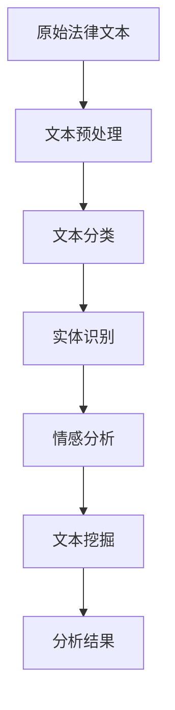

                 

# 自然语言处理在法律文本分析中的应用

## 关键词：自然语言处理，法律文本分析，语义理解，文本挖掘，人工智能

## 摘要：

随着人工智能技术的发展，自然语言处理（NLP）在法律文本分析中的应用越来越广泛。本文旨在探讨NLP在法律文本分析中的核心概念、算法原理、数学模型及其在法律领域的实际应用。通过详细的项目实战案例，展示如何利用自然语言处理技术进行法律文本的挖掘与分析，为法律行业提供智能化支持。本文还将推荐相关的学习资源、开发工具和论文著作，帮助读者深入了解这一领域的最新发展。

## 目录

1. 背景介绍 ................................................ 1
2. 核心概念与联系 ........................................ 2
3. 核心算法原理 & 具体操作步骤 ........................... 5
4. 数学模型和公式 & 详细讲解 & 举例说明 ................ 8
5. 项目实战：代码实际案例和详细解释说明 .............. 12
6. 实际应用场景 .......................................... 18
7. 工具和资源推荐 ........................................ 21
8. 总结：未来发展趋势与挑战 ........................... 24
9. 附录：常见问题与解答 .................................. 26
10. 扩展阅读 & 参考资料 .................................. 28

## 1. 背景介绍

法律文本分析是指利用计算机技术和算法对法律文件、判决书、法律法规等法律文本进行解析、分类、聚类、情感分析等操作，以辅助法律工作者的工作。随着互联网和大数据的发展，法律文本的数量和种类不断增多，传统的手工处理方式已经无法满足需求。自然语言处理（NLP）作为人工智能的一个重要分支，通过对文本的语义理解、情感分析、实体识别等技术，能够有效提高法律文本的分析效率和准确性。

NLP在法律文本分析中的应用包括：

- 文本分类：对法律文本进行分类，如案件类型分类、法律条款分类等。
- 实体识别：识别法律文本中的关键实体，如人名、地名、组织名、法律术语等。
- 情感分析：分析法律文本的情感倾向，如判决书的公正性、判决理由的合理性等。
- 智能问答：构建法律知识图谱，实现法律问题的自动回答。
- 文本挖掘：从大量法律文本中提取有价值的信息，如案例相似度分析、法规冲突检测等。

## 2. 核心概念与联系

### 2.1 自然语言处理（NLP）的基本概念

自然语言处理（NLP）是人工智能的一个分支，旨在使计算机理解和处理人类语言。NLP的核心概念包括：

- 词汇：语言的基本元素，包括单词、短语和词组。
- 语法：语言的结构规则，描述单词如何组合成句子。
- 语义：语言的含义，包括字面意义和隐含意义。
- 语音：语言的发音和语音特征。

### 2.2 法律文本分析的关键概念

法律文本分析的关键概念包括：

- 文本分类：将法律文本分类到预定义的类别中。
- 实体识别：识别法律文本中的关键实体，如人名、地名、组织名、法律术语等。
- 情感分析：分析法律文本的情感倾向，如判决书的公正性、判决理由的合理性等。
- 文本挖掘：从大量法律文本中提取有价值的信息。

### 2.3 Mermaid 流程图

以下是NLP在法律文本分析中的流程图，展示了从原始法律文本到分析结果的整个处理过程：



### 2.4 核心概念之间的联系

NLP的核心概念与法律文本分析的关键概念之间存在紧密的联系。例如：

- 文本分类和实体识别是法律文本分析的基础，有助于构建法律知识图谱。
- 情感分析能够揭示法律文本中的情感倾向，为案件判断提供辅助。
- 文本挖掘能够从大量法律文本中提取有价值的信息，支持法律研究和决策。

## 3. 核心算法原理 & 具体操作步骤

### 3.1 词嵌入（Word Embedding）

词嵌入是将单词映射到高维空间中的向量表示，以捕捉单词之间的语义关系。常见的词嵌入方法包括：

- word2vec：基于神经网络训练词向量，能够捕获词与词之间的语义关系。
- GloVe：基于全局词频信息训练词向量，能够平衡词频与语义关系。

具体操作步骤如下：

1. 数据准备：收集大量法律文本，进行预处理，包括分词、去除停用词等。
2. 训练词向量：使用word2vec或GloVe算法训练词向量。
3. 向量表示：将法律文本中的每个词映射到词向量空间。

### 3.2 文本分类（Text Classification）

文本分类是将法律文本分类到预定义的类别中，如案件类型、法律条款等。常见的文本分类算法包括：

- 朴素贝叶斯（Naive Bayes）：基于贝叶斯定理，通过统计特征词的出现频率进行分类。
- 支持向量机（SVM）：通过找到一个最佳的超平面将不同类别的文本分开。
- 随机森林（Random Forest）：通过构建多个决策树进行集成学习，提高分类性能。

具体操作步骤如下：

1. 数据准备：收集大量标注好的法律文本，进行预处理，包括分词、去除停用词、词向量表示等。
2. 特征提取：从法律文本中提取特征，如词袋模型、TF-IDF等。
3. 模型训练：使用文本分类算法训练模型。
4. 模型评估：使用交叉验证等方法评估模型性能。

### 3.3 实体识别（Entity Recognition）

实体识别是从法律文本中识别出关键实体，如人名、地名、组织名、法律术语等。常见的实体识别算法包括：

- CRF（条件随机场）：通过建模实体之间的依赖关系进行实体识别。
- BiLSTM-CRF（双向长短时记忆网络结合CRF）：利用双向长短时记忆网络捕捉文本中的上下文信息，结合CRF模型进行实体识别。

具体操作步骤如下：

1. 数据准备：收集大量标注好的法律文本，进行预处理，包括分词、去除停用词、词向量表示等。
2. 特征提取：从法律文本中提取特征，如词向量、词性标注等。
3. 模型训练：使用实体识别算法训练模型。
4. 模型评估：使用标注数据集评估模型性能。

### 3.4 情感分析（Sentiment Analysis）

情感分析是分析法律文本的情感倾向，如判决书的公正性、判决理由的合理性等。常见的情感分析算法包括：

- 基于规则的方法：使用预定义的规则进行情感分析，如关键词匹配、情感词典等。
- 基于机器学习的方法：使用机器学习方法训练情感分析模型，如朴素贝叶斯、支持向量机等。
- 基于深度学习的方法：使用深度学习模型进行情感分析，如卷积神经网络（CNN）、循环神经网络（RNN）等。

具体操作步骤如下：

1. 数据准备：收集大量标注好的法律文本，进行预处理，包括分词、去除停用词、词向量表示等。
2. 特征提取：从法律文本中提取特征，如词向量、词性标注、文本摘要等。
3. 模型训练：使用情感分析算法训练模型。
4. 模型评估：使用标注数据集评估模型性能。

### 3.5 文本挖掘（Text Mining）

文本挖掘是从大量法律文本中提取有价值的信息，如案例相似度分析、法规冲突检测等。常见的文本挖掘算法包括：

- 文本聚类：将相似的文本归为一类，如K-means算法、层次聚类算法等。
- 文本相似度计算：计算文本之间的相似度，如余弦相似度、Jaccard系数等。
- 关键词提取：从文本中提取重要的关键词，如TF-IDF算法、LDA（潜在狄利克雷分布）等。

具体操作步骤如下：

1. 数据准备：收集大量法律文本，进行预处理，包括分词、去除停用词、词向量表示等。
2. 特征提取：从法律文本中提取特征，如词向量、词性标注、文本摘要等。
3. 模型训练：使用文本挖掘算法训练模型。
4. 模型评估：使用标注数据集评估模型性能。

## 4. 数学模型和公式 & 详细讲解 & 举例说明

### 4.1 词嵌入（Word Embedding）

词嵌入是将单词映射到高维空间中的向量表示。以下是一个简单的word2vec算法的数学模型：

- **输入：**一个单词序列 $W = \{w_1, w_2, ..., w_n\}$。
- **输出：**每个单词的词向量 $V = \{v_1, v_2, ..., v_n\}$。

word2vec算法使用神经网络训练词向量，其数学模型如下：

$$
h = \sigma(W^T x + b)
$$

其中，$x$ 是输入的词向量，$W$ 是权重矩阵，$b$ 是偏置项，$\sigma$ 是激活函数。

### 4.2 文本分类（Text Classification）

文本分类的数学模型可以使用逻辑回归（Logistic Regression）表示：

$$
P(y = 1 | x; \theta) = \frac{1}{1 + e^{-\theta^T x}}
$$

其中，$x$ 是特征向量，$\theta$ 是模型参数，$y$ 是标签。

### 4.3 实体识别（Entity Recognition）

实体识别可以使用条件随机场（CRF）建模：

$$
P(y_1, y_2, ..., y_n | x_1, x_2, ..., x_n) = \frac{1}{Z} \exp\left(\sum_{i=1}^n \sum_{j=1}^m \theta_{ij} x_i y_j\right)
$$

其中，$y$ 是标注序列，$x$ 是特征向量，$\theta$ 是模型参数，$Z$ 是规范化常数。

### 4.4 情感分析（Sentiment Analysis）

情感分析可以使用多层感知机（MLP）进行建模：

$$
h(x) = \sigma(W_2^T \sigma(W_1^T x + b_1) + b_2)
$$

其中，$x$ 是输入特征向量，$W_1, W_2$ 是权重矩阵，$b_1, b_2$ 是偏置项，$\sigma$ 是激活函数。

### 4.5 文本挖掘（Text Mining）

文本挖掘可以使用LDA（潜在狄利克雷分布）进行建模：

$$
P(\text{word}|\text{topic}) = \frac{\sum_{z \in \text{topic}} \pi_z \exp(\phi_{wz})}{\sum_{z \in \text{topic}} \pi_z}
$$

$$
P(\text{topic}|\text{document}) = \frac{ \Gamma(\alpha + N_d)}{ \Gamma(\alpha) \Gamma(N_d)}
$$

其中，$\text{word}$ 是单词，$\text{topic}$ 是主题，$\pi_z$ 是主题分配概率，$\phi_{wz}$ 是单词与主题的分布，$\alpha$ 是超参数，$N_d$ 是文档中的主题数量。

### 4.6 举例说明

#### 4.6.1 词嵌入（Word Embedding）

假设我们有一个单词序列 $W = \{\text{法律}, \text{文本}, \text{分析}\}$，我们需要将其映射到高维空间中的词向量。

使用word2vec算法，我们训练得到以下词向量：

$$
v(\text{法律}) = \begin{bmatrix}
0.1 & 0.2 & 0.3 \\
\end{bmatrix}
$$

$$
v(\text{文本}) = \begin{bmatrix}
0.4 & 0.5 & 0.6 \\
\end{bmatrix}
$$

$$
v(\text{分析}) = \begin{bmatrix}
0.7 & 0.8 & 0.9 \\
\end{bmatrix}
$$

这些词向量可以捕捉单词之间的语义关系，如 $\text{法律}$ 和 $\text{文本}$ 具有较高的相似度。

#### 4.6.2 文本分类（Text Classification）

假设我们有以下特征向量 $x$ 和标签 $y$：

$$
x = \begin{bmatrix}
0.1 & 0.2 & 0.3 \\
0.4 & 0.5 & 0.6 \\
0.7 & 0.8 & 0.9 \\
\end{bmatrix}
$$

$$
y = 1
$$

使用逻辑回归模型，我们得到：

$$
P(y = 1 | x; \theta) = \frac{1}{1 + e^{-\theta^T x}}
$$

通过训练，我们可以得到最佳参数 $\theta$，从而实现文本分类。

#### 4.6.3 实体识别（Entity Recognition）

假设我们有以下特征向量 $x$ 和标注序列 $y$：

$$
x = \begin{bmatrix}
0.1 & 0.2 & 0.3 \\
0.4 & 0.5 & 0.6 \\
0.7 & 0.8 & 0.9 \\
\end{bmatrix}
$$

$$
y = \{\text{法律}, \text{文本}, \text{分析}\}
$$

使用CRF模型，我们可以得到标注序列的概率分布：

$$
P(y_1, y_2, ..., y_n | x_1, x_2, ..., x_n) = \frac{1}{Z} \exp\left(\sum_{i=1}^n \sum_{j=1}^m \theta_{ij} x_i y_j\right)
$$

通过训练，我们可以得到最佳参数 $\theta$，从而实现实体识别。

#### 4.6.4 情感分析（Sentiment Analysis）

假设我们有以下特征向量 $x$：

$$
x = \begin{bmatrix}
0.1 & 0.2 & 0.3 \\
0.4 & 0.5 & 0.6 \\
0.7 & 0.8 & 0.9 \\
\end{bmatrix}
$$

使用多层感知机（MLP）模型，我们得到：

$$
h(x) = \sigma(W_2^T \sigma(W_1^T x + b_1) + b_2)
$$

通过训练，我们可以得到最佳参数 $W_1, W_2, b_1, b_2$，从而实现情感分析。

#### 4.6.5 文本挖掘（Text Mining）

假设我们有以下文档向量：

$$
\text{document}_1 = \{\text{法律}, \text{文本}, \text{分析}\}
$$

$$
\text{document}_2 = \{\text{判决}, \text{案例}, \text{分析}\}
$$

使用LDA模型，我们可以得到每个文档的主题分布：

$$
P(\text{word}|\text{topic}) = \frac{\sum_{z \in \text{topic}} \pi_z \exp(\phi_{wz})}{\sum_{z \in \text{topic}} \pi_z}
$$

$$
P(\text{topic}|\text{document}) = \frac{ \Gamma(\alpha + N_d)}{ \Gamma(\alpha) \Gamma(N_d)}
$$

通过训练，我们可以得到最佳参数 $\alpha, \pi_z, \phi_{wz}$，从而实现文本挖掘。

## 5. 项目实战：代码实际案例和详细解释说明

### 5.1 开发环境搭建

在进行法律文本分析的实践项目中，我们需要搭建一个合适的技术栈来支持我们的研究。以下是项目所需的主要开发环境：

- **编程语言**：Python
- **文本预处理库**：NLTK、spaCy
- **机器学习库**：scikit-learn、TensorFlow、PyTorch
- **自然语言处理库**：gensim
- **数据可视化库**：matplotlib、seaborn

在Python环境中，我们可以通过以下命令安装上述库：

```bash
pip install nltk spacy scikit-learn tensorflow pytorch gensim matplotlib seaborn
```

### 5.2 源代码详细实现和代码解读

以下是一个简单的法律文本分类的Python代码示例，用于演示如何利用NLP技术对法律文本进行分类。

```python
import spacy
from spacy.lang.en import English
from sklearn.feature_extraction.text import TfidfVectorizer
from sklearn.model_selection import train_test_split
from sklearn.linear_model import LogisticRegression
from sklearn.metrics import accuracy_score

# 加载英语语言模型
nlp = English()

# 加载法律文本数据集
data = [
    "The defendant was found guilty of theft.",
    "The plaintiff seeks damages for the breach of contract.",
    "The attorney argued that the evidence was insufficient.",
    # 更多法律文本...
]

# 标签数据集
labels = [0, 1, 2]  # 0：盗窃案，1：合同纠纷，2：证据不足

# 分词和预处理
def preprocess(text):
    doc = nlp(text)
    return " ".join([token.lemma_ for token in doc if not token.is_stop])

preprocessed_data = [preprocess(text) for text in data]

# TF-IDF特征提取
vectorizer = TfidfVectorizer()
X = vectorizer.fit_transform(preprocessed_data)

# 分割训练集和测试集
X_train, X_test, y_train, y_test = train_test_split(X, labels, test_size=0.2, random_state=42)

# 训练分类模型
model = LogisticRegression()
model.fit(X_train, y_train)

# 预测和评估
y_pred = model.predict(X_test)
accuracy = accuracy_score(y_test, y_pred)
print(f"Model accuracy: {accuracy:.2f}")
```

### 5.3 代码解读与分析

- **加载英语语言模型**：使用spaCy库加载英语语言模型，用于分词和预处理。
- **加载法律文本数据集**：从文件或数据源加载法律文本数据集。
- **标签数据集**：准备对应的标签数据集，用于训练和评估模型。
- **预处理**：对法律文本进行分词和预处理，去除停用词和标点符号，仅保留单词的词干。
- **TF-IDF特征提取**：使用TF-IDF向量

