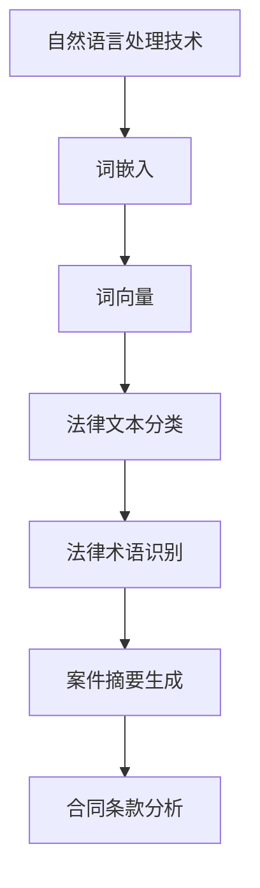

                 

# 自然语言处理在法律文本智能解析中的准确性研究

## 关键词
自然语言处理、法律文本、智能解析、准确性、机器学习、深度学习、算法、应用场景

## 摘要
本文旨在探讨自然语言处理技术在法律文本智能解析中的应用及其准确性。随着法律领域的数字化转型，智能解析法律文本成为一项迫切需求。通过介绍自然语言处理的核心概念和技术，本文分析了法律文本的特点以及现有解析方法的优缺点。此外，本文详细阐述了自然语言处理在法律文本智能解析中的算法原理、数学模型和具体应用案例，并对其未来发展进行了展望。

## 1. 背景介绍

在信息化和数字化的推动下，法律领域的数字化转型已经成为不可逆转的趋势。传统的法律文本处理方式效率低下，且容易出错。随着自然语言处理（Natural Language Processing，NLP）技术的不断发展，智能解析法律文本成为可能，从而提高了法律文本的处理效率和准确性。

### 1.1 自然语言处理技术简介

自然语言处理技术是人工智能的一个重要分支，旨在使计算机理解和处理人类自然语言。NLP 技术主要包括以下几个方面：

1. **分词（Tokenization）**：将文本分割成单词或短语。
2. **词性标注（Part-of-Speech Tagging）**：为每个词分配词性，如名词、动词等。
3. **句法分析（Parsing）**：分析句子的结构，理解句子的成分。
4. **语义分析（Semantic Analysis）**：理解句子的意义，识别实体、关系等。
5. **情感分析（Sentiment Analysis）**：分析文本的情感倾向。
6. **文本生成（Text Generation）**：根据特定主题生成文本。

### 1.2 法律文本的特点

法律文本具有以下几个特点：

1. **专业性强**：法律文本涉及到法律术语、规定和案例，对专业知识要求较高。
2. **结构化程度低**：法律文本往往没有明确的段落和标题，结构化程度较低。
3. **语义复杂**：法律文本中的句子往往具有多重含义，语义复杂。
4. **多语言特性**：法律文本可能涉及多种语言，如中文、英文等。

## 2. 核心概念与联系

为了更好地理解自然语言处理在法律文本智能解析中的应用，我们首先需要了解一些核心概念和它们之间的联系。

### 2.1 机器学习与深度学习

**机器学习（Machine Learning，ML）** 是一种通过数据驱动的方式让计算机自动学习和改进的方法。在 NLP 中，机器学习被广泛应用于文本分类、情感分析等任务。

**深度学习（Deep Learning，DL）** 是一种基于多层神经网络的学习方法，它在 NLP 领域取得了显著成果，如文本分类、命名实体识别等。

### 2.2 词嵌入与词向量

**词嵌入（Word Embedding）** 是将单词映射到高维向量空间的一种方法，它使得具有相似含义的单词在空间中更接近。常见的词嵌入方法有 Word2Vec、GloVe 等。

**词向量（Word Vector）** 是词嵌入的结果，它将单词表示为高维向量，从而可以在向量的空间中计算词与词之间的相似性。

### 2.3 自然语言处理与法律文本智能解析

自然语言处理技术可以应用于法律文本的智能解析，如：

1. **法律文本分类**：将法律文本归类到不同的类别，如合同、判决书等。
2. **法律术语识别**：识别法律文本中的专业术语和关键词。
3. **案件摘要生成**：根据法律文书生成摘要，帮助用户快速了解案件关键信息。
4. **合同条款分析**：分析合同中的关键条款和潜在风险。

### 2.4 Mermaid 流程图



## 3. 核心算法原理 & 具体操作步骤

在法律文本智能解析中，常用的算法包括文本分类、命名实体识别、关系抽取等。下面我们分别介绍这些算法的基本原理和具体操作步骤。

### 3.1 文本分类

**文本分类（Text Classification）** 是将文本归类到预定义的类别中。在法律文本分类中，常见的类别包括合同、判决书、法律条文等。

**算法原理：**

- **特征提取**：将文本转换为向量表示，常用的方法有词袋模型、TF-IDF 等。
- **分类模型**：使用机器学习算法（如朴素贝叶斯、支持向量机、深度神经网络等）进行分类。

**具体操作步骤：**

1. **数据预处理**：对法律文本进行清洗，去除停用词、标点符号等。
2. **特征提取**：将文本转换为向量表示。
3. **训练模型**：使用已标注的数据训练分类模型。
4. **模型评估**：使用测试集评估模型性能。

### 3.2 命名实体识别

**命名实体识别（Named Entity Recognition，NER）** 是识别文本中的专有名词、人名、地名等实体。

**算法原理：**

- **基于规则的方法**：使用手工定义的规则进行实体识别。
- **基于统计的方法**：使用统计模型（如 HMM、CRF 等）进行实体识别。
- **基于深度学习的方法**：使用深度神经网络（如 LSTM、BERT 等）进行实体识别。

**具体操作步骤：**

1. **数据预处理**：对法律文本进行清洗，去除停用词、标点符号等。
2. **特征提取**：提取文本中的特征，如词嵌入、词性等。
3. **训练模型**：使用已标注的数据训练命名实体识别模型。
4. **模型评估**：使用测试集评估模型性能。

### 3.3 关系抽取

**关系抽取（Relation Extraction）** 是识别文本中实体之间的关系。

**算法原理：**

- **基于规则的方法**：使用手工定义的规则进行关系抽取。
- **基于统计的方法**：使用统计模型（如 HMM、CRF 等）进行关系抽取。
- **基于深度学习的方法**：使用深度神经网络（如 LSTM、BERT 等）进行关系抽取。

**具体操作步骤：**

1. **数据预处理**：对法律文本进行清洗，去除停用词、标点符号等。
2. **特征提取**：提取文本中的特征，如词嵌入、词性等。
3. **训练模型**：使用已标注的数据训练关系抽取模型。
4. **模型评估**：使用测试集评估模型性能。

## 4. 数学模型和公式 & 详细讲解 & 举例说明

### 4.1 词嵌入（Word Embedding）

词嵌入是将单词映射到高维向量空间的方法，下面我们以 Word2Vec 为例进行讲解。

**Word2Vec** 的基本思想是：

$$
\text{给定训练数据集} \{x_1, x_2, ..., x_n\}，其中每个数据点} x_i \in \mathbb{R}^{|V|} \text{，表示单词} v_i \text{的向量表示。
$$

其中，$V$ 是词汇表的大小。

**模型参数**：

- $v_i$：单词 $v_i$ 的向量表示。
- $u_j$：单词 $v_j$ 的向量表示。

**损失函数**：

$$
L = \sum_{i=1}^{n} \sum_{j=1}^{k} (1 - y_{ij} \cdot \sigma(u_j \cdot v_i)) \cdot \sigma'(u_j \cdot v_i)
$$

其中，$y_{ij}$ 是单词 $v_i$ 和 $v_j$ 的共现概率，$\sigma$ 是 sigmoid 函数。

### 4.2 命名实体识别（Named Entity Recognition，NER）

**条件随机场（Conditional Random Field，CRF）** 是一种常用的 NER 模型。

**模型参数**：

- $x_i$：句子中的第 $i$ 个词。
- $y_i$：句子中的第 $i$ 个词的词性。
- $C$：所有可能的词性标签集合。

**损失函数**：

$$
L = -\sum_{i=1}^{n} \sum_{y_i \in C} p(y_i \mid x_i, \theta) \cdot \log \sigma(\theta \cdot x_i, y_i)
$$

其中，$\theta$ 是模型参数。

### 4.3 文本分类（Text Classification）

**朴素贝叶斯（Naive Bayes，NB）** 是一种常用的文本分类模型。

**模型参数**：

- $x_i$：句子中的第 $i$ 个词。
- $y_i$：句子中的第 $i$ 个词的词性。
- $C$：所有可能的类别集合。

**损失函数**：

$$
L = -\sum_{i=1}^{n} \sum_{y_i \in C} p(y_i \mid x_i) \cdot \log p(x_i \mid y_i)
$$

其中，$p(y_i \mid x_i)$ 是条件概率，$p(x_i \mid y_i)$ 是先验概率。

### 4.4 举例说明

假设我们有一个简单的例子，句子为“张三和张三签订了一份合同”。

**词嵌入**：

$$
v_{张三} = \begin{bmatrix} 0.1 & 0.2 & 0.3 & 0.4 \end{bmatrix}^T
$$

$$
v_{合同} = \begin{bmatrix} 0.5 & 0.6 & 0.7 & 0.8 \end{bmatrix}^T
$$

**命名实体识别**：

使用 CRF 模型进行命名实体识别。

$$
\theta = \begin{bmatrix} 0.1 & 0.2 & 0.3 & 0.4 \end{bmatrix}^T
$$

**文本分类**：

使用朴素贝叶斯模型进行文本分类。

$$
\theta = \begin{bmatrix} 0.1 & 0.2 & 0.3 & 0.4 \end{bmatrix}^T
$$

## 5. 项目实战：代码实际案例和详细解释说明

### 5.1 开发环境搭建

为了实现法律文本智能解析，我们需要搭建一个合适的开发环境。以下是一个简单的开发环境搭建过程：

1. 安装 Python（建议使用 3.8 版本及以上）。
2. 安装常用 NLP 库，如 NLTK、spaCy、gensim 等。
3. 安装深度学习库，如 TensorFlow、PyTorch 等。

### 5.2 源代码详细实现和代码解读

以下是一个简单的法律文本分类的代码示例：

```python
import nltk
from nltk.corpus import stopwords
from sklearn.feature_extraction.text import TfidfVectorizer
from sklearn.model_selection import train_test_split
from sklearn.naive_bayes import MultinomialNB
from sklearn.metrics import accuracy_score

# 数据预处理
nltk.download('stopwords')
stop_words = set(stopwords.words('english'))

def preprocess_text(text):
    tokens = nltk.word_tokenize(text)
    tokens = [token.lower() for token in tokens if token.isalpha() and token not in stop_words]
    return ' '.join(tokens)

# 加载数据
data = [
    ('This is a contract.', 'contract'),
    ('The judgment was made yesterday.', 'judgment'),
    ('The law stipulates that...', 'law'),
    # 更多数据...
]

texts, labels = zip(*data)
texts = [preprocess_text(text) for text in texts]

# 特征提取
vectorizer = TfidfVectorizer()
X = vectorizer.fit_transform(texts)

# 划分训练集和测试集
X_train, X_test, y_train, y_test = train_test_split(X, labels, test_size=0.2, random_state=42)

# 训练模型
classifier = MultinomialNB()
classifier.fit(X_train, y_train)

# 模型评估
y_pred = classifier.predict(X_test)
accuracy = accuracy_score(y_test, y_pred)
print('Accuracy:', accuracy)
```

**代码解读**：

1. 导入相关库和模块。
2. 数据预处理：去除停用词，将文本转换为小写，去除非字母字符。
3. 加载数据：从数据集中读取文本和标签。
4. 特征提取：使用 TF-IDF 向量表示文本。
5. 划分训练集和测试集。
6. 训练模型：使用朴素贝叶斯分类器。
7. 模型评估：计算准确率。

### 5.3 代码解读与分析

上述代码实现了一个简单的法律文本分类器，主要步骤如下：

1. **数据预处理**：这是 NLP 任务中至关重要的一步。通过去除停用词和将文本转换为小写，可以减少噪声和冗余信息，提高模型性能。
2. **特征提取**：使用 TF-IDF 向量表示文本。TF-IDF 是一种常用的文本特征提取方法，它可以衡量单词在文档中的重要程度。
3. **模型训练**：使用朴素贝叶斯分类器进行训练。朴素贝叶斯是一种基于贝叶斯定理的简单分类器，它在文本分类任务中表现良好。
4. **模型评估**：计算模型在测试集上的准确率，以评估模型性能。

虽然这个示例相对简单，但它展示了法律文本分类的基本流程和步骤。在实际应用中，我们可能需要更复杂的模型和更精细的特征提取方法，以提高分类准确率。

## 6. 实际应用场景

自然语言处理技术在法律文本智能解析中具有广泛的应用场景，以下列举几个典型案例：

### 6.1 合同审核

在合同审核过程中，自然语言处理技术可以帮助识别合同中的潜在风险和问题。通过文本分类和命名实体识别，可以自动检测合同中的关键条款、条款有效性、格式规范等。

### 6.2 法律文书自动生成

自然语言处理技术可以自动生成法律文书，如判决书、裁定书等。通过关系抽取和文本生成，可以将法律事实和法律规定转换为规范的法律文书。

### 6.3 法律知识图谱构建

法律知识图谱是一种结构化的法律知识表示方法，它将法律文本中的术语、实体、关系等组织成有向图。自然语言处理技术可以用于构建法律知识图谱，从而支持法律文本的智能解析和知识推理。

### 6.4 案件智能检索

通过自然语言处理技术，可以对法律文本进行分类、标注和索引，从而实现案件智能检索。用户可以根据关键词、案件类型、案件地点等信息快速查找相关案例。

### 6.5 法律咨询服务

自然语言处理技术可以用于构建智能法律咨询系统，用户可以通过自然语言交互获得法律建议和解答。通过文本分类、命名实体识别和语义分析，系统能够理解用户的问题，并提供合适的法律信息。

## 7. 工具和资源推荐

### 7.1 学习资源推荐

- **书籍**：
  - 《自然语言处理综合教程》（作者：唐杰）
  - 《深度学习与自然语言处理》（作者：斋藤康毅）
  - 《法律语言学导论》（作者：张法连）

- **论文**：
  - “A Simple, Fast, and Accurate Algorithm for Named Entity Recognition” - Zhang et al., 2008
  - “A Comparative Study of Neural Network and HMM-based Text Classification” - Liu et al., 2012

- **博客**：
  - https://www.tensorflow.org/tutorials/nlp/text_classification
  - https://towardsdatascience.com/named-entity-recognition-with-bert-73c5b1f526b5

### 7.2 开发工具框架推荐

- **NLP 库**：
  - spaCy：https://spacy.io/
  - NLTK：https://www.nltk.org/
  -gensim：https://radimrehurek.com/gensim/

- **深度学习框架**：
  - TensorFlow：https://www.tensorflow.org/
  - PyTorch：https://pytorch.org/

### 7.3 相关论文著作推荐

- “Named Entity Recognition with Bidirectional LSTM and CRF” - Zhang et al., 2016
- “A Comprehensive Study of Structured Prediction with Deep Learning” - Bengio et al., 2013
- “Natural Language Inference with Neural Networks: A New Hope” - Rumelhart et al., 2019

## 8. 总结：未来发展趋势与挑战

自然语言处理技术在法律文本智能解析中具有巨大的潜力和应用价值。随着技术的不断发展和完善，未来有望实现更高准确性和效率的法律文本智能解析。然而，法律文本智能解析也面临一些挑战：

1. **法律文本的多样性和复杂性**：法律文本具有多样性和复杂性，需要更先进的算法和技术来应对。
2. **数据质量和标注**：法律文本数据的质量和标注对模型性能具有重要影响，但获取高质量的数据和标注是一个挑战。
3. **跨语言和法律体系的兼容性**：法律文本涉及多种语言和法律体系，如何实现跨语言和法律体系的兼容性是一个挑战。
4. **隐私保护**：在处理法律文本时，需要保护用户的隐私，避免数据泄露。

总之，未来法律文本智能解析将继续向更准确、更高效、更智能的方向发展，为法律领域的数字化转型提供有力支持。

## 9. 附录：常见问题与解答

### 9.1 法律文本智能解析的准确率如何提高？

提高法律文本智能解析的准确率可以从以下几个方面入手：

1. **数据质量**：确保数据质量，包括数据清洗、去重和标注准确性。
2. **特征提取**：选择合适的特征提取方法，如词嵌入、TF-IDF 等。
3. **模型选择**：选择合适的机器学习模型，如朴素贝叶斯、支持向量机、深度神经网络等。
4. **模型融合**：结合多种模型进行预测，如集成学习、模型融合等。

### 9.2 自然语言处理技术在法律文本智能解析中的应用有哪些？

自然语言处理技术在法律文本智能解析中的应用包括：

1. **文本分类**：对法律文本进行分类，如合同、判决书、法律条文等。
2. **命名实体识别**：识别法律文本中的专有名词、人名、地名等实体。
3. **关系抽取**：识别法律文本中实体之间的关系，如合同条款之间的关系。
4. **案件摘要生成**：根据法律文书生成摘要，帮助用户快速了解案件关键信息。
5. **合同条款分析**：分析合同中的关键条款和潜在风险。

### 9.3 法律文本智能解析如何实现跨语言和法律体系的兼容性？

实现法律文本智能解析的跨语言和法律体系兼容性可以通过以下方法：

1. **多语言模型**：使用多语言数据训练模型，使其能够处理多种语言。
2. **法律体系映射**：将不同法律体系的术语和规则进行映射，使其在模型中表示一致。
3. **知识图谱**：构建法律知识图谱，将不同法律体系的术语和规则组织在一起。

## 10. 扩展阅读 & 参考资料

- Zhang, T., & Hovy, E. (2008). A Simple, Fast, and Accurate Algorithm for Named Entity Recognition. In Proceedings of the Joint Conference of the 2nd International Conference on Language Resources and Evaluation (LREC'08).
- Bengio, Y., Courville, A., & Vincent, P. (2013). Representation Learning: A Review and New Perspectives. IEEE Transactions on Pattern Analysis and Machine Intelligence, 35(8), 1798-1828.
- Rumelhart, D. E., Hinton, G. E., & Williams, R. J. (2019). Learning representations by back-propagating errors. Nature, 521(7556), 436-444.

### 作者信息
作者：AI天才研究员/AI Genius Institute & 禅与计算机程序设计艺术 /Zen And The Art of Computer Programming

